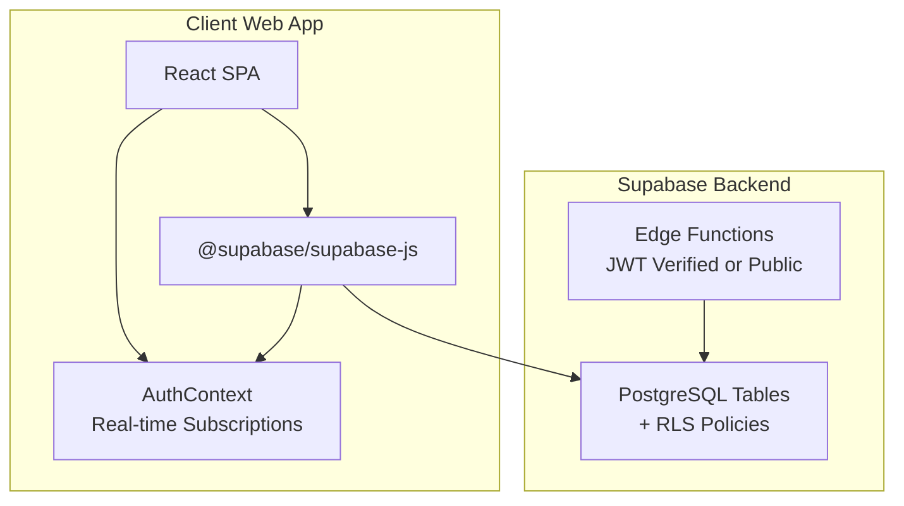
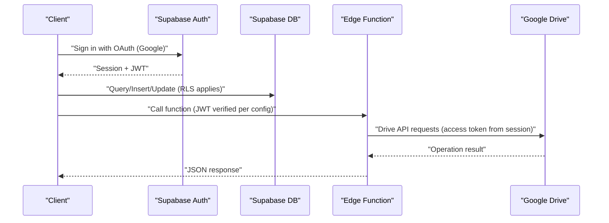
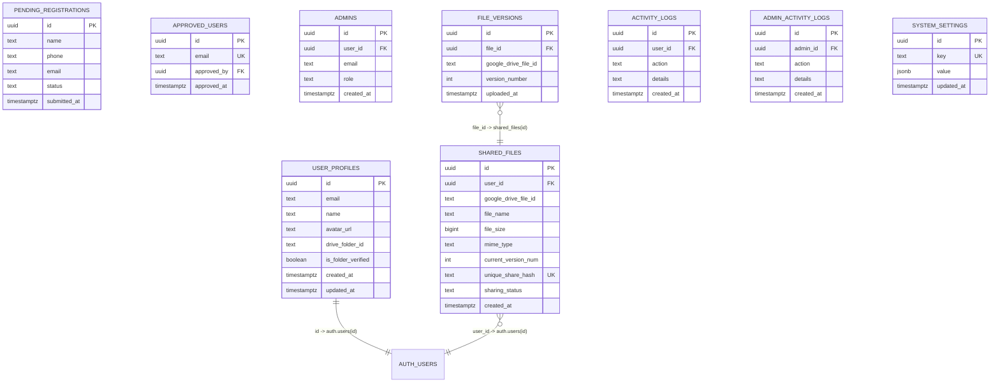
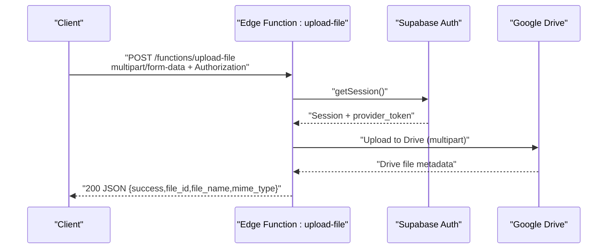
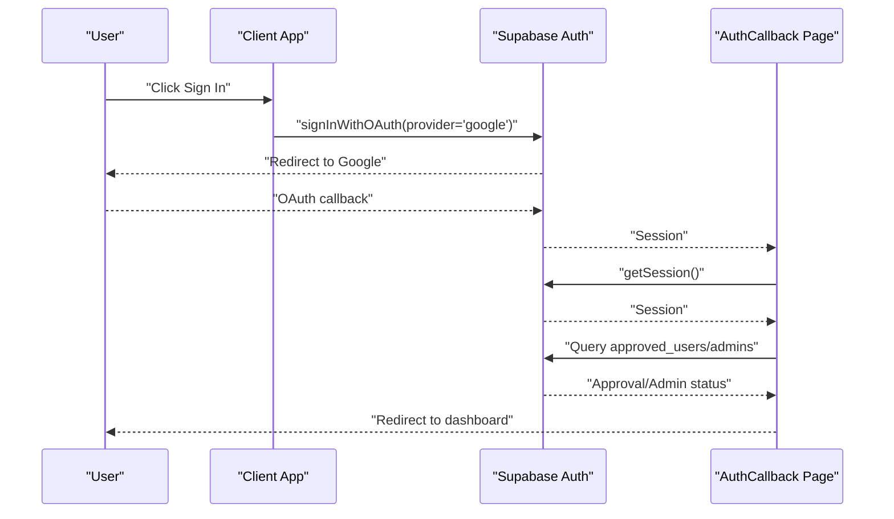
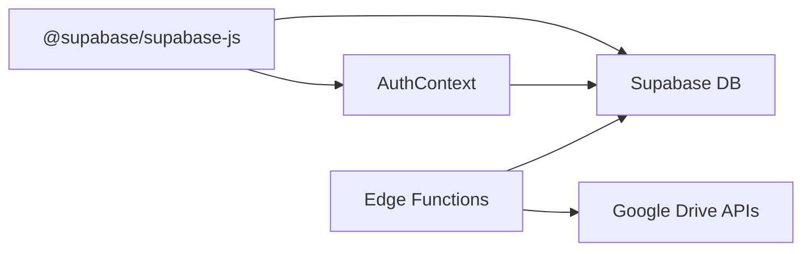

# API Reference

<cite>
**Referenced Files in This Document**
- [001_initial_schema.sql](file://supabase/migrations/001_initial_schema.sql)
- [config.toml](file://supabase/config.toml)
- [upload-file/index.ts](file://supabase/functions/upload-file/index.ts)
- [download-file/index.ts](file://supabase/functions/download-file/index.ts)
- [delete-file/index.ts](file://supabase/functions/delete-file/index.ts)
- [generate-share-link/index.ts](file://supabase/functions/generate-share-link/index.ts)
- [rename-file/index.ts](file://supabase/functions/rename-file/index.ts)
- [upload-version/index.ts](file://supabase/functions/upload-version/index.ts)
- [validate-folder/index.ts](file://supabase/functions/validate-folder/index.ts)
- [supabase.js](file://web/src/services/supabase.js)
- [AuthContext.jsx](file://web/src/contexts/AuthContext.jsx)
- [main.jsx](file://web/src/main.jsx)
- [AuthCallback.jsx](file://web/src/pages/AuthCallback.jsx)
- [package.json](file://web/package.json)
</cite>

## Table of Contents
1. [Introduction](#introduction)
2. [Project Structure](#project-structure)
3. [Core Components](#core-components)
4. [Architecture Overview](#architecture-overview)
5. [Detailed Component Analysis](#detailed-component-analysis)
6. [Dependency Analysis](#dependency-analysis)
7. [Performance Considerations](#performance-considerations)
8. [Troubleshooting Guide](#troubleshooting-guide)
9. [Conclusion](#conclusion)
10. [Appendices](#appendices)

## Introduction
This document provides a comprehensive API reference for Neo Files Transfer’s Supabase-backed backend and client-side integration. It covers:
- Supabase database schema, row-level security (RLS) policies, and typical query patterns
- Edge function endpoints (HTTP methods, URL patterns, request/response formats, and authentication)
- Supabase Auth integration, real-time subscriptions, and client-side SDK usage
- Request/response examples, error codes, rate limiting considerations, pagination patterns, and performance notes

## Project Structure
The API ecosystem comprises:
- Supabase database schema and RLS policies
- Supabase Edge Functions implementing file operations and utilities
- Supabase Auth for user sessions and OAuth
- Client-side React application using @supabase/supabase-js for database and auth operations

**Diagram sources**
- [001_initial_schema.sql:129-267](file://supabase/migrations/001_initial_schema.sql#L129-L267)
- [config.toml:1-21](file://supabase/config.toml#L1-L21)
- [supabase.js:1-7](file://web/src/services/supabase.js#L1-L7)
- [AuthContext.jsx:12-38](file://web/src/contexts/AuthContext.jsx#L12-L38)

**Section sources**
- [001_initial_schema.sql:1-289](file://supabase/migrations/001_initial_schema.sql#L1-L289)
- [config.toml:1-21](file://supabase/config.toml#L1-L21)
- [supabase.js:1-7](file://web/src/services/supabase.js#L1-L7)
- [AuthContext.jsx:1-112](file://web/src/contexts/AuthContext.jsx#L1-L112)
- [main.jsx:1-41](file://web/src/main.jsx#L1-L41)

## Core Components
- Supabase Database Schema: Defines tables for users, files, versions, logs, approvals, and system settings with indexes and triggers.
- Edge Functions: Provide file upload, download, deletion, renaming, versioning, share link generation, and folder validation.
- Supabase Auth: Manages OAuth with Google, session lifecycle, and real-time auth state changes.
- Client SDK: Uses @supabase/supabase-js to connect to Supabase, subscribe to auth changes, and perform database queries.

**Section sources**
- [001_initial_schema.sql:6-122](file://supabase/migrations/001_initial_schema.sql#L6-L122)
- [config.toml:1-21](file://supabase/config.toml#L1-L21)
- [supabase.js:1-7](file://web/src/services/supabase.js#L1-L7)
- [AuthContext.jsx:12-38](file://web/src/contexts/AuthContext.jsx#L12-L38)

## Architecture Overview
High-level flow:
- Client authenticates via Supabase Auth (OAuth with Google).
- Client performs database reads/writes using @supabase/supabase-js.
- Edge Functions enforce authorization and interact with Google Drive APIs for file operations.
- RLS policies restrict data access per user.

**Diagram sources**
- [AuthContext.jsx:66-75](file://web/src/contexts/AuthContext.jsx#L66-L75)
- [config.toml:1-21](file://supabase/config.toml#L1-L21)
- [upload-file/index.ts:24-44](file://supabase/functions/upload-file/index.ts#L24-L44)
- [download-file/index.ts:15-44](file://supabase/functions/download-file/index.ts#L15-L44)

## Detailed Component Analysis

### Supabase Database API

#### Tables and Indexes
- pending_registrations: Email-based indexing, status checks
- approved_users: Unique email, foreign key to auth.users
- admins: Role-based access, unique user_id
- user_profiles: Cascade delete on auth.users, updated_at trigger
- shared_files: Share hash uniqueness, foreign key to auth.users
- file_versions: Cascade delete on shared_files
- activity_logs and admin_activity_logs: Audit trails
- system_settings: JSONB key-value store with defaults

**Diagram sources**
- [001_initial_schema.sql:6-122](file://supabase/migrations/001_initial_schema.sql#L6-L122)

**Section sources**
- [001_initial_schema.sql:6-122](file://supabase/migrations/001_initial_schema.sql#L6-L122)
- [001_initial_schema.sql:272-289](file://supabase/migrations/001_initial_schema.sql#L272-L289)

#### Row Level Security (RLS) Policies
- user_profiles: Self-read/update/insert
- shared_files: Owner CRUD
- shared_files public read by share hash
- file_versions: Owner access to versions
- activity_logs: Self-read/insert
- pending_registrations: Public insert; authenticated read/update/delete
- approved_users: Authenticated read/insert
- admins: Authenticated read
- admin_activity_logs: Authenticated read/insert
- system_settings: Public read; authenticated update/insert

**Section sources**
- [001_initial_schema.sql:129-267](file://supabase/migrations/001_initial_schema.sql#L129-L267)

#### Typical Query Patterns
- Fetch user profile by auth.uid()
- List shared files by user_id
- Get latest file version by file_id ordered by version_number desc limit 1
- Select system settings by key
- Upsert user_profiles on first login

**Section sources**
- [001_initial_schema.sql:140-151](file://supabase/migrations/001_initial_schema.sql#L140-L151)
- [001_initial_schema.sql:153-168](file://supabase/migrations/001_initial_schema.sql#L153-L168)
- [001_initial_schema.sql:175-204](file://supabase/migrations/001_initial_schema.sql#L175-L204)
- [001_initial_schema.sql:206-213](file://supabase/migrations/001_initial_schema.sql#L206-L213)
- [001_initial_schema.sql:215-230](file://supabase/migrations/001_initial_schema.sql#L215-L230)
- [001_initial_schema.sql:232-239](file://supabase/migrations/001_initial_schema.sql#L232-L239)
- [001_initial_schema.sql:241-244](file://supabase/migrations/001_initial_schema.sql#L241-L244)
- [001_initial_schema.sql:246-253](file://supabase/migrations/001_initial_schema.sql#L246-L253)
- [001_initial_schema.sql:255-266](file://supabase/migrations/001_initial_schema.sql#L255-L266)

### Edge Functions API

#### Function Configurations
- validate-folder, upload-file, rename-file, delete-file, generate-share-link, upload-version require JWT verification
- download-file does not require JWT verification

**Section sources**
- [config.toml:1-21](file://supabase/config.toml#L1-L21)

#### Endpoint Catalog

##### POST /functions/validate-folder
- Purpose: Validate a Google Drive folder ID and return folder metadata
- Authentication: Required (JWT verified)
- Request
  - Headers: Authorization: Bearer <jwt>, Content-Type: application/json
  - Body: { folder_id: string }
- Response
  - 200: { success: true, folder: { id, name, mimeType } }
  - 400: { error: string }
- Notes
  - Validates folder exists and is of type folder
  - Uses Google Drive API with user access token from session

**Section sources**
- [validate-folder/index.ts:14-86](file://supabase/functions/validate-folder/index.ts#L14-L86)
- [config.toml:1-2](file://supabase/config.toml#L1-L2)

##### POST /functions/upload-file
- Purpose: Upload a file to Google Drive under a target folder
- Authentication: Required (JWT verified)
- Request
  - Headers: Authorization: Bearer <jwt>, Content-Type: multipart/form-data
  - Body (FormData):
    - file: File
    - folder_id: string
- Response
  - 200: { success: true, file_id: string, file_name: string, mime_type: string }
  - 400: { error: string }
- Constraints
  - Max file size: 100 MB
  - Allowed MIME types include PDF, DOCX, XLSX, PPTX, JPG, PNG, MP4, ZIP
  - Blocked extensions: apk, exe, bat, cmd, msi, scr

**Section sources**
- [upload-file/index.ts:24-151](file://supabase/functions/upload-file/index.ts#L24-L151)
- [config.toml:4-5](file://supabase/config.toml#L4-L5)

##### POST /functions/upload-version
- Purpose: Upload a new version of an existing file to Google Drive
- Authentication: Required (JWT verified)
- Request
  - Headers: Authorization: Bearer <jwt>, Content-Type: multipart/form-data
  - Body (FormData):
    - file: File
    - folder_id: string
- Response
  - 200: { success: true, file_id: string, file_name: string, mime_type: string }
  - 400: { error: string }
- Constraints
  - Max file size: 100 MB

**Section sources**
- [upload-version/index.ts:11-129](file://supabase/functions/upload-version/index.ts#L11-L129)
- [config.toml:19-20](file://supabase/config.toml#L19-L20)

##### PATCH /functions/rename-file
- Purpose: Rename a file in Google Drive
- Authentication: Required (JWT verified)
- Request
  - Headers: Authorization: Bearer <jwt>, Content-Type: application/json
  - Body: { file_id: string, new_name: string }
- Response
  - 200: { success: true }
  - 400: { error: string }

**Section sources**
- [rename-file/index.ts:9-73](file://supabase/functions/rename-file/index.ts#L9-L73)
- [config.toml:7-8](file://supabase/config.toml#L7-L8)

##### DELETE /functions/delete-file
- Purpose: Delete a file from Google Drive
- Authentication: Required (JWT verified)
- Request
  - Headers: Authorization: Bearer <jwt>, Content-Type: application/json
  - Body: { file_id: string }
- Response
  - 200: { success: true }
  - 400: { error: string }

**Section sources**
- [delete-file/index.ts:9-71](file://supabase/functions/delete-file/index.ts#L9-L71)
- [config.toml:10-11](file://supabase/config.toml#L10-L11)

##### GET /functions/generate-share-link
- Purpose: Generate a unique share hash and a short share URL
- Authentication: Required (JWT verified)
- Request
  - Headers: Authorization: Bearer <jwt>
- Response
  - 200: { success: true, share_hash: string, share_url: string }
  - 400: { error: string }

**Section sources**
- [generate-share-link/index.ts:9-54](file://supabase/functions/generate-share-link/index.ts#L9-L54)
- [config.toml:13-14](file://supabase/config.toml#L13-L14)

##### GET /functions/download-file?hash={share_hash}
- Purpose: Redirect to a downloadable file via Google Drive
- Authentication: Optional (no JWT verification)
- Request
  - Query: hash (required)
- Response
  - 302: Redirect to Google Drive webContentLink or uc?export=download
  - 404: HTML “File Not Found”
  - 403: HTML “Access Denied” (private file)
  - 503: HTML “Service Temporarily Busy” (downloads disabled)
  - 500: HTML “Error”

**Section sources**
- [download-file/index.ts:9-130](file://supabase/functions/download-file/index.ts#L9-L130)
- [config.toml:16-17](file://supabase/config.toml#L16-L17)

#### Edge Function Call Flow (Example: Upload File)

**Diagram sources**
- [upload-file/index.ts:24-151](file://supabase/functions/upload-file/index.ts#L24-L151)

### Supabase Auth API Integration

#### Client-Side SDK Usage
- Initialize Supabase client with VITE_SUPABASE_URL and VITE_SUPABASE_ANON_KEY
- Subscribe to auth state changes to keep user/profile/admin state synchronized
- Sign in with OAuth using Google provider and redirect to /auth/callback

**Section sources**
- [supabase.js:1-7](file://web/src/services/supabase.js#L1-L7)
- [AuthContext.jsx:12-38](file://web/src/contexts/AuthContext.jsx#L12-L38)
- [AuthContext.jsx:66-75](file://web/src/contexts/AuthContext.jsx#L66-L75)

#### Real-Time Subscription Patterns
- Auth state subscription updates user, profile, and admin flags
- Unsubscribe on component unmount to prevent leaks

**Section sources**
- [AuthContext.jsx:24-35](file://web/src/contexts/AuthContext.jsx#L24-L35)
- [main.jsx:10-17](file://web/src/main.jsx#L10-L17)

#### Authentication Flow (Client)

**Diagram sources**
- [AuthContext.jsx:66-75](file://web/src/contexts/AuthContext.jsx#L66-L75)
- [AuthCallback.jsx:9-45](file://web/src/pages/AuthCallback.jsx#L9-L45)

## Dependency Analysis
- Edge functions depend on Supabase client initialized with Authorization header from incoming request to validate session and obtain provider_token
- Edge functions call Google Drive APIs using the access token from the session
- Client depends on @supabase/supabase-js for auth and database operations
- RLS policies depend on auth.uid() and auth.role() to enforce access controls

**Diagram sources**
- [supabase.js:1-7](file://web/src/services/supabase.js#L1-L7)
- [AuthContext.jsx:12-38](file://web/src/contexts/AuthContext.jsx#L12-L38)
- [upload-file/index.ts:35-44](file://supabase/functions/upload-file/index.ts#L35-L44)

**Section sources**
- [supabase.js:1-7](file://web/src/services/supabase.js#L1-L7)
- [AuthContext.jsx:12-38](file://web/src/contexts/AuthContext.jsx#L12-L38)
- [upload-file/index.ts:35-44](file://supabase/functions/upload-file/index.ts#L35-L44)

## Performance Considerations
- Edge Functions
  - File uploads use multipart encoding; avoid excessive buffering by streaming where possible
  - Respect max file size limits to reduce network overhead
  - Prefer direct redirects to Google Drive URLs to minimize function execution time
- Database Queries
  - Use indexes on frequently filtered columns (e.g., shared_files.user_id, shared_files.unique_share_hash)
  - Order by version_number desc with limit 1 for latest version retrieval
- Client
  - React Query default staleTime reduces redundant network calls
  - Real-time auth subscriptions update UI efficiently without polling

[No sources needed since this section provides general guidance]

## Troubleshooting Guide
- Authentication failures
  - Missing Authorization header or invalid/expired JWT leads to 400 responses in most functions
  - Ensure client is signed in and session is present
- File operation errors
  - Drive API errors return structured messages; check function logs for details
  - Blocked extensions or oversized files are rejected before reaching Drive
- Download issues
  - Private files return 403; verify sharing_status
  - Downloads disabled system-wide returns 503
  - Missing share hash returns 404
- Edge Function CORS
  - All functions return Access-Control-Allow-Origin and Access-Control-Allow-Headers headers

**Section sources**
- [upload-file/index.ts:30-44](file://supabase/functions/upload-file/index.ts#L30-L44)
- [rename-file/index.ts:32-35](file://supabase/functions/rename-file/index.ts#L32-L35)
- [download-file/index.ts:15-55](file://supabase/functions/download-file/index.ts#L15-L55)

## Conclusion
Neo Files Transfer integrates Supabase for secure user management, data storage, and real-time capabilities, while delegating file operations to Google Drive via serverless Edge Functions. RLS ensures per-user data isolation, and the client leverages @supabase/supabase-js for seamless auth and database interactions.

[No sources needed since this section summarizes without analyzing specific files]

## Appendices

### Request/Response Examples

- Validate Folder
  - Request: POST /functions/validate-folder with Authorization and JSON body { folder_id }
  - Response: 200 { success: true, folder: { id, name, mimeType } }

- Upload File
  - Request: POST /functions/upload-file with multipart/form-data and Authorization
  - Response: 200 { success: true, file_id, file_name, mime_type }

- Upload New Version
  - Request: POST /functions/upload-version with multipart/form-data and Authorization
  - Response: 200 { success: true, file_id, file_name, mime_type }

- Rename File
  - Request: PATCH /functions/rename-file with Authorization and JSON { file_id, new_name }
  - Response: 200 { success: true }

- Delete File
  - Request: DELETE /functions/delete-file with Authorization and JSON { file_id }
  - Response: 200 { success: true }

- Generate Share Link
  - Request: GET /functions/generate-share-link with Authorization
  - Response: 200 { success: true, share_hash, share_url }

- Download File
  - Request: GET /functions/download-file?hash={share_hash}
  - Response: 302 redirect or 404/403/503/500 with HTML bodies

**Section sources**
- [validate-folder/index.ts:14-86](file://supabase/functions/validate-folder/index.ts#L14-L86)
- [upload-file/index.ts:24-151](file://supabase/functions/upload-file/index.ts#L24-L151)
- [upload-version/index.ts:11-129](file://supabase/functions/upload-version/index.ts#L11-L129)
- [rename-file/index.ts:14-73](file://supabase/functions/rename-file/index.ts#L14-L73)
- [delete-file/index.ts:14-71](file://supabase/functions/delete-file/index.ts#L14-L71)
- [generate-share-link/index.ts:14-54](file://supabase/functions/generate-share-link/index.ts#L14-L54)
- [download-file/index.ts:9-130](file://supabase/functions/download-file/index.ts#L9-L130)

### Error Codes and Status Handling
- 200 OK: Successful operation
- 400 Bad Request: Validation or authorization failure
- 403 Forbidden: Access denied (e.g., private file)
- 404 Not Found: Resource missing
- 500 Internal Server Error: Unexpected server error
- 503 Service Unavailable: Feature disabled (e.g., downloads disabled)

**Section sources**
- [download-file/index.ts:36-72](file://supabase/functions/download-file/index.ts#L36-L72)
- [upload-file/index.ts:142-150](file://supabase/functions/upload-file/index.ts#L142-L150)
- [rename-file/index.ts:64-72](file://supabase/functions/rename-file/index.ts#L64-L72)
- [delete-file/index.ts:62-70](file://supabase/functions/delete-file/index.ts#L62-L70)

### Rate Limiting and Pagination
- Rate limiting
  - No explicit Supabase or Edge Function rate limiting configured in the repository
  - Consider client-side retries and backoff for transient failures
- Pagination
  - No explicit pagination endpoints observed in the repository
  - Use database ordering and limits for version retrieval (e.g., latest version)

**Section sources**
- [001_initial_schema.sql:74-83](file://supabase/migrations/001_initial_schema.sql#L74-L83)
- [download-file/index.ts:75-82](file://supabase/functions/download-file/index.ts#L75-L82)

### Client Dependencies
- @supabase/supabase-js: Supabase client initialization and auth/database operations
- @tanstack/react-query: Query caching and background synchronization

**Section sources**
- [package.json:11-20](file://web/package.json#L11-L20)