# Authentication API

<cite>
**Referenced Files in This Document**
- [AuthContext.jsx](file://web/src/contexts/AuthContext.jsx)
- [supabase.js](file://web/src/services/supabase.js)
- [LoginPage.jsx](file://web/src/pages/LoginPage.jsx)
- [AuthCallback.jsx](file://web/src/pages/AuthCallback.jsx)
- [App.jsx](file://web/src/App.jsx)
- [AdminDashboardPage.jsx](file://web/src/pages/AdminDashboardPage.jsx)
- [SettingsPage.jsx](file://web/src/pages/SettingsPage.jsx)
- [DashboardPage.jsx](file://web/src/pages/DashboardPage.jsx)
- [helpers.js](file://web/src/utils/helpers.js)
- [config.toml](file://supabase/config.toml)
- [001_initial_schema.sql](file://supabase/migrations/001_initial_schema.sql)
- [package.json](file://web/package.json)
</cite>

## Table of Contents
1. [Introduction](#introduction)
2. [Project Structure](#project-structure)
3. [Core Components](#core-components)
4. [Architecture Overview](#architecture-overview)
5. [Detailed Component Analysis](#detailed-component-analysis)
6. [Dependency Analysis](#dependency-analysis)
7. [Performance Considerations](#performance-considerations)
8. [Troubleshooting Guide](#troubleshooting-guide)
9. [Conclusion](#conclusion)
10. [Appendices](#appendices)

## Introduction
This document provides comprehensive authentication API documentation for Supabase Auth integration. It covers OAuth flow with Google provider, session management, JWT token handling, sign-in/sign-out methods, user registration patterns, and password reset functionality. It also details role-based access control (admin vs regular users), session persistence, automatic token refresh, AuthContext usage in React components, protected route implementations, authentication state management, error handling for authentication failures, session expiration, and permission denials. Examples of programmatic authentication checks and user profile management are included.

## Project Structure
The authentication system spans client-side React components and server-side Supabase configuration:
- Client-side authentication context and pages
- Supabase client initialization
- Supabase configuration for JWT verification on functions
- Database schema supporting user profiles, approvals, and admin roles

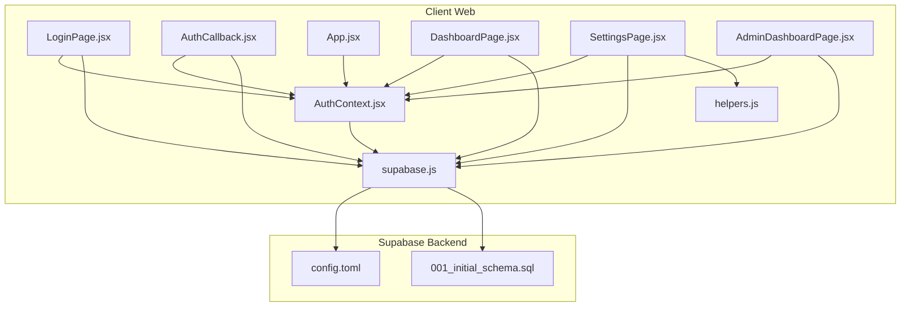

**Diagram sources**
- [AuthContext.jsx:1-112](file://web/src/contexts/AuthContext.jsx#L1-L112)
- [LoginPage.jsx:1-77](file://web/src/pages/LoginPage.jsx#L1-L77)
- [AuthCallback.jsx:1-84](file://web/src/pages/AuthCallback.jsx#L1-L84)
- [App.jsx:1-92](file://web/src/App.jsx#L1-L92)
- [DashboardPage.jsx:1-177](file://web/src/pages/DashboardPage.jsx#L1-L177)
- [SettingsPage.jsx:1-251](file://web/src/pages/SettingsPage.jsx#L1-L251)
- [AdminDashboardPage.jsx:1-436](file://web/src/pages/AdminDashboardPage.jsx#L1-L436)
- [supabase.js:1-7](file://web/src/services/supabase.js#L1-L7)
- [helpers.js:1-52](file://web/src/utils/helpers.js#L1-L52)
- [config.toml:1-21](file://supabase/config.toml#L1-L21)
- [001_initial_schema.sql:1-289](file://supabase/migrations/001_initial_schema.sql#L1-L289)

**Section sources**
- [AuthContext.jsx:1-112](file://web/src/contexts/AuthContext.jsx#L1-L112)
- [supabase.js:1-7](file://web/src/services/supabase.js#L1-L7)
- [config.toml:1-21](file://supabase/config.toml#L1-L21)
- [001_initial_schema.sql:1-289](file://supabase/migrations/001_initial_schema.sql#L1-L289)

## Core Components
- Supabase client initialization
- Authentication context managing user, profile, admin status, and loading state
- Login page triggering Google OAuth
- Auth callback handling approval checks and profile creation
- Protected and admin route guards
- Settings page for profile updates and Google Drive folder verification
- Admin dashboard for user approvals and system settings

**Section sources**
- [supabase.js:1-7](file://web/src/services/supabase.js#L1-L7)
- [AuthContext.jsx:1-112](file://web/src/contexts/AuthContext.jsx#L1-L112)
- [LoginPage.jsx:1-77](file://web/src/pages/LoginPage.jsx#L1-L77)
- [AuthCallback.jsx:1-84](file://web/src/pages/AuthCallback.jsx#L1-L84)
- [App.jsx:28-41](file://web/src/App.jsx#L28-L41)
- [SettingsPage.jsx:1-251](file://web/src/pages/SettingsPage.jsx#L1-L251)
- [AdminDashboardPage.jsx:1-436](file://web/src/pages/AdminDashboardPage.jsx#L1-L436)

## Architecture Overview
The authentication architecture integrates Supabase Auth with a React SPA:
- OAuth with Google initiated from the login page
- Supabase handles session persistence and emits auth state changes
- Auth context loads user profile and admin status
- Protected routes enforce authentication and admin privileges
- Callback page validates user approval and creates profiles
- Settings and admin dashboards manage user data and system controls

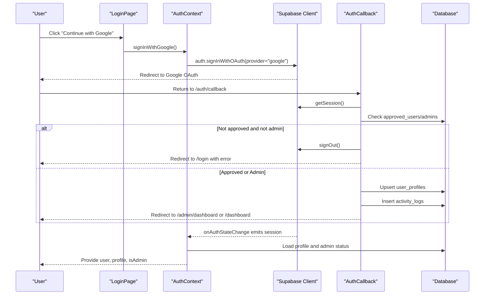

**Diagram sources**
- [LoginPage.jsx:17-28](file://web/src/pages/LoginPage.jsx#L17-L28)
- [AuthContext.jsx:66-82](file://web/src/contexts/AuthContext.jsx#L66-L82)
- [AuthCallback.jsx:9-73](file://web/src/pages/AuthCallback.jsx#L9-L73)
- [001_initial_schema.sql:19-51](file://supabase/migrations/001_initial_schema.sql#L19-L51)

## Detailed Component Analysis

### Authentication Context (AuthContext)
AuthContext centralizes authentication state and actions:
- Initializes session and subscribes to auth state changes
- Loads user profile and determines admin status
- Provides sign-in with Google, sign-out, and profile refresh functions
- Exposes user, profile, isAdmin, and loading state

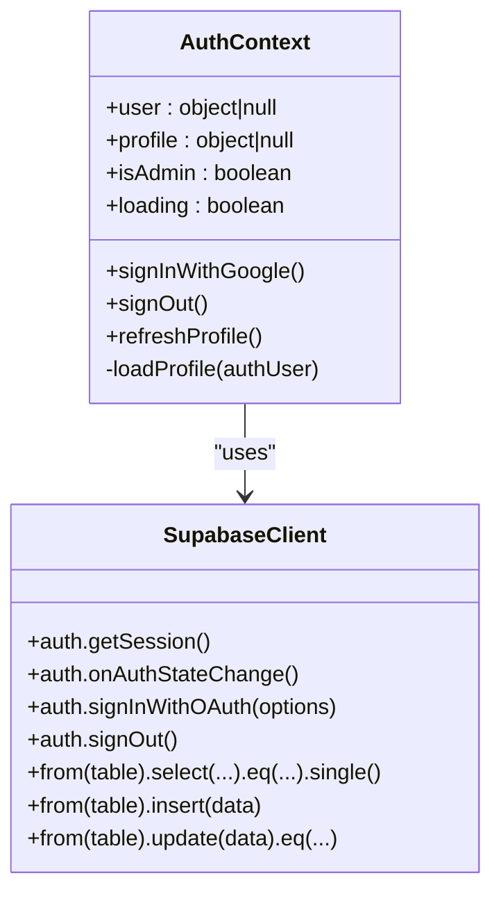

**Diagram sources**
- [AuthContext.jsx:6-112](file://web/src/contexts/AuthContext.jsx#L6-L112)
- [supabase.js:1-7](file://web/src/services/supabase.js#L1-L7)

**Section sources**
- [AuthContext.jsx:6-112](file://web/src/contexts/AuthContext.jsx#L6-L112)

### OAuth with Google Provider
- Login page triggers sign-in with Google via AuthContext
- Redirect URI configured to `/auth/callback`
- Scopes requested include profile, email, and Drive access

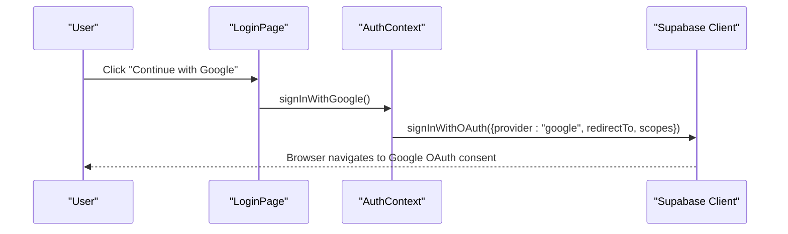

**Diagram sources**
- [LoginPage.jsx:17-28](file://web/src/pages/LoginPage.jsx#L17-L28)
- [AuthContext.jsx:66-75](file://web/src/contexts/AuthContext.jsx#L66-L75)

**Section sources**
- [LoginPage.jsx:17-28](file://web/src/pages/LoginPage.jsx#L17-L28)
- [AuthContext.jsx:66-75](file://web/src/contexts/AuthContext.jsx#L66-L75)

### Auth Callback and Approval Checks
- Retrieves session and validates user against approved users or admins
- Creates user profile if missing and logs activity
- Redirects based on role

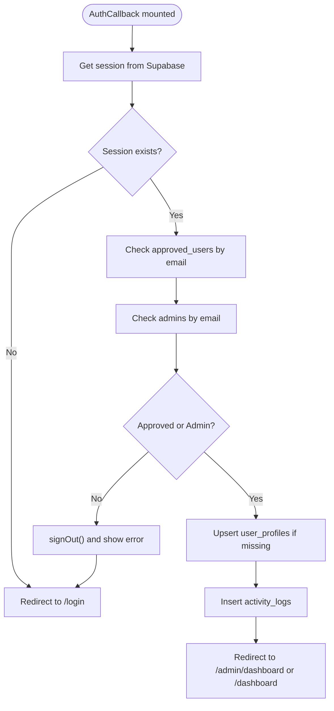

**Diagram sources**
- [AuthCallback.jsx:9-73](file://web/src/pages/AuthCallback.jsx#L9-L73)
- [001_initial_schema.sql:19-51](file://supabase/migrations/001_initial_schema.sql#L19-L51)

**Section sources**
- [AuthCallback.jsx:9-73](file://web/src/pages/AuthCallback.jsx#L9-L73)

### Session Management and Token Handling
- Session persistence is handled by Supabase Auth
- Auth state change listener updates context state
- Automatic token refresh occurs internally by Supabase client
- JWT verification enforced on selected functions via Supabase config

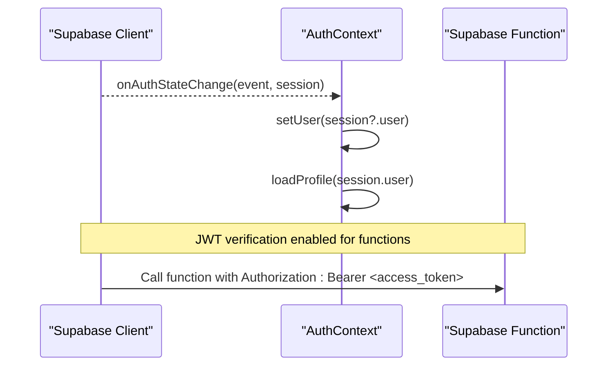

**Diagram sources**
- [AuthContext.jsx:23-35](file://web/src/contexts/AuthContext.jsx#L23-L35)
- [config.toml:1-21](file://supabase/config.toml#L1-L21)

**Section sources**
- [AuthContext.jsx:12-38](file://web/src/contexts/AuthContext.jsx#L12-L38)
- [config.toml:1-21](file://supabase/config.toml#L1-L21)

### Protected Routes and Role-Based Access Control
- ProtectedRoute enforces authentication for dashboard routes
- AdminRoute enforces admin role in addition to authentication
- AdminLayout wraps admin-only pages

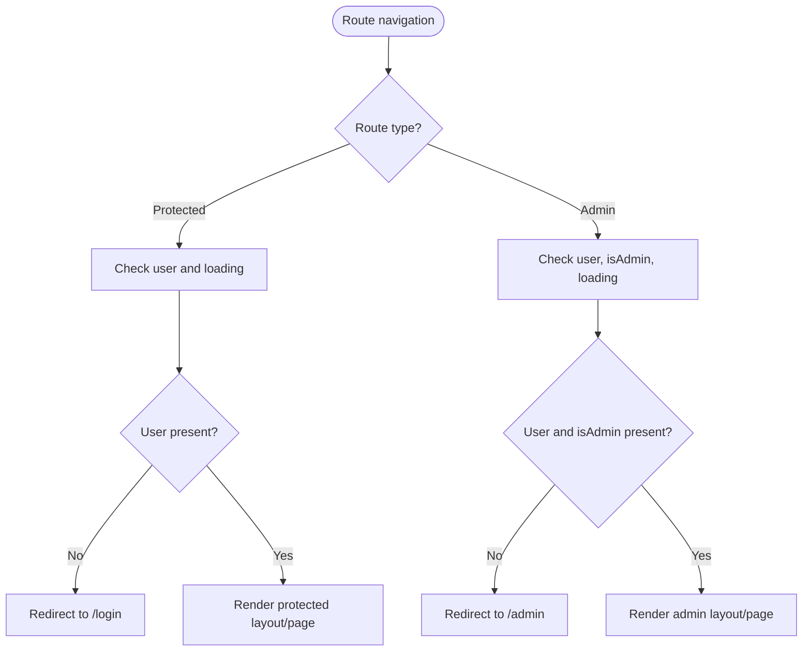

**Diagram sources**
- [App.jsx:28-41](file://web/src/App.jsx#L28-L41)

**Section sources**
- [App.jsx:28-41](file://web/src/App.jsx#L28-L41)

### User Registration Patterns and Approval Workflow
- Pending registrations stored in `pending_registrations`
- Admins approve or reject pending users
- Approved users moved to `approved_users`
- Admins tracked in `admins` table

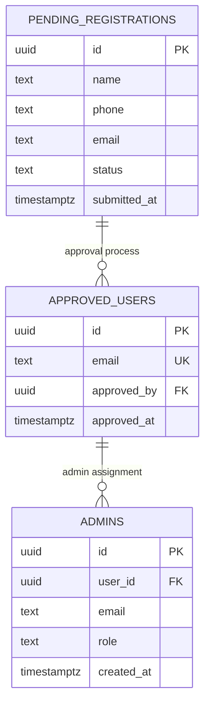

**Diagram sources**
- [001_initial_schema.sql:6-122](file://supabase/migrations/001_initial_schema.sql#L6-L122)

**Section sources**
- [001_initial_schema.sql:6-122](file://supabase/migrations/001_initial_schema.sql#L6-L122)
- [AdminDashboardPage.jsx:47-95](file://web/src/pages/AdminDashboardPage.jsx#L47-L95)

### Password Reset Functionality
- Supabase Auth supports passwordless magic links and password resets
- Triggered via Supabase client auth methods
- UI components can initiate reset flows and handle errors

**Section sources**
- [AuthContext.jsx:66-82](file://web/src/contexts/AuthContext.jsx#L66-L82)

### User Profile Management
- Profile loaded from `user_profiles` table
- Fields include id, email, name, avatar_url, drive_folder_id, verification status
- Profile updates supported via Settings page

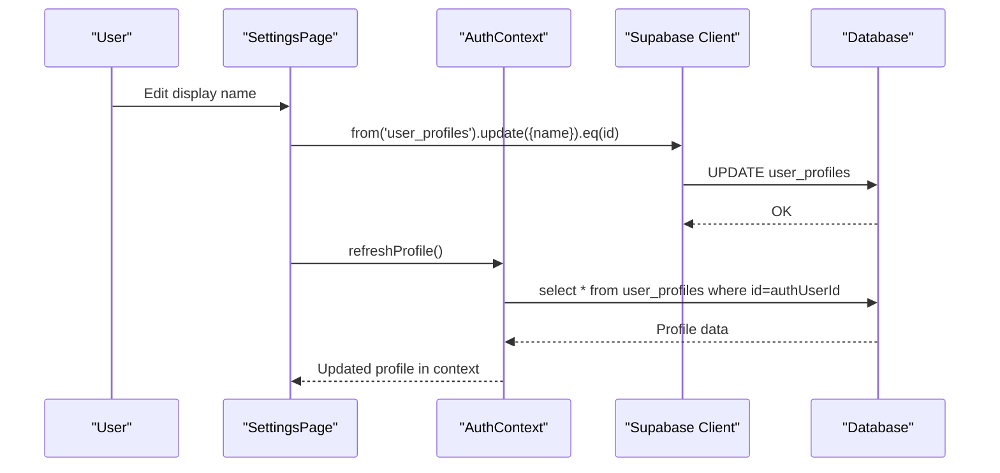

**Diagram sources**
- [SettingsPage.jsx:24-40](file://web/src/pages/SettingsPage.jsx#L24-L40)
- [AuthContext.jsx:84-88](file://web/src/contexts/AuthContext.jsx#L84-L88)
- [001_initial_schema.sql:41-51](file://supabase/migrations/001_initial_schema.sql#L41-L51)

**Section sources**
- [SettingsPage.jsx:24-40](file://web/src/pages/SettingsPage.jsx#L24-L40)
- [AuthContext.jsx:40-64](file://web/src/contexts/AuthContext.jsx#L40-L64)
- [001_initial_schema.sql:41-51](file://supabase/migrations/001_initial_schema.sql#L41-L51)

### Google Drive Folder Verification
- Extracts folder ID from Google Drive URL
- Calls Supabase function `validate-folder` with JWT bearer token
- Updates profile with verified folder ID

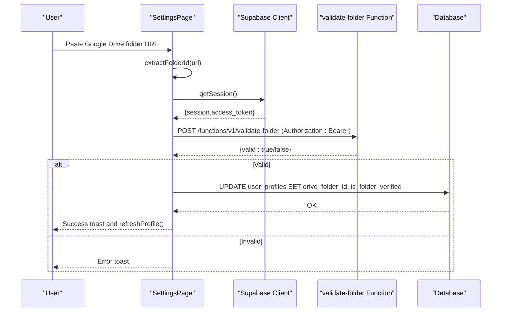

**Diagram sources**
- [SettingsPage.jsx:42-93](file://web/src/pages/SettingsPage.jsx#L42-L93)
- [helpers.js:36-46](file://web/src/utils/helpers.js#L36-L46)
- [config.toml:1-21](file://supabase/config.toml#L1-L21)

**Section sources**
- [SettingsPage.jsx:42-93](file://web/src/pages/SettingsPage.jsx#L42-L93)
- [helpers.js:36-46](file://web/src/utils/helpers.js#L36-L46)
- [config.toml:1-21](file://supabase/config.toml#L1-L21)

## Dependency Analysis
- AuthContext depends on Supabase client for session management and database queries
- Pages depend on AuthContext for authentication state and actions
- AdminDashboard depends on database tables for approvals and settings
- Supabase functions require JWT verification for secure access

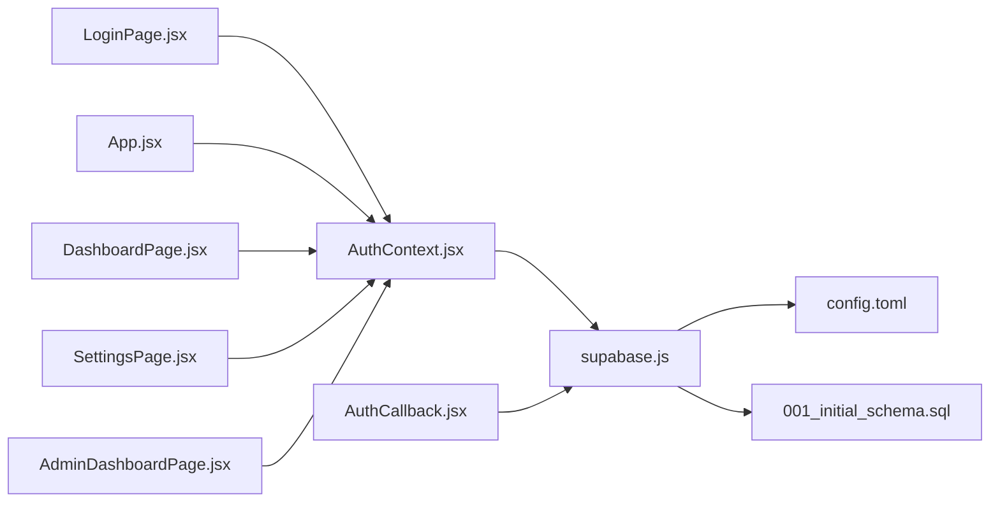

**Diagram sources**
- [AuthContext.jsx:1-112](file://web/src/contexts/AuthContext.jsx#L1-L112)
- [supabase.js:1-7](file://web/src/services/supabase.js#L1-L7)
- [config.toml:1-21](file://supabase/config.toml#L1-L21)
- [001_initial_schema.sql:1-289](file://supabase/migrations/001_initial_schema.sql#L1-L289)

**Section sources**
- [AuthContext.jsx:1-112](file://web/src/contexts/AuthContext.jsx#L1-L112)
- [supabase.js:1-7](file://web/src/services/supabase.js#L1-L7)
- [config.toml:1-21](file://supabase/config.toml#L1-L21)
- [001_initial_schema.sql:1-289](file://supabase/migrations/001_initial_schema.sql#L1-L289)

## Performance Considerations
- Minimize database queries by caching profile data in context
- Debounce or batch profile refreshes to avoid redundant requests
- Use optimistic UI updates for profile saves with rollback on error
- Leverage Supabase client’s built-in token refresh to reduce manual refresh logic

## Troubleshooting Guide
Common authentication issues and resolutions:
- OAuth redirect loop: Verify redirect URI matches configuration and environment variables
- Account not approved: Ensure user exists in `approved_users` or `admins`; otherwise, deny access and sign out
- Session not persisting: Confirm browser storage allows cookies/localStorage and Supabase client initialized correctly
- JWT verification failures: Check function configs enabling `verify_jwt` and Authorization header presence
- Permission denials: Verify RLS policies and user roles; ensure admin role checks pass

**Section sources**
- [AuthCallback.jsx:34-39](file://web/src/pages/AuthCallback.jsx#L34-L39)
- [config.toml:1-21](file://supabase/config.toml#L1-L21)
- [001_initial_schema.sql:126-267](file://supabase/migrations/001_initial_schema.sql#L126-L267)

## Conclusion
The authentication system leverages Supabase Auth for secure OAuth with Google, robust session management, and role-based access control. The React context centralizes state and actions, while protected routes and admin guards enforce security. Database tables support user profiles, approvals, and admin controls, with RLS policies ensuring data privacy. JWT verification on functions adds an extra layer of security for backend interactions.

## Appendices
- Environment variables required by the client:
  - VITE_SUPABASE_URL
  - VITE_SUPABASE_ANON_KEY
  - VITE_APP_URL (for share links)
- Dependencies include @supabase/supabase-js and react-router-dom

**Section sources**
- [package.json:11-20](file://web/package.json#L11-L20)
- [helpers.js:31-34](file://web/src/utils/helpers.js#L31-L34)