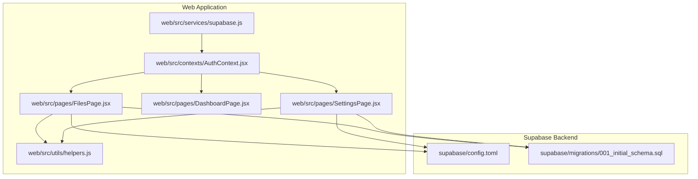
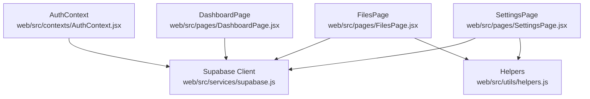
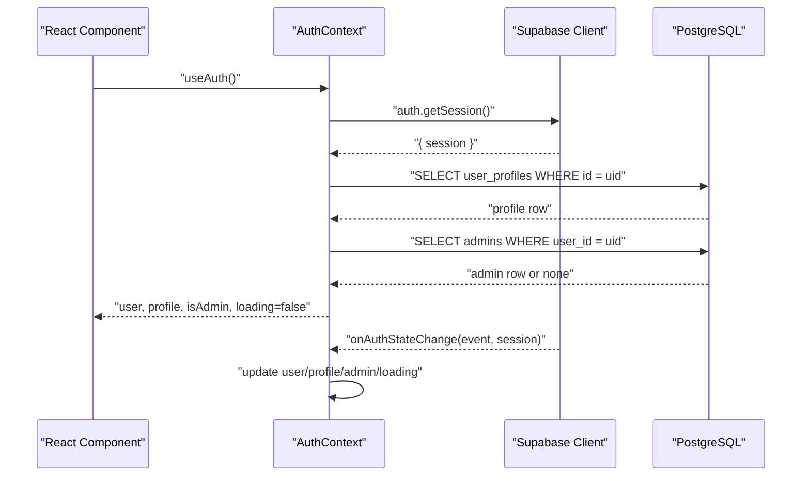
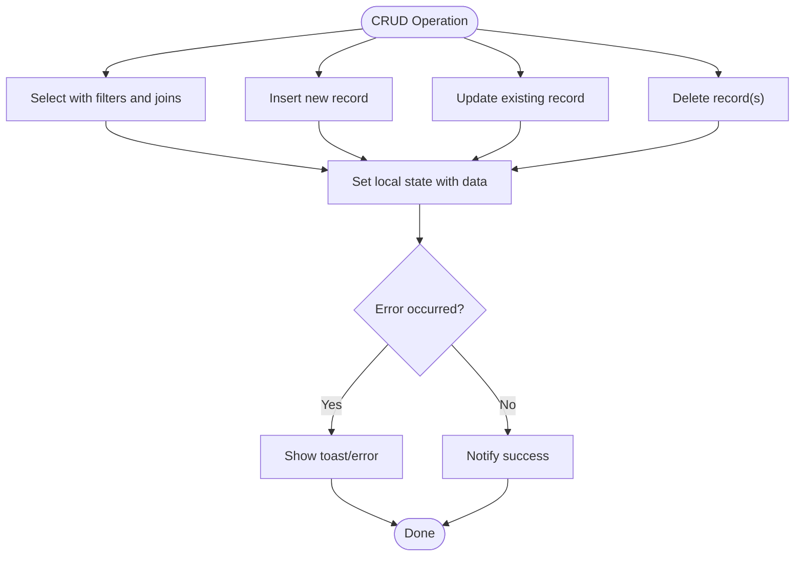
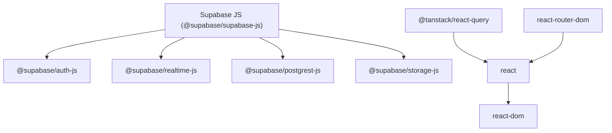

# Client SDK

<cite>
**Referenced Files in This Document**
- [supabase.js](file://web/src/services/supabase.js)
- [helpers.js](file://web/src/utils/helpers.js)
- [AuthContext.jsx](file://web/src/contexts/AuthContext.jsx)
- [FilesPage.jsx](file://web/src/pages/FilesPage.jsx)
- [DashboardPage.jsx](file://web/src/pages/DashboardPage.jsx)
- [SettingsPage.jsx](file://web/src/pages/SettingsPage.jsx)
- [config.toml](file://supabase/config.toml)
- [001_initial_schema.sql](file://supabase/migrations/001_initial_schema.sql)
- [package.json](file://web/package.json)
- [vite.config.js](file://web/vite.config.js)
</cite>

## Table of Contents
1. [Introduction](#introduction)
2. [Project Structure](#project-structure)
3. [Core Components](#core-components)
4. [Architecture Overview](#architecture-overview)
5. [Detailed Component Analysis](#detailed-component-analysis)
6. [Dependency Analysis](#dependency-analysis)
7. [Performance Considerations](#performance-considerations)
8. [Troubleshooting Guide](#troubleshooting-guide)
9. [Conclusion](#conclusion)
10. [Appendices](#appendices)

## Introduction
This document provides comprehensive client SDK documentation for the Supabase JavaScript client used in the web application. It covers client initialization and configuration, environment variable setup, helper utilities for formatting and URL generation, authentication state management, database query patterns, and practical guidance for real-time synchronization, error handling, retries, performance optimization, and development workflow integration. The goal is to enable developers to confidently implement CRUD operations, manage authentication, and integrate Supabase’s real-time capabilities while maintaining robust error handling and performance.

## Project Structure
The client SDK is primarily initialized and configured in a single service module and consumed across React components. Supporting utilities provide formatting and URL generation. Authentication state is centralized in a React context that listens to Supabase auth events. Database interactions leverage Supabase’s PostgREST client for queries and mutations, with helper functions for formatting and URL generation.

**Diagram sources**
- [supabase.js:1-7](file://web/src/services/supabase.js#L1-L7)
- [helpers.js:1-52](file://web/src/utils/helpers.js#L1-L52)
- [AuthContext.jsx:1-112](file://web/src/contexts/AuthContext.jsx#L1-L112)
- [FilesPage.jsx:1-536](file://web/src/pages/FilesPage.jsx#L1-L536)
- [DashboardPage.jsx:1-177](file://web/src/pages/DashboardPage.jsx#L1-L177)
- [SettingsPage.jsx:1-251](file://web/src/pages/SettingsPage.jsx#L1-L251)
- [config.toml:1-21](file://supabase/config.toml#L1-L21)
- [001_initial_schema.sql:1-289](file://supabase/migrations/001_initial_schema.sql#L1-L289)

**Section sources**
- [supabase.js:1-7](file://web/src/services/supabase.js#L1-L7)
- [helpers.js:1-52](file://web/src/utils/helpers.js#L1-L52)
- [AuthContext.jsx:1-112](file://web/src/contexts/AuthContext.jsx#L1-L112)
- [FilesPage.jsx:1-536](file://web/src/pages/FilesPage.jsx#L1-L536)
- [DashboardPage.jsx:1-177](file://web/src/pages/DashboardPage.jsx#L1-L177)
- [SettingsPage.jsx:1-251](file://web/src/pages/SettingsPage.jsx#L1-L251)
- [config.toml:1-21](file://supabase/config.toml#L1-L21)
- [001_initial_schema.sql:1-289](file://supabase/migrations/001_initial_schema.sql#L1-L289)

## Core Components
- Supabase client initialization and export
  - Initializes the Supabase client using Vite environment variables for URL and anonymous key.
  - Exports a singleton client instance for use across the app.
  - Reference: [supabase.js:1-7](file://web/src/services/supabase.js#L1-L7)

- Environment variables and configuration
  - Uses Vite’s import.meta.env for runtime configuration.
  - References VITE_SUPABASE_URL and VITE_SUPABASE_ANON_KEY.
  - Reference: [supabase.js:3-4](file://web/src/services/supabase.js#L3-L4)

- Helper utilities for formatting and URL generation
  - formatFileSize(bytes): Converts bytes to human-readable units.
  - formatDate(dateString): Formats dates for display.
  - getFileIcon(mimeType): Maps MIME types to UI icons.
  - generateShareUrl(hash): Builds shareable URLs using VITE_APP_URL or origin.
  - extractFolderId(url): Extracts Google Drive folder ID from URL.
  - getExtension(filename): Returns uppercase extension.
  - Reference: [helpers.js:1-52](file://web/src/utils/helpers.js#L1-L52)

- Authentication state management
  - Centralized in AuthContext with session retrieval and auth state change listener.
  - Loads user profile and admin status, exposes sign-in/sign-out and refresh functions.
  - Reference: [AuthContext.jsx:1-112](file://web/src/contexts/AuthContext.jsx#L1-L112)

- Database query patterns
  - Select with joins, filters, and ordering.
  - Mutations for inserts, updates, deletes.
  - Reference: [FilesPage.jsx:67-83](file://web/src/pages/FilesPage.jsx#L67-L83), [SettingsPage.jsx:24-40](file://web/src/pages/SettingsPage.jsx#L24-L40)

**Section sources**
- [supabase.js:1-7](file://web/src/services/supabase.js#L1-L7)
- [helpers.js:1-52](file://web/src/utils/helpers.js#L1-L52)
- [AuthContext.jsx:1-112](file://web/src/contexts/AuthContext.jsx#L1-L112)
- [FilesPage.jsx:67-83](file://web/src/pages/FilesPage.jsx#L67-L83)
- [SettingsPage.jsx:24-40](file://web/src/pages/SettingsPage.jsx#L24-L40)

## Architecture Overview
The client architecture follows a clean separation of concerns:
- Service layer initializes the Supabase client and exposes it to the rest of the app.
- Utilities encapsulate formatting and URL generation logic.
- Context manages authentication state and provides derived data (profile, admin status).
- Pages consume the client for data operations and present formatted results.

**Diagram sources**
- [supabase.js:1-7](file://web/src/services/supabase.js#L1-L7)
- [helpers.js:1-52](file://web/src/utils/helpers.js#L1-L52)
- [AuthContext.jsx:1-112](file://web/src/contexts/AuthContext.jsx#L1-L112)
- [FilesPage.jsx:1-536](file://web/src/pages/FilesPage.jsx#L1-L536)
- [DashboardPage.jsx:1-177](file://web/src/pages/DashboardPage.jsx#L1-L177)
- [SettingsPage.jsx:1-251](file://web/src/pages/SettingsPage.jsx#L1-L251)

## Detailed Component Analysis

### Supabase Client Initialization and Configuration
- Initialization
  - Imports createClient from @supabase/supabase-js.
  - Reads VITE_SUPABASE_URL and VITE_SUPABASE_ANON_KEY from environment.
  - Exports a singleton client instance.
- Environment variable setup
  - Ensure VITE_SUPABASE_URL and VITE_SUPABASE_ANON_KEY are set in the development environment.
  - Vite serves these variables at runtime; they are not embedded in production builds.
- Usage
  - Import the exported supabase instance wherever database operations or auth actions are needed.

References:
- [supabase.js:1-7](file://web/src/services/supabase.js#L1-L7)
- [package.json:11-19](file://web/package.json#L11-L19)
- [vite.config.js:1-11](file://web/vite.config.js#L1-L11)

**Section sources**
- [supabase.js:1-7](file://web/src/services/supabase.js#L1-L7)
- [package.json:11-19](file://web/package.json#L11-L19)
- [vite.config.js:1-11](file://web/vite.config.js#L1-L11)

### Helper Functions: Formatting and URL Generation
- File size formatting
  - Converts bytes to human-readable units with precision.
  - Reference: [helpers.js:1-7](file://web/src/utils/helpers.js#L1-L7)
- Date formatting
  - Localizes and formats date strings for display.
  - Reference: [helpers.js:9-17](file://web/src/utils/helpers.js#L9-L17)
- File icon mapping
  - Maps MIME types to UI icons for consistent file representation.
  - Reference: [helpers.js:19-29](file://web/src/utils/helpers.js#L19-L29)
- Share URL generation
  - Builds shareable URLs using VITE_APP_URL or window location origin.
  - Reference: [helpers.js:31-34](file://web/src/utils/helpers.js#L31-L34)
- Folder ID extraction
  - Extracts Google Drive folder ID from various URL formats.
  - Reference: [helpers.js:36-46](file://web/src/utils/helpers.js#L36-L46)
- Extension extraction
  - Returns uppercase extension for filenames.
  - Reference: [helpers.js:48-52](file://web/src/utils/helpers.js#L48-L52)

**Section sources**
- [helpers.js:1-52](file://web/src/utils/helpers.js#L1-L52)

### Authentication State Management
- Session retrieval and listener
  - Retrieves active session on mount and subscribes to auth state changes.
  - Updates user, profile, and admin state accordingly.
- Profile loading
  - Fetches user profile and admin membership using PostgREST.
- Sign-in/sign-out
  - Integrates with Supabase OAuth provider (Google) and handles sign-out.
- Context provider
  - Exposes loading state, user, profile, admin status, and actions to consumers.

**Diagram sources**
- [AuthContext.jsx:12-38](file://web/src/contexts/AuthContext.jsx#L12-L38)
- [AuthContext.jsx:40-64](file://web/src/contexts/AuthContext.jsx#L40-L64)

**Section sources**
- [AuthContext.jsx:1-112](file://web/src/contexts/AuthContext.jsx#L1-L112)

### Database Query Builders and CRUD Patterns
- Select with joins and ordering
  - Example: Fetch shared files with related versions and order by selected criteria.
  - Reference: [FilesPage.jsx:67-83](file://web/src/pages/FilesPage.jsx#L67-L83)
- Insert records
  - Example: Insert file metadata after successful upload.
  - Reference: [FilesPage.jsx:135-149](file://web/src/pages/FilesPage.jsx#L135-L149)
- Update records
  - Example: Toggle sharing status and rename files.
  - Reference: [FilesPage.jsx:266-285](file://web/src/pages/FilesPage.jsx#L266-L285), [FilesPage.jsx:184-225](file://web/src/pages/FilesPage.jsx#L184-L225)
- Delete records
  - Example: Delete file versions and file records.
  - Reference: [FilesPage.jsx:227-264](file://web/src/pages/FilesPage.jsx#L227-L264)
- Update profile
  - Example: Update user display name.
  - Reference: [SettingsPage.jsx:24-40](file://web/src/pages/SettingsPage.jsx#L24-L40)

**Diagram sources**
- [FilesPage.jsx:67-83](file://web/src/pages/FilesPage.jsx#L67-L83)
- [FilesPage.jsx:135-149](file://web/src/pages/FilesPage.jsx#L135-L149)
- [FilesPage.jsx:266-285](file://web/src/pages/FilesPage.jsx#L266-L285)
- [FilesPage.jsx:227-264](file://web/src/pages/FilesPage.jsx#L227-L264)
- [SettingsPage.jsx:24-40](file://web/src/pages/SettingsPage.jsx#L24-L40)

**Section sources**
- [FilesPage.jsx:67-83](file://web/src/pages/FilesPage.jsx#L67-L83)
- [FilesPage.jsx:135-149](file://web/src/pages/FilesPage.jsx#L135-L149)
- [FilesPage.jsx:266-285](file://web/src/pages/FilesPage.jsx#L266-L285)
- [FilesPage.jsx:227-264](file://web/src/pages/FilesPage.jsx#L227-L264)
- [SettingsPage.jsx:24-40](file://web/src/pages/SettingsPage.jsx#L24-L40)

### Real-Time Subscription Patterns
- Current implementation
  - The application does not implement real-time subscriptions in the provided files.
  - Authentication state changes are handled via onAuthStateChange.
- Recommended patterns
  - Use supabase
    - from(table).on(…).subscribe(callback) for listening to database changes.
    - auth.onAuthStateChange(listener) for auth events.
  - Combine with React state to keep UI synchronized.
  - Unsubscribe in cleanup to prevent memory leaks.
- Notes
  - Real-time requires Supabase Realtime service and proper RLS policies.
  - Consider batching updates and debouncing frequent changes.

[No sources needed since this section provides general guidance]

### Edge Functions and Authentication Tokens
- Edge functions
  - The application calls Supabase Edge Functions with Authorization headers containing the session access token.
  - Examples include upload-file, rename-file, delete-file, validate-folder, and upload-version.
- Token usage
  - Retrieve session via supabase.auth.getSession() and pass the access token in the Authorization header.
- Function configuration
  - Supabase config.toml defines JWT verification per function.

References:
- [FilesPage.jsx:111-130](file://web/src/pages/FilesPage.jsx#L111-L130)
- [FilesPage.jsx:187-203](file://web/src/pages/FilesPage.jsx#L187-L203)
- [FilesPage.jsx:229-244](file://web/src/pages/FilesPage.jsx#L229-L244)
- [SettingsPage.jsx:56-69](file://web/src/pages/SettingsPage.jsx#L56-L69)
- [config.toml:1-21](file://supabase/config.toml#L1-L21)

**Section sources**
- [FilesPage.jsx:111-130](file://web/src/pages/FilesPage.jsx#L111-L130)
- [FilesPage.jsx:187-203](file://web/src/pages/FilesPage.jsx#L187-L203)
- [FilesPage.jsx:229-244](file://web/src/pages/FilesPage.jsx#L229-L244)
- [SettingsPage.jsx:56-69](file://web/src/pages/SettingsPage.jsx#L56-L69)
- [config.toml:1-21](file://supabase/config.toml#L1-L21)

### Offline-First Patterns
- Current implementation
  - No explicit offline-first caching is implemented in the provided files.
- Recommended approach
  - Use a caching library compatible with React Query to cache queries and invalidate on mutations.
  - Persist optimistic updates locally and reconcile with server on reconnect.
  - Debounce frequent writes and batch operations.
- Database schema alignment
  - RLS policies and triggers support safe local caching and reconciliation.

[No sources needed since this section provides general guidance]

### Error Handling Strategies and Retry Mechanisms
- Error handling patterns in the codebase
  - Try/catch around database operations and fetch calls.
  - Logging errors to console and displaying user-friendly messages via toast notifications.
  - Returning early on validation failures (e.g., blocked extensions, size limits).
- Suggested improvements
  - Implement retry with exponential backoff for transient network errors.
  - Distinguish between recoverable and non-recoverable errors.
  - Centralize error reporting to analytics/logging service.
- References:
  - [FilesPage.jsx:78-82](file://web/src/pages/FilesPage.jsx#L78-L82)
  - [FilesPage.jsx:175-182](file://web/src/pages/FilesPage.jsx#L175-L182)
  - [FilesPage.jsx:222-225](file://web/src/pages/FilesPage.jsx#L222-L225)
  - [FilesPage.jsx:261-264](file://web/src/pages/FilesPage.jsx#L261-L264)
  - [SettingsPage.jsx:87-93](file://web/src/pages/SettingsPage.jsx#L87-L93)

**Section sources**
- [FilesPage.jsx:78-82](file://web/src/pages/FilesPage.jsx#L78-L82)
- [FilesPage.jsx:175-182](file://web/src/pages/FilesPage.jsx#L175-L182)
- [FilesPage.jsx:222-225](file://web/src/pages/FilesPage.jsx#L222-L225)
- [FilesPage.jsx:261-264](file://web/src/pages/FilesPage.jsx#L261-L264)
- [SettingsPage.jsx:87-93](file://web/src/pages/SettingsPage.jsx#L87-L93)

### Performance Optimization Techniques
- Minimize re-renders
  - Keep Supabase client imported once and reuse the exported instance.
  - Use stable callbacks and avoid inline function creation in render paths.
- Optimize queries
  - Select only required columns.
  - Use filters and ordering to reduce payload size.
- Batch operations
  - Group related updates and avoid excessive small requests.
- UI responsiveness
  - Show loading states during uploads and long-running operations.
- References:
  - [supabase.js:1-7](file://web/src/services/supabase.js#L1-L7)
  - [FilesPage.jsx:67-83](file://web/src/pages/FilesPage.jsx#L67-L83)
  - [FilesPage.jsx:111-130](file://web/src/pages/FilesPage.jsx#L111-L130)

**Section sources**
- [supabase.js:1-7](file://web/src/services/supabase.js#L1-L7)
- [FilesPage.jsx:67-83](file://web/src/pages/FilesPage.jsx#L67-L83)
- [FilesPage.jsx:111-130](file://web/src/pages/FilesPage.jsx#L111-L130)

### Debugging Tools, Logging Configurations, and Development Workflow
- Environment variables
  - Ensure VITE_SUPABASE_URL and VITE_SUPABASE_ANON_KEY are set in development.
  - Vite serves these variables at runtime; confirm they resolve correctly in browser devtools.
- Logging
  - Use console.error for unhandled exceptions and user feedback via toast.
- Development server
  - Vite runs on port 5173 and opens automatically.
- References:
  - [supabase.js:3-4](file://web/src/services/supabase.js#L3-L4)
  - [vite.config.js:6-9](file://web/vite.config.js#L6-L9)

**Section sources**
- [supabase.js:3-4](file://web/src/services/supabase.js#L3-L4)
- [vite.config.js:6-9](file://web/vite.config.js#L6-L9)

## Dependency Analysis
The client SDK depends on the Supabase JavaScript client and related packages for authentication, real-time, storage, and PostgREST. The application also integrates React Query for data fetching and caching, along with UI libraries and utilities.

**Diagram sources**
- [package.json:11-19](file://web/package.json#L11-L19)

**Section sources**
- [package.json:11-19](file://web/package.json#L11-L19)

## Performance Considerations
- Network efficiency
  - Use selective column queries and appropriate filters to minimize payload size.
  - Avoid unnecessary polling; prefer event-driven updates when possible.
- UI responsiveness
  - Show loading indicators during long operations.
  - Debounce search and sorting operations.
- Caching
  - Integrate React Query to cache and invalidate data efficiently.
- Storage and uploads
  - Validate file types and sizes client-side to reduce backend failures.
  - Stream large uploads when supported by backend.

[No sources needed since this section provides general guidance]

## Troubleshooting Guide
- Environment variables missing
  - Symptom: Client fails to initialize or requests fail.
  - Action: Verify VITE_SUPABASE_URL and VITE_SUPABASE_ANON_KEY are set and accessible in the browser.
  - Reference: [supabase.js:3-4](file://web/src/services/supabase.js#L3-L4)
- Authentication issues
  - Symptom: Auth state not updating or session not persisting.
  - Action: Ensure onAuthStateChange listener is active and sessions are retrieved on mount.
  - Reference: [AuthContext.jsx:12-38](file://web/src/contexts/AuthContext.jsx#L12-L38)
- Edge function errors
  - Symptom: Upload/rename/delete operations fail.
  - Action: Check Authorization header usage and function configuration in config.toml.
  - References: [FilesPage.jsx:111-130](file://web/src/pages/FilesPage.jsx#L111-L130), [config.toml:1-21](file://supabase/config.toml#L1-L21)
- Database permission errors
  - Symptom: Queries fail due to RLS policies.
  - Action: Review RLS policies in the migration file and ensure user roles and ownership align.
  - Reference: [001_initial_schema.sql:126-267](file://supabase/migrations/001_initial_schema.sql#L126-L267)

**Section sources**
- [supabase.js:3-4](file://web/src/services/supabase.js#L3-L4)
- [AuthContext.jsx:12-38](file://web/src/contexts/AuthContext.jsx#L12-L38)
- [FilesPage.jsx:111-130](file://web/src/pages/FilesPage.jsx#L111-L130)
- [config.toml:1-21](file://supabase/config.toml#L1-L21)
- [001_initial_schema.sql:126-267](file://supabase/migrations/001_initial_schema.sql#L126-L267)

## Conclusion
The client SDK leverages a clean initialization pattern, centralized authentication context, and straightforward database operations to deliver a responsive user experience. By adopting recommended real-time patterns, robust error handling, and performance optimizations, teams can scale the application confidently. The provided helper utilities streamline formatting and URL generation, while the database schema enforces security and consistency through RLS policies.

[No sources needed since this section summarizes without analyzing specific files]

## Appendices
- Database schema highlights
  - Tables: pending_registrations, approved_users, admins, user_profiles, shared_files, file_versions, activity_logs, admin_activity_logs, system_settings.
  - Policies: Row-level security policies for user isolation and controlled access.
  - Triggers: Updated-at triggers for user_profiles and system_settings.
- References:
  - [001_initial_schema.sql:55-94](file://supabase/migrations/001_initial_schema.sql#L55-L94)
  - [001_initial_schema.sql:129-267](file://supabase/migrations/001_initial_schema.sql#L129-L267)

**Section sources**
- [001_initial_schema.sql:55-94](file://supabase/migrations/001_initial_schema.sql#L55-L94)
- [001_initial_schema.sql:129-267](file://supabase/migrations/001_initial_schema.sql#L129-L267)