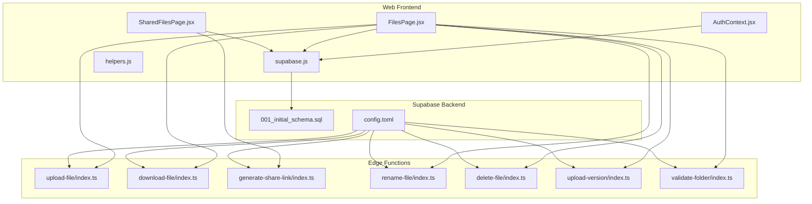
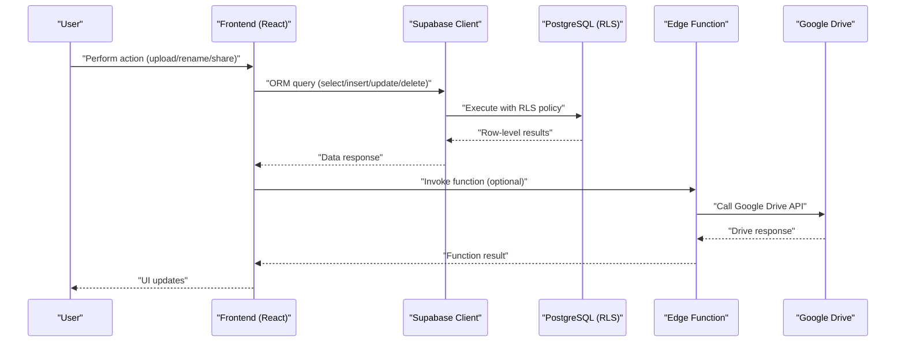
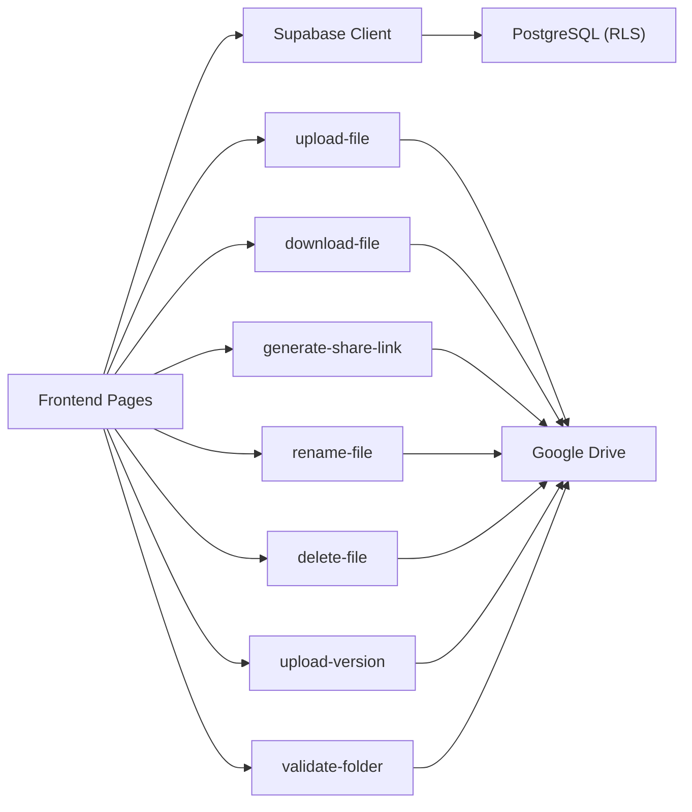

# Database API

<cite>
**Referenced Files in This Document**
- [001_initial_schema.sql](file://supabase/migrations/001_initial_schema.sql)
- [supabase.js](file://web/src/services/supabase.js)
- [AuthContext.jsx](file://web/src/contexts/AuthContext.jsx)
- [FilesPage.jsx](file://web/src/pages/FilesPage.jsx)
- [SharedFilesPage.jsx](file://web/src/pages/SharedFilesPage.jsx)
- [helpers.js](file://web/src/utils/helpers.js)
- [config.toml](file://supabase/config.toml)
- [upload-file/index.ts](file://supabase/functions/upload-file/index.ts)
- [download-file/index.ts](file://supabase/functions/download-file/index.ts)
- [generate-share-link/index.ts](file://supabase/functions/generate-share-link/index.ts)
- [rename-file/index.ts](file://supabase/functions/rename-file/index.ts)
- [delete-file/index.ts](file://supabase/functions/delete-file/index.ts)
- [upload-version/index.ts](file://supabase/functions/upload-version/index.ts)
- [validate-folder/index.ts](file://supabase/functions/validate-folder/index.ts)
</cite>

## Table of Contents
1. [Introduction](#introduction)
2. [Project Structure](#project-structure)
3. [Core Components](#core-components)
4. [Architecture Overview](#architecture-overview)
5. [Detailed Component Analysis](#detailed-component-analysis)
6. [Dependency Analysis](#dependency-analysis)
7. [Performance Considerations](#performance-considerations)
8. [Troubleshooting Guide](#troubleshooting-guide)
9. [Conclusion](#conclusion)
10. [Appendices](#appendices)

## Introduction
This document provides comprehensive database API documentation for the Supabase PostgreSQL integration used by the Neo Files Transfer application. It covers table schemas, field definitions, data types, constraints, and Row Level Security (RLS) policies. It also explains query patterns using Supabase ORM methods (select, insert, update, delete), authentication-based filtering, permission checks, data isolation patterns, real-time subscriptions, database triggers, and webhook integrations. Practical examples demonstrate complex queries, joins, and aggregations commonly used in the application.

## Project Structure
The database schema and policies are defined in a single migration script. Frontend pages use the Supabase client to perform database operations. Edge functions encapsulate Google Drive interactions and enforce JWT verification for selected endpoints.

**Diagram sources**
- [001_initial_schema.sql:1-289](file://supabase/migrations/001_initial_schema.sql#L1-L289)
- [supabase.js:1-7](file://web/src/services/supabase.js#L1-L7)
- [AuthContext.jsx:1-112](file://web/src/contexts/AuthContext.jsx#L1-L112)
- [FilesPage.jsx:1-536](file://web/src/pages/FilesPage.jsx#L1-L536)
- [SharedFilesPage.jsx:1-127](file://web/src/pages/SharedFilesPage.jsx#L1-L127)
- [helpers.js:1-52](file://web/src/utils/helpers.js#L1-L52)
- [config.toml:1-21](file://supabase/config.toml#L1-L21)
- [upload-file/index.ts:1-152](file://supabase/functions/upload-file/index.ts#L1-L152)
- [download-file/index.ts:1-131](file://supabase/functions/download-file/index.ts#L1-L131)
- [generate-share-link/index.ts:1-55](file://supabase/functions/generate-share-link/index.ts#L1-L55)
- [rename-file/index.ts:1-74](file://supabase/functions/rename-file/index.ts#L1-L74)
- [delete-file/index.ts:1-72](file://supabase/functions/delete-file/index.ts#L1-L72)
- [upload-version/index.ts:1-130](file://supabase/functions/upload-version/index.ts#L1-L130)
- [validate-folder/index.ts:1-87](file://supabase/functions/validate-folder/index.ts#L1-L87)

**Section sources**
- [001_initial_schema.sql:1-289](file://supabase/migrations/001_initial_schema.sql#L1-L289)
- [supabase.js:1-7](file://web/src/services/supabase.js#L1-L7)
- [AuthContext.jsx:1-112](file://web/src/contexts/AuthContext.jsx#L1-L112)
- [FilesPage.jsx:1-536](file://web/src/pages/FilesPage.jsx#L1-L536)
- [SharedFilesPage.jsx:1-127](file://web/src/pages/SharedFilesPage.jsx#L1-L127)
- [helpers.js:1-52](file://web/src/utils/helpers.js#L1-L52)
- [config.toml:1-21](file://supabase/config.toml#L1-L21)

## Core Components
- Database Schema: Defines tables for users, files, versions, shares, activity logs, and system settings, including indexes and triggers.
- RLS Policies: Enforce per-user data isolation and selective public access for downloads.
- Frontend Queries: Use Supabase ORM to select, insert, update, and delete records with authentication-based filters.
- Edge Functions: Handle Google Drive uploads, downloads, renaming, deletion, versioning, and folder validation with JWT verification.

**Section sources**
- [001_initial_schema.sql:6-289](file://supabase/migrations/001_initial_schema.sql#L6-L289)
- [FilesPage.jsx:67-83](file://web/src/pages/FilesPage.jsx#L67-L83)
- [SharedFilesPage.jsx:17-31](file://web/src/pages/SharedFilesPage.jsx#L17-L31)
- [config.toml:1-21](file://supabase/config.toml#L1-L21)

## Architecture Overview
The system integrates Supabase PostgreSQL with Google Drive via edge functions. Authentication is handled by Supabase Auth, and RLS ensures data isolation. Frontend pages query Supabase directly for most operations, while sensitive or external interactions are delegated to edge functions.

**Diagram sources**
- [FilesPage.jsx:111-182](file://web/src/pages/FilesPage.jsx#L111-L182)
- [SharedFilesPage.jsx:33-46](file://web/src/pages/SharedFilesPage.jsx#L33-L46)
- [upload-file/index.ts:35-44](file://supabase/functions/upload-file/index.ts#L35-L44)
- [rename-file/index.ts:32-35](file://supabase/functions/rename-file/index.ts#L32-L35)
- [download-file/index.ts:24-27](file://supabase/functions/download-file/index.ts#L24-L27)

## Detailed Component Analysis

### Database Schemas and Constraints

#### Table: user_profiles
- Purpose: Stores user profile details linked to auth.users.
- Key fields:
  - id: UUID, primary key, references auth.users(id), cascade delete.
  - email: text, not null.
  - name: text, default empty string.
  - avatar_url: text, default empty string.
  - drive_folder_id: text, nullable.
  - is_folder_verified: boolean, not null, default false.
  - created_at: timestamptz, not null, default now().
  - updated_at: timestamptz, not null, default now().
- Indexes: idx_user_profiles_email(email).
- Trigger: update_updated_at_column() executed before UPDATE to refresh updated_at.

**Section sources**
- [001_initial_schema.sql:42-51](file://supabase/migrations/001_initial_schema.sql#L42-L51)
- [001_initial_schema.sql:272-288](file://supabase/migrations/001_initial_schema.sql#L272-L288)

#### Table: shared_files
- Purpose: Represents files owned by users with sharing capabilities.
- Key fields:
  - id: UUID, primary key.
  - user_id: UUID, not null, references auth.users(id), cascade delete.
  - google_drive_file_id: text, not null.
  - file_name: text, not null.
  - file_size: bigint, default 0.
  - mime_type: text, default empty string.
  - current_version_num: integer, not null, default 1.
  - unique_share_hash: text, not null, unique.
  - sharing_status: text, not null, default private, check ('public','private').
  - created_at: timestamptz, not null, default now().
- Indexes: idx_shared_files_user_id(user_id), idx_shared_files_share_hash(unique_share_hash), idx_shared_files_google_drive_file_id(google_drive_file_id).

**Section sources**
- [001_initial_schema.sql:56-67](file://supabase/migrations/001_initial_schema.sql#L56-L67)

#### Table: file_versions
- Purpose: Tracks historical versions of shared files.
- Key fields:
  - id: UUID, primary key.
  - file_id: UUID, not null, references shared_files(id), cascade delete.
  - google_drive_file_id: text, not null.
  - version_number: integer, not null, default 1.
  - uploaded_at: timestamptz, not null, default now().
- Indexes: idx_file_versions_file_id(file_id).

**Section sources**
- [001_initial_schema.sql:74-80](file://supabase/migrations/001_initial_schema.sql#L74-L80)

#### Table: activity_logs
- Purpose: Logs user actions for auditability.
- Key fields:
  - id: UUID, primary key.
  - user_id: UUID, not null, references auth.users(id), cascade delete.
  - action: text, not null.
  - details: text, default empty string.
  - created_at: timestamptz, not null, default now().
- Indexes: idx_activity_logs_user_id(user_id), idx_activity_logs_action(action).

**Section sources**
- [001_initial_schema.sql:85-91](file://supabase/migrations/001_initial_schema.sql#L85-L91)

#### Additional Tables
- pending_registrations: Public registration submissions with status tracking.
- approved_users: Approved user records linked to administrators.
- admins: Admin roles with unique constraint on user_id.
- admin_activity_logs: Admin-specific audit logs.
- system_settings: Global settings stored as JSONB with defaults.

**Section sources**
- [001_initial_schema.sql:7-14](file://supabase/migrations/001_initial_schema.sql#L7-L14)
- [001_initial_schema.sql:19-25](file://supabase/migrations/001_initial_schema.sql#L19-L25)
- [001_initial_schema.sql:29-39](file://supabase/migrations/001_initial_schema.sql#L29-L39)
- [001_initial_schema.sql:84-91](file://supabase/migrations/001_initial_schema.sql#L84-L91)
- [001_initial_schema.sql:96-103](file://supabase/migrations/001_initial_schema.sql#L96-L103)
- [001_initial_schema.sql:108-122](file://supabase/migrations/001_initial_schema.sql#L108-L122)

### Row Level Security (RLS) Policies
RLS is enabled on all relevant tables. Policies define who can access data and under what conditions.

- user_profiles
  - Users can read/update their own profile.
  - Users can insert their own profile.
- shared_files
  - Users can select/update/delete their own files.
  - Public can select by share hash for download.
- file_versions
  - Users can view and insert versions for files they own.
  - Users can delete versions for files they own.
- activity_logs
  - Users can view and insert their own logs.
- pending_registrations
  - Anyone can insert; authenticated users can read/update/delete.
- approved_users
  - Authenticated users can read and insert.
- admins
  - Authenticated users can read.
- admin_activity_logs
  - Authenticated users can read and insert.
- system_settings
  - Anyone can read; authenticated users can update/insert.

**Section sources**
- [001_initial_schema.sql:129-138](file://supabase/migrations/001_initial_schema.sql#L129-L138)
- [001_initial_schema.sql:140-151](file://supabase/migrations/001_initial_schema.sql#L140-L151)
- [001_initial_schema.sql:153-168](file://supabase/migrations/001_initial_schema.sql#L153-L168)
- [001_initial_schema.sql:170-174](file://supabase/migrations/001_initial_schema.sql#L170-L174)
- [001_initial_schema.sql:175-204](file://supabase/migrations/001_initial_schema.sql#L175-L204)
- [001_initial_schema.sql:206-213](file://supabase/migrations/001_initial_schema.sql#L206-L213)
- [001_initial_schema.sql:215-230](file://supabase/migrations/001_initial_schema.sql#L215-L230)
- [001_initial_schema.sql:232-239](file://supabase/migrations/001_initial_schema.sql#L232-L239)
- [001_initial_schema.sql:241-244](file://supabase/migrations/001_initial_schema.sql#L241-L244)
- [001_initial_schema.sql:246-253](file://supabase/migrations/001_initial_schema.sql#L246-L253)
- [001_initial_schema.sql:255-266](file://supabase/migrations/001_initial_schema.sql#L255-L266)

### Supabase ORM Query Patterns
Common patterns used in the frontend:

- Select with authentication-based filter
  - Example: Fetch current user’s files with nested versions.
  - Reference: [FilesPage.jsx:67-83](file://web/src/pages/FilesPage.jsx#L67-L83)

- Insert with generated share hash
  - Example: Create shared_files record after successful upload.
  - Reference: [FilesPage.jsx:138-147](file://web/src/pages/FilesPage.jsx#L138-L147)

- Update with equality filter
  - Example: Toggle sharing status or rename file metadata.
  - References: [FilesPage.jsx:266-285](file://web/src/pages/FilesPage.jsx#L266-L285), [SharedFilesPage.jsx:33-46](file://web/src/pages/SharedFilesPage.jsx#L33-L46)

- Delete with cascading relations
  - Example: Remove versions before removing the file record.
  - Reference: [FilesPage.jsx:246-250](file://web/src/pages/FilesPage.jsx#L246-L250)

- Join with foreign keys
  - Example: Select shared_files joined with file_versions.
  - Reference: [FilesPage.jsx:70-72](file://web/src/pages/FilesPage.jsx#L70-L72)

- Ordering and sorting
  - Example: Order by created_at or file_name with configurable direction.
  - Reference: [FilesPage.jsx:70-74](file://web/src/pages/FilesPage.jsx#L70-L74)

- Filtering by user context
  - Example: Filter by auth.uid() or user.id.
  - References: [AuthContext.jsx:14-21](file://web/src/contexts/AuthContext.jsx#L14-L21), [FilesPage.jsx:70-73](file://web/src/pages/FilesPage.jsx#L70-L73)

**Section sources**
- [FilesPage.jsx:67-83](file://web/src/pages/FilesPage.jsx#L67-L83)
- [FilesPage.jsx:138-147](file://web/src/pages/FilesPage.jsx#L138-L147)
- [FilesPage.jsx:246-250](file://web/src/pages/FilesPage.jsx#L246-L250)
- [FilesPage.jsx:266-285](file://web/src/pages/FilesPage.jsx#L266-L285)
- [SharedFilesPage.jsx:33-46](file://web/src/pages/SharedFilesPage.jsx#L33-L46)
- [AuthContext.jsx:14-21](file://web/src/contexts/AuthContext.jsx#L14-L21)

### Real-Time Subscriptions
- Supabase client supports real-time subscriptions for tables. The application demonstrates listening to auth state changes and reacting to session updates.
- Reference: [AuthContext.jsx:24-35](file://web/src/contexts/AuthContext.jsx#L24-L35)

**Section sources**
- [AuthContext.jsx:24-35](file://web/src/contexts/AuthContext.jsx#L24-L35)

### Database Triggers
- update_updated_at_column(): Updates updated_at on row modifications for user_profiles and system_settings.
- Reference: [001_initial_schema.sql:272-288](file://supabase/migrations/001_initial_schema.sql#L272-L288)

**Section sources**
- [001_initial_schema.sql:272-288](file://supabase/migrations/001_initial_schema.sql#L272-L288)

### Webhook Integrations
- No explicit webhook endpoints are defined in the repository. Integration with Google Drive occurs via edge functions that call the Drive API directly.

**Section sources**
- [upload-file/index.ts:111-121](file://supabase/functions/upload-file/index.ts#L111-L121)
- [download-file/index.ts:99-118](file://supabase/functions/download-file/index.ts#L99-L118)

### Edge Functions and Authentication-Based Filtering
- Edge functions require JWT verification except for download-file.
- Functions:
  - upload-file: Validates file size/type, uploads to Google Drive, returns metadata.
  - download-file: Resolves share hash, checks sharing status and system settings, redirects to Google Drive.
  - generate-share-link: Generates a unique share hash for authenticated users.
  - rename-file: Renames file in Google Drive.
  - delete-file: Deletes file from Google Drive.
  - upload-version: Uploads a new version to Google Drive.
  - validate-folder: Verifies a Google Drive folder ID.

- JWT verification enforcement:
  - verify_jwt = true for most functions; verify_jwt = false for download-file.
  - Reference: [config.toml:1-21](file://supabase/config.toml#L1-L21)

**Section sources**
- [upload-file/index.ts:24-44](file://supabase/functions/upload-file/index.ts#L24-L44)
- [download-file/index.ts:14-27](file://supabase/functions/download-file/index.ts#L14-L27)
- [generate-share-link/index.ts:9-29](file://supabase/functions/generate-share-link/index.ts#L9-L29)
- [rename-file/index.ts:14-35](file://supabase/functions/rename-file/index.ts#L14-L35)
- [delete-file/index.ts:14-35](file://supabase/functions/delete-file/index.ts#L14-L35)
- [upload-version/index.ts:11-31](file://supabase/functions/upload-version/index.ts#L11-L31)
- [validate-folder/index.ts:14-35](file://supabase/functions/validate-folder/index.ts#L14-L35)
- [config.toml:1-21](file://supabase/config.toml#L1-L21)

### Complex Queries, Joins, and Aggregations
- Nested selects: Fetch shared_files with related file_versions.
  - Reference: [FilesPage.jsx:70-72](file://web/src/pages/FilesPage.jsx#L70-L72)
- Equality filters with ordering: Filter by user_id and order by created_at or file_name.
  - Reference: [FilesPage.jsx:70-74](file://web/src/pages/FilesPage.jsx#L70-L74)
- Existence checks via policies: Users can access versions only if they own the parent file.
  - Reference: [001_initial_schema.sql:175-204](file://supabase/migrations/001_initial_schema.sql#L175-L204)

**Section sources**
- [FilesPage.jsx:70-74](file://web/src/pages/FilesPage.jsx#L70-L74)
- [001_initial_schema.sql:175-204](file://supabase/migrations/001_initial_schema.sql#L175-L204)

## Dependency Analysis
- Frontend depends on Supabase client for database operations and on edge functions for Google Drive interactions.
- Edge functions depend on Supabase Auth session tokens and Google Drive APIs.
- RLS policies govern access to tables and are enforced by the database.

**Diagram sources**
- [FilesPage.jsx:111-182](file://web/src/pages/FilesPage.jsx#L111-L182)
- [SharedFilesPage.jsx:33-46](file://web/src/pages/SharedFilesPage.jsx#L33-L46)
- [upload-file/index.ts:111-121](file://supabase/functions/upload-file/index.ts#L111-L121)
- [download-file/index.ts:99-118](file://supabase/functions/download-file/index.ts#L99-L118)
- [generate-share-link/index.ts:31-38](file://supabase/functions/generate-share-link/index.ts#L31-L38)
- [rename-file/index.ts:39-50](file://supabase/functions/rename-file/index.ts#L39-L50)
- [delete-file/index.ts:39-48](file://supabase/functions/delete-file/index.ts#L39-L48)
- [upload-version/index.ts:89-99](file://supabase/functions/upload-version/index.ts#L89-L99)
- [validate-folder/index.ts:42-49](file://supabase/functions/validate-folder/index.ts#L42-L49)

**Section sources**
- [FilesPage.jsx:111-182](file://web/src/pages/FilesPage.jsx#L111-L182)
- [SharedFilesPage.jsx:33-46](file://web/src/pages/SharedFilesPage.jsx#L33-L46)
- [upload-file/index.ts:111-121](file://supabase/functions/upload-file/index.ts#L111-L121)
- [download-file/index.ts:99-118](file://supabase/functions/download-file/index.ts#L99-L118)
- [generate-share-link/index.ts:31-38](file://supabase/functions/generate-share-link/index.ts#L31-L38)
- [rename-file/index.ts:39-50](file://supabase/functions/rename-file/index.ts#L39-L50)
- [delete-file/index.ts:39-48](file://supabase/functions/delete-file/index.ts#L39-L48)
- [upload-version/index.ts:89-99](file://supabase/functions/upload-version/index.ts#L89-L99)
- [validate-folder/index.ts:42-49](file://supabase/functions/validate-folder/index.ts#L42-L49)

## Performance Considerations
- Use indexes on frequently filtered columns (e.g., user_id, unique_share_hash).
- Prefer selective projections (select only needed columns) to reduce payload size.
- Batch operations where possible; avoid unnecessary round-trips.
- Offload heavy external API calls (Google Drive) to edge functions to keep the client responsive.
- Monitor query plans and adjust indexes or policies as usage grows.

[No sources needed since this section provides general guidance]

## Troubleshooting Guide
- Authentication errors in edge functions:
  - Ensure Authorization header is present and valid.
  - Verify JWT verification settings in config.toml.
  - References: [upload-file/index.ts:30-44](file://supabase/functions/upload-file/index.ts#L30-L44), [config.toml:1-21](file://supabase/config.toml#L1-L21)

- Download failures:
  - Check sharing_status and system_settings for downloads_enabled.
  - Verify Google Drive webContentLink availability.
  - References: [download-file/index.ts:46-72](file://supabase/functions/download-file/index.ts#L46-L72), [download-file/index.ts:98-118](file://supabase/functions/download-file/index.ts#L98-L118)

- Permission denied due to RLS:
  - Confirm user owns the resource or the policy allows public access for downloads.
  - References: [001_initial_schema.sql:153-168](file://supabase/migrations/001_initial_schema.sql#L153-L168), [001_initial_schema.sql:170-174](file://supabase/migrations/001_initial_schema.sql#L170-L174)

- Cascading deletes:
  - Ensure versions are removed before deleting the file record.
  - Reference: [FilesPage.jsx:246-250](file://web/src/pages/FilesPage.jsx#L246-L250)

**Section sources**
- [upload-file/index.ts:30-44](file://supabase/functions/upload-file/index.ts#L30-L44)
- [config.toml:1-21](file://supabase/config.toml#L1-L21)
- [download-file/index.ts:46-72](file://supabase/functions/download-file/index.ts#L46-L72)
- [download-file/index.ts:98-118](file://supabase/functions/download-file/index.ts#L98-L118)
- [001_initial_schema.sql:153-168](file://supabase/migrations/001_initial_schema.sql#L153-L168)
- [001_initial_schema.sql:170-174](file://supabase/migrations/001_initial_schema.sql#L170-L174)
- [FilesPage.jsx:246-250](file://web/src/pages/FilesPage.jsx#L246-L250)

## Conclusion
The Neo Files Transfer application leverages Supabase PostgreSQL with robust RLS policies to enforce data isolation, complemented by edge functions for Google Drive integration. Frontend pages use Supabase ORM to perform secure, authenticated queries with joins and ordering. The documented schemas, policies, and patterns provide a clear blueprint for extending functionality while maintaining security and performance.

[No sources needed since this section summarizes without analyzing specific files]

## Appendices

### Appendix A: Supabase Client Initialization
- Supabase client is initialized with VITE_SUPABASE_URL and VITE_SUPABASE_ANON_KEY.
- Reference: [supabase.js:1-7](file://web/src/services/supabase.js#L1-L7)

**Section sources**
- [supabase.js:1-7](file://web/src/services/supabase.js#L1-L7)

### Appendix B: Helper Utilities
- Formatting helpers for file size, date, icons, share URLs, and extensions.
- Reference: [helpers.js:1-52](file://web/src/utils/helpers.js#L1-L52)

**Section sources**
- [helpers.js:1-52](file://web/src/utils/helpers.js#L1-L52)