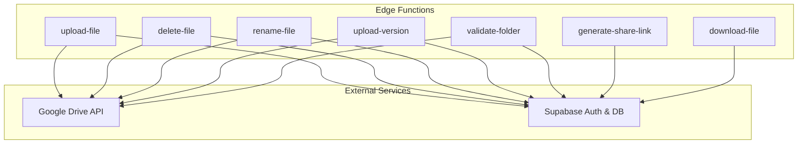
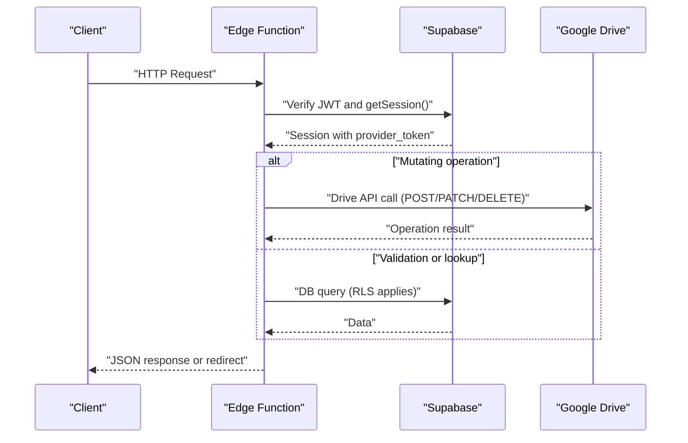
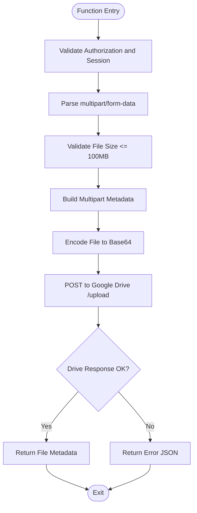
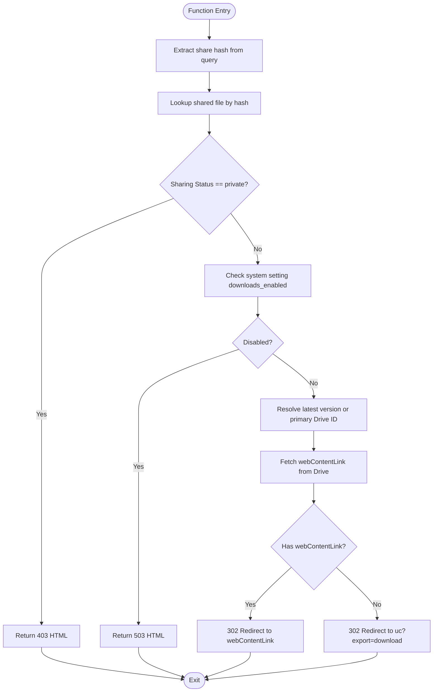
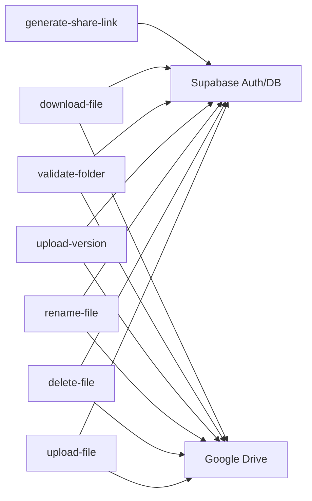

# Edge Functions API

<cite>
**Referenced Files in This Document**
- [supabase\functions\upload-file\index.ts](file://supabase/functions/upload-file/index.ts)
- [supabase\functions\download-file\index.ts](file://supabase/functions/download-file/index.ts)
- [supabase\functions\generate-share-link\index.ts](file://supabase/functions/generate-share-link/index.ts)
- [supabase\functions\delete-file\index.ts](file://supabase/functions/delete-file/index.ts)
- [supabase\functions\rename-file\index.ts](file://supabase/functions/rename-file/index.ts)
- [supabase\functions\upload-version\index.ts](file://supabase/functions/upload-version/index.ts)
- [supabase\functions\validate-folder\index.ts](file://supabase/functions/validate-folder/index.ts)
- [supabase\config.toml](file://supabase/config.toml)
- [supabase\migrations\001_initial_schema.sql](file://supabase/migrations/001_initial_schema.sql)
- [web\src\services\supabase.js](file://web/src/services/supabase.js)
</cite>

## Table of Contents
1. [Introduction](#introduction)
2. [Project Structure](#project-structure)
3. [Core Components](#core-components)
4. [Architecture Overview](#architecture-overview)
5. [Detailed Component Analysis](#detailed-component-analysis)
6. [Dependency Analysis](#dependency-analysis)
7. [Performance Considerations](#performance-considerations)
8. [Troubleshooting Guide](#troubleshooting-guide)
9. [Conclusion](#conclusion)
10. [Appendices](#appendices)

## Introduction
This document describes the Edge Functions API that powers serverless endpoints for file operations and sharing. It covers the purpose, HTTP methods, URL patterns, request/response schemas, authentication requirements, Google Drive integration, file processing workflows, and security measures. It also documents rate limiting considerations, timeout configurations, and debugging techniques for edge function development.

## Project Structure
The Edge Functions are located under the Supabase edge functions directory. Each function exposes a single endpoint with a consistent pattern:
- Base URL: https://your-project-ref.supabase.co/functions/v1/{function-name}
- Path pattern: /functions/{function-name}
- Methods: GET for downloads, POST for uploads and mutations; OPTIONS preflight handled internally

**Diagram sources**
- [supabase\functions\upload-file\index.ts:24-151](file://supabase/functions/upload-file/index.ts#L24-L151)
- [supabase\functions\download-file\index.ts:9-130](file://supabase/functions/download-file/index.ts#L9-L130)
- [supabase\functions\generate-share-link\index.ts:9-54](file://supabase/functions/generate-share-link/index.ts#L9-L54)
- [supabase\functions\delete-file\index.ts:9-71](file://supabase/functions/delete-file/index.ts#L9-L71)
- [supabase\functions\rename-file\index.ts:9-73](file://supabase/functions/rename-file/index.ts#L9-L73)
- [supabase\functions\upload-version\index.ts:11-129](file://supabase/functions/upload-version/index.ts#L11-L129)
- [supabase\functions\validate-folder\index.ts:9-86](file://supabase/functions/validate-folder/index.ts#L9-L86)

**Section sources**
- [supabase\config.toml:1-21](file://supabase/config.toml#L1-L21)

## Core Components
- upload-file: Uploads a file to a specified Google Drive folder using multipart upload; validates size and type; returns file metadata.
- download-file: Redirects to a Google Drive download URL using a share hash; enforces sharing status and system settings.
- generate-share-link: Generates a unique share hash and a short share URL for a file.
- delete-file: Deletes a file from Google Drive using the file’s Drive ID.
- rename-file: Renames a file in Google Drive.
- upload-version: Uploads a new version of an existing file to Google Drive.
- validate-folder: Validates that a given Google Drive ID is a folder and accessible.

**Section sources**
- [supabase\functions\upload-file\index.ts:24-151](file://supabase/functions/upload-file/index.ts#L24-L151)
- [supabase\functions\download-file\index.ts:9-130](file://supabase/functions/download-file/index.ts#L9-L130)
- [supabase\functions\generate-share-link\index.ts:9-54](file://supabase/functions/generate-share-link/index.ts#L9-L54)
- [supabase\functions\delete-file\index.ts:9-71](file://supabase/functions/delete-file/index.ts#L9-L71)
- [supabase\functions\rename-file\index.ts:9-73](file://supabase/functions/rename-file/index.ts#L9-L73)
- [supabase\functions\upload-version\index.ts:11-129](file://supabase/functions/upload-version/index.ts#L11-L129)
- [supabase\functions\validate-folder\index.ts:9-86](file://supabase/functions/validate-folder/index.ts#L9-L86)

## Architecture Overview
The functions integrate with Supabase Auth and Database for session validation and metadata storage, and with Google Drive APIs for file operations. CORS is enabled for cross-origin requests. JWT verification is enforced per function as configured.

**Diagram sources**
- [supabase\functions\upload-file\index.ts:29-44](file://supabase/functions/upload-file/index.ts#L29-L44)
- [supabase\functions\download-file\index.ts:23-44](file://supabase/functions/download-file/index.ts#L23-L44)
- [supabase\functions\generate-share-link\index.ts:14-29](file://supabase/functions/generate-share-link/index.ts#L14-L29)
- [supabase\functions\delete-file\index.ts:14-35](file://supabase/functions/delete-file/index.ts#L14-L35)
- [supabase\functions\rename-file\index.ts:14-35](file://supabase/functions/rename-file/index.ts#L14-L35)
- [supabase\functions\upload-version\index.ts:16-31](file://supabase/functions/upload-version/index.ts#L16-L31)
- [supabase\functions\validate-folder\index.ts:14-37](file://supabase/functions/validate-folder/index.ts#L14-L37)

## Detailed Component Analysis

### Authentication and Security
- All mutating functions require Authorization via Bearer token and enforce JWT verification at the platform level.
- Session validation retrieves provider_token for Google Drive operations.
- Non-mutating functions may not require JWT verification depending on configuration.

**Section sources**
- [supabase\config.toml:1-21](file://supabase/config.toml#L1-L21)
- [supabase\functions\upload-file\index.ts:29-44](file://supabase/functions/upload-file/index.ts#L29-L44)
- [supabase\functions\generate-share-link\index.ts:14-29](file://supabase/functions/generate-share-link/index.ts#L14-L29)
- [supabase\functions\delete-file\index.ts:14-35](file://supabase/functions/delete-file/index.ts#L14-L35)
- [supabase\functions\rename-file\index.ts:14-35](file://supabase/functions/rename-file/index.ts#L14-L35)
- [supabase\functions\upload-version\index.ts:16-31](file://supabase/functions/upload-version/index.ts#L16-L31)
- [supabase\functions\validate-folder\index.ts:14-37](file://supabase/functions/validate-folder/index.ts#L14-L37)

### Endpoint Definitions

#### upload-file
- Method: POST
- URL Pattern: /functions/upload-file
- Purpose: Upload a file to a Google Drive folder; validates size and type; returns file metadata.
- Request
  - Content-Type: multipart/form-data
  - Fields:
    - file: File (required)
    - folder_id: String (required)
- Response (success)
  - Body: { success: boolean, file_id: string, file_name: string, mime_type: string }
  - Status: 200
- Response (error)
  - Body: { error: string }
  - Status: 400
- Validation
  - Max size: 100 MB
  - Allowed MIME types include PDF, DOCX, XLSX, PPTX, JPG, PNG, MP4, ZIP, and others as configured.
  - Blocked extensions: apk, exe, bat, cmd, msi, scr.
- Notes
  - Uses multipart/related upload to Google Drive.
  - Requires Authorization header and valid session.

**Section sources**
- [supabase\functions\upload-file\index.ts:24-151](file://supabase/functions/upload-file/index.ts#L24-L151)
- [supabase\config.toml:4-5](file://supabase/config.toml#L4-L5)

#### download-file
- Method: GET
- URL Pattern: /functions/download-file?hash={share_hash}
- Purpose: Redirect to a downloadable file using the share hash; respects sharing status and system settings.
- Query Parameter
  - hash: String (required)
- Response (success)
  - Status: 302 Found (redirect)
  - Location: Google Drive webContentLink or fallback uc?export=download
- Response (not found)
  - Status: 404 Not Found
  - Body: HTML page
- Response (access denied)
  - Status: 403 Forbidden
  - Body: HTML page
- Response (service unavailable)
  - Status: 503 Service Unavailable
  - Body: HTML page
- Response (error)
  - Status: 500 Internal Server Error
  - Body: HTML page
- Notes
  - Does not require JWT verification.
  - Uses service role to bypass RLS for internal queries.

**Section sources**
- [supabase\functions\download-file\index.ts:9-130](file://supabase/functions/download-file/index.ts#L9-L130)
- [supabase\config.toml:16-17](file://supabase/config.toml#L16-L17)

#### generate-share-link
- Method: POST
- URL Pattern: /functions/generate-share-link
- Purpose: Generate a unique share hash and a short share URL.
- Request
  - Body: {}
- Response (success)
  - Body: { success: boolean, share_hash: string, share_url: string }
  - Status: 200
- Response (error)
  - Body: { error: string }
  - Status: 400
- Notes
  - Requires Authorization header and valid session.

**Section sources**
- [supabase\functions\generate-share-link\index.ts:9-54](file://supabase/functions/generate-share-link/index.ts#L9-L54)
- [supabase\config.toml:13-14](file://supabase/config.toml#L13-L14)

#### delete-file
- Method: POST
- URL Pattern: /functions/delete-file
- Purpose: Delete a file from Google Drive by file ID.
- Request
  - Body: { file_id: string }
- Response (success)
  - Body: { success: boolean }
  - Status: 200
- Response (error)
  - Body: { error: string }
  - Status: 400
- Notes
  - Requires Authorization header and valid session.
  - Handles 404 gracefully.

**Section sources**
- [supabase\functions\delete-file\index.ts:9-71](file://supabase/functions/delete-file/index.ts#L9-L71)
- [supabase\config.toml:10-11](file://supabase/config.toml#L10-L11)

#### rename-file
- Method: POST
- URL Pattern: /functions/rename-file
- Purpose: Rename a file in Google Drive.
- Request
  - Body: { file_id: string, new_name: string }
- Response (success)
  - Body: { success: boolean }
  - Status: 200
- Response (error)
  - Body: { error: string }
  - Status: 400
- Notes
  - Requires Authorization header and valid session.

**Section sources**
- [supabase\functions\rename-file\index.ts:9-73](file://supabase/functions/rename-file/index.ts#L9-L73)
- [supabase\config.toml:7-8](file://supabase/config.toml#L7-L8)

#### upload-version
- Method: POST
- URL Pattern: /functions/upload-version
- Purpose: Upload a new version of an existing file to Google Drive; validates size; returns file metadata.
- Request
  - Content-Type: multipart/form-data
  - Fields:
    - file: File (required)
    - folder_id: String (required)
- Response (success)
  - Body: { success: boolean, file_id: string, file_name: string, mime_type: string }
  - Status: 200
- Response (error)
  - Body: { error: string }
  - Status: 400
- Validation
  - Max size: 100 MB
- Notes
  - Uses multipart/related upload to Google Drive.
  - Requires Authorization header and valid session.

**Section sources**
- [supabase\functions\upload-version\index.ts:11-129](file://supabase/functions/upload-version/index.ts#L11-L129)
- [supabase\config.toml:19-20](file://supabase/config.toml#L19-L20)

#### validate-folder
- Method: POST
- URL Pattern: /functions/validate-folder
- Purpose: Validate that a Google Drive ID corresponds to an accessible folder.
- Request
  - Body: { folder_id: string }
- Response (success)
  - Body: { success: boolean, folder: { id: string, name: string, mimeType: string } }
  - Status: 200
- Response (error)
  - Body: { error: string }
  - Status: 400
- Notes
  - Requires Authorization header and valid session.

**Section sources**
- [supabase\functions\validate-folder\index.ts:9-86](file://supabase/functions/validate-folder/index.ts#L9-L86)
- [supabase\config.toml:1-2](file://supabase/config.toml#L1-L2)

### Request/Response Examples

#### upload-file (Success)
- Request
  - Method: POST
  - URL: /functions/upload-file
  - Headers: Authorization: Bearer <token>, Content-Type: multipart/form-data
  - Body: form-data with fields file and folder_id
- Response
  - Status: 200
  - Body: { "success": true, "file_id": "...", "file_name": "...", "mime_type": "..." }

#### upload-file (Error)
- Response
  - Status: 400
  - Body: { "error": "..." }

#### download-file (Redirect)
- Request
  - Method: GET
  - URL: /functions/download-file?hash=...
- Response
  - Status: 302
  - Location: https://www.googleapis.com/... or https://drive.google.com/uc?...

#### generate-share-link (Success)
- Request
  - Method: POST
  - URL: /functions/generate-share-link
  - Headers: Authorization: Bearer <token>
- Response
  - Status: 200
  - Body: { "success": true, "share_hash": "...", "share_url": "/download/..." }

#### delete-file (Success)
- Request
  - Method: POST
  - URL: /functions/delete-file
  - Headers: Authorization: Bearer <token>
  - Body: { "file_id": "..." }
- Response
  - Status: 200
  - Body: { "success": true }

#### rename-file (Success)
- Request
  - Method: POST
  - URL: /functions/rename-file
  - Headers: Authorization: Bearer <token>
  - Body: { "file_id": "...", "new_name": "..." }
- Response
  - Status: 200
  - Body: { "success": true }

#### upload-version (Success)
- Request
  - Method: POST
  - URL: /functions/upload-version
  - Headers: Authorization: Bearer <token>, Content-Type: multipart/form-data
  - Body: form-data with fields file and folder_id
- Response
  - Status: 200
  - Body: { "success": true, "file_id": "...", "file_name": "...", "mime_type": "..." }

#### validate-folder (Success)
- Request
  - Method: POST
  - URL: /functions/validate-folder
  - Headers: Authorization: Bearer <token>
  - Body: { "folder_id": "..." }
- Response
  - Status: 200
  - Body: { "success": true, "folder": { "id": "...", "name": "...", "mimeType": "application/vnd.google-apps.folder" } }

### Error Handling Patterns
- Mutating functions return JSON errors with 400 status on validation or API failures.
- download-file returns HTML pages with appropriate status codes for not found, forbidden, and service unavailable scenarios.
- validate-folder throws descriptive errors when the ID is invalid or not a folder.

**Section sources**
- [supabase\functions\upload-file\index.ts:142-150](file://supabase/functions/upload-file/index.ts#L142-L150)
- [supabase\functions\download-file\index.ts:36-44](file://supabase/functions/download-file/index.ts#L36-L44)
- [supabase\functions\generate-share-link\index.ts:45-53](file://supabase/functions/generate-share-link/index.ts#L45-L53)
- [supabase\functions\delete-file\index.ts:62-70](file://supabase/functions/delete-file/index.ts#L62-L70)
- [supabase\functions\rename-file\index.ts:64-72](file://supabase/functions/rename-file/index.ts#L64-L72)
- [supabase\functions\upload-version\index.ts:120-128](file://supabase/functions/upload-version/index.ts#L120-L128)
- [supabase\functions\validate-folder\index.ts:77-85](file://supabase/functions/validate-folder/index.ts#L77-L85)

### Google Drive Integration
- All Drive operations use the user’s provider_token retrieved from the Supabase session.
- Supported operations:
  - Upload files (initial and versioned) via multipart/related.
  - Rename files via PATCH.
  - Delete files via DELETE.
  - Validate folder existence and type.
  - Download via redirect to Drive URLs or fallback export URL.

**Section sources**
- [supabase\functions\upload-file\index.ts:70-121](file://supabase/functions/upload-file/index.ts#L70-L121)
- [supabase\functions\upload-version\index.ts:51-99](file://supabase/functions/upload-version/index.ts#L51-L99)
- [supabase\functions\rename-file\index.ts:39-50](file://supabase/functions/rename-file/index.ts#L39-L50)
- [supabase\functions\delete-file\index.ts:39-48](file://supabase/functions/delete-file/index.ts#L39-L48)
- [supabase\functions\validate-folder\index.ts:41-59](file://supabase/functions/validate-folder/index.ts#L41-L59)
- [supabase\functions\download-file\index.ts:98-118](file://supabase/functions/download-file/index.ts#L98-L118)

### File Processing Workflows

#### Upload Workflow (Initial and Versioned)

**Diagram sources**
- [supabase\functions\upload-file\index.ts:70-121](file://supabase/functions/upload-file/index.ts#L70-L121)
- [supabase\functions\upload-version\index.ts:51-99](file://supabase/functions/upload-version/index.ts#L51-L99)

#### Download Workflow

**Diagram sources**
- [supabase\functions\download-file\index.ts:14-118](file://supabase/functions/download-file/index.ts#L14-L118)

## Dependency Analysis
- All functions depend on Supabase Auth for session validation and on Google Drive APIs for file operations.
- download-file additionally depends on Supabase DB for metadata lookup and system settings.
- JWT verification is configured per function in the Supabase configuration.

**Diagram sources**
- [supabase\functions\upload-file\index.ts:29-44](file://supabase/functions/upload-file/index.ts#L29-L44)
- [supabase\functions\download-file\index.ts:23-44](file://supabase/functions/download-file/index.ts#L23-L44)
- [supabase\functions\generate-share-link\index.ts:14-29](file://supabase/functions/generate-share-link/index.ts#L14-L29)
- [supabase\functions\delete-file\index.ts:14-35](file://supabase/functions/delete-file/index.ts#L14-L35)
- [supabase\functions\rename-file\index.ts:14-35](file://supabase/functions/rename-file/index.ts#L14-L35)
- [supabase\functions\upload-version\index.ts:16-31](file://supabase/functions/upload-version/index.ts#L16-L31)
- [supabase\functions\validate-folder\index.ts:14-37](file://supabase/functions/validate-folder/index.ts#L14-L37)

**Section sources**
- [supabase\config.toml:1-21](file://supabase/config.toml#L1-L21)

## Performance Considerations
- File size limits: 100 MB for uploads and versions.
- Network timeouts: Expect Drive API latency; consider retry logic client-side if needed.
- CORS: All functions set broad CORS headers; ensure client-side requests align with allowed headers.
- Rate limiting: Supabase and Google Drive impose quotas; implement client-side backoff and user feedback.
- Memory: Base64 encoding increases payload size; consider streaming alternatives if supported by the runtime.

[No sources needed since this section provides general guidance]

## Troubleshooting Guide
- Missing Authorization header
  - Symptom: 400 error with message indicating missing authorization.
  - Fix: Include Authorization: Bearer <token> header.
- Not authenticated
  - Symptom: 400 error after session validation fails.
  - Fix: Ensure user is logged in and session is valid.
- File size exceeded
  - Symptom: 400 error mentioning size limit.
  - Fix: Compress or split the file.
- Blocked extension/type
  - Symptom: 400 error for disallowed file type.
  - Fix: Use an allowed MIME type or extension.
- Drive API error
  - Symptom: 400 error with Drive error message.
  - Fix: Verify folder_id correctness and permissions; check provider_token validity.
- Download not found
  - Symptom: 404 HTML page.
  - Fix: Confirm share hash validity and that the file exists.
- Download forbidden
  - Symptom: 403 HTML page.
  - Fix: The file is private; adjust sharing status.
- Downloads disabled
  - Symptom: 503 HTML page.
  - Fix: Wait until downloads are enabled or contact administrators.

**Section sources**
- [supabase\functions\upload-file\index.ts:59-68](file://supabase/functions/upload-file/index.ts#L59-L68)
- [supabase\functions\download-file\index.ts:19-21](file://supabase/functions/download-file/index.ts#L19-L21)
- [supabase\functions\download-file\index.ts:46-55](file://supabase/functions/download-file/index.ts#L46-L55)
- [supabase\functions\download-file\index.ts:64-72](file://supabase/functions/download-file/index.ts#L64-L72)
- [supabase\functions\validate-folder\index.ts:58-61](file://supabase/functions/validate-folder/index.ts#L58-L61)

## Conclusion
The Edge Functions API provides a secure, serverless foundation for file operations integrated with Google Drive and Supabase. By enforcing JWT verification, validating inputs, and leveraging Drive’s native capabilities, the system supports robust upload, versioning, sharing, and retrieval workflows. Follow the documented patterns for authentication, request schemas, and error handling to build reliable integrations.

[No sources needed since this section summarizes without analyzing specific files]

## Appendices

### Database Schema Highlights
- shared_files: Stores file metadata, share hash, and sharing status.
- file_versions: Stores versioned file references linked to shared_files.
- system_settings: Controls operational toggles like downloads_enabled.

**Section sources**
- [supabase\migrations\001_initial_schema.sql:55-83](file://supabase/migrations/001_initial_schema.sql#L55-L83)
- [supabase\migrations\001_initial_schema.sql:107-122](file://supabase/migrations/001_initial_schema.sql#L107-L122)

### Frontend Supabase Client
- The web app initializes a Supabase client using Vite environment variables for URL and anonymous key.

**Section sources**
- [web\src\services\supabase.js:1-7](file://web/src/services/supabase.js#L1-L7)