# Admin Panel

<cite>
**Referenced Files in This Document**
- [AdminLayout.jsx](file://web/src/layouts/AdminLayout.jsx)
- [AdminDashboardPage.jsx](file://web/src/pages/AdminDashboardPage.jsx)
- [AdminLoginPage.jsx](file://web/src/pages/AdminLoginPage.jsx)
- [AuthContext.jsx](file://web/src/contexts/AuthContext.jsx)
- [App.jsx](file://web/src/App.jsx)
- [AuthCallback.jsx](file://web/src/pages/AuthCallback.jsx)
- [AccessDeniedPage.jsx](file://web/src/pages/AccessDeniedPage.jsx)
- [supabase.js](file://web/src/services/supabase.js)
- [helpers.js](file://web/src/utils/helpers.js)
- [001_initial_schema.sql](file://supabase/migrations/001_initial_schema.sql)
- [config.toml](file://supabase/config.toml)
</cite>

## Table of Contents
1. [Introduction](#introduction)
2. [Project Structure](#project-structure)
3. [Core Components](#core-components)
4. [Architecture Overview](#architecture-overview)
5. [Detailed Component Analysis](#detailed-component-analysis)
6. [Dependency Analysis](#dependency-analysis)
7. [Performance Considerations](#performance-considerations)
8. [Troubleshooting Guide](#troubleshooting-guide)
9. [Conclusion](#conclusion)

## Introduction
This document explains the admin panel functionality for the Neo Files Transfer platform. It covers the admin authentication system, user management capabilities, system monitoring features, dashboard components, user activity tracking, and system configuration options. It also documents role-based access control, security measures for admin sessions, common administrative workflows, and troubleshooting procedures for system administrators.

## Project Structure
The admin panel is implemented as a React application integrated with Supabase for authentication and data persistence. The admin area is protected and routed under /admin, with dedicated pages for login and the dashboard. Authentication is handled centrally via a context provider that checks admin privileges against the database.

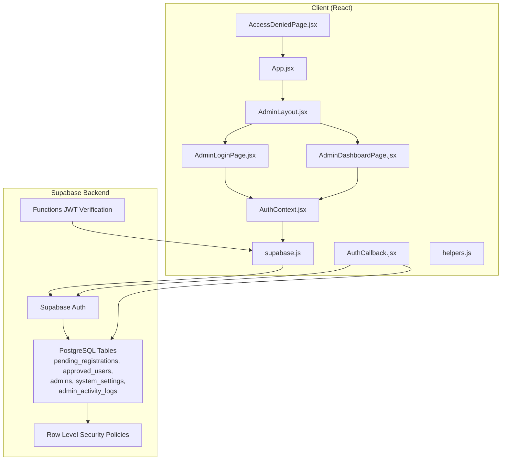

**Diagram sources**
- [AdminLayout.jsx:1-10](file://web/src/layouts/AdminLayout.jsx#L1-L10)
- [AdminLoginPage.jsx:1-82](file://web/src/pages/AdminLoginPage.jsx#L1-L82)
- [AdminDashboardPage.jsx:1-436](file://web/src/pages/AdminDashboardPage.jsx#L1-L436)
- [AuthContext.jsx:1-112](file://web/src/contexts/AuthContext.jsx#L1-L112)
- [App.jsx:1-92](file://web/src/App.jsx#L1-L92)
- [AuthCallback.jsx:1-84](file://web/src/pages/AuthCallback.jsx#L1-L84)
- [AccessDeniedPage.jsx:1-23](file://web/src/pages/AccessDeniedPage.jsx#L1-L23)
- [supabase.js:1-7](file://web/src/services/supabase.js#L1-L7)
- [001_initial_schema.sql:1-289](file://supabase/migrations/001_initial_schema.sql#L1-L289)
- [config.toml:1-21](file://supabase/config.toml#L1-L21)

**Section sources**
- [AdminLayout.jsx:1-10](file://web/src/layouts/AdminLayout.jsx#L1-L10)
- [AdminLoginPage.jsx:1-82](file://web/src/pages/AdminLoginPage.jsx#L1-L82)
- [AdminDashboardPage.jsx:1-436](file://web/src/pages/AdminDashboardPage.jsx#L1-L436)
- [AuthContext.jsx:1-112](file://web/src/contexts/AuthContext.jsx#L1-L112)
- [App.jsx:1-92](file://web/src/App.jsx#L1-L92)
- [AuthCallback.jsx:1-84](file://web/src/pages/AuthCallback.jsx#L1-L84)
- [AccessDeniedPage.jsx:1-23](file://web/src/pages/AccessDeniedPage.jsx#L1-L23)
- [supabase.js:1-7](file://web/src/services/supabase.js#L1-L7)
- [001_initial_schema.sql:1-289](file://supabase/migrations/001_initial_schema.sql#L1-L289)
- [config.toml:1-21](file://supabase/config.toml#L1-L21)

## Core Components
- AdminLayout: Provides the base layout for admin routes.
- AdminLoginPage: Handles admin login via Google OAuth and enforces admin role.
- AdminDashboardPage: Central admin interface for managing users and system settings, with statistics and activity logging.
- AuthContext: Centralized authentication and admin role checking, session lifecycle, and profile loading.
- App routing: Defines protected admin routes and guards.
- AuthCallback: Finalizes authentication after OAuth, validates approvals, creates profiles, and redirects based on role.
- Supabase service: Initializes the Supabase client for database and auth operations.
- Helpers: Utility functions for date formatting used in the admin dashboard.

**Section sources**
- [AdminLayout.jsx:1-10](file://web/src/layouts/AdminLayout.jsx#L1-L10)
- [AdminLoginPage.jsx:1-82](file://web/src/pages/AdminLoginPage.jsx#L1-L82)
- [AdminDashboardPage.jsx:1-436](file://web/src/pages/AdminDashboardPage.jsx#L1-L436)
- [AuthContext.jsx:1-112](file://web/src/contexts/AuthContext.jsx#L1-L112)
- [App.jsx:1-92](file://web/src/App.jsx#L1-L92)
- [AuthCallback.jsx:1-84](file://web/src/pages/AuthCallback.jsx#L1-L84)
- [supabase.js:1-7](file://web/src/services/supabase.js#L1-L7)
- [helpers.js:1-52](file://web/src/utils/helpers.js#L1-L52)

## Architecture Overview
The admin panel relies on Supabase Auth for identity and Supabase SQL for data. Admins are identified by membership in the admins table. The dashboard reads pending registrations, approved users, and system settings, and writes updates to these tables along with admin activity logs. Row-level security policies restrict access to authenticated users and enforce admin-only actions where applicable.

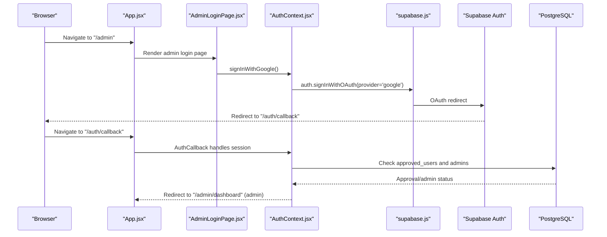

**Diagram sources**
- [App.jsx:54-92](file://web/src/App.jsx#L54-L92)
- [AdminLoginPage.jsx:1-82](file://web/src/pages/AdminLoginPage.jsx#L1-L82)
- [AuthContext.jsx:66-75](file://web/src/contexts/AuthContext.jsx#L66-L75)
- [AuthCallback.jsx:1-84](file://web/src/pages/AuthCallback.jsx#L1-L84)
- [supabase.js:1-7](file://web/src/services/supabase.js#L1-L7)
- [001_initial_schema.sql:29-40](file://supabase/migrations/001_initial_schema.sql#L29-L40)

## Detailed Component Analysis

### Admin Authentication System
- Admin login uses Google OAuth initiated from the admin login page. The authentication flow is handled by Supabase Auth.
- After OAuth, the callback route validates whether the user is approved or is an admin. Non-approved users are signed out and redirected.
- The AuthContext loads the user profile and determines admin status by checking the admins table.
- AdminRoute guard ensures only authenticated admins can access admin pages.

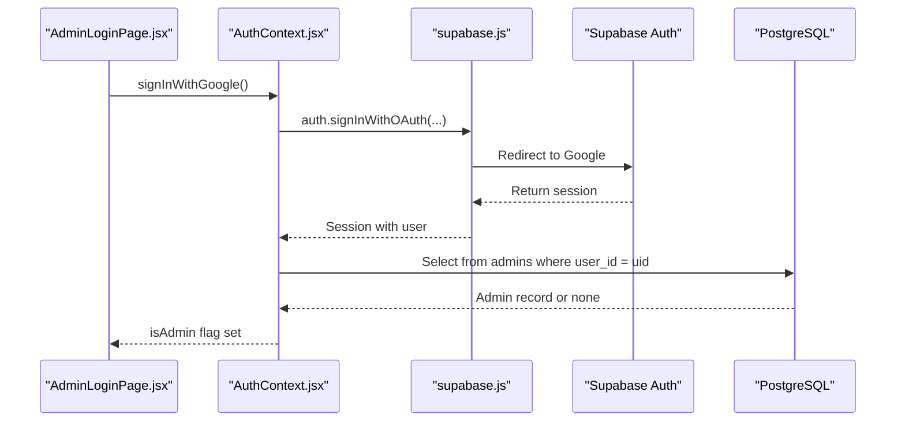

**Diagram sources**
- [AdminLoginPage.jsx:26-35](file://web/src/pages/AdminLoginPage.jsx#L26-L35)
- [AuthContext.jsx:66-75](file://web/src/contexts/AuthContext.jsx#L66-L75)
- [AuthContext.jsx:40-64](file://web/src/contexts/AuthContext.jsx#L40-L64)
- [001_initial_schema.sql:29-40](file://supabase/migrations/001_initial_schema.sql#L29-L40)

**Section sources**
- [AdminLoginPage.jsx:1-82](file://web/src/pages/AdminLoginPage.jsx#L1-L82)
- [AuthContext.jsx:1-112](file://web/src/contexts/AuthContext.jsx#L1-L112)
- [AuthCallback.jsx:1-84](file://web/src/pages/AuthCallback.jsx#L1-L84)
- [App.jsx:35-41](file://web/src/App.jsx#L35-L41)
- [001_initial_schema.sql:29-40](file://supabase/migrations/001_initial_schema.sql#L29-L40)

### Role-Based Access Control (RBAC)
- Admins are stored in the admins table with a role field supporting super_admin and admin.
- The AuthContext checks admin status by querying the admins table using the authenticated user’s ID.
- The AdminRoute wrapper enforces that only users flagged as admins can enter admin pages.

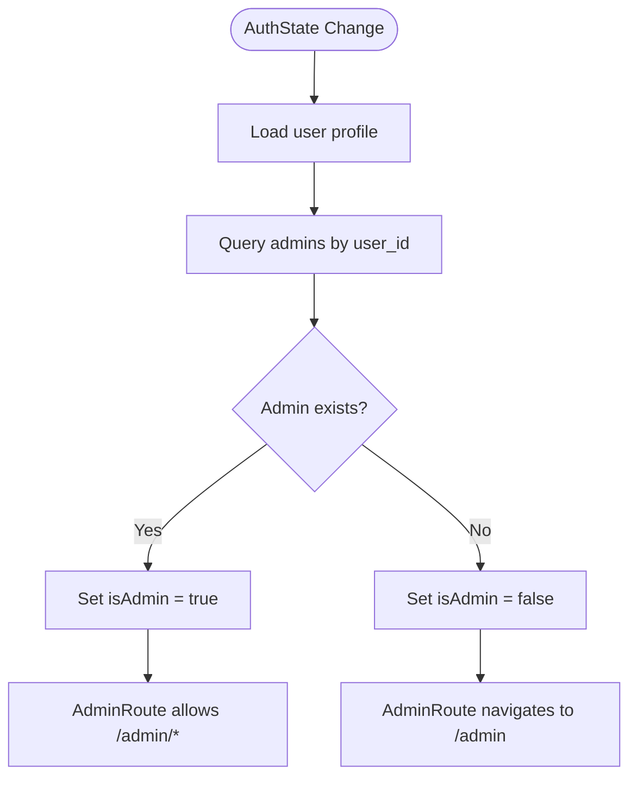

**Diagram sources**
- [AuthContext.jsx:40-64](file://web/src/contexts/AuthContext.jsx#L40-L64)
- [App.jsx:35-41](file://web/src/App.jsx#L35-L41)
- [001_initial_schema.sql:29-40](file://supabase/migrations/001_initial_schema.sql#L29-L40)

**Section sources**
- [AuthContext.jsx:40-64](file://web/src/contexts/AuthContext.jsx#L40-L64)
- [App.jsx:35-41](file://web/src/App.jsx#L35-L41)
- [001_initial_schema.sql:29-40](file://supabase/migrations/001_initial_schema.sql#L29-L40)

### User Management Capabilities
- Pending registrations: View, approve, reject, and delete pending registration records.
- Approved users: View and contact approved users.
- Activity logging: Admin actions are recorded in admin_activity_logs for auditability.
- Search and filtering: Filter pending and approved users by name/email.

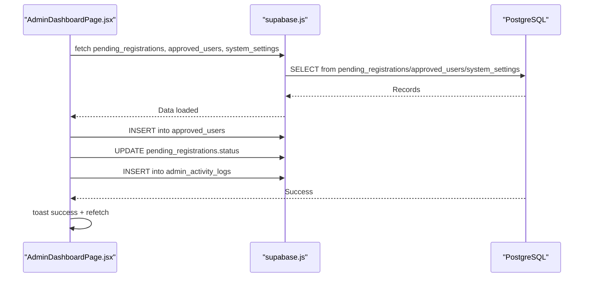

**Diagram sources**
- [AdminDashboardPage.jsx:27-95](file://web/src/pages/AdminDashboardPage.jsx#L27-L95)
- [AdminDashboardPage.jsx:108-127](file://web/src/pages/AdminDashboardPage.jsx#L108-L127)
- [001_initial_schema.sql:6-28](file://supabase/migrations/001_initial_schema.sql#L6-L28)
- [001_initial_schema.sql:96-103](file://supabase/migrations/001_initial_schema.sql#L96-L103)

**Section sources**
- [AdminDashboardPage.jsx:1-436](file://web/src/pages/AdminDashboardPage.jsx#L1-L436)
- [001_initial_schema.sql:6-28](file://supabase/migrations/001_initial_schema.sql#L6-L28)
- [001_initial_schema.sql:96-103](file://supabase/migrations/001_initial_schema.sql#L96-L103)

### System Monitoring Features
- Statistics cards show total registrations, pending, approved, and active users.
- System controls tab toggles maintenance mode, downloads, and sharing globally.
- Admin activity logs capture admin actions for auditing.

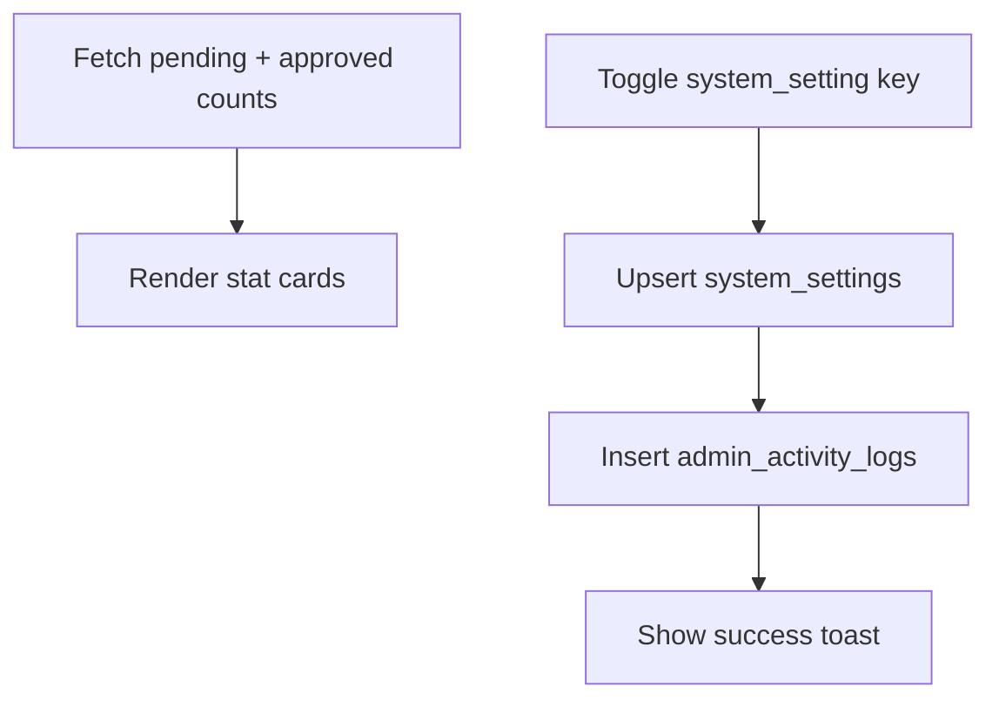

**Diagram sources**
- [AdminDashboardPage.jsx:172-177](file://web/src/pages/AdminDashboardPage.jsx#L172-L177)
- [AdminDashboardPage.jsx:108-127](file://web/src/pages/AdminDashboardPage.jsx#L108-L127)
- [001_initial_schema.sql:107-122](file://supabase/migrations/001_initial_schema.sql#L107-L122)
- [001_initial_schema.sql:96-103](file://supabase/migrations/001_initial_schema.sql#L96-L103)

**Section sources**
- [AdminDashboardPage.jsx:172-177](file://web/src/pages/AdminDashboardPage.jsx#L172-L177)
- [AdminDashboardPage.jsx:108-127](file://web/src/pages/AdminDashboardPage.jsx#L108-L127)
- [001_initial_schema.sql:107-122](file://supabase/migrations/001_initial_schema.sql#L107-L122)
- [001_initial_schema.sql:96-103](file://supabase/migrations/001_initial_schema.sql#L96-L103)

### Admin Dashboard Components
- Header: Admin portal branding, current admin email, logout button.
- Tabs: Pending, Approved, Settings.
- Pending tab: Table with actions (approve, reject, delete, email, call).
- Approved tab: Table with contact actions.
- Settings tab: Toggles for maintenance mode, downloads, and sharing.

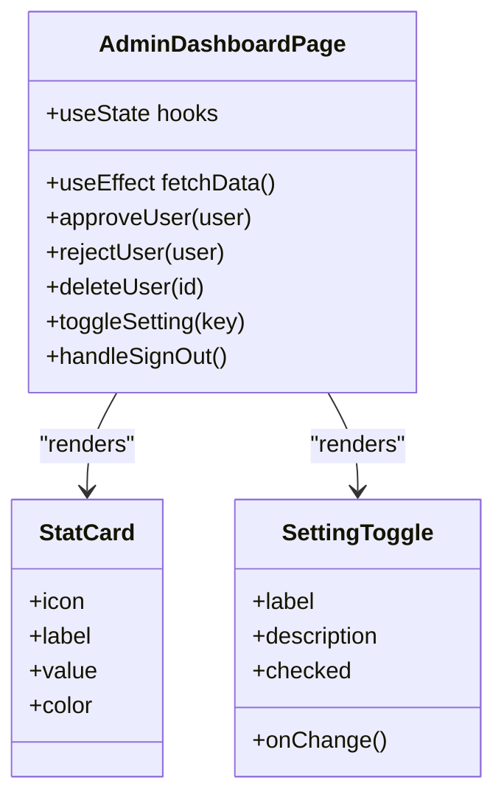

**Diagram sources**
- [AdminDashboardPage.jsx:13-436](file://web/src/pages/AdminDashboardPage.jsx#L13-L436)

**Section sources**
- [AdminDashboardPage.jsx:148-394](file://web/src/pages/AdminDashboardPage.jsx#L148-L394)

### User Activity Tracking
- The system tracks admin actions in admin_activity_logs with fields for admin_id, action, details, and timestamp.
- Examples include user approval/rejection, toggling settings, and admin logout.
- Regular users’ activities are tracked separately in activity_logs.

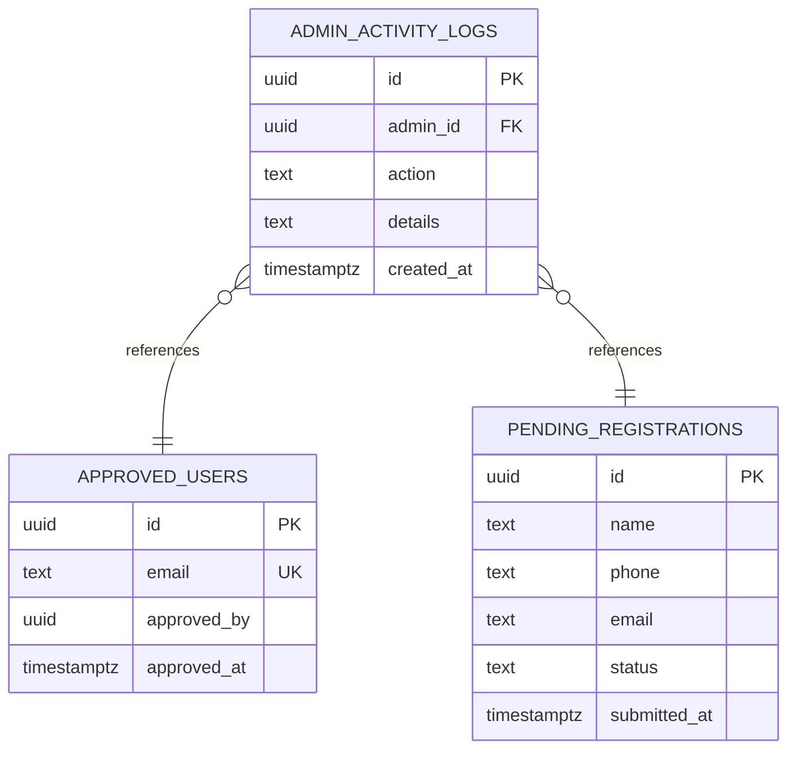

**Diagram sources**
- [AdminDashboardPage.jsx:63-67](file://web/src/pages/AdminDashboardPage.jsx#L63-L67)
- [AdminDashboardPage.jsx:84-88](file://web/src/pages/AdminDashboardPage.jsx#L84-L88)
- [AdminDashboardPage.jsx:116-120](file://web/src/pages/AdminDashboardPage.jsx#L116-L120)
- [AdminDashboardPage.jsx:130-134](file://web/src/pages/AdminDashboardPage.jsx#L130-L134)
- [001_initial_schema.sql:96-103](file://supabase/migrations/001_initial_schema.sql#L96-L103)
- [001_initial_schema.sql:19-28](file://supabase/migrations/001_initial_schema.sql#L19-L28)

**Section sources**
- [AdminDashboardPage.jsx:47-95](file://web/src/pages/AdminDashboardPage.jsx#L47-L95)
- [AdminDashboardPage.jsx:108-127](file://web/src/pages/AdminDashboardPage.jsx#L108-L127)
- [AdminDashboardPage.jsx:129-137](file://web/src/pages/AdminDashboardPage.jsx#L129-L137)
- [001_initial_schema.sql:96-103](file://supabase/migrations/001_initial_schema.sql#L96-L103)

### System Configuration Options
- System settings are stored in system_settings with key/value pairs and updated via upsert.
- Default settings include maintenance_mode, downloads_enabled, sharing_enabled, allowed_file_types, and max_upload_size.
- Admins can toggle settings from the dashboard; each change is logged.

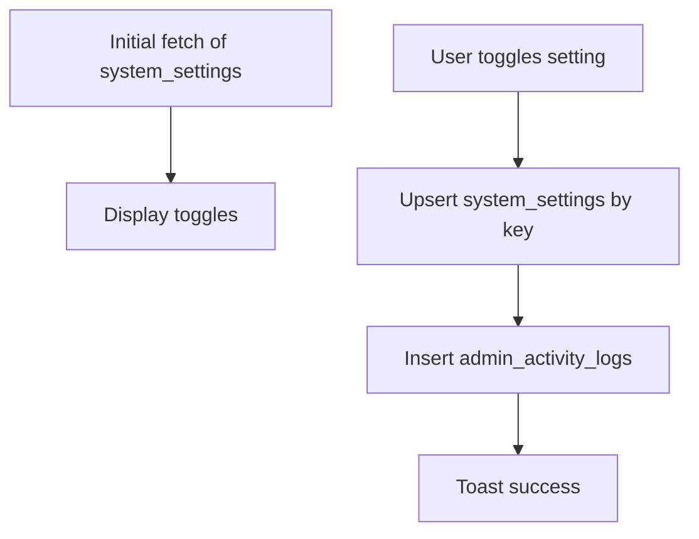

**Diagram sources**
- [AdminDashboardPage.jsx:30-45](file://web/src/pages/AdminDashboardPage.jsx#L30-L45)
- [AdminDashboardPage.jsx:108-127](file://web/src/pages/AdminDashboardPage.jsx#L108-L127)
- [001_initial_schema.sql:107-122](file://supabase/migrations/001_initial_schema.sql#L107-L122)
- [001_initial_schema.sql:96-103](file://supabase/migrations/001_initial_schema.sql#L96-L103)

**Section sources**
- [AdminDashboardPage.jsx:30-45](file://web/src/pages/AdminDashboardPage.jsx#L30-L45)
- [AdminDashboardPage.jsx:108-127](file://web/src/pages/AdminDashboardPage.jsx#L108-L127)
- [001_initial_schema.sql:107-122](file://supabase/migrations/001_initial_schema.sql#L107-L122)

### Security Measures for Admin Sessions
- Admin login requires Google OAuth and subsequent verification of admin status.
- AdminRoute guard prevents unauthorized access to admin pages.
- AuthCallback enforces approval/admin status and redirects accordingly.
- Row-level security policies restrict access to admin-only data and actions.

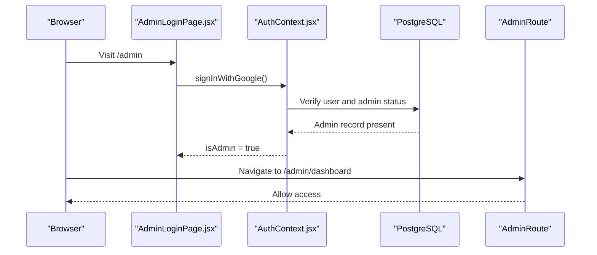

**Diagram sources**
- [AdminLoginPage.jsx:21-24](file://web/src/pages/AdminLoginPage.jsx#L21-L24)
- [AuthContext.jsx:40-64](file://web/src/contexts/AuthContext.jsx#L40-L64)
- [App.jsx:35-41](file://web/src/App.jsx#L35-L41)

**Section sources**
- [AdminLoginPage.jsx:21-24](file://web/src/pages/AdminLoginPage.jsx#L21-L24)
- [AuthContext.jsx:40-64](file://web/src/contexts/AuthContext.jsx#L40-L64)
- [App.jsx:35-41](file://web/src/App.jsx#L35-L41)
- [AuthCallback.jsx:34-39](file://web/src/pages/AuthCallback.jsx#L34-L39)
- [001_initial_schema.sql:241-253](file://supabase/migrations/001_initial_schema.sql#L241-L253)

### Common Administrative Tasks
- Approve a pending user registration: Update status to approved, insert into approved_users, log admin action, notify success.
- Reject a pending user registration: Update status to rejected and log admin action.
- Delete a pending registration: Confirm and remove the record.
- Toggle system settings: Enable/disable maintenance mode, downloads, and sharing; log each change.
- Sign out: Record admin logout and clear session.

**Section sources**
- [AdminDashboardPage.jsx:47-95](file://web/src/pages/AdminDashboardPage.jsx#L47-L95)
- [AdminDashboardPage.jsx:108-127](file://web/src/pages/AdminDashboardPage.jsx#L108-L127)
- [AdminDashboardPage.jsx:129-137](file://web/src/pages/AdminDashboardPage.jsx#L129-L137)

### Reporting Capabilities
- The dashboard displays summary statistics and searchable lists of pending and approved users.
- Admin activity logs provide an audit trail of administrative actions.

**Section sources**
- [AdminDashboardPage.jsx:172-177](file://web/src/pages/AdminDashboardPage.jsx#L172-L177)
- [AdminDashboardPage.jsx:139-146](file://web/src/pages/AdminDashboardPage.jsx#L139-L146)
- [001_initial_schema.sql:96-103](file://supabase/migrations/001_initial_schema.sql#L96-L103)

### System Maintenance Procedures
- Use the maintenance mode toggle to temporarily disable user access while performing maintenance.
- Monitor system settings such as allowed file types and maximum upload size to ensure safe operation.

**Section sources**
- [AdminDashboardPage.jsx:369-380](file://web/src/pages/AdminDashboardPage.jsx#L369-L380)
- [001_initial_schema.sql:115-122](file://supabase/migrations/001_initial_schema.sql#L115-L122)

## Dependency Analysis
- AdminDashboardPage depends on AuthContext for admin identity and on Supabase for data operations.
- AdminLoginPage depends on AuthContext for initiating OAuth and on Supabase for session management.
- AuthContext depends on Supabase client initialization and database tables for profile and admin checks.
- App routing defines AdminRoute protection around admin pages.
- Supabase functions are configured to require JWT verification for most endpoints.

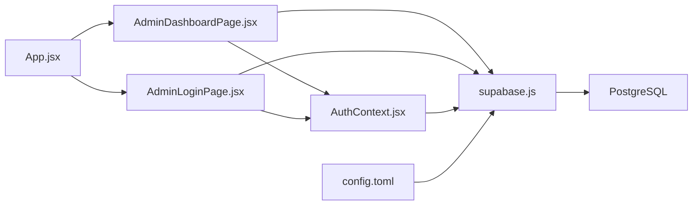

**Diagram sources**
- [AdminDashboardPage.jsx:1-12](file://web/src/pages/AdminDashboardPage.jsx#L1-L12)
- [AdminLoginPage.jsx:1-6](file://web/src/pages/AdminLoginPage.jsx#L1-L6)
- [AuthContext.jsx:1-10](file://web/src/contexts/AuthContext.jsx#L1-L10)
- [App.jsx:1-92](file://web/src/App.jsx#L1-L92)
- [supabase.js:1-7](file://web/src/services/supabase.js#L1-L7)
- [config.toml:1-21](file://supabase/config.toml#L1-L21)

**Section sources**
- [AdminDashboardPage.jsx:1-12](file://web/src/pages/AdminDashboardPage.jsx#L1-L12)
- [AdminLoginPage.jsx:1-6](file://web/src/pages/AdminLoginPage.jsx#L1-L6)
- [AuthContext.jsx:1-10](file://web/src/contexts/AuthContext.jsx#L1-L10)
- [App.jsx:1-92](file://web/src/App.jsx#L1-L92)
- [supabase.js:1-7](file://web/src/services/supabase.js#L1-L7)
- [config.toml:1-21](file://supabase/config.toml#L1-L21)

## Performance Considerations
- Parallel data fetching: The dashboard fetches pending registrations, approved users, and system settings concurrently to reduce load time.
- Local state filtering: Search filters are applied client-side on loaded datasets to minimize repeated network requests.
- Toast notifications: Lightweight feedback without heavy DOM updates.

**Section sources**
- [AdminDashboardPage.jsx:30-45](file://web/src/pages/AdminDashboardPage.jsx#L30-L45)
- [AdminDashboardPage.jsx:139-146](file://web/src/pages/AdminDashboardPage.jsx#L139-L146)

## Troubleshooting Guide
- Admin login fails: Verify Google OAuth configuration and that the user is an admin. Check for errors during signInWithGoogle and review toast messages.
- Not redirected to admin dashboard: Ensure the user is marked as admin in the admins table and that AdminRoute is functioning.
- Access denied page appears: The user is neither approved nor admin; they will be signed out automatically.
- Settings not updating: Confirm authenticated admin session and that upsert operations succeed; check for errors and verify system_settings policy allows updates.
- Pending approvals not visible: Ensure authenticated session and that RLS allows select on pending_registrations for authenticated users.

**Section sources**
- [AdminLoginPage.jsx:30-35](file://web/src/pages/AdminLoginPage.jsx#L30-L35)
- [App.jsx:35-41](file://web/src/App.jsx#L35-L41)
- [AccessDeniedPage.jsx:1-23](file://web/src/pages/AccessDeniedPage.jsx#L1-L23)
- [AuthCallback.jsx:34-39](file://web/src/pages/AuthCallback.jsx#L34-L39)
- [AdminDashboardPage.jsx:108-127](file://web/src/pages/AdminDashboardPage.jsx#L108-L127)
- [001_initial_schema.sql:220-230](file://supabase/migrations/001_initial_schema.sql#L220-L230)
- [001_initial_schema.sql:260-266](file://supabase/migrations/001_initial_schema.sql#L260-L266)

## Conclusion
The admin panel provides a secure, auditable interface for managing user registrations, monitoring system health, and controlling global settings. Role-based access control, session safeguards, and activity logging ensure administrators can operate confidently. The dashboard’s design emphasizes usability with real-time data and immediate feedback, while backend policies and JWT verification protect sensitive operations.