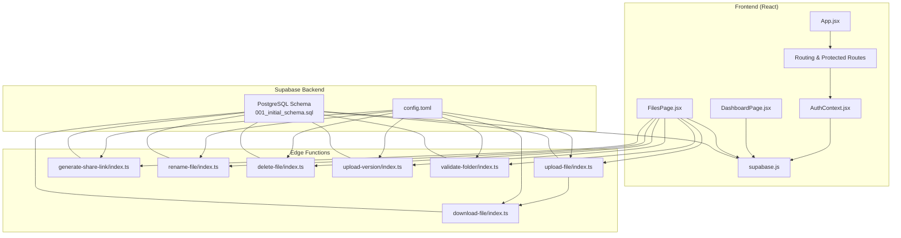
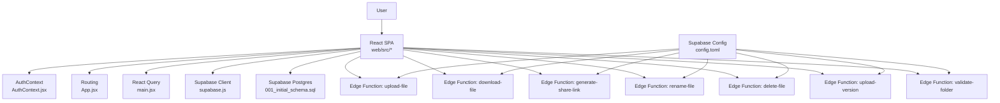
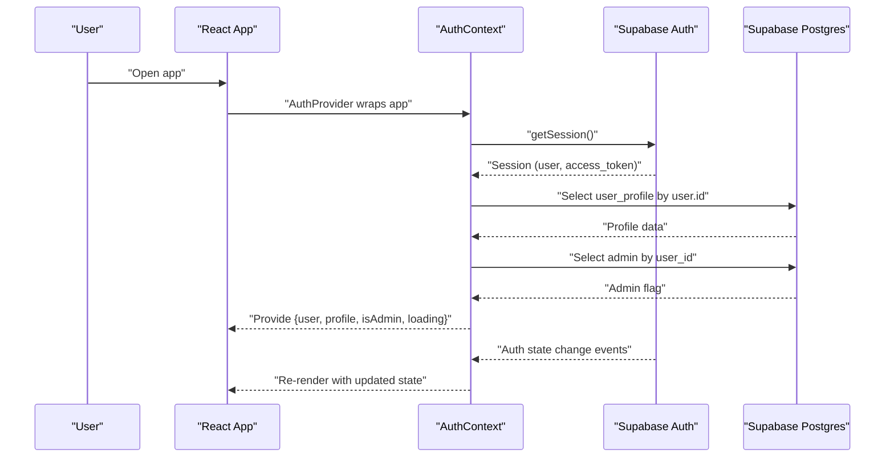
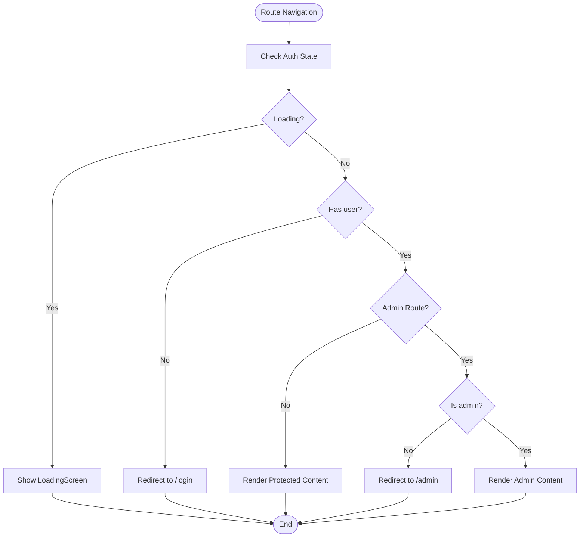
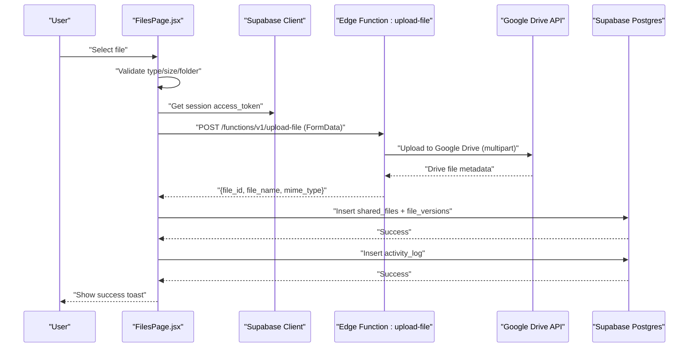
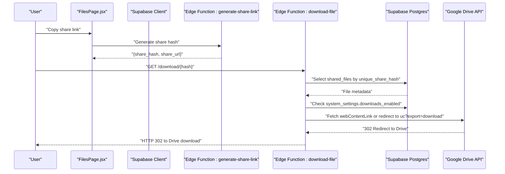
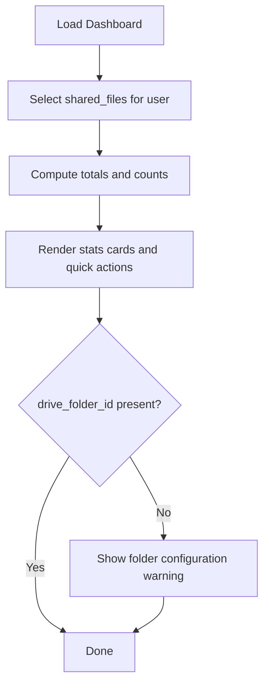
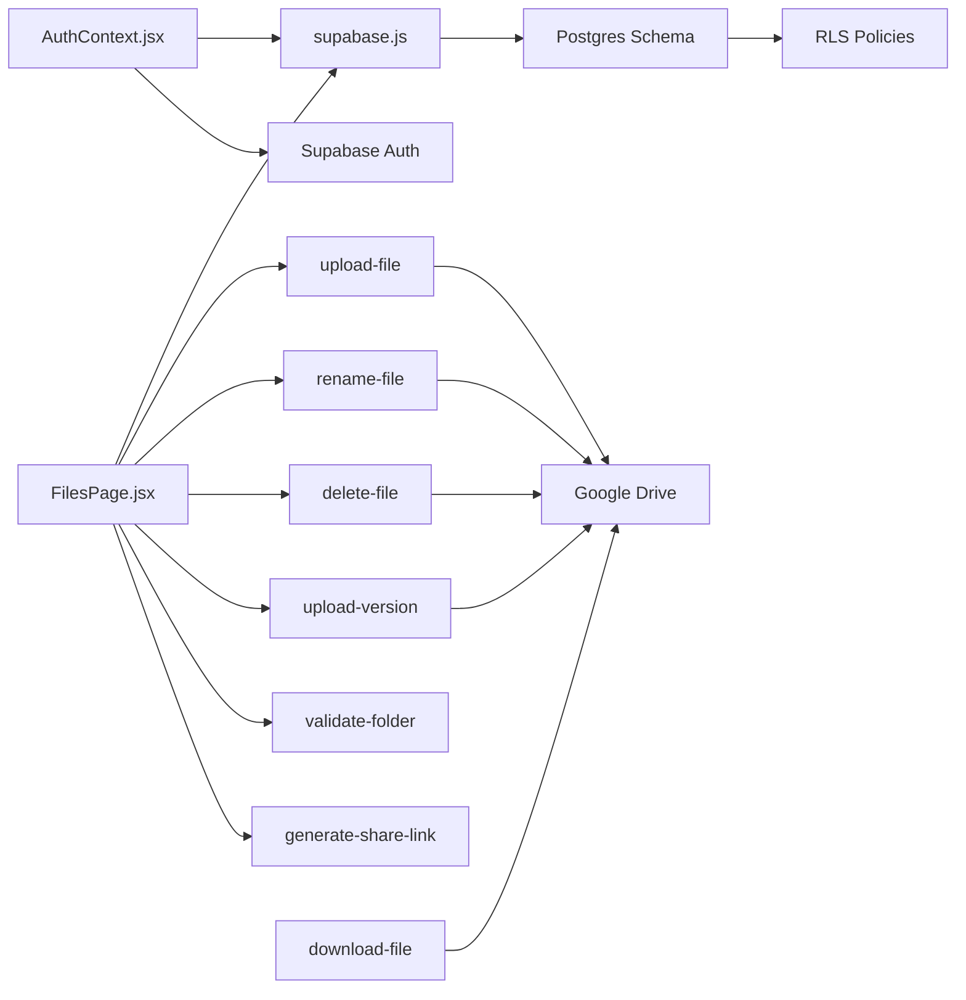

# Architecture Overview

<cite>
**Referenced Files in This Document**
- [web/src/main.jsx](file://web/src/main.jsx)
- [web/src/App.jsx](file://web/src/App.jsx)
- [web/src/contexts/AuthContext.jsx](file://web/src/contexts/AuthContext.jsx)
- [web/src/services/supabase.js](file://web/src/services/supabase.js)
- [web/src/pages/DashboardPage.jsx](file://web/src/pages/DashboardPage.jsx)
- [web/src/pages/FilesPage.jsx](file://web/src/pages/FilesPage.jsx)
- [supabase/functions/upload-file/index.ts](file://supabase/functions/upload-file/index.ts)
- [supabase/functions/download-file/index.ts](file://supabase/functions/download-file/index.ts)
- [supabase/functions/generate-share-link/index.ts](file://supabase/functions/generate-share-link/index.ts)
- [supabase/functions/rename-file/index.ts](file://supabase/functions/rename-file/index.ts)
- [supabase/functions/delete-file/index.ts](file://supabase/functions/delete-file/index.ts)
- [supabase/functions/upload-version/index.ts](file://supabase/functions/upload-version/index.ts)
- [supabase/functions/validate-folder/index.ts](file://supabase/functions/validate-folder/index.ts)
- [supabase/migrations/001_initial_schema.sql](file://supabase/migrations/001_initial_schema.sql)
- [supabase/config.toml](file://supabase/config.toml)
</cite>

## Table of Contents
1. [Introduction](#introduction)
2. [Project Structure](#project-structure)
3. [Core Components](#core-components)
4. [Architecture Overview](#architecture-overview)
5. [Detailed Component Analysis](#detailed-component-analysis)
6. [Dependency Analysis](#dependency-analysis)
7. [Performance Considerations](#performance-considerations)
8. [Security Architecture](#security-architecture)
9. [Scalability Considerations](#scalability-considerations)
10. [Troubleshooting Guide](#troubleshooting-guide)
11. [Conclusion](#conclusion)

## Introduction
Neo Files Transfer is a React-based file management application integrated with Supabase for authentication, database, and serverless edge functions. The system enables users to upload, manage, and share files stored in Google Drive through Supabase Edge Functions. Authentication is handled via Supabase Auth with Google OAuth, and data is persisted in Supabase Postgres with Row Level Security (RLS) policies. Real-time updates are supported through Supabase's auth state change listeners and reactive UI components.

## Project Structure
The project follows a clear separation of concerns:
- Frontend (React): Handles UI, routing, state management, and user interactions.
- Backend (Supabase): Provides authentication, database, and serverless edge functions.
- Edge Functions: Implement file operations against Google Drive and manage shared links.

**Diagram sources**
- [web/src/App.jsx:54-91](file://web/src/App.jsx#L54-L91)
- [web/src/contexts/AuthContext.jsx:6-103](file://web/src/contexts/AuthContext.jsx#L6-L103)
- [web/src/services/supabase.js:1-7](file://web/src/services/supabase.js#L1-L7)
- [web/src/pages/DashboardPage.jsx:1-177](file://web/src/pages/DashboardPage.jsx#L1-L177)
- [web/src/pages/FilesPage.jsx:34-536](file://web/src/pages/FilesPage.jsx#L34-L536)
- [supabase/config.toml:1-21](file://supabase/config.toml#L1-L21)
- [supabase/functions/upload-file/index.ts:24-152](file://supabase/functions/upload-file/index.ts#L24-L152)
- [supabase/functions/download-file/index.ts:9-131](file://supabase/functions/download-file/index.ts#L9-L131)
- [supabase/functions/generate-share-link/index.ts:9-55](file://supabase/functions/generate-share-link/index.ts#L9-L55)
- [supabase/functions/rename-file/index.ts:9-74](file://supabase/functions/rename-file/index.ts#L9-L74)
- [supabase/functions/delete-file/index.ts:9-72](file://supabase/functions/delete-file/index.ts#L9-L72)
- [supabase/functions/upload-version/index.ts:11-130](file://supabase/functions/upload-version/index.ts#L11-L130)
- [supabase/functions/validate-folder/index.ts:9-87](file://supabase/functions/validate-folder/index.ts#L9-L87)
- [supabase/migrations/001_initial_schema.sql:1-289](file://supabase/migrations/001_initial_schema.sql#L1-L289)

**Section sources**
- [web/src/main.jsx:19-40](file://web/src/main.jsx#L19-L40)
- [web/src/App.jsx:54-91](file://web/src/App.jsx#L54-L91)
- [supabase/config.toml:1-21](file://supabase/config.toml#L1-L21)

## Core Components
- React Application Bootstrap: Initializes routing, React Query, and the AuthProvider.
- Routing and Guards: Implements public, protected, and admin routes with route guards using AuthContext.
- Authentication Context: Manages user session, profile loading, admin checks, and Google OAuth sign-in.
- Supabase Client: Provides a typed client for database operations and auth APIs.
- File Management Page: Handles file listing, uploads, renames, deletes, sharing toggles, and version management.
- Edge Functions: Implement file operations against Google Drive and shared link generation.

**Section sources**
- [web/src/main.jsx:19-40](file://web/src/main.jsx#L19-L40)
- [web/src/App.jsx:28-41](file://web/src/App.jsx#L28-L41)
- [web/src/contexts/AuthContext.jsx:6-103](file://web/src/contexts/AuthContext.jsx#L6-L103)
- [web/src/services/supabase.js:1-7](file://web/src/services/supabase.js#L1-L7)
- [web/src/pages/FilesPage.jsx:34-536](file://web/src/pages/FilesPage.jsx#L34-L536)

## Architecture Overview
The system architecture combines a React SPA with Supabase services:
- Client-side state management is centralized in AuthContext, providing user, profile, admin status, and loading state.
- Protected routes enforce authentication and admin checks.
- Frontend components communicate with Supabase for database operations and with Supabase Edge Functions for Google Drive integrations.
- Edge functions validate JWTs, access Google Drive via user tokens, and manage shared file metadata.

**Diagram sources**
- [web/src/main.jsx:19-40](file://web/src/main.jsx#L19-L40)
- [web/src/App.jsx:54-91](file://web/src/App.jsx#L54-L91)
- [web/src/contexts/AuthContext.jsx:6-103](file://web/src/contexts/AuthContext.jsx#L6-L103)
- [web/src/services/supabase.js:1-7](file://web/src/services/supabase.js#L1-L7)
- [supabase/config.toml:1-21](file://supabase/config.toml#L1-L21)
- [supabase/migrations/001_initial_schema.sql:1-289](file://supabase/migrations/001_initial_schema.sql#L1-L289)

## Detailed Component Analysis

### Authentication Flow and AuthContext
AuthContext centralizes authentication state and integrates with Supabase Auth:
- On mount, retrieves the active session and loads user profile and admin status.
- Subscribes to auth state changes to keep UI synchronized.
- Provides sign-in with Google OAuth and sign-out functions.
- Exposes loading state and profile refresh capability.

**Diagram sources**
- [web/src/contexts/AuthContext.jsx:12-38](file://web/src/contexts/AuthContext.jsx#L12-L38)
- [web/src/contexts/AuthContext.jsx:40-64](file://web/src/contexts/AuthContext.jsx#L40-L64)
- [web/src/contexts/AuthContext.jsx:66-82](file://web/src/contexts/AuthContext.jsx#L66-L82)
- [web/src/services/supabase.js:1-7](file://web/src/services/supabase.js#L1-L7)
- [supabase/migrations/001_initial_schema.sql:41-51](file://supabase/migrations/001_initial_schema.sql#L41-L51)
- [supabase/migrations/001_initial_schema.sql:29-36](file://supabase/migrations/001_initial_schema.sql#L29-L36)

**Section sources**
- [web/src/contexts/AuthContext.jsx:6-103](file://web/src/contexts/AuthContext.jsx#L6-L103)
- [web/src/services/supabase.js:1-7](file://web/src/services/supabase.js#L1-L7)
- [supabase/migrations/001_initial_schema.sql:41-51](file://supabase/migrations/001_initial_schema.sql#L41-L51)
- [supabase/migrations/001_initial_schema.sql:29-36](file://supabase/migrations/001_initial_schema.sql#L29-L36)

### Protected Routes and Admin Routes
The routing layer enforces authentication and admin permissions:
- ProtectedRoute ensures non-authenticated users are redirected to login.
- AdminRoute ensures both authentication and admin status.
- LoadingScreen displays during auth initialization.

**Diagram sources**
- [web/src/App.jsx:28-41](file://web/src/App.jsx#L28-L41)
- [web/src/App.jsx:43-52](file://web/src/App.jsx#L43-L52)

**Section sources**
- [web/src/App.jsx:28-41](file://web/src/App.jsx#L28-L41)
- [web/src/App.jsx:43-52](file://web/src/App.jsx#L43-L52)

### File Operations via Edge Functions
The Files page orchestrates file operations using Supabase Edge Functions:
- Upload: Validates file type/size, sends multipart form to upload-file, stores metadata in Supabase, logs activity.
- Rename/Delete: Calls rename-file/delete-file functions; updates metadata and logs.
- Versioning: Uses upload-version to add new versions to existing files.
- Sharing: Generates share hashes via generate-share-link and toggles sharing status in Supabase.
- Folder Validation: Uses validate-folder to verify Google Drive folder accessibility.

**Diagram sources**
- [web/src/pages/FilesPage.jsx:85-182](file://web/src/pages/FilesPage.jsx#L85-L182)
- [supabase/functions/upload-file/index.ts:24-152](file://supabase/functions/upload-file/index.ts#L24-L152)
- [supabase/migrations/001_initial_schema.sql:55-83](file://supabase/migrations/001_initial_schema.sql#L55-L83)

**Section sources**
- [web/src/pages/FilesPage.jsx:85-182](file://web/src/pages/FilesPage.jsx#L85-L182)
- [supabase/functions/upload-file/index.ts:24-152](file://supabase/functions/upload-file/index.ts#L24-L152)
- [supabase/migrations/001_initial_schema.sql:55-83](file://supabase/migrations/001_initial_schema.sql#L55-L83)

### Download Flow and Shared Links
The download flow supports both authenticated and public access:
- generate-share-link creates a unique share hash and returns a short URL.
- download-file resolves the share hash, validates sharing status and system settings, finds the latest version, and redirects to Google Drive for download.

**Diagram sources**
- [web/src/pages/FilesPage.jsx:436-445](file://web/src/pages/FilesPage.jsx#L436-L445)
- [supabase/functions/generate-share-link/index.ts:9-55](file://supabase/functions/generate-share-link/index.ts#L9-L55)
- [supabase/functions/download-file/index.ts:9-131](file://supabase/functions/download-file/index.ts#L9-L131)
- [supabase/migrations/001_initial_schema.sql:107-122](file://supabase/migrations/001_initial_schema.sql#L107-L122)

**Section sources**
- [web/src/pages/FilesPage.jsx:436-445](file://web/src/pages/FilesPage.jsx#L436-L445)
- [supabase/functions/generate-share-link/index.ts:9-55](file://supabase/functions/generate-share-link/index.ts#L9-L55)
- [supabase/functions/download-file/index.ts:9-131](file://supabase/functions/download-file/index.ts#L9-L131)
- [supabase/migrations/001_initial_schema.sql:107-122](file://supabase/migrations/001_initial_schema.sql#L107-L122)

### Dashboard and Statistics
The Dashboard page aggregates statistics from shared_files and displays quick actions. It also surfaces warnings when the Google Drive folder is not configured.

**Diagram sources**
- [web/src/pages/DashboardPage.jsx:18-40](file://web/src/pages/DashboardPage.jsx#L18-L40)
- [web/src/pages/DashboardPage.jsx:42-73](file://web/src/pages/DashboardPage.jsx#L42-L73)

**Section sources**
- [web/src/pages/DashboardPage.jsx:18-40](file://web/src/pages/DashboardPage.jsx#L18-L40)
- [web/src/pages/DashboardPage.jsx:42-73](file://web/src/pages/DashboardPage.jsx#L42-L73)

## Dependency Analysis
The system exhibits low coupling and high cohesion:
- Frontend depends on Supabase client and AuthContext for state.
- Edge functions depend on Supabase JWT verification and Google Drive APIs.
- Database schema defines RLS policies that govern access patterns.

**Diagram sources**
- [web/src/contexts/AuthContext.jsx:6-103](file://web/src/contexts/AuthContext.jsx#L6-L103)
- [web/src/services/supabase.js:1-7](file://web/src/services/supabase.js#L1-L7)
- [web/src/pages/FilesPage.jsx:34-536](file://web/src/pages/FilesPage.jsx#L34-L536)
- [supabase/functions/upload-file/index.ts:24-152](file://supabase/functions/upload-file/index.ts#L24-L152)
- [supabase/functions/rename-file/index.ts:9-74](file://supabase/functions/rename-file/index.ts#L9-L74)
- [supabase/functions/delete-file/index.ts:9-72](file://supabase/functions/delete-file/index.ts#L9-L72)
- [supabase/functions/upload-version/index.ts:11-130](file://supabase/functions/upload-version/index.ts#L11-L130)
- [supabase/functions/validate-folder/index.ts:9-87](file://supabase/functions/validate-folder/index.ts#L9-L87)
- [supabase/functions/generate-share-link/index.ts:9-55](file://supabase/functions/generate-share-link/index.ts#L9-L55)
- [supabase/functions/download-file/index.ts:9-131](file://supabase/functions/download-file/index.ts#L9-L131)
- [supabase/migrations/001_initial_schema.sql:126-267](file://supabase/migrations/001_initial_schema.sql#L126-L267)

**Section sources**
- [supabase/config.toml:1-21](file://supabase/config.toml#L1-L21)
- [supabase/migrations/001_initial_schema.sql:126-267](file://supabase/migrations/001_initial_schema.sql#L126-L267)

## Performance Considerations
- Client caching: React Query is configured with a moderate stale time and retry policy to balance freshness and network efficiency.
- Edge function cold starts: Functions are small and focused; consider keeping warm if traffic spikes are expected.
- File uploads: Validate size and type on the client to reduce unnecessary requests.
- Database queries: Use indexed columns (e.g., user_id, unique_share_hash) to optimize reads.
- CDN and redirects: Serve downloads via Google Drive URLs to leverage external bandwidth.

[No sources needed since this section provides general guidance]

## Security Architecture
- Authentication: Supabase Auth with Google OAuth; AuthContext listens for auth state changes.
- Authorization: Supabase RLS policies restrict access to user-owned resources and public reads for downloads.
- Edge function security: config.toml enforces JWT verification for most functions; download-file uses service role for bypassing RLS when needed.
- Token handling: Functions use the user's provider_token for Google Drive operations; sensitive keys are accessed via environment variables.

**Section sources**
- [web/src/contexts/AuthContext.jsx:12-38](file://web/src/contexts/AuthContext.jsx#L12-L38)
- [supabase/config.toml:1-21](file://supabase/config.toml#L1-L21)
- [supabase/migrations/001_initial_schema.sql:126-267](file://supabase/migrations/001_initial_schema.sql#L126-L267)

## Scalability Considerations
- Horizontal scaling: React SPA scales horizontally behind a CDN; Edge Functions scale automatically.
- Database: Use Supabase's managed Postgres; add indexes on frequently queried columns.
- Storage: Offload file storage to Google Drive; keep only metadata in Supabase.
- Rate limiting: Consider adding rate limits at the Edge Function level for upload/download endpoints.
- Monitoring: Track function invocations, errors, and latency; monitor database query performance.

[No sources needed since this section provides general guidance]

## Troubleshooting Guide
Common issues and resolutions:
- Authentication state not updating: Ensure AuthContext subscription is active and Supabase client is initialized with correct credentials.
- Upload failures: Verify allowed types, size limits, and that the Google Drive folder is configured; check Edge Function logs for Drive API errors.
- Download errors: Confirm the file exists, sharing status allows access, and system settings permit downloads.
- Admin route access denied: Verify the user is both authenticated and listed as admin in the admins table.

**Section sources**
- [web/src/contexts/AuthContext.jsx:12-38](file://web/src/contexts/AuthContext.jsx#L12-L38)
- [web/src/pages/FilesPage.jsx:85-182](file://web/src/pages/FilesPage.jsx#L85-L182)
- [supabase/functions/download-file/index.ts:36-72](file://supabase/functions/download-file/index.ts#L36-L72)
- [supabase/migrations/001_initial_schema.sql:29-36](file://supabase/migrations/001_initial_schema.sql#L29-L36)

## Conclusion
Neo Files Transfer employs a clean separation of concerns: React handles the UI and routing, Supabase provides authentication and database services, and Edge Functions integrate with Google Drive for file operations. The system leverages Supabase RLS for authorization, JWT verification for secure function calls, and efficient client caching via React Query. With proper monitoring and scaling strategies, the platform can support growth while maintaining strong security and performance characteristics.