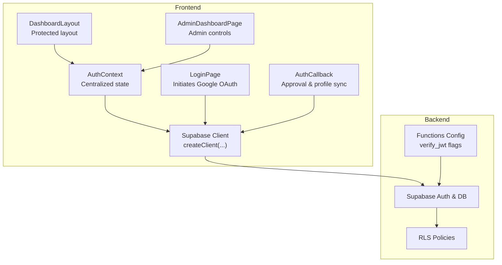
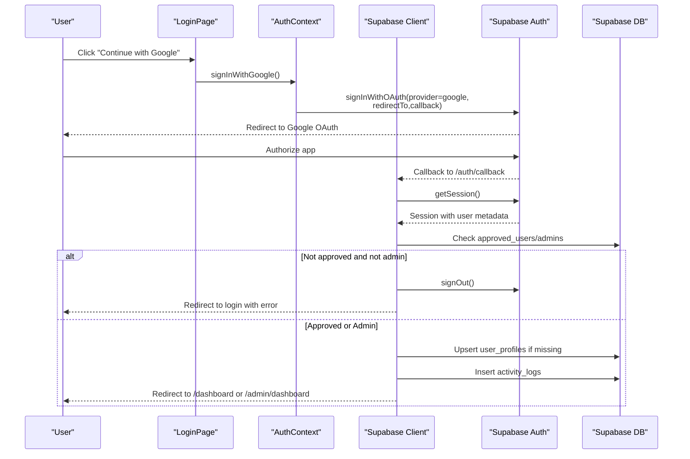
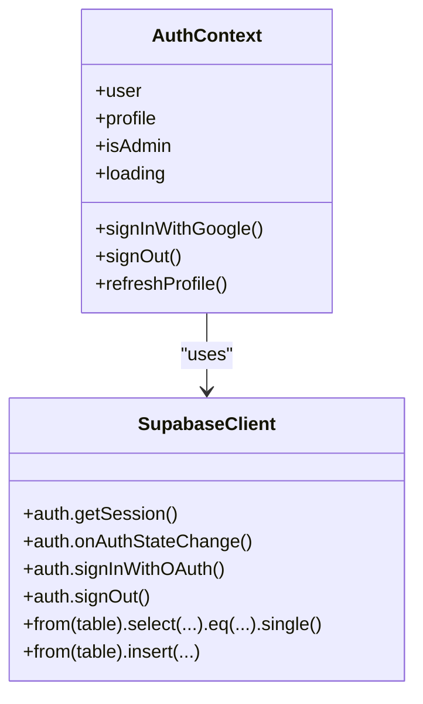
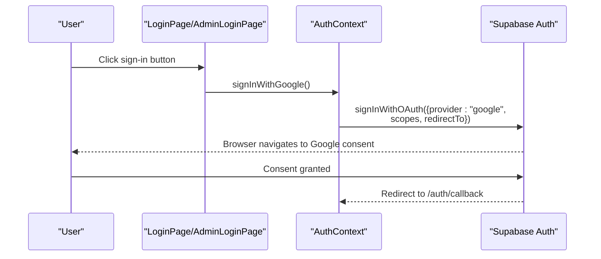
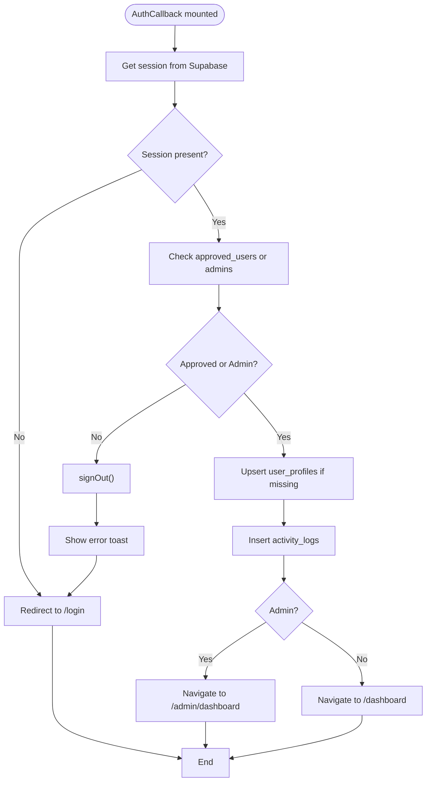
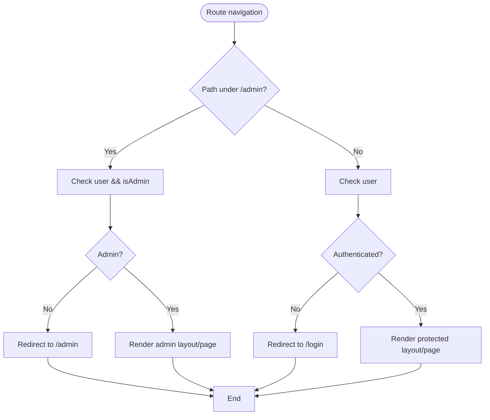
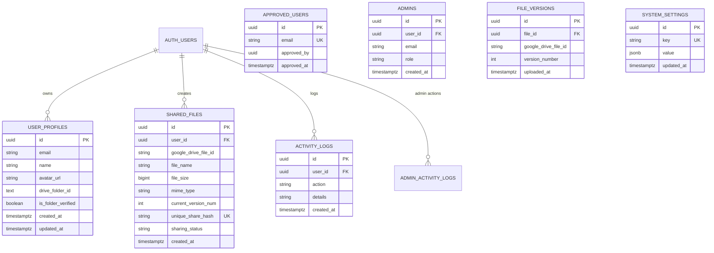
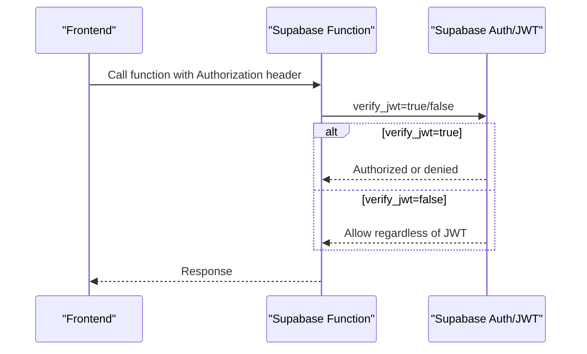
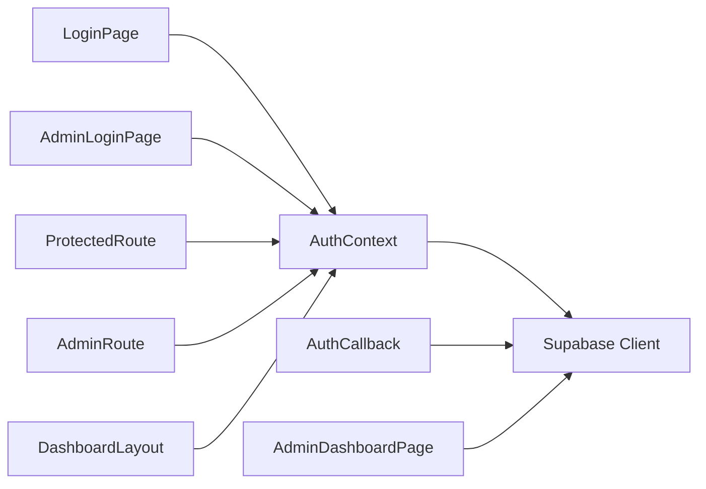

# Authentication System

<cite>
**Referenced Files in This Document**
- [AuthContext.jsx](file://web/src/contexts/AuthContext.jsx)
- [supabase.js](file://web/src/services/supabase.js)
- [App.jsx](file://web/src/App.jsx)
- [LoginPage.jsx](file://web/src/pages/LoginPage.jsx)
- [AuthCallback.jsx](file://web/src/pages/AuthCallback.jsx)
- [AdminLoginPage.jsx](file://web/src/pages/AdminLoginPage.jsx)
- [DashboardLayout.jsx](file://web/src/layouts/DashboardLayout.jsx)
- [AdminDashboardPage.jsx](file://web/src/pages/AdminDashboardPage.jsx)
- [001_initial_schema.sql](file://supabase/migrations/001_initial_schema.sql)
- [config.toml](file://supabase/config.toml)
- [package.json](file://web/package.json)
</cite>

## Table of Contents
1. [Introduction](#introduction)
2. [Project Structure](#project-structure)
3. [Core Components](#core-components)
4. [Architecture Overview](#architecture-overview)
5. [Detailed Component Analysis](#detailed-component-analysis)
6. [Dependency Analysis](#dependency-analysis)
7. [Performance Considerations](#performance-considerations)
8. [Troubleshooting Guide](#troubleshooting-guide)
9. [Conclusion](#conclusion)
10. [Appendices](#appendices)

## Introduction
This document explains the authentication system for Neo Files Transfer, focusing on Google OAuth integration, session lifecycle, role-based access control (RBAC), centralized state management via AuthContext, and Supabase-backed policies. It also covers protected route guards, user profile management, and administrative controls. The goal is to make the system understandable for beginners while providing precise technical details for implementation.

## Project Structure
The authentication system spans React frontend components and Supabase backend resources:
- Frontend
  - Centralized auth state in a React Context
  - Google OAuth initiation and callback handling
  - Protected/admin routes and layouts
  - Supabase client initialization
- Backend
  - Supabase client-side SDK usage
  - Row Level Security (RLS) policies
  - Function-level JWT verification toggles

**Diagram sources**
- [AuthContext.jsx:1-112](file://web/src/contexts/AuthContext.jsx#L1-L112)
- [LoginPage.jsx:1-77](file://web/src/pages/LoginPage.jsx#L1-L77)
- [AuthCallback.jsx:1-84](file://web/src/pages/AuthCallback.jsx#L1-L84)
- [DashboardLayout.jsx:1-200](file://web/src/layouts/DashboardLayout.jsx#L1-L200)
- [AdminDashboardPage.jsx:1-436](file://web/src/pages/AdminDashboardPage.jsx#L1-L436)
- [supabase.js:1-7](file://web/src/services/supabase.js#L1-L7)
- [001_initial_schema.sql:125-267](file://supabase/migrations/001_initial_schema.sql#L125-L267)
- [config.toml:1-21](file://supabase/config.toml#L1-L21)

**Section sources**
- [AuthContext.jsx:1-112](file://web/src/contexts/AuthContext.jsx#L1-L112)
- [supabase.js:1-7](file://web/src/services/supabase.js#L1-L7)
- [App.jsx:28-41](file://web/src/App.jsx#L28-L41)
- [001_initial_schema.sql:125-267](file://supabase/migrations/001_initial_schema.sql#L125-L267)
- [config.toml:1-21](file://supabase/config.toml#L1-L21)

## Core Components
- AuthContext: Provides user, profile, admin status, loading state, and auth actions (sign in/out, refresh). Subscribes to Supabase auth state changes and loads user profile and admin role.
- Supabase Client: Initializes the Supabase client using Vite environment variables.
- ProtectedRoute and AdminRoute: Route guards enforcing authentication and admin privileges.
- LoginPage and AdminLoginPage: Trigger Google OAuth with provider-specific scopes and redirect.
- AuthCallback: Verifies approval/admin status, creates user profile if missing, logs activity, and redirects accordingly.
- DashboardLayout and AdminDashboardPage: Present authenticated UI and admin controls.

**Section sources**
- [AuthContext.jsx:6-103](file://web/src/contexts/AuthContext.jsx#L6-L103)
- [supabase.js:1-7](file://web/src/services/supabase.js#L1-L7)
- [App.jsx:28-41](file://web/src/App.jsx#L28-L41)
- [LoginPage.jsx:7-28](file://web/src/pages/LoginPage.jsx#L7-L28)
- [AdminLoginPage.jsx:8-35](file://web/src/pages/AdminLoginPage.jsx#L8-L35)
- [AuthCallback.jsx:6-73](file://web/src/pages/AuthCallback.jsx#L6-L73)
- [DashboardLayout.jsx:24-44](file://web/src/layouts/DashboardLayout.jsx#L24-L44)
- [AdminDashboardPage.jsx:13-45](file://web/src/pages/AdminDashboardPage.jsx#L13-L45)

## Architecture Overview
The system integrates Google OAuth via Supabase Auth, enforces RBAC using Supabase tables and RLS, and centralizes state in a React Context. Functions can require JWT verification for server-side enforcement.

**Diagram sources**
- [LoginPage.jsx:17-28](file://web/src/pages/LoginPage.jsx#L17-L28)
- [AuthContext.jsx:66-75](file://web/src/contexts/AuthContext.jsx#L66-L75)
- [AuthCallback.jsx:9-73](file://web/src/pages/AuthCallback.jsx#L9-L73)
- [001_initial_schema.sql:19-51](file://supabase/migrations/001_initial_schema.sql#L19-L51)

## Detailed Component Analysis

### AuthContext: Centralized Authentication State
AuthContext manages:
- User identity and session lifecycle
- Profile loading and admin role detection
- Google OAuth initiation
- Sign out and profile refresh
- Auth state subscription for real-time updates

Key behaviors:
- On mount, fetches current session and subscribes to auth state changes
- Loads profile from user_profiles and checks admin membership in admins
- Exposes signInWithGoogle with Google scopes and redirect
- Provides signOut that clears local state and unsubscribes

**Diagram sources**
- [AuthContext.jsx:6-103](file://web/src/contexts/AuthContext.jsx#L6-L103)
- [supabase.js:1-7](file://web/src/services/supabase.js#L1-L7)

**Section sources**
- [AuthContext.jsx:6-103](file://web/src/contexts/AuthContext.jsx#L6-L103)

### Google OAuth Integration
- Initiated from LoginPage and AdminLoginPage
- Uses Supabase OAuth with provider "google"
- Redirects to /auth/callback after authorization
- Scopes include profile, email, and Google Drive permissions

**Diagram sources**
- [LoginPage.jsx:17-28](file://web/src/pages/LoginPage.jsx#L17-L28)
- [AdminLoginPage.jsx:26-35](file://web/src/pages/AdminLoginPage.jsx#L26-L35)
- [AuthContext.jsx:66-75](file://web/src/contexts/AuthContext.jsx#L66-L75)

**Section sources**
- [LoginPage.jsx:17-28](file://web/src/pages/LoginPage.jsx#L17-L28)
- [AdminLoginPage.jsx:26-35](file://web/src/pages/AdminLoginPage.jsx#L26-L35)
- [AuthContext.jsx:66-75](file://web/src/contexts/AuthContext.jsx#L66-L75)

### AuthCallback: Approval and Profile Synchronization
Responsibilities:
- Verify session exists
- Check approval in approved_users or admin status
- Create user profile in user_profiles if missing
- Insert activity log
- Redirect to appropriate dashboard

**Diagram sources**
- [AuthCallback.jsx:9-73](file://web/src/pages/AuthCallback.jsx#L9-L73)
- [001_initial_schema.sql:19-51](file://supabase/migrations/001_initial_schema.sql#L19-L51)

**Section sources**
- [AuthCallback.jsx:9-73](file://web/src/pages/AuthCallback.jsx#L9-L73)

### Protected Routes and Role-Based Access Control
- ProtectedRoute: Blocks unauthenticated users; allows authenticated users
- AdminRoute: Blocks unauthenticated or non-admin users; allows admin users
- DashboardLayout: Provides authenticated navigation and logout
- AdminDashboardPage: Admin-only controls and analytics

**Diagram sources**
- [App.jsx:28-41](file://web/src/App.jsx#L28-L41)
- [DashboardLayout.jsx:24-44](file://web/src/layouts/DashboardLayout.jsx#L24-L44)
- [AdminDashboardPage.jsx:13-45](file://web/src/pages/AdminDashboardPage.jsx#L13-L45)

**Section sources**
- [App.jsx:28-41](file://web/src/App.jsx#L28-L41)
- [DashboardLayout.jsx:24-44](file://web/src/layouts/DashboardLayout.jsx#L24-L44)
- [AdminDashboardPage.jsx:13-45](file://web/src/pages/AdminDashboardPage.jsx#L13-L45)

### Database Schema and Security Policies
Tables involved in authentication and RBAC:
- approved_users: Tracks approved user emails
- admins: Stores admin records with roles
- user_profiles: Per-user profile synced from OAuth metadata
- activity_logs: Logs user actions
- system_settings: Admin-controlled system flags

RLS policies:
- Enforce row-level access for user-owned data
- Allow public reads for shareable resources
- Admin visibility and write access where applicable

**Diagram sources**
- [001_initial_schema.sql:6-122](file://supabase/migrations/001_initial_schema.sql#L6-L122)
- [001_initial_schema.sql:129-267](file://supabase/migrations/001_initial_schema.sql#L129-L267)

**Section sources**
- [001_initial_schema.sql:6-122](file://supabase/migrations/001_initial_schema.sql#L6-L122)
- [001_initial_schema.sql:129-267](file://supabase/migrations/001_initial_schema.sql#L129-L267)

### JWT and Function-Level Verification
Supabase functions can enforce JWT verification to protect serverless endpoints. The configuration toggles verify_jwt per function.

**Diagram sources**
- [config.toml:1-21](file://supabase/config.toml#L1-L21)

**Section sources**
- [config.toml:1-21](file://supabase/config.toml#L1-L21)

## Dependency Analysis
- AuthContext depends on Supabase client for auth/session/profile operations
- LoginPage/AdminLoginPage depend on AuthContext for initiating OAuth
- AuthCallback depends on Supabase for session retrieval and DB checks
- Protected/Admin routes depend on AuthContext for user/admin state
- AdminDashboardPage depends on Supabase for admin operations and settings

**Diagram sources**
- [AuthContext.jsx:6-103](file://web/src/contexts/AuthContext.jsx#L6-L103)
- [LoginPage.jsx:7-28](file://web/src/pages/LoginPage.jsx#L7-L28)
- [AdminLoginPage.jsx:8-35](file://web/src/pages/AdminLoginPage.jsx#L8-L35)
- [AuthCallback.jsx:9-73](file://web/src/pages/AuthCallback.jsx#L9-L73)
- [App.jsx:28-41](file://web/src/App.jsx#L28-L41)
- [AdminDashboardPage.jsx:13-45](file://web/src/pages/AdminDashboardPage.jsx#L13-L45)
- [DashboardLayout.jsx:24-44](file://web/src/layouts/DashboardLayout.jsx#L24-L44)

**Section sources**
- [AuthContext.jsx:6-103](file://web/src/contexts/AuthContext.jsx#L6-L103)
- [App.jsx:28-41](file://web/src/App.jsx#L28-L41)

## Performance Considerations
- Minimize DB queries by batching reads/writes where possible (e.g., fetching pending/approved/system settings concurrently)
- Use optimistic UI updates during sign-out and profile refresh, with fallbacks on errors
- Debounce search/filter operations in admin dashboards
- Keep redirect URLs and scopes minimal to reduce OAuth round-trips

## Troubleshooting Guide
Common issues and resolutions:
- Login fails silently
  - Ensure environment variables for Supabase URL and anon key are set
  - Verify OAuth redirect URL matches Supabase project settings
- Account not approved
  - AuthCallback signs out unauthorized users and shows an error toast; confirm user exists in approved_users or admins
- Profile not loading
  - AuthContext.loadProfile requires a valid session; check onAuthStateChange subscription and network connectivity
- Admin login attempts by non-admins
  - AdminLoginPage displays a warning; AdminRoute redirects to /admin if not admin
- Function calls failing with JWT errors
  - Confirm verify_jwt flag in config.toml aligns with intended protection level

Debugging tips:
- Inspect Supabase Auth session state in browser dev tools
- Monitor network requests to Supabase endpoints
- Check RLS policy violations in Supabase logs
- Validate environment variables in the built app bundle

**Section sources**
- [AuthCallback.jsx:34-39](file://web/src/pages/AuthCallback.jsx#L34-L39)
- [AdminLoginPage.jsx:51-58](file://web/src/pages/AdminLoginPage.jsx#L51-L58)
- [config.toml:1-21](file://supabase/config.toml#L1-L21)

## Conclusion
The authentication system combines Supabase Auth for Google OAuth, a React Context for centralized state, and Supabase RLS for data access control. Protected routes and admin-only areas ensure secure access, while DB policies maintain data integrity. The design balances simplicity for users with robust security for administrators.

## Appendices

### Environment Variables
- VITE_SUPABASE_URL
- VITE_SUPABASE_ANON_KEY

These are consumed by the Supabase client initialization.

**Section sources**
- [supabase.js:3-4](file://web/src/services/supabase.js#L3-L4)
- [package.json:11-20](file://web/package.json#L11-L20)