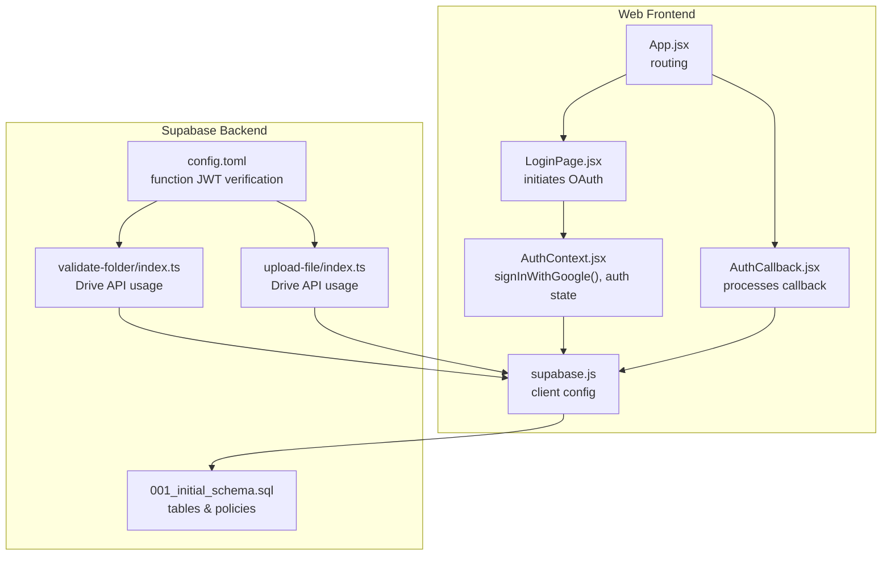
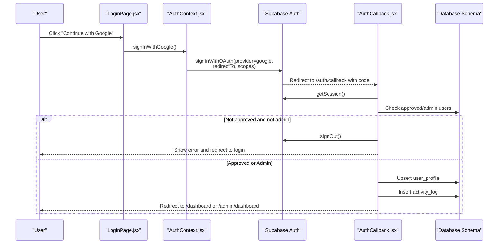
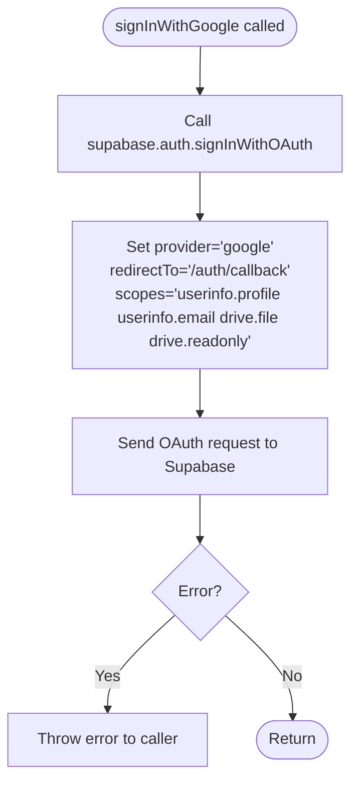
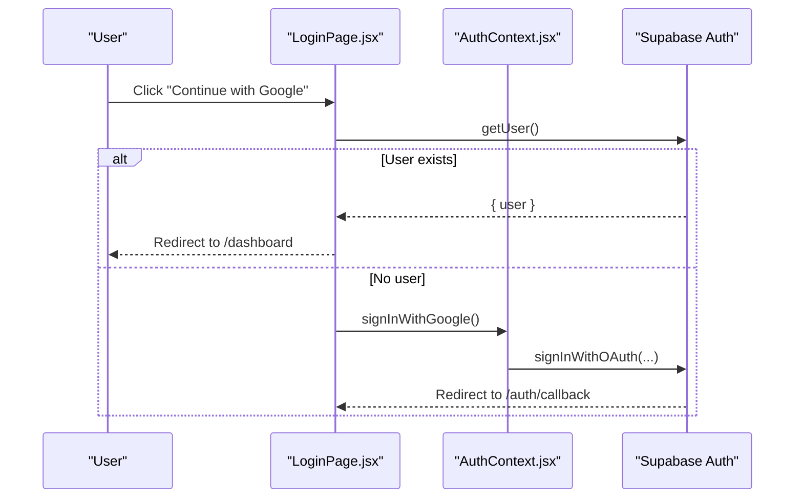
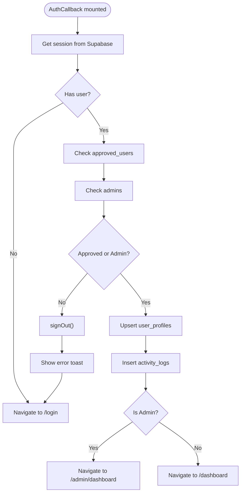
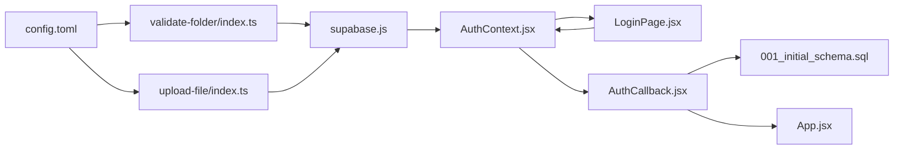

# Google OAuth Integration

<cite>
**Referenced Files in This Document**
- [AuthContext.jsx](file://web/src/contexts/AuthContext.jsx)
- [AuthCallback.jsx](file://web/src/pages/AuthCallback.jsx)
- [LoginPage.jsx](file://web/src/pages/LoginPage.jsx)
- [App.jsx](file://web/src/App.jsx)
- [supabase.js](file://web/src/services/supabase.js)
- [001_initial_schema.sql](file://supabase/migrations/001_initial_schema.sql)
- [config.toml](file://supabase/config.toml)
- [validate-folder/index.ts](file://supabase/functions/validate-folder/index.ts)
- [upload-file/index.ts](file://supabase/functions/upload-file/index.ts)
</cite>

## Table of Contents
1. [Introduction](#introduction)
2. [Project Structure](#project-structure)
3. [Core Components](#core-components)
4. [Architecture Overview](#architecture-overview)
5. [Detailed Component Analysis](#detailed-component-analysis)
6. [Dependency Analysis](#dependency-analysis)
7. [Performance Considerations](#performance-considerations)
8. [Troubleshooting Guide](#troubleshooting-guide)
9. [Conclusion](#conclusion)

## Introduction
This document provides comprehensive documentation for the Google OAuth integration implemented in the application. It covers the end-to-end OAuth flow from initiation to callback handling, scope configuration for Google Drive access, the signInWithGoogle function implementation, redirect URI setup, and error handling strategies. It also explains the AuthCallback component's role in processing OAuth responses and managing session creation, along with integration patterns with Supabase authentication. Common OAuth issues, debugging techniques, and security considerations for credential management are addressed to help developers maintain and troubleshoot the integration effectively.

## Project Structure
The Google OAuth integration spans several frontend and backend components:
- Frontend authentication context and pages orchestrate the OAuth initiation and callback handling.
- Supabase client configuration provides the authentication interface.
- Supabase database schema defines user roles and profiles used during OAuth callbacks.
- Supabase Edge Functions demonstrate Google Drive API integration using access tokens obtained via OAuth.

**Diagram sources**
- [AuthContext.jsx:66-75](file://web/src/contexts/AuthContext.jsx#L66-L75)
- [LoginPage.jsx:17-28](file://web/src/pages/LoginPage.jsx#L17-L28)
- [AuthCallback.jsx:9-73](file://web/src/pages/AuthCallback.jsx#L9-L73)
- [App.jsx:54-91](file://web/src/App.jsx#L54-L91)
- [supabase.js:1-7](file://web/src/services/supabase.js#L1-L7)
- [001_initial_schema.sql:19-51](file://supabase/migrations/001_initial_schema.sql#L19-L51)
- [config.toml:1-21](file://supabase/config.toml#L1-L21)
- [validate-folder/index.ts:43-86](file://supabase/functions/validate-folder/index.ts#L43-L86)
- [upload-file/index.ts:113-151](file://supabase/functions/upload-file/index.ts#L113-L151)

**Section sources**
- [AuthContext.jsx:1-112](file://web/src/contexts/AuthContext.jsx#L1-L112)
- [LoginPage.jsx:1-77](file://web/src/pages/LoginPage.jsx#L1-L77)
- [AuthCallback.jsx:1-84](file://web/src/pages/AuthCallback.jsx#L1-L84)
- [App.jsx:1-92](file://web/src/App.jsx#L1-L92)
- [supabase.js:1-7](file://web/src/services/supabase.js#L1-L7)
- [001_initial_schema.sql:1-289](file://supabase/migrations/001_initial_schema.sql#L1-L289)
- [config.toml:1-21](file://supabase/config.toml#L1-L21)

## Core Components
- AuthContext: Provides authentication state, user profile loading, and the signInWithGoogle function that initiates Google OAuth with configured scopes and redirect URI.
- LoginPage: Triggers the OAuth flow and handles pre-login checks.
- AuthCallback: Processes the OAuth callback, validates user approval/admin status, creates user profiles, logs activity, and redirects users accordingly.
- Supabase Client: Configured via environment variables to connect to the Supabase project.
- Database Schema: Defines approved users, admins, user profiles, and activity logs used during OAuth callback processing.
- Edge Functions: Demonstrate Google Drive API usage with access tokens obtained via OAuth.

**Section sources**
- [AuthContext.jsx:66-75](file://web/src/contexts/AuthContext.jsx#L66-L75)
- [LoginPage.jsx:17-28](file://web/src/pages/LoginPage.jsx#L17-L28)
- [AuthCallback.jsx:9-73](file://web/src/pages/AuthCallback.jsx#L9-L73)
- [supabase.js:1-7](file://web/src/services/supabase.js#L1-L7)
- [001_initial_schema.sql:19-51](file://supabase/migrations/001_initial_schema.sql#L19-L51)

## Architecture Overview
The OAuth flow integrates the frontend, Supabase authentication, and backend database/schema. The frontend initiates OAuth with Google, Supabase handles the OAuth exchange, and the callback page finalizes user onboarding and permissions.

**Diagram sources**
- [LoginPage.jsx:17-28](file://web/src/pages/LoginPage.jsx#L17-L28)
- [AuthContext.jsx:66-75](file://web/src/contexts/AuthContext.jsx#L66-L75)
- [AuthCallback.jsx:9-73](file://web/src/pages/AuthCallback.jsx#L9-L73)
- [001_initial_schema.sql:19-51](file://supabase/migrations/001_initial_schema.sql#L19-L51)

## Detailed Component Analysis

### AuthContext: signInWithGoogle Implementation
The signInWithGoogle function initiates Google OAuth with:
- Provider: google
- Redirect URI: window.location.origin + "/auth/callback"
- Scopes: userinfo.profile, userinfo.email, drive.file, drive.readonly

It leverages the Supabase auth client to perform the OAuth sign-in and propagates errors if encountered.

**Diagram sources**
- [AuthContext.jsx:66-75](file://web/src/contexts/AuthContext.jsx#L66-L75)

**Section sources**
- [AuthContext.jsx:66-75](file://web/src/contexts/AuthContext.jsx#L66-L75)

### LoginPage: Initiating OAuth and Pre-Login Checks
The LoginPage component:
- Uses the AuthContext hook to access signInWithGoogle.
- Redirects authenticated users to the dashboard.
- On button click, attempts to get the current user; if none exists, triggers signInWithGoogle.
- Displays user-friendly error notifications on failure.

**Diagram sources**
- [LoginPage.jsx:11-28](file://web/src/pages/LoginPage.jsx#L11-L28)
- [AuthContext.jsx:66-75](file://web/src/contexts/AuthContext.jsx#L66-L75)

**Section sources**
- [LoginPage.jsx:1-77](file://web/src/pages/LoginPage.jsx#L1-L77)

### AuthCallback: Processing OAuth Responses and Session Management
The AuthCallback component performs the following steps after receiving the OAuth callback:
- Retrieves the active session from Supabase.
- Validates user approval or admin status against the database.
- Creates or updates the user profile with metadata from the session.
- Logs the login activity.
- Redirects users to either the dashboard or admin dashboard based on role.

**Diagram sources**
- [AuthCallback.jsx:9-73](file://web/src/pages/AuthCallback.jsx#L9-L73)
- [001_initial_schema.sql:19-51](file://supabase/migrations/001_initial_schema.sql#L19-L51)

**Section sources**
- [AuthCallback.jsx:1-84](file://web/src/pages/AuthCallback.jsx#L1-L84)

### Supabase Client Configuration
The Supabase client is initialized using Vite environment variables for the Supabase URL and anonymous key. This client is used across the application for authentication and database operations.

**Section sources**
- [supabase.js:1-7](file://web/src/services/supabase.js#L1-L7)

### Database Schema: Roles and Profiles
The schema defines tables and row-level security policies that support the OAuth integration:
- approved_users: Stores approved user emails for access control.
- admins: Stores admin records linked to Supabase auth users.
- user_profiles: Stores user metadata and Drive folder configuration.
- activity_logs: Tracks user login events.

These tables are referenced during the OAuth callback to validate roles and manage user profiles.

**Section sources**
- [001_initial_schema.sql:19-51](file://supabase/migrations/001_initial_schema.sql#L19-L51)
- [001_initial_schema.sql:84-94](file://supabase/migrations/001_initial_schema.sql#L84-L94)

### Google Drive Integration via Edge Functions
Edge Functions demonstrate how access tokens obtained via OAuth can be used to call Google APIs:
- validate-folder/index.ts: Fetches a Drive folder resource using an Authorization header with the access token and validates it is a folder.
- upload-file/index.ts: Uploads files to Drive using multipart/related requests with the access token.

These functions illustrate the practical use of OAuth access tokens for Drive operations.

**Section sources**
- [validate-folder/index.ts:43-86](file://supabase/functions/validate-folder/index.ts#L43-L86)
- [upload-file/index.ts:113-151](file://supabase/functions/upload-file/index.ts#L113-L151)

## Dependency Analysis
The OAuth integration depends on:
- Supabase client initialization and environment variables.
- Routing configuration to handle the OAuth callback route.
- Database tables and policies for role-based access control.
- Edge Functions for Drive API integration.

**Diagram sources**
- [supabase.js:1-7](file://web/src/services/supabase.js#L1-L7)
- [AuthContext.jsx:66-75](file://web/src/contexts/AuthContext.jsx#L66-L75)
- [LoginPage.jsx:17-28](file://web/src/pages/LoginPage.jsx#L17-L28)
- [AuthCallback.jsx:9-73](file://web/src/pages/AuthCallback.jsx#L9-L73)
- [App.jsx:54-91](file://web/src/App.jsx#L54-L91)
- [001_initial_schema.sql:19-51](file://supabase/migrations/001_initial_schema.sql#L19-L51)
- [config.toml:1-21](file://supabase/config.toml#L1-L21)
- [validate-folder/index.ts:43-86](file://supabase/functions/validate-folder/index.ts#L43-L86)
- [upload-file/index.ts:113-151](file://supabase/functions/upload-file/index.ts#L113-L151)

**Section sources**
- [App.jsx:54-91](file://web/src/App.jsx#L54-L91)
- [config.toml:1-21](file://supabase/config.toml#L1-L21)

## Performance Considerations
- Minimize network calls in AuthCallback by batching database operations where possible.
- Cache frequently accessed user data (e.g., profile) after initial retrieval to reduce repeated queries.
- Use Supabase Realtime subscriptions judiciously to avoid unnecessary overhead.
- Keep redirect URIs and scopes minimal to reduce OAuth round-trips and token scope size.

## Troubleshooting Guide
Common OAuth issues and resolutions:
- Callback route misconfiguration: Ensure the redirect URI matches the configured route in routing configuration and that the callback page exists.
- Missing environment variables: Verify VITE_SUPABASE_URL and VITE_SUPABASE_ANON_KEY are set and accessible to the client.
- User not approved: AuthCallback signs out unapproved users and displays an error; ensure the user is added to approved_users or granted admin privileges.
- Scope mismatches: Confirm the scopes include the necessary permissions for Drive operations (e.g., drive.file, drive.readonly).
- Edge Function JWT verification: If Drive API calls fail, review function JWT verification settings in config.toml and ensure proper authorization headers are passed.

Debugging techniques:
- Inspect browser network tab for OAuth redirect and callback requests.
- Log session state in AuthCallback to confirm successful retrieval.
- Use Supabase dashboard logs to monitor authentication events and function invocations.
- Validate database policies and row-level security to ensure proper access controls.

Security considerations:
- Store credentials securely using environment variables and avoid exposing keys in client-side code.
- Enforce strict redirect URIs and validate callback parameters.
- Limit OAuth scopes to the minimum required for functionality.
- Regularly audit approved_users and admins tables to prevent unauthorized access.
- Monitor activity logs for suspicious login patterns.

**Section sources**
- [AuthCallback.jsx:13-39](file://web/src/pages/AuthCallback.jsx#L13-L39)
- [supabase.js:3-4](file://web/src/services/supabase.js#L3-L4)
- [config.toml:1-21](file://supabase/config.toml#L1-L21)

## Conclusion
The Google OAuth integration leverages Supabase authentication to provide secure, role-aware access to the application. The AuthContext manages OAuth initiation with appropriate scopes and redirect URIs, while the AuthCallback component finalizes user onboarding and permissions using database tables and policies. Edge Functions demonstrate practical Drive API usage with OAuth access tokens. By following the troubleshooting and security guidelines, developers can maintain a robust and secure OAuth implementation.