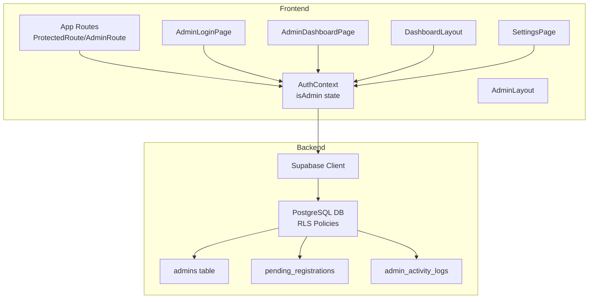
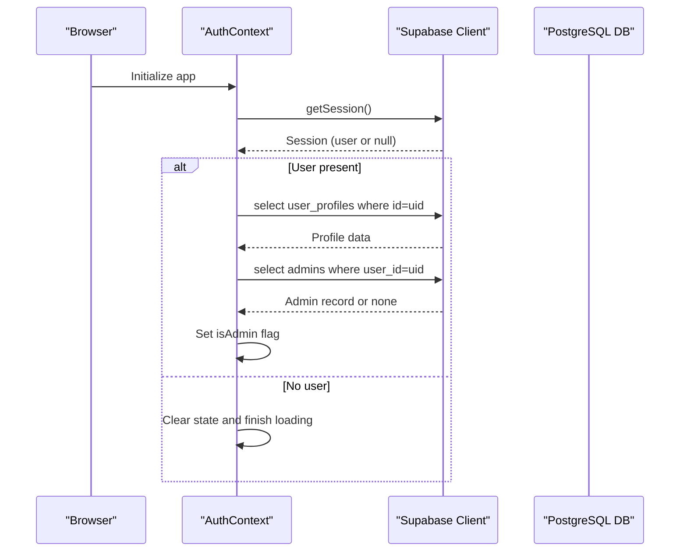
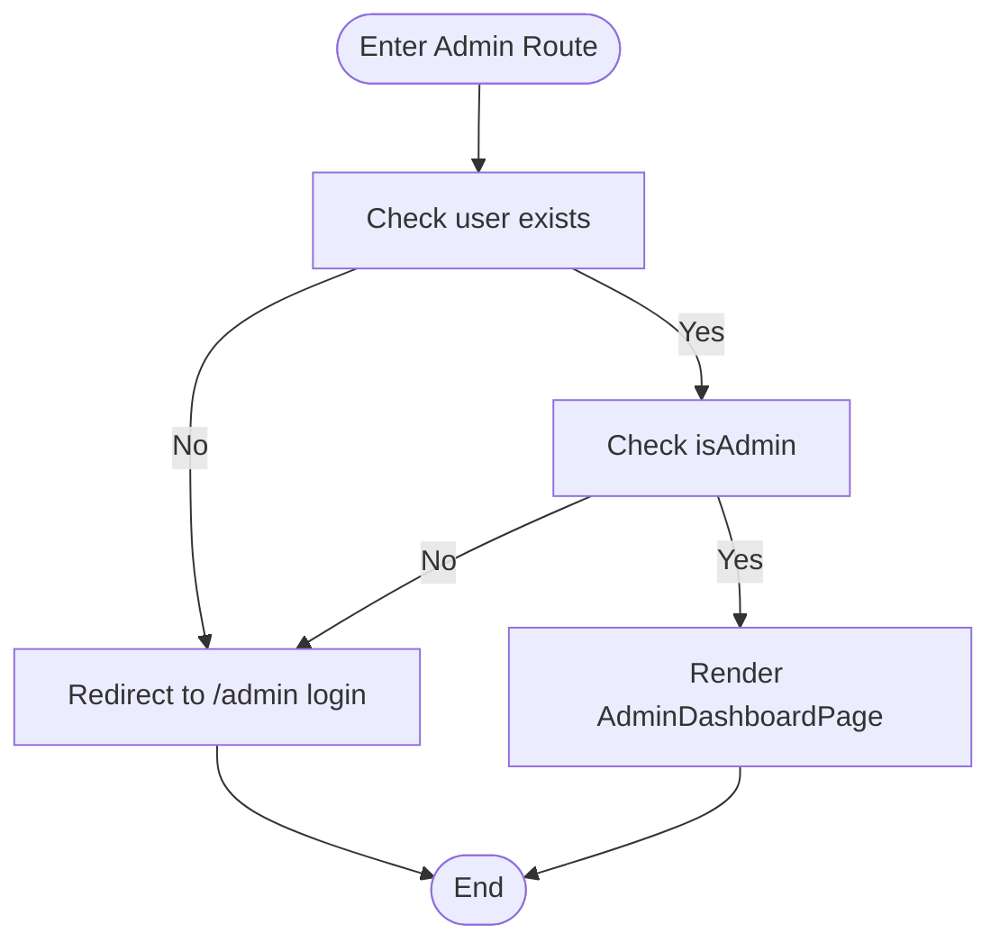
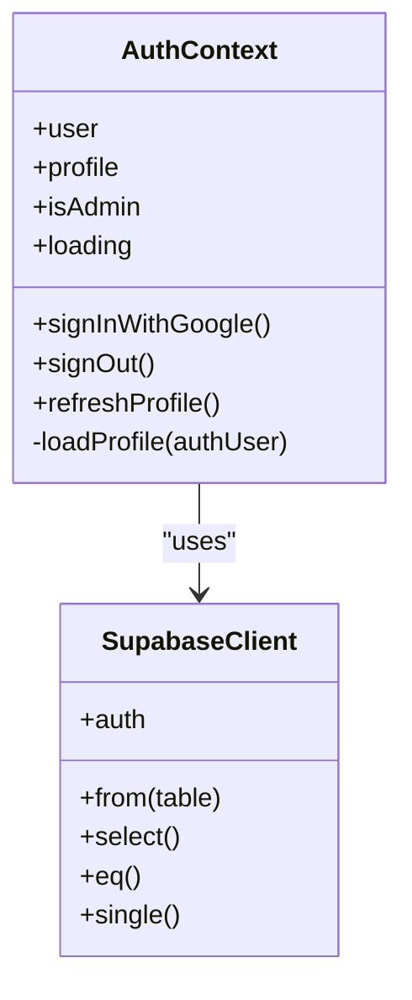
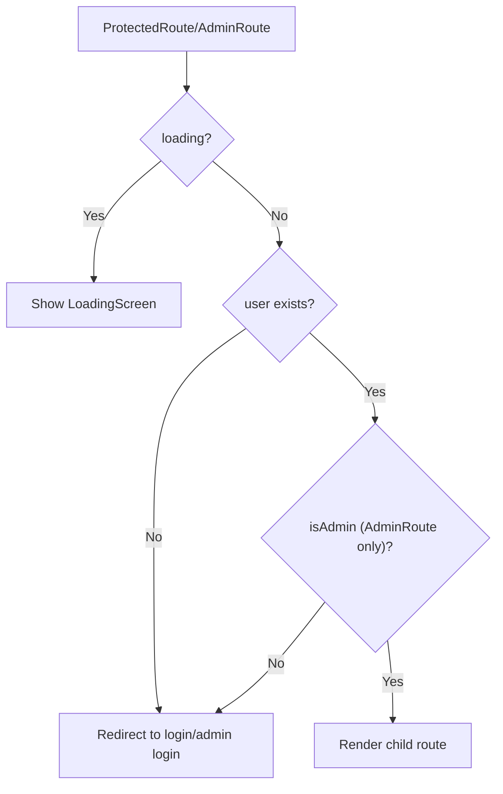
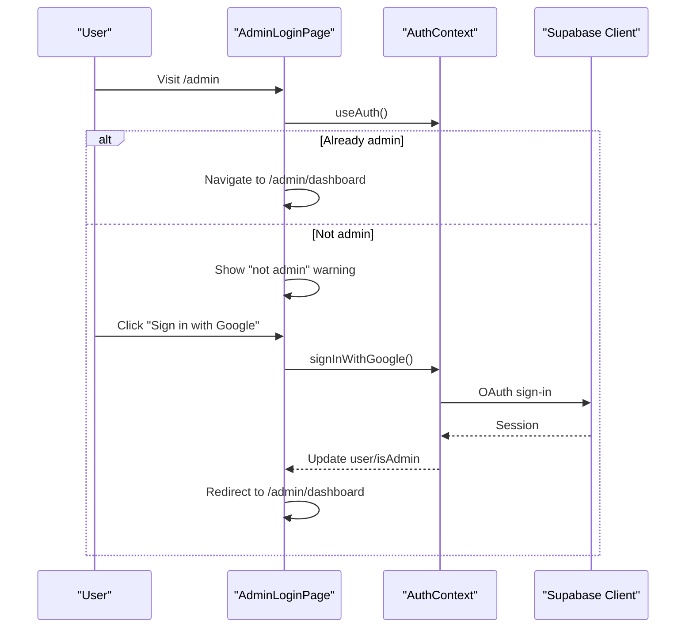
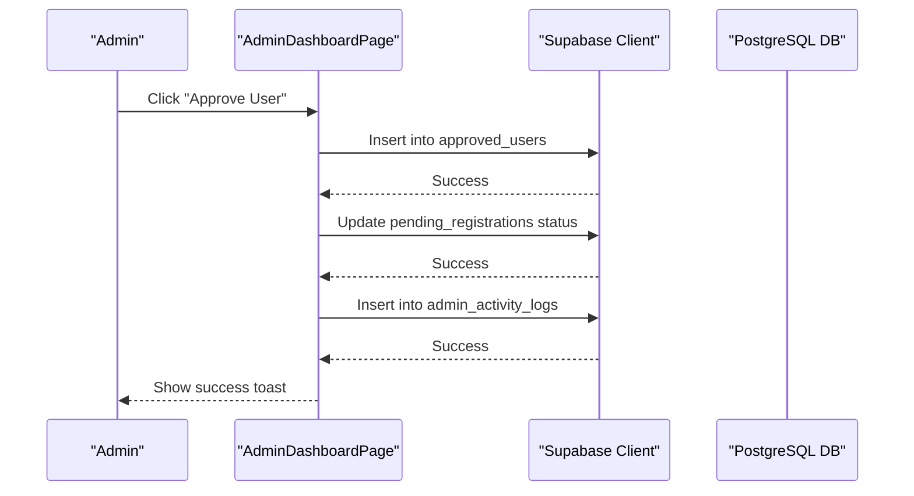
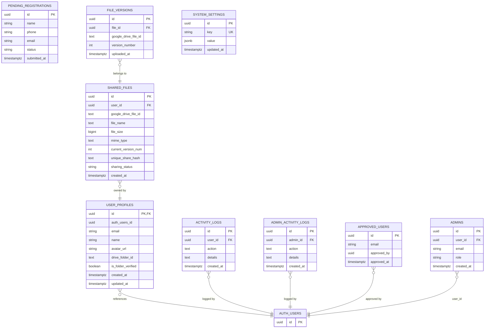
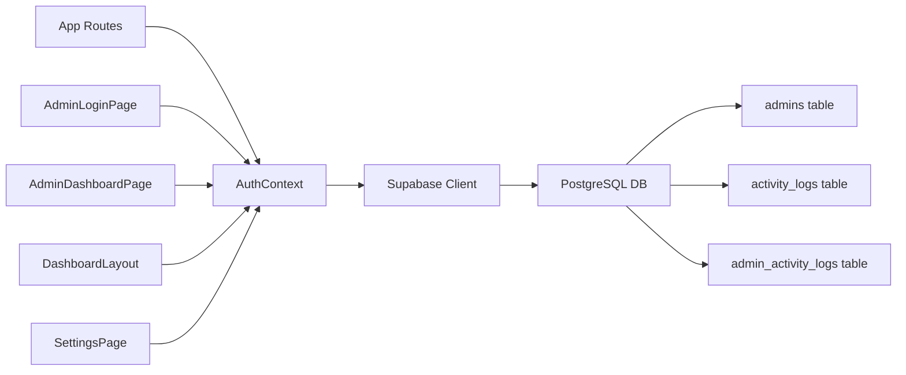

# Role-Based Access Control (RBAC)

<cite>
**Referenced Files in This Document**
- [AuthContext.jsx](file://web/src/contexts/AuthContext.jsx)
- [App.jsx](file://web/src/App.jsx)
- [AdminLayout.jsx](file://web/src/layouts/AdminLayout.jsx)
- [AdminLoginPage.jsx](file://web/src/pages/AdminLoginPage.jsx)
- [AdminDashboardPage.jsx](file://web/src/pages/AdminDashboardPage.jsx)
- [DashboardLayout.jsx](file://web/src/layouts/DashboardLayout.jsx)
- [SettingsPage.jsx](file://web/src/pages/SettingsPage.jsx)
- [supabase.js](file://web/src/services/supabase.js)
- [001_initial_schema.sql](file://supabase/migrations/001_initial_schema.sql)
</cite>

## Table of Contents
1. [Introduction](#introduction)
2. [Project Structure](#project-structure)
3. [Core Components](#core-components)
4. [Architecture Overview](#architecture-overview)
5. [Detailed Component Analysis](#detailed-component-analysis)
6. [Dependency Analysis](#dependency-analysis)
7. [Performance Considerations](#performance-considerations)
8. [Troubleshooting Guide](#troubleshooting-guide)
9. [Conclusion](#conclusion)

## Introduction
This document explains the role-based access control (RBAC) system implemented in the application. It covers how administrators are detected via the admins table, how the isAdmin state is managed, and how role-based UI rendering and route protection are enforced. It also documents the RBAC implementation in AuthContext, admin privilege checks, integration with protected routes, examples of admin-only features, role-based component rendering, and permission enforcement. Finally, it addresses security considerations, role assignment workflows, and audit trails for administrative actions.

## Project Structure
The RBAC implementation spans several frontend modules and backend database policies:
- Frontend authentication and RBAC state live in the AuthContext provider.
- Route guards enforce protected and admin-only access.
- Admin-only pages and UI elements render conditionally based on isAdmin.
- Backend row-level security (RLS) policies restrict data access at the database level.
- Audit logging captures administrative actions.

**Diagram sources**
- [AuthContext.jsx:1-112](file://web/src/contexts/AuthContext.jsx#L1-L112)
- [App.jsx:28-41](file://web/src/App.jsx#L28-L41)
- [AdminLayout.jsx:1-10](file://web/src/layouts/AdminLayout.jsx#L1-L10)
- [AdminLoginPage.jsx:1-82](file://web/src/pages/AdminLoginPage.jsx#L1-L82)
- [AdminDashboardPage.jsx:1-436](file://web/src/pages/AdminDashboardPage.jsx#L1-L436)
- [DashboardLayout.jsx:1-200](file://web/src/layouts/DashboardLayout.jsx#L1-L200)
- [SettingsPage.jsx:1-251](file://web/src/pages/SettingsPage.jsx#L1-L251)
- [supabase.js:1-7](file://web/src/services/supabase.js#L1-L7)
- [001_initial_schema.sql:29-105](file://supabase/migrations/001_initial_schema.sql#L29-L105)

**Section sources**
- [AuthContext.jsx:1-112](file://web/src/contexts/AuthContext.jsx#L1-L112)
- [App.jsx:28-41](file://web/src/App.jsx#L28-L41)
- [AdminLayout.jsx:1-10](file://web/src/layouts/AdminLayout.jsx#L1-L10)
- [AdminLoginPage.jsx:1-82](file://web/src/pages/AdminLoginPage.jsx#L1-L82)
- [AdminDashboardPage.jsx:1-436](file://web/src/pages/AdminDashboardPage.jsx#L1-L436)
- [DashboardLayout.jsx:1-200](file://web/src/layouts/DashboardLayout.jsx#L1-L200)
- [SettingsPage.jsx:1-251](file://web/src/pages/SettingsPage.jsx#L1-L251)
- [supabase.js:1-7](file://web/src/services/supabase.js#L1-L7)
- [001_initial_schema.sql:29-105](file://supabase/migrations/001_initial_schema.sql#L29-L105)

## Core Components
- AuthContext: Centralizes authentication state, loads user profiles, detects admin privileges, and exposes sign-in/sign-out utilities.
- App route guards: ProtectedRoute ensures general authentication; AdminRoute enforces admin-only access.
- AdminLayout: Wraps admin-only pages.
- AdminLoginPage: Admin sign-in flow with privilege check and messaging.
- AdminDashboardPage: Administrative controls and audit trail logging.
- Backend RLS policies: Enforce data access rules at the database level.

Key RBAC responsibilities:
- Admin detection: Queries the admins table to set isAdmin.
- State propagation: Provides isAdmin to all components via context.
- Route protection: Guards admin-only routes.
- UI rendering: Conditionally renders admin-only features and warnings.
- Audit logging: Records admin actions in admin_activity_logs.

**Section sources**
- [AuthContext.jsx:40-64](file://web/src/contexts/AuthContext.jsx#L40-L64)
- [App.jsx:28-41](file://web/src/App.jsx#L28-L41)
- [AdminLayout.jsx:1-10](file://web/src/layouts/AdminLayout.jsx#L1-L10)
- [AdminLoginPage.jsx:8-35](file://web/src/pages/AdminLoginPage.jsx#L8-L35)
- [AdminDashboardPage.jsx:47-95](file://web/src/pages/AdminDashboardPage.jsx#L47-L95)
- [001_initial_schema.sql:29-105](file://supabase/migrations/001_initial_schema.sql#L29-L105)

## Architecture Overview
The RBAC architecture combines client-side state management with server-side data policies:

**Diagram sources**
- [AuthContext.jsx:12-38](file://web/src/contexts/AuthContext.jsx#L12-L38)
- [AuthContext.jsx:40-64](file://web/src/contexts/AuthContext.jsx#L40-L64)

Additional guard flow for admin routes:

**Diagram sources**
- [App.jsx:35-41](file://web/src/App.jsx#L35-L41)

## Detailed Component Analysis

### AuthContext: Admin Detection and State Management
AuthContext manages:
- User session and profile loading.
- Admin privilege detection by querying the admins table.
- Global isAdmin state for downstream UI and route guards.
- Sign-in/sign-out lifecycle and profile refresh.

Implementation highlights:
- Loads user profile from user_profiles.
- Checks admins table for a matching user_id to determine isAdmin.
- Exposes isAdmin and refreshProfile to consumers.

**Diagram sources**
- [AuthContext.jsx:6-103](file://web/src/contexts/AuthContext.jsx#L6-L103)
- [supabase.js:1-7](file://web/src/services/supabase.js#L1-L7)

**Section sources**
- [AuthContext.jsx:6-103](file://web/src/contexts/AuthContext.jsx#L6-L103)

### Route Guards: ProtectedRoute and AdminRoute
Two route guards protect access:
- ProtectedRoute: Ensures general authentication for dashboard and related pages.
- AdminRoute: Ensures admin privileges for admin-only pages.

Behavior:
- If loading, show a loading screen.
- If not authenticated, redirect to appropriate login page.
- If authenticated but not admin, redirect to admin login page.

**Diagram sources**
- [App.jsx:28-52](file://web/src/App.jsx#L28-L52)

**Section sources**
- [App.jsx:28-52](file://web/src/App.jsx#L28-L52)

### AdminLayout: Admin-Only Container
AdminLayout provides a minimal wrapper for admin-only pages, ensuring consistent styling and outlet rendering.

**Section sources**
- [AdminLayout.jsx:1-10](file://web/src/layouts/AdminLayout.jsx#L1-L10)

### AdminLoginPage: Admin Sign-In and Privilege Messaging
AdminLoginPage:
- Uses useAuth to detect existing sessions and isAdmin.
- Renders a Google sign-in button for admin login.
- Shows a warning when a non-admin attempts admin login.
- Redirects automatically to /admin/dashboard upon successful admin login.

**Diagram sources**
- [AdminLoginPage.jsx:8-35](file://web/src/pages/AdminLoginPage.jsx#L8-L35)
- [AuthContext.jsx:66-82](file://web/src/contexts/AuthContext.jsx#L66-L82)

**Section sources**
- [AdminLoginPage.jsx:1-82](file://web/src/pages/AdminLoginPage.jsx#L1-L82)

### AdminDashboardPage: Admin-Only Features and Audit Trails
AdminDashboardPage implements:
- Admin-only features: pending registrations review, approvals/rejections, system settings toggles.
- Audit logging: Writes admin actions to admin_activity_logs.
- Conditional UI rendering: Buttons and tabs visible only to admins.

Examples of admin-only features:
- Approve/reject pending registrations.
- Toggle system settings (maintenance mode, downloads, sharing).
- View admin activity logs.

Audit trail integration:
- Logs user approval/rejection actions.
- Logs system setting changes.
- Logs admin logout.

**Diagram sources**
- [AdminDashboardPage.jsx:47-95](file://web/src/pages/AdminDashboardPage.jsx#L47-L95)
- [AdminDashboardPage.jsx:129-137](file://web/src/pages/AdminDashboardPage.jsx#L129-L137)

**Section sources**
- [AdminDashboardPage.jsx:1-436](file://web/src/pages/AdminDashboardPage.jsx#L1-L436)

### Protected Pages and Role-Based Rendering
Protected pages (e.g., DashboardLayout) are available to authenticated users. While not admin-only, they demonstrate role-based UI rendering patterns:
- DashboardLayout displays navigation items and profile actions.
- SettingsPage includes a security tab highlighting RLS and session management.

These pages illustrate how role-aware components can conditionally render features and actions.

**Section sources**
- [DashboardLayout.jsx:1-200](file://web/src/layouts/DashboardLayout.jsx#L1-L200)
- [SettingsPage.jsx:218-247](file://web/src/pages/SettingsPage.jsx#L218-L247)

### Backend RBAC: RLS Policies and Data Access
The database enforces RBAC via row-level security (RLS):
- Enables RLS on all relevant tables.
- Grants authenticated users read/write access to their own data (profiles, shared files, versions, logs).
- Allows public read for shareable resources (download by share hash).
- Restricts sensitive admin data and actions to authenticated users or admins as appropriate.

Relevant policies:
- User profiles: select/update/insert restricted to the user’s own records.
- Shared files: select/insert/update/delete restricted to the owning user.
- File versions: select/insert/delete restricted to versions of the user’s files.
- Activity logs: select/insert restricted to the user’s own logs.
- Pending registrations: public insert; authenticated users can read/update/delete.
- Approved users: authenticated users can read/insert; admin write access.
- Admins: authenticated users can read.
- Admin activity logs: authenticated users can insert/read.
- System settings: public read; authenticated users can update/insert.

**Diagram sources**
- [001_initial_schema.sql:29-122](file://supabase/migrations/001_initial_schema.sql#L29-L122)

**Section sources**
- [001_initial_schema.sql:129-266](file://supabase/migrations/001_initial_schema.sql#L129-L266)

## Dependency Analysis
The RBAC system depends on:
- Supabase client for authentication and database operations.
- AuthContext for centralized state and admin detection.
- Route guards for runtime access control.
- Database RLS policies for server-side enforcement.

**Diagram sources**
- [AuthContext.jsx:1-112](file://web/src/contexts/AuthContext.jsx#L1-L112)
- [App.jsx:28-41](file://web/src/App.jsx#L28-L41)
- [AdminLoginPage.jsx:1-82](file://web/src/pages/AdminLoginPage.jsx#L1-L82)
- [AdminDashboardPage.jsx:1-436](file://web/src/pages/AdminDashboardPage.jsx#L1-L436)
- [DashboardLayout.jsx:1-200](file://web/src/layouts/DashboardLayout.jsx#L1-L200)
- [SettingsPage.jsx:1-251](file://web/src/pages/SettingsPage.jsx#L1-L251)
- [supabase.js:1-7](file://web/src/services/supabase.js#L1-L7)
- [001_initial_schema.sql:29-105](file://supabase/migrations/001_initial_schema.sql#L29-L105)

**Section sources**
- [AuthContext.jsx:1-112](file://web/src/contexts/AuthContext.jsx#L1-L112)
- [App.jsx:28-41](file://web/src/App.jsx#L28-L41)
- [AdminLoginPage.jsx:1-82](file://web/src/pages/AdminLoginPage.jsx#L1-L82)
- [AdminDashboardPage.jsx:1-436](file://web/src/pages/AdminDashboardPage.jsx#L1-L436)
- [DashboardLayout.jsx:1-200](file://web/src/layouts/DashboardLayout.jsx#L1-L200)
- [SettingsPage.jsx:1-251](file://web/src/pages/SettingsPage.jsx#L1-L251)
- [supabase.js:1-7](file://web/src/services/supabase.js#L1-L7)
- [001_initial_schema.sql:29-105](file://supabase/migrations/001_initial_schema.sql#L29-L105)

## Performance Considerations
- Minimize redundant queries: AuthContext already batches profile and admin checks during session initialization.
- Debounce UI updates: Avoid frequent re-renders by relying on context state rather than per-component queries.
- Database indexing: Ensure indexes on frequently filtered columns (e.g., user_id, email) to optimize RLS policy evaluation.
- Client caching: Consider caching admin decisions locally to reduce repeated backend calls during a session.

## Troubleshooting Guide
Common issues and resolutions:
- Admin login fails silently: Verify OAuth redirect URI and environment variables for Supabase client initialization.
- Non-admins redirected to admin login: Confirm the user exists in the admins table with a valid role.
- Admin UI elements missing: Ensure the user profile is loaded and the admins table lookup succeeds.
- Audit logs not appearing: Check admin_activity_logs permissions and that the admin_id field references a valid auth user.

Security and compliance:
- Always rely on backend RLS policies; never assume frontend-only checks are sufficient.
- Treat admin_activity_logs as immutable audit trails; avoid client-side edits.
- Regularly review and rotate service credentials and environment variables.

**Section sources**
- [AuthContext.jsx:59-63](file://web/src/contexts/AuthContext.jsx#L59-L63)
- [AdminLoginPage.jsx:30-35](file://web/src/pages/AdminLoginPage.jsx#L30-L35)
- [AdminDashboardPage.jsx:62-67](file://web/src/pages/AdminDashboardPage.jsx#L62-L67)
- [001_initial_schema.sql:241-253](file://supabase/migrations/001_initial_schema.sql#L241-L253)

## Conclusion
The application implements a robust RBAC system combining client-side state management with server-side database policies. AuthContext centralizes admin detection and state, while route guards enforce access control. Admin-only features and audit logging provide strong operational oversight. Backend RLS policies ensure data remains protected even if frontend protections are bypassed. Together, these mechanisms deliver a secure, maintainable RBAC framework suitable for administrative workflows and user data protection.