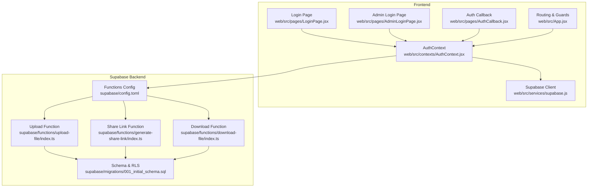
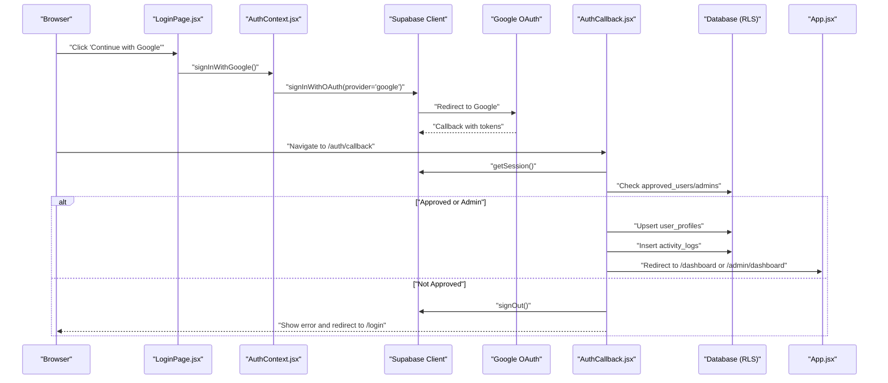
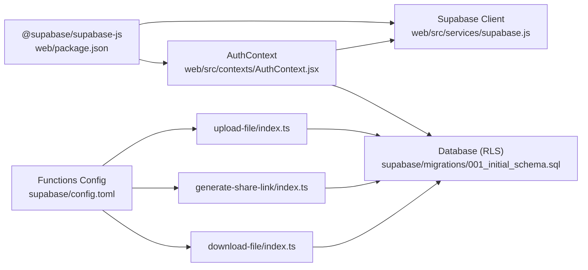

# Security Policies and Best Practices

<cite>
**Referenced Files in This Document**
- [AuthContext.jsx](file://web/src/contexts/AuthContext.jsx)
- [supabase.js](file://web/src/services/supabase.js)
- [LoginPage.jsx](file://web/src/pages/LoginPage.jsx)
- [AdminLoginPage.jsx](file://web/src/pages/AdminLoginPage.jsx)
- [AuthCallback.jsx](file://web/src/pages/AuthCallback.jsx)
- [App.jsx](file://web/src/App.jsx)
- [helpers.js](file://web/src/utils/helpers.js)
- [config.toml](file://supabase/config.toml)
- [001_initial_schema.sql](file://supabase/migrations/001_initial_schema.sql)
- [upload-file/index.ts](file://supabase/functions/upload-file/index.ts)
- [generate-share-link/index.ts](file://supabase/functions/generate-share-link/index.ts)
- [download-file/index.ts](file://supabase/functions/download-file/index.ts)
- [package.json](file://web/package.json)
</cite>

## Table of Contents
1. [Introduction](#introduction)
2. [Project Structure](#project-structure)
3. [Core Components](#core-components)
4. [Architecture Overview](#architecture-overview)
5. [Detailed Component Analysis](#detailed-component-analysis)
6. [Dependency Analysis](#dependency-analysis)
7. [Performance Considerations](#performance-considerations)
8. [Troubleshooting Guide](#troubleshooting-guide)
9. [Conclusion](#conclusion)
10. [Appendices](#appendices)

## Introduction
This document defines authentication security policies and implementation best practices for the project. It explains how JWT tokens and sessions are handled, how data is protected, and how Google OAuth is integrated with scope management and credential handling. It also provides guidelines for secure authentication flows, input validation, and protection against common vulnerabilities. Finally, it covers security monitoring, audit logging, incident response, and compliance considerations grounded in the repository’s actual implementation.

## Project Structure
The authentication system spans the frontend React application and Supabase serverless functions:
- Frontend authentication context and routing enforce session state and role checks.
- Supabase configuration enforces JWT verification on selected functions.
- Database schema and row-level security policies protect data access.
- Supabase functions validate requests, enforce authorization, and manage integrations with Google APIs.

**Diagram sources**
- [AuthContext.jsx:1-112](file://web/src/contexts/AuthContext.jsx#L1-L112)
- [supabase.js:1-7](file://web/src/services/supabase.js#L1-L7)
- [LoginPage.jsx:1-77](file://web/src/pages/LoginPage.jsx#L1-L77)
- [AdminLoginPage.jsx:1-82](file://web/src/pages/AdminLoginPage.jsx#L1-L82)
- [AuthCallback.jsx:1-84](file://web/src/pages/AuthCallback.jsx#L1-L84)
- [App.jsx:1-92](file://web/src/App.jsx#L1-L92)
- [config.toml:1-21](file://supabase/config.toml#L1-L21)
- [upload-file/index.ts:1-152](file://supabase/functions/upload-file/index.ts#L1-L152)
- [generate-share-link/index.ts:1-55](file://supabase/functions/generate-share-link/index.ts#L1-L55)
- [download-file/index.ts:1-131](file://supabase/functions/download-file/index.ts#L1-L131)
- [001_initial_schema.sql:1-289](file://supabase/migrations/001_initial_schema.sql#L1-L289)

**Section sources**
- [AuthContext.jsx:1-112](file://web/src/contexts/AuthContext.jsx#L1-L112)
- [supabase.js:1-7](file://web/src/services/supabase.js#L1-L7)
- [App.jsx:1-92](file://web/src/App.jsx#L1-L92)
- [config.toml:1-21](file://supabase/config.toml#L1-L21)
- [001_initial_schema.sql:1-289](file://supabase/migrations/001_initial_schema.sql#L1-L289)

## Core Components
- Authentication Context: Manages session state, listens for auth changes, loads user profiles, determines admin status, and exposes sign-in/sign-out functions.
- Supabase Client: Initializes the client with environment variables for URL and anonymous key.
- Routing Guards: Protect routes using session and admin checks.
- Google OAuth Integration: Initiates OAuth with scopes and handles callback logic, approvals, and profile creation.
- Supabase Functions: Enforce JWT verification, validate inputs, and integrate with Google Drive APIs.
- Database Schema and RLS: Define tables, indexes, and row-level security policies to restrict data access.

Security-relevant highlights:
- Session persistence and change subscriptions are centralized in the context.
- Admin-only access is enforced via route guards and database roles.
- Functions require JWT verification except for public download endpoint.
- Activity logs capture login events for auditing.

**Section sources**
- [AuthContext.jsx:12-38](file://web/src/contexts/AuthContext.jsx#L12-L38)
- [AuthContext.jsx:66-82](file://web/src/contexts/AuthContext.jsx#L66-L82)
- [supabase.js:3-6](file://web/src/services/supabase.js#L3-L6)
- [App.jsx:28-41](file://web/src/App.jsx#L28-L41)
- [config.toml:1-21](file://supabase/config.toml#L1-L21)
- [001_initial_schema.sql:84-105](file://supabase/migrations/001_initial_schema.sql#L84-L105)

## Architecture Overview
The authentication flow integrates Google OAuth with Supabase Auth, followed by local approval checks and profile synchronization. Protected functions enforce JWT verification and validate inputs before interacting with Google Drive.

**Diagram sources**
- [LoginPage.jsx:17-28](file://web/src/pages/LoginPage.jsx#L17-L28)
- [AuthContext.jsx:66-75](file://web/src/contexts/AuthContext.jsx#L66-L75)
- [AuthCallback.jsx:9-73](file://web/src/pages/AuthCallback.jsx#L9-L73)
- [App.jsx:54-91](file://web/src/App.jsx#L54-L91)
- [001_initial_schema.sql:19-51](file://supabase/migrations/001_initial_schema.sql#L19-L51)

## Detailed Component Analysis

### Authentication Context and Session Management
- Initializes session retrieval and subscribes to auth state changes.
- Loads user profile and admin status upon login.
- Exposes sign-in with Google and sign-out functions.
- Provides profile refresh capability.

Security considerations:
- Centralized auth state reduces duplication and ensures consistent enforcement.
- Profile and admin checks occur after successful session retrieval.

**Section sources**
- [AuthContext.jsx:12-38](file://web/src/contexts/AuthContext.jsx#L12-L38)
- [AuthContext.jsx:40-64](file://web/src/contexts/AuthContext.jsx#L40-L64)
- [AuthContext.jsx:66-82](file://web/src/contexts/AuthContext.jsx#L66-L82)

### Google OAuth Integration and Scope Management
- Initiates OAuth with provider and redirect URI.
- Sets scopes for profile and email access plus Google Drive permissions.
- Handles callback to validate approval and synchronize user profile.

Security considerations:
- Scopes are explicitly defined; ensure they align with least privilege.
- Approval gating prevents unauthorized access even with valid OAuth tokens.

**Section sources**
- [AuthContext.jsx:66-75](file://web/src/contexts/AuthContext.jsx#L66-L75)
- [AuthCallback.jsx:20-39](file://web/src/pages/AuthCallback.jsx#L20-L39)

### Supabase Client Initialization
- Reads Supabase URL and anonymous key from environment variables.
- Used across frontend pages and functions.

Security considerations:
- Environment variables must be configured securely in deployment environments.
- Avoid exposing secrets in client-side code.

**Section sources**
- [supabase.js:3-6](file://web/src/services/supabase.js#L3-L6)

### Routing Guards and Role-Based Access
- ProtectedRoute enforces authenticated access.
- AdminRoute enforces admin role.
- Loading screens prevent race conditions during auth resolution.

Security considerations:
- Guards rely on context state; ensure auth state is accurate and up-to-date.

**Section sources**
- [App.jsx:28-41](file://web/src/App.jsx#L28-L41)
- [App.jsx:43-52](file://web/src/App.jsx#L43-L52)

### Supabase Functions: JWT Verification and Input Validation
- Functions configured with verify_jwt=true enforce JWT verification.
- Input validation includes presence checks, size limits, MIME/type restrictions, and extension blocking.
- Functions use Authorization headers to propagate session context.

Security considerations:
- JWT verification ensures only authenticated callers can invoke protected functions.
- Strict file validation mitigates malicious uploads.

**Section sources**
- [config.toml:1-21](file://supabase/config.toml#L1-L21)
- [upload-file/index.ts:24-57](file://supabase/functions/upload-file/index.ts#L24-L57)
- [upload-file/index.ts:59-68](file://supabase/functions/upload-file/index.ts#L59-L68)

### Download Endpoint: Public Access Control
- Uses service role to bypass RLS for lookup.
- Enforces sharing status and system setting checks.
- Attempts to redirect to Google Drive URLs; otherwise returns errors.

Security considerations:
- Public download relies on share hash and sharing status; ensure hashes are unpredictable.
- Consider rate limiting and IP allowlisting for sensitive endpoints.

**Section sources**
- [download-file/index.ts:23-44](file://supabase/functions/download-file/index.ts#L23-L44)
- [download-file/index.ts:46-72](file://supabase/functions/download-file/index.ts#L46-L72)
- [download-file/index.ts:98-118](file://supabase/functions/download-file/index.ts#L98-L118)

### Database Schema and Row-Level Security
- Tables for user profiles, approvals, admins, activity logs, and system settings.
- RLS policies restrict access to authenticated users and owners.
- Indexes optimize lookups for emails and share hashes.

Security considerations:
- RLS policies must remain aligned with application logic.
- Unique indexes on emails and share hashes improve uniqueness guarantees.

**Section sources**
- [001_initial_schema.sql:41-51](file://supabase/migrations/001_initial_schema.sql#L41-L51)
- [001_initial_schema.sql:129-266](file://supabase/migrations/001_initial_schema.sql#L129-L266)

### Audit Logging and Activity Tracking
- Login events are inserted into activity_logs.
- Admin actions are tracked separately.

Security considerations:
- Logs should be retained per policy and protected from tampering.
- Consider structured logging and SIEM integration.

**Section sources**
- [AuthCallback.jsx:57-62](file://web/src/pages/AuthCallback.jsx#L57-L62)
- [001_initial_schema.sql:84-105](file://supabase/migrations/001_initial_schema.sql#L84-L105)

## Dependency Analysis
The frontend depends on Supabase client libraries and React Router for navigation. Supabase functions depend on Supabase runtime and environment variables. Database dependencies include RLS and triggers.

**Diagram sources**
- [package.json:11-20](file://web/package.json#L11-L20)
- [supabase.js:1-7](file://web/src/services/supabase.js#L1-L7)
- [AuthContext.jsx:1-10](file://web/src/contexts/AuthContext.jsx#L1-L10)
- [config.toml:1-21](file://supabase/config.toml#L1-L21)
- [upload-file/index.ts:1-10](file://supabase/functions/upload-file/index.ts#L1-L10)
- [generate-share-link/index.ts:1-10](file://supabase/functions/generate-share-link/index.ts#L1-L10)
- [download-file/index.ts:1-10](file://supabase/functions/download-file/index.ts#L1-L10)
- [001_initial_schema.sql:1-20](file://supabase/migrations/001_initial_schema.sql#L1-L20)

**Section sources**
- [package.json:11-20](file://web/package.json#L11-L20)
- [supabase.js:1-7](file://web/src/services/supabase.js#L1-L7)
- [config.toml:1-21](file://supabase/config.toml#L1-L21)
- [001_initial_schema.sql:1-20](file://supabase/migrations/001_initial_schema.sql#L1-L20)

## Performance Considerations
- Minimize repeated profile queries by caching in context where appropriate.
- Use indexes on frequently queried columns (emails, share hashes).
- Offload heavy operations to serverless functions and avoid synchronous long-running tasks in the browser.
- Consider CDN caching for static assets and rate limiting for API endpoints.

## Troubleshooting Guide
Common issues and resolutions:
- Missing authorization header in functions: Ensure clients send Authorization header with bearer token.
- Unapproved user redirection: Verify user exists in approved_users or admins tables.
- Admin login failures: Confirm admin role and email alignment in admins table.
- Download failures: Check sharing_status, system settings, and Google Drive file availability.
- CORS errors: Confirm Access-Control-Allow-Origin and headers in function responses.

**Section sources**
- [upload-file/index.ts:29-44](file://supabase/functions/upload-file/index.ts#L29-L44)
- [AuthCallback.jsx:34-39](file://web/src/pages/AuthCallback.jsx#L34-L39)
- [download-file/index.ts:46-72](file://supabase/functions/download-file/index.ts#L46-L72)

## Conclusion
The project implements a robust authentication foundation using Supabase Auth, Google OAuth, JWT verification for selected functions, and database-driven RLS. Security is strengthened by approval gating, activity logging, and strict input validation. To further harden the system, consider adding rate limiting, secret rotation, stricter CSP, and continuous monitoring.

## Appendices

### Secure Authentication Flow Guidelines
- Always require JWT verification for functions performing privileged operations.
- Enforce least-privilege OAuth scopes and review them periodically.
- Store only hashed tokens server-side; never persist raw credentials in client.
- Implement CSRF protection for state-changing operations.
- Use HTTPS everywhere and secure cookies for session storage.

### Input Validation and Sanitization Checklist
- Validate presence, size, and type of uploads.
- Block executable and unsafe extensions.
- Sanitize filenames and enforce safe naming.
- Limit concurrent uploads and enforce quotas.

### Protection Against Common Vulnerabilities
- Injection: Use parameterized queries and validated inputs.
- Misconfiguration: Review Supabase config and function settings regularly.
- Broken Access Control: Verify RLS policies and admin checks.
- Insecure Deserialization: Avoid storing serialized objects; use typed schemas.

### Security Monitoring, Audit Logging, and Incident Response
- Monitor auth callbacks, failed logins, and admin actions.
- Retain logs per policy and protect against tampering.
- Establish alerting for unusual spikes or repeated failures.
- Define incident response steps: isolate affected accounts, rotate secrets, and notify stakeholders.

### Compliance and Privacy Considerations
- Data minimization: Collect only necessary user data.
- Consent and transparency: Clearly communicate data usage.
- Data retention: Implement automated deletion policies.
- Privacy by design: Encrypt at rest and in transit; anonymize logs where possible.