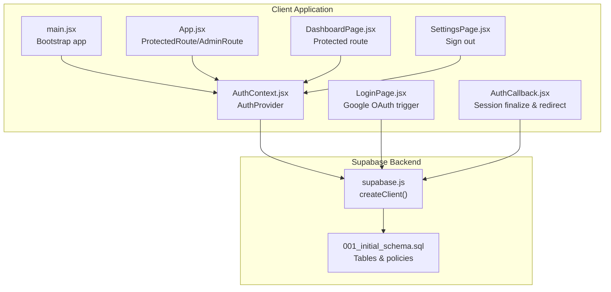
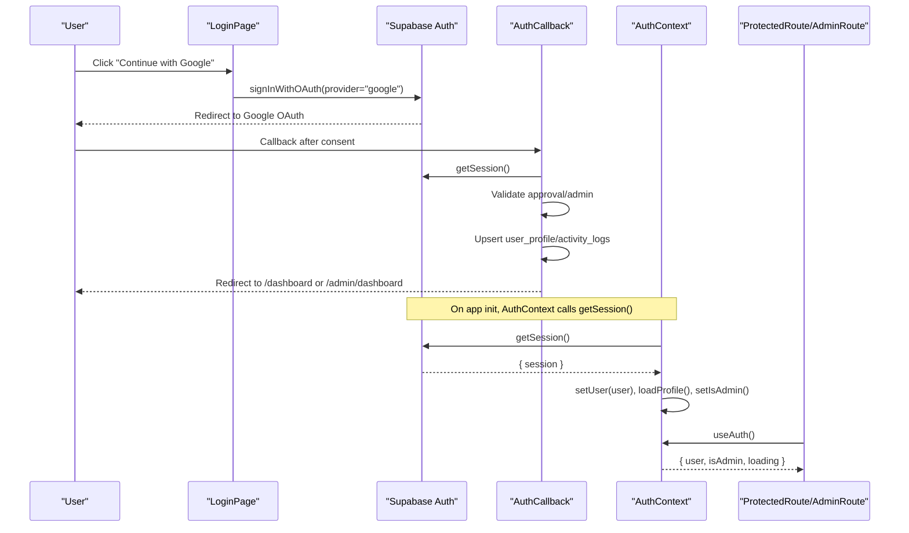
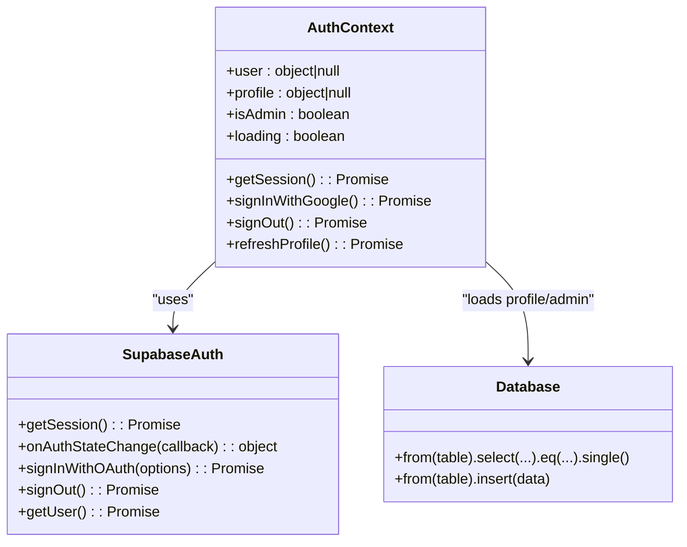
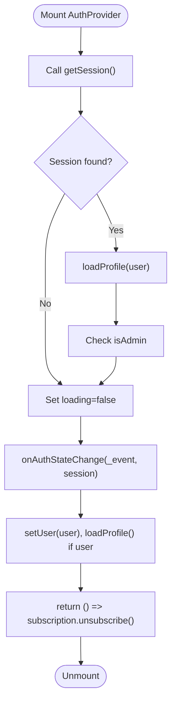
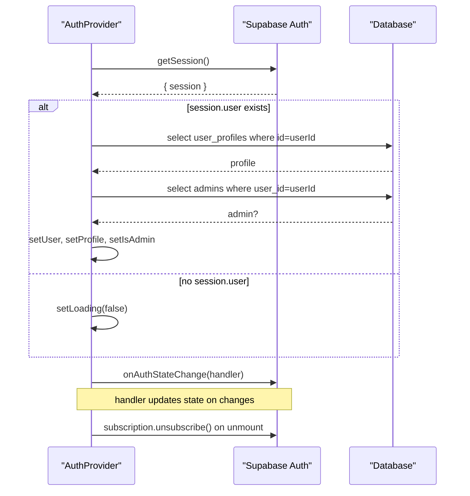
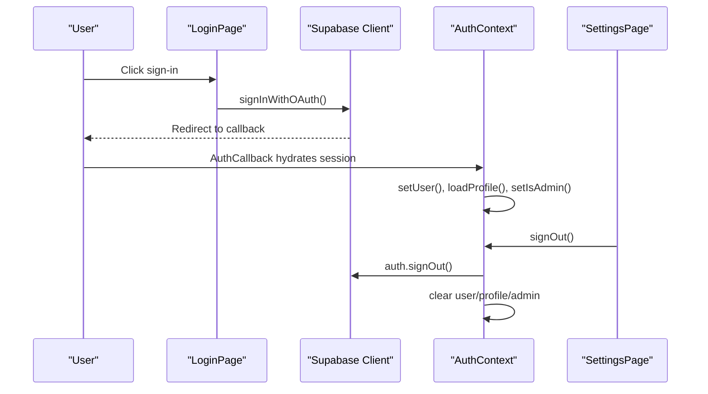
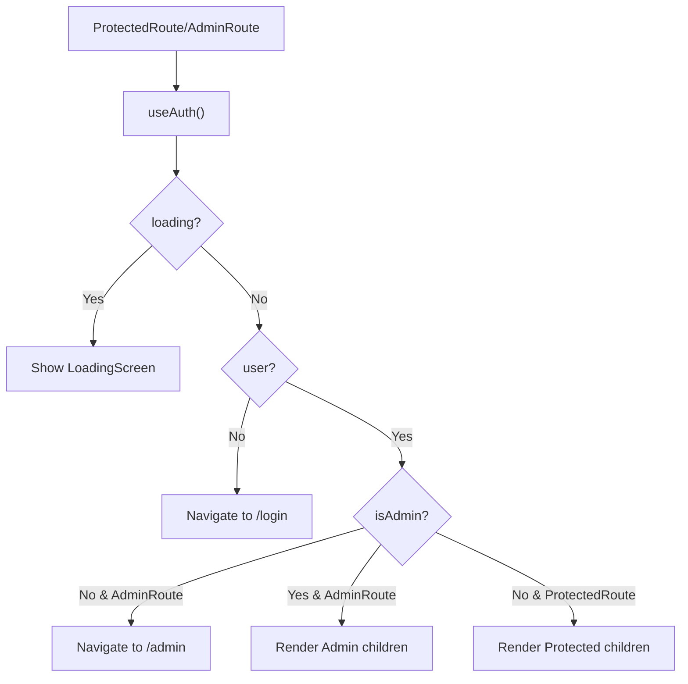
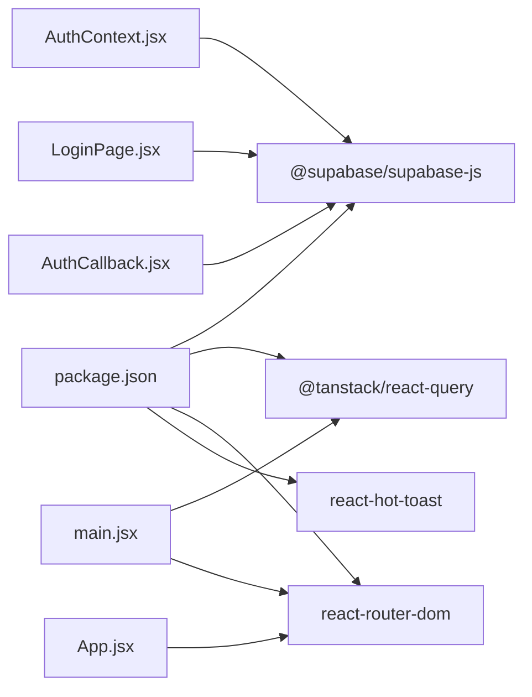

# Session Management

<cite>
**Referenced Files in This Document**
- [AuthContext.jsx](file://web/src/contexts/AuthContext.jsx)
- [supabase.js](file://web/src/services/supabase.js)
- [main.jsx](file://web/src/main.jsx)
- [App.jsx](file://web/src/App.jsx)
- [LoginPage.jsx](file://web/src/pages/LoginPage.jsx)
- [AuthCallback.jsx](file://web/src/pages/AuthCallback.jsx)
- [DashboardPage.jsx](file://web/src/pages/DashboardPage.jsx)
- [SettingsPage.jsx](file://web/src/pages/SettingsPage.jsx)
- [001_initial_schema.sql](file://supabase/migrations/001_initial_schema.sql)
- [package.json](file://web/package.json)
</cite>

## Table of Contents
1. [Introduction](#introduction)
2. [Project Structure](#project-structure)
3. [Core Components](#core-components)
4. [Architecture Overview](#architecture-overview)
5. [Detailed Component Analysis](#detailed-component-analysis)
6. [Dependency Analysis](#dependency-analysis)
7. [Performance Considerations](#performance-considerations)
8. [Troubleshooting Guide](#troubleshooting-guide)
9. [Conclusion](#conclusion)

## Introduction
This document explains session management and state persistence in the application, focusing on:
- How sessions are initialized and maintained using Supabase Authentication
- Real-time auth state monitoring via onAuthStateChange
- Automatic session handling across browser reloads, tab switches, and app restarts
- AuthContext provider implementation, state initialization, and cleanup
- Examples of session lifecycle management, user state updates, and subscription handling
- Error handling for session failures, token expiration, and network connectivity issues

## Project Structure
The session management implementation centers around a React Context provider that integrates with Supabase Authentication. Key elements:
- Supabase client initialization
- AuthContext provider that manages user, profile, admin status, and loading state
- Protected routing that depends on auth state
- OAuth callback page that finalizes login and redirects users
- Database schema supporting user profiles, approvals, and admin roles

**Diagram sources**
- [main.jsx:19-40](file://web/src/main.jsx#L19-L40)
- [AuthContext.jsx:6-103](file://web/src/contexts/AuthContext.jsx#L6-L103)
- [App.jsx:28-41](file://web/src/App.jsx#L28-L41)
- [LoginPage.jsx:17-28](file://web/src/pages/LoginPage.jsx#L17-L28)
- [AuthCallback.jsx:9-73](file://web/src/pages/AuthCallback.jsx#L9-L73)
- [DashboardPage.jsx:1-177](file://web/src/pages/DashboardPage.jsx#L1-L177)
- [SettingsPage.jsx:240-246](file://web/src/pages/SettingsPage.jsx#L240-L246)
- [supabase.js:1-7](file://web/src/services/supabase.js#L1-L7)
- [001_initial_schema.sql:42-51](file://supabase/migrations/001_initial_schema.sql#L42-L51)

**Section sources**
- [main.jsx:19-40](file://web/src/main.jsx#L19-L40)
- [AuthContext.jsx:6-103](file://web/src/contexts/AuthContext.jsx#L6-L103)
- [App.jsx:28-41](file://web/src/App.jsx#L28-L41)
- [LoginPage.jsx:17-28](file://web/src/pages/LoginPage.jsx#L17-L28)
- [AuthCallback.jsx:9-73](file://web/src/pages/AuthCallback.jsx#L9-L73)
- [DashboardPage.jsx:1-177](file://web/src/pages/DashboardPage.jsx#L1-L177)
- [SettingsPage.jsx:240-246](file://web/src/pages/SettingsPage.jsx#L240-L246)
- [supabase.js:1-7](file://web/src/services/supabase.js#L1-L7)
- [001_initial_schema.sql:42-51](file://supabase/migrations/001_initial_schema.sql#L42-L51)

## Core Components
- Supabase client initialization: Creates a Supabase client instance used by all auth operations.
- AuthContext provider: Centralizes auth state, loads user profile, detects admin role, and exposes sign-in/sign-out/refresh utilities.
- ProtectedRoute/AdminRoute: Enforce auth and admin access checks during navigation.
- LoginPage: Triggers Google OAuth sign-in and handles pre-login checks.
- AuthCallback: Finalizes session after OAuth, validates approval/admin status, creates profiles, logs activity, and redirects.
- SettingsPage: Provides sign-out capability.

Key implementation highlights:
- getSession() is called during provider initialization to hydrate state from storage.
- onAuthStateChange monitors real-time auth events and updates state accordingly.
- Subscription cleanup ensures no memory leaks.

**Section sources**
- [supabase.js:1-7](file://web/src/services/supabase.js#L1-L7)
- [AuthContext.jsx:12-38](file://web/src/contexts/AuthContext.jsx#L12-L38)
- [App.jsx:28-41](file://web/src/App.jsx#L28-L41)
- [LoginPage.jsx:17-28](file://web/src/pages/LoginPage.jsx#L17-L28)
- [AuthCallback.jsx:9-73](file://web/src/pages/AuthCallback.jsx#L9-L73)
- [SettingsPage.jsx:240-246](file://web/src/pages/SettingsPage.jsx#L240-L246)

## Architecture Overview
The session lifecycle spans initialization, real-time monitoring, and navigation protection.

**Diagram sources**
- [LoginPage.jsx:17-28](file://web/src/pages/LoginPage.jsx#L17-L28)
- [AuthCallback.jsx:9-73](file://web/src/pages/AuthCallback.jsx#L9-L73)
- [AuthContext.jsx:12-38](file://web/src/contexts/AuthContext.jsx#L12-L38)
- [App.jsx:28-41](file://web/src/App.jsx#L28-L41)

## Detailed Component Analysis

### AuthContext Provider
Responsibilities:
- Initialize auth state by calling getSession() on mount
- Subscribe to onAuthStateChange to react to external auth events
- Load user profile and detect admin role
- Expose sign-in, sign-out, and profile refresh utilities
- Clean up subscriptions on unmount

Implementation patterns:
- State initialization: user, profile, isAdmin, loading
- Real-time monitoring: subscription returned by onAuthStateChange
- Cleanup: unsubscribe in useEffect return

**Diagram sources**
- [AuthContext.jsx:6-103](file://web/src/contexts/AuthContext.jsx#L6-L103)
- [supabase.js:1-7](file://web/src/services/supabase.js#L1-L7)

**Section sources**
- [AuthContext.jsx:6-103](file://web/src/contexts/AuthContext.jsx#L6-L103)

### getSession() Usage
- Called during provider initialization to hydrate state from persistent storage
- Ensures immediate availability of user/session state without blocking render
- Subsequent onAuthStateChange events keep state synchronized across tabs and browser windows

Lifecycle example:
- On app boot, AuthContext calls getSession()
- If a valid session exists, user/profile/admin state is populated
- If no session, loading completes and UI remains unauthenticated

**Section sources**
- [AuthContext.jsx:12-21](file://web/src/contexts/AuthContext.jsx#L12-L21)

### Real-Time Auth State Monitoring with onAuthStateChange
Behavior:
- Subscribes to auth state changes
- Updates user state immediately upon external changes (e.g., logout in another tab)
- Loads profile and admin status when a user becomes available
- Clears state when no user is present

Subscription handling:
- Subscription is created once on mount
- Unsubscribed on component unmount to prevent leaks

**Diagram sources**
- [AuthContext.jsx:12-38](file://web/src/contexts/AuthContext.jsx#L12-L38)

**Section sources**
- [AuthContext.jsx:12-38](file://web/src/contexts/AuthContext.jsx#L12-L38)

### Automatic Session Renewal Mechanisms
Mechanisms:
- Supabase Authentication automatically manages token refresh and renewal
- getSession() retrieves the current session from storage
- onAuthStateChange reacts to state transitions triggered by Supabase SDK internals

Implications:
- No manual token refresh logic is required in the client
- State updates propagate across tabs and windows automatically

**Section sources**
- [AuthContext.jsx:12-38](file://web/src/contexts/AuthContext.jsx#L12-L38)

### AuthContext State Initialization and Cleanup
Initialization:
- Sets loading=true initially
- Calls getSession() to hydrate state
- Starts onAuthStateChange subscription
- Completes loading after initial hydration

Cleanup:
- Unsubscribes from onAuthStateChange on unmount

**Diagram sources**
- [AuthContext.jsx:12-38](file://web/src/contexts/AuthContext.jsx#L12-L38)
- [AuthContext.jsx:40-64](file://web/src/contexts/AuthContext.jsx#L40-L64)

**Section sources**
- [AuthContext.jsx:6-103](file://web/src/contexts/AuthContext.jsx#L6-L103)

### Session Lifecycle Management Examples
- Login flow:
  - LoginPage triggers OAuth sign-in
  - AuthCallback finalizes session, validates approval/admin, and redirects
- Logout flow:
  - SettingsPage invokes signOut() which clears local state and signs out from Supabase
- Profile refresh:
  - AuthContext exposes refreshProfile() to reload profile/admin state

**Diagram sources**
- [LoginPage.jsx:17-28](file://web/src/pages/LoginPage.jsx#L17-L28)
- [AuthCallback.jsx:9-73](file://web/src/pages/AuthCallback.jsx#L9-L73)
- [AuthContext.jsx:77-82](file://web/src/contexts/AuthContext.jsx#L77-L82)
- [SettingsPage.jsx:240-246](file://web/src/pages/SettingsPage.jsx#L240-L246)

**Section sources**
- [LoginPage.jsx:17-28](file://web/src/pages/LoginPage.jsx#L17-L28)
- [AuthCallback.jsx:9-73](file://web/src/pages/AuthCallback.jsx#L9-L73)
- [AuthContext.jsx:77-82](file://web/src/contexts/AuthContext.jsx#L77-L82)
- [SettingsPage.jsx:240-246](file://web/src/pages/SettingsPage.jsx#L240-L246)

### Protected Routing and Auth State Updates
ProtectedRoute and AdminRoute depend on AuthContext state:
- If loading, show a loading screen
- If no user, redirect to login
- If insufficient privileges, redirect appropriately

**Diagram sources**
- [App.jsx:28-41](file://web/src/App.jsx#L28-L41)

**Section sources**
- [App.jsx:28-41](file://web/src/App.jsx#L28-L41)

### Session Persistence Across Browser Reloads, Tab Switching, and App Restarts
Persistence model:
- Supabase Authentication persists session tokens in storage
- getSession() on mount restores state from storage
- onAuthStateChange ensures cross-tab synchronization
- React Query client initialization does not interfere with auth persistence

Evidence:
- AuthContext calls getSession() on mount
- AuthCallback calls getSession() to finalize session after OAuth
- Supabase client created once and reused

**Section sources**
- [AuthContext.jsx:12-21](file://web/src/contexts/AuthContext.jsx#L12-L21)
- [AuthCallback.jsx:10-16](file://web/src/pages/AuthCallback.jsx#L10-L16)
- [supabase.js:1-7](file://web/src/services/supabase.js#L1-L7)

### Error Handling for Session Failures, Token Expiration, and Network Issues
Observed patterns:
- AuthCallback handles missing session by redirecting to login
- AuthCallback denies access for non-approved users and signs them out
- AuthContext catches errors while loading profile and continues loading completion
- LoginPage wraps sign-in in try/catch and displays user-friendly messages
- SettingsPage provides sign-out as a recovery action

Recommended enhancements:
- Centralized error notifications for auth failures
- Retry logic for transient network errors
- Graceful degradation when profile/admin queries fail

**Section sources**
- [AuthCallback.jsx:10-39](file://web/src/pages/AuthCallback.jsx#L10-L39)
- [AuthContext.jsx:59-63](file://web/src/contexts/AuthContext.jsx#L59-L63)
- [LoginPage.jsx:17-28](file://web/src/pages/LoginPage.jsx#L17-L28)
- [SettingsPage.jsx:240-246](file://web/src/pages/SettingsPage.jsx#L240-L246)

## Dependency Analysis
External dependencies and integrations:
- @supabase/supabase-js: Provides createClient, auth APIs, and session management
- @tanstack/react-query: Global caching and staleTime configuration
- react-router-dom: Protected routes and navigation
- react-hot-toast: User notifications for errors and feedback

**Diagram sources**
- [package.json:11-20](file://web/package.json#L11-L20)
- [AuthContext.jsx:1-2](file://web/src/contexts/AuthContext.jsx#L1-L2)
- [LoginPage.jsx:1-4](file://web/src/pages/LoginPage.jsx#L1-L4)
- [AuthCallback.jsx:1-4](file://web/src/pages/AuthCallback.jsx#L1-L4)
- [main.jsx:1-8](file://web/src/main.jsx#L1-L8)
- [App.jsx:1-8](file://web/src/App.jsx#L1-L8)

**Section sources**
- [package.json:11-20](file://web/package.json#L11-L20)
- [AuthContext.jsx:1-2](file://web/src/contexts/AuthContext.jsx#L1-L2)
- [LoginPage.jsx:1-4](file://web/src/pages/LoginPage.jsx#L1-L4)
- [AuthCallback.jsx:1-4](file://web/src/pages/AuthCallback.jsx#L1-L4)
- [main.jsx:1-8](file://web/src/main.jsx#L1-L8)
- [App.jsx:1-8](file://web/src/App.jsx#L1-L8)

## Performance Considerations
- Initial hydration: getSession() avoids blocking render by completing loading after hydration
- Real-time updates: onAuthStateChange keeps state synchronized without polling
- Database queries: Profile/admin checks are single-row selects optimized by indexes
- Caching: React Query default options reduce redundant network requests elsewhere in the app

[No sources needed since this section provides general guidance]

## Troubleshooting Guide
Common scenarios and resolutions:
- Session not restored after reload:
  - Verify getSession() is called during provider initialization
  - Confirm Supabase client is created with correct environment variables
- Cross-tab sync not working:
  - Ensure onAuthStateChange subscription is active and not unsubscribed prematurely
- Login stuck on callback:
  - Check AuthCallback for missing session or approval/admin denial
- Profile/admin state incorrect:
  - Use refreshProfile() to reload user profile and admin status
- Sign-out not clearing state:
  - Confirm signOut() clears user/profile/admin and calls Supabase signOut()

**Section sources**
- [AuthContext.jsx:12-38](file://web/src/contexts/AuthContext.jsx#L12-L38)
- [AuthContext.jsx:77-82](file://web/src/contexts/AuthContext.jsx#L77-L82)
- [AuthCallback.jsx:10-39](file://web/src/pages/AuthCallback.jsx#L10-L39)
- [SettingsPage.jsx:240-246](file://web/src/pages/SettingsPage.jsx#L240-L246)

## Conclusion
The application implements robust session management centered on Supabase Authentication:
- getSession() initializes state from storage
- onAuthStateChange provides real-time synchronization across tabs
- AuthContext centralizes auth state and exposes safe utilities
- Protected routes enforce access control based on auth state
- Error handling covers common failure modes including approval checks and sign-out