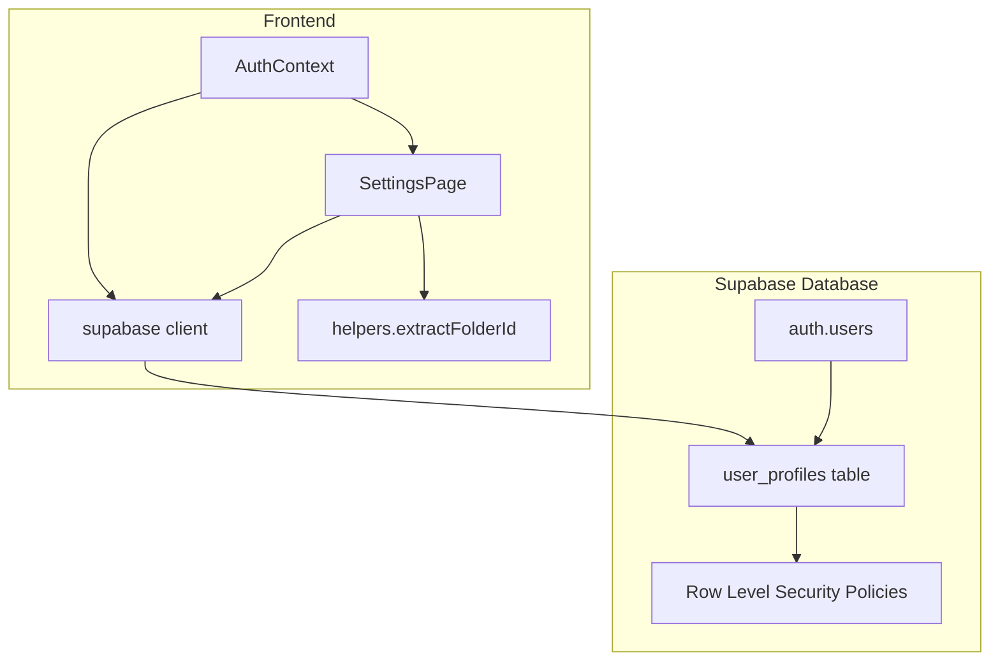
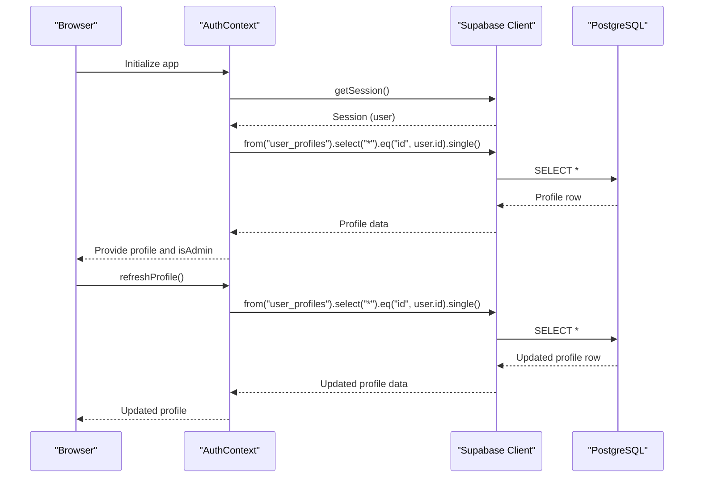
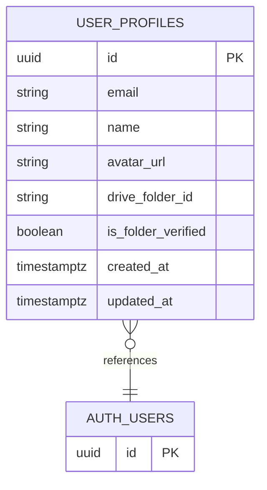
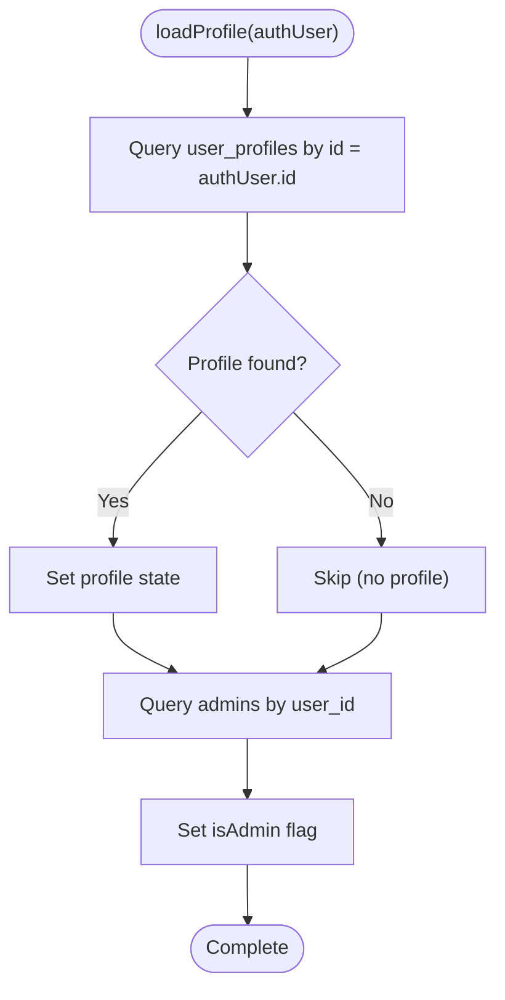
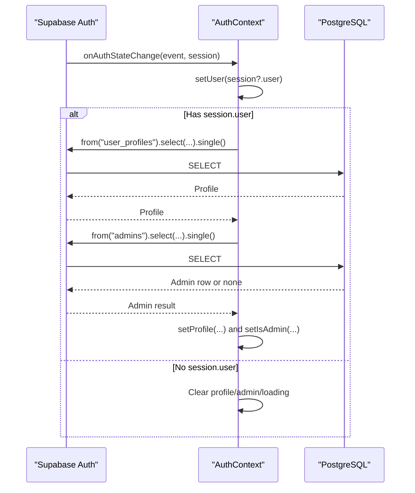
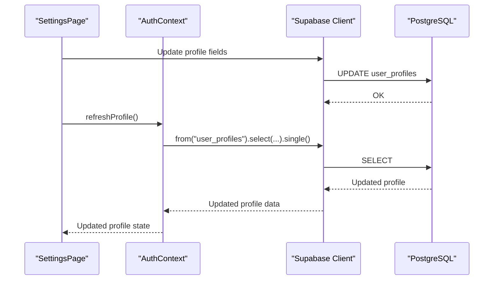
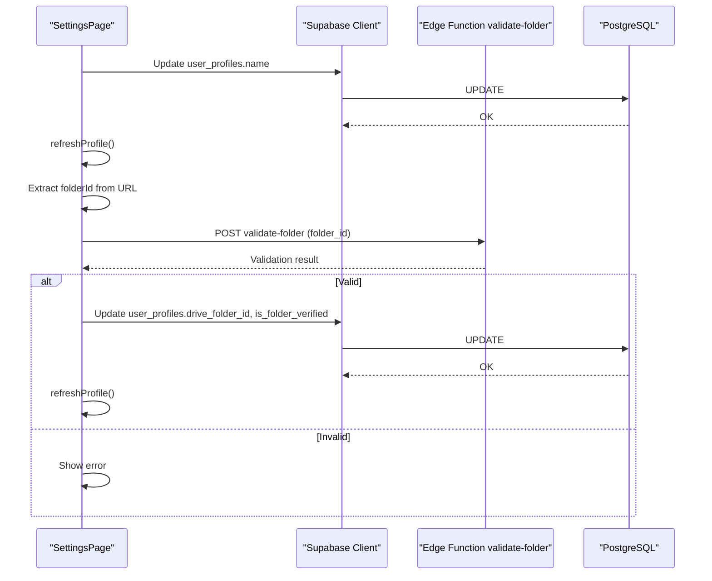
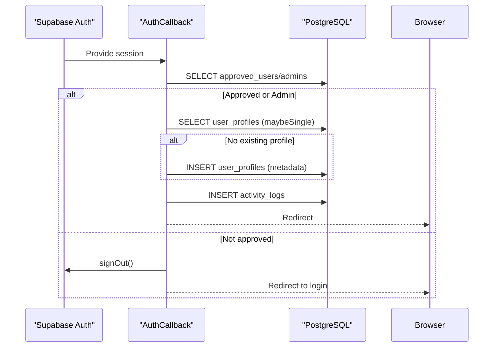
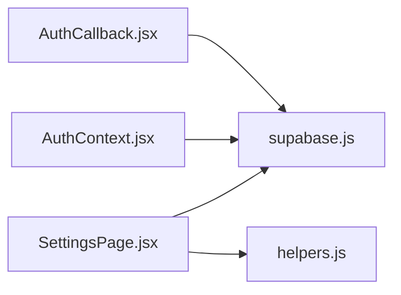

# User Profiles and Data

<cite>
**Referenced Files in This Document**
- [001_initial_schema.sql](file://supabase/migrations/001_initial_schema.sql)
- [AuthContext.jsx](file://web/src/contexts/AuthContext.jsx)
- [supabase.js](file://web/src/services/supabase.js)
- [SettingsPage.jsx](file://web/src/pages/SettingsPage.jsx)
- [helpers.js](file://web/src/utils/helpers.js)
- [AuthCallback.jsx](file://web/src/pages/AuthCallback.jsx)
</cite>

## Table of Contents
1. [Introduction](#introduction)
2. [Project Structure](#project-structure)
3. [Core Components](#core-components)
4. [Architecture Overview](#architecture-overview)
5. [Detailed Component Analysis](#detailed-component-analysis)
6. [Dependency Analysis](#dependency-analysis)
7. [Performance Considerations](#performance-considerations)
8. [Troubleshooting Guide](#troubleshooting-guide)
9. [Conclusion](#conclusion)

## Introduction
This document explains the user profile management system and data model used by the application. It covers the user_profiles table schema, how profiles are loaded and synchronized with authentication, the loadProfile function implementation, profile refresh capabilities, and error handling strategies. It also provides examples of profile data access, user information display, and profile update workflows, along with validation, privacy, and data consistency considerations.

## Project Structure
The user profile system spans the Supabase database schema and the React frontend:
- Database schema defines the user_profiles table and related policies.
- Frontend authentication context loads and refreshes the user profile.
- Settings page enables profile updates and Google Drive folder verification.
- Helper utilities support profile-related operations.

**Diagram sources**
- [001_initial_schema.sql:41-51](file://supabase/migrations/001_initial_schema.sql#L41-L51)
- [001_initial_schema.sql:129-151](file://supabase/migrations/001_initial_schema.sql#L129-L151)
- [AuthContext.jsx:40-64](file://web/src/contexts/AuthContext.jsx#L40-L64)
- [SettingsPage.jsx:24-40](file://web/src/pages/SettingsPage.jsx#L24-L40)
- [helpers.js:36-46](file://web/src/utils/helpers.js#L36-L46)
- [supabase.js:1-7](file://web/src/services/supabase.js#L1-L7)

**Section sources**
- [001_initial_schema.sql:41-51](file://supabase/migrations/001_initial_schema.sql#L41-L51)
- [AuthContext.jsx:40-64](file://web/src/contexts/AuthContext.jsx#L40-L64)
- [SettingsPage.jsx:24-40](file://web/src/pages/SettingsPage.jsx#L24-L40)
- [helpers.js:36-46](file://web/src/utils/helpers.js#L36-L46)
- [supabase.js:1-7](file://web/src/services/supabase.js#L1-L7)

## Core Components
- user_profiles table: Stores per-user metadata linked to auth.users via primary key and foreign key constraints.
- AuthContext: Loads and refreshes the user profile, tracks admin status, and exposes a refreshProfile function.
- SettingsPage: Provides profile editing and Google Drive folder verification/update flows.
- Helpers: Extracts Google Drive folder IDs from URLs for validation and connection.
- Supabase client: Centralized client initialization for database and auth operations.

**Section sources**
- [001_initial_schema.sql:41-51](file://supabase/migrations/001_initial_schema.sql#L41-L51)
- [AuthContext.jsx:40-64](file://web/src/contexts/AuthContext.jsx#L40-L64)
- [SettingsPage.jsx:24-40](file://web/src/pages/SettingsPage.jsx#L24-L40)
- [helpers.js:36-46](file://web/src/utils/helpers.js#L36-L46)
- [supabase.js:1-7](file://web/src/services/supabase.js#L1-L7)

## Architecture Overview
The profile lifecycle integrates authentication and database layers:
- On app startup and auth state changes, the context loads the profile from user_profiles.
- The Settings page allows updating profile fields and verifying/connecting a Google Drive folder.
- After updates, the context refreshes the profile to reflect database changes.

**Diagram sources**
- [AuthContext.jsx:12-38](file://web/src/contexts/AuthContext.jsx#L12-L38)
- [AuthContext.jsx:40-64](file://web/src/contexts/AuthContext.jsx#L40-L64)
- [001_initial_schema.sql:41-51](file://supabase/migrations/001_initial_schema.sql#L41-L51)

## Detailed Component Analysis

### User Profiles Table Schema
The user_profiles table defines the core profile data model:
- Primary key: id UUID referencing auth.users(id) with ON DELETE CASCADE.
- Fields: email (not null), name (default empty string), avatar_url (default empty string), drive_folder_id (nullable text), is_folder_verified (boolean default false), timestamps created_at and updated_at.
- Indexes: email for fast lookups.
- Row Level Security: Enables per-user access policies.

**Diagram sources**
- [001_initial_schema.sql:41-51](file://supabase/migrations/001_initial_schema.sql#L41-L51)
- [001_initial_schema.sql:129-151](file://supabase/migrations/001_initial_schema.sql#L129-L151)

**Section sources**
- [001_initial_schema.sql:41-51](file://supabase/migrations/001_initial_schema.sql#L41-L51)
- [001_initial_schema.sql:129-151](file://supabase/migrations/001_initial_schema.sql#L129-L151)

### Profile Loading Mechanism
The AuthContext.loadProfile function performs the following steps:
- Queries user_profiles by id equal to the authenticated user’s id.
- Sets the returned profile data into context state.
- Checks admin status by querying the admins table for a matching user_id.
- Handles errors by logging and ensures loading completes.

**Diagram sources**
- [AuthContext.jsx:40-64](file://web/src/contexts/AuthContext.jsx#L40-L64)

**Section sources**
- [AuthContext.jsx:40-64](file://web/src/contexts/AuthContext.jsx#L40-L64)

### Data Synchronization with Authentication
- Session-driven loading: The context checks the active session on mount and on auth state changes, ensuring the profile reflects the current authenticated user.
- Admin detection: Admin status is derived from the presence of a record in the admins table for the current user.
- Cleanup: On logout, profile and admin state are cleared.

**Diagram sources**
- [AuthContext.jsx:12-38](file://web/src/contexts/AuthContext.jsx#L12-L38)
- [AuthContext.jsx:40-64](file://web/src/contexts/AuthContext.jsx#L40-L64)

**Section sources**
- [AuthContext.jsx:12-38](file://web/src/contexts/AuthContext.jsx#L12-L38)
- [AuthContext.jsx:40-64](file://web/src/contexts/AuthContext.jsx#L40-L64)

### Profile Refresh Capabilities
- Exposed via refreshProfile(): Re-invokes loadProfile with the current user.
- Used after profile updates to ensure UI reflects latest database state.

**Diagram sources**
- [SettingsPage.jsx:24-40](file://web/src/pages/SettingsPage.jsx#L24-L40)
- [AuthContext.jsx:84-88](file://web/src/contexts/AuthContext.jsx#L84-L88)

**Section sources**
- [SettingsPage.jsx:24-40](file://web/src/pages/SettingsPage.jsx#L24-L40)
- [AuthContext.jsx:84-88](file://web/src/contexts/AuthContext.jsx#L84-L88)

### Profile Update Workflows
- Display name update:
  - The Settings page reads profile.name and allows editing.
  - On save, it updates user_profiles.name for the authenticated user.
  - On success, it calls refreshProfile to synchronize state.
- Google Drive folder verification and save:
  - Validates a Google Drive folder URL and extracts the folder ID.
  - Calls a Supabase Edge Function to validate folder accessibility.
  - On success, updates user_profiles.drive_folder_id and is_folder_verified.
  - Calls refreshProfile to reflect changes.

**Diagram sources**
- [SettingsPage.jsx:24-40](file://web/src/pages/SettingsPage.jsx#L24-L40)
- [SettingsPage.jsx:42-93](file://web/src/pages/SettingsPage.jsx#L42-L93)
- [helpers.js:36-46](file://web/src/utils/helpers.js#L36-L46)

**Section sources**
- [SettingsPage.jsx:24-40](file://web/src/pages/SettingsPage.jsx#L24-L40)
- [SettingsPage.jsx:42-93](file://web/src/pages/SettingsPage.jsx#L42-L93)
- [helpers.js:36-46](file://web/src/utils/helpers.js#L36-L46)

### Data Validation and Privacy Considerations
- Validation:
  - URL parsing for Google Drive folder links uses a dedicated helper to extract the folder ID.
  - Updates to user_profiles enforce the user’s ownership via Row Level Security policies.
- Privacy:
  - RLS policies restrict user_profiles access to the owning user for select/update/insert.
  - Email and profile data are stored in user_profiles; ensure sensitive handling in UI and avoid exposing unnecessary fields.
- Data consistency:
  - The updated_at trigger automatically updates timestamps on user_profiles rows during updates.
  - The refreshProfile function ensures UI state remains consistent with database changes.

**Section sources**
- [helpers.js:36-46](file://web/src/utils/helpers.js#L36-L46)
- [001_initial_schema.sql:129-151](file://supabase/migrations/001_initial_schema.sql#L129-L151)
- [001_initial_schema.sql:270-283](file://supabase/migrations/001_initial_schema.sql#L270-L283)
- [AuthContext.jsx:84-88](file://web/src/contexts/AuthContext.jsx#L84-L88)

### Authentication Callback and Initial Profile Creation
On successful Google OAuth callback:
- The system verifies approval or admin status.
- If a profile does not exist for the user, it inserts a new user_profiles row populated from auth.user metadata.
- Activity is logged and the user is redirected appropriately.

**Diagram sources**
- [AuthCallback.jsx:9-73](file://web/src/pages/AuthCallback.jsx#L9-L73)
- [001_initial_schema.sql:41-51](file://supabase/migrations/001_initial_schema.sql#L41-L51)

**Section sources**
- [AuthCallback.jsx:9-73](file://web/src/pages/AuthCallback.jsx#L9-L73)
- [001_initial_schema.sql:41-51](file://supabase/migrations/001_initial_schema.sql#L41-L51)

## Dependency Analysis
- AuthContext depends on the Supabase client for database queries and auth state listening.
- SettingsPage depends on AuthContext for profile data and refreshProfile, and on helpers for URL parsing.
- Supabase client initialization is centralized and injected into both modules.

**Diagram sources**
- [AuthContext.jsx:1-3](file://web/src/contexts/AuthContext.jsx#L1-L3)
- [SettingsPage.jsx:1-8](file://web/src/pages/SettingsPage.jsx#L1-L8)
- [supabase.js:1-7](file://web/src/services/supabase.js#L1-L7)
- [helpers.js:1-52](file://web/src/utils/helpers.js#L1-L52)

**Section sources**
- [AuthContext.jsx:1-3](file://web/src/contexts/AuthContext.jsx#L1-L3)
- [SettingsPage.jsx:1-8](file://web/src/pages/SettingsPage.jsx#L1-L8)
- [supabase.js:1-7](file://web/src/services/supabase.js#L1-L7)
- [helpers.js:1-52](file://web/src/utils/helpers.js#L1-L52)

## Performance Considerations
- Minimize redundant profile queries: Use refreshProfile only after explicit updates.
- Batch UI updates: Group profile changes to reduce re-renders.
- Network efficiency: Prefer single-row selectors (single()) for profile reads.
- Database triggers: The updated_at trigger avoids manual timestamp updates and keeps records consistent.

## Troubleshooting Guide
Common issues and resolutions:
- Profile not loading:
  - Verify the user is authenticated and session exists.
  - Confirm user_profiles row exists for the user id.
- Admin status not detected:
  - Ensure a corresponding record exists in the admins table for the user id.
- Update failures:
  - Check for RLS policy violations (must be the profile owner).
  - Inspect network errors and server responses from Supabase.
- Drive folder validation errors:
  - Ensure the Google Drive folder link is publicly accessible.
  - Confirm the extracted folder ID is valid.

**Section sources**
- [AuthContext.jsx:40-64](file://web/src/contexts/AuthContext.jsx#L40-L64)
- [SettingsPage.jsx:42-93](file://web/src/pages/SettingsPage.jsx#L42-L93)
- [001_initial_schema.sql:129-151](file://supabase/migrations/001_initial_schema.sql#L129-L151)

## Conclusion
The user profile system integrates Supabase authentication and database layers with a clean React context. The user_profiles table provides essential user metadata, while Row Level Security ensures data privacy. The AuthContext manages profile loading and refresh, and the Settings page supports profile updates and Google Drive integration. Consistent use of refreshProfile and robust validation maintains data accuracy and user experience.