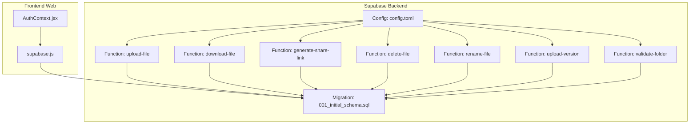
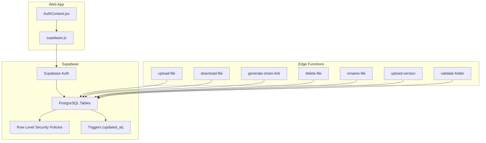
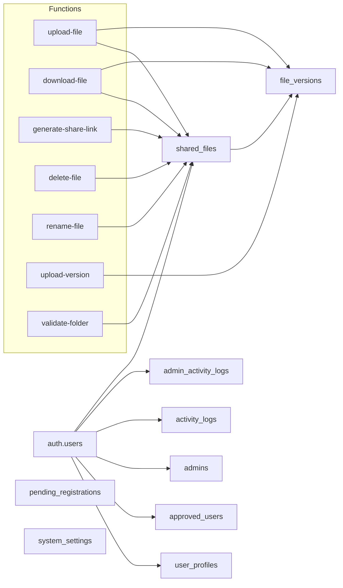

# Database Design

<cite>
**Referenced Files in This Document**
- [001_initial_schema.sql](file://supabase/migrations/001_initial_schema.sql)
- [config.toml](file://supabase/config.toml)
- [upload-file/index.ts](file://supabase/functions/upload-file/index.ts)
- [download-file/index.ts](file://supabase/functions/download-file/index.ts)
- [generate-share-link/index.ts](file://supabase/functions/generate-share-link/index.ts)
- [delete-file/index.ts](file://supabase/functions/delete-file/index.ts)
- [rename-file/index.ts](file://supabase/functions/rename-file/index.ts)
- [upload-version/index.ts](file://supabase/functions/upload-version/index.ts)
- [validate-folder/index.ts](file://supabase/functions/validate-folder/index.ts)
- [AuthContext.jsx](file://web/src/contexts/AuthContext.jsx)
- [supabase.js](file://web/src/services/supabase.js)
</cite>

## Table of Contents
1. [Introduction](#introduction)
2. [Project Structure](#project-structure)
3. [Core Components](#core-components)
4. [Architecture Overview](#architecture-overview)
5. [Detailed Component Analysis](#detailed-component-analysis)
6. [Dependency Analysis](#dependency-analysis)
7. [Performance Considerations](#performance-considerations)
8. [Troubleshooting Guide](#troubleshooting-guide)
9. [Conclusion](#conclusion)
10. [Appendices](#appendices)

## Introduction
This document provides comprehensive database design documentation for the Neo Files Transfer platform. It covers the relational schema, entity relationships, Row Level Security (RLS) policies, access control mechanisms, data access patterns, and operational considerations. The schema centers around users, files, versions, shares, and activity logs, with Supabase-managed authentication and serverless function integrations for file operations.

## Project Structure
The database design is defined in a single migration script and enforced by Supabase’s RLS policies. Frontend authentication integrates with Supabase, while serverless functions handle file uploads, downloads, sharing, and administrative tasks.



**Diagram sources**
- [001_initial_schema.sql:1-289](file://supabase/migrations/001_initial_schema.sql#L1-L289)
- [config.toml:1-21](file://supabase/config.toml#L1-L21)
- [upload-file/index.ts:1-152](file://supabase/functions/upload-file/index.ts#L1-L152)
- [download-file/index.ts:1-131](file://supabase/functions/download-file/index.ts#L1-L131)
- [generate-share-link/index.ts:1-55](file://supabase/functions/generate-share-link/index.ts#L1-L55)
- [delete-file/index.ts:1-72](file://supabase/functions/delete-file/index.ts#L1-L72)
- [rename-file/index.ts:1-74](file://supabase/functions/rename-file/index.ts#L1-L74)
- [upload-version/index.ts:1-130](file://supabase/functions/upload-version/index.ts#L1-L130)
- [validate-folder/index.ts:1-87](file://supabase/functions/validate-folder/index.ts#L1-L87)
- [AuthContext.jsx:1-112](file://web/src/contexts/AuthContext.jsx#L1-L112)
- [supabase.js:1-7](file://web/src/services/supabase.js#L1-L7)

**Section sources**
- [001_initial_schema.sql:1-289](file://supabase/migrations/001_initial_schema.sql#L1-L289)
- [config.toml:1-21](file://supabase/config.toml#L1-L21)
- [AuthContext.jsx:1-112](file://web/src/contexts/AuthContext.jsx#L1-L112)
- [supabase.js:1-7](file://web/src/services/supabase.js#L1-L7)

## Core Components
This section documents the core database entities, their fields, constraints, indexes, and relationships.

- Users and Profiles
  - Table: user_profiles
  - Primary Key: id (references auth.users)
  - Fields: email, name, avatar_url, drive_folder_id, is_folder_verified, created_at, updated_at
  - Indexes: idx_user_profiles_email
  - Notes: RLS policy allows users to manage their own profile; updated_at trigger auto-updates on updates

- Approved Users
  - Table: approved_users
  - Primary Key: id
  - Fields: email (unique), approved_by (references auth.users), approved_at
  - Indexes: idx_approved_users_email

- Admins
  - Table: admins
  - Primary Key: id
  - Fields: user_id (unique, references auth.users), email, role (check constraint: super_admin, admin), created_at
  - Indexes: idx_admins_user_id, idx_admins_email

- Pending Registrations
  - Table: pending_registrations
  - Primary Key: id
  - Fields: name, phone, email, status (check constraint: pending, approved, rejected), submitted_at
  - Indexes: idx_pending_registrations_email, idx_pending_registrations_status

- Shared Files
  - Table: shared_files
  - Primary Key: id
  - Fields: user_id (references auth.users), google_drive_file_id, file_name, file_size, mime_type, current_version_num, unique_share_hash (unique), sharing_status (check constraint: public, private), created_at
  - Indexes: idx_shared_files_user_id, idx_shared_files_share_hash, idx_shared_files_google_drive_file_id

- File Versions
  - Table: file_versions
  - Primary Key: id
  - Fields: file_id (references shared_files), google_drive_file_id, version_number, uploaded_at
  - Indexes: idx_file_versions_file_id

- Activity Logs
  - Table: activity_logs
  - Primary Key: id
  - Fields: user_id (references auth.users), action, details, created_at
  - Indexes: idx_activity_logs_user_id, idx_activity_logs_action

- Admin Activity Logs
  - Table: admin_activity_logs
  - Primary Key: id
  - Fields: admin_id (references auth.users), action, details, created_at
  - Indexes: idx_admin_activity_logs_admin_id

- System Settings
  - Table: system_settings
  - Primary Key: id
  - Fields: key (unique), value (JSONB), updated_at
  - Default Values: maintenance_mode=false, downloads_enabled=true, sharing_enabled=true, allowed_file_types=[pdf,jpg,png,zip,docx,xlsx,pptx,mp4], max_upload_size=104857600
  - Indexes: none (unique key on key)

**Section sources**
- [001_initial_schema.sql:7-122](file://supabase/migrations/001_initial_schema.sql#L7-L122)

## Architecture Overview
The system architecture couples Supabase’s Postgres backend with Supabase Auth and Edge Functions. Authentication is handled by Supabase Auth, while serverless functions perform Google Drive operations and enforce additional validations. RLS policies govern row-level access across all tables.



**Diagram sources**
- [001_initial_schema.sql:129-288](file://supabase/migrations/001_initial_schema.sql#L129-L288)
- [upload-file/index.ts:1-152](file://supabase/functions/upload-file/index.ts#L1-L152)
- [download-file/index.ts:1-131](file://supabase/functions/download-file/index.ts#L1-L131)
- [generate-share-link/index.ts:1-55](file://supabase/functions/generate-share-link/index.ts#L1-L55)
- [delete-file/index.ts:1-72](file://supabase/functions/delete-file/index.ts#L1-L72)
- [rename-file/index.ts:1-74](file://supabase/functions/rename-file/index.ts#L1-L74)
- [upload-version/index.ts:1-130](file://supabase/functions/upload-version/index.ts#L1-L130)
- [validate-folder/index.ts:1-87](file://supabase/functions/validate-folder/index.ts#L1-L87)
- [AuthContext.jsx:1-112](file://web/src/contexts/AuthContext.jsx#L1-L112)
- [supabase.js:1-7](file://web/src/services/supabase.js#L1-L7)

## Detailed Component Analysis

### Entity Relationship Model
The following ER diagram captures primary/foreign keys and relationships among entities.

```mermaid
erDiagram
AUTH_USERS {
uuid id PK
}
USER_PROFILES {
uuid id PK
text email
text name
text avatar_url
text drive_folder_id
boolean is_folder_verified
timestamptz created_at
timestamptz updated_at
}
APPROVED_USERS {
uuid id PK
text email UK
uuid approved_by FK
timestamptz approved_at
}
ADMINS {
uuid id PK
uuid user_id UK FK
text email
text role
timestamptz created_at
}
PENDING_REGISTRATIONS {
uuid id PK
text name
text phone
text email
text status
timestamptz submitted_at
}
SHARED_FILES {
uuid id PK
uuid user_id FK
text google_drive_file_id
text file_name
bigint file_size
text mime_type
integer current_version_num
text unique_share_hash UK
text sharing_status
timestamptz created_at
}
FILE_VERSIONS {
uuid id PK
uuid file_id FK
text google_drive_file_id
integer version_number
timestamptz uploaded_at
}
ACTIVITY_LOGS {
uuid id PK
uuid user_id FK
text action
text details
timestamptz created_at
}
ADMIN_ACTIVITY_LOGS {
uuid id PK
uuid admin_id FK
text action
text details
timestamptz created_at
}
SYSTEM_SETTINGS {
uuid id PK
text key UK
jsonb value
timestamptz updated_at
}
AUTH_USERS ||--o| USER_PROFILES : "owns"
AUTH_USERS ||--o| APPROVED_USERS : "approved_by"
AUTH_USERS ||--o| ADMINS : "user_id"
AUTH_USERS ||--o| ACTIVITY_LOGS : "user_id"
AUTH_USERS ||--o| ADMIN_ACTIVITY_LOGS : "admin_id"
AUTH_USERS ||--o| SHARED_FILES : "user_id"
SHARED_FILES ||--o{ FILE_VERSIONS : "has_many"
```

**Diagram sources**
- [001_initial_schema.sql:7-122](file://supabase/migrations/001_initial_schema.sql#L7-L122)

**Section sources**
- [001_initial_schema.sql:7-122](file://supabase/migrations/001_initial_schema.sql#L7-L122)

### Row Level Security (RLS) Policies
RLS is enabled on all tables and defines fine-grained access controls:

- user_profiles
  - Select own profile: auth.uid() = id
  - Update own profile: auth.uid() = id
  - Insert own profile: auth.uid() = id

- shared_files
  - Select own files: auth.uid() = user_id
  - Insert own files: auth.uid() = user_id
  - Update own files: auth.uid() = user_id
  - Delete own files: auth.uid() = user_id
  - Public select by share hash: true (for download flow)

- file_versions
  - Select versions for own files: EXISTS(SELECT 1 FROM shared_files WHERE shared_files.id = file_versions.file_id AND shared_files.user_id = auth.uid())
  - Insert versions for own files: same condition
  - Delete versions for own files: same condition

- activity_logs
  - Select own logs: auth.uid() = user_id
  - Insert own logs: auth.uid() = user_id

- pending_registrations
  - Insert: true (public)
  - Select/Update/Delete: auth.role() = 'authenticated'

- approved_users
  - Select: auth.role() = 'authenticated'
  - Insert: auth.role() = 'authenticated'

- admins
  - Select: auth.role() = 'authenticated'

- admin_activity_logs
  - Insert: auth.role() = 'authenticated'
  - Select: auth.role() = 'authenticated'

- system_settings
  - Select: true (public)
  - Update/Insert: auth.role() = 'authenticated'

**Section sources**
- [001_initial_schema.sql:129-267](file://supabase/migrations/001_initial_schema.sql#L129-L267)

### Access Control Mechanisms
- JWT Verification: Functions configured with verify_jwt=true require authenticated sessions.
- Admin Controls: Admins can manage users, approvals, and system settings; admin actions are logged.
- Public Sharing: Share links bypass user ownership checks for downloads; sharing_status determines visibility.
- Session-Based Operations: Functions use the user’s provider_token to interact with Google Drive.

**Section sources**
- [config.toml:1-21](file://supabase/config.toml#L1-L21)
- [download-file/index.ts:23-34](file://supabase/functions/download-file/index.ts#L23-L34)
- [upload-file/index.ts:35-44](file://supabase/functions/upload-file/index.ts#L35-L44)
- [generate-share-link/index.ts:20-29](file://supabase/functions/generate-share-link/index.ts#L20-L29)

### Data Access Patterns and Query Optimization
Common access patterns observed in the codebase:

- User Profile Management
  - Retrieve profile by id: SELECT * FROM user_profiles WHERE id = ?
  - Update profile triggers updated_at timestamp automatically

- File Operations
  - Upload: Create shared_files record and upload to Google Drive; store google_drive_file_id
  - Versioning: Insert file_versions entries for each new version
  - Download: Resolve share hash to shared_files; fetch latest version; redirect to Google Drive URL
  - Rename/Delete: Use Google Drive API with user’s provider_token

- Administrative Controls
  - Approve/reject pending registrations
  - Toggle system settings (maintenance_mode, downloads_enabled, sharing_enabled)
  - Audit admin actions via admin_activity_logs

Optimization Strategies:
- Use indexes on frequently queried columns (email, status, share_hash, file_id).
- Prefer selective queries with equality filters (e.g., unique_share_hash) to leverage indexes.
- Minimize cross-table joins in hot paths; rely on share_hash for public downloads.
- Batch admin operations where possible to reduce function invocations.

**Section sources**
- [001_initial_schema.sql:69-94](file://supabase/migrations/001_initial_schema.sql#L69-L94)
- [download-file/index.ts:29-81](file://supabase/functions/download-file/index.ts#L29-L81)
- [upload-file/index.ts:10-22](file://supabase/functions/upload-file/index.ts#L10-L22)
- [upload-version/index.ts:9-9](file://supabase/functions/upload-version/index.ts#L9-L9)

### Data Lifecycle Management
- Retention and Cleanup
  - No explicit retention policies are defined in the schema.
  - Consider adding TTL-based cleanup jobs for old versions or unused records if needed.
- Backup Procedures
  - Supabase provides automated backups; ensure regular snapshots and point-in-time recovery are enabled.
- Maintenance
  - Monitor system_settings for operational flags (maintenance_mode, downloads_enabled).
  - Use admin_activity_logs for auditing administrative changes.

[No sources needed since this section provides general guidance]

### Security and Compliance Considerations
- Authentication and Authorization
  - Supabase Auth handles OAuth with Google; functions require JWT verification.
  - RLS ensures data isolation; admins have elevated privileges with audit logging.
- Data Privacy
  - Sensitive fields (emails, tokens) are not stored in the database; provider_token is used transiently.
  - Share links are randomized; private files cannot be downloaded.
- Compliance
  - Implement data subject requests (access, erasure) via admin controls and logs.
  - Maintain audit trails in activity_logs and admin_activity_logs for regulatory compliance.

**Section sources**
- [config.toml:1-21](file://supabase/config.toml#L1-L21)
- [001_initial_schema.sql:129-267](file://supabase/migrations/001_initial_schema.sql#L129-L267)
- [download-file/index.ts:46-55](file://supabase/functions/download-file/index.ts#L46-L55)

## Dependency Analysis
The following diagram shows dependencies between database tables and how functions interact with them.



**Diagram sources**
- [001_initial_schema.sql:7-122](file://supabase/migrations/001_initial_schema.sql#L7-L122)
- [upload-file/index.ts:1-152](file://supabase/functions/upload-file/index.ts#L1-L152)
- [download-file/index.ts:1-131](file://supabase/functions/download-file/index.ts#L1-L131)
- [generate-share-link/index.ts:1-55](file://supabase/functions/generate-share-link/index.ts#L1-L55)
- [delete-file/index.ts:1-72](file://supabase/functions/delete-file/index.ts#L1-L72)
- [rename-file/index.ts:1-74](file://supabase/functions/rename-file/index.ts#L1-L74)
- [upload-version/index.ts:1-130](file://supabase/functions/upload-version/index.ts#L1-L130)
- [validate-folder/index.ts:1-87](file://supabase/functions/validate-folder/index.ts#L1-L87)

**Section sources**
- [001_initial_schema.sql:7-122](file://supabase/migrations/001_initial_schema.sql#L7-L122)

## Performance Considerations
- Indexing Strategy
  - Ensure indexes exist on shared_files(unique_share_hash), shared_files(user_id), file_versions(file_id), activity_logs(user_id), and admins(user_id).
- Query Patterns
  - Use equality filters on indexed columns (e.g., unique_share_hash) for fast lookups.
  - Avoid N+1 queries; batch operations where feasible.
- Function Execution
  - Functions should minimize external API calls; cache results when appropriate.
  - Use service_role for internal reads/writes only when necessary (e.g., download function).
- Storage Offloading
  - Large binary content is stored in Google Drive; database stores metadata and references.

[No sources needed since this section provides general guidance]

## Troubleshooting Guide
Common issues and resolutions:

- Authentication Failures
  - Symptom: Functions return “Not authenticated”
  - Resolution: Ensure Authorization header is present and JWT verified in config.toml

- Download Failures
  - Symptom: 404 or 403 errors during download
  - Resolution: Verify sharing_status is public and system_setting downloads_enabled is true; confirm share_hash correctness

- Upload Size Limits
  - Symptom: Upload rejected due to size
  - Resolution: Respect MAX_FILE_SIZE (100MB) enforced in functions

- Folder Validation
  - Symptom: “Folder not found or not accessible”
  - Resolution: Confirm folder_id is a Google Drive folder and user has access

- RLS Access Denied
  - Symptom: SELECT/UPDATE/DELETE denied
  - Resolution: Verify user owns the record or has appropriate admin role

**Section sources**
- [config.toml:1-21](file://supabase/config.toml#L1-L21)
- [download-file/index.ts:36-72](file://supabase/functions/download-file/index.ts#L36-L72)
- [upload-file/index.ts:60-68](file://supabase/functions/upload-file/index.ts#L60-L68)
- [validate-folder/index.ts:51-61](file://supabase/functions/validate-folder/index.ts#L51-L61)
- [001_initial_schema.sql:140-267](file://supabase/migrations/001_initial_schema.sql#L140-L267)

## Conclusion
The Neo Files Transfer database schema establishes a secure, scalable foundation for managing user profiles, shared files, versions, and activity logs. Supabase’s RLS and JWT-verified functions provide robust access control and integration with Google Drive. Proper indexing, query optimization, and administrative oversight ensure reliable performance and compliance.

[No sources needed since this section summarizes without analyzing specific files]

## Appendices

### Sample Data Models
Representative rows for key entities:

- user_profiles
  - id: user UUID
  - email: user@example.com
  - name: ""
  - avatar_url: ""
  - drive_folder_id: "1a2b3c..."
  - is_folder_verified: false
  - created_at: timestamp
  - updated_at: timestamp

- shared_files
  - id: file UUID
  - user_id: user UUID
  - google_drive_file_id: "1x2y3z..."
  - file_name: "document.pdf"
  - file_size: 104857600
  - mime_type: "application/pdf"
  - current_version_num: 1
  - unique_share_hash: "abc123def456"
  - sharing_status: "public"
  - created_at: timestamp

- file_versions
  - id: version UUID
  - file_id: file UUID
  - google_drive_file_id: "4x5y6z..."
  - version_number: 2
  - uploaded_at: timestamp

- activity_logs
  - id: log UUID
  - user_id: user UUID
  - action: "logout"
  - details: "User logged out"
  - created_at: timestamp

- admin_activity_logs
  - id: admin log UUID
  - admin_id: user UUID
  - action: "admin_logout"
  - details: "Admin logged out"
  - created_at: timestamp

- system_settings
  - id: setting UUID
  - key: "downloads_enabled"
  - value: true
  - updated_at: timestamp

**Section sources**
- [001_initial_schema.sql:115-122](file://supabase/migrations/001_initial_schema.sql#L115-L122)