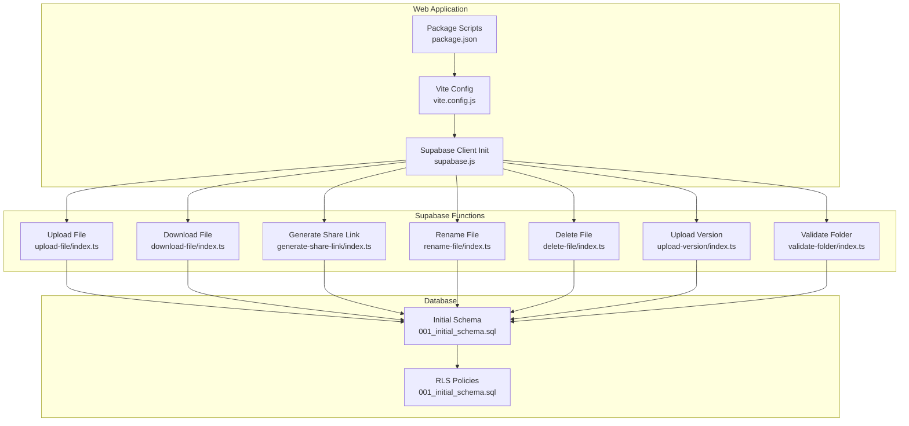
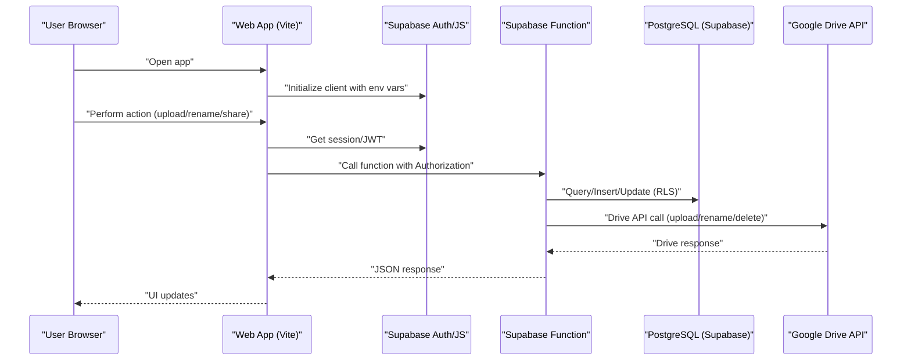
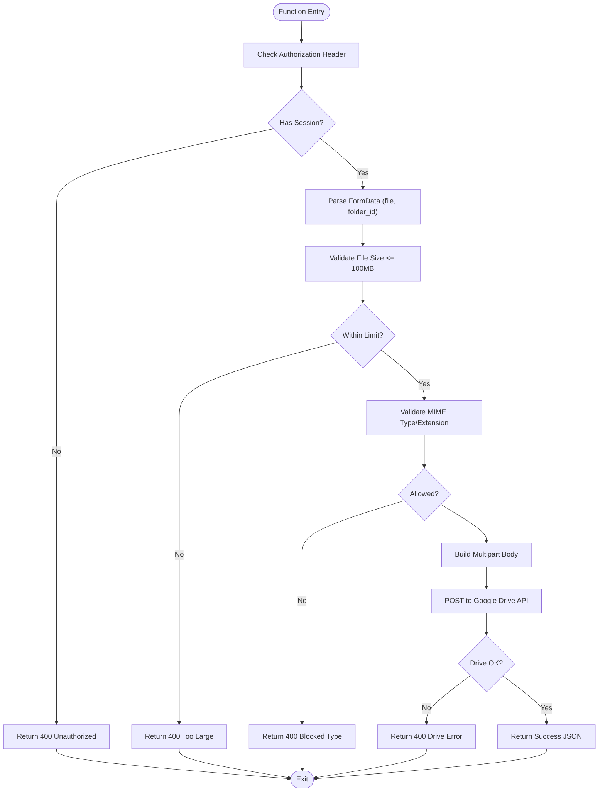
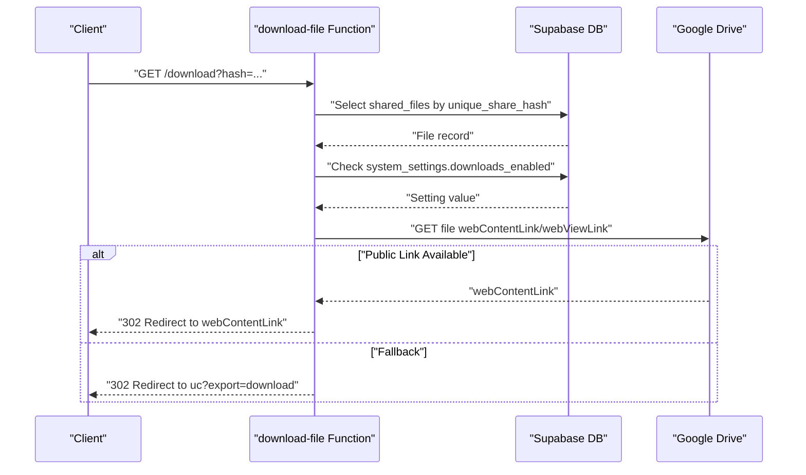
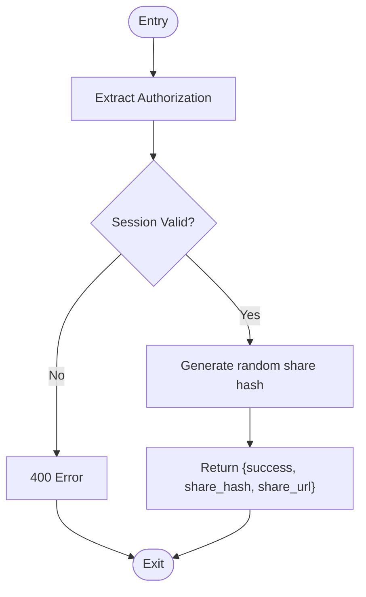
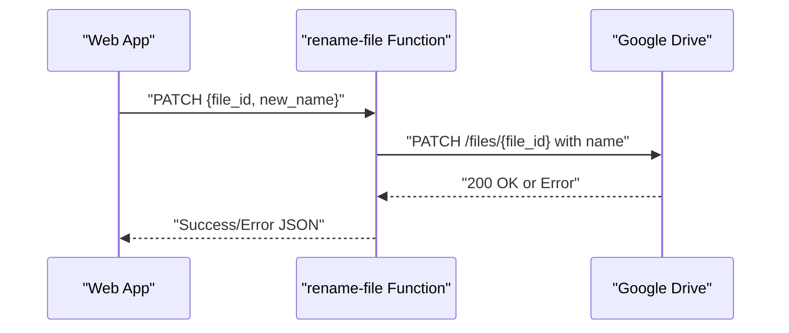
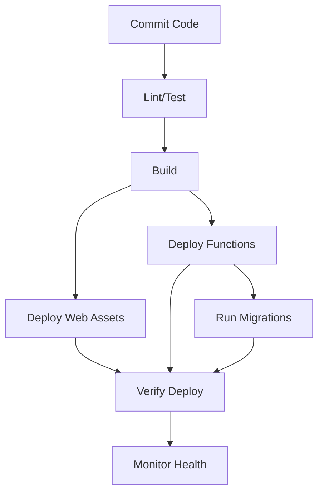

# Deployment & Production

<cite>
**Referenced Files in This Document**
- [config.toml](file://supabase/config.toml)
- [001_initial_schema.sql](file://supabase/migrations/001_initial_schema.sql)
- [package.json](file://web/package.json)
- [vite.config.js](file://web/vite.config.js)
- [supabase.js](file://web/src/services/supabase.js)
- [upload-file/index.ts](file://supabase/functions/upload-file/index.ts)
- [download-file/index.ts](file://supabase/functions/download-file/index.ts)
- [generate-share-link/index.ts](file://supabase/functions/generate-share-link/index.ts)
- [rename-file/index.ts](file://supabase/functions/rename-file/index.ts)
- [delete-file/index.ts](file://supabase/functions/delete-file/index.ts)
- [upload-version/index.ts](file://supabase/functions/upload-version/index.ts)
- [validate-folder/index.ts](file://supabase/functions/validate-folder/index.ts)
</cite>

## Table of Contents
1. [Introduction](#introduction)
2. [Project Structure](#project-structure)
3. [Core Components](#core-components)
4. [Architecture Overview](#architecture-overview)
5. [Detailed Component Analysis](#detailed-component-analysis)
6. [Environment Configuration](#environment-configuration)
7. [Build Process Optimization](#build-process-optimization)
8. [CI/CD Pipeline Setup](#cicd-pipeline-setup)
9. [Automated Testing Integration](#automated-testing-integration)
10. [Release Management Procedures](#release-management-procedures)
11. [Monitoring and Logging](#monitoring-and-logging)
12. [Performance Monitoring and Alerting](#performance-monitoring-and-alerting)
13. [Maintenance Procedures](#maintenance-procedures)
14. [Backup Strategies](#backup-strategies)
15. [Disaster Recovery Planning](#disaster-recovery-planning)
16. [Scaling Considerations](#scaling-considerations)
17. [Load Balancing](#load-balancing)
18. [Cost Optimization](#cost-optimization)
19. [Troubleshooting Guide](#troubleshooting-guide)
20. [Conclusion](#conclusion)

## Introduction
This document provides comprehensive deployment and production guidance for Neo Files Transfer. It covers environment configuration across development, staging, and production, build optimization, CI/CD pipeline setup, automated testing integration, release management, monitoring and logging, performance monitoring and alerting, maintenance and backups, disaster recovery, scaling, load balancing, cost optimization, and troubleshooting.

## Project Structure
Neo Files Transfer consists of:
- Frontend (React + Vite): Web application built with React and Vite, configured for local development and production builds.
- Backend (Supabase Functions): Edge functions written in TypeScript/Deno that integrate with Supabase Auth, database, and Google Drive APIs.
- Database (PostgreSQL via Supabase): Migrations and Row Level Security (RLS) policies for access control.

**Diagram sources**
- [vite.config.js:1-11](file://web/vite.config.js#L1-L11)
- [package.json:1-29](file://web/package.json#L1-L29)
- [supabase.js:1-7](file://web/src/services/supabase.js#L1-L7)
- [upload-file/index.ts:1-152](file://supabase/functions/upload-file/index.ts#L1-L152)
- [download-file/index.ts:1-131](file://supabase/functions/download-file/index.ts#L1-L131)
- [generate-share-link/index.ts:1-55](file://supabase/functions/generate-share-link/index.ts#L1-L55)
- [rename-file/index.ts:1-74](file://supabase/functions/rename-file/index.ts#L1-L74)
- [delete-file/index.ts:1-72](file://supabase/functions/delete-file/index.ts#L1-L72)
- [upload-version/index.ts:1-130](file://supabase/functions/upload-version/index.ts#L1-L130)
- [validate-folder/index.ts:1-87](file://supabase/functions/validate-folder/index.ts#L1-L87)
- [001_initial_schema.sql:1-289](file://supabase/migrations/001_initial_schema.sql#L1-L289)

**Section sources**
- [vite.config.js:1-11](file://web/vite.config.js#L1-L11)
- [package.json:1-29](file://web/package.json#L1-L29)
- [supabase.js:1-7](file://web/src/services/supabase.js#L1-L7)
- [001_initial_schema.sql:1-289](file://supabase/migrations/001_initial_schema.sql#L1-L289)

## Core Components
- Web application build and runtime:
  - Vite dev server configuration and production build scripts.
  - Supabase client initialization using environment variables for URL and anonymous key.
- Supabase Functions:
  - Authentication verification via JWT and Supabase session.
  - Google Drive integration for uploads, downloads, renames, deletes, and versioning.
  - CORS handling and standardized response/error formatting.
- Database:
  - Initial schema with tables for users, shared files, versions, logs, and system settings.
  - Row Level Security policies enabling fine-grained access control per user and role.

**Section sources**
- [vite.config.js:1-11](file://web/vite.config.js#L1-L11)
- [package.json:6-10](file://web/package.json#L6-L10)
- [supabase.js:3-6](file://web/src/services/supabase.js#L3-L6)
- [config.toml:1-21](file://supabase/config.toml#L1-L21)
- [001_initial_schema.sql:6-122](file://supabase/migrations/001_initial_schema.sql#L6-L122)

## Architecture Overview
The system follows a frontend-hosted architecture with Supabase Functions as serverless backend and PostgreSQL as storage. The frontend authenticates via Supabase Auth and interacts with functions for file operations and with the database for metadata and settings.

**Diagram sources**
- [supabase.js:3-6](file://web/src/services/supabase.js#L3-L6)
- [upload-file/index.ts:24-44](file://supabase/functions/upload-file/index.ts#L24-L44)
- [download-file/index.ts:14-44](file://supabase/functions/download-file/index.ts#L14-L44)
- [generate-share-link/index.ts:14-29](file://supabase/functions/generate-share-link/index.ts#L14-L29)
- [rename-file/index.ts:14-35](file://supabase/functions/rename-file/index.ts#L14-L35)
- [delete-file/index.ts:14-35](file://supabase/functions/delete-file/index.ts#L14-L35)
- [upload-version/index.ts:16-31](file://supabase/functions/upload-version/index.ts#L16-L31)
- [validate-folder/index.ts:14-37](file://supabase/functions/validate-folder/index.ts#L14-L37)
- [001_initial_schema.sql:129-266](file://supabase/migrations/001_initial_schema.sql#L129-L266)

## Detailed Component Analysis

### Upload File Function
- Validates authorization, extracts session, checks file size/type, and uploads to Google Drive via multipart/form-data.
- Returns structured success/error responses with CORS headers.

**Diagram sources**
- [upload-file/index.ts:24-151](file://supabase/functions/upload-file/index.ts#L24-L151)

**Section sources**
- [upload-file/index.ts:9-22](file://supabase/functions/upload-file/index.ts#L9-L22)
- [upload-file/index.ts:46-68](file://supabase/functions/upload-file/index.ts#L46-L68)
- [upload-file/index.ts:111-126](file://supabase/functions/upload-file/index.ts#L111-L126)

### Download File Function
- Resolves file by share hash, enforces sharing status and system settings, retrieves latest version, and redirects to Google Drive download URL.

**Diagram sources**
- [download-file/index.ts:15-118](file://supabase/functions/download-file/index.ts#L15-L118)

**Section sources**
- [download-file/index.ts:23-72](file://supabase/functions/download-file/index.ts#L23-L72)
- [download-file/index.ts:98-118](file://supabase/functions/download-file/index.ts#L98-L118)

### Generate Share Link Function
- Verifies JWT, generates a unique share hash, and returns a shareable URL.

**Diagram sources**
- [generate-share-link/index.ts:14-44](file://supabase/functions/generate-share-link/index.ts#L14-L44)

**Section sources**
- [generate-share-link/index.ts:31-38](file://supabase/functions/generate-share-link/index.ts#L31-L38)

### Rename/Delete File Functions
- Use PATCH/DELETE against Google Drive API with the authenticated user's provider token.

**Diagram sources**
- [rename-file/index.ts:39-55](file://supabase/functions/rename-file/index.ts#L39-L55)

**Section sources**
- [rename-file/index.ts:39-55](file://supabase/functions/rename-file/index.ts#L39-L55)
- [delete-file/index.ts:39-54](file://supabase/functions/delete-file/index.ts#L39-L54)

### Upload Version Function
- Similar to upload-file but handles versioned uploads to the same folder.

**Section sources**
- [upload-version/index.ts:46-49](file://supabase/functions/upload-version/index.ts#L46-L49)
- [upload-version/index.ts:89-104](file://supabase/functions/upload-version/index.ts#L89-L104)

### Validate Folder Function
- Confirms a Google Drive folder exists and is accessible using the user's token.

**Section sources**
- [validate-folder/index.ts:58-62](file://supabase/functions/validate-folder/index.ts#L58-L62)

## Environment Configuration
Configure the following environment variables for each target:

- Web application (frontend):
  - VITE_SUPABASE_URL: Supabase project URL
  - VITE_SUPABASE_ANON_KEY: Supabase anonymous API key

- Supabase Functions:
  - SUPABASE_URL: Supabase project URL
  - SUPABASE_ANON_KEY: Supabase anonymous API key
  - SUPABASE_SERVICE_ROLE_KEY: Supabase service role key (for admin queries)
  - GOOGLE_API_KEY: Google Drive API key (for public file access)
  - SUPABASE_JWT_SECRET: Supabase JWT signing secret (configured in Supabase)

- Database:
  - Supabase-managed Postgres with RLS enabled via migration policies.

- Supabase Function settings:
  - JWT verification toggled per function via config.

**Section sources**
- [supabase.js:3-6](file://web/src/services/supabase.js#L3-L6)
- [config.toml:1-21](file://supabase/config.toml#L1-L21)
- [001_initial_schema.sql:129-138](file://supabase/migrations/001_initial_schema.sql#L129-L138)

## Build Process Optimization
- Use Vite production build for optimized static assets and minimal bundle size.
- Configure environment-specific builds and asset hashing for cache busting.
- Enable code splitting and lazy loading for route components.
- Minimize third-party dependencies and audit bundle size regularly.

**Section sources**
- [package.json:6-10](file://web/package.json#L6-L10)
- [vite.config.js:4-10](file://web/vite.config.js#L4-L10)

## CI/CD Pipeline Setup
Recommended stages:
- Install dependencies: npm ci
- Lint and test: npm run test (configure jest or vitest)
- Build: npm run build
- Deploy frontend: deploy built artifacts to CDN/hosting provider
- Deploy Supabase functions: use Supabase CLI to push functions
- Apply migrations: run SQL migration via Supabase CLI or dashboard

[No sources needed since this diagram shows conceptual workflow, not actual code structure]

## Automated Testing Integration
- Unit tests for frontend utilities and small components.
- Integration tests for Supabase Functions using mock requests and assertions.
- End-to-end tests for critical flows (upload, download, share, rename, delete).
- Snapshot tests for UI components to prevent regressions.

[No sources needed since this section doesn't analyze specific source files]

## Release Management Procedures
- Tag releases in Git (semantic versioning).
- Promote builds from staging to production after QA approval.
- Rollback strategy: redeploy previous tag or revert function versions.
- Feature flags: gate new features behind system settings keys.

[No sources needed since this section doesn't analyze specific source files]

## Monitoring and Logging
- Frontend:
  - Console logging for errors and warnings.
  - Application performance monitoring (APM) for page load and interaction metrics.
- Backend:
  - Supabase Functions logs via platform logs.
  - Structured error responses from functions aid in log correlation.
- Database:
  - Supabase Insights for query performance and slow queries.
  - Audit logs for sensitive actions (uploads, deletions, admin actions).

**Section sources**
- [download-file/index.ts:120-129](file://supabase/functions/download-file/index.ts#L120-L129)
- [upload-file/index.ts:142-150](file://supabase/functions/upload-file/index.ts#L142-L150)

## Performance Monitoring and Alerting
- Metrics to track:
  - Function cold start and execution duration.
  - Google Drive API latency and quota usage.
  - Database query durations and row scans.
- Alerts:
  - High error rates (>5%) from functions.
  - Elevated download failures or missing share links.
  - Database query timeouts or slow queries.
- Tools: Supabase Insights, APM providers, and platform-native alerts.

[No sources needed since this section provides general guidance]

## Maintenance Procedures
- Regularly review and update Supabase Functions dependencies.
- Monitor and rotate secrets (Supabase keys, Google API key).
- Review RLS policies and indexes for performance.
- Archive old versions and clean up orphaned records periodically.

[No sources needed since this section doesn't analyze specific source files]

## Backup Strategies
- Supabase automatically backs up PostgreSQL; retain manual snapshots for compliance.
- Maintain offsite backups of Supabase project configuration and function code.
- Version control all infrastructure-as-code and configuration files.

[No sources needed since this section doesn't analyze specific source files]

## Disaster Recovery Planning
- Recovery steps:
  - Restore database from latest snapshot.
  - Re-deploy functions and apply migrations.
  - Recreate environment variables and secrets.
- Test DR plan quarterly with dry runs.

[No sources needed since this section doesn't analyze specific source files]

## Scaling Considerations
- Horizontal scaling:
  - Supabase Functions scale automatically; monitor concurrency limits.
  - Use CDN for static assets and reduce origin load.
- Vertical scaling:
  - Increase Supabase project resources if CPU/memory constrained.
- Database scaling:
  - Normalize queries, maintain proper indexes, and leverage RLS efficiently.

[No sources needed since this section provides general guidance]

## Load Balancing
- Use CDN and edge caching for static assets and download redirects.
- Distribute traffic across regions if supported by hosting provider.
- Avoid overloading single Supabase project; consider multi-project isolation for tenants.

[No sources needed since this section provides general guidance]

## Cost Optimization
- Optimize function memory and timeout settings.
- Reduce unnecessary Google Drive API calls; cache where appropriate.
- Minimize payload sizes and avoid redundant network hops.
- Right-size database resources and remove unused indexes.

[No sources needed since this section provides general guidance]

## Troubleshooting Guide

Common production issues and resolutions:
- Authentication failures:
  - Verify Authorization header presence and validity.
  - Confirm JWT verification settings per function.
- File upload errors:
  - Check file size limits and blocked extensions.
  - Inspect Google Drive API response and quotas.
- Download failures:
  - Ensure sharing status is public and downloads are enabled.
  - Validate share hash existence and latest version linkage.
- Rename/Delete failures:
  - Confirm user has ownership and provider token availability.
- Database access issues:
  - Review RLS policies and indexes.
  - Check system settings affecting functionality.

**Section sources**
- [upload-file/index.ts:30-44](file://supabase/functions/upload-file/index.ts#L30-L44)
- [download-file/index.ts:46-72](file://supabase/functions/download-file/index.ts#L46-L72)
- [generate-share-link/index.ts:16-29](file://supabase/functions/generate-share-link/index.ts#L16-L29)
- [rename-file/index.ts:32-35](file://supabase/functions/rename-file/index.ts#L32-L35)
- [delete-file/index.ts:32-35](file://supabase/functions/delete-file/index.ts#L32-L35)
- [001_initial_schema.sql:129-266](file://supabase/migrations/001_initial_schema.sql#L129-L266)

## Conclusion
This guide consolidates deployment, operations, and production best practices for Neo Files Transfer. By following environment segregation, CI/CD automation, robust monitoring, and disciplined maintenance, teams can operate a reliable, scalable, and secure file transfer platform.