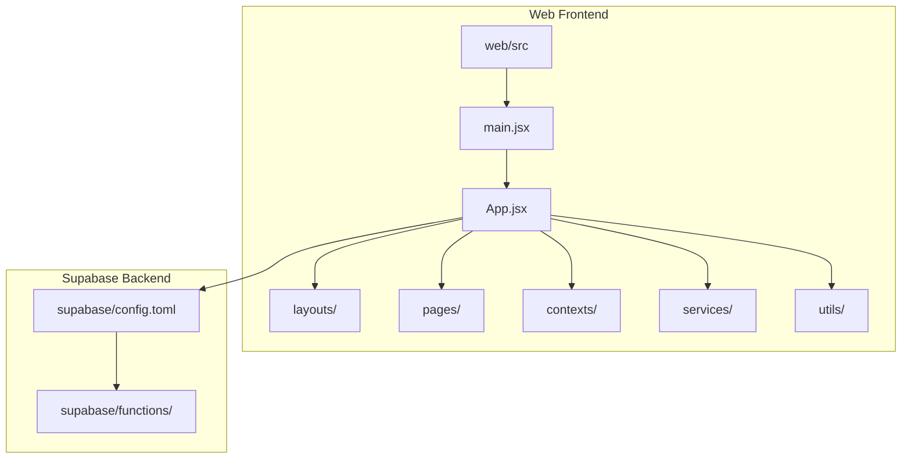
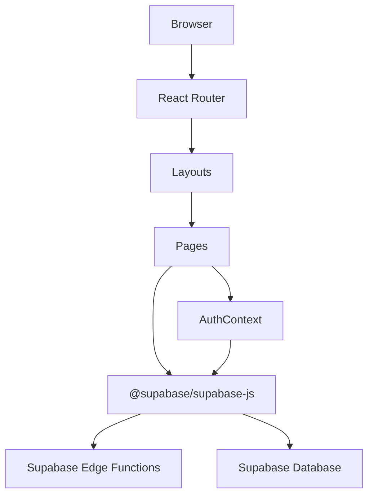
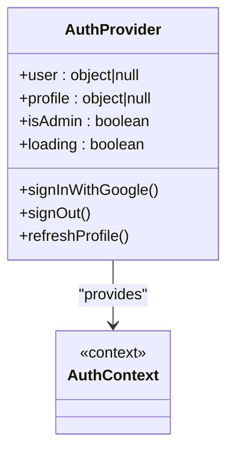
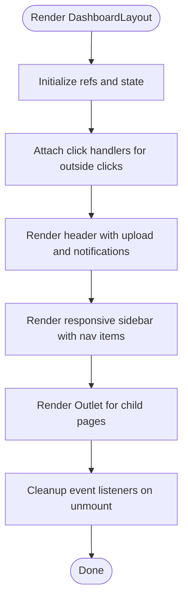
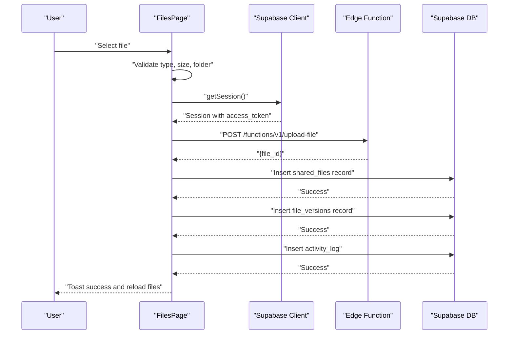
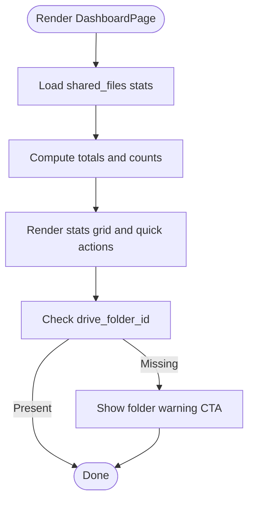
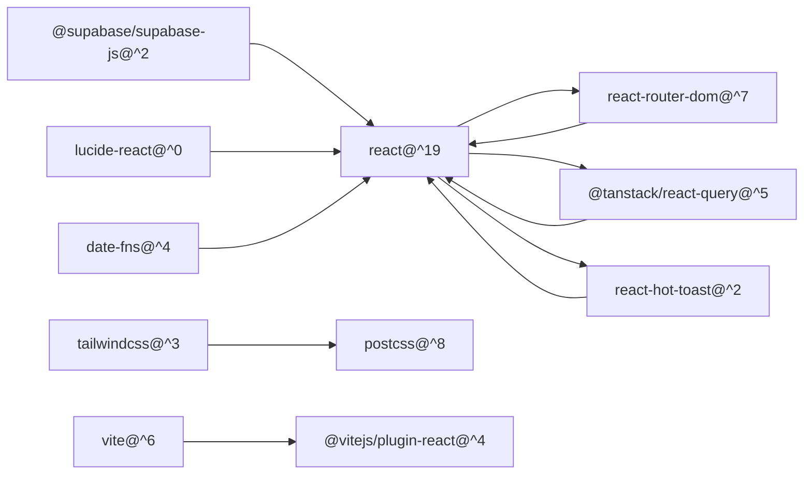
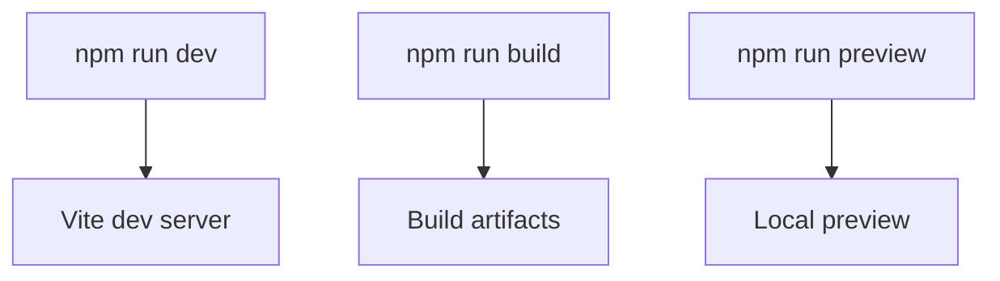

# Development Guidelines

<cite>
**Referenced Files in This Document**
- [package.json](file://web/package.json)
- [vite.config.js](file://web/vite.config.js)
- [tailwind.config.js](file://web/tailwind.config.js)
- [main.jsx](file://web/src/main.jsx)
- [App.jsx](file://web/src/App.jsx)
- [AuthContext.jsx](file://web/src/contexts/AuthContext.jsx)
- [supabase.js](file://web/src/services/supabase.js)
- [DashboardLayout.jsx](file://web/src/layouts/DashboardLayout.jsx)
- [DashboardPage.jsx](file://web/src/pages/DashboardPage.jsx)
- [FilesPage.jsx](file://web/src/pages/FilesPage.jsx)
- [helpers.js](file://web/src/utils/helpers.js)
- [config.toml](file://supabase/config.toml)
</cite>

## Table of Contents
1. [Introduction](#introduction)
2. [Project Structure](#project-structure)
3. [Core Components](#core-components)
4. [Architecture Overview](#architecture-overview)
5. [Detailed Component Analysis](#detailed-component-analysis)
6. [Dependency Analysis](#dependency-analysis)
7. [Performance Considerations](#performance-considerations)
8. [Security Coding Practices](#security-coding-practices)
9. [Accessibility Guidelines](#accessibility-guidelines)
10. [Testing Strategies](#testing-strategies)
11. [Build Process and Development Workflow](#build-process-and-development-workflow)
12. [Debugging Techniques](#debugging-techniques)
13. [Code Review and Contribution Guidelines](#code-review-and-contribution-guidelines)
14. [Maintenance Procedures](#maintenance-procedures)
15. [Common Development Tasks](#common-development-tasks)
16. [Troubleshooting Guide](#troubleshooting-guide)
17. [Conclusion](#conclusion)

## Introduction
This document provides comprehensive development guidelines for Neo Files Transfer. It covers code standards and conventions for React components, TypeScript usage, and file organization; component development patterns; state management best practices; testing strategies; build process and development workflow; debugging techniques; performance optimization; security coding practices; accessibility guidelines; code review processes; contribution guidelines; and maintenance procedures. The goal is to ensure consistent, maintainable, and secure development across the frontend and backend systems.

## Project Structure
The project follows a clear separation of concerns:
- Frontend (React + Vite): web/src contains components, pages, contexts, services, utilities, and layouts.
- Backend (Supabase Edge Functions): supabase/functions implement serverless business logic.
- Configuration: Vite, Tailwind CSS, and Supabase configuration files define build and styling behavior.

**Diagram sources**
- [main.jsx:1-41](file://web/src/main.jsx#L1-L41)
- [App.jsx:1-92](file://web/src/App.jsx#L1-L92)
- [config.toml:1-21](file://supabase/config.toml#L1-L21)

**Section sources**
- [package.json:1-29](file://web/package.json#L1-L29)
- [vite.config.js:1-11](file://web/vite.config.js#L1-L11)
- [tailwind.config.js:1-30](file://web/tailwind.config.js#L1-L30)

## Core Components
- Application bootstrap initializes routing, global providers, React Query, and notifications.
- Routing defines public, protected, admin, and error routes with layout wrappers.
- Authentication context manages session state, profile loading, admin checks, and sign-out.
- Supabase service encapsulates client creation with environment variables.
- Utility helpers centralize formatting and URL generation.

Key implementation references:
- Bootstrap and providers: [main.jsx:1-41](file://web/src/main.jsx#L1-L41)
- Routing and protected/admin routes: [App.jsx:1-92](file://web/src/App.jsx#L1-L92)
- Authentication context and hooks: [AuthContext.jsx:1-112](file://web/src/contexts/AuthContext.jsx#L1-L112)
- Supabase client: [supabase.js:1-7](file://web/src/services/supabase.js#L1-L7)
- Helpers: [helpers.js:1-52](file://web/src/utils/helpers.js#L1-L52)

**Section sources**
- [main.jsx:1-41](file://web/src/main.jsx#L1-L41)
- [App.jsx:1-92](file://web/src/App.jsx#L1-L92)
- [AuthContext.jsx:1-112](file://web/src/contexts/AuthContext.jsx#L1-L112)
- [supabase.js:1-7](file://web/src/services/supabase.js#L1-L7)
- [helpers.js:1-52](file://web/src/utils/helpers.js#L1-L52)

## Architecture Overview
The system uses React for the UI, React Router for navigation, React Query for caching and data fetching, and Supabase for authentication, database, and edge functions. The frontend communicates with Supabase functions via HTTPS with JWT verification configured per function.

**Diagram sources**
- [main.jsx:1-41](file://web/src/main.jsx#L1-L41)
- [App.jsx:1-92](file://web/src/App.jsx#L1-L92)
- [AuthContext.jsx:1-112](file://web/src/contexts/AuthContext.jsx#L1-L112)
- [supabase.js:1-7](file://web/src/services/supabase.js#L1-L7)
- [config.toml:1-21](file://supabase/config.toml#L1-L21)

## Detailed Component Analysis

### Authentication Context
The AuthContext manages:
- Session restoration and real-time auth state changes
- Profile loading and admin role detection
- Sign-in/sign-out flows
- Provider exposure of state and actions

**Diagram sources**
- [AuthContext.jsx:1-112](file://web/src/contexts/AuthContext.jsx#L1-L112)

**Section sources**
- [AuthContext.jsx:1-112](file://web/src/contexts/AuthContext.jsx#L1-L112)

### Dashboard Layout
The DashboardLayout provides:
- Responsive sidebar navigation
- User profile dropdown
- Global header actions
- Outlet rendering for nested pages

**Diagram sources**
- [DashboardLayout.jsx:1-200](file://web/src/layouts/DashboardLayout.jsx#L1-L200)

**Section sources**
- [DashboardLayout.jsx:1-200](file://web/src/layouts/DashboardLayout.jsx#L1-L200)

### Files Page (Upload, Rename, Delete, Share)
The FilesPage implements:
- File upload with type, size, and folder validation
- Interaction with Supabase functions for Google Drive operations
- Metadata persistence in Supabase
- Activity logging
- File listing, filtering, sorting, and context menu actions

**Diagram sources**
- [FilesPage.jsx:85-182](file://web/src/pages/FilesPage.jsx#L85-L182)
- [supabase.js:1-7](file://web/src/services/supabase.js#L1-L7)
- [config.toml:4-6](file://supabase/config.toml#L4-L6)

**Section sources**
- [FilesPage.jsx:1-536](file://web/src/pages/FilesPage.jsx#L1-L536)

### Dashboard Page
The DashboardPage displays:
- User welcome and quick actions
- Stats cards for files and shares
- Folder configuration warning

**Diagram sources**
- [DashboardPage.jsx:1-177](file://web/src/pages/DashboardPage.jsx#L1-L177)

**Section sources**
- [DashboardPage.jsx:1-177](file://web/src/pages/DashboardPage.jsx#L1-L177)

## Dependency Analysis
Frontend dependencies include React, React Router DOM, TanStack React Query, Lucide icons, Supabase JS client, toast notifications, and date utilities. Build-time dependencies include Vite, React plugin, PostCSS, Tailwind CSS.

**Diagram sources**
- [package.json:11-27](file://web/package.json#L11-L27)

**Section sources**
- [package.json:1-29](file://web/package.json#L1-L29)

## Performance Considerations
- React Query defaults: Set staleTime and retry to balance freshness and network usage.
- Lazy loading: Keep heavy components lazy-imported where appropriate.
- Memoization: Use memoization for derived data and expensive computations.
- Virtualization: For large lists, consider virtualized tables.
- Asset optimization: Leverage Vite’s bundling and Tailwind purging.
- Network efficiency: Batch requests and avoid unnecessary re-renders.

[No sources needed since this section provides general guidance]

## Security Coding Practices
- Environment variables: Sensitive keys are loaded via import.meta.env; ensure proper .env configuration and never commit secrets.
- JWT verification: Supabase functions enforce JWT verification per route.
- Input validation: Validate file types, sizes, and extensions on both client and server.
- Authorization: Use admin guards and user-scoped queries.
- CORS and headers: Ensure correct headers for cross-origin requests to Supabase functions.

**Section sources**
- [supabase.js:1-7](file://web/src/services/supabase.js#L1-L7)
- [config.toml:1-21](file://supabase/config.toml#L1-L21)
- [FilesPage.jsx:89-104](file://web/src/pages/FilesPage.jsx#L89-L104)

## Accessibility Guidelines
- Semantic HTML: Use proper headings, buttons, and landmarks.
- Focus management: Ensure keyboard navigation and focus traps for modals.
- ARIA attributes: Provide labels and roles where implicit semantics are insufficient.
- Color contrast: Maintain sufficient contrast for text and controls.
- Screen reader support: Announce dynamic updates and toasts appropriately.

[No sources needed since this section provides general guidance]

## Testing Strategies
- Unit tests: Test pure functions in helpers and small utility modules.
- Component tests: Use a testing library to render components with mocked providers.
- Integration tests: Verify flows like upload, rename, delete against mocked Supabase responses.
- E2E tests: Validate end-to-end user journeys with a browser automation tool.
- Mocking: Isolate Supabase client and edge functions behind mocks.

[No sources needed since this section provides general guidance]

## Build Process and Development Workflow
- Development server: Vite dev server runs on the configured port with auto-open.
- Production build: Vite bundles assets for production.
- Preview: Local preview of the production build.
- Environment variables: Define VITE_SUPABASE_URL, VITE_SUPABASE_ANON_KEY, and VITE_APP_URL.

**Diagram sources**
- [vite.config.js:1-11](file://web/vite.config.js#L1-L11)
- [package.json:6-10](file://web/package.json#L6-L10)

**Section sources**
- [vite.config.js:1-11](file://web/vite.config.js#L1-L11)
- [package.json:1-29](file://web/package.json#L1-L29)

## Debugging Techniques
- Console logging: Use targeted logs around async operations and API calls.
- React DevTools: Inspect component trees, props, and state.
- React Query Devtools: Monitor cache state and query behavior.
- Network tab: Observe requests to Supabase functions and responses.
- Supabase logs: Enable function logs for debugging edge function errors.

[No sources needed since this section provides general guidance]

## Code Review and Contribution Guidelines
- Branching: Feature branches merged via pull requests.
- Reviews: Require at least one reviewer familiar with the affected area.
- Standards: Follow existing patterns for component structure, naming, and imports.
- Tests: Include unit and integration tests for new features.
- Documentation: Update relevant docs and comments for significant changes.

[No sources needed since this section provides general guidance]

## Maintenance Procedures
- Dependency updates: Regularly update packages and verify compatibility.
- Supabase migrations: Apply schema changes and test edge functions.
- Environment parity: Keep local, staging, and production environments aligned.
- Monitoring: Track error rates and performance metrics.

[No sources needed since this section provides general guidance]

## Common Development Tasks
- Add a new page: Create a new page component, add a route, and wrap with appropriate layout or protection.
- Introduce a new component: Place under components/, export default, and import where needed.
- Extend authentication: Add new auth actions in AuthContext and expose via hook.
- Call an edge function: Use Supabase client or fetch with Authorization header; handle errors and toasts.
- Update styles: Modify Tailwind classes or extend theme; ensure responsive behavior.

[No sources needed since this section provides general guidance]

## Troubleshooting Guide
- Authentication issues: Verify session restoration and auth state change listener; check Supabase auth callbacks.
- Upload failures: Confirm file type and size limits, folder configuration, and function permissions.
- Missing environment variables: Ensure VITE_SUPABASE_URL, VITE_SUPABASE_ANON_KEY, and VITE_APP_URL are set.
- Styling problems: Check Tailwind content globs and rebuild after adding new class usage.
- Edge function errors: Inspect Supabase function logs and verify JWT verification settings.

**Section sources**
- [AuthContext.jsx:12-38](file://web/src/contexts/AuthContext.jsx#L12-L38)
- [FilesPage.jsx:106-109](file://web/src/pages/FilesPage.jsx#L106-L109)
- [supabase.js:1-7](file://web/src/services/supabase.js#L1-L7)
- [tailwind.config.js:1-30](file://web/tailwind.config.js#L1-L30)
- [config.toml:1-21](file://supabase/config.toml#L1-L21)

## Conclusion
These guidelines establish a consistent foundation for developing, maintaining, and extending Neo Files Transfer. By adhering to the outlined patterns, conventions, and practices, contributors can deliver reliable, secure, and accessible features while maintaining high code quality and developer productivity.