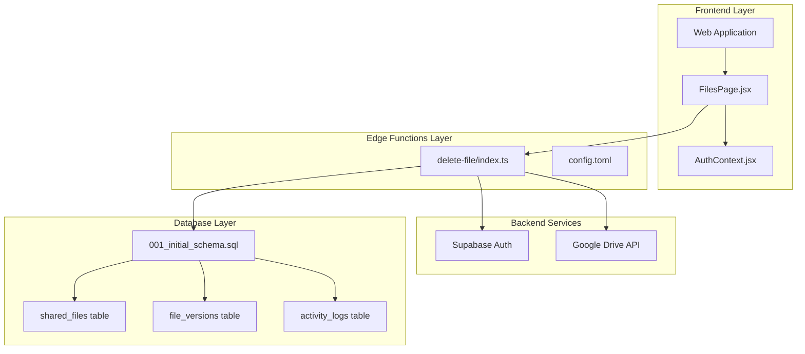
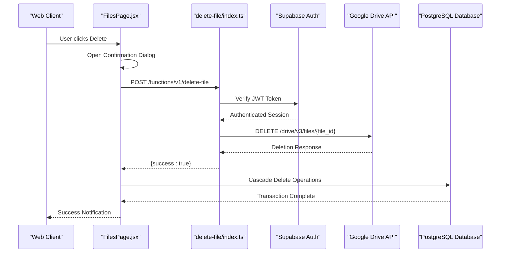
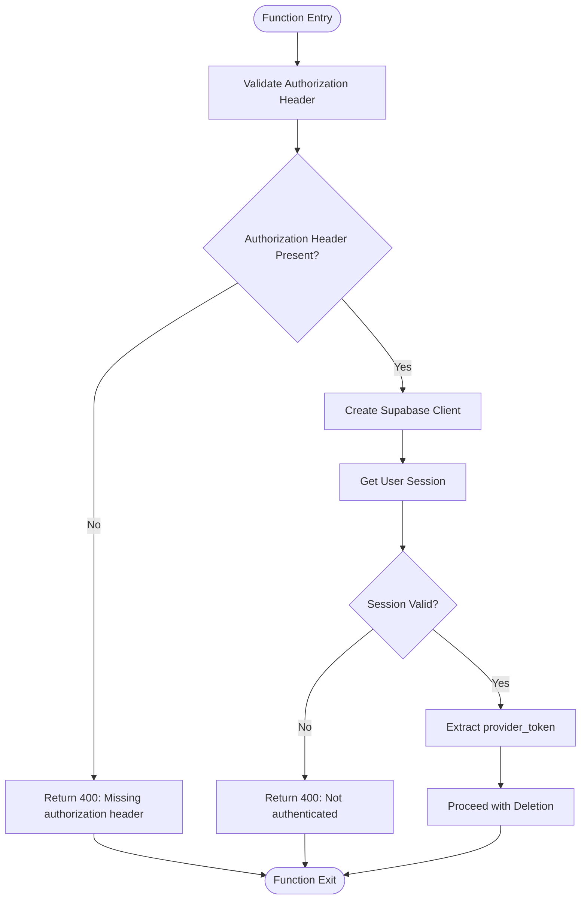
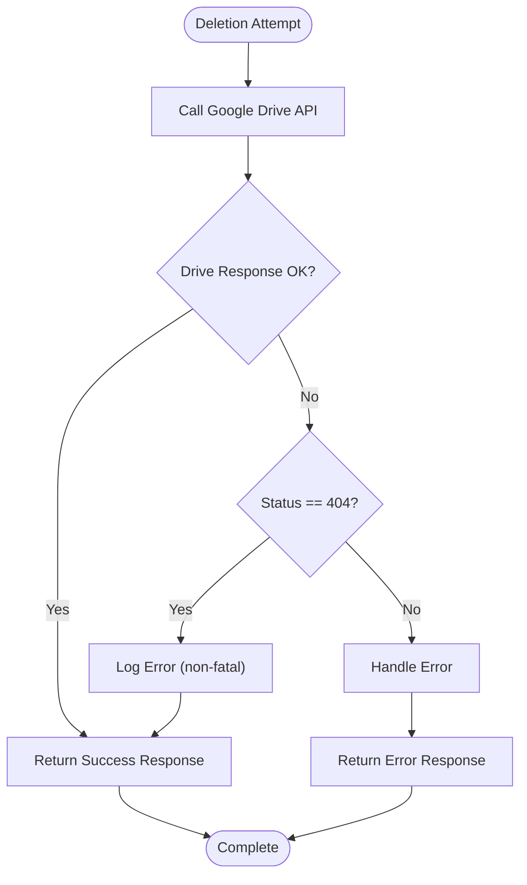
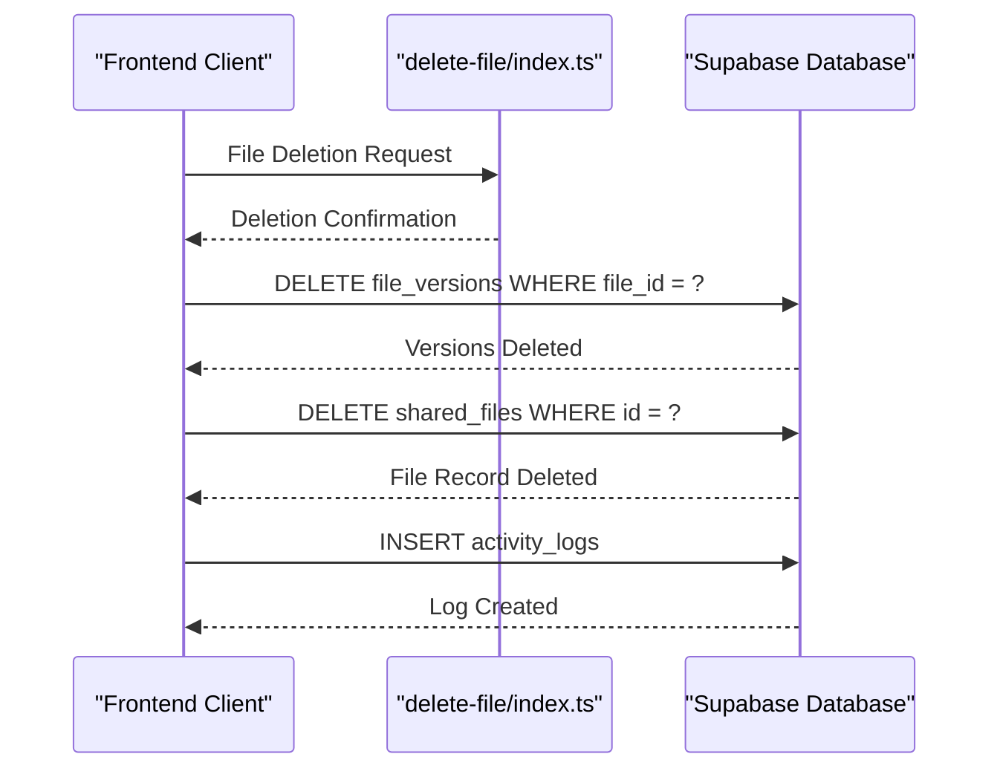
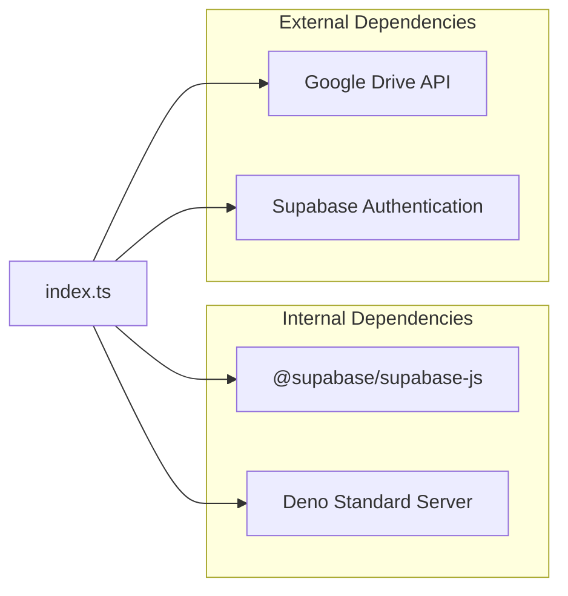

# Delete File Function

<cite>
**Referenced Files in This Document**
- [index.ts](file://supabase/functions/delete-file/index.ts)
- [config.toml](file://supabase/config.toml)
- [001_initial_schema.sql](file://supabase/migrations/001_initial_schema.sql)
- [FilesPage.jsx](file://web/src/pages/FilesPage.jsx)
- [supabase.js](file://web/src/services/supabase.js)
- [AuthContext.jsx](file://web/src/contexts/AuthContext.jsx)
- [upload-file/index.ts](file://supabase/functions/upload-file/index.ts)
- [validate-folder/index.ts](file://supabase/functions/validate-folder/index.ts)
</cite>

## Table of Contents
1. [Introduction](#introduction)
2. [Project Structure](#project-structure)
3. [Core Components](#core-components)
4. [Architecture Overview](#architecture-overview)
5. [Detailed Component Analysis](#detailed-component-analysis)
6. [Dependency Analysis](#dependency-analysis)
7. [Performance Considerations](#performance-considerations)
8. [Troubleshooting Guide](#troubleshooting-guide)
9. [Conclusion](#conclusion)

## Introduction
The delete-file edge function provides a secure mechanism to remove files from Google Drive storage while maintaining data integrity in the Neo Files Transfer application. This function serves as a bridge between the frontend interface and Google Drive's REST API, ensuring proper authentication, authorization, and cascading cleanup of associated database records.

The function implements a streamlined deletion process that removes files from Google Drive storage and returns a standardized response format. It operates within the Supabase Edge Functions ecosystem, leveraging JWT authentication and row-level security policies to maintain data privacy and access control.

## Project Structure
The delete-file functionality spans multiple layers of the application architecture:

**Diagram sources**
- [index.ts:1-72](file://supabase/functions/delete-file/index.ts#L1-L72)
- [config.toml:10-11](file://supabase/config.toml#L10-L11)
- [001_initial_schema.sql:56-82](file://supabase/migrations/001_initial_schema.sql#L56-L82)

**Section sources**
- [index.ts:1-72](file://supabase/functions/delete-file/index.ts#L1-L72)
- [config.toml:10-11](file://supabase/config.toml#L10-L11)
- [001_initial_schema.sql:56-82](file://supabase/migrations/001_initial_schema.sql#L56-L82)

## Core Components

### Edge Function Implementation
The delete-file edge function is implemented as a serverless function using Deno runtime with the following key characteristics:

- **Runtime Environment**: Deno Standard Server module for HTTP handling
- **Authentication**: JWT-based authentication through Supabase Auth
- **External API Integration**: Direct Google Drive REST API calls
- **Response Format**: Consistent JSON response structure
- **Error Handling**: Comprehensive error catching and reporting

### Request Processing Pipeline
The function follows a structured request processing flow:

1. **CORS Handling**: Supports preflight OPTIONS requests
2. **Authentication Verification**: Validates JWT token presence
3. **Session Validation**: Confirms active user session
4. **Google Drive Deletion**: Executes file removal from storage
5. **Response Generation**: Returns standardized success/error response

### Database Integration Points
The function coordinates with multiple database tables through separate frontend operations:

- **shared_files**: Main file metadata table
- **file_versions**: Version history tracking
- **activity_logs**: Audit trail maintenance

**Section sources**
- [index.ts:9-71](file://supabase/functions/delete-file/index.ts#L9-L71)
- [FilesPage.jsx:227-264](file://web/src/pages/FilesPage.jsx#L227-L264)

## Architecture Overview

**Diagram sources**
- [index.ts:39-53](file://supabase/functions/delete-file/index.ts#L39-L53)
- [FilesPage.jsx:232-244](file://web/src/pages/FilesPage.jsx#L232-L244)

The architecture demonstrates a clear separation of concerns where the edge function handles external service integration while the frontend manages database operations through Supabase's RLS policies.

**Section sources**
- [index.ts:39-61](file://supabase/functions/delete-file/index.ts#L39-L61)
- [FilesPage.jsx:227-264](file://web/src/pages/FilesPage.jsx#L227-L264)

## Detailed Component Analysis

### Authentication and Authorization Flow

**Diagram sources**
- [index.ts:21-35](file://supabase/functions/delete-file/index.ts#L21-L35)

The authentication flow ensures that only authenticated users with valid sessions can perform file deletions. The function extracts the provider token from the session for Google Drive API access.

### Google Drive API Integration

The function integrates with Google Drive's REST API using the standard HTTP DELETE method:

- **Endpoint**: `https://www.googleapis.com/drive/v3/files/{file_id}`
- **Method**: DELETE
- **Authentication**: Bearer token extracted from Supabase session
- **Response Handling**: Ignores 404 errors (file already deleted)

### Request/Response Specifications

#### Request Schema
| Parameter | Type | Required | Description |
|-----------|------|----------|-------------|
| file_id | string | Yes | Google Drive file identifier |
| Authorization | string | Yes | Bearer token from JWT session |

#### Response Schema
| Field | Type | Description |
|-------|------|-------------|
| success | boolean | Indicates deletion completion |
| error | string | Error message (when present) |

### Error Handling Strategy

The function implements comprehensive error handling for various failure scenarios:

**Diagram sources**
- [index.ts:50-53](file://supabase/functions/delete-file/index.ts#L50-L53)

**Section sources**
- [index.ts:14-71](file://supabase/functions/delete-file/index.ts#L14-L71)

### Database Cleanup Procedures

While the edge function focuses on Google Drive deletion, the frontend handles comprehensive database cleanup:

**Diagram sources**
- [FilesPage.jsx:246-256](file://web/src/pages/FilesPage.jsx#L246-L256)

The frontend performs cascading deletions using Supabase's built-in foreign key constraints, ensuring referential integrity is maintained.

**Section sources**
- [FilesPage.jsx:246-256](file://web/src/pages/FilesPage.jsx#L246-L256)
- [001_initial_schema.sql:76-82](file://supabase/migrations/001_initial_schema.sql#L76-L82)

## Dependency Analysis

### External Dependencies
The function relies on several external services and libraries:

**Diagram sources**
- [index.ts:1-2](file://supabase/functions/delete-file/index.ts#L1-L2)
- [config.toml:10-11](file://supabase/config.toml#L10-L11)

### Internal Dependencies
The function interacts with multiple Supabase components:

- **Supabase Client**: Authentication and session management
- **Google Drive API**: File storage operations
- **Environment Variables**: SUPABASE_URL and SUPABASE_ANON_KEY

**Section sources**
- [index.ts:26-29](file://supabase/functions/delete-file/index.ts#L26-L29)
- [config.toml:10-11](file://supabase/config.toml#L10-L11)

## Performance Considerations

### Execution Characteristics
- **Cold Start**: Edge function may experience cold start latency on initial invocation
- **Network Latency**: Deletion speed depends on Google Drive API response times
- **Memory Usage**: Minimal memory footprint due to simple HTTP request/response pattern
- **Concurrency**: Can handle multiple simultaneous deletion requests

### Optimization Recommendations
1. **Connection Reuse**: Consider implementing connection pooling for frequent operations
2. **Caching**: Cache frequently accessed file metadata to reduce API calls
3. **Batch Operations**: For bulk deletions, consider batching multiple files in a single transaction
4. **Monitoring**: Implement logging and metrics collection for performance tracking

## Troubleshooting Guide

### Common Error Scenarios

#### Authentication Failures
**Symptoms**: 400 response with "Not authenticated" message
**Causes**: 
- Missing or invalid Authorization header
- Expired JWT token
- User session not established

**Resolution Steps**:
1. Verify user is logged in through Google OAuth
2. Check JWT token validity and expiration
3. Ensure proper session establishment before deletion attempts

#### File Not Found Errors
**Symptoms**: Drive API returns 404 status
**Causes**:
- File already deleted from Google Drive
- Invalid file_id parameter
- Permission issues accessing the file

**Resolution Steps**:
1. Verify file_id corresponds to existing Google Drive file
2. Check user permissions for the target file
3. Confirm file hasn't been previously deleted

#### Permission Denied Issues
**Symptoms**: Drive API returns 403 Forbidden
**Causes**:
- User lacks write permissions for the file
- Google Drive sharing restrictions
- Insufficient OAuth scopes granted

**Resolution Steps**:
1. Verify user has edit permissions for the file
2. Check Google Drive sharing settings
3. Ensure OAuth scopes include appropriate file permissions

#### Network Connectivity Problems
**Symptoms**: Timeout errors or network failures
**Causes**:
- Temporary Google Drive API outages
- Network connectivity issues
- Firewall restrictions

**Resolution Steps**:
1. Retry operation after network stabilization
2. Check firewall and proxy configurations
3. Monitor Google Drive API status page

### Debugging Procedures

#### Frontend Debugging
1. **Console Logging**: Enable browser developer tools to monitor API requests
2. **Network Inspection**: Examine request/response headers and bodies
3. **State Monitoring**: Track application state during deletion operations

#### Backend Debugging
1. **Edge Function Logs**: Monitor Supabase Edge Functions logs for error details
2. **Google Drive API Logs**: Check Google Cloud Console for API usage and errors
3. **Database Triggers**: Verify cascade deletion operations complete successfully

**Section sources**
- [index.ts:50-53](file://supabase/functions/delete-file/index.ts#L50-L53)
- [FilesPage.jsx:261-263](file://web/src/pages/FilesPage.jsx#L261-L263)

## Conclusion

The delete-file edge function provides a robust and secure mechanism for removing files from Google Drive storage within the Neo Files Transfer application. Its implementation demonstrates best practices for edge function development, including proper authentication handling, error management, and clean separation of concerns between storage operations and database cleanup.

The function's design leverages Supabase's edge computing capabilities while maintaining strong security boundaries through JWT authentication and Google Drive API integration. The complementary frontend operations ensure comprehensive cleanup of associated database records, maintaining data integrity throughout the deletion process.

Future enhancements could include improved error reporting, retry mechanisms for transient failures, and expanded monitoring capabilities to support production deployment requirements.