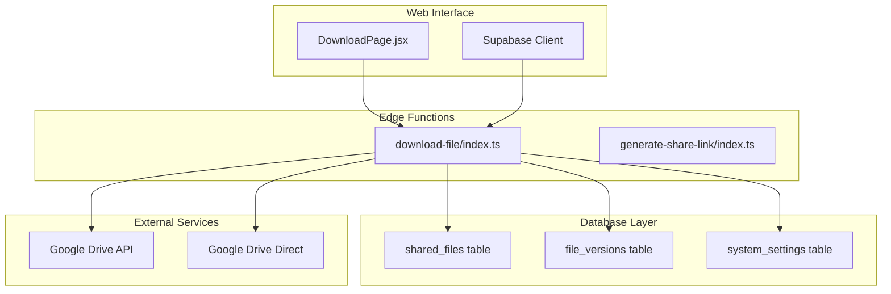
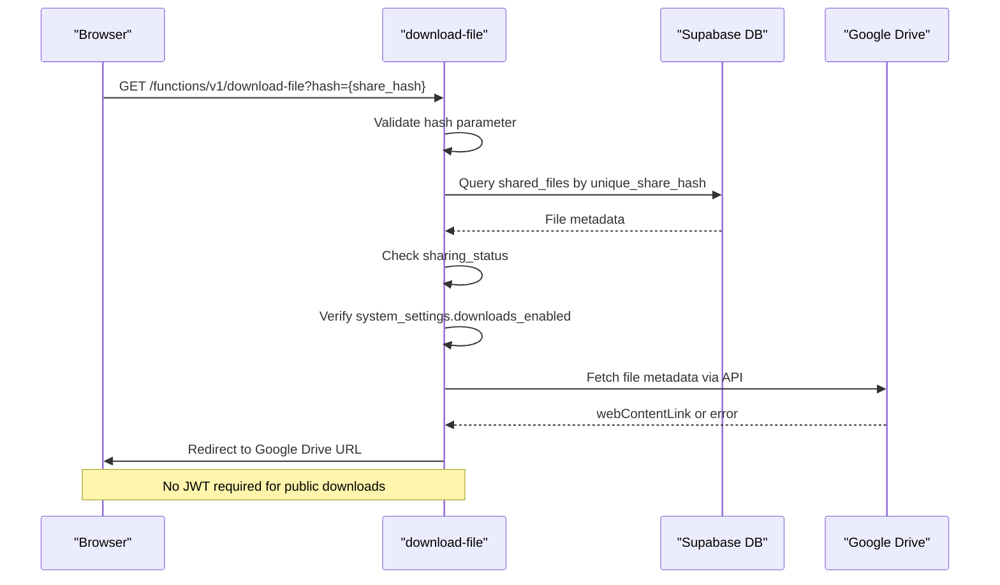
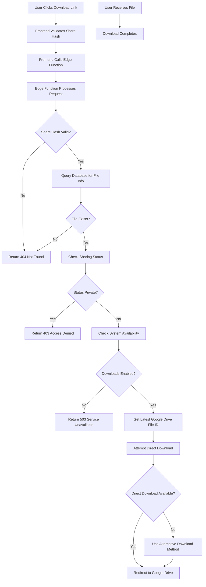
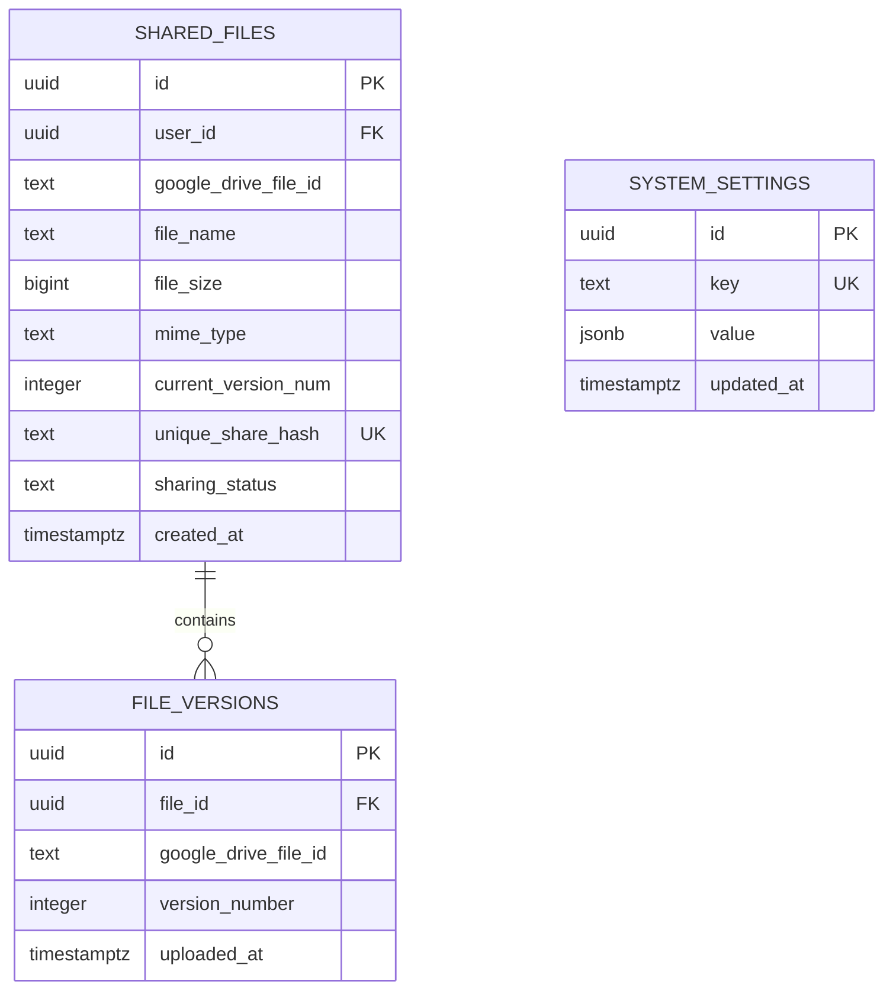
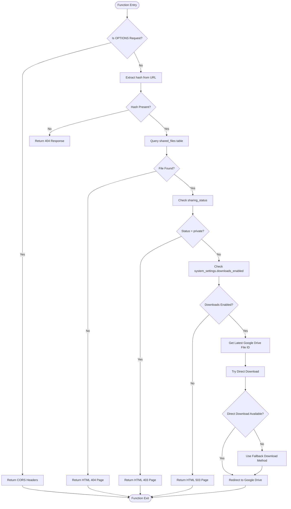
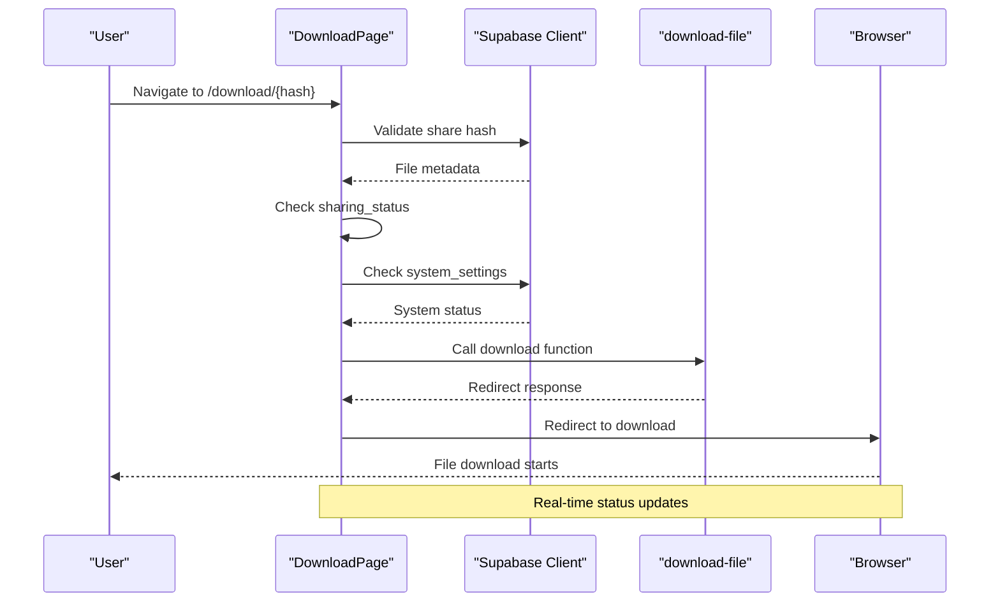
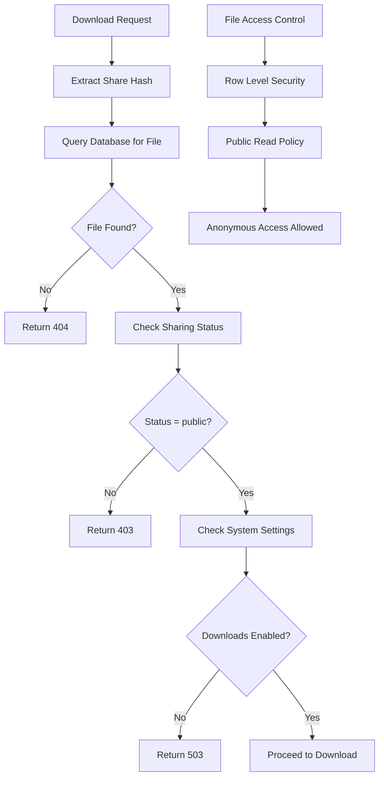
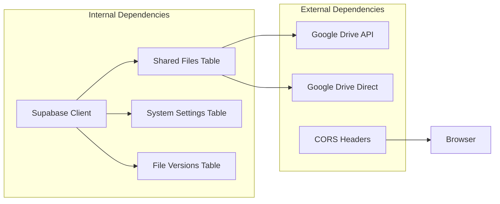

# Download File Function

<cite>
**Referenced Files in This Document**
- [download-file/index.ts](file://supabase/functions/download-file/index.ts)
- [generate-share-link/index.ts](file://supabase/functions/generate-share-link/index.ts)
- [DownloadPage.jsx](file://web/src/pages/DownloadPage.jsx)
- [001_initial_schema.sql](file://supabase/migrations/001_initial_schema.sql)
- [config.toml](file://supabase/config.toml)
- [supabase.js](file://web/src/services/supabase.js)
</cite>

## Table of Contents
1. [Introduction](#introduction)
2. [Project Structure](#project-structure)
3. [Core Components](#core-components)
4. [Architecture Overview](#architecture-overview)
5. [Detailed Component Analysis](#detailed-component-analysis)
6. [Dependency Analysis](#dependency-analysis)
7. [Performance Considerations](#performance-considerations)
8. [Troubleshooting Guide](#troubleshooting-guide)
9. [Conclusion](#conclusion)

## Introduction
The download-file edge function is a serverless function that handles public file downloads in the Neo Files Transfer system. It validates share hashes, checks file permissions, verifies system availability, and securely redirects users to Google Drive for file downloads. This function serves as a bridge between the frontend interface and Google Drive's public file access capabilities.

## Project Structure
The download functionality spans three main areas of the system:

**Diagram sources**
- [download-file/index.ts:1-131](file://supabase/functions/download-file/index.ts#L1-L131)
- [DownloadPage.jsx:1-158](file://web/src/pages/DownloadPage.jsx#L1-L158)
- [001_initial_schema.sql:55-122](file://supabase/migrations/001_initial_schema.sql#L55-L122)

**Section sources**
- [download-file/index.ts:1-131](file://supabase/functions/download-file/index.ts#L1-L131)
- [DownloadPage.jsx:1-158](file://web/src/pages/DownloadPage.jsx#L1-L158)
- [001_initial_schema.sql:55-122](file://supabase/migrations/001_initial_schema.sql#L55-L122)

## Core Components

### Edge Function Architecture
The download-file edge function implements a streamlined request processing pipeline:

1. **CORS Configuration**: Enables cross-origin requests for browser compatibility
2. **Request Validation**: Extracts and validates the share hash parameter
3. **Database Query**: Retrieves file metadata using the Supabase admin client
4. **Permission Verification**: Checks sharing status and system availability
5. **Google Drive Integration**: Attempts multiple download redirection strategies
6. **Error Handling**: Provides comprehensive error responses for various failure scenarios

### Authentication Flow
Unlike other edge functions, the download-file function operates without JWT verification, enabling anonymous access for public file downloads:

**Diagram sources**
- [download-file/index.ts:9-129](file://supabase/functions/download-file/index.ts#L9-L129)
- [config.toml:16-17](file://supabase/config.toml#L16-L17)

**Section sources**
- [download-file/index.ts:1-131](file://supabase/functions/download-file/index.ts#L1-L131)
- [config.toml:16-17](file://supabase/config.toml#L16-L17)

## Architecture Overview

### System Integration Flow
The download system integrates multiple components working together:

**Diagram sources**
- [download-file/index.ts:14-118](file://supabase/functions/download-file/index.ts#L14-L118)
- [DownloadPage.jsx:11-73](file://web/src/pages/DownloadPage.jsx#L11-L73)

### Database Schema Integration
The function interacts with three key database tables:

**Diagram sources**
- [001_initial_schema.sql:55-83](file://supabase/migrations/001_initial_schema.sql#L55-L83)
- [001_initial_schema.sql:107-122](file://supabase/migrations/001_initial_schema.sql#L107-L122)

**Section sources**
- [001_initial_schema.sql:55-122](file://supabase/migrations/001_initial_schema.sql#L55-L122)
- [download-file/index.ts:23-83](file://supabase/functions/download-file/index.ts#L23-L83)

## Detailed Component Analysis

### Edge Function Implementation

#### Request Processing Pipeline
The edge function follows a structured processing approach:

**Diagram sources**
- [download-file/index.ts:9-129](file://supabase/functions/download-file/index.ts#L9-L129)

#### Google Drive Integration Strategies
The function implements two primary download strategies:

1. **Direct Content Link Strategy**: Uses Google Drive API to fetch `webContentLink`
2. **Fallback Download Strategy**: Uses Google Drive's direct download endpoint

**Section sources**
- [download-file/index.ts:74-118](file://supabase/functions/download-file/index.ts#L74-L118)

### Frontend Integration

#### Download Page Workflow
The frontend implements comprehensive validation and user feedback:

**Diagram sources**
- [DownloadPage.jsx:11-73](file://web/src/pages/DownloadPage.jsx#L11-L73)

**Section sources**
- [DownloadPage.jsx:1-158](file://web/src/pages/DownloadPage.jsx#L1-L158)

### Authentication and Security Model

#### Permission Verification Process
The system implements a multi-layered permission verification system:

**Diagram sources**
- [download-file/index.ts:36-72](file://supabase/functions/download-file/index.ts#L36-L72)
- [001_initial_schema.sql:170-173](file://supabase/migrations/001_initial_schema.sql#L170-L173)

**Section sources**
- [download-file/index.ts:46-72](file://supabase/functions/download-file/index.ts#L46-L72)
- [001_initial_schema.sql:170-173](file://supabase/migrations/001_initial_schema.sql#L170-L173)

## Dependency Analysis

### External Dependencies
The download function relies on several external services:

**Diagram sources**
- [download-file/index.ts:24-107](file://supabase/functions/download-file/index.ts#L24-L107)

### Environment Configuration
The function requires specific environment variables:

| Variable | Purpose | Required |
|----------|---------|----------|
| SUPABASE_URL | Supabase project URL | Yes |
| SUPABASE_SERVICE_ROLE_KEY | Admin database access | Yes |
| GOOGLE_API_KEY | Google Drive API access | Yes |

**Section sources**
- [download-file/index.ts:24-27](file://supabase/functions/download-file/index.ts#L24-L27)
- [download-file/index.ts:102-104](file://supabase/functions/download-file/index.ts#L102-L104)

## Performance Considerations

### Optimization Strategies
1. **Database Query Optimization**: Single query with selective field retrieval
2. **Caching Strategy**: Minimal caching due to real-time nature
3. **Network Efficiency**: Direct redirect minimizes processing overhead
4. **Error Early Exit**: Immediate response for invalid requests

### Scalability Factors
- Edge function cold start latency
- Google Drive API response times
- Database connection pooling
- CORS preflight handling

## Troubleshooting Guide

### Common Error Scenarios

#### Missing Share Hash
**Symptoms**: Immediate 404 response
**Cause**: No hash parameter in URL
**Solution**: Verify share link contains valid hash parameter

#### File Not Found
**Symptoms**: HTML 404 page with "File Not Found" message
**Cause**: Non-existent or deleted file
**Solution**: Check file existence in database, verify unique_share_hash

#### Access Denied (Private Files)
**Symptoms**: HTML 403 page with "Access Denied" message
**Cause**: File sharing_status = private
**Solution**: Contact file owner for access, change sharing settings

#### System Maintenance
**Symptoms**: HTML 503 page with maintenance message
**Cause**: downloads_enabled = false
**Solution**: Wait for system maintenance completion

#### Google Drive Integration Issues
**Symptoms**: Redirect loop or download failure
**Cause**: Google Drive file accessibility issues
**Solution**: Verify file is publicly accessible, check Google Drive API status

### Debugging Techniques

#### Backend Debugging
1. **Console Logging**: Monitor function execution in Supabase logs
2. **Error Tracking**: Implement structured error responses
3. **Database Queries**: Verify SQL query execution and results
4. **Environment Variables**: Validate required configuration

#### Frontend Debugging
1. **Network Inspection**: Monitor download function calls
2. **Status Updates**: Track download progress states
3. **Error Handling**: Display meaningful error messages
4. **URL Validation**: Verify share hash correctness

**Section sources**
- [download-file/index.ts:120-128](file://supabase/functions/download-file/index.ts#L120-L128)
- [DownloadPage.jsx:66-70](file://web/src/pages/DownloadPage.jsx#L66-L70)

## Conclusion
The download-file edge function provides a robust, secure mechanism for handling public file downloads in the Neo Files Transfer system. Its architecture balances simplicity with comprehensive error handling, while leveraging Google Drive's public file access capabilities. The system's multi-layered permission verification ensures appropriate access control, and the dual-download strategy maximizes reliability across different file types and configurations.

The implementation demonstrates best practices for serverless file delivery, including proper CORS handling, structured error responses, and efficient database interactions. The frontend integration provides excellent user experience with real-time status updates and comprehensive error messaging.