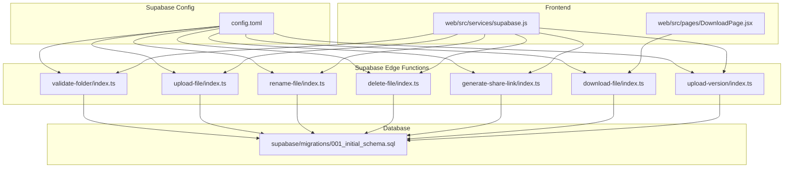
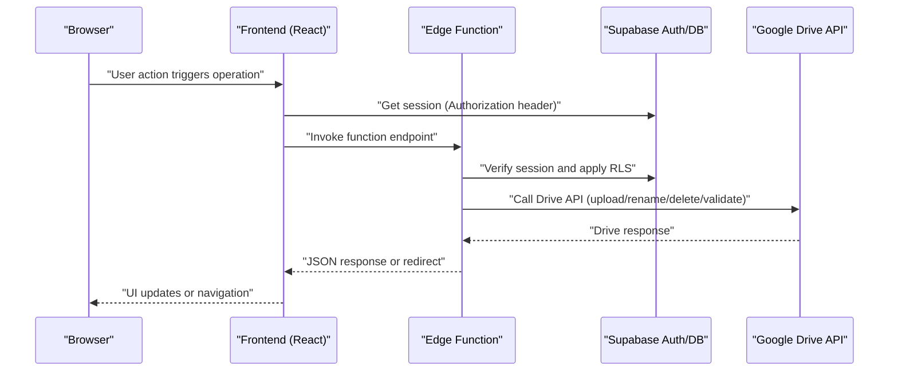
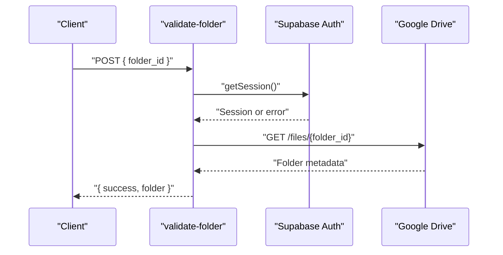
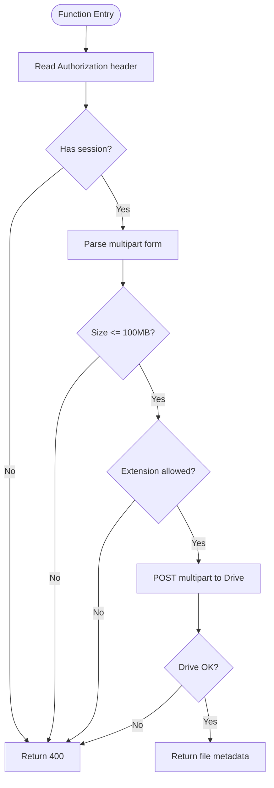
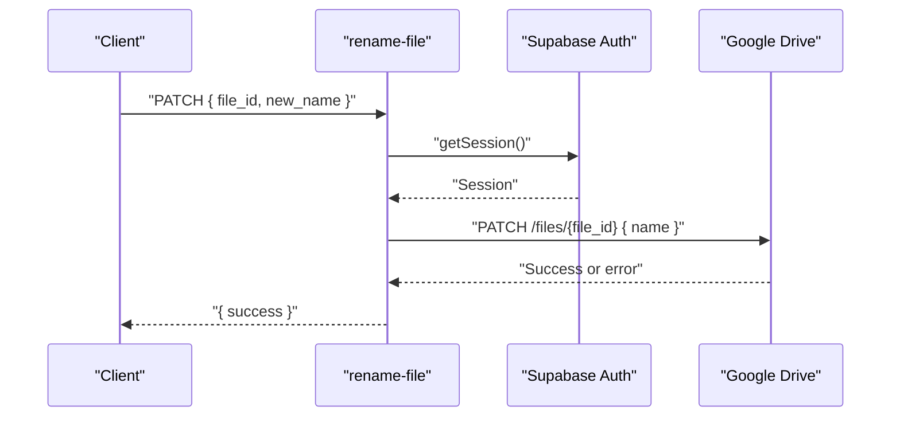
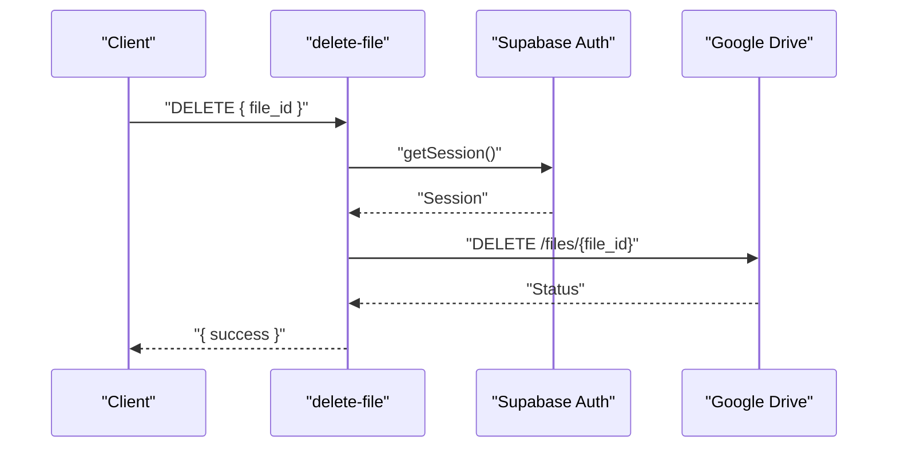
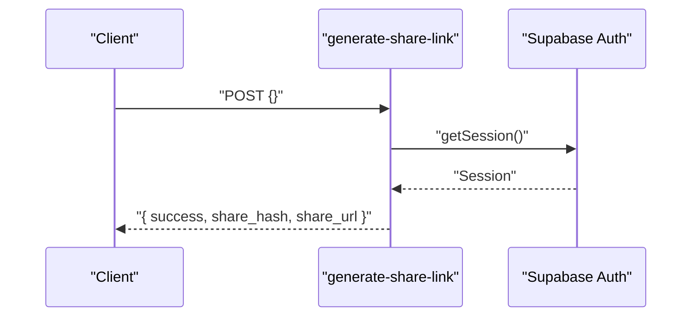
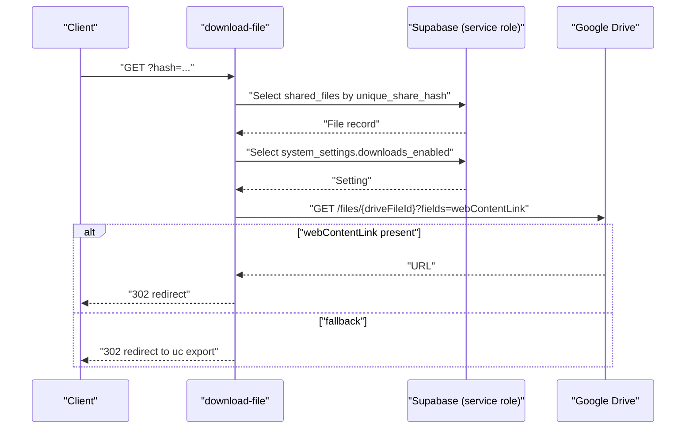
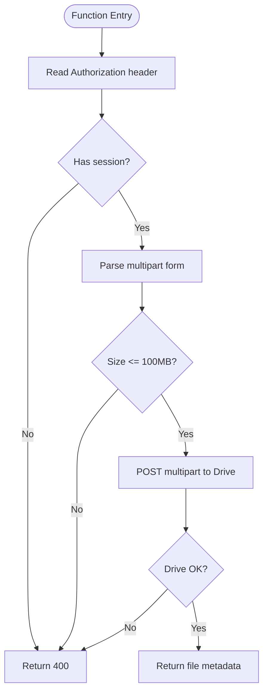
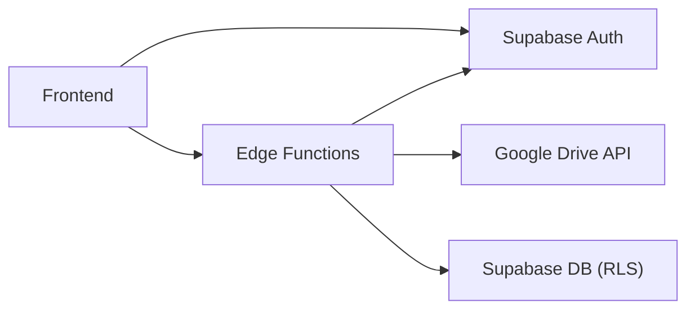

# Edge Functions

<cite>
**Referenced Files in This Document**
- [config.toml](file://supabase/config.toml)
- [delete-file/index.ts](file://supabase/functions/delete-file/index.ts)
- [download-file/index.ts](file://supabase/functions/download-file/index.ts)
- [generate-share-link/index.ts](file://supabase/functions/generate-share-link/index.ts)
- [rename-file/index.ts](file://supabase/functions/rename-file/index.ts)
- [upload-file/index.ts](file://supabase/functions/upload-file/index.ts)
- [upload-version/index.ts](file://supabase/functions/upload-version/index.ts)
- [validate-folder/index.ts](file://supabase/functions/validate-folder/index.ts)
- [001_initial_schema.sql](file://supabase/migrations/001_initial_schema.sql)
- [supabase.js](file://web/src/services/supabase.js)
- [DownloadPage.jsx](file://web/src/pages/DownloadPage.jsx)
</cite>

## Table of Contents
1. [Introduction](#introduction)
2. [Project Structure](#project-structure)
3. [Core Components](#core-components)
4. [Architecture Overview](#architecture-overview)
5. [Detailed Component Analysis](#detailed-component-analysis)
6. [Dependency Analysis](#dependency-analysis)
7. [Performance Considerations](#performance-considerations)
8. [Troubleshooting Guide](#troubleshooting-guide)
9. [Conclusion](#conclusion)
10. [Appendices](#appendices)

## Introduction
This document provides comprehensive API documentation for the Supabase edge functions that power file operations and sharing within the Neo Files Transfer platform. It covers endpoint definitions, HTTP methods, URL patterns, request/response schemas, authentication requirements, Google Drive integration, error handling, and security measures. It also includes operational guidance for deployment, monitoring, debugging, performance optimization, rate limiting, and cost management.

## Project Structure
The edge functions are located under the Supabase functions directory, each implementing a single-purpose HTTP handler. Configuration for JWT verification per function is defined in the Supabase configuration file. The frontend integrates with Supabase Auth and invokes the edge functions to perform file operations.

**Diagram sources**
- [config.toml:1-21](file://supabase/config.toml#L1-L21)
- [validate-folder/index.ts:1-87](file://supabase/functions/validate-folder/index.ts#L1-L87)
- [upload-file/index.ts:1-152](file://supabase/functions/upload-file/index.ts#L1-L152)
- [rename-file/index.ts:1-74](file://supabase/functions/rename-file/index.ts#L1-L74)
- [delete-file/index.ts:1-72](file://supabase/functions/delete-file/index.ts#L1-L72)
- [generate-share-link/index.ts:1-55](file://supabase/functions/generate-share-link/index.ts#L1-L55)
- [download-file/index.ts:1-131](file://supabase/functions/download-file/index.ts#L1-L131)
- [upload-version/index.ts:1-130](file://supabase/functions/upload-version/index.ts#L1-L130)
- [DownloadPage.jsx:38-78](file://web/src/pages/DownloadPage.jsx#L38-L78)
- [supabase.js:1-7](file://web/src/services/supabase.js#L1-L7)
- [001_initial_schema.sql:1-289](file://supabase/migrations/001_initial_schema.sql#L1-L289)

**Section sources**
- [config.toml:1-21](file://supabase/config.toml#L1-L21)
- [validate-folder/index.ts:1-87](file://supabase/functions/validate-folder/index.ts#L1-L87)
- [upload-file/index.ts:1-152](file://supabase/functions/upload-file/index.ts#L1-L152)
- [rename-file/index.ts:1-74](file://supabase/functions/rename-file/index.ts#L1-L74)
- [delete-file/index.ts:1-72](file://supabase/functions/delete-file/index.ts#L1-L72)
- [generate-share-link/index.ts:1-55](file://supabase/functions/generate-share-link/index.ts#L1-L55)
- [download-file/index.ts:1-131](file://supabase/functions/download-file/index.ts#L1-L131)
- [upload-version/index.ts:1-130](file://supabase/functions/upload-version/index.ts#L1-L130)
- [DownloadPage.jsx:38-78](file://web/src/pages/DownloadPage.jsx#L38-L78)
- [supabase.js:1-7](file://web/src/services/supabase.js#L1-L7)
- [001_initial_schema.sql:1-289](file://supabase/migrations/001_initial_schema.sql#L1-L289)

## Core Components
- validate-folder: Validates a Google Drive folder ID and verifies it is a folder.
- upload-file: Uploads a new file to a specified Google Drive folder with size/type checks.
- rename-file: Renames a file in Google Drive.
- delete-file: Deletes a file from Google Drive.
- generate-share-link: Generates a unique share hash and a short share URL.
- download-file: Resolves a share hash to a downloadable file via redirect.
- upload-version: Uploads a new version of an existing file to Google Drive.

Each function enforces CORS headers and returns JSON responses. Authentication is handled via Supabase Auth using the Authorization header. Several functions require JWT verification as configured.

**Section sources**
- [validate-folder/index.ts:1-87](file://supabase/functions/validate-folder/index.ts#L1-L87)
- [upload-file/index.ts:1-152](file://supabase/functions/upload-file/index.ts#L1-L152)
- [rename-file/index.ts:1-74](file://supabase/functions/rename-file/index.ts#L1-L74)
- [delete-file/index.ts:1-72](file://supabase/functions/delete-file/index.ts#L1-L72)
- [generate-share-link/index.ts:1-55](file://supabase/functions/generate-share-link/index.ts#L1-L55)
- [download-file/index.ts:1-131](file://supabase/functions/download-file/index.ts#L1-L131)
- [upload-version/index.ts:1-130](file://supabase/functions/upload-version/index.ts#L1-L130)
- [config.toml:1-21](file://supabase/config.toml#L1-L21)

## Architecture Overview
The edge functions act as thin orchestration layers between the frontend and external services (Google Drive APIs). They authenticate requests via Supabase Auth, enforce function-specific policies, and interact with Google Drive APIs using access tokens from the user’s session.

**Diagram sources**
- [download-file/index.ts:1-131](file://supabase/functions/download-file/index.ts#L1-L131)
- [upload-file/index.ts:1-152](file://supabase/functions/upload-file/index.ts#L1-L152)
- [rename-file/index.ts:1-74](file://supabase/functions/rename-file/index.ts#L1-L74)
- [delete-file/index.ts:1-72](file://supabase/functions/delete-file/index.ts#L1-L72)
- [validate-folder/index.ts:1-87](file://supabase/functions/validate-folder/index.ts#L1-L87)
- [generate-share-link/index.ts:1-55](file://supabase/functions/generate-share-link/index.ts#L1-L55)
- [supabase.js:1-7](file://web/src/services/supabase.js#L1-L7)

## Detailed Component Analysis

### validate-folder
- Method: POST
- URL pattern: /functions/v1/validate-folder
- Authentication: Required (JWT verified)
- Request body:
  - file_id: string (required)
- Response:
  - success: boolean
  - folder: object
    - id: string
    - name: string
    - mimeType: string
- Errors:
  - 400: Missing parameters, not authenticated, Drive API error, not a folder
- Notes:
  - Uses Google Drive API to validate and confirm the folder MIME type.

**Diagram sources**
- [validate-folder/index.ts:14-76](file://supabase/functions/validate-folder/index.ts#L14-L76)

**Section sources**
- [validate-folder/index.ts:1-87](file://supabase/functions/validate-folder/index.ts#L1-L87)
- [config.toml:1-2](file://supabase/config.toml#L1-L2)

### upload-file
- Method: POST
- URL pattern: /functions/v1/upload-file
- Authentication: Required (JWT verified)
- Content-Type: multipart/form-data
- Form fields:
  - file: File (required)
  - folder_id: string (required)
- Validation:
  - Max size: 100 MB
  - Allowed MIME types: PDF, DOCX, XLSX, PPTX, JPEG, PNG, MP4, ZIP variants
  - Blocked extensions: apk, exe, bat, cmd, msi, scr
- Response:
  - success: boolean
  - file_id: string
  - file_name: string
  - mime_type: string
- Errors:
  - 400: Missing file/folder_id, size/type violations, Drive upload failure

**Diagram sources**
- [upload-file/index.ts:24-151](file://supabase/functions/upload-file/index.ts#L24-L151)

**Section sources**
- [upload-file/index.ts:1-152](file://supabase/functions/upload-file/index.ts#L1-L152)
- [config.toml:4-5](file://supabase/config.toml#L4-L5)

### rename-file
- Method: PATCH
- URL pattern: /functions/v1/rename-file
- Authentication: Required (JWT verified)
- Request body:
  - file_id: string (required)
  - new_name: string (required)
- Response:
  - success: boolean
- Errors:
  - 400: Missing parameters, not authenticated, Drive rename failure

**Diagram sources**
- [rename-file/index.ts:14-63](file://supabase/functions/rename-file/index.ts#L14-L63)

**Section sources**
- [rename-file/index.ts:1-74](file://supabase/functions/rename-file/index.ts#L1-L74)
- [config.toml:7-8](file://supabase/config.toml#L7-L8)

### delete-file
- Method: DELETE
- URL pattern: /functions/v1/delete-file
- Authentication: Required (JWT verified)
- Request body:
  - file_id: string (required)
- Response:
  - success: boolean
- Errors:
  - 400: Missing parameters, not authenticated, Drive error (non-404)
- Notes:
  - Ignores 404 from Drive (already deleted).

**Diagram sources**
- [delete-file/index.ts:14-61](file://supabase/functions/delete-file/index.ts#L14-L61)

**Section sources**
- [delete-file/index.ts:1-72](file://supabase/functions/delete-file/index.ts#L1-L72)
- [config.toml:10-11](file://supabase/config.toml#L10-L11)

### generate-share-link
- Method: POST
- URL pattern: /functions/v1/generate-share-link
- Authentication: Required (JWT verified)
- Response:
  - success: boolean
  - share_hash: string
  - share_url: string (e.g., /download/{hash})
- Errors:
  - 400: Missing parameters, not authenticated

**Diagram sources**
- [generate-share-link/index.ts:14-44](file://supabase/functions/generate-share-link/index.ts#L14-L44)

**Section sources**
- [generate-share-link/index.ts:1-55](file://supabase/functions/generate-share-link/index.ts#L1-L55)
- [config.toml:13-14](file://supabase/config.toml#L13-L14)

### download-file
- Method: GET
- URL pattern: /functions/v1/download-file?hash={share_hash}
- Authentication: Optional (JWT verification disabled)
- Behavior:
  - Validates share hash existence and sharing status
  - Checks system setting for downloads_enabled
  - Resolves latest version or primary file ID
  - Attempts Drive webContentLink redirect; falls back to Google drive.google.com uc export
- Responses:
  - 302 redirect to Drive or fallback URL
  - 404 HTML if not found
  - 403 HTML if private
  - 503 HTML if downloads disabled
  - 500 HTML on internal errors
- Notes:
  - Uses Supabase service role to bypass RLS for lookups.

**Diagram sources**
- [download-file/index.ts:14-129](file://supabase/functions/download-file/index.ts#L14-L129)

**Section sources**
- [download-file/index.ts:1-131](file://supabase/functions/download-file/index.ts#L1-L131)
- [config.toml:16-17](file://supabase/config.toml#L16-L17)

### upload-version
- Method: POST
- URL pattern: /functions/v1/upload-version
- Authentication: Required (JWT verified)
- Content-Type: multipart/form-data
- Form fields:
  - file: File (required)
  - folder_id: string (required)
- Validation:
  - Max size: 100 MB
- Response:
  - success: boolean
  - file_id: string
  - file_name: string
  - mime_type: string
- Errors:
  - 400: Missing file/folder_id, size violation, Drive upload failure

**Diagram sources**
- [upload-version/index.ts:11-129](file://supabase/functions/upload-version/index.ts#L11-L129)

**Section sources**
- [upload-version/index.ts:1-130](file://supabase/functions/upload-version/index.ts#L1-L130)
- [config.toml:19-20](file://supabase/config.toml#L19-L20)

## Dependency Analysis
- Authentication and Authorization:
  - All functions except download-file read the Authorization header and call Supabase getSession to validate the session and enforce RLS.
  - download-file uses a service role client to bypass RLS for share-hash lookups.
- Google Drive Integration:
  - Functions use the user’s provider_token (access token) to call Drive APIs.
  - Drive endpoints include file validation, renaming, deletion, and uploads (including versioning).
- Frontend Integration:
  - The frontend obtains the session and constructs function URLs, invoking them for operations like downloading shared files.

**Diagram sources**
- [download-file/index.ts:24-34](file://supabase/functions/download-file/index.ts#L24-L34)
- [supabase.js:1-7](file://web/src/services/supabase.js#L1-L7)
- [001_initial_schema.sql:129-267](file://supabase/migrations/001_initial_schema.sql#L129-L267)

**Section sources**
- [download-file/index.ts:24-34](file://supabase/functions/download-file/index.ts#L24-L34)
- [supabase.js:1-7](file://web/src/services/supabase.js#L1-L7)
- [001_initial_schema.sql:129-267](file://supabase/migrations/001_initial_schema.sql#L129-L267)

## Performance Considerations
- File Size Limits:
  - Enforced at 100 MB for uploads and versions to reduce memory pressure and API latency.
- Streaming and Encoding:
  - Multipart uploads construct boundaries and encode content; ensure minimal overhead by avoiding unnecessary transformations.
- Network Efficiency:
  - Prefer Drive webContentLink redirects when available to offload traffic to Google’s CDN.
- Concurrency and Cold Starts:
  - Minimize synchronous work; keep function logic lightweight to reduce cold start impact.
- Caching:
  - Consider caching share-hash to file resolution for frequent downloads if latency is a concern.
- Rate Limiting:
  - Apply client-side throttling and backoff for retries.
  - Monitor Drive API quotas and implement retry with exponential backoff.
- Cost Management:
  - Reduce payload sizes and avoid redundant API calls.
  - Use redirects to Drive rather than proxying content through functions.

[No sources needed since this section provides general guidance]

## Troubleshooting Guide
- Authentication Failures:
  - Ensure Authorization header is present and valid. Functions call Supabase getSession and return 400 if missing or invalid.
- Drive API Errors:
  - Functions log and propagate Drive errors. Inspect Drive response bodies for actionable messages.
- Share Hash Issues:
  - download-file returns 404 HTML if the share hash is not found or downloads are disabled.
- CORS:
  - All functions return CORS headers; ensure the browser sends the Authorization header and receives the response.
- Environment Variables:
  - Functions rely on Supabase environment variables (URL, keys) and Google API key for public file access.

**Section sources**
- [delete-file/index.ts:50-53](file://supabase/functions/delete-file/index.ts#L50-L53)
- [download-file/index.ts:36-44](file://supabase/functions/download-file/index.ts#L36-L44)
- [download-file/index.ts:64-72](file://supabase/functions/download-file/index.ts#L64-L72)
- [download-file/index.ts:120-129](file://supabase/functions/download-file/index.ts#L120-L129)
- [generate-share-link/index.ts:15-18](file://supabase/functions/generate-share-link/index.ts#L15-L18)
- [validate-folder/index.ts:51-54](file://supabase/functions/validate-folder/index.ts#L51-L54)

## Conclusion
The edge functions provide a secure, scalable bridge between the React frontend and Google Drive, enforcing authentication, authorization, and policy compliance. By leveraging Supabase Auth and RLS, and integrating Drive APIs efficiently, the system supports robust file operations and sharing. Proper monitoring, rate limiting, and cost-aware design ensure reliable performance at scale.

[No sources needed since this section summarizes without analyzing specific files]

## Appendices

### Deployment Process
- Configure Supabase JWT verification per function in the configuration file.
- Deploy functions using the Supabase CLI or dashboard; ensure environment variables are set (Supabase URL, keys, Google API key).
- Verify function URLs and CORS behavior after deployment.

**Section sources**
- [config.toml:1-21](file://supabase/config.toml#L1-L21)

### Monitoring and Debugging
- Logging:
  - Functions log Drive errors and internal exceptions; inspect logs for error details.
- Frontend Tracing:
  - Track function invocations and responses in the browser network panel.
- Database Auditing:
  - Use activity logs and admin logs for audit trails.

**Section sources**
- [download-file/index.ts:120-122](file://supabase/functions/download-file/index.ts#L120-L122)
- [delete-file/index.ts:52-53](file://supabase/functions/delete-file/index.ts#L52-L53)
- [001_initial_schema.sql:84-103](file://supabase/migrations/001_initial_schema.sql#L84-L103)

### Security Measures
- JWT Verification:
  - Enabled for most functions to ensure only authenticated users can perform sensitive operations.
- CORS:
  - Functions set permissive CORS headers for interoperability.
- RLS:
  - Database tables enforce row-level security policies; service role is used for public reads (e.g., download by share hash).
- Token Scope:
  - Functions use the user’s provider_token to call Drive APIs, ensuring least-privilege access.

**Section sources**
- [config.toml:1-21](file://supabase/config.toml#L1-L21)
- [download-file/index.ts:24-27](file://supabase/functions/download-file/index.ts#L24-L27)
- [001_initial_schema.sql:129-267](file://supabase/migrations/001_initial_schema.sql#L129-L267)

### Example Workflows

#### Upload a New File
- Endpoint: POST /functions/v1/upload-file
- Headers: Authorization: Bearer <jwt>, Content-Type: multipart/form-data
- Body: file=<binary>, folder_id=<folder-id>
- Response: { success, file_id, file_name, mime_type }

**Section sources**
- [upload-file/index.ts:111-141](file://supabase/functions/upload-file/index.ts#L111-L141)

#### Upload a New Version
- Endpoint: POST /functions/v1/upload-version
- Headers: Authorization: Bearer <jwt>, Content-Type: multipart/form-data
- Body: file=<binary>, folder_id=<folder-id>
- Response: { success, file_id, file_name, mime_type }

**Section sources**
- [upload-version/index.ts:89-119](file://supabase/functions/upload-version/index.ts#L89-L119)

#### Rename a File
- Endpoint: PATCH /functions/v1/rename-file
- Headers: Authorization: Bearer <jwt>
- Body: { file_id, new_name }
- Response: { success }

**Section sources**
- [rename-file/index.ts:39-63](file://supabase/functions/rename-file/index.ts#L39-L63)

#### Delete a File
- Endpoint: DELETE /functions/v1/delete-file
- Headers: Authorization: Bearer <jwt>
- Body: { file_id }
- Response: { success }

**Section sources**
- [delete-file/index.ts:39-61](file://supabase/functions/delete-file/index.ts#L39-L61)

#### Validate a Folder
- Endpoint: POST /functions/v1/validate-folder
- Headers: Authorization: Bearer <jwt>
- Body: { folder_id }
- Response: { success, folder: { id, name, mimeType } }

**Section sources**
- [validate-folder/index.ts:42-76](file://supabase/functions/validate-folder/index.ts#L42-L76)

#### Generate a Share Link
- Endpoint: POST /functions/v1/generate-share-link
- Headers: Authorization: Bearer <jwt>
- Body: {}
- Response: { success, share_hash, share_url }

**Section sources**
- [generate-share-link/index.ts:31-44](file://supabase/functions/generate-share-link/index.ts#L31-L44)

#### Download a Shared File
- Endpoint: GET /functions/v1/download-file?hash={share_hash}
- Behavior: Returns 302 redirect to Drive or fallback URL; returns HTML errors for not found/private/disabled scenarios.

**Section sources**
- [download-file/index.ts:15-129](file://supabase/functions/download-file/index.ts#L15-L129)
- [DownloadPage.jsx:61-64](file://web/src/pages/DownloadPage.jsx#L61-L64)