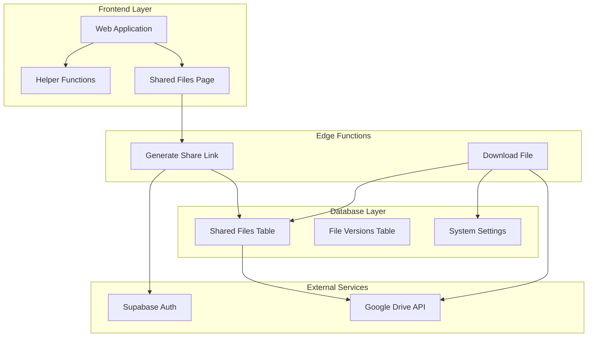
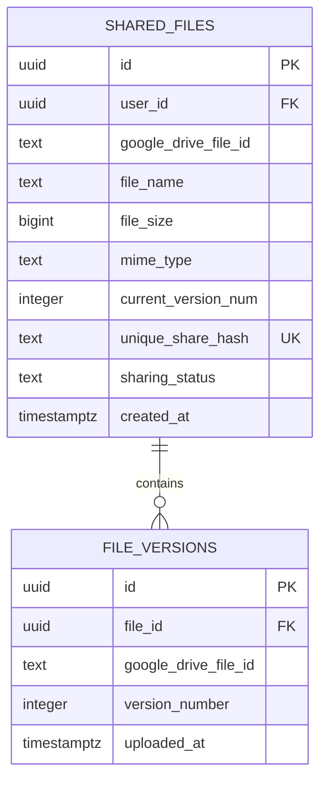
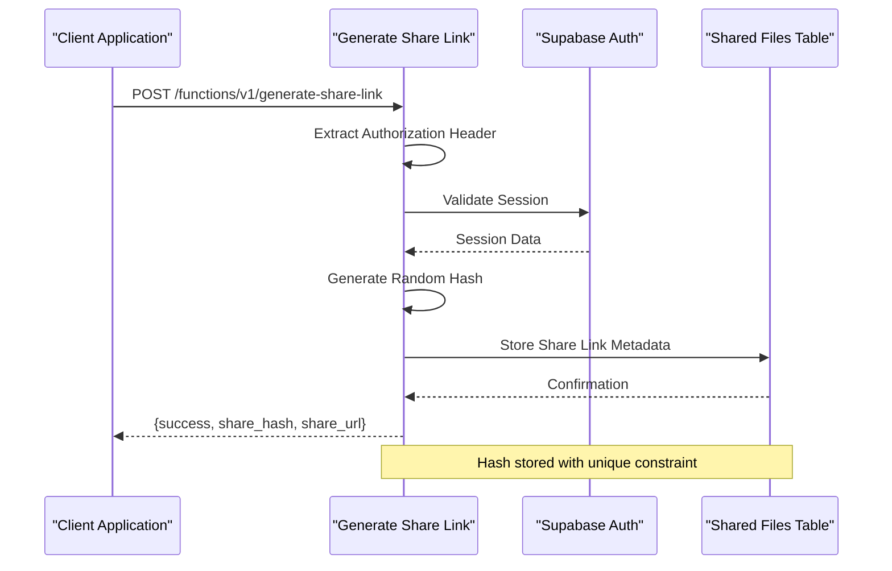
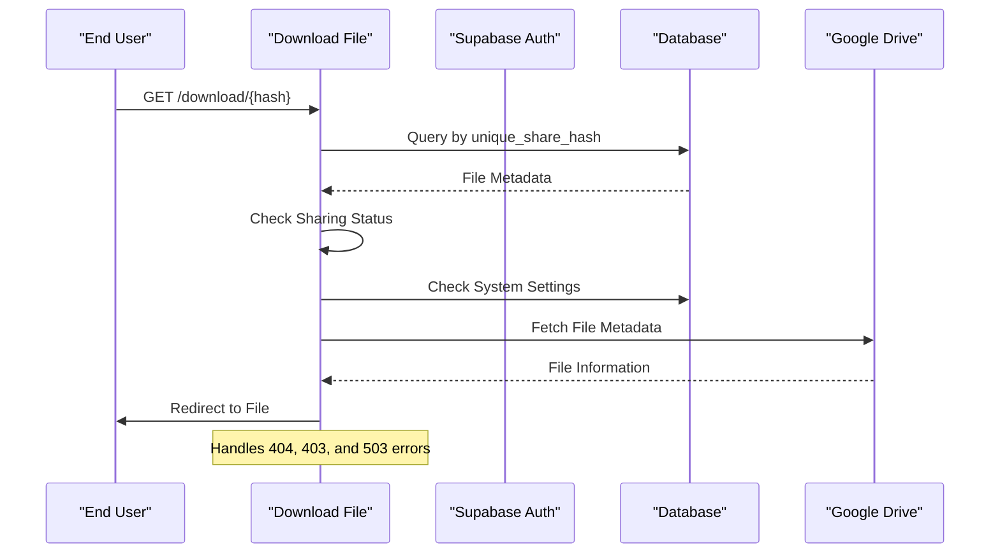
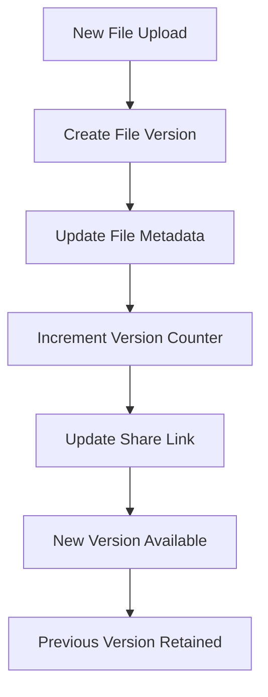
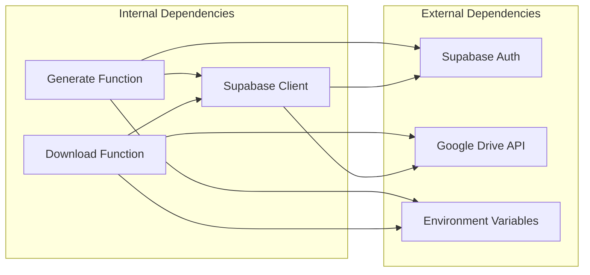

# Generate Share Link Function

<cite>
**Referenced Files in This Document**
- [generate-share-link/index.ts](file://supabase/functions/generate-share-link/index.ts)
- [download-file/index.ts](file://supabase/functions/download-file/index.ts)
- [helpers.js](file://web/src/utils/helpers.js)
- [SharedFilesPage.jsx](file://web/src/pages/SharedFilesPage.jsx)
- [001_initial_schema.sql](file://supabase/migrations/001_initial_schema.sql)
- [config.toml](file://supabase/config.toml)
</cite>

## Table of Contents
1. [Introduction](#introduction)
2. [Project Structure](#project-structure)
3. [Core Components](#core-components)
4. [Architecture Overview](#architecture-overview)
5. [Detailed Component Analysis](#detailed-component-analysis)
6. [Dependency Analysis](#dependency-analysis)
7. [Performance Considerations](#performance-considerations)
8. [Troubleshooting Guide](#troubleshooting-guide)
9. [Conclusion](#conclusion)

## Introduction
This document provides comprehensive technical documentation for the generate-share-link edge function, which creates secure shareable links for files stored in Google Drive through Supabase. The function generates cryptographically secure random hashes, validates user authentication, and produces share URLs that can be used to access files without requiring users to log in to the system.

The share link system consists of three primary components:
- **Generation Function**: Creates unique share hashes and returns share URLs
- **Validation Function**: Processes share requests and validates access permissions
- **Storage Schema**: Manages share permissions and file associations in the database

## Project Structure
The share link functionality spans multiple layers of the application architecture:

**Diagram sources**
- [generate-share-link/index.ts:1-55](file://supabase/functions/generate-share-link/index.ts#L1-L55)
- [download-file/index.ts:1-131](file://supabase/functions/download-file/index.ts#L1-L131)
- [001_initial_schema.sql:55-72](file://supabase/migrations/001_initial_schema.sql#L55-L72)

**Section sources**
- [generate-share-link/index.ts:1-55](file://supabase/functions/generate-share-link/index.ts#L1-L55)
- [download-file/index.ts:1-131](file://supabase/functions/download-file/index.ts#L1-L131)
- [001_initial_schema.sql:55-72](file://supabase/migrations/001_initial_schema.sql#L55-L72)

## Core Components

### Authentication and Authorization
The generate-share-link function implements strict authentication requirements:

- **JWT Verification**: Enabled in Supabase configuration for JWT verification
- **Session Validation**: Requires valid Supabase authentication session
- **Authorization Header**: Mandates presence of Authorization header with bearer token
- **User Session**: Validates active user session before generating share links

### Hash Generation Algorithm
The function employs a robust hashing mechanism:

- **Cryptographic Randomness**: Uses `crypto.randomUUID()` for cryptographically secure randomness
- **Length Optimization**: Removes hyphens and truncates to 12 characters for compact URLs
- **Uniqueness Guarantee**: Database enforces uniqueness constraint on share hash field
- **Collision Prevention**: 12-character hexadecimal string provides sufficient entropy

### Database Storage Structure
The shared_files table maintains share link metadata:

**Diagram sources**
- [001_initial_schema.sql:55-82](file://supabase/migrations/001_initial_schema.sql#L55-L82)

**Section sources**
- [001_initial_schema.sql:55-82](file://supabase/migrations/001_initial_schema.sql#L55-L82)

## Architecture Overview

### Share Link Generation Workflow
The share link creation process follows a secure, multi-stage workflow:

**Diagram sources**
- [generate-share-link/index.ts:9-44](file://supabase/functions/generate-share-link/index.ts#L9-L44)
- [001_initial_schema.sql:64-66](file://supabase/migrations/001_initial_schema.sql#L64-L66)

### Share Link Validation Workflow
The download process validates share links and manages access control:

**Diagram sources**
- [download-file/index.ts:9-130](file://supabase/functions/download-file/index.ts#L9-L130)
- [001_initial_schema.sql:170-173](file://supabase/migrations/001_initial_schema.sql#L170-L173)

## Detailed Component Analysis

### Generate Share Link Function

#### Request Processing
The function processes incoming requests with comprehensive validation:

**Authentication Flow:**
- Extracts Authorization header from request
- Validates presence of authentication token
- Establishes Supabase client with session context
- Confirms active user session before proceeding

**Hash Generation Process:**
- Generates cryptographically secure random identifier
- Removes hyphens for URL-friendly format
- Truncates to 12-character hexadecimal string
- Ensures collision resistance through database constraints

#### Response Structure
The function returns a structured JSON response containing:

| Field | Type | Description |
|-------|------|-------------|
| success | boolean | Indicates successful operation |
| share_hash | string | Generated 12-character unique hash |
| share_url | string | Complete URL path for file access |

#### Security Implementation
- **JWT Verification**: Configured in Supabase to validate tokens
- **CORS Headers**: Allows cross-origin requests for web integration
- **Session-Based Access**: Requires authenticated user session
- **Database Constraints**: Enforces unique hash values

**Section sources**
- [generate-share-link/index.ts:9-44](file://supabase/functions/generate-share-link/index.ts#L9-L44)
- [config.toml:13-14](file://supabase/config.toml#L13-L14)

### Database Schema and Permissions

#### Shared Files Table Structure
The database schema defines comprehensive file sharing capabilities:

**Core Fields:**
- `unique_share_hash`: Primary key for share identification
- `sharing_status`: Controls public/private access mode
- `current_version_num`: Tracks file version for downloads
- `google_drive_file_id`: Links to external Google Drive storage

**Security Policies:**
- Row Level Security enabled for all tables
- Owner-only access for file operations
- Public read access for share hash validation
- System-wide settings control for service availability

#### File Version Management
The system maintains version history for shareable files:

**Diagram sources**
- [001_initial_schema.sql:74-82](file://supabase/migrations/001_initial_schema.sql#L74-L82)

**Section sources**
- [001_initial_schema.sql:55-82](file://supabase/migrations/001_initial_schema.sql#L55-L82)

### Frontend Integration

#### URL Generation
The frontend generates complete share URLs using helper functions:

**URL Construction:**
- Base URL from environment configuration
- Hash-based path structure
- Consistent formatting across platforms

**User Interface Integration:**
- Copy-to-clipboard functionality
- Toggle between public/private sharing modes
- Real-time status updates for share operations

**Section sources**
- [helpers.js:31-34](file://web/src/utils/helpers.js#L31-L34)
- [SharedFilesPage.jsx:48-49](file://web/src/pages/SharedFilesPage.jsx#L48-L49)

## Dependency Analysis

### External Dependencies
The share link system relies on several external services:

**Diagram sources**
- [generate-share-link/index.ts:1-55](file://supabase/functions/generate-share-link/index.ts#L1-L55)
- [download-file/index.ts:1-131](file://supabase/functions/download-file/index.ts#L1-L131)

### Environment Configuration
Critical environment variables for proper operation:

| Variable | Purpose | Required |
|----------|---------|----------|
| SUPABASE_URL | Supabase project endpoint | Yes |
| SUPABASE_ANON_KEY | Anonymous access key | Yes |
| SUPABASE_SERVICE_ROLE_KEY | Admin access for validation | Yes |
| GOOGLE_API_KEY | Google Drive API access | Yes |

**Section sources**
- [download-file/index.ts:24-27](file://supabase/functions/download-file/index.ts#L24-L27)
- [generate-share-link/index.ts:20-24](file://supabase/functions/generate-share-link/index.ts#L20-L24)

## Performance Considerations

### Hash Generation Efficiency
- **Random Number Generation**: Uses browser crypto API for optimal performance
- **String Processing**: Minimal overhead with simple hyphen removal and truncation
- **Database Indexing**: Unique index on share hash enables fast lookups

### Scalability Factors
- **Hash Space**: 12-character hexadecimal provides 1.6 × 10^14 possible combinations
- **Collision Probability**: Extremely low with proper random generation
- **Database Constraints**: Enforces uniqueness without additional application logic

### Caching Strategy
- **Frontend Caching**: Share URLs cached in browser memory
- **CDN Integration**: Static assets served through CDN for improved performance
- **Database Optimization**: Indexed lookups minimize query times

## Troubleshooting Guide

### Common Issues and Solutions

#### Authentication Failures
**Symptoms:** "Missing authorization header" or "Not authenticated" errors
**Causes:**
- Missing Authorization header in request
- Expired or invalid authentication token
- User session not established

**Resolutions:**
- Verify authentication middleware is properly configured
- Check token validity and refresh if expired
- Ensure user is logged in before requesting share links

#### Hash Generation Problems
**Symptoms:** Duplicate hash errors or hash collisions
**Causes:**
- Database constraint violations
- Race conditions in concurrent requests
- Insufficient hash entropy

**Resolutions:**
- Implement retry logic with exponential backoff
- Monitor database constraint violations
- Consider increasing hash length if collisions occur

#### Database Connection Issues
**Symptoms:** Timeout errors or connection failures
**Causes:**
- Network connectivity problems
- Database overload
- Incorrect environment configuration

**Resolutions:**
- Verify environment variables are properly set
- Check database connection limits
- Implement connection pooling and retry mechanisms

#### Frontend Integration Problems
**Symptoms:** Share URLs not copying or redirecting incorrectly
**Causes:**
- Missing helper function implementation
- Incorrect URL construction
- Browser compatibility issues

**Resolutions:**
- Verify helper function is properly imported
- Check environment variable configuration
- Test across different browsers and devices

**Section sources**
- [generate-share-link/index.ts:45-53](file://supabase/functions/generate-share-link/index.ts#L45-L53)
- [download-file/index.ts:120-129](file://supabase/functions/download-file/index.ts#L120-L129)

## Conclusion

The generate-share-link edge function provides a secure, scalable solution for creating shareable file links. Its architecture balances security with performance through:

- **Robust Authentication**: JWT verification ensures only authenticated users can generate share links
- **Secure Hash Generation**: Cryptographically secure random identifiers prevent predictable patterns
- **Database Integrity**: Unique constraints guarantee hash uniqueness and prevent collisions
- **Flexible Access Control**: Public/private sharing modes accommodate various use cases
- **Frontend Integration**: Seamless URL generation and management through helper functions

The system's modular design allows for easy extension and maintenance while providing reliable file sharing capabilities for the Neo Files Transfer platform.