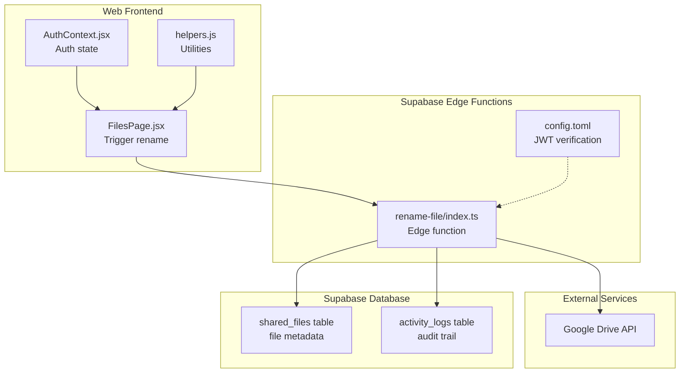
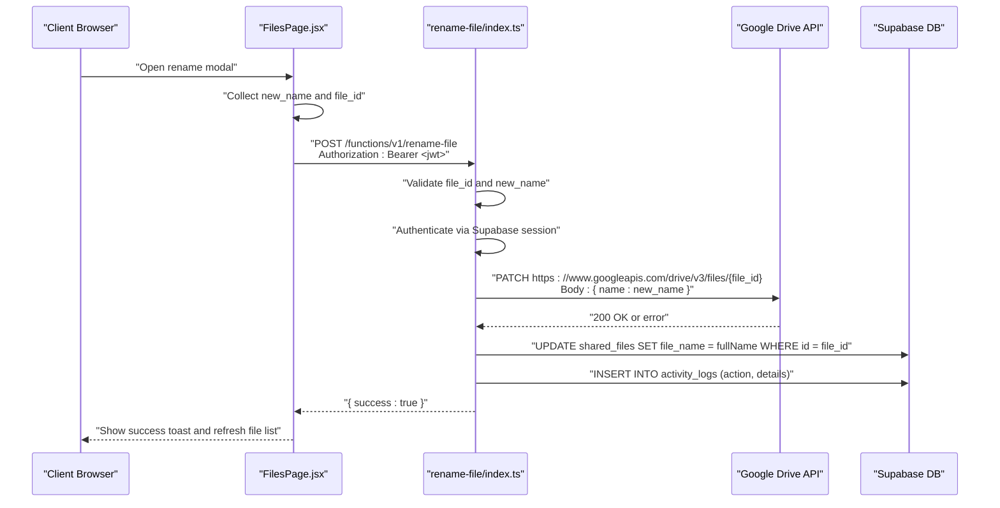
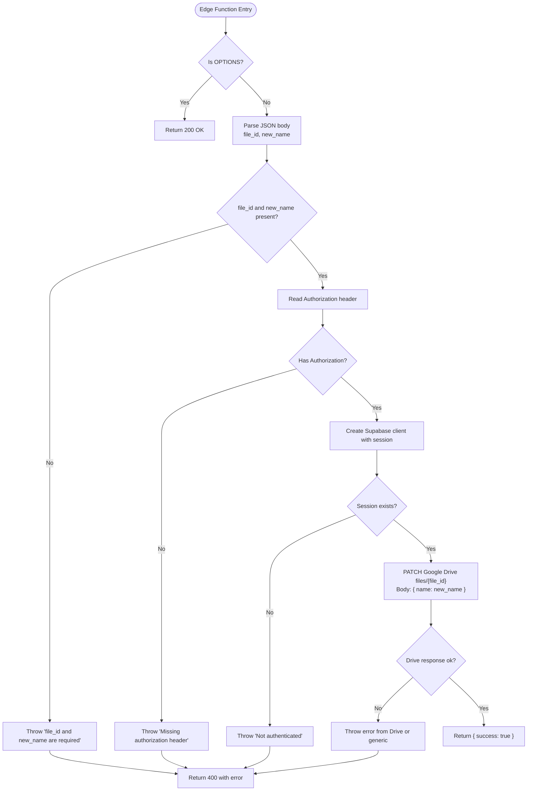
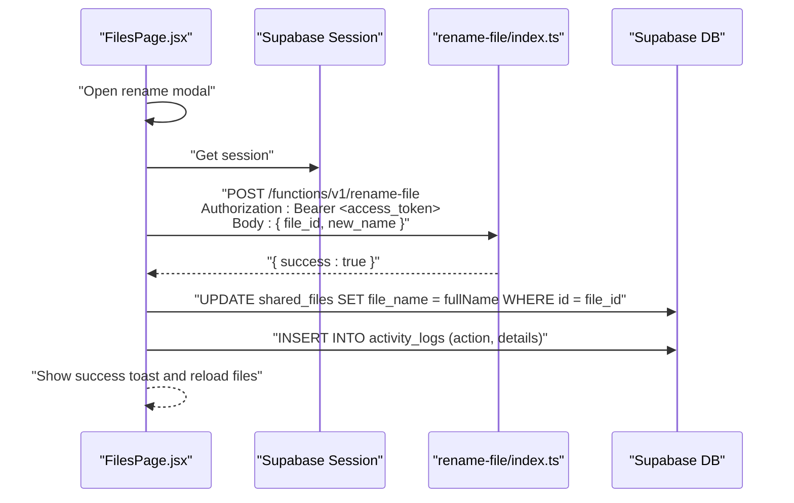
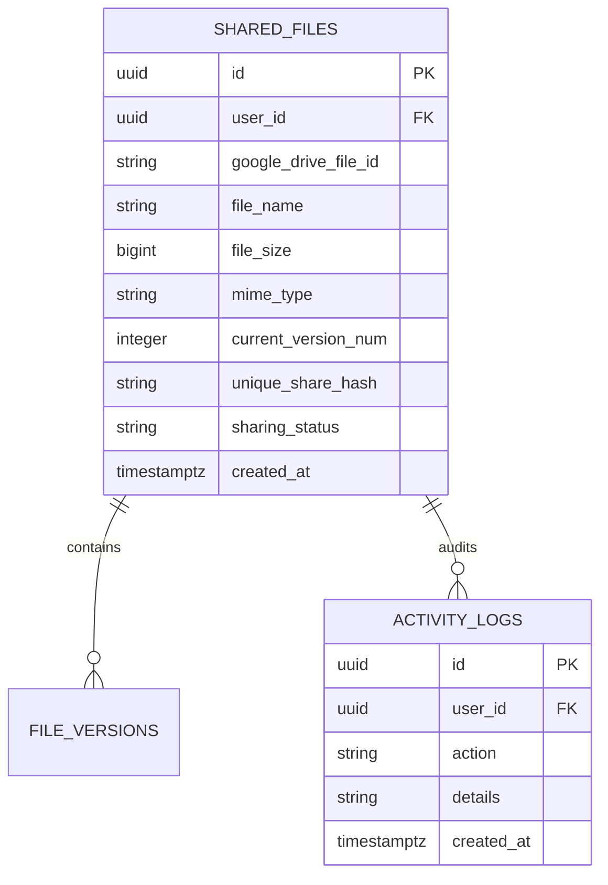
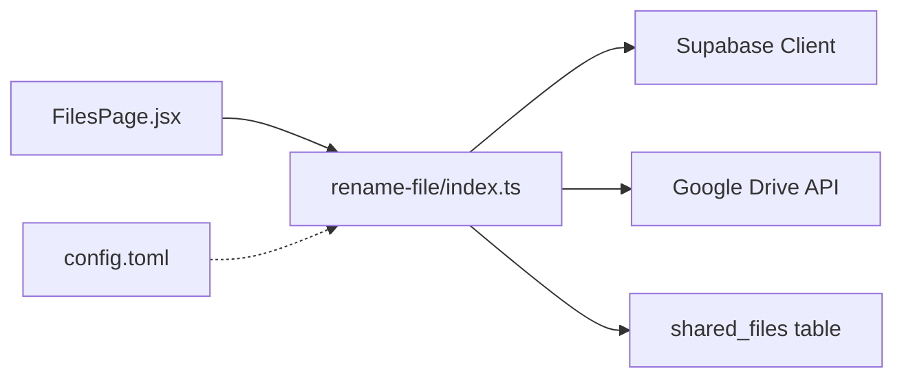

# Rename File Function

<cite>
**Referenced Files in This Document**
- [index.ts](file://supabase/functions/rename-file/index.ts)
- [config.toml](file://supabase/config.toml)
- [FilesPage.jsx](file://web/src/pages/FilesPage.jsx)
- [AuthContext.jsx](file://web/src/contexts/AuthContext.jsx)
- [helpers.js](file://web/src/utils/helpers.js)
- [001_initial_schema.sql](file://supabase/migrations/001_initial_schema.sql)
</cite>

## Table of Contents
1. [Introduction](#introduction)
2. [Project Structure](#project-structure)
3. [Core Components](#core-components)
4. [Architecture Overview](#architecture-overview)
5. [Detailed Component Analysis](#detailed-component-analysis)
6. [Dependency Analysis](#dependency-analysis)
7. [Performance Considerations](#performance-considerations)
8. [Troubleshooting Guide](#troubleshooting-guide)
9. [Conclusion](#conclusion)

## Introduction
This document describes the rename-file edge function that updates a file's name in Google Drive and synchronizes metadata in the Supabase database. It covers the complete flow from client request to backend processing, including authentication, Google Drive API updates, database synchronization, and error handling. It also provides request/response specifications, validation rules, and troubleshooting guidance for common failure scenarios.

## Project Structure
The rename functionality spans three layers:
- Frontend: Files page triggers the rename operation via a fetch call to the Supabase edge function.
- Edge Function: Validates inputs, authenticates the caller, calls the Google Drive API to rename the file, and returns a standardized response.
- Backend Database: Stores file metadata and is updated after a successful rename to keep local records synchronized with Google Drive.

**Diagram sources**
- [FilesPage.jsx:184-225](file://web/src/pages/FilesPage.jsx#L184-L225)
- [index.ts:9-73](file://supabase/functions/rename-file/index.ts#L9-L73)
- [config.toml:7-8](file://supabase/config.toml#L7-L8)
- [001_initial_schema.sql:56-71](file://supabase/migrations/001_initial_schema.sql#L56-L71)

**Section sources**
- [FilesPage.jsx:184-225](file://web/src/pages/FilesPage.jsx#L184-L225)
- [index.ts:9-73](file://supabase/functions/rename-file/index.ts#L9-L73)
- [config.toml:7-8](file://supabase/config.toml#L7-L8)
- [001_initial_schema.sql:56-71](file://supabase/migrations/001_initial_schema.sql#L56-L71)

## Core Components
- Edge Function (rename-file): Handles HTTP requests, validates inputs, verifies authentication, calls Google Drive API, and returns structured responses.
- Frontend Integration: Collects the new name, constructs the payload, and performs the fetch to the edge function while updating local database records afterward.
- Database Schema: Defines the shared_files table storing file metadata and the activity_logs table for audit trails.

Key responsibilities:
- Authentication: Uses Supabase session and Google OAuth token to authorize the Google Drive API call.
- Validation: Ensures required parameters are present and rejects malformed requests.
- Google Drive Update: Performs a PATCH request to change the file name.
- Metadata Synchronization: Updates the shared_files table with the new file name after a successful Google Drive rename.
- Error Handling: Returns standardized error messages for client-side UX.

**Section sources**
- [index.ts:14-73](file://supabase/functions/rename-file/index.ts#L14-L73)
- [FilesPage.jsx:184-225](file://web/src/pages/FilesPage.jsx#L184-L225)
- [001_initial_schema.sql:56-71](file://supabase/migrations/001_initial_schema.sql#L56-L71)

## Architecture Overview
The rename operation follows a strict order: validate inputs → authenticate → call Google Drive → update database → log activity → respond.

**Diagram sources**
- [FilesPage.jsx:184-225](file://web/src/pages/FilesPage.jsx#L184-L225)
- [index.ts:9-73](file://supabase/functions/rename-file/index.ts#L9-L73)
- [001_initial_schema.sql:56-71](file://supabase/migrations/001_initial_schema.sql#L56-L71)

## Detailed Component Analysis

### Edge Function: rename-file
Responsibilities:
- CORS handling for preflight OPTIONS requests.
- Request parsing and validation of required fields.
- Authentication via Supabase session and Google OAuth token extraction.
- Google Drive API PATCH call to rename the file.
- Response formatting and error propagation.

Processing logic:
- Input validation ensures both file_id and new_name are present.
- Extracts Authorization header and creates a Supabase client with session context.
- Retrieves provider_token from the session to call Google Drive.
- Calls Google Drive API with a PATCH request containing the new name.
- On success, returns a 200 OK with a success indicator.
- On failure, returns a 400 with an error message derived from Google Drive or a generic message.

**Diagram sources**
- [index.ts:9-73](file://supabase/functions/rename-file/index.ts#L9-L73)

**Section sources**
- [index.ts:9-73](file://supabase/functions/rename-file/index.ts#L9-L73)

### Frontend Integration: Files Page
Responsibilities:
- Opens the rename modal and collects the new name.
- Constructs the request payload with file_id and new_name.
- Sends the request to the edge function using the current Bearer token.
- After a successful response, updates the shared_files record with the new file name and inserts an activity log.
- Refreshes the file list to reflect the change.

Behavior highlights:
- Extracts the extension from the original file name and preserves it when constructing the full new name.
- Uses the Supabase session access_token for Authorization.
- Displays success or error feedback to the user.

**Diagram sources**
- [FilesPage.jsx:184-225](file://web/src/pages/FilesPage.jsx#L184-L225)

**Section sources**
- [FilesPage.jsx:184-225](file://web/src/pages/FilesPage.jsx#L184-L225)

### Database Schema: shared_files and activity_logs
The shared_files table stores per-user file metadata, including the Google Drive file ID, original file name, size, MIME type, current version number, and sharing status. The activity_logs table tracks user actions for auditing.

Key fields for rename:
- google_drive_file_id: Links the local record to the external Google Drive file.
- file_name: Updated by the frontend after a successful rename.
- user_id: Enforces ownership via row-level security policies.

**Diagram sources**
- [001_initial_schema.sql:56-71](file://supabase/migrations/001_initial_schema.sql#L56-L71)
- [001_initial_schema.sql:74-80](file://supabase/migrations/001_initial_schema.sql#L74-L80)
- [001_initial_schema.sql:85-94](file://supabase/migrations/001_initial_schema.sql#L85-L94)

**Section sources**
- [001_initial_schema.sql:56-71](file://supabase/migrations/001_initial_schema.sql#L56-L71)
- [001_initial_schema.sql:74-80](file://supabase/migrations/001_initial_schema.sql#L74-L80)
- [001_initial_schema.sql:85-94](file://supabase/migrations/001_initial_schema.sql#L85-L94)

## Dependency Analysis
- Edge Function depends on:
  - Supabase client for session validation.
  - Google Drive API for file renaming.
  - Environment variables for Supabase configuration.
- Frontend depends on:
  - Supabase session for Authorization.
  - Edge function endpoint for rename operations.
  - Database for metadata updates after successful rename.
- Configuration:
  - JWT verification enabled for the rename function.

**Diagram sources**
- [FilesPage.jsx:184-225](file://web/src/pages/FilesPage.jsx#L184-L225)
- [index.ts:26-30](file://supabase/functions/rename-file/index.ts#L26-L30)
- [config.toml:7-8](file://supabase/config.toml#L7-L8)

**Section sources**
- [FilesPage.jsx:184-225](file://web/src/pages/FilesPage.jsx#L184-L225)
- [index.ts:26-30](file://supabase/functions/rename-file/index.ts#L26-L30)
- [config.toml:7-8](file://supabase/config.toml#L7-L8)

## Performance Considerations
- Network latency dominates rename performance; the edge function makes a single synchronous HTTP call to Google Drive.
- Minimize redundant database writes by batching operations: the frontend updates the database only after a successful Google Drive rename.
- Keep payloads small: the request body contains only two fields, reducing overhead.
- Consider caching frequently accessed metadata (e.g., file names) in memory on the serverless edge function if usage increases substantially.

## Troubleshooting Guide

Common failure modes and resolutions:
- Missing authorization header:
  - Symptom: 400 error indicating missing authorization.
  - Resolution: Ensure the frontend sends the Authorization header with a valid Bearer token.
  - Section sources
    - [index.ts:21-24](file://supabase/functions/rename-file/index.ts#L21-L24)

- Not authenticated:
  - Symptom: 400 error stating the user is not authenticated.
  - Resolution: Verify the user session exists and the Supabase client is initialized with the session.
  - Section sources
    - [index.ts:32-35](file://supabase/functions/rename-file/index.ts#L32-L35)

- Invalid or missing parameters:
  - Symptom: 400 error indicating file_id and new_name are required.
  - Resolution: Ensure both fields are present in the request body.
  - Section sources
    - [index.ts:17-19](file://supabase/functions/rename-file/index.ts#L17-L19)

- Google Drive rename failure:
  - Symptom: 400 error with a message from Google Drive or a generic failure message.
  - Resolution: Check the Google Drive file_id validity, permissions, and quota limits. Retry after correcting the issue.
  - Section sources
    - [index.ts:52-55](file://supabase/functions/rename-file/index.ts#L52-L55)

- Permission errors:
  - Symptom: Google Drive returns an error indicating lack of permission to modify the file.
  - Resolution: Confirm the user has edit access to the file in Google Drive and the OAuth scopes include file access.
  - Section sources
    - [AuthContext.jsx:66-75](file://web/src/contexts/AuthContext.jsx#L66-L75)

- Database synchronization mismatch:
  - Symptom: Google Drive rename succeeds but the frontend still shows the old name.
  - Resolution: Ensure the frontend updates the shared_files record after receiving a successful response from the edge function.
  - Section sources
    - [FilesPage.jsx:208-212](file://web/src/pages/FilesPage.jsx#L208-L212)

Request and Response Specifications

- Endpoint
  - Method: POST
  - Path: /functions/v1/rename-file
  - Headers:
    - Authorization: Bearer <access_token>
    - Content-Type: application/json

- Request Body
  - file_id: string (required)
  - new_name: string (required)

- Successful Response
  - Status: 200
  - Body: { success: true }

- Error Response
  - Status: 400
  - Body: { error: string }

Validation Rules
- Required fields: file_id and new_name must be present.
- Ownership verification: Implicitly enforced by the Supabase session and Google Drive permissions.
- Filename validation: The edge function does not enforce filename-specific rules; pass a valid filename supported by Google Drive.

Examples

- Successful rename
  - Request: POST /functions/v1/rename-file with Authorization header and body containing file_id and new_name.
  - Response: 200 with { success: true }.
  - Frontend action: Updates shared_files record and activity_logs, then shows success toast.

- Permission error
  - Cause: User lacks edit permission for the Google Drive file.
  - Response: 400 with an error message from Google Drive.
  - Resolution: Grant appropriate permissions or use another file.

- Invalid parameters
  - Cause: Missing file_id or new_name.
  - Response: 400 with an error indicating missing required fields.
  - Resolution: Provide both fields in the request body.

**Section sources**
- [index.ts:14-73](file://supabase/functions/rename-file/index.ts#L14-L73)
- [FilesPage.jsx:184-225](file://web/src/pages/FilesPage.jsx#L184-L225)
- [AuthContext.jsx:66-75](file://web/src/contexts/AuthContext.jsx#L66-L75)

## Conclusion
The rename-file edge function provides a focused, secure mechanism to update a file’s name in Google Drive and synchronize metadata in the Supabase database. Its design emphasizes explicit validation, robust error handling, and clear separation of concerns between the frontend, edge function, and backend services. Following the troubleshooting steps and adhering to the request/response specifications will help ensure reliable rename operations across the application.