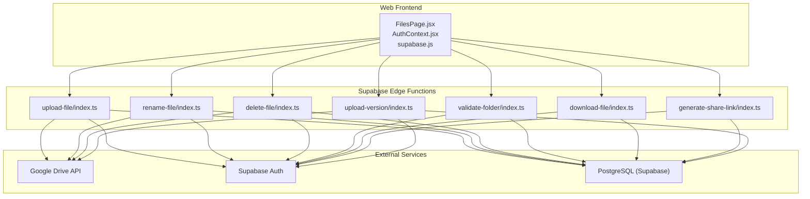
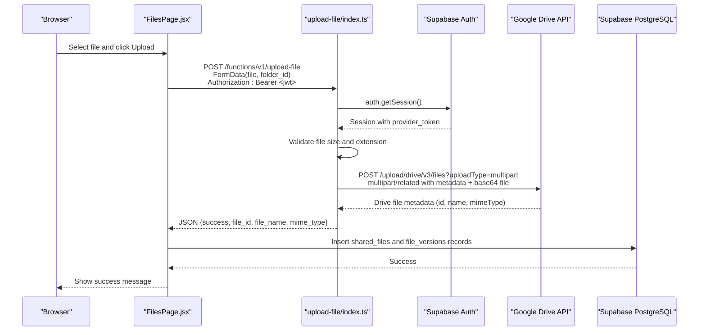
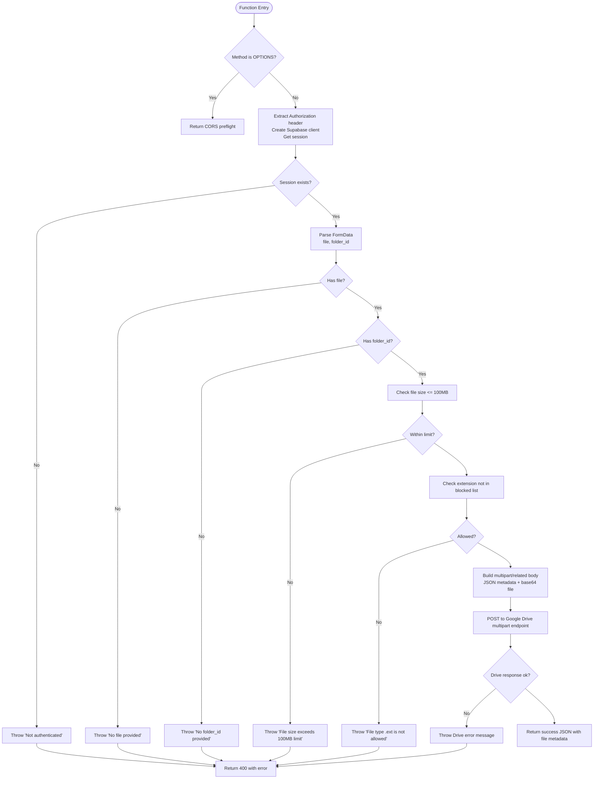
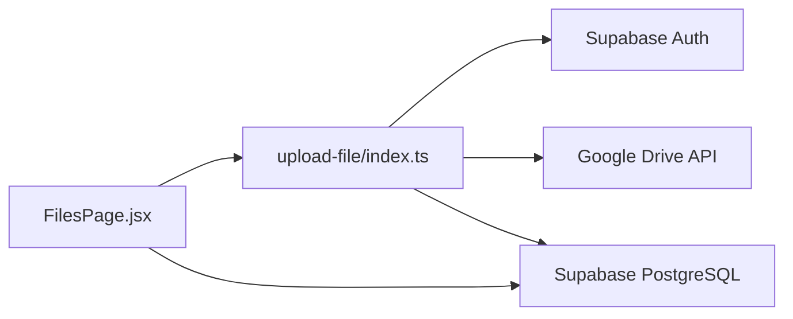

# Upload File Function

<cite>
**Referenced Files in This Document**
- [index.ts](file://supabase/functions/upload-file/index.ts)
- [index.ts](file://supabase/functions/delete-file/index.ts)
- [index.ts](file://supabase/functions/download-file/index.ts)
- [index.ts](file://supabase/functions/generate-share-link/index.ts)
- [index.ts](file://supabase/functions/rename-file/index.ts)
- [index.ts](file://supabase/functions/upload-version/index.ts)
- [index.ts](file://supabase/functions/validate-folder/index.ts)
- [config.toml](file://supabase/config.toml)
- [001_initial_schema.sql](file://supabase/migrations/001_initial_schema.sql)
- [FilesPage.jsx](file://web/src/pages/FilesPage.jsx)
- [AuthContext.jsx](file://web/src/contexts/AuthContext.jsx)
- [supabase.js](file://web/src/services/supabase.js)
</cite>

## Table of Contents
1. [Introduction](#introduction)
2. [Project Structure](#project-structure)
3. [Core Components](#core-components)
4. [Architecture Overview](#architecture-overview)
5. [Detailed Component Analysis](#detailed-component-analysis)
6. [Dependency Analysis](#dependency-analysis)
7. [Performance Considerations](#performance-considerations)
8. [Troubleshooting Guide](#troubleshooting-guide)
9. [Conclusion](#conclusion)
10. [Appendices](#appendices)

## Introduction
This document provides comprehensive technical documentation for the upload-file edge function. It explains the complete file upload workflow, including authentication verification, file validation (size limits, MIME types, blocked extensions), Google Drive integration, and multipart upload implementation. It also covers request/response schemas, parameter requirements, error handling strategies, security measures, practical examples, troubleshooting, performance considerations, rate limiting, and cost optimization.

## Project Structure
The upload-file function is part of a Supabase Edge Functions project that integrates with Google Drive for storage and Supabase for authentication and metadata management. The frontend interacts with the edge function to upload files and manage metadata in the database.

**Diagram sources**
- [index.ts](file://supabase/functions/upload-file/index.ts)
- [index.ts](file://supabase/functions/delete-file/index.ts)
- [index.ts](file://supabase/functions/rename-file/index.ts)
- [index.ts](file://supabase/functions/validate-folder/index.ts)
- [index.ts](file://supabase/functions/download-file/index.ts)
- [index.ts](file://supabase/functions/generate-share-link/index.ts)
- [index.ts](file://supabase/functions/upload-version/index.ts)
- [FilesPage.jsx](file://web/src/pages/FilesPage.jsx)
- [AuthContext.jsx](file://web/src/contexts/AuthContext.jsx)
- [supabase.js](file://web/src/services/supabase.js)

**Section sources**
- [index.ts](file://supabase/functions/upload-file/index.ts)
- [config.toml](file://supabase/config.toml)

## Core Components
- Authentication and Authorization: Uses Supabase Auth to verify sessions and extract provider tokens for Google Drive.
- File Validation: Enforces size limits and blocks specific file extensions.
- Google Drive Integration: Performs multipart uploads to Google Drive using the owner’s access token.
- Metadata Storage: Stores file metadata in Supabase tables after successful upload.
- CORS Handling: Provides cross-origin support for browser requests.

**Section sources**
- [index.ts](file://supabase/functions/upload-file/index.ts)
- [001_initial_schema.sql](file://supabase/migrations/001_initial_schema.sql)

## Architecture Overview
The upload workflow involves the frontend sending a multipart form request to the upload-file edge function. The function validates the request, verifies authentication, performs file checks, and uploads the file to Google Drive. On success, it returns metadata that the frontend uses to persist file records in Supabase.

**Diagram sources**
- [index.ts](file://supabase/functions/upload-file/index.ts)
- [FilesPage.jsx](file://web/src/pages/FilesPage.jsx)
- [001_initial_schema.sql](file://supabase/migrations/001_initial_schema.sql)

## Detailed Component Analysis

### Upload File Edge Function
The upload-file function orchestrates the entire upload process:
- Authentication: Extracts Authorization header, creates a Supabase client, and retrieves the session to obtain the Google access token.
- Request Parsing: Reads multipart form data to extract the file and folder_id.
- Validation: Checks for presence of file and folder_id, enforces size limit, and blocks specific extensions.
- Multipart Upload: Builds a multipart/related payload with JSON metadata and base64-encoded file content.
- Google Drive Upload: Sends the multipart payload to Google Drive API.
- Response: Returns success with file metadata or an error response.

**Diagram sources**
- [index.ts](file://supabase/functions/upload-file/index.ts)

**Section sources**
- [index.ts](file://supabase/functions/upload-file/index.ts)

### Request and Response Schema
- Endpoint: POST /functions/v1/upload-file
- Headers:
  - Authorization: Bearer <jwt>
  - Content-Type: multipart/form-data
- Form Fields:
  - file: File object (required)
  - folder_id: String (required)
- Success Response (200):
  - JSON: { success: true, file_id: string, file_name: string, mime_type: string }
- Error Response (400):
  - JSON: { error: string }

Notes:
- The function enforces a 100 MB file size limit and blocks specific extensions (e.g., apk, exe, bat, cmd, msi, scr).
- Allowed MIME types include PDF, DOCX, XLSX, PPTX, JPEG, PNG, MP4, ZIP, and compressed ZIP variants.

**Section sources**
- [index.ts](file://supabase/functions/upload-file/index.ts)

### Authentication Verification
- The function extracts the Authorization header and uses it to create a Supabase client.
- It calls auth.getSession() to verify the session and obtain provider_token, which is used for Google Drive API calls.
- JWT verification is enabled for this function in Supabase configuration.

**Section sources**
- [index.ts](file://supabase/functions/upload-file/index.ts)
- [config.toml](file://supabase/config.toml)

### File Validation
- Size Limit: Maximum 100 MB enforced via MAX_FILE_SIZE constant.
- Blocked Extensions: Specific extensions are rejected to prevent potentially harmful files.
- MIME Type Allowlist: Only specific MIME types are accepted; the function constructs the allowlist from constants.

**Section sources**
- [index.ts](file://supabase/functions/upload-file/index.ts)

### Google Drive Integration
- The function builds a multipart/related request with:
  - JSON metadata: name and parents (folder_id)
  - Base64-encoded file content
- It posts to Google Drive’s multipart upload endpoint using the user’s provider_token.
- On success, it returns the Drive file metadata (id, name, mimeType).

**Section sources**
- [index.ts](file://supabase/functions/upload-file/index.ts)

### Frontend Integration
- The frontend composes FormData with file and folder_id, sends it to the upload function, and upon success persists metadata in Supabase.
- It uses Supabase Auth to obtain the access token and sets Authorization header accordingly.

**Section sources**
- [FilesPage.jsx](file://web/src/pages/FilesPage.jsx)
- [AuthContext.jsx](file://web/src/contexts/AuthContext.jsx)
- [supabase.js](file://web/src/services/supabase.js)

## Dependency Analysis
The upload-file function depends on:
- Supabase Auth for session verification and provider_token extraction
- Google Drive API for file storage
- Supabase PostgreSQL for metadata persistence
- Frontend for initiating uploads and handling responses

**Diagram sources**
- [index.ts](file://supabase/functions/upload-file/index.ts)
- [FilesPage.jsx](file://web/src/pages/FilesPage.jsx)

**Section sources**
- [index.ts](file://supabase/functions/upload-file/index.ts)
- [001_initial_schema.sql](file://supabase/migrations/001_initial_schema.sql)

## Performance Considerations
- Memory Usage: The function loads the entire file into memory to compute base64. For large files near the 100 MB limit, consider streaming or chunked uploads to reduce memory pressure.
- Network Efficiency: Multipart uploads are efficient for small-to-medium files. For very large files, consider resumable uploads or direct uploads to minimize overhead.
- Concurrency: Edge Functions have concurrency limits; batch uploads and implement client-side retry/backoff to avoid overload.
- Caching: Reuse validated folder IDs and cached metadata where appropriate to reduce repeated Drive API calls.
- CDN and Delivery: After upload, leverage Google Drive’s webContentLink or export URLs for efficient delivery.

[No sources needed since this section provides general guidance]

## Troubleshooting Guide
Common Issues and Resolutions:
- Missing Authorization Header
  - Symptom: “Missing authorization header” error.
  - Cause: Frontend did not send Authorization header.
  - Fix: Ensure the frontend obtains and attaches the Supabase access token.
- Not Authenticated
  - Symptom: “Not authenticated” error.
  - Cause: Supabase session invalid or expired.
  - Fix: Re-authenticate the user and retry.
- No file provided
  - Symptom: “No file provided” error.
  - Cause: FormData missing file field.
  - Fix: Verify the frontend appends the File object to FormData.
- No folder_id provided
  - Symptom: “No folder_id provided” error.
  - Cause: FormData missing folder_id.
  - Fix: Ensure the frontend passes the destination folder ID.
- File size exceeds 100MB limit
  - Symptom: “File size exceeds 100MB limit” error.
  - Cause: File larger than configured limit.
  - Fix: Compress or split the file; inform users about the limit.
- File type .ext is not allowed
  - Symptom: “File type .ext is not allowed” error.
  - Cause: Extension is in the blocked list.
  - Fix: Choose an allowed file type or remove the restriction.
- Failed to upload to Google Drive
  - Symptom: Drive API error propagated as function error.
  - Causes: Insufficient permissions, invalid folder_id, quota limits.
  - Fix: Verify folder permissions and ownership; check Drive quotas; retry with smaller files.

**Section sources**
- [index.ts](file://supabase/functions/upload-file/index.ts)

## Conclusion
The upload-file edge function provides a robust, secure, and efficient mechanism for uploading files to Google Drive via Supabase. It enforces strong validation, integrates seamlessly with Supabase Auth and PostgreSQL, and offers clear error handling. By following the guidelines in this document—especially around authentication, validation, and performance—you can deploy reliable file uploads with predictable behavior and manageable costs.

[No sources needed since this section summarizes without analyzing specific files]

## Appendices

### Practical Examples
- Successful Upload
  - Request: POST /functions/v1/upload-file with FormData containing file and folder_id and Authorization header.
  - Response: { success: true, file_id: "...", file_name: "...", mime_type: "..." }
- Common Error Scenarios
  - Missing Authorization header: 400 with error message.
  - Not authenticated: 400 with error message.
  - No file provided: 400 with error message.
  - No folder_id provided: 400 with error message.
  - File size exceeds limit: 400 with error message.
  - Blocked extension: 400 with error message.
  - Drive upload failure: 400 with Drive error message.

**Section sources**
- [index.ts](file://supabase/functions/upload-file/index.ts)

### Related Functions and Data Model
- Related Functions: delete-file, rename-file, download-file, generate-share-link, upload-version, validate-folder.
- Data Model: shared_files and file_versions tables store file metadata and version history.

**Section sources**
- [index.ts](file://supabase/functions/delete-file/index.ts)
- [index.ts](file://supabase/functions/rename-file/index.ts)
- [index.ts](file://supabase/functions/download-file/index.ts)
- [index.ts](file://supabase/functions/generate-share-link/index.ts)
- [index.ts](file://supabase/functions/upload-version/index.ts)
- [index.ts](file://supabase/functions/validate-folder/index.ts)
- [001_initial_schema.sql](file://supabase/migrations/001_initial_schema.sql)