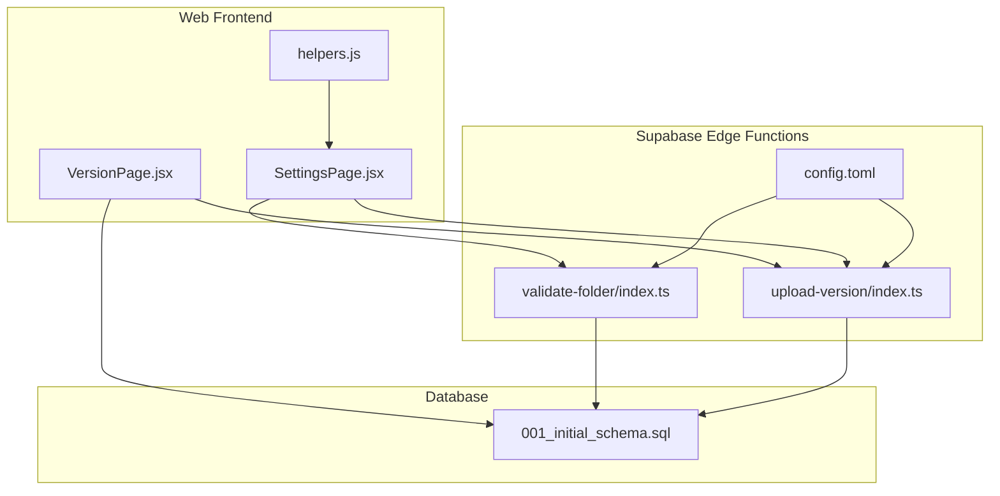
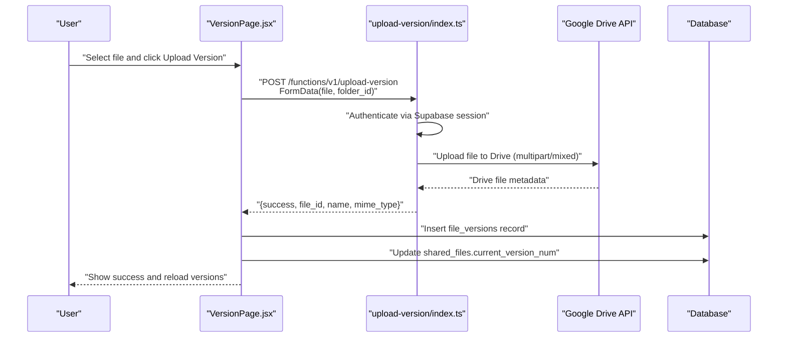
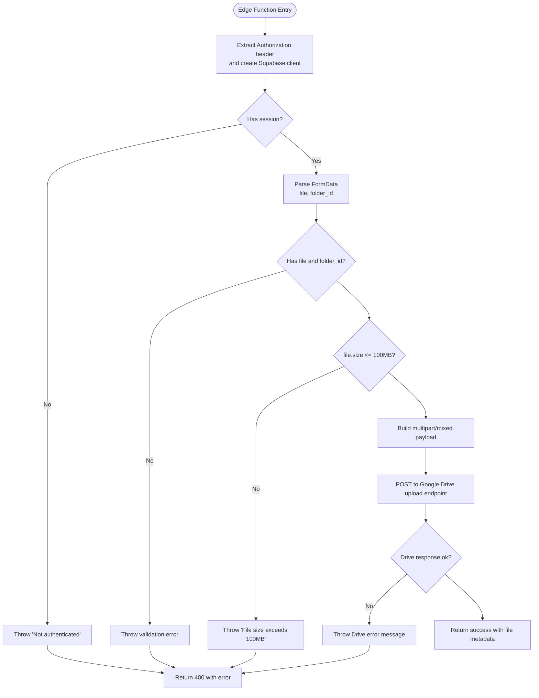
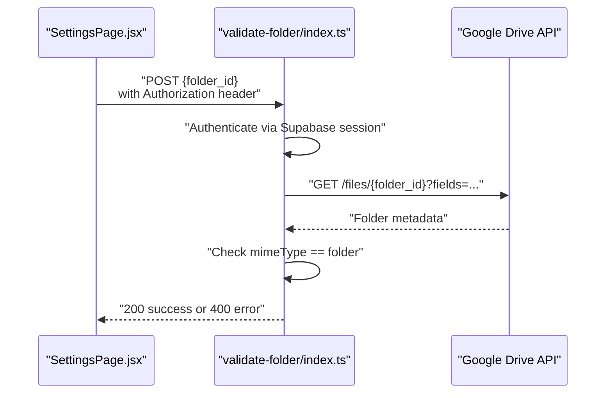
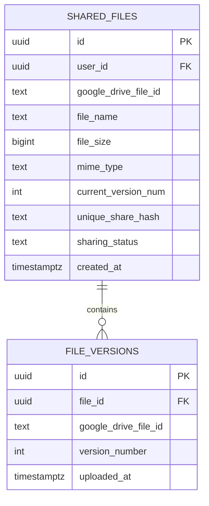
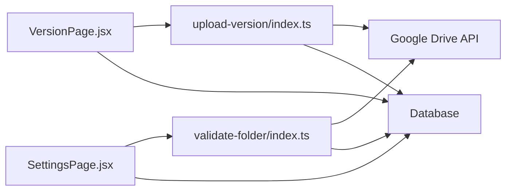

# Version Management Functions

<cite>
**Referenced Files in This Document**
- [upload-version/index.ts](file://supabase/functions/upload-version/index.ts)
- [validate-folder/index.ts](file://supabase/functions/validate-folder/index.ts)
- [001_initial_schema.sql](file://supabase/migrations/001_initial_schema.sql)
- [VersionPage.jsx](file://web/src/pages/VersionPage.jsx)
- [SettingsPage.jsx](file://web/src/pages/SettingsPage.jsx)
- [helpers.js](file://web/src/utils/helpers.js)
- [config.toml](file://supabase/config.toml)
</cite>

## Table of Contents
1. [Introduction](#introduction)
2. [Project Structure](#project-structure)
3. [Core Components](#core-components)
4. [Architecture Overview](#architecture-overview)
5. [Detailed Component Analysis](#detailed-component-analysis)
6. [Dependency Analysis](#dependency-analysis)
7. [Performance Considerations](#performance-considerations)
8. [Troubleshooting Guide](#troubleshooting-guide)
9. [Conclusion](#conclusion)

## Introduction
This document explains the version management edge functions that enable users to upload new versions of files while maintaining a single shareable link. It covers:
- The upload-version function for creating file versions in Google Drive and recording them in the database
- The validate-folder function for ensuring proper folder structure and permissions
- The complete version lifecycle from creation to cleanup
- Request/response specifications, parameter requirements, and error handling
- Examples of version creation and validation scenarios
- Troubleshooting guidance for common version management issues

## Project Structure
The version management feature spans frontend React components, Supabase edge functions, and database schemas:
- Frontend pages orchestrate user actions and communicate with edge functions
- Edge functions implement serverless logic for authentication, Google Drive uploads, and validations
- Database schema defines tables and policies for storing file versions and enforcing access controls

**Diagram sources**
- [VersionPage.jsx](file://web/src/pages/VersionPage.jsx)
- [SettingsPage.jsx](file://web/src/pages/SettingsPage.jsx)
- [helpers.js](file://web/src/utils/helpers.js)
- [upload-version/index.ts](file://supabase/functions/upload-version/index.ts)
- [validate-folder/index.ts](file://supabase/functions/validate-folder/index.ts)
- [config.toml](file://supabase/config.toml)
- [001_initial_schema.sql](file://supabase/migrations/001_initial_schema.sql)

**Section sources**
- [VersionPage.jsx](file://web/src/pages/VersionPage.jsx)
- [SettingsPage.jsx](file://web/src/pages/SettingsPage.jsx)
- [helpers.js](file://web/src/utils/helpers.js)
- [upload-version/index.ts](file://supabase/functions/upload-version/index.ts)
- [validate-folder/index.ts](file://supabase/functions/validate-folder/index.ts)
- [config.toml](file://supabase/config.toml)
- [001_initial_schema.sql](file://supabase/migrations/001_initial_schema.sql)

## Core Components
- upload-version edge function: Accepts a file and a Google Drive folder identifier, authenticates via Supabase, validates size limits, uploads to Google Drive using multipart/mixed, and returns the new file metadata.
- validate-folder edge function: Validates that a given Google Drive folder exists, is accessible, and is a folder (not a file), then returns folder details.
- Database schema: Defines shared_files and file_versions tables, with policies ensuring users can only access their own versions and files.
- Frontend integration: VersionPage.jsx orchestrates version uploads and updates database records; SettingsPage.jsx handles folder verification and saves the verified folder ID.

**Section sources**
- [upload-version/index.ts](file://supabase/functions/upload-version/index.ts)
- [validate-folder/index.ts](file://supabase/functions/validate-folder/index.ts)
- [001_initial_schema.sql](file://supabase/migrations/001_initial_schema.sql)
- [VersionPage.jsx](file://web/src/pages/VersionPage.jsx)
- [SettingsPage.jsx](file://web/src/pages/SettingsPage.jsx)

## Architecture Overview
The version lifecycle integrates frontend, edge functions, and database:
1. User selects a file in VersionPage.jsx and triggers upload-version.
2. The edge function authenticates, validates inputs, uploads to Google Drive, and returns metadata.
3. The frontend inserts a new row into file_versions and increments current_version_num in shared_files.
4. validate-folder ensures the configured Google Drive folder is valid and accessible before saving.

**Diagram sources**
- [VersionPage.jsx](file://web/src/pages/VersionPage.jsx)
- [upload-version/index.ts](file://supabase/functions/upload-version/index.ts)
- [001_initial_schema.sql](file://supabase/migrations/001_initial_schema.sql)

## Detailed Component Analysis

### upload-version Function
Purpose: Create a new version of a file in Google Drive under a specified folder and record it in the database.

Key behaviors:
- Authentication: Uses Authorization header to create a Supabase client and retrieve session provider_token
- Input validation: Requires file and folder_id; enforces 100 MB size limit
- Google Drive upload: Constructs multipart/mixed payload with metadata and base64-encoded file bytes
- Response: Returns success flag and file metadata; errors return 400 with message

Request specification:
- Method: POST
- Path: /functions/v1/upload-version
- Headers: Authorization: Bearer <JWT>, Content-Type: multipart/form-data
- Form fields:
  - file: File object (required)
  - folder_id: String (required)

Response specification:
- Success: 200 OK with JSON body containing success, file_id, file_name, mime_type
- Error: 400 Bad Request with JSON body containing error

Error handling:
- Missing authorization header
- Not authenticated
- Missing file or folder_id
- File size exceeds 100 MB
- Drive upload failure (non-OK response)

**Diagram sources**
- [upload-version/index.ts](file://supabase/functions/upload-version/index.ts)

**Section sources**
- [upload-version/index.ts](file://supabase/functions/upload-version/index.ts)
- [config.toml](file://supabase/config.toml)

### validate-folder Function
Purpose: Verify that a Google Drive folder exists, is accessible, and is actually a folder.

Key behaviors:
- Authentication: Uses Authorization header to create a Supabase client and retrieve session provider_token
- Validation: Calls Google Drive API to fetch folder metadata and checks mimeType equals application/vnd.google-apps.folder
- Response: Returns success with folder details; otherwise returns 400 with error

Request specification:
- Method: POST
- Path: /functions/v1/validate-folder
- Headers: Authorization: Bearer <JWT>, Content-Type: application/json
- Body: { folder_id: string }

Response specification:
- Success: 200 OK with JSON body containing success and folder object (id, name, mimeType)
- Error: 400 Bad Request with JSON body containing error

Error handling:
- Missing authorization header
- Not authenticated
- Missing folder_id
- Drive API returns non-OK response
- mimeType is not a folder

**Diagram sources**
- [validate-folder/index.ts](file://supabase/functions/validate-folder/index.ts)
- [SettingsPage.jsx](file://web/src/pages/SettingsPage.jsx)

**Section sources**
- [validate-folder/index.ts](file://supabase/functions/validate-folder/index.ts)
- [SettingsPage.jsx](file://web/src/pages/SettingsPage.jsx)
- [helpers.js](file://web/src/utils/helpers.js)

### Database Schema and Policies
Tables involved:
- shared_files: Stores original file metadata and current_version_num
- file_versions: Stores each version’s Google Drive file ID and version_number

Policies:
- Users can select/update/delete only their own shared_files
- Users can select/insert/delete only file_versions linked to their shared_files
- RLS enabled on all relevant tables

**Diagram sources**
- [001_initial_schema.sql](file://supabase/migrations/001_initial_schema.sql)

**Section sources**
- [001_initial_schema.sql](file://supabase/migrations/001_initial_schema.sql)

### Frontend Integration
- VersionPage.jsx:
  - Validates file size (100 MB)
  - Ensures profile.drive_folder_id is set
  - Calls upload-version edge function
  - Inserts a new file_versions record with incremented version_number
  - Updates shared_files.current_version_num
  - Logs activity
- SettingsPage.jsx:
  - Extracts folder ID from URL using helpers.js
  - Calls validate-folder edge function
  - Saves drive_folder_id and is_folder_verified to user_profiles

**Section sources**
- [VersionPage.jsx](file://web/src/pages/VersionPage.jsx)
- [SettingsPage.jsx](file://web/src/pages/SettingsPage.jsx)
- [helpers.js](file://web/src/utils/helpers.js)

## Dependency Analysis
- upload-version depends on:
  - Supabase client for session retrieval
  - Google Drive API for file uploads
  - Database for inserting file_versions and updating shared_files
- validate-folder depends on:
  - Supabase client for session retrieval
  - Google Drive API for folder validation
- Frontend components depend on:
  - Supabase client for authentication and database operations
  - Edge functions for serverless logic

**Diagram sources**
- [VersionPage.jsx](file://web/src/pages/VersionPage.jsx)
- [SettingsPage.jsx](file://web/src/pages/SettingsPage.jsx)
- [upload-version/index.ts](file://supabase/functions/upload-version/index.ts)
- [validate-folder/index.ts](file://supabase/functions/validate-folder/index.ts)
- [001_initial_schema.sql](file://supabase/migrations/001_initial_schema.sql)

**Section sources**
- [VersionPage.jsx](file://web/src/pages/VersionPage.jsx)
- [SettingsPage.jsx](file://web/src/pages/SettingsPage.jsx)
- [upload-version/index.ts](file://supabase/functions/upload-version/index.ts)
- [validate-folder/index.ts](file://supabase/functions/validate-folder/index.ts)
- [001_initial_schema.sql](file://supabase/migrations/001_initial_schema.sql)

## Performance Considerations
- File size limit: Enforced at both frontend and edge function level to prevent large payloads
- Single write per upload: The upload-version function writes only the Drive metadata; the frontend performs subsequent database writes to maintain version history and current version tracking
- Network efficiency: multipart/mixed upload avoids extra round trips by embedding metadata and file bytes

[No sources needed since this section provides general guidance]

## Troubleshooting Guide
Common issues and resolutions:
- Authentication failures:
  - Ensure Authorization header is present and valid
  - Verify JWT verification is enabled for the functions
- Missing or invalid folder:
  - Confirm folder_id is extracted correctly from the Drive URL
  - Use validate-folder to confirm accessibility and type
- File size exceeded:
  - Respect the 100 MB limit enforced by both frontend and edge function
- Drive upload failures:
  - Check network connectivity and Drive API availability
  - Inspect returned error messages for specific causes
- Database permission errors:
  - Ensure RLS policies allow the user to insert into file_versions and update shared_files

**Section sources**
- [upload-version/index.ts](file://supabase/functions/upload-version/index.ts)
- [validate-folder/index.ts](file://supabase/functions/validate-folder/index.ts)
- [config.toml](file://supabase/config.toml)
- [001_initial_schema.sql](file://supabase/migrations/001_initial_schema.sql)

## Conclusion
The version management functions provide a robust mechanism for uploading new versions of files while preserving the shareable link and maintaining version history. The upload-version function handles authentication, validation, and Google Drive integration, while validate-folder ensures folder integrity. Together with database policies and frontend orchestration, the system supports a secure and user-friendly version lifecycle.