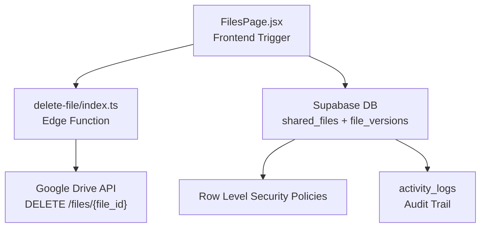
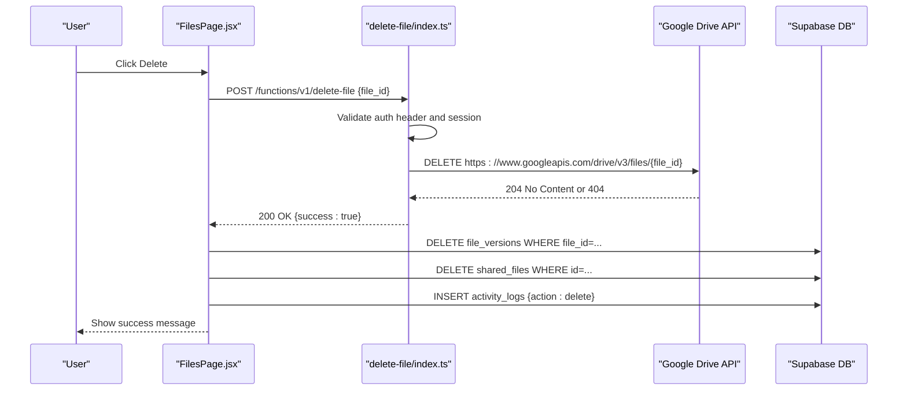
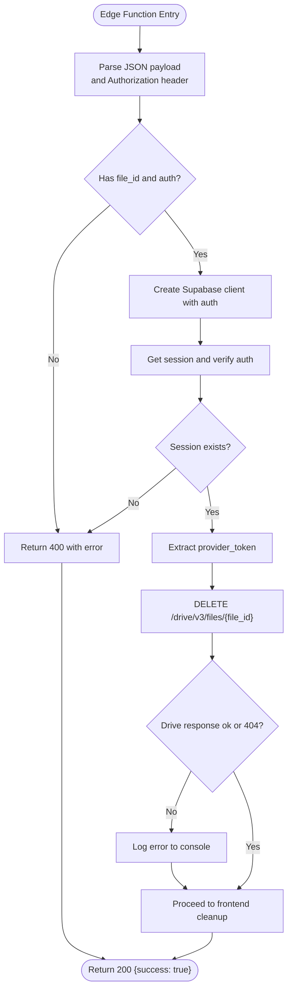
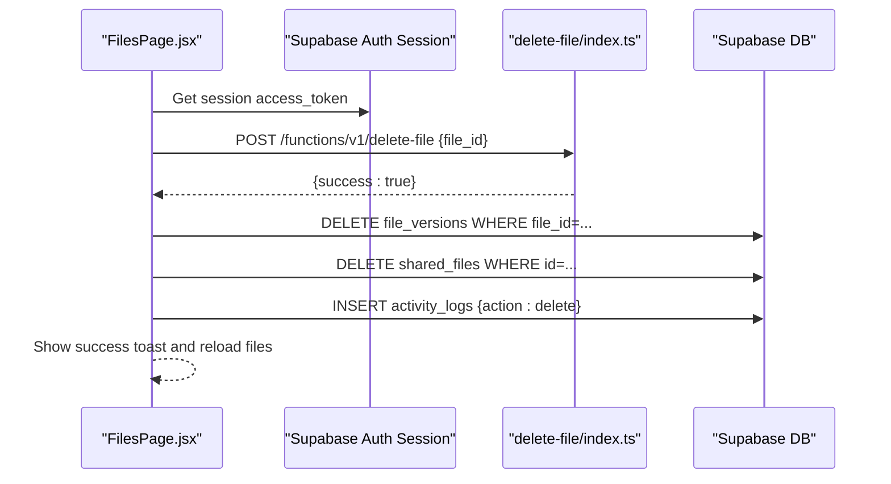
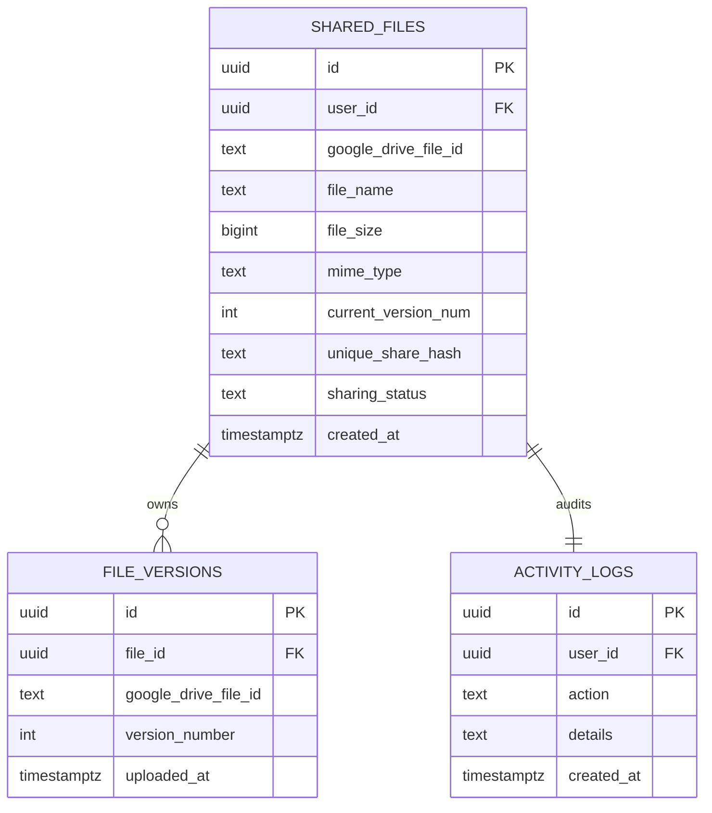
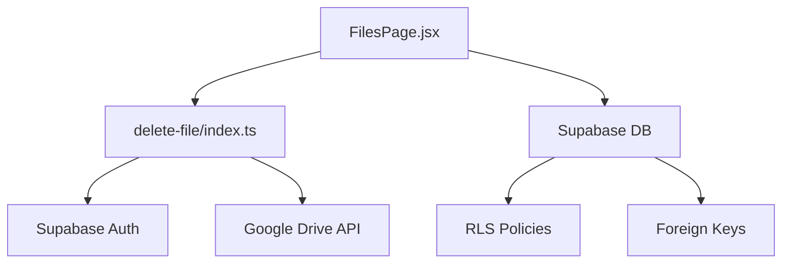

# File Deletion System

<cite>
**Referenced Files in This Document**
- [delete-file/index.ts](file://supabase/functions/delete-file/index.ts)
- [FilesPage.jsx](file://web/src/pages/FilesPage.jsx)
- [001_initial_schema.sql](file://supabase/migrations/001_initial_schema.sql)
- [config.toml](file://supabase/config.toml)
- [upload-version/index.ts](file://supabase/functions/upload-version/index.ts)
- [rename-file/index.ts](file://supabase/functions/rename-file/index.ts)
- [upload-file/index.ts](file://supabase/functions/upload-file/index.ts)
</cite>

## Table of Contents
1. [Introduction](#introduction)
2. [Project Structure](#project-structure)
3. [Core Components](#core-components)
4. [Architecture Overview](#architecture-overview)
5. [Detailed Component Analysis](#detailed-component-analysis)
6. [Dependency Analysis](#dependency-analysis)
7. [Performance Considerations](#performance-considerations)
8. [Troubleshooting Guide](#troubleshooting-guide)
9. [Security Considerations](#security-considerations)
10. [Recovery Mechanisms](#recovery-mechanisms)
11. [Conclusion](#conclusion)

## Introduction
This document provides comprehensive documentation for the file deletion system in the Neo Files Transfer application. It explains the deletion workflow across Google Drive, the Supabase database, and related version history. It also documents the edge function architecture for secure deletion, ownership verification, permission checks, and audit trail maintenance. The system supports both immediate deletion of Google Drive resources and database cleanup, with cascading effects handled by database foreign keys and row-level security policies.

## Project Structure
The deletion system spans three primary areas:
- Frontend trigger: A React page that initiates deletion via a Supabase Edge Function.
- Edge Function: An authenticated Deno-based function that deletes the file from Google Drive and returns a response.
- Backend (Database): Supabase tables and policies governing ownership, cascading deletes, and audit logging.

**Diagram sources**
- [FilesPage.jsx:227-264](file://web/src/pages/FilesPage.jsx#L227-L264)
- [delete-file/index.ts:9-71](file://supabase/functions/delete-file/index.ts#L9-L71)
- [001_initial_schema.sql:56-82](file://supabase/migrations/001_initial_schema.sql#L56-L82)

**Section sources**
- [FilesPage.jsx:227-264](file://web/src/pages/FilesPage.jsx#L227-L264)
- [delete-file/index.ts:9-71](file://supabase/functions/delete-file/index.ts#L9-L71)
- [001_initial_schema.sql:56-82](file://supabase/migrations/001_initial_schema.sql#L56-L82)

## Core Components
- Frontend deletion trigger: Sends a POST request to the delete-file Edge Function with the Google Drive file identifier. After successful deletion, it performs database cleanup by deleting related versions and the shared file record, and logs the action.
- Edge Function: Validates JWT, extracts the session, obtains the provider access token, and deletes the file from Google Drive. It logs non-404 errors and returns a success response regardless of Drive outcome.
- Database: The shared_files table stores ownership and Google Drive identifiers. The file_versions table maintains version history with a foreign key that enforces cascading deletes. Row-level security ensures users can only delete their own files. Activity logs capture deletion events.

Key implementation references:
- Deletion request from frontend: [FilesPage.jsx:232-244](file://web/src/pages/FilesPage.jsx#L232-L244)
- Database cleanup after deletion: [FilesPage.jsx:246-256](file://web/src/pages/FilesPage.jsx#L246-L256)
- Edge function deletion logic: [delete-file/index.ts:39-53](file://supabase/functions/delete-file/index.ts#L39-L53)
- Database schema and policies: [001_initial_schema.sql:56-82](file://supabase/migrations/001_initial_schema.sql#L56-L82)

**Section sources**
- [FilesPage.jsx:227-264](file://web/src/pages/FilesPage.jsx#L227-L264)
- [delete-file/index.ts:9-71](file://supabase/functions/delete-file/index.ts#L9-L71)
- [001_initial_schema.sql:56-82](file://supabase/migrations/001_initial_schema.sql#L56-L82)

## Architecture Overview
The deletion workflow integrates frontend, edge functions, external APIs, and database operations with strict ownership checks.

**Diagram sources**
- [FilesPage.jsx:227-264](file://web/src/pages/FilesPage.jsx#L227-L264)
- [delete-file/index.ts:9-71](file://supabase/functions/delete-file/index.ts#L9-L71)
- [001_initial_schema.sql:56-91](file://supabase/migrations/001_initial_schema.sql#L56-L91)

## Detailed Component Analysis

### Edge Function: delete-file
Responsibilities:
- Authentication: Extracts Authorization header, creates a Supabase client, and retrieves the session.
- Ownership verification: Relies on database RLS policies to ensure the user owns the file.
- Google Drive deletion: Issues a DELETE request to the Drive API using the provider access token.
- Error handling: Logs non-404 Drive errors and returns success to the client.

**Diagram sources**
- [delete-file/index.ts:9-71](file://supabase/functions/delete-file/index.ts#L9-L71)

**Section sources**
- [delete-file/index.ts:9-71](file://supabase/functions/delete-file/index.ts#L9-L71)

### Frontend Deletion Trigger: FilesPage.jsx
Responsibilities:
- Initiates deletion by calling the delete-file Edge Function with the Google Drive file identifier.
- Performs database cleanup by deleting file versions and the shared file record.
- Inserts an activity log entry for auditing.

**Diagram sources**
- [FilesPage.jsx:227-264](file://web/src/pages/FilesPage.jsx#L227-L264)

**Section sources**
- [FilesPage.jsx:227-264](file://web/src/pages/FilesPage.jsx#L227-L264)

### Database Schema and Policies
- shared_files: Stores ownership (user_id), Google Drive file identifier, and metadata. RLS policy restricts deletion to owners.
- file_versions: References shared_files with ON DELETE CASCADE, ensuring automatic cleanup of versions when a file is removed.
- activity_logs: Captures user actions including deletions for audit trails.
- RLS policies: Enforce that users can only delete their own files and versions.

**Diagram sources**
- [001_initial_schema.sql:56-91](file://supabase/migrations/001_initial_schema.sql#L56-L91)

**Section sources**
- [001_initial_schema.sql:56-82](file://supabase/migrations/001_initial_schema.sql#L56-L82)
- [001_initial_schema.sql:166-168](file://supabase/migrations/001_initial_schema.sql#L166-L168)
- [001_initial_schema.sql:196-204](file://supabase/migrations/001_initial_schema.sql#L196-L204)

### Relationship to Version History Management
- Cascading delete: When a shared_files record is deleted, all related file_versions records are automatically removed due to ON DELETE CASCADE.
- Version lifecycle: New versions are uploaded via upload-version, incrementing version numbers and creating new Drive entries. Deleting the parent file removes all versions automatically.

References:
- Cascade definition: [001_initial_schema.sql:76](file://supabase/migrations/001_initial_schema.sql#L76)
- Version upload flow: [upload-version/index.ts:89-104](file://supabase/functions/upload-version/index.ts#L89-L104)

**Section sources**
- [001_initial_schema.sql:76](file://supabase/migrations/001_initial_schema.sql#L76)
- [upload-version/index.ts:89-104](file://supabase/functions/upload-version/index.ts#L89-L104)

## Dependency Analysis
- Frontend depends on Supabase Edge Functions for deletion and on Supabase tables for database operations.
- Edge Function depends on Supabase Auth for session validation and Google Drive API for resource deletion.
- Database depends on RLS policies and foreign key constraints to maintain referential integrity.

**Diagram sources**
- [FilesPage.jsx:227-264](file://web/src/pages/FilesPage.jsx#L227-L264)
- [delete-file/index.ts:9-71](file://supabase/functions/delete-file/index.ts#L9-L71)
- [001_initial_schema.sql:56-82](file://supabase/migrations/001_initial_schema.sql#L56-L82)

**Section sources**
- [FilesPage.jsx:227-264](file://web/src/pages/FilesPage.jsx#L227-L264)
- [delete-file/index.ts:9-71](file://supabase/functions/delete-file/index.ts#L9-L71)
- [001_initial_schema.sql:56-82](file://supabase/migrations/001_initial_schema.sql#L56-L82)

## Performance Considerations
- Network latency: Deletion involves two external calls (Edge Function and Google Drive). Consider caching frequently accessed file metadata to reduce repeated queries.
- Batch operations: If bulk deletion is required, batch database deletions to minimize round trips.
- CDN and storage: Since files are stored in Google Drive, deletion speed depends on Drive's performance; the Edge Function returns immediately upon Drive response.

## Troubleshooting Guide
Common issues and resolutions:
- Authentication failures: Ensure the Authorization header is present and valid. The Edge Function requires a valid session.
- Drive deletion errors: Non-404 Drive errors are logged but do not fail the Edge Function response. Verify the provider token and file permissions.
- Orphaned records: If Drive deletion fails but database cleanup proceeds, re-sync by recreating the file record and uploading a new version. Alternatively, restore from backups if available.
- Audit gaps: Confirm activity logs are inserted after database cleanup to maintain accurate audit trails.

References:
- Authentication and session retrieval: [delete-file/index.ts:26-35](file://supabase/functions/delete-file/index.ts#L26-L35)
- Drive error logging: [delete-file/index.ts:50-53](file://supabase/functions/delete-file/index.ts#L50-L53)
- Database cleanup order: [FilesPage.jsx:246-256](file://web/src/pages/FilesPage.jsx#L246-L256)

**Section sources**
- [delete-file/index.ts:26-35](file://supabase/functions/delete-file/index.ts#L26-L35)
- [delete-file/index.ts:50-53](file://supabase/functions/delete-file/index.ts#L50-L53)
- [FilesPage.jsx:246-256](file://web/src/pages/FilesPage.jsx#L246-L256)

## Security Considerations
- JWT verification: All relevant functions (including delete-file) are configured to verify JWTs in the Supabase configuration.
- Ownership enforcement: RLS policies prevent users from deleting files they do not own. The delete-file Edge Function relies on these policies for enforcement.
- Provider tokens: The Edge Function uses the session's provider_token to authenticate with Google Drive, reducing risk of misuse.
- Audit trail: Activity logs capture deletion actions for compliance and monitoring.

References:
- JWT verification configuration: [config.toml:10-11](file://supabase/config.toml#L10-L11)
- Ownership policy for deletion: [001_initial_schema.sql:166-168](file://supabase/migrations/001_initial_schema.sql#L166-L168)
- Activity logging pattern: [FilesPage.jsx:252-256](file://web/src/pages/FilesPage.jsx#L252-L256)

**Section sources**
- [config.toml:10-11](file://supabase/config.toml#L10-L11)
- [001_initial_schema.sql:166-168](file://supabase/migrations/001_initial_schema.sql#L166-L168)
- [FilesPage.jsx:252-256](file://web/src/pages/FilesPage.jsx#L252-L256)

## Recovery Mechanisms
- Soft deletion strategy: Not implemented in the current codebase. To support recovery, introduce a deleted_at timestamp and a soft-delete flag on shared_files, and filter queries accordingly.
- Permanent deletion procedure: The current implementation permanently deletes Drive resources and database records. For recoverable deletion, keep Drive files and mark records as deleted.
- Version recovery: Since versions are tied to shared_files and cascade on delete, restoring a file restores all versions. For partial recovery, recreate versions from Drive snapshots if available.

References:
- Cascade behavior: [001_initial_schema.sql:76](file://supabase/migrations/001_initial_schema.sql#L76)
- Current deletion behavior: [FilesPage.jsx:246-256](file://web/src/pages/FilesPage.jsx#L246-L256)

**Section sources**
- [001_initial_schema.sql:76](file://supabase/migrations/001_initial_schema.sql#L76)
- [FilesPage.jsx:246-256](file://web/src/pages/FilesPage.jsx#L246-L256)

## Conclusion
The file deletion system combines a straightforward frontend trigger with a secure Edge Function and robust database policies. While Drive deletion is immediate and database cleanup is explicit, the system lacks built-in soft deletion and recovery mechanisms. Enhancements could include soft deletion flags, recovery workflows, and improved error handling for Drive failures to ensure resilient and auditable file lifecycle management.