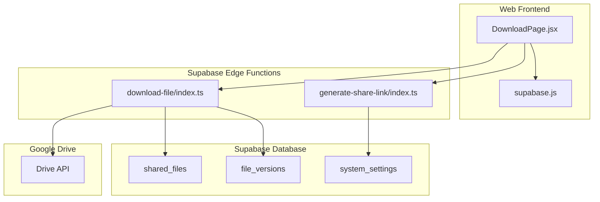
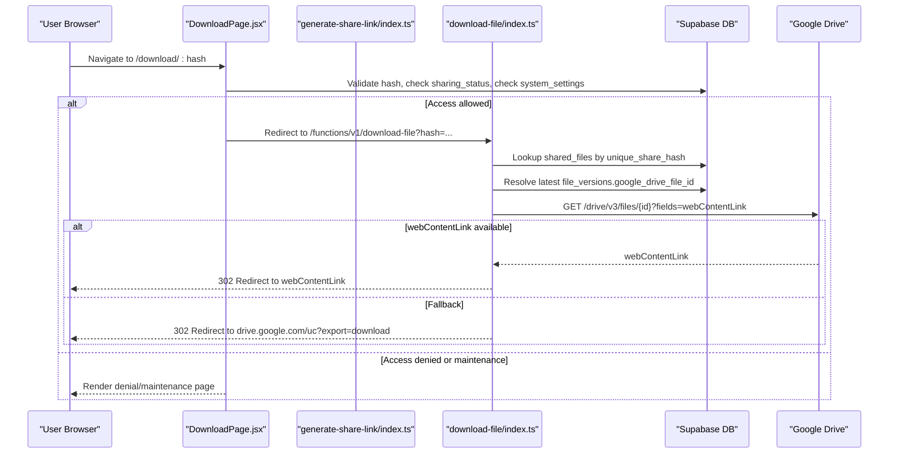
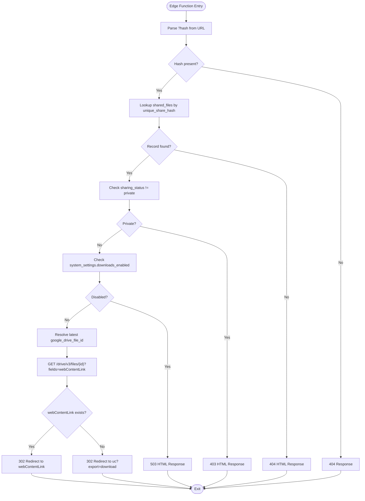
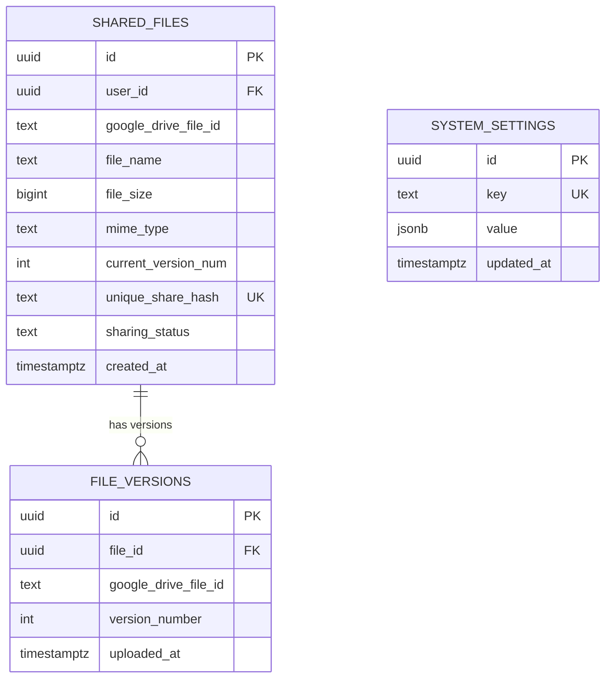
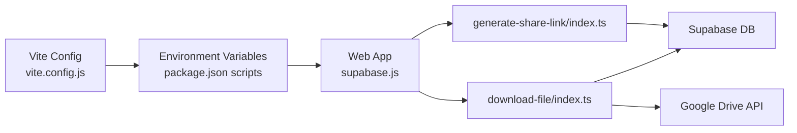

# File Download Processing

<cite>
**Referenced Files in This Document**
- [download-file/index.ts](file://supabase/functions/download-file/index.ts)
- [generate-share-link/index.ts](file://supabase/functions/generate-share-link/index.ts)
- [DownloadPage.jsx](file://web/src/pages/DownloadPage.jsx)
- [supabase.js](file://web/src/services/supabase.js)
- [001_initial_schema.sql](file://supabase/migrations/001_initial_schema.sql)
- [config.toml](file://supabase/config.toml)
- [upload-file/index.ts](file://supabase/functions/upload-file/index.ts)
- [delete-file/index.ts](file://supabase/functions/delete-file/index.ts)
- [rename-file/index.ts](file://supabase/functions/rename-file/index.ts)
- [vite.config.js](file://web/vite.config.js)
- [package.json](file://web/package.json)
</cite>

## Table of Contents
1. [Introduction](#introduction)
2. [Project Structure](#project-structure)
3. [Core Components](#core-components)
4. [Architecture Overview](#architecture-overview)
5. [Detailed Component Analysis](#detailed-component-analysis)
6. [Dependency Analysis](#dependency-analysis)
7. [Performance Considerations](#performance-considerations)
8. [Troubleshooting Guide](#troubleshooting-guide)
9. [Conclusion](#conclusion)

## Introduction
This document explains the file download processing system that enables secure public link-based access to files stored in Google Drive. It covers the complete workflow from generating a shareable link to delivering the file to users, including edge function implementation, hash-based lookup, access control validation, and integration with Supabase for metadata management. It also documents error handling, performance considerations, and bandwidth-related best practices.

## Project Structure
The system spans two primary areas:
- Supabase Edge Functions: Serverless handlers for generating share links and processing downloads.
- Web Frontend: React-based client that validates access locally and triggers the download edge function.

**Diagram sources**
- [DownloadPage.jsx:1-158](file://web/src/pages/DownloadPage.jsx#L1-L158)
- [supabase.js:1-7](file://web/src/services/supabase.js#L1-L7)
- [generate-share-link/index.ts:1-55](file://supabase/functions/generate-share-link/index.ts#L1-L55)
- [download-file/index.ts:1-131](file://supabase/functions/download-file/index.ts#L1-L131)
- [001_initial_schema.sql:55-122](file://supabase/migrations/001_initial_schema.sql#L55-L122)

**Section sources**
- [DownloadPage.jsx:1-158](file://web/src/pages/DownloadPage.jsx#L1-L158)
- [supabase.js:1-7](file://web/src/services/supabase.js#L1-L7)
- [generate-share-link/index.ts:1-55](file://supabase/functions/generate-share-link/index.ts#L1-L55)
- [download-file/index.ts:1-131](file://supabase/functions/download-file/index.ts#L1-L131)
- [001_initial_schema.sql:55-122](file://supabase/migrations/001_initial_schema.sql#L55-L122)

## Core Components
- Download Edge Function: Validates the share hash, checks access controls, resolves the latest Google Drive file identifier, and redirects to Google Drive for efficient streaming.
- Share Link Generation Function: Creates a unique share hash and returns a public URL for download resolution.
- Web Download Page: Performs local validation (access control and maintenance mode), determines the latest Google Drive file ID, and triggers the download edge function.
- Supabase Metadata: Stores shared file metadata, versions, and system settings controlling availability.
- Google Drive Integration: Uses Drive API endpoints to obtain redirect URLs for efficient file delivery.

**Section sources**
- [download-file/index.ts:9-131](file://supabase/functions/download-file/index.ts#L9-L131)
- [generate-share-link/index.ts:9-55](file://supabase/functions/generate-share-link/index.ts#L9-L55)
- [DownloadPage.jsx:11-73](file://web/src/pages/DownloadPage.jsx#L11-L73)
- [001_initial_schema.sql:55-122](file://supabase/migrations/001_initial_schema.sql#L55-L122)

## Architecture Overview
The download pipeline is designed to minimize server-side processing by delegating file delivery to Google Drive while retaining access control and metadata checks in Supabase.

**Diagram sources**
- [DownloadPage.jsx:11-73](file://web/src/pages/DownloadPage.jsx#L11-L73)
- [download-file/index.ts:9-131](file://supabase/functions/download-file/index.ts#L9-L131)
- [001_initial_schema.sql:55-122](file://supabase/migrations/001_initial_schema.sql#L55-L122)

## Detailed Component Analysis

### Download Edge Function
Responsibilities:
- Parse the share hash from query parameters.
- Use a service role client to bypass RLS and query shared_files by unique_share_hash.
- Validate sharing_status and system_settings (downloads_enabled).
- Determine the latest Google Drive file identifier from file_versions or shared_files.
- Attempt to obtain a direct webContentLink via Drive API; otherwise fall back to a standard export URL.
- Redirect the client to Google Drive for optimized streaming.

Key behaviors:
- Hash-based lookup ensures O(1) access via unique_share_hash index.
- Redirects avoid server-side file streaming, reducing bandwidth and latency.
- Graceful fallbacks handle missing webContentLink or API errors.

**Diagram sources**
- [download-file/index.ts:9-131](file://supabase/functions/download-file/index.ts#L9-L131)

**Section sources**
- [download-file/index.ts:9-131](file://supabase/functions/download-file/index.ts#L9-L131)

### Share Link Generation Function
Responsibilities:
- Authenticate the caller using JWT via Supabase auth.getSession().
- Generate a unique share hash and return a public share URL pattern (/download/:hash).
- Enforce CORS headers for cross-origin requests.

Security and validation:
- Requires Authorization header; rejects without it.
- Uses Supabase auth session to confirm identity.

**Section sources**
- [generate-share-link/index.ts:9-55](file://supabase/functions/generate-share-link/index.ts#L9-L55)

### Web Download Page
Responsibilities:
- Extract the share hash from route parameters.
- Validate access locally against shared_files and system_settings.
- Determine the latest Google Drive file ID from file_versions.
- Redirect to the download edge function endpoint to trigger the optimized download pipeline.

UI states:
- Loading, downloading, denied, maintenance, not found, error.

**Section sources**
- [DownloadPage.jsx:11-73](file://web/src/pages/DownloadPage.jsx#L11-L73)

### Supabase Metadata Model
Tables involved:
- shared_files: Stores file metadata, unique_share_hash, sharing_status, and current version number.
- file_versions: Stores historical Google Drive file identifiers per version.
- system_settings: Controls availability (downloads_enabled).

Policies:
- Row Level Security enabled; public select policy for shared_files by share hash.
- Authenticated policies for CRUD operations on shared_files and file_versions.

**Diagram sources**
- [001_initial_schema.sql:55-122](file://supabase/migrations/001_initial_schema.sql#L55-L122)

**Section sources**
- [001_initial_schema.sql:55-122](file://supabase/migrations/001_initial_schema.sql#L55-L122)

### Google Drive Integration
- The download edge function attempts to fetch webContentLink from the Drive API for direct streaming.
- If unavailable, it falls back to a standard export URL to ensure delivery.
- This approach leverages Google’s CDN and reduces server bandwidth.

**Section sources**
- [download-file/index.ts:88-118](file://supabase/functions/download-file/index.ts#L88-L118)

### Supporting Functions (for completeness)
- Upload File: Validates size/type, uploads to Drive via multipart, returns metadata.
- Rename/Delete File: Updates/Deletes Drive file metadata using provider tokens.

These functions support the lifecycle around shared files but are not part of the download pipeline.

**Section sources**
- [upload-file/index.ts:24-152](file://supabase/functions/upload-file/index.ts#L24-L152)
- [rename-file/index.ts:9-74](file://supabase/functions/rename-file/index.ts#L9-L74)
- [delete-file/index.ts:9-72](file://supabase/functions/delete-file/index.ts#L9-L72)

## Dependency Analysis
Runtime and configuration dependencies:
- Supabase Edge Functions rely on Supabase client libraries and environment variables for service keys and Drive API keys.
- The web app depends on Supabase JS client and environment variables exposed via Vite.
- Edge function verification is configured per function in Supabase config.

**Diagram sources**
- [vite.config.js:1-11](file://web/vite.config.js#L1-L11)
- [package.json:1-29](file://web/package.json#L1-L29)
- [supabase.js:1-7](file://web/src/services/supabase.js#L1-L7)
- [generate-share-link/index.ts:1-55](file://supabase/functions/generate-share-link/index.ts#L1-L55)
- [download-file/index.ts:1-131](file://supabase/functions/download-file/index.ts#L1-L131)
- [config.toml:1-21](file://supabase/config.toml#L1-L21)

**Section sources**
- [vite.config.js:1-11](file://web/vite.config.js#L1-L11)
- [package.json:1-29](file://web/package.json#L1-L29)
- [supabase.js:1-7](file://web/src/services/supabase.js#L1-L7)
- [config.toml:1-21](file://supabase/config.toml#L1-L21)

## Performance Considerations
- Prefer redirects over server-side streaming: The download edge function redirects to Google Drive, minimizing server bandwidth and CPU usage.
- Efficient lookups: unique_share_hash is indexed; queries resolve quickly.
- Latest version resolution: Resolving the most recent Google Drive file ID avoids outdated identifiers and reduces retries.
- CDN offload: Using Drive’s native webContentLink or export URL leverages Google’s global CDN.
- Frontend pre-checks: The web page validates access and maintenance mode before invoking the edge function, reducing unnecessary backend calls.

[No sources needed since this section provides general guidance]

## Troubleshooting Guide
Common scenarios and handling:
- Missing hash or invalid link:
  - The download edge function returns a 404 response when hash is absent or record not found.
  - The web page renders a not found state.
- Access denied (private files):
  - The download edge function returns a 403 response for private files.
  - The web page renders a denial state.
- Maintenance or disabled downloads:
  - The download edge function returns a 503 response when downloads are disabled.
  - The web page renders a maintenance state.
- Authentication failures:
  - The share link generator requires a valid Authorization header; errors are returned with 400 status.
- Drive API errors:
  - If webContentLink is unavailable, the function falls back to a standard export URL; errors are logged and a generic 500 response is returned on unexpected exceptions.

Operational tips:
- Verify environment variables for Supabase and Google Drive API keys.
- Confirm RLS policies and indexes are intact after migrations.
- Monitor Drive API quotas and consider rate limiting on the client.

**Section sources**
- [download-file/index.ts:19-44](file://supabase/functions/download-file/index.ts#L19-L44)
- [download-file/index.ts:64-72](file://supabase/functions/download-file/index.ts#L64-L72)
- [download-file/index.ts:120-129](file://supabase/functions/download-file/index.ts#L120-L129)
- [generate-share-link/index.ts:16-29](file://supabase/functions/generate-share-link/index.ts#L16-L29)
- [generate-share-link/index.ts:45-53](file://supabase/functions/generate-share-link/index.ts#L45-L53)
- [DownloadPage.jsx:21-44](file://web/src/pages/DownloadPage.jsx#L21-L44)

## Conclusion
The file download system combines Supabase metadata and access control with Google Drive’s efficient delivery infrastructure. By validating access at the edge and redirecting clients directly to Drive, it achieves low-latency, scalable downloads while maintaining robust security and operational controls. The design minimizes server resources and leverages CDN capabilities for optimal bandwidth utilization.