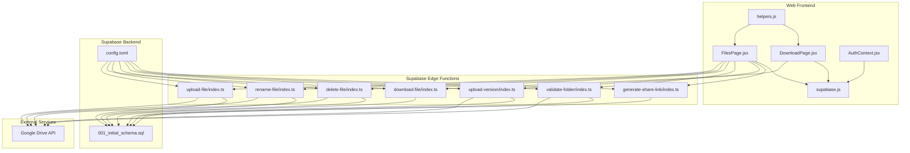
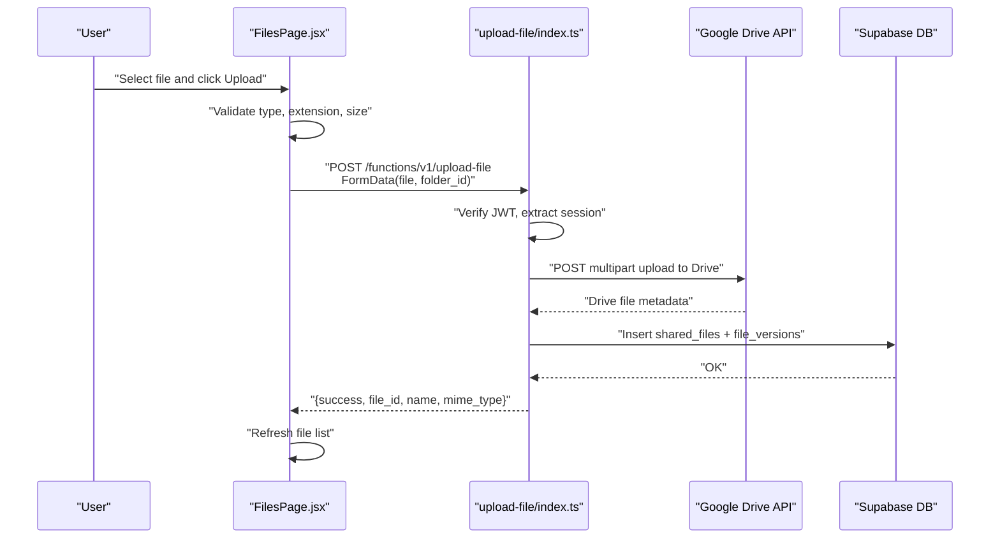
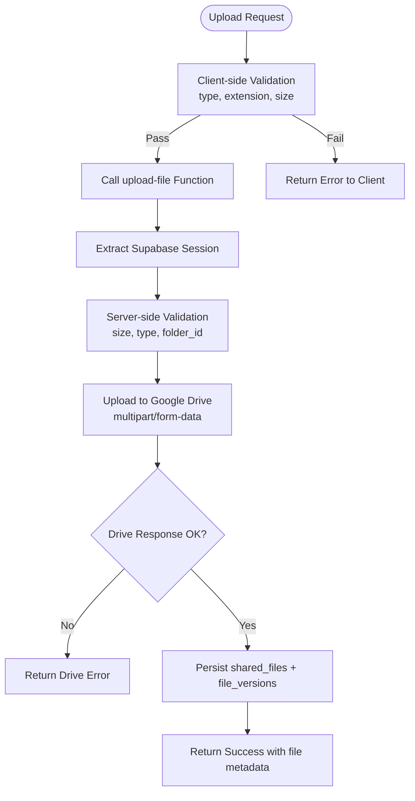
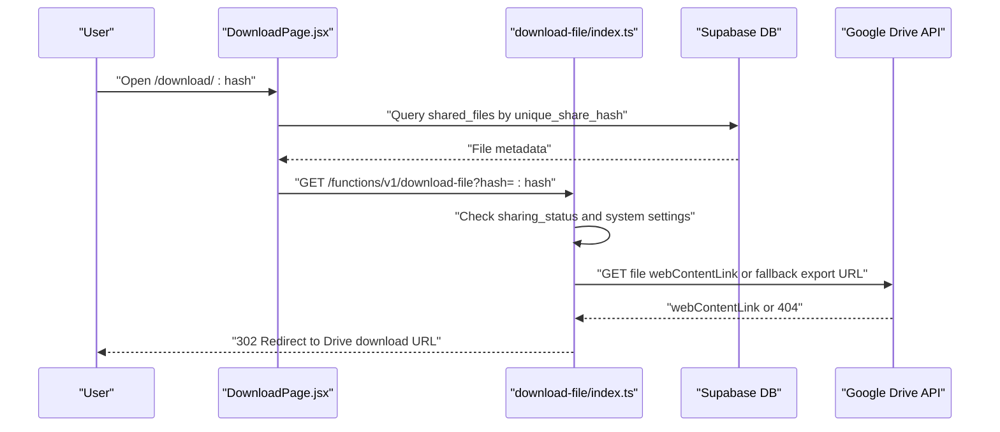
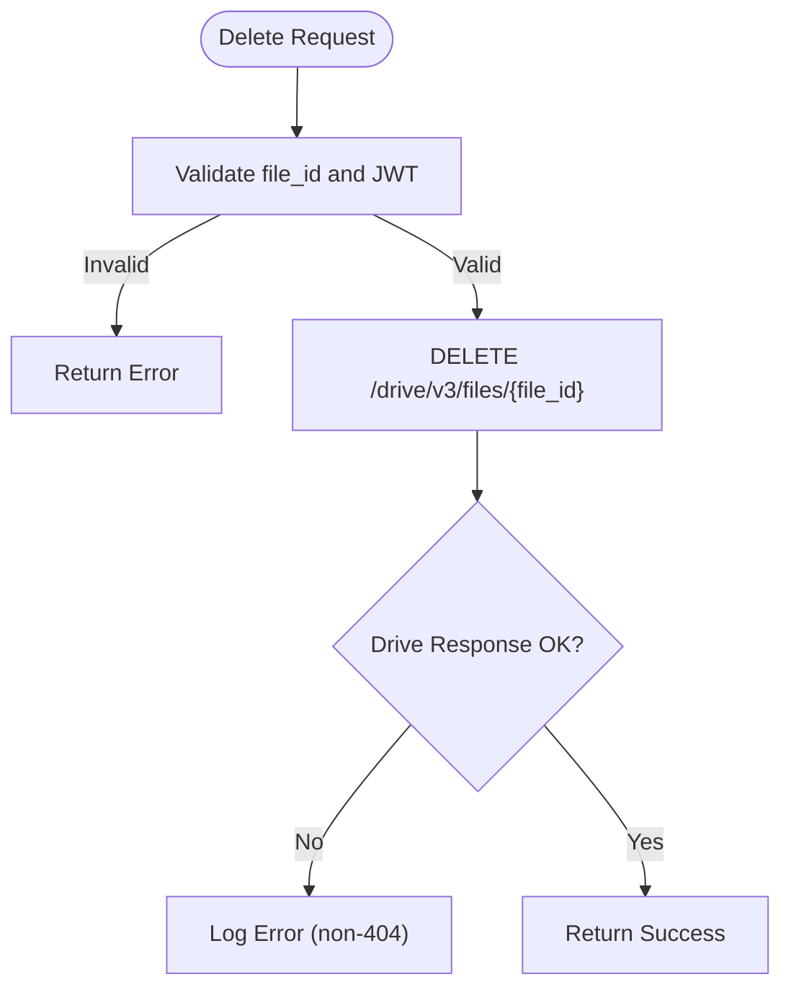
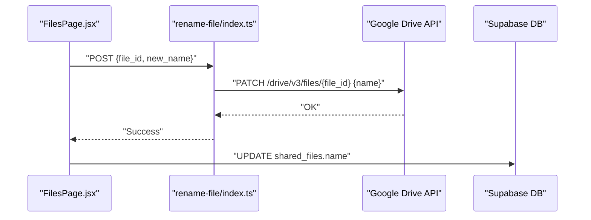
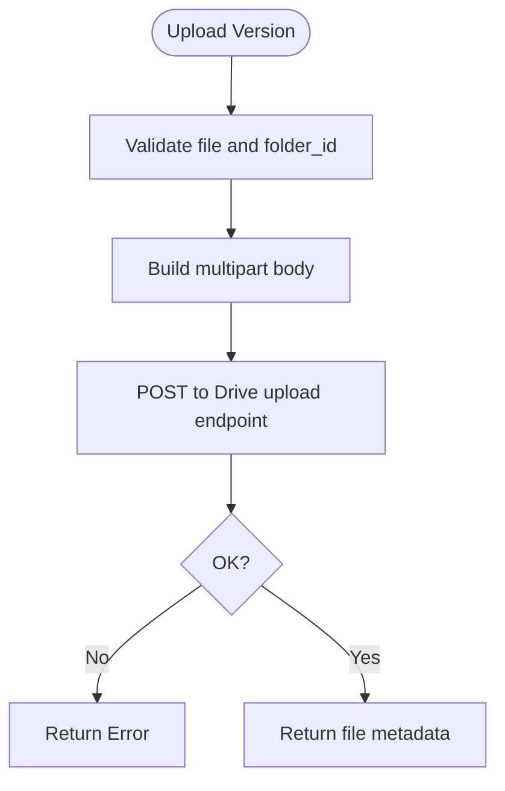
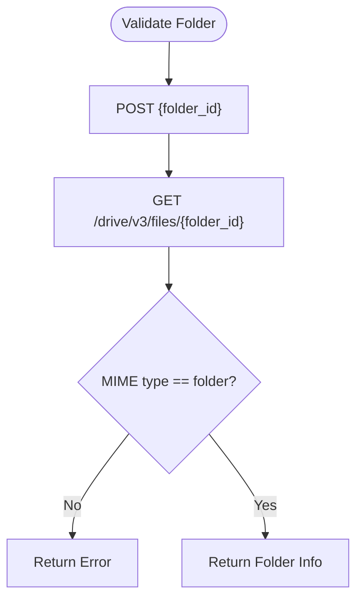
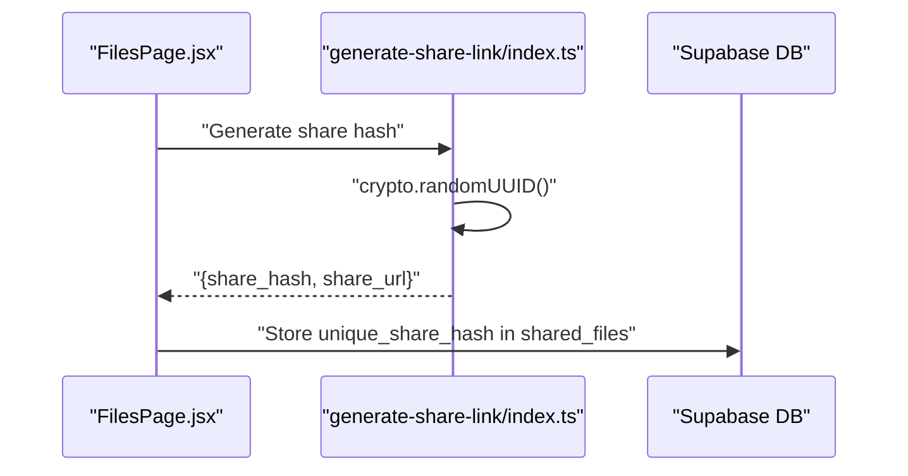
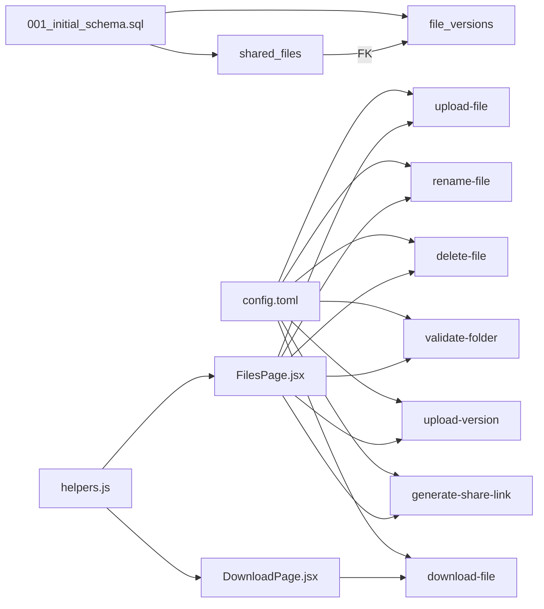

# File Management System

<cite>
**Referenced Files in This Document**
- [upload-file/index.ts](file://supabase/functions/upload-file/index.ts)
- [download-file/index.ts](file://supabase/functions/download-file/index.ts)
- [delete-file/index.ts](file://supabase/functions/delete-file/index.ts)
- [rename-file/index.ts](file://supabase/functions/rename-file/index.ts)
- [upload-version/index.ts](file://supabase/functions/upload-version/index.ts)
- [validate-folder/index.ts](file://supabase/functions/validate-folder/index.ts)
- [generate-share-link/index.ts](file://supabase/functions/generate-share-link/index.ts)
- [001_initial_schema.sql](file://supabase/migrations/001_initial_schema.sql)
- [config.toml](file://supabase/config.toml)
- [helpers.js](file://web/src/utils/helpers.js)
- [supabase.js](file://web/src/services/supabase.js)
- [FilesPage.jsx](file://web/src/pages/FilesPage.jsx)
- [DownloadPage.jsx](file://web/src/pages/DownloadPage.jsx)
- [AuthContext.jsx](file://web/src/contexts/AuthContext.jsx)
</cite>

## Table of Contents
1. [Introduction](#introduction)
2. [Project Structure](#project-structure)
3. [Core Components](#core-components)
4. [Architecture Overview](#architecture-overview)
5. [Detailed Component Analysis](#detailed-component-analysis)
6. [Dependency Analysis](#dependency-analysis)
7. [Performance Considerations](#performance-considerations)
8. [Troubleshooting Guide](#troubleshooting-guide)
9. [Conclusion](#conclusion)
10. [Appendices](#appendices)

## Introduction
This document describes the file management system built on Supabase Edge Functions and a React web interface. It explains the file upload workflow, Google Drive integration, storage limitations, edge function architecture, error handling, security measures, and operational guidance. It also documents file type validation, size restrictions, metadata management, performance considerations, retry mechanisms, monitoring approaches, helper utilities, and common troubleshooting scenarios.

## Project Structure
The system comprises:
- Supabase Edge Functions for file operations (upload, download, rename, delete, versioning, folder validation, share link generation)
- Supabase database schema with row-level security policies
- Web application (React) for user interactions and uploads/downloads
- Helper utilities for frontend formatting and URL generation

**Diagram sources**
- [FilesPage.jsx:85-182](file://web/src/pages/FilesPage.jsx#L85-L182)
- [DownloadPage.jsx:11-73](file://web/src/pages/DownloadPage.jsx#L11-L73)
- [helpers.js:1-52](file://web/src/utils/helpers.js#L1-L52)
- [supabase.js:1-7](file://web/src/services/supabase.js#L1-L7)
- [AuthContext.jsx:1-112](file://web/src/contexts/AuthContext.jsx#L1-L112)
- [upload-file/index.ts:24-151](file://supabase/functions/upload-file/index.ts#L24-L151)
- [download-file/index.ts:9-130](file://supabase/functions/download-file/index.ts#L9-L130)
- [rename-file/index.ts:9-73](file://supabase/functions/rename-file/index.ts#L9-L73)
- [delete-file/index.ts:9-71](file://supabase/functions/delete-file/index.ts#L9-L71)
- [upload-version/index.ts:11-129](file://supabase/functions/upload-version/index.ts#L11-L129)
- [validate-folder/index.ts:9-86](file://supabase/functions/validate-folder/index.ts#L9-L86)
- [generate-share-link/index.ts:9-54](file://supabase/functions/generate-share-link/index.ts#L9-L54)
- [001_initial_schema.sql:55-122](file://supabase/migrations/001_initial_schema.sql#L55-L122)
- [config.toml:1-21](file://supabase/config.toml#L1-L21)

**Section sources**
- [FilesPage.jsx:1-536](file://web/src/pages/FilesPage.jsx#L1-L536)
- [DownloadPage.jsx:1-158](file://web/src/pages/DownloadPage.jsx#L1-L158)
- [helpers.js:1-52](file://web/src/utils/helpers.js#L1-L52)
- [supabase.js:1-7](file://web/src/services/supabase.js#L1-L7)
- [AuthContext.jsx:1-112](file://web/src/contexts/AuthContext.jsx#L1-L112)
- [upload-file/index.ts:1-152](file://supabase/functions/upload-file/index.ts#L1-L152)
- [download-file/index.ts:1-131](file://supabase/functions/download-file/index.ts#L1-L131)
- [rename-file/index.ts:1-74](file://supabase/functions/rename-file/index.ts#L1-L74)
- [delete-file/index.ts:1-72](file://supabase/functions/delete-file/index.ts#L1-L72)
- [upload-version/index.ts:1-130](file://supabase/functions/upload-version/index.ts#L1-L130)
- [validate-folder/index.ts:1-87](file://supabase/functions/validate-folder/index.ts#L1-L87)
- [generate-share-link/index.ts:1-55](file://supabase/functions/generate-share-link/index.ts#L1-L55)
- [001_initial_schema.sql:1-289](file://supabase/migrations/001_initial_schema.sql#L1-L289)
- [config.toml:1-21](file://supabase/config.toml#L1-L21)

## Core Components
- Edge Functions: Implement file lifecycle operations (upload, download, rename, delete, versioning, folder validation, share link generation) with JWT verification and Google Drive API integration.
- Database Schema: Defines tables for user profiles, shared files, file versions, activity logs, and system settings with RLS policies.
- Frontend Pages: Provide user interactions for uploading, renaming, deleting, sharing, and downloading files; enforce client-side validations aligned with backend limits.
- Helpers: Utilities for formatting, icon selection, share URL generation, and folder ID extraction.

Key capabilities:
- File upload with type and size validation, metadata persistence, and versioning
- Secure download via share hash with system setting checks
- Rename and delete operations against Google Drive
- Folder validation prior to upload
- Share link generation with unique hash

**Section sources**
- [upload-file/index.ts:9-22](file://supabase/functions/upload-file/index.ts#L9-L22)
- [upload-version/index.ts](file://supabase/functions/upload-version/index.ts#L9)
- [validate-folder/index.ts:41-61](file://supabase/functions/validate-folder/index.ts#L41-L61)
- [download-file/index.ts:57-72](file://supabase/functions/download-file/index.ts#L57-L72)
- [generate-share-link/index.ts:31-38](file://supabase/functions/generate-share-link/index.ts#L31-L38)
- [FilesPage.jsx:13-22](file://web/src/pages/FilesPage.jsx#L13-L22)
- [FilesPage.jsx:89-104](file://web/src/pages/FilesPage.jsx#L89-L104)
- [helpers.js:31-34](file://web/src/utils/helpers.js#L31-L34)

## Architecture Overview
The system integrates the frontend with Supabase Edge Functions and Google Drive:
- Authentication: Supabase handles OAuth and JWT sessions; functions verify JWTs per configuration.
- Upload flow: Client validates file locally, sends multipart/form-data to the upload function, which validates size/type, uploads to Google Drive, and persists metadata to Supabase.
- Download flow: Client resolves share hash and triggers the download function, which enforces permissions and system settings, then redirects to Google Drive.
- Metadata: Supabase stores shared_files and file_versions records; Google Drive stores the actual binary content.

**Diagram sources**
- [FilesPage.jsx:85-182](file://web/src/pages/FilesPage.jsx#L85-L182)
- [upload-file/index.ts:24-151](file://supabase/functions/upload-file/index.ts#L24-L151)
- [001_initial_schema.sql:55-80](file://supabase/migrations/001_initial_schema.sql#L55-L80)

**Section sources**
- [FilesPage.jsx:85-182](file://web/src/pages/FilesPage.jsx#L85-L182)
- [upload-file/index.ts:24-151](file://supabase/functions/upload-file/index.ts#L24-L151)
- [001_initial_schema.sql:55-80](file://supabase/migrations/001_initial_schema.sql#L55-L80)

## Detailed Component Analysis

### Upload Workflow
- Client-side validation: Type whitelist, blocked extensions, and 100 MB size limit.
- Edge function validation: Same constraints enforced server-side; extracts session and provider token.
- Google Drive upload: Builds multipart body with metadata and base64-encoded file content; uploads via Drive API.
- Metadata persistence: Inserts shared_files and file_versions records; logs activity.

**Diagram sources**
- [FilesPage.jsx:89-104](file://web/src/pages/FilesPage.jsx#L89-L104)
- [upload-file/index.ts:29-68](file://supabase/functions/upload-file/index.ts#L29-L68)
- [upload-file/index.ts:111-126](file://supabase/functions/upload-file/index.ts#L111-L126)
- [001_initial_schema.sql:55-80](file://supabase/migrations/001_initial_schema.sql#L55-L80)

**Section sources**
- [FilesPage.jsx:89-104](file://web/src/pages/FilesPage.jsx#L89-L104)
- [upload-file/index.ts:29-68](file://supabase/functions/upload-file/index.ts#L29-L68)
- [upload-file/index.ts:111-126](file://supabase/functions/upload-file/index.ts#L111-L126)
- [001_initial_schema.sql:55-80](file://supabase/migrations/001_initial_schema.sql#L55-L80)

### Download Processing
- Share hash resolution: Uses Supabase to fetch file metadata by unique share hash.
- Permissions and system checks: Enforces sharing status and downloads_enabled flag.
- Drive redirect: Attempts to use webContentLink; falls back to drive.google.com uc export URL.
- Edge function response: Redirects browser to the appropriate download URL.

**Diagram sources**
- [DownloadPage.jsx:11-73](file://web/src/pages/DownloadPage.jsx#L11-L73)
- [download-file/index.ts:14-118](file://supabase/functions/download-file/index.ts#L14-L118)
- [001_initial_schema.sql:107-122](file://supabase/migrations/001_initial_schema.sql#L107-L122)

**Section sources**
- [DownloadPage.jsx:11-73](file://web/src/pages/DownloadPage.jsx#L11-L73)
- [download-file/index.ts:14-118](file://supabase/functions/download-file/index.ts#L14-L118)
- [001_initial_schema.sql:107-122](file://supabase/migrations/001_initial_schema.sql#L107-L122)

### Deletion Operations
- Validates presence of file_id and JWT.
- Calls Google Drive API to delete the file resource.
- Returns success regardless of Drive response (except explicit 404 handling is logged).

**Diagram sources**
- [delete-file/index.ts:14-53](file://supabase/functions/delete-file/index.ts#L14-L53)

**Section sources**
- [delete-file/index.ts:14-53](file://supabase/functions/delete-file/index.ts#L14-L53)

### Rename Operations
- Validates payload and JWT.
- Sends PATCH to Google Drive to rename the file.
- Updates local metadata in Supabase after successful rename.

**Diagram sources**
- [rename-file/index.ts:14-55](file://supabase/functions/rename-file/index.ts#L14-L55)
- [FilesPage.jsx:184-225](file://web/src/pages/FilesPage.jsx#L184-L225)

**Section sources**
- [rename-file/index.ts:14-55](file://supabase/functions/rename-file/index.ts#L14-L55)
- [FilesPage.jsx:184-225](file://web/src/pages/FilesPage.jsx#L184-L225)

### Versioning Workflow
- New version upload mirrors the initial upload process but targets Google Drive with multipart upload.
- On success, the function returns Drive file metadata; the client can persist version records in Supabase.

**Diagram sources**
- [upload-version/index.ts:16-99](file://supabase/functions/upload-version/index.ts#L16-L99)

**Section sources**
- [upload-version/index.ts:16-99](file://supabase/functions/upload-version/index.ts#L16-L99)

### Folder Validation
- Validates that a given Google Drive ID corresponds to an accessible folder.
- Ensures the MIME type is application/vnd.google-apps.folder.

**Diagram sources**
- [validate-folder/index.ts:41-61](file://supabase/functions/validate-folder/index.ts#L41-L61)

**Section sources**
- [validate-folder/index.ts:41-61](file://supabase/functions/validate-folder/index.ts#L41-L61)

### Share Link Generation
- Generates a unique 12-character share hash and constructs a share URL.
- Intended to be used with the download function for public access.

**Diagram sources**
- [generate-share-link/index.ts:31-38](file://supabase/functions/generate-share-link/index.ts#L31-L38)
- [FilesPage.jsx:136-147](file://web/src/pages/FilesPage.jsx#L136-L147)

**Section sources**
- [generate-share-link/index.ts:31-38](file://supabase/functions/generate-share-link/index.ts#L31-L38)
- [FilesPage.jsx:136-147](file://web/src/pages/FilesPage.jsx#L136-L147)

## Dependency Analysis
- Edge function configuration: Each function requires JWT verification except download-file, which is publicly accessible for resolving share hashes.
- Database relations: shared_files links to file_versions; both reference Google Drive file identifiers.
- Frontend dependencies: FilesPage and DownloadPage depend on Supabase client and helper utilities.

**Diagram sources**
- [config.toml:1-21](file://supabase/config.toml#L1-L21)
- [001_initial_schema.sql:55-80](file://supabase/migrations/001_initial_schema.sql#L55-L80)
- [FilesPage.jsx:1-536](file://web/src/pages/FilesPage.jsx#L1-L536)
- [DownloadPage.jsx:1-158](file://web/src/pages/DownloadPage.jsx#L1-L158)
- [helpers.js:1-52](file://web/src/utils/helpers.js#L1-L52)

**Section sources**
- [config.toml:1-21](file://supabase/config.toml#L1-L21)
- [001_initial_schema.sql:55-80](file://supabase/migrations/001_initial_schema.sql#L55-L80)
- [FilesPage.jsx:1-536](file://web/src/pages/FilesPage.jsx#L1-L536)
- [DownloadPage.jsx:1-158](file://web/src/pages/DownloadPage.jsx#L1-L158)
- [helpers.js:1-52](file://web/src/utils/helpers.js#L1-L52)

## Performance Considerations
- Upload size limit: 100 MB enforced on both client and server to prevent large payloads.
- Base64 encoding overhead: Converting file bytes to base64 increases payload size by approximately 33%; consider streaming or chunked uploads for very large files if requirements change.
- CORS and caching: Edge functions set broad CORS headers; consider tightening for production and adding cache headers where appropriate.
- Network latency: Drive API calls introduce latency; batch operations and pre-validate folder accessibility to reduce retries.
- Rate limiting: Monitor Drive API quotas and implement client-side backoff for transient errors.
- Monitoring: Log function errors and track response times; integrate with Supabase Analytics or external logging.

[No sources needed since this section provides general guidance]

## Troubleshooting Guide
Common issues and resolutions:
- Authentication failures: Ensure Authorization header is present and valid; verify JWT verification in config.
- File type blocked: Confirm extension is not in blocked list and MIME type is allowed.
- Size exceeded: Client and server enforce 100 MB limit; adjust accordingly.
- Drive API errors: Inspect Drive response messages; handle non-404 delete errors.
- Download disabled: Check system setting downloads_enabled; temporarily disabled during maintenance.
- Share link invalid: Verify unique_share_hash exists and file is not private.
- Folder validation fails: Ensure folder_id is correct and user has access; verify MIME type is folder.

**Section sources**
- [upload-file/index.ts:29-68](file://supabase/functions/upload-file/index.ts#L29-L68)
- [upload-file/index.ts:123-126](file://supabase/functions/upload-file/index.ts#L123-L126)
- [delete-file/index.ts:50-53](file://supabase/functions/delete-file/index.ts#L50-L53)
- [download-file/index.ts:64-72](file://supabase/functions/download-file/index.ts#L64-L72)
- [download-file/index.ts:46-55](file://supabase/functions/download-file/index.ts#L46-L55)
- [FilesPage.jsx:106-109](file://web/src/pages/FilesPage.jsx#L106-L109)
- [validate-folder/index.ts:58-61](file://supabase/functions/validate-folder/index.ts#L58-L61)

## Conclusion
The file management system combines Supabase Edge Functions with Google Drive to provide secure, audited file operations. Client-side validations align with server-side enforcement, and database policies ensure data integrity. The architecture supports uploads, downloads, renames, deletions, versioning, and sharing with clear error handling and security measures.

[No sources needed since this section summarizes without analyzing specific files]

## Appendices

### Security Measures
- JWT verification for most functions; download function intentionally open for share hash resolution.
- Row-level security policies restrict data access to owners and authenticated users.
- Client-side validations mirror server-side constraints to minimize invalid requests.

**Section sources**
- [config.toml:1-21](file://supabase/config.toml#L1-L21)
- [001_initial_schema.sql:125-267](file://supabase/migrations/001_initial_schema.sql#L125-L267)

### Storage Limitations and Metadata
- Maximum upload size: 100 MB enforced in client and server.
- Allowed types: PDF, DOCX, XLSX, PPTX, JPEG, PNG, MP4, ZIP; blocked extensions include APK, EXE, BAT, MSI, SCR.
- Metadata stored: shared_files (name, size, MIME type, share hash, sharing status, versions count), file_versions (Drive file ID, version number).

**Section sources**
- [upload-file/index.ts:21-22](file://supabase/functions/upload-file/index.ts#L21-L22)
- [FilesPage.jsx:13-22](file://web/src/pages/FilesPage.jsx#L13-L22)
- [FilesPage.jsx:100-104](file://web/src/pages/FilesPage.jsx#L100-L104)
- [001_initial_schema.sql:115-122](file://supabase/migrations/001_initial_schema.sql#L115-L122)

### Helper Utilities
- Formatting: Human-readable file sizes and dates.
- Icons: Mime-type driven icon selection.
- Share URL: Constructs shareable URLs using app origin or configured base URL.
- Folder ID extraction: Parses Drive folder ID from common URL patterns.

**Section sources**
- [helpers.js:1-52](file://web/src/utils/helpers.js#L1-L52)

### Frontend Integration Notes
- Supabase client initialization and environment variables.
- Auth context manages session state and profile loading.
- FilesPage orchestrates uploads, renames, deletes, and sharing actions.
- DownloadPage resolves share hashes and triggers downloads via edge functions.

**Section sources**
- [supabase.js:1-7](file://web/src/services/supabase.js#L1-L7)
- [AuthContext.jsx:1-112](file://web/src/contexts/AuthContext.jsx#L1-L112)
- [FilesPage.jsx:1-536](file://web/src/pages/FilesPage.jsx#L1-L536)
- [DownloadPage.jsx:1-158](file://web/src/pages/DownloadPage.jsx#L1-L158)