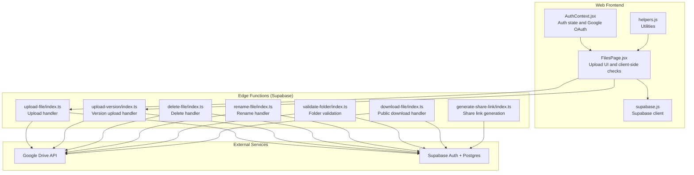
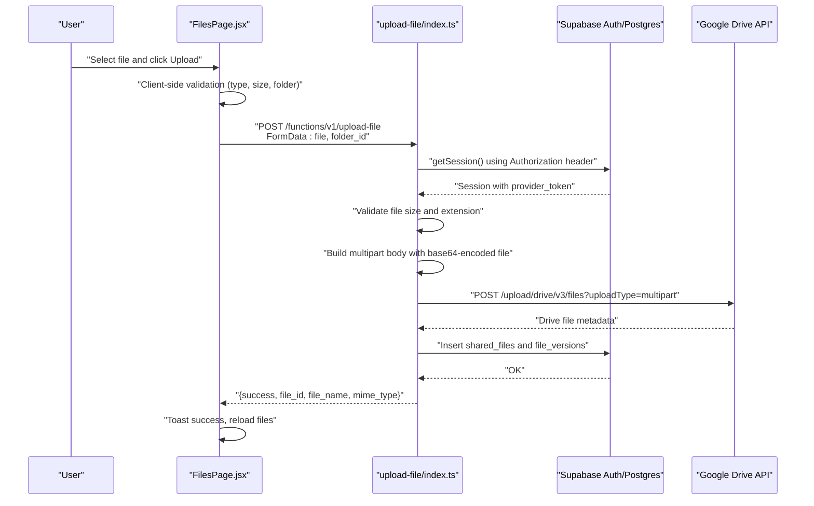
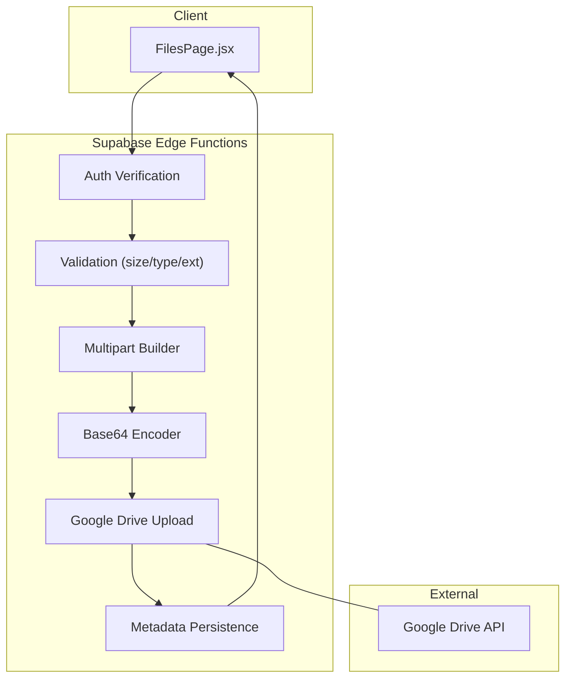
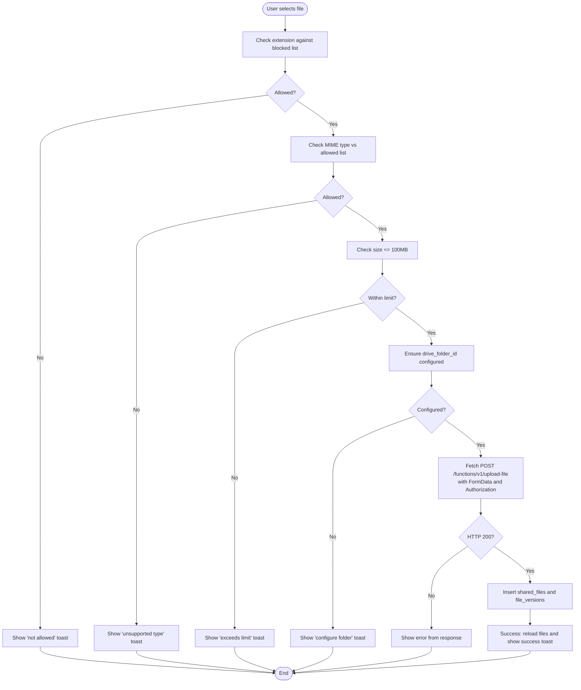
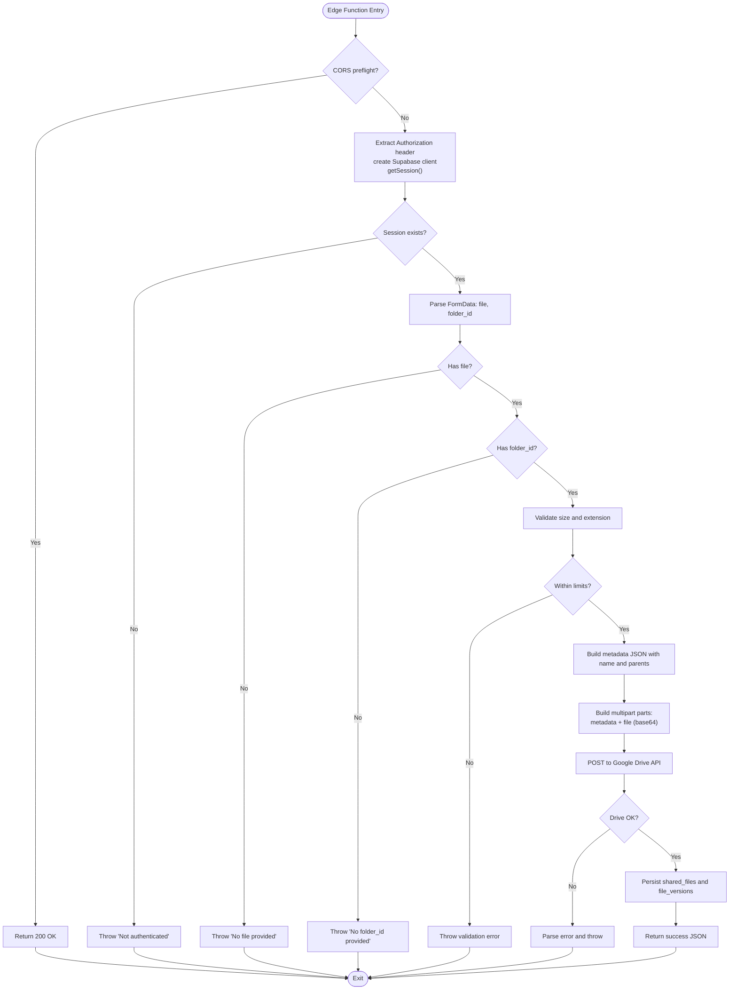
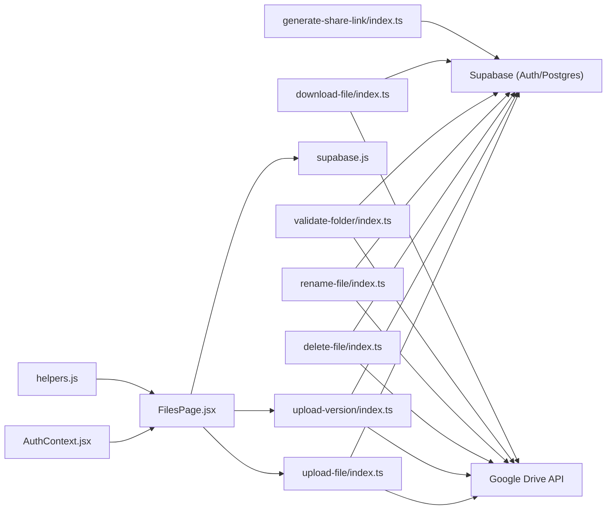

# File Upload Workflow

<cite>
**Referenced Files in This Document**
- [index.ts](file://supabase/functions/upload-file/index.ts)
- [index.ts](file://supabase/functions/upload-version/index.ts)
- [FilesPage.jsx](file://web/src/pages/FilesPage.jsx)
- [supabase.js](file://web/src/services/supabase.js)
- [AuthContext.jsx](file://web/src/contexts/AuthContext.jsx)
- [helpers.js](file://web/src/utils/helpers.js)
- [index.ts](file://supabase/functions/delete-file/index.ts)
- [index.ts](file://supabase/functions/download-file/index.ts)
- [index.ts](file://supabase/functions/generate-share-link/index.ts)
- [index.ts](file://supabase/functions/rename-file/index.ts)
- [index.ts](file://supabase/functions/validate-folder/index.ts)
- [001_initial_schema.sql](file://supabase/migrations/001_initial_schema.sql)
</cite>

## Table of Contents
1. [Introduction](#introduction)
2. [Project Structure](#project-structure)
3. [Core Components](#core-components)
4. [Architecture Overview](#architecture-overview)
5. [Detailed Component Analysis](#detailed-component-analysis)
6. [Dependency Analysis](#dependency-analysis)
7. [Performance Considerations](#performance-considerations)
8. [Troubleshooting Guide](#troubleshooting-guide)
9. [Conclusion](#conclusion)

## Introduction
This document explains the complete file upload workflow from the browser to Google Drive via Supabase Edge Functions. It covers the frontend upload flow, backend authentication verification, file validation, multipart upload construction, base64 encoding, metadata handling, and integration with Supabase and Google Drive APIs. It also documents file size limits, MIME type restrictions, blocked file extensions, and operational considerations such as retries and monitoring.

## Project Structure
The upload workflow spans three layers:
- Frontend (React): Handles user selection, client-side validation, and invokes the Supabase Edge Function endpoint.
- Edge Functions (Deno on Supabase): Performs server-side authentication, validates the file, constructs multipart uploads, encodes content, and posts to Google Drive.
- Backend (Supabase): Stores file metadata, versions, and activity logs; integrates with Google Drive for storage.

**Diagram sources**
- [FilesPage.jsx:85-182](file://web/src/pages/FilesPage.jsx#L85-L182)
- [index.ts:24-151](file://supabase/functions/upload-file/index.ts#L24-L151)
- [index.ts:11-129](file://supabase/functions/upload-version/index.ts#L11-L129)
- [index.ts:9-71](file://supabase/functions/delete-file/index.ts#L9-L71)
- [index.ts:9-73](file://supabase/functions/rename-file/index.ts#L9-L73)
- [index.ts:9-86](file://supabase/functions/validate-folder/index.ts#L9-L86)
- [index.ts:9-130](file://supabase/functions/download-file/index.ts#L9-L130)
- [index.ts:9-54](file://supabase/functions/generate-share-link/index.ts#L9-L54)
- [supabase.js:1-7](file://web/src/services/supabase.js#L1-L7)
- [AuthContext.jsx:6-102](file://web/src/contexts/AuthContext.jsx#L6-L102)

**Section sources**
- [FilesPage.jsx:1-536](file://web/src/pages/FilesPage.jsx#L1-L536)
- [index.ts:1-152](file://supabase/functions/upload-file/index.ts#L1-L152)
- [index.ts:1-130](file://supabase/functions/upload-version/index.ts#L1-L130)
- [supabase.js:1-7](file://web/src/services/supabase.js#L1-L7)
- [AuthContext.jsx:1-112](file://web/src/contexts/AuthContext.jsx#L1-L112)
- [helpers.js:1-52](file://web/src/utils/helpers.js#L1-L52)

## Core Components
- Frontend upload controller: Validates file type and size, ensures a Google Drive folder is configured, and posts to the Supabase Edge Function endpoint.
- Edge function upload handler: Verifies authentication, validates file constraints, builds multipart payload with base64-encoded content, and uploads to Google Drive.
- Metadata persistence: On successful upload, stores file metadata, generates a share hash, records versions, and logs activity.
- Supporting functions: Delete, rename, validate folder, download, and share link generation.

Key constraints and limits:
- Maximum file size: 100 MB enforced on both client and server.
- Allowed MIME types: PDF, DOCX, XLSX, PPTX, JPEG, PNG, MP4, ZIP, and compressed ZIP.
- Blocked file extensions: APK, EXE, BAT, CMD, MSI, SCR.

**Section sources**
- [FilesPage.jsx:13-22](file://web/src/pages/FilesPage.jsx#L13-L22)
- [FilesPage.jsx:89-104](file://web/src/pages/FilesPage.jsx#L89-L104)
- [index.ts:9-22](file://supabase/functions/upload-file/index.ts#L9-L22)
- [index.ts:59-68](file://supabase/functions/upload-file/index.ts#L59-L68)
- [001_initial_schema.sql:107-122](file://supabase/migrations/001_initial_schema.sql#L107-L122)

## Architecture Overview
The upload pipeline is a client-to-edge-to-external-service flow with strict validation and metadata synchronization.

**Diagram sources**
- [FilesPage.jsx:85-182](file://web/src/pages/FilesPage.jsx#L85-L182)
- [index.ts:24-151](file://supabase/functions/upload-file/index.ts#L24-L151)
- [001_initial_schema.sql:55-83](file://supabase/migrations/001_initial_schema.sql#L55-L83)

## Detailed Component Analysis

### Frontend Upload Controller (FilesPage.jsx)
Responsibilities:
- Enforces client-side validation: blocked extensions, allowed MIME types, and 100 MB size limit.
- Ensures the user’s Google Drive folder is configured before allowing upload.
- Invokes the Supabase Edge Function endpoint with Authorization header and FormData.
- Persists metadata to Supabase on success: shared_files row, initial version, and activity log.

Behavior highlights:
- Uses Supabase session access token for Authorization header.
- Constructs FormData with keys "file" and "folder_id".
- On success, inserts a unique share hash and initializes version number.

Error handling:
- Displays user-friendly messages for invalid types, size limits, and missing folder configuration.
- Catches and displays errors returned by the Edge Function.

**Section sources**
- [FilesPage.jsx:85-182](file://web/src/pages/FilesPage.jsx#L85-L182)
- [supabase.js:1-7](file://web/src/services/supabase.js#L1-L7)
- [helpers.js:31-34](file://web/src/utils/helpers.js#L31-L34)

### Edge Function Upload Handler (upload-file/index.ts)
Responsibilities:
- Authentication: Extracts Authorization header, creates Supabase client, and verifies session.
- Validation: Checks presence of file and folder_id, enforces size and extension rules.
- Multipart upload: Builds a multipart/related payload with JSON metadata and base64-encoded file content.
- Google Drive integration: Posts to Drive API with proper headers and boundary.
- Response: Returns standardized success object with file metadata.

Multipart and base64 encoding:
- Boundary is generated per request.
- Metadata part uses UTF-8 JSON.
- File part uses Content-Transfer-Encoding: base64.
- Base64 string is constructed from ArrayBuffer bytes.

Error handling:
- Returns structured JSON error responses with HTTP 400 on validation or Drive API failures.

**Section sources**
- [index.ts:24-151](file://supabase/functions/upload-file/index.ts#L24-L151)

### Edge Function Version Upload Handler (upload-version/index.ts)
Responsibilities:
- Identical validation and multipart upload logic to the primary upload handler.
- Used for uploading new versions of existing files to the same Google Drive folder.

**Section sources**
- [index.ts:11-129](file://supabase/functions/upload-version/index.ts#L11-L129)

### Supporting Functions
- Delete file: Deletes a Google Drive file and cleans up versions and shared_files records.
- Rename file: Updates the file name in Google Drive and synchronizes with Supabase.
- Validate folder: Confirms a given Google Drive ID is a folder and accessible.
- Download file: Resolves a share hash to a downloadable URL using Drive webContentLink or fallback.
- Generate share link: Creates a unique share hash and returns a share URL.

**Section sources**
- [index.ts:9-71](file://supabase/functions/delete-file/index.ts#L9-L71)
- [index.ts:9-73](file://supabase/functions/rename-file/index.ts#L9-L73)
- [index.ts:9-86](file://supabase/functions/validate-folder/index.ts#L9-L86)
- [index.ts:9-130](file://supabase/functions/download-file/index.ts#L9-L130)
- [index.ts:9-54](file://supabase/functions/generate-share-link/index.ts#L9-L54)

### Database Schema and Policies
- shared_files: Stores user ownership, Google Drive file ID, name, size, MIME type, current version number, unique share hash, and sharing status.
- file_versions: Tracks historical versions of files with Google Drive file IDs and timestamps.
- Activity logging: Logs user actions such as upload, rename, delete, and share toggles.
- Row Level Security: Policies restrict access to user-owned resources; public read for downloads via share hash.

**Section sources**
- [001_initial_schema.sql:55-94](file://supabase/migrations/001_initial_schema.sql#L55-L94)
- [001_initial_schema.sql:126-267](file://supabase/migrations/001_initial_schema.sql#L126-L267)

## Architecture Overview

**Diagram sources**
- [FilesPage.jsx:85-182](file://web/src/pages/FilesPage.jsx#L85-L182)
- [index.ts:24-151](file://supabase/functions/upload-file/index.ts#L24-L151)

## Detailed Component Analysis

### Client-Side Upload Flow (FilesPage.jsx)

**Diagram sources**
- [FilesPage.jsx:85-182](file://web/src/pages/FilesPage.jsx#L85-L182)

**Section sources**
- [FilesPage.jsx:85-182](file://web/src/pages/FilesPage.jsx#L85-L182)

### Edge Function Upload Logic (upload-file/index.ts)

**Diagram sources**
- [index.ts:24-151](file://supabase/functions/upload-file/index.ts#L24-L151)

**Section sources**
- [index.ts:24-151](file://supabase/functions/upload-file/index.ts#L24-L151)

### Multipart Upload and Base64 Encoding
- Boundary: Randomly generated per request.
- Metadata part: JSON with UTF-8 encoding and metadata fields (name, parents).
- File part: Base64-encoded binary stream with appropriate Content-Type and transfer encoding.
- Body composition: Concatenation of metadata, file, and closing delimiter into a single Uint8Array.

**Section sources**
- [index.ts:76-121](file://supabase/functions/upload-file/index.ts#L76-L121)

### Authentication and Authorization
- Frontend obtains an access token from Supabase session and passes it as Authorization: Bearer to the Edge Function.
- Edge Function verifies session via Supabase auth and retrieves provider_token for Google Drive API calls.
- All Edge Functions require Authorization header and enforce session validation.

**Section sources**
- [FilesPage.jsx:113-129](file://web/src/pages/FilesPage.jsx#L113-L129)
- [index.ts:29-44](file://supabase/functions/upload-file/index.ts#L29-L44)
- [index.ts:21-35](file://supabase/functions/delete-file/index.ts#L21-L35)
- [index.ts:21-35](file://supabase/functions/rename-file/index.ts#L21-L35)
- [index.ts:21-37](file://supabase/functions/validate-folder/index.ts#L21-L37)

### File Validation Logic
- Client-side: Extension check, MIME type whitelist, and size limit.
- Server-side: Same validations plus enforcement of maximum file size and blocked extensions.

**Section sources**
- [FilesPage.jsx:89-104](file://web/src/pages/FilesPage.jsx#L89-L104)
- [index.ts:59-68](file://supabase/functions/upload-file/index.ts#L59-L68)

### Metadata Handling and Persistence
- After successful upload, the Edge Function persists:
  - shared_files: user_id, google_drive_file_id, file_name, file_size, mime_type, current_version_num, unique_share_hash, sharing_status.
  - file_versions: links the shared_files.id to the Google Drive file ID with version_number.
- Activity logs record the upload event.

**Section sources**
- [FilesPage.jsx:135-171](file://web/src/pages/FilesPage.jsx#L135-L171)
- [001_initial_schema.sql:55-94](file://supabase/migrations/001_initial_schema.sql#L55-L94)

## Dependency Analysis

**Diagram sources**
- [FilesPage.jsx:85-182](file://web/src/pages/FilesPage.jsx#L85-L182)
- [index.ts:24-151](file://supabase/functions/upload-file/index.ts#L24-L151)
- [index.ts:11-129](file://supabase/functions/upload-version/index.ts#L11-L129)
- [supabase.js:1-7](file://web/src/services/supabase.js#L1-L7)
- [AuthContext.jsx:6-102](file://web/src/contexts/AuthContext.jsx#L6-L102)
- [helpers.js:1-52](file://web/src/utils/helpers.js#L1-L52)
- [index.ts:9-71](file://supabase/functions/delete-file/index.ts#L9-L71)
- [index.ts:9-73](file://supabase/functions/rename-file/index.ts#L9-L73)
- [index.ts:9-86](file://supabase/functions/validate-folder/index.ts#L9-L86)
- [index.ts:9-130](file://supabase/functions/download-file/index.ts#L9-L130)
- [index.ts:9-54](file://supabase/functions/generate-share-link/index.ts#L9-L54)

**Section sources**
- [FilesPage.jsx:85-182](file://web/src/pages/FilesPage.jsx#L85-L182)
- [index.ts:24-151](file://supabase/functions/upload-file/index.ts#L24-L151)
- [index.ts:11-129](file://supabase/functions/upload-version/index.ts#L11-L129)
- [index.ts:9-71](file://supabase/functions/delete-file/index.ts#L9-L71)
- [index.ts:9-73](file://supabase/functions/rename-file/index.ts#L9-L73)
- [index.ts:9-86](file://supabase/functions/validate-folder/index.ts#L9-L86)
- [index.ts:9-130](file://supabase/functions/download-file/index.ts#L9-L130)
- [index.ts:9-54](file://supabase/functions/generate-share-link/index.ts#L9-L54)

## Performance Considerations
- Client-side validation reduces unnecessary network requests.
- Base64 encoding increases payload size by approximately 33%; consider streaming or chunked uploads for very large files if needed.
- Edge Function memory usage depends on file size; keep uploads under the 100 MB cap.
- Network latency: Minimize round trips by combining metadata insertion after successful Drive upload.
- Monitoring: Track Edge Function execution time, Drive API response codes, and Supabase insert latencies.

[No sources needed since this section provides general guidance]

## Troubleshooting Guide
Common issues and resolutions:
- Missing authorization header: Ensure the frontend sends Authorization: Bearer <access_token>.
- Not authenticated: Verify Supabase session and provider_token availability.
- File size exceeded: Reduce file size below 100 MB.
- Blocked extension: Remove or rename the file to an allowed extension.
- Drive API error: Inspect the error message returned by Google Drive and adjust permissions or folder ID.
- Missing folder configuration: Configure drive_folder_id in user profiles before uploading.

Monitoring approaches:
- Log Edge Function errors and response codes.
- Track Supabase insert/update operations for metadata consistency.
- Monitor Google Drive API quotas and rate limits.

**Section sources**
- [FilesPage.jsx:113-134](file://web/src/pages/FilesPage.jsx#L113-L134)
- [index.ts:142-150](file://supabase/functions/upload-file/index.ts#L142-L150)
- [index.ts:50-53](file://supabase/functions/delete-file/index.ts#L50-L53)
- [index.ts:120-129](file://supabase/functions/download-file/index.ts#L120-L129)

## Conclusion
The upload workflow combines robust client-side validation, secure server-side authentication, precise multipart and base64 encoding, and reliable metadata persistence. By enforcing consistent constraints and leveraging Supabase and Google Drive capabilities, the system delivers a secure and scalable file upload experience.

[No sources needed since this section summarizes without analyzing specific files]