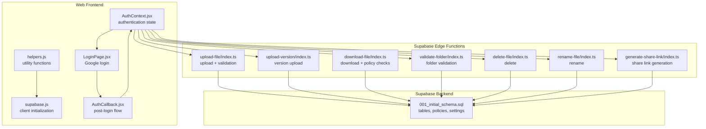
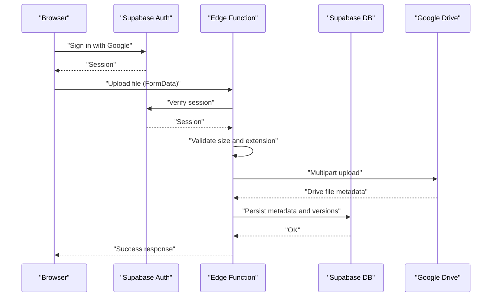
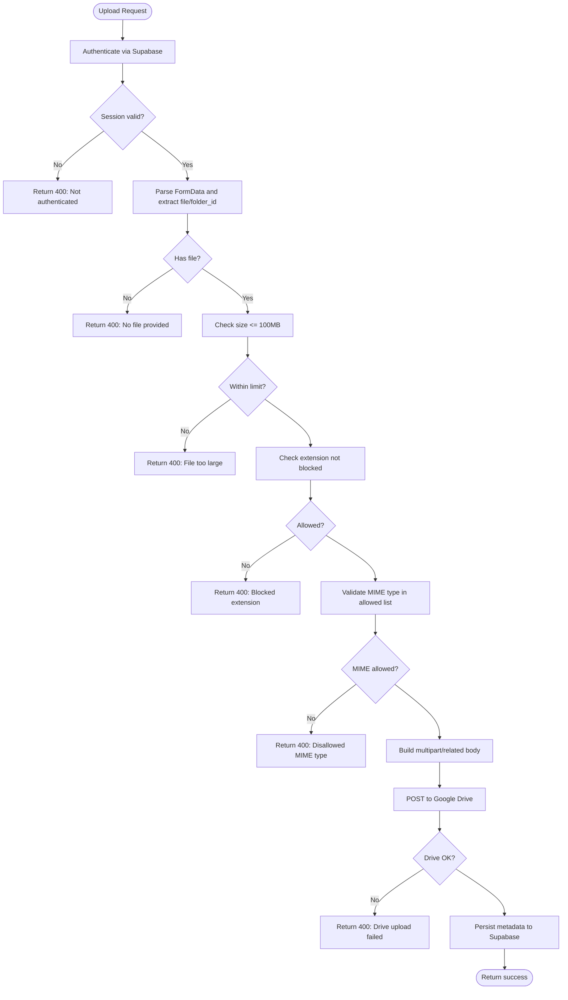
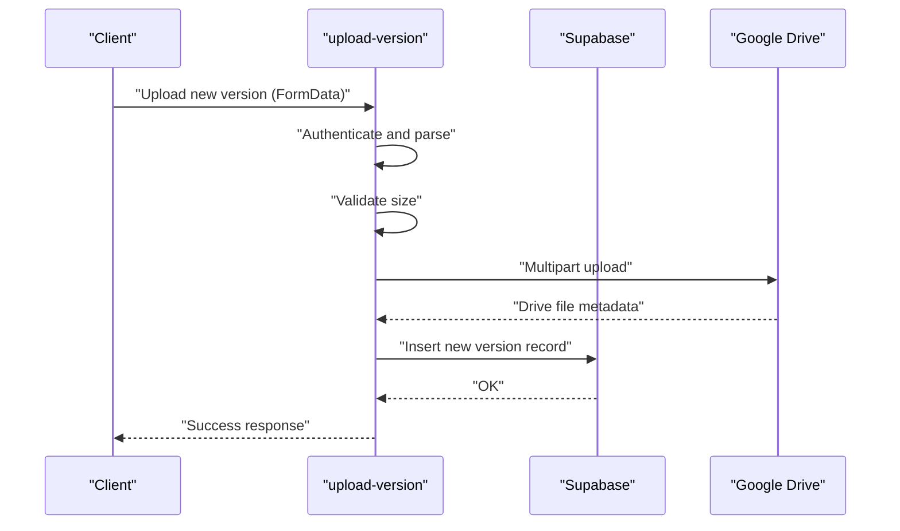
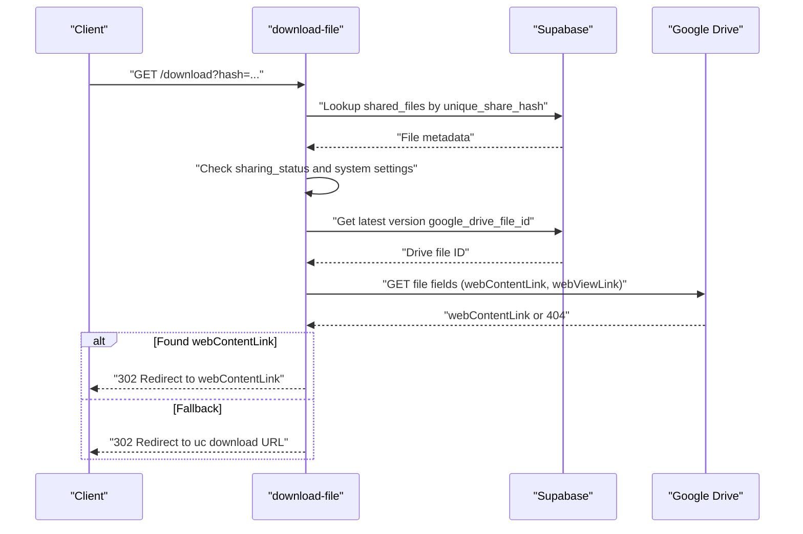
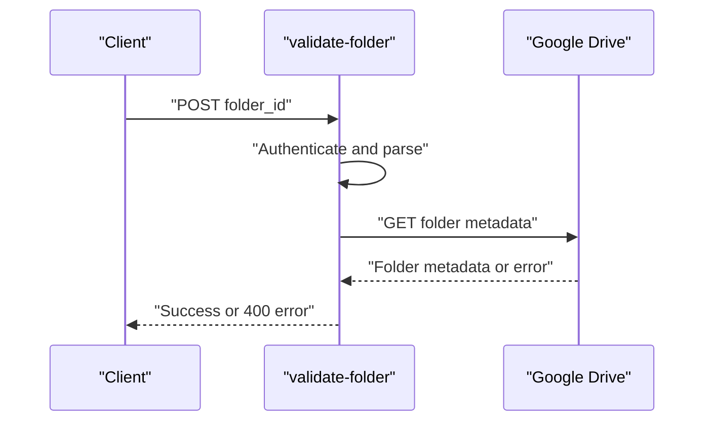
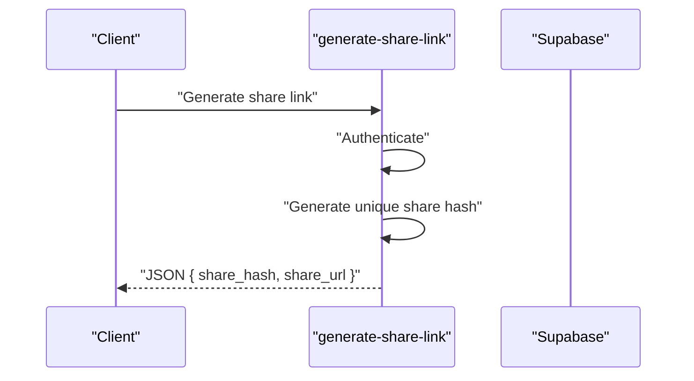
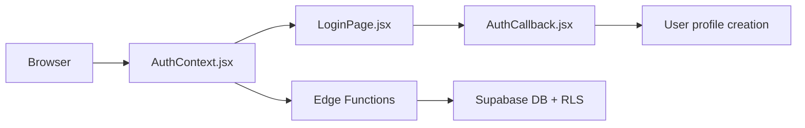
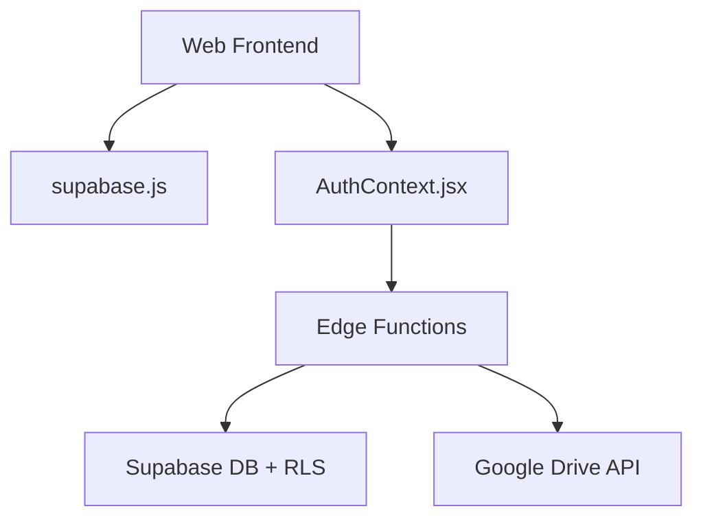

# File Validation and Security

<cite>
**Referenced Files in This Document**
- [upload-file/index.ts](file://supabase/functions/upload-file/index.ts)
- [upload-version/index.ts](file://supabase/functions/upload-version/index.ts)
- [download-file/index.ts](file://supabase/functions/download-file/index.ts)
- [validate-folder/index.ts](file://supabase/functions/validate-folder/index.ts)
- [delete-file/index.ts](file://supabase/functions/delete-file/index.ts)
- [rename-file/index.ts](file://supabase/functions/rename-file/index.ts)
- [generate-share-link/index.ts](file://supabase/functions/generate-share-link/index.ts)
- [001_initial_schema.sql](file://supabase/migrations/001_initial_schema.sql)
- [helpers.js](file://web/src/utils/helpers.js)
- [supabase.js](file://web/src/services/supabase.js)
- [AuthContext.jsx](file://web/src/contexts/AuthContext.jsx)
- [LoginPage.jsx](file://web/src/pages/LoginPage.jsx)
- [AuthCallback.jsx](file://web/src/pages/AuthCallback.jsx)
</cite>

## Table of Contents
1. [Introduction](#introduction)
2. [Project Structure](#project-structure)
3. [Core Components](#core-components)
4. [Architecture Overview](#architecture-overview)
5. [Detailed Component Analysis](#detailed-component-analysis)
6. [Dependency Analysis](#dependency-analysis)
7. [Performance Considerations](#performance-considerations)
8. [Troubleshooting Guide](#troubleshooting-guide)
9. [Conclusion](#conclusion)
10. [Appendices](#appendices)

## Introduction
This document explains the file validation and security mechanisms implemented in the system. It covers the validation pipeline from initial inspection to final approval, including MIME type checks, extension filtering, size limits, and integration with Google Drive for content storage. It also documents access control via Supabase Authentication, security headers, error responses, and recommended mitigations for common file upload vulnerabilities. Logging and monitoring strategies for suspicious activity and compliance are included.

## Project Structure
The file validation and security logic spans serverless functions (Supabase Edge Functions), Supabase Authentication and Row Level Security (RLS), and the frontend client.

**Diagram sources**
- [upload-file/index.ts:1-152](file://supabase/functions/upload-file/index.ts#L1-L152)
- [upload-version/index.ts:1-130](file://supabase/functions/upload-version/index.ts#L1-L130)
- [download-file/index.ts:1-131](file://supabase/functions/download-file/index.ts#L1-L131)
- [validate-folder/index.ts:1-87](file://supabase/functions/validate-folder/index.ts#L1-L87)
- [delete-file/index.ts:1-72](file://supabase/functions/delete-file/index.ts#L1-L72)
- [rename-file/index.ts:1-74](file://supabase/functions/rename-file/index.ts#L1-L74)
- [generate-share-link/index.ts:1-55](file://supabase/functions/generate-share-link/index.ts#L1-L55)
- [001_initial_schema.sql:1-289](file://supabase/migrations/001_initial_schema.sql#L1-L289)
- [helpers.js:1-52](file://web/src/utils/helpers.js#L1-L52)
- [supabase.js:1-7](file://web/src/services/supabase.js#L1-L7)
- [AuthContext.jsx:1-112](file://web/src/contexts/AuthContext.jsx#L1-L112)
- [LoginPage.jsx:1-77](file://web/src/pages/LoginPage.jsx#L1-L77)
- [AuthCallback.jsx:1-84](file://web/src/pages/AuthCallback.jsx#L1-L84)

**Section sources**
- [upload-file/index.ts:1-152](file://supabase/functions/upload-file/index.ts#L1-L152)
- [upload-version/index.ts:1-130](file://supabase/functions/upload-version/index.ts#L1-L130)
- [download-file/index.ts:1-131](file://supabase/functions/download-file/index.ts#L1-L131)
- [validate-folder/index.ts:1-87](file://supabase/functions/validate-folder/index.ts#L1-L87)
- [delete-file/index.ts:1-72](file://supabase/functions/delete-file/index.ts#L1-L72)
- [rename-file/index.ts:1-74](file://supabase/functions/rename-file/index.ts#L1-L74)
- [generate-share-link/index.ts:1-55](file://supabase/functions/generate-share-link/index.ts#L1-L55)
- [001_initial_schema.sql:1-289](file://supabase/migrations/001_initial_schema.sql#L1-L289)
- [helpers.js:1-52](file://web/src/utils/helpers.js#L1-L52)
- [supabase.js:1-7](file://web/src/services/supabase.js#L1-L7)
- [AuthContext.jsx:1-112](file://web/src/contexts/AuthContext.jsx#L1-L112)
- [LoginPage.jsx:1-77](file://web/src/pages/LoginPage.jsx#L1-L77)
- [AuthCallback.jsx:1-84](file://web/src/pages/AuthCallback.jsx#L1-L84)

## Core Components
- File upload validation pipeline:
  - Authentication via Supabase session.
  - Size validation against a fixed limit.
  - Extension filtering for blocked types.
  - MIME type allowance enforcement.
  - Upload to Google Drive via multipart upload.
  - Return structured success/error response with CORS headers.
- Access control and sharing:
  - Supabase Authentication with Google OAuth.
  - Supabase RLS policies restricting file access to owners.
  - Share link generation with unique hashes.
  - Download flow validates share hash, sharing status, and system settings.
- Folder validation:
  - Confirms a Google Drive folder exists and is accessible.
- Content scanning and malware protection:
  - Not implemented in the current codebase. Recommended integrations are discussed in the “Security Measures” section.

**Section sources**
- [upload-file/index.ts:9-22](file://supabase/functions/upload-file/index.ts#L9-L22)
- [upload-file/index.ts:59-68](file://supabase/functions/upload-file/index.ts#L59-L68)
- [upload-file/index.ts:111-126](file://supabase/functions/upload-file/index.ts#L111-L126)
- [download-file/index.ts:24-72](file://supabase/functions/download-file/index.ts#L24-L72)
- [generate-share-link/index.ts:31-38](file://supabase/functions/generate-share-link/index.ts#L31-L38)
- [validate-folder/index.ts:42-61](file://supabase/functions/validate-folder/index.ts#L42-L61)
- [001_initial_schema.sql:107-122](file://supabase/migrations/001_initial_schema.sql#L107-L122)

## Architecture Overview
The system enforces validation and security at three layers:
- Client-side: authentication and utility helpers.
- Edge Functions: per-request validation, access control, and Google Drive integration.
- Supabase backend: RLS policies, system settings, and audit logging.

**Diagram sources**
- [upload-file/index.ts:24-151](file://supabase/functions/upload-file/index.ts#L24-L151)
- [001_initial_schema.sql:55-83](file://supabase/migrations/001_initial_schema.sql#L55-L83)
- [AuthContext.jsx:66-75](file://web/src/contexts/AuthContext.jsx#L66-L75)
- [LoginPage.jsx:17-28](file://web/src/pages/LoginPage.jsx#L17-L28)

## Detailed Component Analysis

### Upload Pipeline (upload-file)
- Authentication: Extracts Authorization header, creates Supabase client, retrieves session, and ensures provider token availability.
- Validation:
  - Enforces maximum file size.
  - Blocks specific extensions.
  - Uses allowed MIME types list for allowance.
- Upload:
  - Builds multipart/related payload with metadata and base64-encoded file content.
  - Sends to Google Drive API with bearer token from session.
- Response:
  - Returns structured success with file metadata and CORS headers.
  - On error, returns 400 with error message.

**Diagram sources**
- [upload-file/index.ts:24-151](file://supabase/functions/upload-file/index.ts#L24-L151)
- [upload-file/index.ts:9-22](file://supabase/functions/upload-file/index.ts#L9-L22)

**Section sources**
- [upload-file/index.ts:9-22](file://supabase/functions/upload-file/index.ts#L9-L22)
- [upload-file/index.ts:59-68](file://supabase/functions/upload-file/index.ts#L59-L68)
- [upload-file/index.ts:76-121](file://supabase/functions/upload-file/index.ts#L76-L121)
- [upload-file/index.ts:130-151](file://supabase/functions/upload-file/index.ts#L130-L151)

### Version Upload Pipeline (upload-version)
- Similar to upload-file but focused on uploading a new version of an existing file.
- Validates size and performs multipart upload to Google Drive.
- Returns success with file metadata.

**Diagram sources**
- [upload-version/index.ts:11-129](file://supabase/functions/upload-version/index.ts#L11-L129)

**Section sources**
- [upload-version/index.ts:9-49](file://supabase/functions/upload-version/index.ts#L9-L49)
- [upload-version/index.ts:89-106](file://supabase/functions/upload-version/index.ts#L89-L106)
- [upload-version/index.ts:108-119](file://supabase/functions/upload-version/index.ts#L108-L119)

### Download Pipeline (download-file)
- Validates share hash existence and sharing permissions.
- Checks system setting for downloads enabled.
- Resolves latest version’s Google Drive file ID.
- Attempts to redirect to Drive’s webContentLink or falls back to uc download endpoint.
- Returns appropriate HTTP responses for not found, forbidden, or service unavailable.

**Diagram sources**
- [download-file/index.ts:15-118](file://supabase/functions/download-file/index.ts#L15-L118)

**Section sources**
- [download-file/index.ts:15-72](file://supabase/functions/download-file/index.ts#L15-L72)
- [download-file/index.ts:98-118](file://supabase/functions/download-file/index.ts#L98-L118)

### Folder Validation (validate-folder)
- Ensures the provided folder_id corresponds to an accessible Google Drive folder.
- Returns folder metadata on success.

**Diagram sources**
- [validate-folder/index.ts:15-61](file://supabase/functions/validate-folder/index.ts#L15-L61)

**Section sources**
- [validate-folder/index.ts:42-61](file://supabase/functions/validate-folder/index.ts#L42-L61)

### Share Link Generation (generate-share-link)
- Generates a unique share hash and constructs a share URL.
- Requires authentication.

**Diagram sources**
- [generate-share-link/index.ts:15-44](file://supabase/functions/generate-share-link/index.ts#L15-L44)

**Section sources**
- [generate-share-link/index.ts:31-38](file://supabase/functions/generate-share-link/index.ts#L31-L38)

### Access Control and Authentication
- Frontend initializes Supabase client and manages auth state.
- Google OAuth login with scopes including Drive permissions.
- Post-auth callback verifies user approval/admin status and persists profile.
- Supabase RLS policies restrict file access to owners and enable public reads by share hash.

**Diagram sources**
- [supabase.js:1-7](file://web/src/services/supabase.js#L1-L7)
- [AuthContext.jsx:66-75](file://web/src/contexts/AuthContext.jsx#L66-L75)
- [LoginPage.jsx:17-28](file://web/src/pages/LoginPage.jsx#L17-L28)
- [AuthCallback.jsx:20-55](file://web/src/pages/AuthCallback.jsx#L20-L55)
- [001_initial_schema.sql:153-174](file://supabase/migrations/001_initial_schema.sql#L153-L174)

**Section sources**
- [supabase.js:1-7](file://web/src/services/supabase.js#L1-L7)
- [AuthContext.jsx:66-75](file://web/src/contexts/AuthContext.jsx#L66-L75)
- [LoginPage.jsx:17-28](file://web/src/pages/LoginPage.jsx#L17-L28)
- [AuthCallback.jsx:20-55](file://web/src/pages/AuthCallback.jsx#L20-L55)
- [001_initial_schema.sql:153-174](file://supabase/migrations/001_initial_schema.sql#L153-L174)

## Dependency Analysis
- Edge functions depend on:
  - Supabase Authentication for session verification.
  - Supabase DB for metadata persistence and policy enforcement.
  - Google Drive API for file storage and retrieval.
- Frontend depends on:
  - Supabase client for auth and API calls.
  - Utility helpers for UI and URL construction.

**Diagram sources**
- [supabase.js:1-7](file://web/src/services/supabase.js#L1-L7)
- [AuthContext.jsx:1-112](file://web/src/contexts/AuthContext.jsx#L1-L112)
- [upload-file/index.ts:35-46](file://supabase/functions/upload-file/index.ts#L35-L46)
- [001_initial_schema.sql:1-289](file://supabase/migrations/001_initial_schema.sql#L1-L289)

**Section sources**
- [supabase.js:1-7](file://web/src/services/supabase.js#L1-L7)
- [AuthContext.jsx:1-112](file://web/src/contexts/AuthContext.jsx#L1-L112)
- [upload-file/index.ts:35-46](file://supabase/functions/upload-file/index.ts#L35-L46)
- [001_initial_schema.sql:1-289](file://supabase/migrations/001_initial_schema.sql#L1-L289)

## Performance Considerations
- Client-side base64 encoding increases bandwidth and CPU usage. Consider streaming uploads to reduce memory pressure.
- Validate file size early to avoid unnecessary processing and network transfer.
- Reuse connections and minimize repeated Google Drive API calls by caching metadata where safe.
- Offload heavy operations (e.g., virus scanning) to asynchronous workers after initial validation.

## Troubleshooting Guide
Common issues and resolutions:
- Authentication failures:
  - Ensure Authorization header is present and session is valid.
  - Verify Google OAuth scopes include Drive permissions.
- File upload errors:
  - Confirm file size under 100 MB.
  - Check extension is not blocked.
  - Verify MIME type is in allowed list.
  - Inspect Drive API error messages returned by the function.
- Download failures:
  - Confirm share hash exists and sharing status allows public access.
  - Check system setting for downloads enabled.
  - Validate latest version file ID resolution.
- Folder validation:
  - Ensure folder_id is a valid Google Drive folder and accessible with the session token.

**Section sources**
- [upload-file/index.ts:29-44](file://supabase/functions/upload-file/index.ts#L29-L44)
- [upload-file/index.ts:60-68](file://supabase/functions/upload-file/index.ts#L60-L68)
- [download-file/index.ts:36-72](file://supabase/functions/download-file/index.ts#L36-L72)
- [validate-folder/index.ts:51-61](file://supabase/functions/validate-folder/index.ts#L51-L61)

## Conclusion
The system implements a layered approach to file validation and security: strong authentication via Supabase, strict upload-time checks (size, extension, MIME), and robust access control through RLS. Google Drive integrates as the storage backend with explicit validation of folder accessibility. While content scanning is not currently implemented, the architecture supports adding asynchronous scanning and logging for compliance and threat detection.

## Appendices

### Security Headers and CORS
- All functions set CORS headers for origin and allowed headers.
- Consider adding security headers (e.g., Content-Security-Policy, X-Content-Type-Options) at the CDN or API gateway level.

**Section sources**
- [upload-file/index.ts:4-7](file://supabase/functions/upload-file/index.ts#L4-L7)
- [upload-version/index.ts:4-7](file://supabase/functions/upload-version/index.ts#L4-L7)
- [download-file/index.ts:4-7](file://supabase/functions/download-file/index.ts#L4-L7)
- [validate-folder/index.ts:4-7](file://supabase/functions/validate-folder/index.ts#L4-L7)
- [delete-file/index.ts:4-7](file://supabase/functions/delete-file/index.ts#L4-L7)
- [rename-file/index.ts:4-7](file://supabase/functions/rename-file/index.ts#L4-L7)
- [generate-share-link/index.ts:4-7](file://supabase/functions/generate-share-link/index.ts#L4-L7)

### Error Responses
- Functions return JSON bodies with an error field and HTTP 400 on validation or API failures.
- Download function returns HTML responses for 404/403/503 scenarios.

**Section sources**
- [upload-file/index.ts:142-150](file://supabase/functions/upload-file/index.ts#L142-L150)
- [upload-version/index.ts:120-128](file://supabase/functions/upload-version/index.ts#L120-L128)
- [download-file/index.ts:37-72](file://supabase/functions/download-file/index.ts#L37-L72)
- [download-file/index.ts:121-129](file://supabase/functions/download-file/index.ts#L121-L129)

### Logging and Monitoring
- Activity logs capture user actions (e.g., login).
- Suggested additions:
  - Centralized logging for upload attempts, blocked files, and download requests.
  - Metrics for upload size distribution, failure rates, and top blocked extensions.
  - Alerting thresholds for unusual spikes in blocked uploads or failed downloads.

**Section sources**
- [AuthCallback.jsx:58-62](file://web/src/pages/AuthCallback.jsx#L58-L62)
- [001_initial_schema.sql:84-103](file://supabase/migrations/001_initial_schema.sql#L84-L103)

### Compliance Notes
- Store only minimal metadata in Supabase; sensitive data should be handled per policy.
- Ensure deletion endpoints remove files from both Supabase and Google Drive.
- Consider retention policies and secure deletion of old versions.

**Section sources**
- [delete-file/index.ts:39-53](file://supabase/functions/delete-file/index.ts#L39-L53)
- [001_initial_schema.sql:74-83](file://supabase/migrations/001_initial_schema.sql#L74-L83)