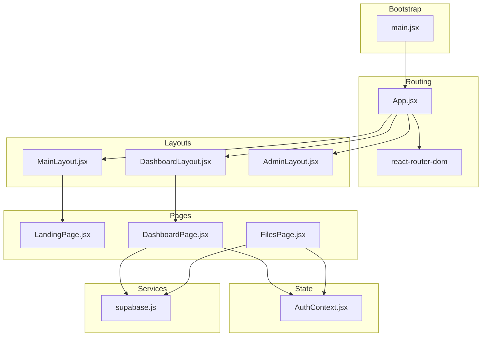
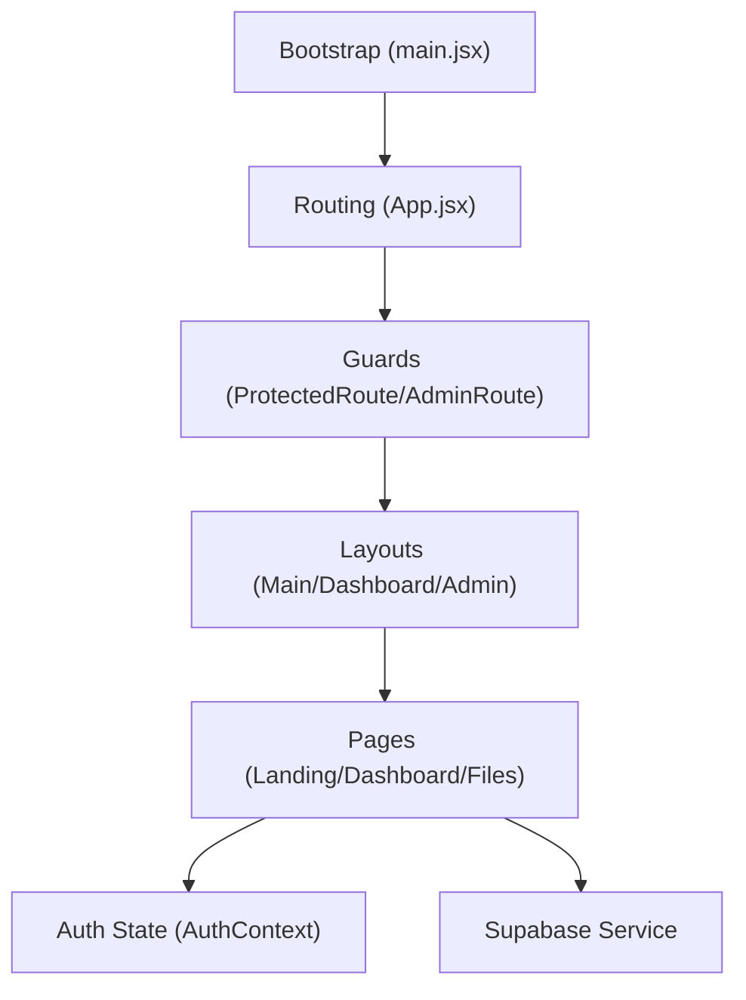
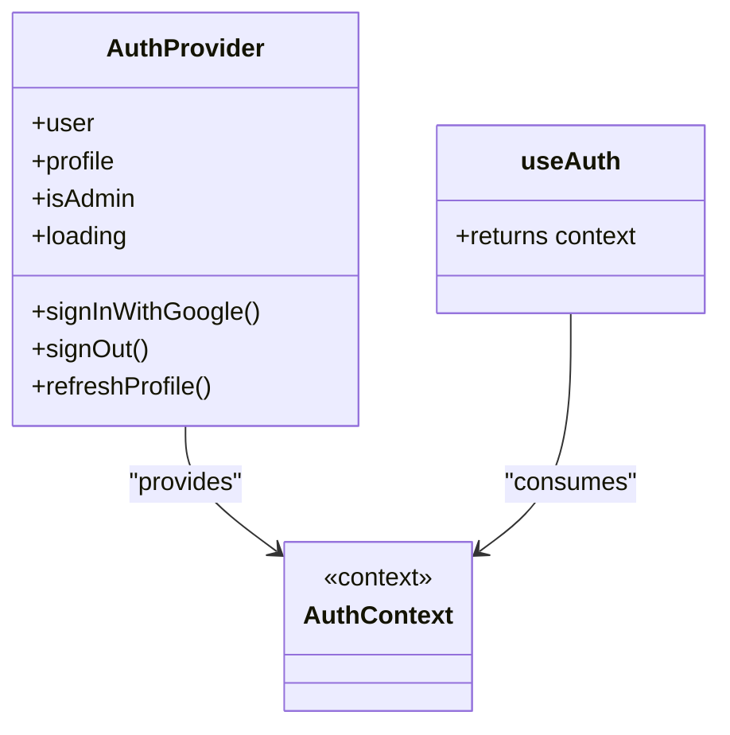
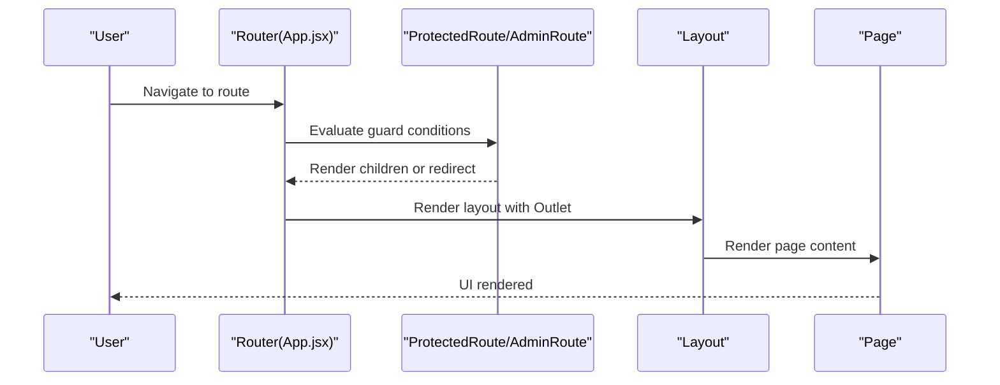
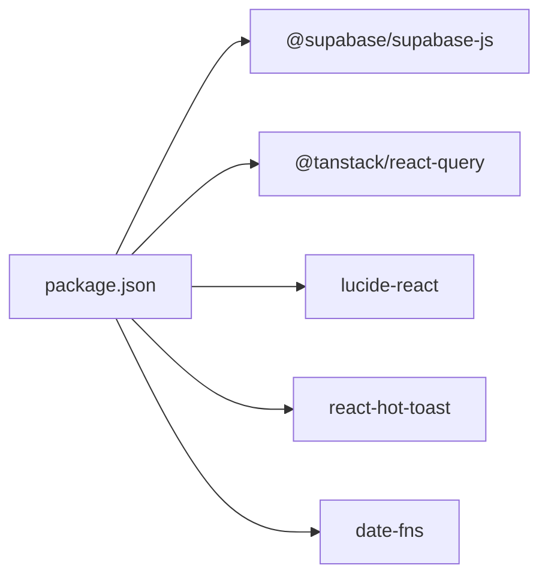

# Component Architecture

<cite>
**Referenced Files in This Document**
- [main.jsx](file://web/src/main.jsx)
- [App.jsx](file://web/src/App.jsx)
- [AuthContext.jsx](file://web/src/contexts/AuthContext.jsx)
- [MainLayout.jsx](file://web/src/layouts/MainLayout.jsx)
- [DashboardLayout.jsx](file://web/src/layouts/DashboardLayout.jsx)
- [AdminLayout.jsx](file://web/src/layouts/AdminLayout.jsx)
- [LandingPage.jsx](file://web/src/pages/LandingPage.jsx)
- [DashboardPage.jsx](file://web/src/pages/DashboardPage.jsx)
- [FilesPage.jsx](file://web/src/pages/FilesPage.jsx)
- [supabase.js](file://web/src/services/supabase.js)
- [package.json](file://web/package.json)
</cite>

## Table of Contents
1. [Introduction](#introduction)
2. [Project Structure](#project-structure)
3. [Core Components](#core-components)
4. [Architecture Overview](#architecture-overview)
5. [Detailed Component Analysis](#detailed-component-analysis)
6. [Dependency Analysis](#dependency-analysis)
7. [Performance Considerations](#performance-considerations)
8. [Troubleshooting Guide](#troubleshooting-guide)
9. [Conclusion](#conclusion)

## Introduction
This document describes the React component architecture of the application, focusing on component hierarchy, reusable patterns, composition strategies, state management, and integration with external systems. It explains how routing, layout composition, authentication context, and service integrations work together to deliver a structured, maintainable frontend.

## Project Structure
The frontend is organized around a clear separation of concerns:
- Root bootstrap initializes providers and routing.
- Routing defines protected/admin/public sections and layout composition.
- Layouts provide shared UI scaffolding for different sections.
- Pages encapsulate domain-specific views and interactions.
- Services integrate with backend and third-party APIs.
- Contexts centralize cross-cutting concerns like authentication.

**Diagram sources**
- [main.jsx:1-41](file://web/src/main.jsx#L1-L41)
- [App.jsx:1-92](file://web/src/App.jsx#L1-L92)
- [MainLayout.jsx:1-10](file://web/src/layouts/MainLayout.jsx#L1-L10)
- [DashboardLayout.jsx:1-200](file://web/src/layouts/DashboardLayout.jsx#L1-L200)
- [AdminLayout.jsx:1-10](file://web/src/layouts/AdminLayout.jsx#L1-L10)
- [LandingPage.jsx:1-231](file://web/src/pages/LandingPage.jsx#L1-L231)
- [DashboardPage.jsx:1-177](file://web/src/pages/DashboardPage.jsx#L1-L177)
- [FilesPage.jsx:1-536](file://web/src/pages/FilesPage.jsx#L1-L536)
- [AuthContext.jsx:1-112](file://web/src/contexts/AuthContext.jsx#L1-L112)
- [supabase.js:1-7](file://web/src/services/supabase.js#L1-L7)

**Section sources**
- [main.jsx:1-41](file://web/src/main.jsx#L1-L41)
- [App.jsx:1-92](file://web/src/App.jsx#L1-L92)

## Core Components
- Providers and global setup:
  - Application bootstrap wires routing, query caching, notifications, and authentication provider.
  - QueryClientProvider enables caching and optimistic updates across pages.
  - Toaster provides global toast notifications.
  - AuthProvider exposes user, profile, admin status, and auth actions to the app.
- Routing and guards:
  - ProtectedRoute enforces authentication for protected routes.
  - AdminRoute enforces admin privileges.
  - LoadingScreen renders while auth state resolves.
- Layouts:
  - MainLayout wraps public pages.
  - DashboardLayout provides navigation, header, sidebar, and outlet for authenticated dashboards.
  - AdminLayout wraps admin pages.
- Pages:
  - LandingPage handles public marketing and registration.
  - DashboardPage aggregates stats and quick actions.
  - FilesPage manages file listing, uploads, sharing, renaming, deletion, and modals.

**Section sources**
- [main.jsx:1-41](file://web/src/main.jsx#L1-L41)
- [App.jsx:28-52](file://web/src/App.jsx#L28-L52)
- [AuthContext.jsx:6-112](file://web/src/contexts/AuthContext.jsx#L6-L112)
- [MainLayout.jsx:1-10](file://web/src/layouts/MainLayout.jsx#L1-L10)
- [DashboardLayout.jsx:1-200](file://web/src/layouts/DashboardLayout.jsx#L1-L200)
- [AdminLayout.jsx:1-10](file://web/src/layouts/AdminLayout.jsx#L1-L10)
- [LandingPage.jsx:1-231](file://web/src/pages/LandingPage.jsx#L1-L231)
- [DashboardPage.jsx:1-177](file://web/src/pages/DashboardPage.jsx#L1-L177)
- [FilesPage.jsx:1-536](file://web/src/pages/FilesPage.jsx#L1-L536)

## Architecture Overview
The architecture follows a layered pattern:
- Bootstrap layer initializes providers and router.
- Routing layer orchestrates navigation and guards.
- Composition layer uses layouts to wrap pages.
- Domain layer implements pages and local state.
- Integration layer connects to Supabase and external services.

**Diagram sources**
- [main.jsx:1-41](file://web/src/main.jsx#L1-L41)
- [App.jsx:28-52](file://web/src/App.jsx#L28-L52)
- [AuthContext.jsx:1-112](file://web/src/contexts/AuthContext.jsx#L1-L112)
- [supabase.js:1-7](file://web/src/services/supabase.js#L1-L7)

## Detailed Component Analysis

### Authentication Context and Hooks
- Purpose: Centralizes authentication state, profile loading, admin checks, and auth actions.
- Implementation highlights:
  - Uses Supabase session management and auth state subscription.
  - Loads profile and admin role upon session change.
  - Exposes sign-in/sign-out and profile refresh utilities.
- Hook usage: Pages consume useAuth to access user, profile, isAdmin, loading, and actions.

**Diagram sources**
- [AuthContext.jsx:6-112](file://web/src/contexts/AuthContext.jsx#L6-L112)

**Section sources**
- [AuthContext.jsx:1-112](file://web/src/contexts/AuthContext.jsx#L1-L112)

### Routing, Guards, and Layout Composition
- ProtectedRoute:
  - Renders a loading screen while auth is resolving.
  - Redirects unauthenticated users to login.
  - Wraps protected layouts and pages.
- AdminRoute:
  - Enforces both authentication and admin role.
  - Redirects non-admins appropriately.
- Layouts:
  - MainLayout, DashboardLayout, AdminLayout render Outlet for nested pages.
- Pages:
  - LandingPage, DashboardPage, FilesPage are rendered inside respective layouts.

**Diagram sources**
- [App.jsx:28-52](file://web/src/App.jsx#L28-L52)
- [DashboardLayout.jsx:1-200](file://web/src/layouts/DashboardLayout.jsx#L1-L200)
- [MainLayout.jsx:1-10](file://web/src/layouts/MainLayout.jsx#L1-L10)
- [AdminLayout.jsx:1-10](file://web/src/layouts/AdminLayout.jsx#L1-L10)

**Section sources**
- [App.jsx:28-52](file://web/src/App.jsx#L28-L52)
- [DashboardLayout.jsx:1-200](file://web/src/layouts/DashboardLayout.jsx#L1-L200)
- [MainLayout.jsx:1-10](file://web/src/layouts/MainLayout.jsx#L1-L10)
- [AdminLayout.jsx:1-10](file://web/src/layouts/AdminLayout.jsx#L1-L10)

### Presentational vs Container Components
- Container components:
  - DashboardPage: orchestrates stats fetching, state updates, and navigation.
  - FilesPage: manages complex state (filters, sorting, modals), integrates with Supabase, and coordinates multiple actions.
- Presentational components:
  - StatCard (used by DashboardPage) and Modal (used by FilesPage) are reusable presentational utilities.
- Pattern:
  - Container components own state and side effects; presentational components receive data and callbacks via props.

**Section sources**
- [DashboardPage.jsx:7-177](file://web/src/pages/DashboardPage.jsx#L7-L177)
- [FilesPage.jsx:34-536](file://web/src/pages/FilesPage.jsx#L34-L536)

### Higher-Order Components (HOCs)
- ProtectedRoute and AdminRoute act as HOCs:
  - They wrap child components and inject behavior (authentication/admin checks).
  - They encapsulate routing logic and reduce duplication across routes.

**Section sources**
- [App.jsx:28-41](file://web/src/App.jsx#L28-L41)

### Render Props Pattern
- Not explicitly implemented in the analyzed files.
- Recommendation: For advanced layout customization, consider a render-prop wrapper around layouts to allow dynamic content injection while preserving shared structure.

[No sources needed since this section does not analyze specific files]

### Prop Drilling Solutions
- Current approach:
  - useAuth is used directly in components that need auth/profile/admin state.
- Alternative strategies (recommended):
  - Extract shared UI slices into smaller contexts (e.g., ProfileContext) to avoid passing props down multiple levels.
  - Use compound components or render props for layout-specific state to minimize re-renders.

**Section sources**
- [AuthContext.jsx:105-111](file://web/src/contexts/AuthContext.jsx#L105-L111)
- [DashboardPage.jsx:8-16](file://web/src/pages/DashboardPage.jsx#L8-L16)
- [FilesPage.jsx:35-40](file://web/src/pages/FilesPage.jsx#L35-L40)

### Component Lifecycle Management
- Effects:
  - DashboardPage loads stats on mount.
  - FilesPage sets up window event listeners for upload triggers and cleans them up on unmount.
  - DashboardLayout subscribes to clicks outside a dropdown to close it and unsubscribes on cleanup.
- Recommendations:
  - Prefer granular effects per concern.
  - Use custom hooks to encapsulate effect logic (e.g., useProfile, useUploadTrigger).

**Section sources**
- [DashboardPage.jsx:18-40](file://web/src/pages/DashboardPage.jsx#L18-L40)
- [FilesPage.jsx:51-65](file://web/src/pages/FilesPage.jsx#L51-L65)
- [DashboardLayout.jsx:31-39](file://web/src/layouts/DashboardLayout.jsx#L31-L39)

### Component Communication Patterns
- Event-driven:
  - DashboardLayout dispatches a custom event to trigger uploads in FilesPage.
  - FilesPage listens for the event and opens the file input.
- Props:
  - Pages pass callbacks and data to presentational components (e.g., Modal receives onClose).
- Context:
  - useAuth provides centralized state to deeply nested components.

**Section sources**
- [DashboardLayout.jsx:46-50](file://web/src/layouts/DashboardLayout.jsx#L46-L50)
- [FilesPage.jsx:51-55](file://web/src/pages/FilesPage.jsx#L51-L55)
- [FilesPage.jsx:527-536](file://web/src/pages/FilesPage.jsx#L527-L536)

### State Management Integration
- Local component state:
  - Pages manage UI state (loading, search, sort, modals).
- Global cache:
  - @tanstack/react-query manages server state with caching and retries.
- Authentication state:
  - AuthProvider maintains user, profile, admin, and loading state.
- Service integration:
  - Supabase client is initialized and used for auth and database operations.

**Section sources**
- [main.jsx:10-17](file://web/src/main.jsx#L10-L17)
- [AuthContext.jsx:6-112](file://web/src/contexts/AuthContext.jsx#L6-L112)
- [supabase.js:1-7](file://web/src/services/supabase.js#L1-L7)

### Testing Strategies
- Unit tests:
  - Test pure functions and helpers (e.g., formatFileSize, formatDate, getExtension).
  - Mock Supabase client and react-router for isolated tests.
- Component tests:
  - Render pages with AuthProvider and Router to simulate real environment.
  - Mock react-query to stub cache and queries.
- Integration tests:
  - Verify guards redirect behavior and layout rendering.
  - Validate event-driven communication (e.g., upload trigger).

[No sources needed since this section provides general guidance]

### Performance Optimization Through Memoization
- Current usage:
  - No explicit React.memo or useMemo shown in analyzed files.
- Recommendations:
  - Wrap heavy presentational components (e.g., StatCard) with memo to prevent unnecessary re-renders.
  - Memoize derived computations in pages (e.g., filtered lists) and stabilize callback refs.
  - Use lazy loading for large lists and split modals into separate components.

[No sources needed since this section provides general guidance]

### Code Splitting Techniques
- Current usage:
  - No dynamic imports observed in analyzed files.
- Recommendations:
  - Split large pages (e.g., FilesPage) into smaller chunks.
  - Use dynamic imports for modals and dialogs to defer loading until needed.
  - Apply route-level code splitting by dynamically importing page components.

[No sources needed since this section provides general guidance]

## Dependency Analysis
External dependencies and their roles:
- @supabase/supabase-js: Backend and auth integration.
- @tanstack/react-query: Caching and optimistic updates.
- lucide-react: Icons.
- react-hot-toast: Notifications.
- date-fns: Date utilities.

**Diagram sources**
- [package.json:11-27](file://web/package.json#L11-L27)

**Section sources**
- [package.json:11-27](file://web/package.json#L11-L27)

## Performance Considerations
- Minimize re-renders by extracting UI slices into smaller contexts and using memoization.
- Defer heavy computations and large lists; consider virtualization for long lists.
- Use route-level code splitting to reduce initial bundle size.
- Leverage react-query’s caching and background refetch strategies to avoid redundant network calls.

[No sources needed since this section provides general guidance]

## Troubleshooting Guide
- Authentication issues:
  - Ensure AuthProvider wraps the application root.
  - Verify Supabase credentials are set in environment variables.
- Routing problems:
  - Confirm ProtectedRoute/AdminRoute wrap intended pages.
  - Check Outlet usage in layouts.
- Network errors:
  - Inspect Supabase service initialization and endpoint configurations.
  - Review react-query default options and error handling in pages.

**Section sources**
- [main.jsx:19-40](file://web/src/main.jsx#L19-L40)
- [AuthContext.jsx:12-38](file://web/src/contexts/AuthContext.jsx#L12-L38)
- [supabase.js:1-7](file://web/src/services/supabase.js#L1-L7)

## Conclusion
The application employs a clean, layered architecture with strong separation of concerns. Routing and guards encapsulate access control, layouts provide reusable scaffolding, and context centralizes authentication state. Pages orchestrate domain logic and integrate with Supabase and react-query. Adopting memoization, code splitting, and clearer HOC/render-props patterns would further improve maintainability and performance.