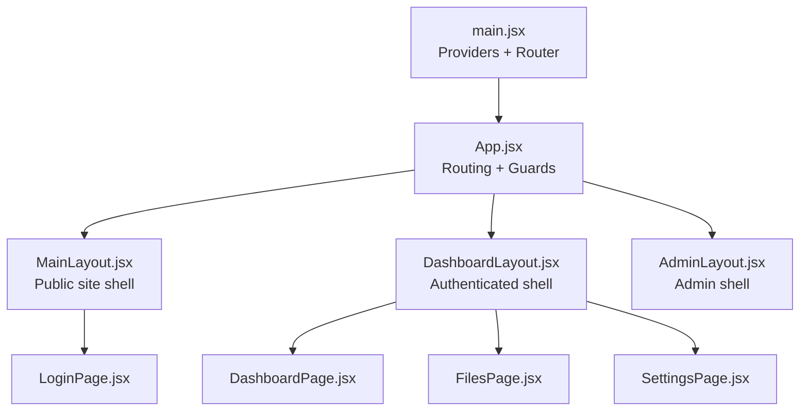
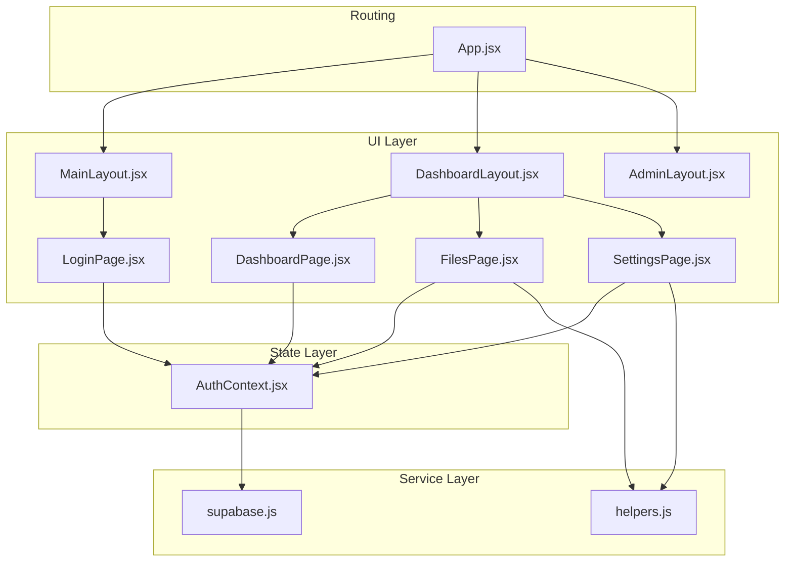
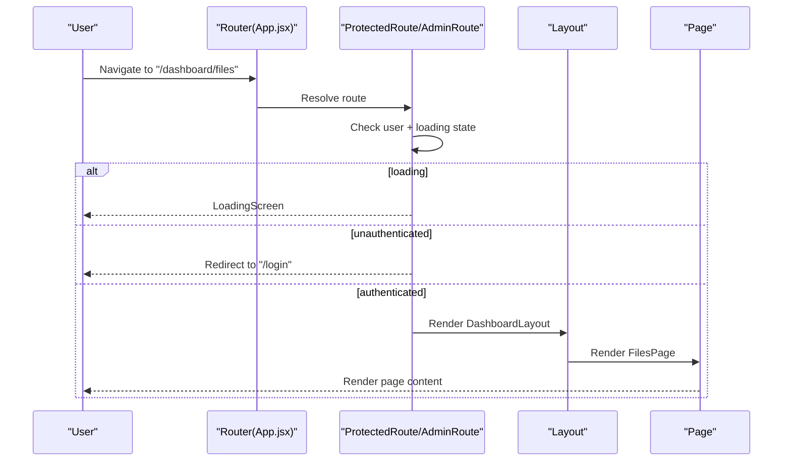
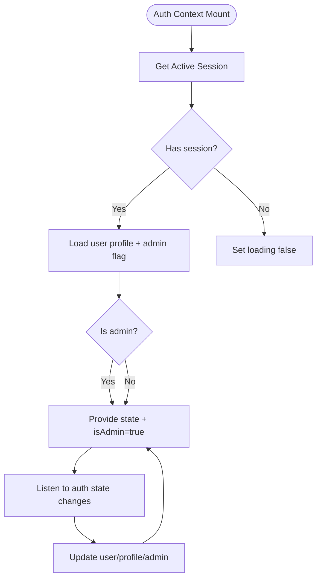
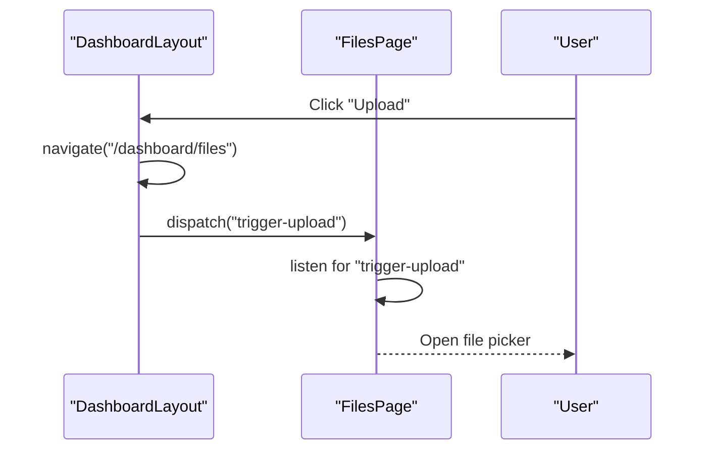
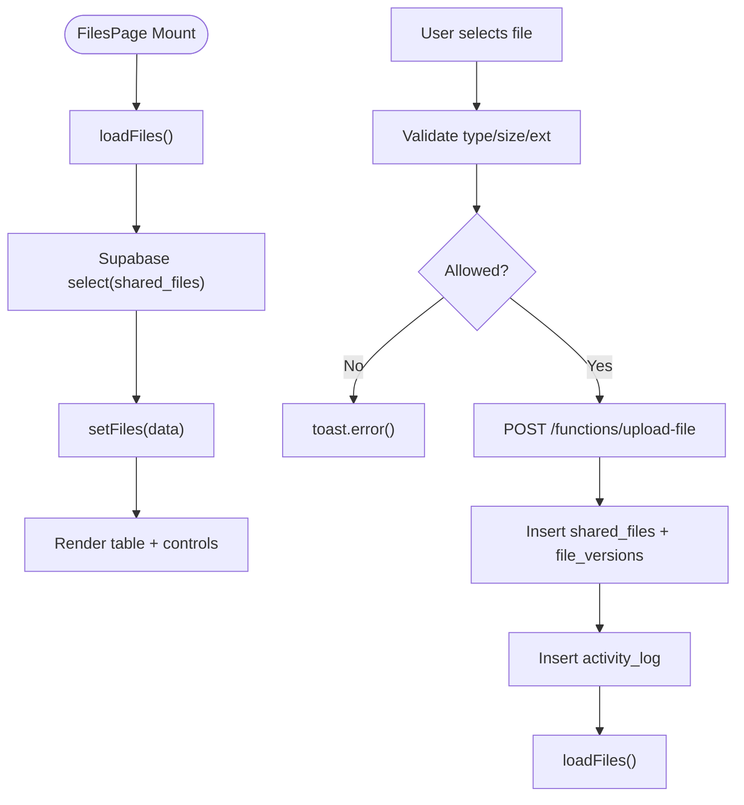
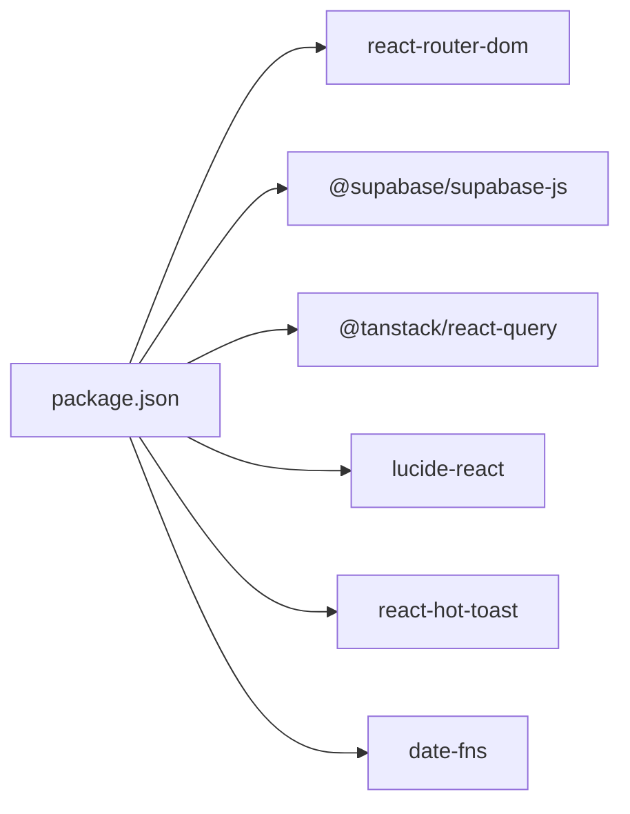

# Frontend Application

<cite>
**Referenced Files in This Document**
- [main.jsx](file://web/src/main.jsx)
- [App.jsx](file://web/src/App.jsx)
- [AuthContext.jsx](file://web/src/contexts/AuthContext.jsx)
- [supabase.js](file://web/src/services/supabase.js)
- [MainLayout.jsx](file://web/src/layouts/MainLayout.jsx)
- [DashboardLayout.jsx](file://web/src/layouts/DashboardLayout.jsx)
- [AdminLayout.jsx](file://web/src/layouts/AdminLayout.jsx)
- [LoginPage.jsx](file://web/src/pages/LoginPage.jsx)
- [DashboardPage.jsx](file://web/src/pages/DashboardPage.jsx)
- [FilesPage.jsx](file://web/src/pages/FilesPage.jsx)
- [SettingsPage.jsx](file://web/src/pages/SettingsPage.jsx)
- [helpers.js](file://web/src/utils/helpers.js)
- [package.json](file://web/package.json)
- [tailwind.config.js](file://web/tailwind.config.js)
</cite>

## Table of Contents
1. [Introduction](#introduction)
2. [Project Structure](#project-structure)
3. [Core Components](#core-components)
4. [Architecture Overview](#architecture-overview)
5. [Detailed Component Analysis](#detailed-component-analysis)
6. [Dependency Analysis](#dependency-analysis)
7. [Performance Considerations](#performance-considerations)
8. [Troubleshooting Guide](#troubleshooting-guide)
9. [Conclusion](#conclusion)
10. [Appendices](#appendices)

## Introduction
This document describes the React frontend architecture for the Neo Files Transfer application. It covers the component hierarchy, layout system, routing structure, context-based state management, protected/admin routes, navigation patterns, styling and responsiveness with Tailwind CSS, accessibility considerations, Supabase integration, error handling, loading states, performance optimization, code splitting strategies, and development workflow.

## Project Structure
The frontend is organized around a clear separation of concerns:
- Root bootstrap initializes providers and router
- Routing defines public, protected, admin, and error routes
- Layouts wrap page content and provide shared UI scaffolding
- Pages implement domain-specific views and interactions
- Contexts encapsulate cross-cutting concerns (authentication)
- Services abstract external integrations (Supabase)
- Utilities provide shared helpers

**Diagram sources**
- [main.jsx:1-41](file://web/src/main.jsx#L1-L41)
- [App.jsx:1-92](file://web/src/App.jsx#L1-L92)
- [MainLayout.jsx:1-10](file://web/src/layouts/MainLayout.jsx#L1-L10)
- [DashboardLayout.jsx:1-200](file://web/src/layouts/DashboardLayout.jsx#L1-L200)
- [AdminLayout.jsx:1-10](file://web/src/layouts/AdminLayout.jsx#L1-L10)
- [LoginPage.jsx:1-77](file://web/src/pages/LoginPage.jsx#L1-L77)
- [DashboardPage.jsx:1-177](file://web/src/pages/DashboardPage.jsx#L1-L177)
- [FilesPage.jsx:1-536](file://web/src/pages/FilesPage.jsx#L1-L536)
- [SettingsPage.jsx:1-251](file://web/src/pages/SettingsPage.jsx#L1-L251)

**Section sources**
- [main.jsx:1-41](file://web/src/main.jsx#L1-L41)
- [App.jsx:1-92](file://web/src/App.jsx#L1-L92)

## Core Components
- Providers and global setup:
  - Router provider, React Query client, global toast notifications, and AuthProvider are initialized at the root.
  - QueryClient defaults include caching and retry policies.
- Authentication context:
  - Centralized auth state, profile loading, admin flag, and auth actions (sign-in, sign-out, refresh).
- Supabase service:
  - Client creation with environment variables for URL and anonymous key.
- Layouts:
  - Minimal outlet-based shells for public, dashboard, and admin sections.
- Pages:
  - Login, dashboard, files, settings, and related interactions.

**Section sources**
- [main.jsx:1-41](file://web/src/main.jsx#L1-L41)
- [AuthContext.jsx:1-112](file://web/src/contexts/AuthContext.jsx#L1-L112)
- [supabase.js:1-7](file://web/src/services/supabase.js#L1-L7)

## Architecture Overview
The app follows a layered architecture:
- UI Layer: Layouts and pages
- State Layer: Contexts (AuthContext)
- Service Layer: Supabase client and helper utilities
- Routing Layer: React Router with nested routes and guards

**Diagram sources**
- [App.jsx:1-92](file://web/src/App.jsx#L1-L92)
- [AuthContext.jsx:1-112](file://web/src/contexts/AuthContext.jsx#L1-L112)
- [supabase.js:1-7](file://web/src/services/supabase.js#L1-L7)
- [helpers.js:1-52](file://web/src/utils/helpers.js#L1-L52)
- [MainLayout.jsx:1-10](file://web/src/layouts/MainLayout.jsx#L1-L10)
- [DashboardLayout.jsx:1-200](file://web/src/layouts/DashboardLayout.jsx#L1-L200)
- [AdminLayout.jsx:1-10](file://web/src/layouts/AdminLayout.jsx#L1-L10)
- [LoginPage.jsx:1-77](file://web/src/pages/LoginPage.jsx#L1-L77)
- [DashboardPage.jsx:1-177](file://web/src/pages/DashboardPage.jsx#L1-L177)
- [FilesPage.jsx:1-536](file://web/src/pages/FilesPage.jsx#L1-L536)
- [SettingsPage.jsx:1-251](file://web/src/pages/SettingsPage.jsx#L1-L251)

## Detailed Component Analysis

### Routing and Navigation
- Public routes:
  - Root landing and login
  - OAuth callback handler
- Protected routes:
  - Dashboard shell with nested pages (dashboard, files, shared, settings)
  - Version page under files route
- Admin routes:
  - Admin shell with login and dashboard
- Guards:
  - ProtectedRoute ensures authenticated access; renders loading or redirects as needed
  - AdminRoute enforces admin role and redirects otherwise
- Error pages:
  - Access denied and catch-all not-found

**Diagram sources**
- [App.jsx:28-41](file://web/src/App.jsx#L28-L41)
- [App.jsx:54-91](file://web/src/App.jsx#L54-L91)
- [DashboardLayout.jsx:24-44](file://web/src/layouts/DashboardLayout.jsx#L24-L44)

**Section sources**
- [App.jsx:1-92](file://web/src/App.jsx#L1-L92)

### Authentication Context and State Management
- Responsibilities:
  - Initialize session, subscribe to auth state changes, load profile and admin status
  - Expose sign-in/sign-out, profile refresh, and state to consumers
- Data flow:
  - On mount, fetch session; on auth state change, update user/profile/admin; unsubscribe on unmount
  - Profile and admin checks occur after successful session retrieval
- Consumers:
  - Pages and layouts use useAuth for navigation, UI rendering, and triggering actions

**Diagram sources**
- [AuthContext.jsx:12-38](file://web/src/contexts/AuthContext.jsx#L12-L38)
- [AuthContext.jsx:40-64](file://web/src/contexts/AuthContext.jsx#L40-L64)

**Section sources**
- [AuthContext.jsx:1-112](file://web/src/contexts/AuthContext.jsx#L1-L112)

### Dashboard Layout and Navigation Patterns
- Features:
  - Collapsible sidebar with navigation items
  - Top header with upload trigger, notifications, and profile dropdown
  - Responsive behavior using Tailwind utilities
  - Programmatic navigation and custom events to coordinate uploads across pages
- Event-driven coordination:
  - Dashboard triggers upload on Files page via a custom event
- Accessibility:
  - Proper focus order, keyboard navigable menus, and ARIA-friendly button roles

**Diagram sources**
- [DashboardLayout.jsx:46-50](file://web/src/layouts/DashboardLayout.jsx#L46-L50)
- [FilesPage.jsx:51-55](file://web/src/pages/FilesPage.jsx#L51-L55)

**Section sources**
- [DashboardLayout.jsx:1-200](file://web/src/layouts/DashboardLayout.jsx#L1-L200)
- [FilesPage.jsx:1-536](file://web/src/pages/FilesPage.jsx#L1-L536)

### Files Page: Composition, Props, and Events
- Composition:
  - Uses local state for files, filters, sorting, modals, and upload progress
  - Renders a table with dynamic icons, status badges, and action menus
- Prop management:
  - Stateless helper components receive props (icon, label, value, color, loading)
- Event handling:
  - Upload validation, error notifications, and success feedback
  - Action menu toggles, rename modal, delete confirm modal
  - Sorting and filtering applied to local state
- Integration:
  - Calls Supabase for session token and invokes Edge Functions for file operations
  - Persists metadata and logs activity

**Diagram sources**
- [FilesPage.jsx:67-83](file://web/src/pages/FilesPage.jsx#L67-L83)
- [FilesPage.jsx:85-182](file://web/src/pages/FilesPage.jsx#L85-L182)
- [helpers.js:31-34](file://web/src/utils/helpers.js#L31-L34)

**Section sources**
- [FilesPage.jsx:1-536](file://web/src/pages/FilesPage.jsx#L1-L536)
- [helpers.js:1-52](file://web/src/utils/helpers.js#L1-L52)

### Settings Page: Tabs, Forms, and Validation
- Tabs:
  - Profile, Google Drive, and Security sections
- Drive verification:
  - Extracts folder ID from URL, validates via Edge Function, updates profile
- Security:
  - Displays authentication info and provides logout with activity logging
- State management:
  - Local form state per tab; saves to Supabase and refreshes profile context

**Section sources**
- [SettingsPage.jsx:1-251](file://web/src/pages/SettingsPage.jsx#L1-L251)
- [helpers.js:36-46](file://web/src/utils/helpers.js#L36-L46)

### Styling Approach and Responsive Design
- Tailwind CSS:
  - Utility-first classes for layout, spacing, colors, and typography
  - Theme customization extends primary palette and fonts
  - Responsive breakpoints enable mobile-first design (e.g., lg:, sm:)
- Accessibility:
  - Semantic HTML, focus management, and readable contrast
  - Interactive elements use appropriate ARIA roles and labels

**Section sources**
- [tailwind.config.js:1-30](file://web/tailwind.config.js#L1-L30)
- [DashboardLayout.jsx:52-198](file://web/src/layouts/DashboardLayout.jsx#L52-L198)
- [FilesPage.jsx:302-489](file://web/src/pages/FilesPage.jsx#L302-L489)

### Supabase Integration and Edge Functions
- Client initialization:
  - Supabase client created with environment variables
- Authentication:
  - OAuth with Google, session retrieval, auth state subscriptions
- Edge Functions:
  - Files: upload-file, rename-file, delete-file, validate-folder
  - Functions invoked via Authorization: Bearer token from session
- Data persistence:
  - Metadata stored in shared_files and file_versions tables
  - Activity logs maintained for auditability

**Section sources**
- [supabase.js:1-7](file://web/src/services/supabase.js#L1-L7)
- [AuthContext.jsx:66-82](file://web/src/contexts/AuthContext.jsx#L66-L82)
- [FilesPage.jsx:113-130](file://web/src/pages/FilesPage.jsx#L113-L130)
- [SettingsPage.jsx:56-69](file://web/src/pages/SettingsPage.jsx#L56-L69)

### Error Handling and Loading States
- Global:
  - React Query default retry policy and stale time
  - Toast notifications for user feedback
- Per-feature:
  - Loading spinners during auth, uploads, and data fetches
  - Error boundaries: ProtectedRoute/AdminRoute render loading or redirect based on state
  - Specific handlers for network errors and invalid inputs

**Section sources**
- [main.jsx:10-17](file://web/src/main.jsx#L10-L17)
- [App.jsx:28-52](file://web/src/App.jsx#L28-L52)
- [FilesPage.jsx:175-182](file://web/src/pages/FilesPage.jsx#L175-L182)
- [SettingsPage.jsx:87-93](file://web/src/pages/SettingsPage.jsx#L87-L93)

## Dependency Analysis
External dependencies and their roles:
- react-router-dom: routing and navigation
- @supabase/supabase-js: authentication and database operations
- @tanstack/react-query: caching and optimistic updates
- lucide-react: UI icons
- react-hot-toast: toast notifications
- date-fns: date utilities (referenced in package.json)

**Diagram sources**
- [package.json:1-29](file://web/package.json#L1-L29)

**Section sources**
- [package.json:1-29](file://web/package.json#L1-L29)

## Performance Considerations
- Caching and retries:
  - React Query default staleTime and retry reduce redundant requests
- Lazy loading and code splitting:
  - Recommended: split large pages (e.g., FilesPage) into separate chunks
  - Dynamic imports for heavy components or modals
- Rendering optimizations:
  - Memoize derived data (filters, sorts) with useMemo/useCallback
  - Virtualize long lists if file counts grow large
- Network efficiency:
  - Batch operations where possible
  - Debounce search inputs
- Bundle size:
  - Tree-shake unused icons and utilities
  - Prefer lightweight alternatives for heavy libraries

## Troubleshooting Guide
- Authentication issues:
  - Verify environment variables for Supabase URL and anon key
  - Check auth state subscription cleanup and session retrieval
- Upload failures:
  - Confirm Google Drive folder is configured and accessible
  - Validate file type, size, and extension against allowed/blocklisted sets
  - Inspect Edge Function responses and error messages
- Navigation problems:
  - Ensure ProtectedRoute/AdminRoute conditions align with user/admin state
  - Confirm layout outlets are present and Outlet is rendered
- Styling inconsistencies:
  - Validate Tailwind content paths and build pipeline
  - Check color and font family overrides in theme configuration

**Section sources**
- [AuthContext.jsx:12-38](file://web/src/contexts/AuthContext.jsx#L12-L38)
- [FilesPage.jsx:85-104](file://web/src/pages/FilesPage.jsx#L85-L104)
- [App.jsx:28-41](file://web/src/App.jsx#L28-L41)
- [tailwind.config.js:3-6](file://web/tailwind.config.js#L3-L6)

## Conclusion
The frontend employs a clean, modular architecture with clear separation between routing, layouts, pages, and state management. Context-based auth provides centralized control, while Supabase integrates seamlessly with Edge Functions for secure file operations. Tailwind CSS enables rapid, responsive UI development with strong accessibility support. The combination of React Router guards, React Query caching, and toast notifications delivers a robust user experience with predictable error handling and loading states.

## Appendices

### Component Composition Examples
- DashboardLayout composes navigation, profile dropdown, and page outlet
- FilesPage composes table, modals, and action menus; delegates helpers for formatting
- SettingsPage composes tabs and forms; coordinates with helpers for URL parsing

**Section sources**
- [DashboardLayout.jsx:24-198](file://web/src/layouts/DashboardLayout.jsx#L24-L198)
- [FilesPage.jsx:302-525](file://web/src/pages/FilesPage.jsx#L302-L525)
- [SettingsPage.jsx:105-249](file://web/src/pages/SettingsPage.jsx#L105-L249)

### Development Workflow
- Scripts:
  - dev: Vite dev server
  - build: Production build
  - preview: Preview production build locally
- Build pipeline:
  - Vite with React plugin
  - PostCSS and Tailwind for styling
  - Environment variables for Supabase and app URLs

**Section sources**
- [package.json:6-10](file://web/package.json#L6-L10)
- [tailwind.config.js:1-30](file://web/tailwind.config.js#L1-L30)