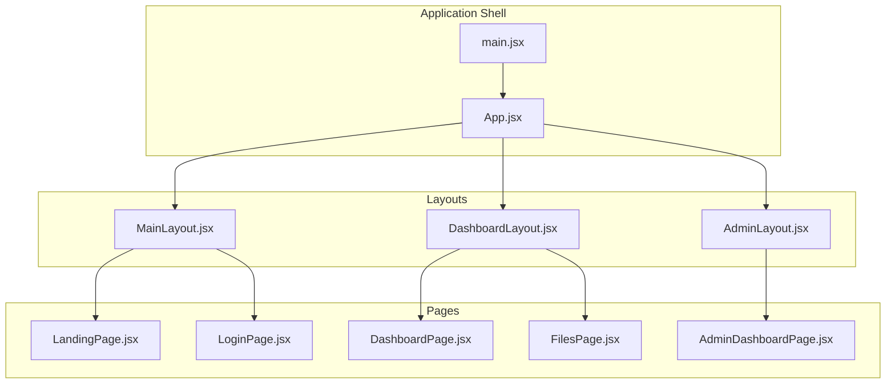
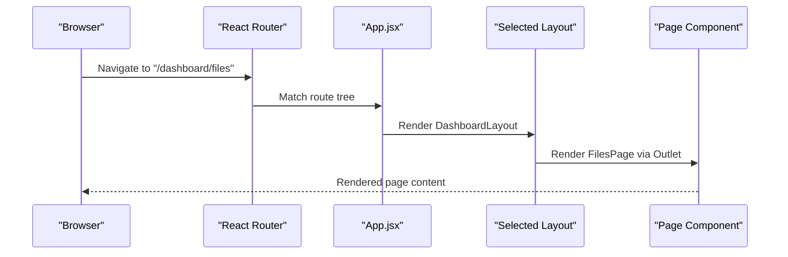
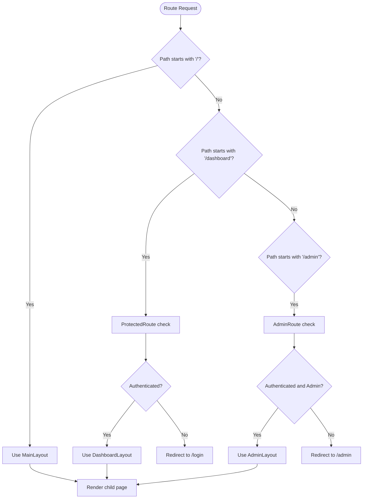
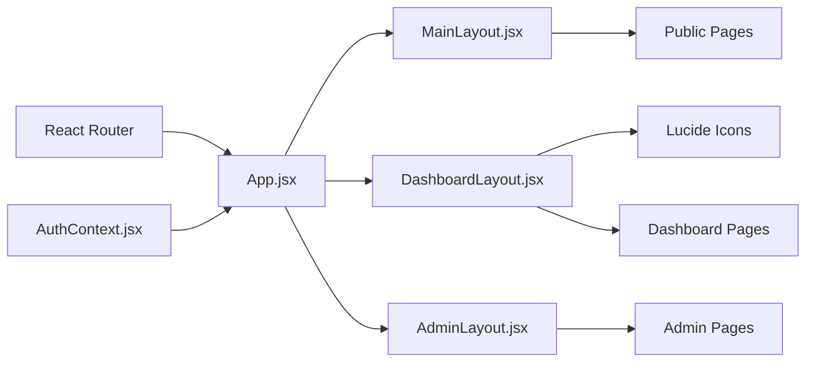

# Layout System

<cite>
**Referenced Files in This Document**
- [MainLayout.jsx](file://web/src/layouts/MainLayout.jsx)
- [DashboardLayout.jsx](file://web/src/layouts/DashboardLayout.jsx)
- [AdminLayout.jsx](file://web/src/layouts/AdminLayout.jsx)
- [App.jsx](file://web/src/App.jsx)
- [AuthContext.jsx](file://web/src/contexts/AuthContext.jsx)
- [main.jsx](file://web/src/main.jsx)
- [DashboardPage.jsx](file://web/src/pages/DashboardPage.jsx)
- [FilesPage.jsx](file://web/src/pages/FilesPage.jsx)
- [AdminDashboardPage.jsx](file://web/src/pages/AdminDashboardPage.jsx)
- [LandingPage.jsx](file://web/src/pages/LandingPage.jsx)
- [LoginPage.jsx](file://web/src/pages/LoginPage.jsx)
</cite>

## Table of Contents
1. [Introduction](#introduction)
2. [Project Structure](#project-structure)
3. [Core Components](#core-components)
4. [Architecture Overview](#architecture-overview)
5. [Detailed Component Analysis](#detailed-component-analysis)
6. [Dependency Analysis](#dependency-analysis)
7. [Performance Considerations](#performance-considerations)
8. [Troubleshooting Guide](#troubleshooting-guide)
9. [Conclusion](#conclusion)

## Introduction
This document explains the layout system architecture used in the application. It focuses on the three-tier layout structure (MainLayout, DashboardLayout, AdminLayout), how they are integrated with the routing system, and how they organize content. It also covers responsive design patterns, navigation, header/footer implementations, sidebar management, mobile responsiveness, layout switching logic, conditional rendering, and layout-specific styling approaches.

## Project Structure
The layout system is organized around three layout components that wrap different page types:
- MainLayout: Wraps public pages such as landing and login.
- DashboardLayout: Wraps protected user dashboard pages with a sidebar, header, and main content area.
- AdminLayout: Wraps admin-only pages with minimal structure.

Routing is defined centrally in the application shell, where each route specifies which layout to use and which page component renders inside the layout’s outlet.

**Diagram sources**
- [main.jsx:19-40](file://web/src/main.jsx#L19-L40)
- [App.jsx:54-91](file://web/src/App.jsx#L54-L91)
- [MainLayout.jsx:3-9](file://web/src/layouts/MainLayout.jsx#L3-L9)
- [DashboardLayout.jsx:24-199](file://web/src/layouts/DashboardLayout.jsx#L24-L199)
- [AdminLayout.jsx:3-9](file://web/src/layouts/AdminLayout.jsx#L3-L9)
- [LandingPage.jsx:7-230](file://web/src/pages/LandingPage.jsx#L7-L230)
- [LoginPage.jsx:7-77](file://web/src/pages/LoginPage.jsx#L7-L77)
- [DashboardPage.jsx:7-177](file://web/src/pages/DashboardPage.jsx#L7-L177)
- [FilesPage.jsx:34-536](file://web/src/pages/FilesPage.jsx#L34-L536)
- [AdminDashboardPage.jsx:13-436](file://web/src/pages/AdminDashboardPage.jsx#L13-L436)

**Section sources**
- [main.jsx:19-40](file://web/src/main.jsx#L19-L40)
- [App.jsx:54-91](file://web/src/App.jsx#L54-L91)

## Core Components
- MainLayout: Provides a minimal wrapper for public pages with a single Outlet for child content.
- DashboardLayout: Provides a responsive two-column layout with a collapsible sidebar, top header, and main content area. Handles user profile dropdown, sign-out, and upload triggers.
- AdminLayout: Minimal wrapper for admin pages similar to MainLayout but scoped under the /admin route.

Key responsibilities:
- Layout selection per route via nested routes.
- Conditional rendering based on authentication and admin status.
- Responsive behavior using Tailwind breakpoints and transform classes.

**Section sources**
- [MainLayout.jsx:3-9](file://web/src/layouts/MainLayout.jsx#L3-L9)
- [DashboardLayout.jsx:24-199](file://web/src/layouts/DashboardLayout.jsx#L24-L199)
- [AdminLayout.jsx:3-9](file://web/src/layouts/AdminLayout.jsx#L3-L9)

## Architecture Overview
The routing architecture defines three groups of routes:
- Public routes under "/" using MainLayout (landing, login, OAuth callback).
- Protected routes under "/dashboard" using DashboardLayout (dashboard, files, shared, settings).
- Admin routes under "/admin" using AdminLayout (admin login, admin dashboard).

ProtectedRoute and AdminRoute wrappers enforce authentication and admin privileges respectively.

**Diagram sources**
- [App.jsx:73-81](file://web/src/App.jsx#L73-L81)
- [DashboardLayout.jsx:193-195](file://web/src/layouts/DashboardLayout.jsx#L193-L195)
- [FilesPage.jsx:34-536](file://web/src/pages/FilesPage.jsx#L34-L536)

**Section sources**
- [App.jsx:54-91](file://web/src/App.jsx#L54-L91)

## Detailed Component Analysis

### MainLayout
Purpose:
- Wraps public pages with a minimal container and Outlet for rendering child routes.

Responsibilities:
- Provides a consistent background and minimum height for public pages.
- Does not include navigation, header, or sidebar.

Responsive design:
- Uses min-h-screen for full viewport height.
- No layout-specific responsive classes here; responsive behavior is handled by child pages.

Integration with routing:
- Used as the layout for public routes under "/" in App.jsx.

**Section sources**
- [MainLayout.jsx:3-9](file://web/src/layouts/MainLayout.jsx#L3-L9)
- [App.jsx:58-62](file://web/src/App.jsx#L58-L62)

### DashboardLayout
Purpose:
- Provides a complete user dashboard shell with sidebar navigation, top header, and main content area.

Key features:
- Collapsible sidebar with mobile overlay and backdrop click-to-close.
- Top header with mobile hamburger menu, upload button, notifications, and user profile dropdown.
- Navigation items mapped from a configuration array.
- Profile dropdown with settings link and sign-out.
- Upload trigger event to coordinate with child pages.

Responsive design:
- Sidebar transforms off-canvas on mobile and becomes static on large screens.
- Header adapts spacing and hides certain elements on small screens.
- Uses Tailwind utilities for breakpoint-specific behavior.

Navigation patterns:
- Uses NavLink for active state styling.
- Active item highlighting based on exact match for dashboard root.

Content organization:
- Left sidebar for navigation.
- Main content area for page content rendered via Outlet.

Mobile responsiveness:
- Mobile overlay and transform classes control sidebar visibility.
- Hamburger menu toggles sidebar open/close.
- Dropdown menus are positioned absolutely and visible on top of content.

Layout switching logic:
- Switched by routing configuration in App.jsx; DashboardLayout wraps "/dashboard/*" routes.

Conditional rendering:
- Profile dropdown visibility controlled by state.
- Sidebar visibility controlled by state and mobile overlay.

Layout-specific styling:
- Uses Tailwind classes for layout structure, borders, shadows, and responsive breakpoints.

**Section sources**
- [DashboardLayout.jsx:24-199](file://web/src/layouts/DashboardLayout.jsx#L24-L199)
- [App.jsx:73-81](file://web/src/App.jsx#L73-L81)

### AdminLayout
Purpose:
- Wraps admin-only pages with a minimal container and Outlet for rendering child routes.

Responsibilities:
- Provides a consistent background and minimum height for admin pages.
- Does not include navigation, header, or sidebar.

Responsive design:
- Uses min-h-screen for full viewport height.
- No layout-specific responsive classes here; responsive behavior is handled by child pages.

Integration with routing:
- Used as the layout for admin routes under "/admin" in App.jsx.

**Section sources**
- [AdminLayout.jsx:3-9](file://web/src/layouts/AdminLayout.jsx#L3-L9)
- [App.jsx:64-70](file://web/src/App.jsx#L64-L70)

### Routing and Layout Composition
Routing groups:
- Public routes: "/", "/login", "/auth/callback" wrapped by MainLayout.
- Protected routes: "/dashboard/*" wrapped by DashboardLayout with ProtectedRoute wrapper.
- Admin routes: "/admin/*" wrapped by AdminLayout with AdminRoute wrapper.

ProtectedRoute and AdminRoute:
- ProtectedRoute checks authentication and redirects unauthenticated users to login.
- AdminRoute checks both authentication and admin status, redirecting appropriately.

**Diagram sources**
- [App.jsx:28-41](file://web/src/App.jsx#L28-L41)
- [App.jsx:54-91](file://web/src/App.jsx#L54-L91)

**Section sources**
- [App.jsx:28-41](file://web/src/App.jsx#L28-L41)
- [App.jsx:54-91](file://web/src/App.jsx#L54-L91)

### Header/Footer Implementation
Headers:
- MainLayout does not define a header; public pages render their own headers.
- DashboardLayout defines a top header with mobile menu, upload button, notifications, and user profile dropdown.
- AdminDashboardPage defines its own header with branding and logout.

Footers:
- MainLayout does not define a footer; public pages render their own footers.
- LandingPage defines a footer with branding and links.

Note: There are no shared Header.jsx or Footer.jsx components in the repository; each page implements its own header/footer as needed.

**Section sources**
- [LandingPage.jsx:62-227](file://web/src/pages/LandingPage.jsx#L62-L227)
- [DashboardLayout.jsx:134-190](file://web/src/layouts/DashboardLayout.jsx#L134-L190)
- [AdminDashboardPage.jsx:149-168](file://web/src/pages/AdminDashboardPage.jsx#L149-L168)

### Sidebar Management
DashboardLayout manages a collapsible sidebar:
- State controls sidebarOpen and profileOpen.
- Mobile overlay appears behind the sidebar and closes it on outside clicks.
- Sidebar transforms off-screen on mobile and becomes static on large screens.
- Navigation items are defined in a configuration array and rendered with NavLink.

**Section sources**
- [DashboardLayout.jsx:27-60](file://web/src/layouts/DashboardLayout.jsx#L27-L60)
- [DashboardLayout.jsx:83-129](file://web/src/layouts/DashboardLayout.jsx#L83-L129)

### Mobile Responsiveness
Responsive patterns used:
- lg breakpoint for sidebar static positioning and hiding mobile menu.
- transform classes for slide-in/slide-out sidebar animation.
- Conditional rendering for mobile-only elements (mobile menu, overlay).
- Absolute positioning for dropdowns with z-index management.

**Section sources**
- [DashboardLayout.jsx:63-67](file://web/src/layouts/DashboardLayout.jsx#L63-L67)
- [DashboardLayout.jsx:55-60](file://web/src/layouts/DashboardLayout.jsx#L55-L60)
- [DashboardLayout.jsx:136-142](file://web/src/layouts/DashboardLayout.jsx#L136-L142)

### Layout-Specific Styling Approvements
Styling approach:
- Tailwind utility classes for layout structure, spacing, colors, and responsive breakpoints.
- Consistent use of bg-gray-50 for backgrounds and white cards for content areas.
- Active state styling for navigation items using isActive from NavLink.

**Section sources**
- [DashboardLayout.jsx:90-96](file://web/src/layouts/DashboardLayout.jsx#L90-L96)
- [DashboardPage.jsx:46-105](file://web/src/pages/DashboardPage.jsx#L46-L105)

### Integration with Routing System
How layouts wrap different page types:
- App.jsx defines nested routes with layout components as parents.
- ProtectedRoute and AdminRoute enforce access control before rendering layouts.
- AuthContext provides authentication state and admin flag used by route guards.

**Section sources**
- [App.jsx:54-91](file://web/src/App.jsx#L54-L91)
- [AuthContext.jsx:66-82](file://web/src/contexts/AuthContext.jsx#L66-L82)

## Dependency Analysis
The layout system depends on:
- React Router for routing and nested routes.
- AuthContext for authentication and admin checks.
- Lucide icons for UI elements within layouts.
- Tailwind CSS for responsive styling.

**Diagram sources**
- [App.jsx:1-92](file://web/src/App.jsx#L1-L92)
- [AuthContext.jsx:1-112](file://web/src/contexts/AuthContext.jsx#L1-L112)
- [DashboardLayout.jsx:3-14](file://web/src/layouts/DashboardLayout.jsx#L3-L14)

**Section sources**
- [App.jsx:1-92](file://web/src/App.jsx#L1-L92)
- [AuthContext.jsx:1-112](file://web/src/contexts/AuthContext.jsx#L1-L112)

## Performance Considerations
- Minimize heavy computations in layout components; keep them declarative.
- Use CSS transforms for sidebar animations to leverage GPU acceleration.
- Avoid unnecessary re-renders by keeping layout state local and scoped.
- Lazy-load heavy page components if needed, though current pages appear self-contained.

## Troubleshooting Guide
Common issues and resolutions:
- Authentication redirects: ProtectedRoute and AdminRoute redirect unauthenticated or unauthorized users. Verify AuthContext state and ensure proper login flow.
- Sidebar not closing: Ensure click handlers and overlay click events are attached and state updates correctly.
- Upload not triggering: Confirm that the upload button dispatches the trigger-upload event and child pages listen for it.
- Admin access denied: AdminRoute requires both authentication and admin status; verify admin flag in AuthContext.

**Section sources**
- [App.jsx:28-41](file://web/src/App.jsx#L28-L41)
- [DashboardLayout.jsx:46-50](file://web/src/layouts/DashboardLayout.jsx#L46-L50)
- [FilesPage.jsx:51-55](file://web/src/pages/FilesPage.jsx#L51-L55)

## Conclusion
The layout system uses a clear three-tier structure that aligns with the application’s routing model. MainLayout handles public pages, DashboardLayout provides a rich, responsive user experience with navigation and profile management, and AdminLayout serves admin-only content. The routing configuration ensures that each page type is wrapped by the appropriate layout, while route guards enforce authentication and admin privileges. The system leverages Tailwind for responsive design and React Router for structured navigation.