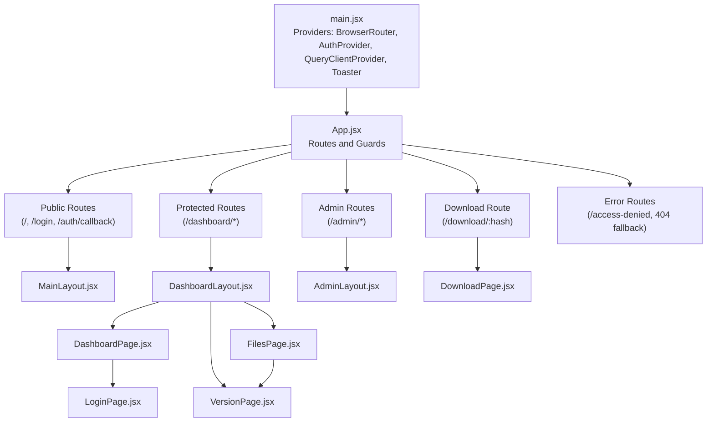
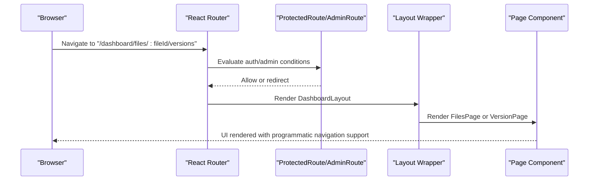
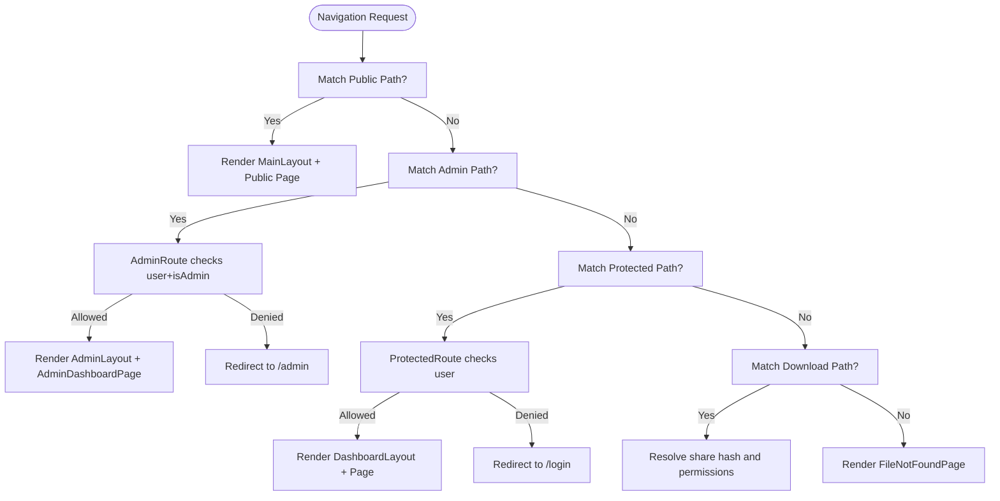
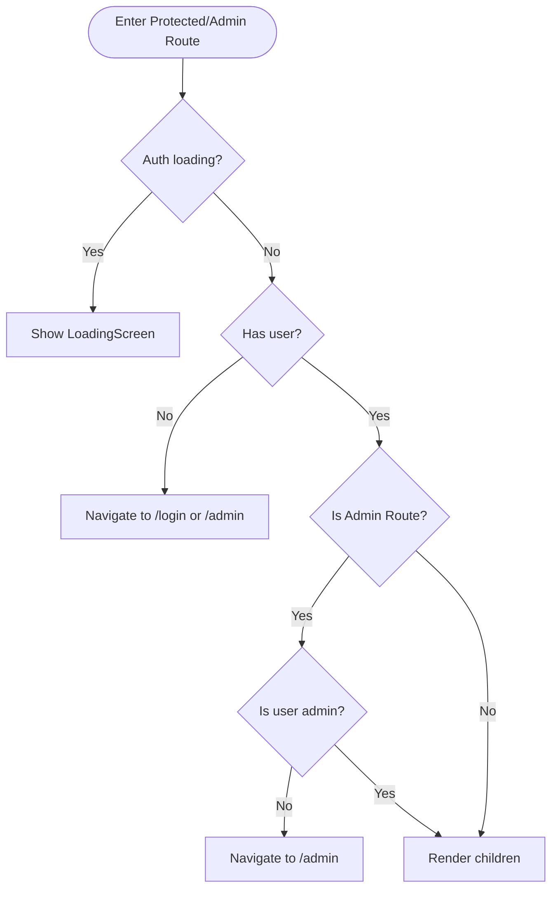
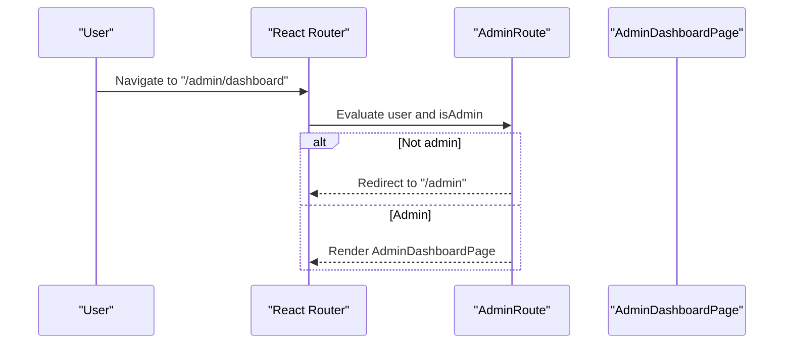
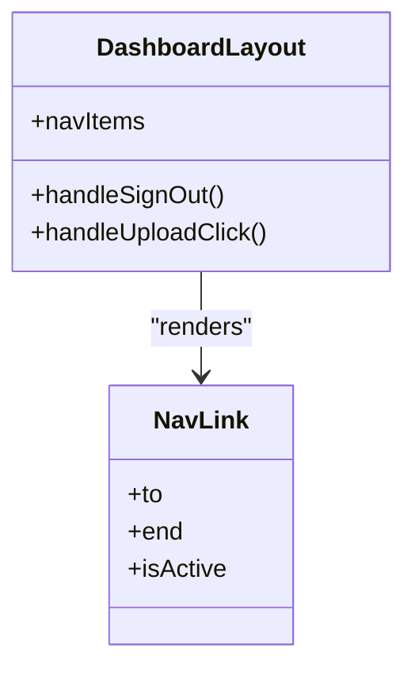
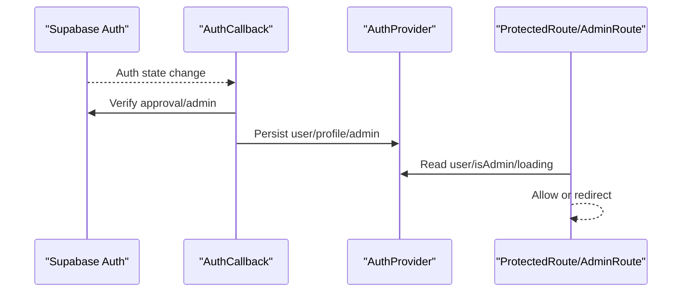
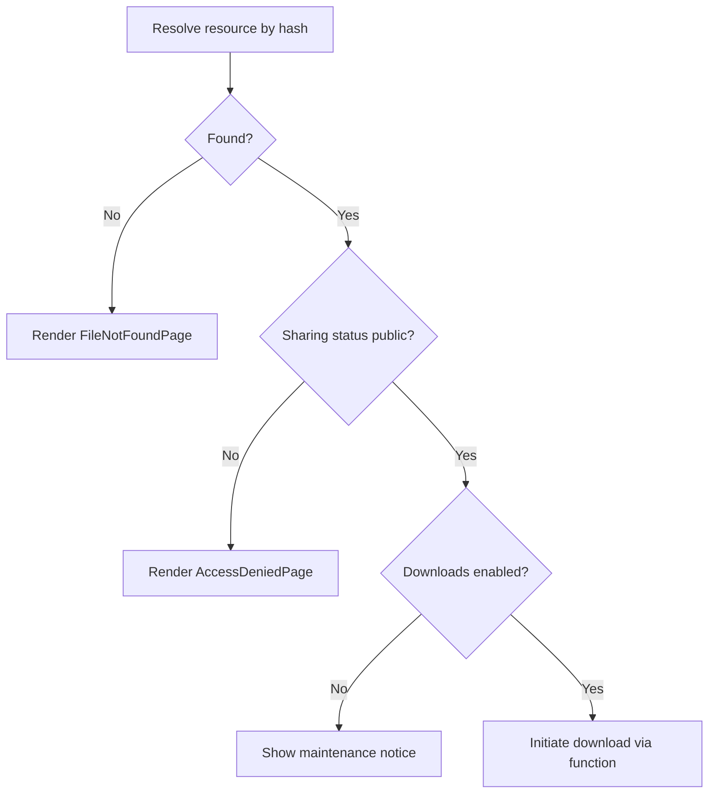
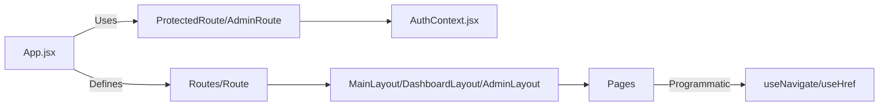

# Routing and Navigation

<cite>
**Referenced Files in This Document**
- [main.jsx](file://web/src/main.jsx)
- [App.jsx](file://web/src/App.jsx)
- [AuthContext.jsx](file://web/src/contexts/AuthContext.jsx)
- [MainLayout.jsx](file://web/src/layouts/MainLayout.jsx)
- [DashboardLayout.jsx](file://web/src/layouts/DashboardLayout.jsx)
- [AdminLayout.jsx](file://web/src/layouts/AdminLayout.jsx)
- [LoginPage.jsx](file://web/src/pages/LoginPage.jsx)
- [AdminLoginPage.jsx](file://web/src/pages/AdminLoginPage.jsx)
- [AdminDashboardPage.jsx](file://web/src/pages/AdminDashboardPage.jsx)
- [DashboardPage.jsx](file://web/src/pages/DashboardPage.jsx)
- [FilesPage.jsx](file://web/src/pages/FilesPage.jsx)
- [VersionPage.jsx](file://web/src/pages/VersionPage.jsx)
- [DownloadPage.jsx](file://web/src/pages/DownloadPage.jsx)
- [AccessDeniedPage.jsx](file://web/src/pages/AccessDeniedPage.jsx)
- [FileNotFoundPage.jsx](file://web/src/pages/FileNotFoundPage.jsx)
- [AuthCallback.jsx](file://web/src/pages/AuthCallback.jsx)
- [supabase.js](file://web/src/services/supabase.js)
</cite>

## Table of Contents
1. [Introduction](#introduction)
2. [Project Structure](#project-structure)
3. [Core Components](#core-components)
4. [Architecture Overview](#architecture-overview)
5. [Detailed Component Analysis](#detailed-component-analysis)
6. [Dependency Analysis](#dependency-analysis)
7. [Performance Considerations](#performance-considerations)
8. [Troubleshooting Guide](#troubleshooting-guide)
9. [Conclusion](#conclusion)
10. [Appendices](#appendices)

## Introduction
This document explains the routing and navigation system for the frontend application. It covers React Router configuration, route protection, navigation patterns, programmatic navigation, route parameters and query strings, navigation guards, active link highlighting, and integration with authentication context. It also documents error handling for invalid routes and SEO considerations for client-side routing.

## Project Structure
The routing system is defined centrally in the application shell and composed with layout wrappers and page components. Providers for routing, authentication, and global UI state are initialized at the root.

**Diagram sources**
- [main.jsx:19-40](file://web/src/main.jsx#L19-L40)
- [App.jsx:54-91](file://web/src/App.jsx#L54-L91)
- [MainLayout.jsx:1-10](file://web/src/layouts/MainLayout.jsx#L1-L10)
- [DashboardLayout.jsx:24-200](file://web/src/layouts/DashboardLayout.jsx#L24-L200)
- [AdminLayout.jsx:1-10](file://web/src/layouts/AdminLayout.jsx#L1-L10)
- [LoginPage.jsx:7-77](file://web/src/pages/LoginPage.jsx#L7-L77)
- [FilesPage.jsx:34-536](file://web/src/pages/FilesPage.jsx#L34-L536)
- [VersionPage.jsx:9-225](file://web/src/pages/VersionPage.jsx#L9-L225)
- [DownloadPage.jsx:6-158](file://web/src/pages/DownloadPage.jsx#L6-L158)

**Section sources**
- [main.jsx:19-40](file://web/src/main.jsx#L19-L40)
- [App.jsx:54-91](file://web/src/App.jsx#L54-L91)

## Core Components
- React Router configuration and route hierarchy are defined in the application shell.
- Authentication context provides user state, admin flag, and session lifecycle.
- Layout components wrap page routes to share common UI and navigation.
- Guard components enforce authentication and authorization.

Key responsibilities:
- App.jsx: Declares routes, nested layouts, and guards.
- AuthContext.jsx: Manages session, profile, admin role, and auth callbacks.
- Layouts: Provide shared navigation and outlet rendering.
- Pages: Implement route-specific logic and programmatic navigation.

**Section sources**
- [App.jsx:28-52](file://web/src/App.jsx#L28-L52)
- [AuthContext.jsx:6-103](file://web/src/contexts/AuthContext.jsx#L6-L103)

## Architecture Overview
The routing architecture separates concerns into public, protected, and admin domains. Guards protect routes based on authentication and authorization. Programmatic navigation is used extensively for user actions and redirects.

**Diagram sources**
- [App.jsx:72-81](file://web/src/App.jsx#L72-L81)
- [DashboardLayout.jsx:24-200](file://web/src/layouts/DashboardLayout.jsx#L24-L200)
- [FilesPage.jsx:34-536](file://web/src/pages/FilesPage.jsx#L34-L536)
- [VersionPage.jsx:9-225](file://web/src/pages/VersionPage.jsx#L9-L225)

## Detailed Component Analysis

### React Router Configuration and Route Hierarchy
- Public routes: home, login, OAuth callback.
- Admin routes: admin landing and admin dashboard guarded by AdminRoute.
- Protected routes: dashboard and nested pages guarded by ProtectedRoute.
- Download route: resolves share hash and enforces permissions.
- Error routes: access denied and generic 404.

**Diagram sources**
- [App.jsx:56-89](file://web/src/App.jsx#L56-L89)
- [DownloadPage.jsx:6-158](file://web/src/pages/DownloadPage.jsx#L6-L158)

**Section sources**
- [App.jsx:54-91](file://web/src/App.jsx#L54-L91)

### Route Protection Mechanisms
- ProtectedRoute: Redirects unauthenticated users to login; renders children when authenticated.
- AdminRoute: Redirects unauthenticated users to admin login; redirects non-admin users to admin login; renders children when authorized.
- LoadingScreen: Prevents flicker during auth state resolution.

**Diagram sources**
- [App.jsx:28-41](file://web/src/App.jsx#L28-L41)
- [AuthContext.jsx:12-38](file://web/src/contexts/AuthContext.jsx#L12-L38)

**Section sources**
- [App.jsx:28-41](file://web/src/App.jsx#L28-L41)

### Navigation Patterns and Programmatic Navigation
- DashboardLayout uses NavLink for active link highlighting and useNavigate for sign out and quick actions.
- DashboardPage navigates to settings and quick actions trigger uploads.
- FilesPage navigates to version history and handles bulk actions.
- VersionPage navigates back to files list.
- AdminDashboardPage signs out and navigates after logout.
- LoginPage and AdminLoginPage redirect authenticated users to appropriate destinations.
- DownloadPage sets window location to initiate downloads.

Common patterns:
- useNavigate for internal navigation after actions.
- useHref/useLocation for external triggers (e.g., triggering uploads).
- Redirects on auth state changes to avoid stale UI.

**Section sources**
- [DashboardLayout.jsx:41-50](file://web/src/layouts/DashboardLayout.jsx#L41-L50)
- [DashboardPage.jsx:67-142](file://web/src/pages/DashboardPage.jsx#L67-L142)
- [FilesPage.jsx:459-477](file://web/src/pages/FilesPage.jsx#L459-L477)
- [VersionPage.jsx:142-146](file://web/src/pages/VersionPage.jsx#L142-L146)
- [AdminDashboardPage.jsx:129-137](file://web/src/pages/AdminDashboardPage.jsx#L129-L137)
- [LoginPage.jsx:11-15](file://web/src/pages/LoginPage.jsx#L11-L15)
- [AdminLoginPage.jsx:21-24](file://web/src/pages/AdminLoginPage.jsx#L21-L24)
- [DownloadPage.jsx:64-65](file://web/src/pages/DownloadPage.jsx#L64-L65)

### Route Parameters, Query Strings, and Navigation Guards
- Route parameters:
  - Version route: captures fileId from path for version management.
  - Download route: captures share hash for resolving downloadable resources.
- Query strings:
  - Download route uses query string to pass hash to serverless function.
- Navigation guards:
  - AdminRoute ensures admin-only access.
  - ProtectedRoute ensures authenticated access.
  - LoginPage and AdminLoginPage guard against unauthorized access and redirect accordingly.

**Diagram sources**
- [App.jsx:67-69](file://web/src/App.jsx#L67-L69)
- [AdminRoute.jsx:35-41](file://web/src/App.jsx#L35-L41)

**Section sources**
- [VersionPage.jsx:10-21](file://web/src/pages/VersionPage.jsx#L10-L21)
- [DownloadPage.jsx:7-73](file://web/src/pages/DownloadPage.jsx#L7-L73)
- [App.jsx:35-41](file://web/src/App.jsx#L35-L41)

### Active Link Highlighting and Navigation State Management
- DashboardLayout defines navItems with explicit end matching for exact matches.
- NavLink applies dynamic classes based on isActive to highlight current route.
- useNavigate is used for programmatic navigation and state transitions.

**Diagram sources**
- [DashboardLayout.jsx:17-101](file://web/src/layouts/DashboardLayout.jsx#L17-L101)

**Section sources**
- [DashboardLayout.jsx:17-101](file://web/src/layouts/DashboardLayout.jsx#L17-L101)

### Breadcrumb Implementation
- The codebase does not implement breadcrumbs. Navigation relies on explicit links and programmatic navigation. If breadcrumbs are desired, they can be implemented by deriving path segments from the current location and mapping them to labels, or by passing breadcrumb props down through layouts.

[No sources needed since this section doesn't analyze specific files]

### Integration with Authentication Context
- AuthProvider initializes session monitoring and admin role detection.
- AuthCallback validates user approval and admin status, then persists profile.
- Guards consume useAuth to decide navigation.

**Diagram sources**
- [AuthContext.jsx:12-38](file://web/src/contexts/AuthContext.jsx#L12-L38)
- [AuthCallback.jsx:9-45](file://web/src/pages/AuthCallback.jsx#L9-L45)
- [App.jsx:28-41](file://web/src/App.jsx#L28-L41)

**Section sources**
- [AuthContext.jsx:6-103](file://web/src/contexts/AuthContext.jsx#L6-L103)
- [AuthCallback.jsx:6-45](file://web/src/pages/AuthCallback.jsx#L6-L45)

### Error Handling for Invalid Routes
- AccessDeniedPage and FileNotFoundPage provide user-friendly error surfaces.
- DownloadPage handles multiple failure modes: private access, maintenance mode, not found, and errors.
- Guards redirect to appropriate destinations when auth or admin checks fail.

**Diagram sources**
- [DownloadPage.jsx:11-73](file://web/src/pages/DownloadPage.jsx#L11-L73)
- [AccessDeniedPage.jsx:4-22](file://web/src/pages/AccessDeniedPage.jsx#L4-L22)
- [FileNotFoundPage.jsx:4-22](file://web/src/pages/FileNotFoundPage.jsx#L4-L22)

**Section sources**
- [DownloadPage.jsx:6-158](file://web/src/pages/DownloadPage.jsx#L6-L158)
- [AccessDeniedPage.jsx:4-22](file://web/src/pages/AccessDeniedPage.jsx#L4-L22)
- [FileNotFoundPage.jsx:4-22](file://web/src/pages/FileNotFoundPage.jsx#L4-L22)

### SEO Considerations for Client-Side Routing
- The application uses hash-based routing via BrowserRouter but does not implement meta tag generation or canonical URLs.
- Recommendations:
  - Add meta tags for title and description per route.
  - Implement a head management solution to update document metadata on navigation.
  - Consider server-side rendering or pre-rendering for critical pages to improve SEO.

[No sources needed since this section provides general guidance]

## Dependency Analysis
Routing depends on:
- React Router for declarative routing and guards.
- AuthContext for authentication and admin state.
- Layouts for shared navigation and outlet rendering.
- Pages for route-specific logic and programmatic navigation.

**Diagram sources**
- [App.jsx:54-91](file://web/src/App.jsx#L54-L91)
- [AuthContext.jsx:6-103](file://web/src/contexts/AuthContext.jsx#L6-L103)
- [DashboardLayout.jsx:24-200](file://web/src/layouts/DashboardLayout.jsx#L24-L200)

**Section sources**
- [App.jsx:54-91](file://web/src/App.jsx#L54-L91)
- [AuthContext.jsx:6-103](file://web/src/contexts/AuthContext.jsx#L6-L103)

## Performance Considerations
- Keep guards lightweight; avoid heavy computations inside ProtectedRoute/AdminRoute.
- Defer expensive page loads to lazy-loaded components if routes become numerous.
- Use caching for static assets and leverage the global QueryClient for data caching.

[No sources needed since this section provides general guidance]

## Troubleshooting Guide
Common issues and resolutions:
- Stuck on loading screen: Ensure AuthProvider initializes and auth state resolves; check Supabase connection.
- Redirect loops: Verify guards and redirects; confirm user state and admin flag are accurate.
- Download failures: Check share hash validity, sharing status, and system settings; inspect network requests to edge functions.
- Navigation not working: Confirm useNavigate is called within a routing context and not during SSR.

**Section sources**
- [AuthContext.jsx:12-38](file://web/src/contexts/AuthContext.jsx#L12-L38)
- [App.jsx:28-41](file://web/src/App.jsx#L28-L41)
- [DownloadPage.jsx:11-73](file://web/src/pages/DownloadPage.jsx#L11-L73)

## Conclusion
The routing and navigation system cleanly separates public, protected, and admin domains with robust guards and layout composition. Programmatic navigation and explicit route parameters enable rich user experiences, while error pages provide clear feedback. Extending the system with breadcrumbs, metadata management, and SSR would further enhance UX and SEO.

## Appendices

### Route Reference Summary
- Public
  - /: Landing page
  - /login: Login page
  - /auth/callback: OAuth callback
- Protected
  - /dashboard: Dashboard page
  - /dashboard/files: Files page
  - /dashboard/shared: Shared files page
  - /dashboard/settings: Settings page
  - /dashboard/files/:fileId/versions: Version page
- Admin
  - /admin: Admin login page
  - /admin/dashboard: Admin dashboard page
- Download
  - /download/:hash: Download resolver
- Errors
  - /access-denied: Access denied page
  - *: File not found page

**Section sources**
- [App.jsx:56-89](file://web/src/App.jsx#L56-L89)