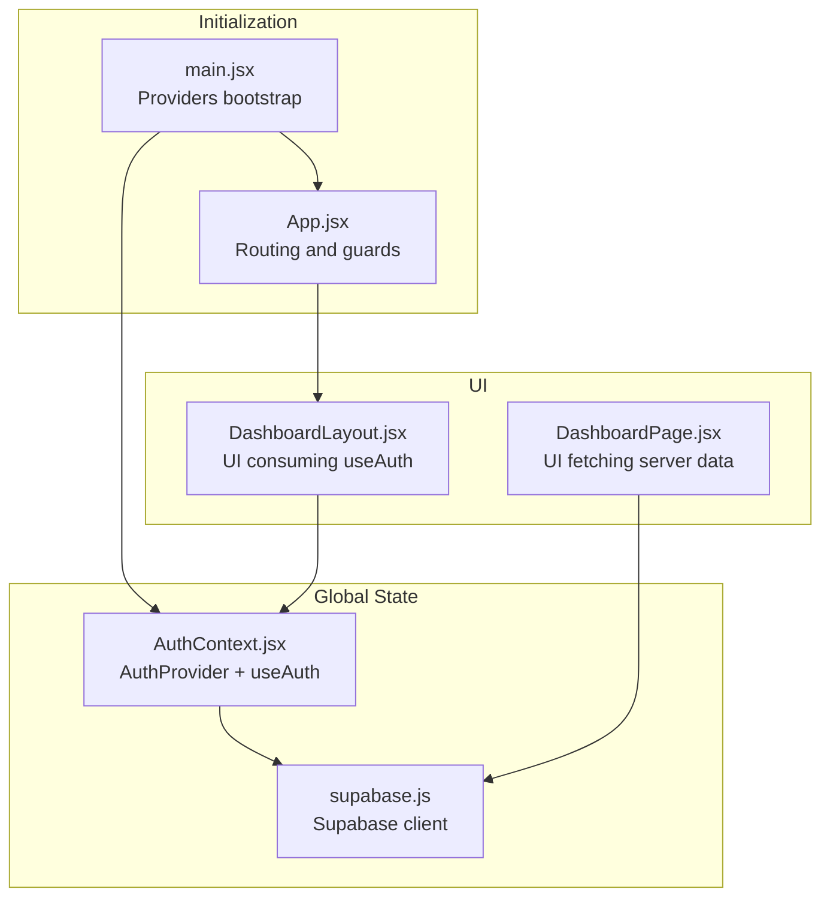
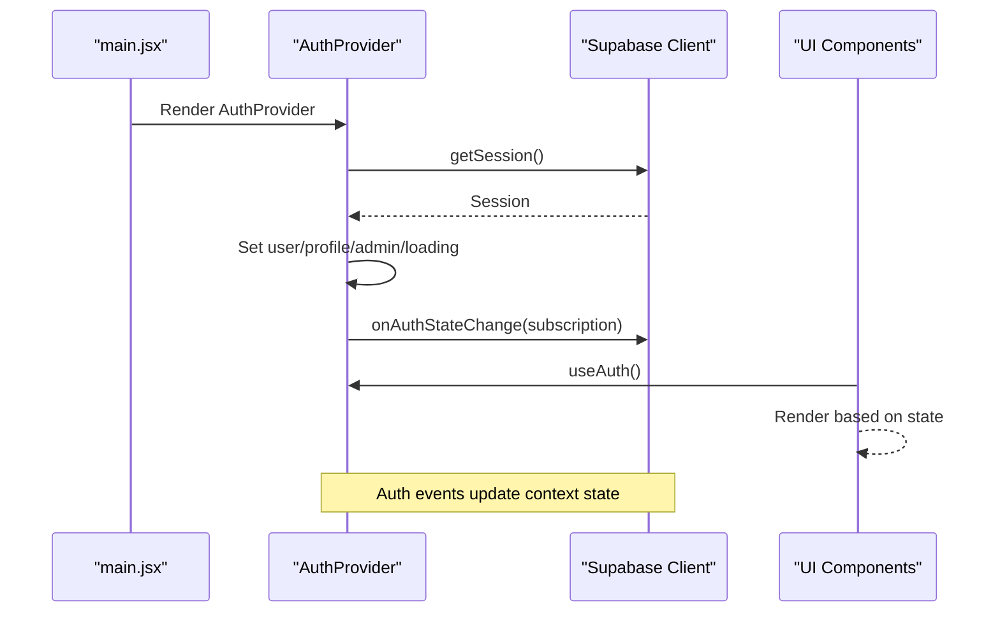
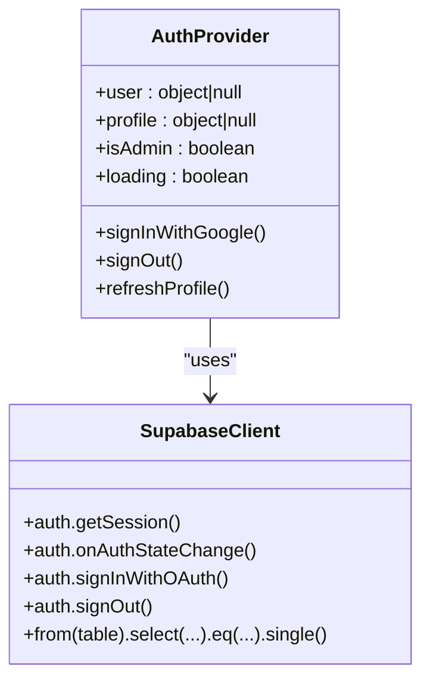
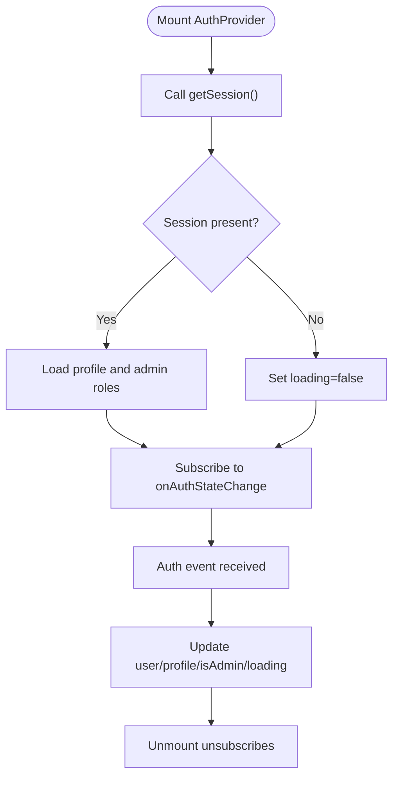
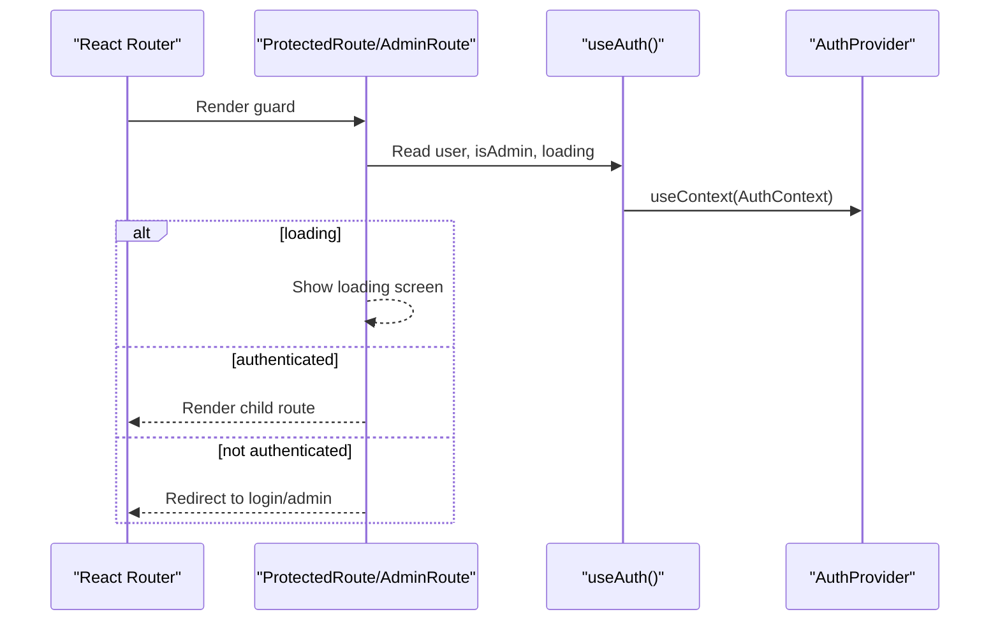
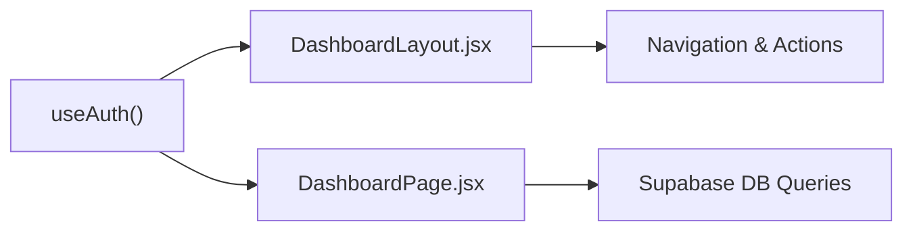
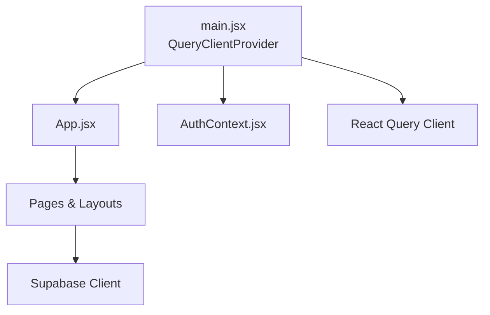
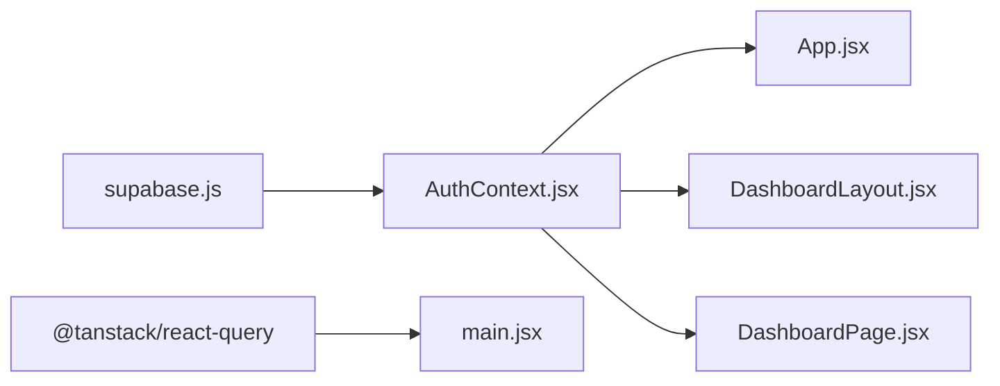

# State Management

<cite>
**Referenced Files in This Document**
- [AuthContext.jsx](file://web/src/contexts/AuthContext.jsx)
- [supabase.js](file://web/src/services/supabase.js)
- [main.jsx](file://web/src/main.jsx)
- [App.jsx](file://web/src/App.jsx)
- [DashboardLayout.jsx](file://web/src/layouts/DashboardLayout.jsx)
- [DashboardPage.jsx](file://web/src/pages/DashboardPage.jsx)
- [package.json](file://web/package.json)
</cite>

## Table of Contents
1. [Introduction](#introduction)
2. [Project Structure](#project-structure)
3. [Core Components](#core-components)
4. [Architecture Overview](#architecture-overview)
5. [Detailed Component Analysis](#detailed-component-analysis)
6. [Dependency Analysis](#dependency-analysis)
7. [Performance Considerations](#performance-considerations)
8. [Troubleshooting Guide](#troubleshooting-guide)
9. [Conclusion](#conclusion)

## Introduction
This document explains the state management architecture of the web application, focusing on context-based state management, authentication state handling, and global state patterns. It documents the AuthContext implementation, state synchronization with Supabase, and how React Query is integrated for server state management. It also covers custom hooks for state management, state update patterns, subscription mechanisms, performance considerations, and memory leak prevention.

## Project Structure
The state management spans three primary areas:
- Global authentication state via a React Context provider
- Supabase client initialization and database interactions
- React Query integration for server state caching and updates

**Diagram sources**
- [main.jsx:19-40](file://web/src/main.jsx#L19-L40)
- [AuthContext.jsx:6-103](file://web/src/contexts/AuthContext.jsx#L6-L103)
- [supabase.js:1-7](file://web/src/services/supabase.js#L1-L7)
- [App.jsx:54-91](file://web/src/App.jsx#L54-L91)
- [DashboardLayout.jsx:24-44](file://web/src/layouts/DashboardLayout.jsx#L24-L44)
- [DashboardPage.jsx:7-40](file://web/src/pages/DashboardPage.jsx#L7-L40)

**Section sources**
- [main.jsx:19-40](file://web/src/main.jsx#L19-L40)
- [package.json:11-20](file://web/package.json#L11-L20)

## Core Components
- AuthProvider: Centralizes authentication state (user, profile, admin flag, loading) and synchronizes it with Supabase auth events. Exposes actions for sign-in/sign-out and profile refresh.
- useAuth: Custom hook returning the current auth context, enforcing provider presence.
- Supabase client: Created once and reused across modules for auth and database operations.
- ProtectedRoute/AdminRoute: Route guards that depend on useAuth for navigation decisions.

Key responsibilities:
- Initialize session and listen to auth state changes
- Load user profile and admin role
- Provide sign-in/sign-out actions
- Support route protection and admin-only access

**Section sources**
- [AuthContext.jsx:6-103](file://web/src/contexts/AuthContext.jsx#L6-L103)
- [AuthContext.jsx:105-112](file://web/src/contexts/AuthContext.jsx#L105-L112)
- [supabase.js:1-7](file://web/src/services/supabase.js#L1-L7)
- [App.jsx:28-41](file://web/src/App.jsx#L28-L41)

## Architecture Overview
The system uses a layered approach:
- Providers at the root initialize React Query and wrap the app with AuthProvider
- AuthProvider subscribes to Supabase auth state and hydrates local state
- UI components consume useAuth for rendering and navigation decisions
- UI components may directly call Supabase for server data (as seen in dashboard page)

**Diagram sources**
- [main.jsx:19-40](file://web/src/main.jsx#L19-L40)
- [AuthContext.jsx:12-38](file://web/src/contexts/AuthContext.jsx#L12-L38)
- [AuthContext.jsx:40-64](file://web/src/contexts/AuthContext.jsx#L40-L64)

## Detailed Component Analysis

### AuthContext Implementation
AuthContext manages:
- user: currently authenticated user
- profile: hydrated user profile from the database
- isAdmin: admin role flag derived from database
- loading: initialization/loading state
- Actions: signInWithGoogle, signOut, refreshProfile

Implementation highlights:
- Initializes session on mount and subscribes to auth state changes
- Loads profile and admin role when a user exists
- Unsubscribes from auth events on cleanup to prevent leaks
- Provides a custom hook useAuth with a guard against missing provider

**Diagram sources**
- [AuthContext.jsx:6-103](file://web/src/contexts/AuthContext.jsx#L6-L103)
- [supabase.js:1-7](file://web/src/services/supabase.js#L1-L7)

**Section sources**
- [AuthContext.jsx:6-103](file://web/src/contexts/AuthContext.jsx#L6-L103)

### State Synchronization with Supabase
- Initial hydration: getSession() sets user and triggers profile/admin loading
- Real-time subscription: onAuthStateChange updates context state and cleans up on unmount
- Profile/admin resolution: database queries on user presence

**Diagram sources**
- [AuthContext.jsx:12-38](file://web/src/contexts/AuthContext.jsx#L12-L38)
- [AuthContext.jsx:40-64](file://web/src/contexts/AuthContext.jsx#L40-L64)

**Section sources**
- [AuthContext.jsx:12-38](file://web/src/contexts/AuthContext.jsx#L12-L38)
- [AuthContext.jsx:40-64](file://web/src/contexts/AuthContext.jsx#L40-L64)

### Route Guards and State Subscription
- ProtectedRoute and AdminRoute use useAuth to decide navigation
- Loading state prevents navigation until auth state is resolved
- Route guards redirect unauthenticated or unauthorized users

**Diagram sources**
- [App.jsx:28-41](file://web/src/App.jsx#L28-L41)
- [AuthContext.jsx:105-112](file://web/src/contexts/AuthContext.jsx#L105-L112)

**Section sources**
- [App.jsx:28-41](file://web/src/App.jsx#L28-L41)
- [AuthContext.jsx:105-112](file://web/src/contexts/AuthContext.jsx#L105-L112)

### UI Consumption Patterns
- DashboardLayout consumes useAuth to render profile info and sign-out
- DashboardPage fetches server data directly via Supabase for statistics
- Both demonstrate subscription to context state and reactive rendering

**Diagram sources**
- [DashboardLayout.jsx:24-44](file://web/src/layouts/DashboardLayout.jsx#L24-L44)
- [DashboardPage.jsx:7-40](file://web/src/pages/DashboardPage.jsx#L7-L40)
- [AuthContext.jsx:105-112](file://web/src/contexts/AuthContext.jsx#L105-L112)

**Section sources**
- [DashboardLayout.jsx:24-44](file://web/src/layouts/DashboardLayout.jsx#L24-L44)
- [DashboardPage.jsx:7-40](file://web/src/pages/DashboardPage.jsx#L7-L40)

### State Persistence Strategies
- Supabase session persistence: Supabase maintains session cookies/tokens; AuthProvider hydrates React state from getSession() and reacts to onAuthStateChange
- Local state persistence: React state is initialized from Supabase session and remains in-memory during the browser session; no explicit localStorage/sessionStorage persistence is implemented in the provided files

**Section sources**
- [AuthContext.jsx:12-38](file://web/src/contexts/AuthContext.jsx#L12-L38)

### Integration with React Query for Server State Management
- React Query is bootstrapped at the root with QueryClientProvider
- Default caching and retry policies are configured
- While UI pages directly call Supabase for server data, React Query can be used to manage server state centrally for scalable caching, background updates, and optimistic UI patterns

**Diagram sources**
- [main.jsx:10-17](file://web/src/main.jsx#L10-L17)
- [package.json:13](file://web/package.json#L13)

**Section sources**
- [main.jsx:10-17](file://web/src/main.jsx#L10-L17)
- [package.json:13](file://web/package.json#L13)

## Dependency Analysis
- AuthProvider depends on Supabase client for auth and database operations
- UI components depend on useAuth for state and actions
- React Query is available but not yet used for server state management in the provided files

**Diagram sources**
- [supabase.js:1-7](file://web/src/services/supabase.js#L1-L7)
- [AuthContext.jsx:6-103](file://web/src/contexts/AuthContext.jsx#L6-L103)
- [App.jsx:54-91](file://web/src/App.jsx#L54-L91)
- [DashboardLayout.jsx:24-44](file://web/src/layouts/DashboardLayout.jsx#L24-L44)
- [DashboardPage.jsx:7-40](file://web/src/pages/DashboardPage.jsx#L7-L40)
- [main.jsx:19-40](file://web/src/main.jsx#L19-L40)

**Section sources**
- [supabase.js:1-7](file://web/src/services/supabase.js#L1-L7)
- [AuthContext.jsx:6-103](file://web/src/contexts/AuthContext.jsx#L6-L103)
- [App.jsx:54-91](file://web/src/App.jsx#L54-L91)
- [DashboardLayout.jsx:24-44](file://web/src/layouts/DashboardLayout.jsx#L24-L44)
- [DashboardPage.jsx:7-40](file://web/src/pages/DashboardPage.jsx#L7-L40)
- [main.jsx:19-40](file://web/src/main.jsx#L19-L40)

## Performance Considerations
- Caching: React Query defaultOptions configure staleTime and retry to balance freshness and network usage
- Optimistic updates: Not implemented in the provided files; can be introduced with React Query mutations to improve perceived performance
- Normalization: No explicit normalization is shown; consider normalizing server data shapes for efficient updates and cache invalidation
- Memory leaks: AuthProvider unsubscribes from Supabase auth events on cleanup; ensure similar cleanup in any additional subscriptions

**Section sources**
- [main.jsx:10-17](file://web/src/main.jsx#L10-L17)
- [AuthContext.jsx:37](file://web/src/contexts/AuthContext.jsx#L37)

## Troubleshooting Guide
- useAuth outside provider: A guard throws an error if useAuth is used without AuthProvider; ensure proper provider wrapping
- Auth subscription lifecycle: Verify subscription is unsubscribed on unmount to avoid stale closures and memory leaks
- Network errors: AuthProvider logs profile loading errors; inspect console for failures during profile/admin queries

**Section sources**
- [AuthContext.jsx:105-112](file://web/src/contexts/AuthContext.jsx#L105-L112)
- [AuthContext.jsx:37](file://web/src/contexts/AuthContext.jsx#L37)
- [AuthContext.jsx:59-63](file://web/src/contexts/AuthContext.jsx#L59-L63)

## Conclusion
The application employs a clean, context-based state management model centered on AuthContext for authentication state and Supabase for real-time synchronization. Route guards enforce access control using the shared context. React Query is available at the root and can be leveraged to centralize server state management, introduce optimistic updates, and optimize caching strategies. The current implementation avoids memory leaks through proper subscription cleanup and provides a solid foundation for scaling state management patterns.