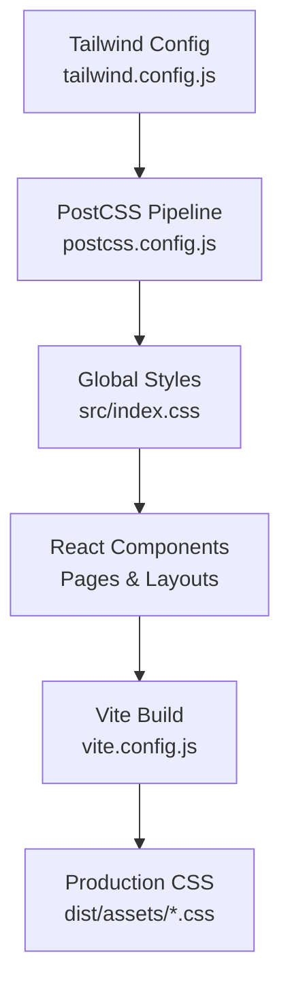
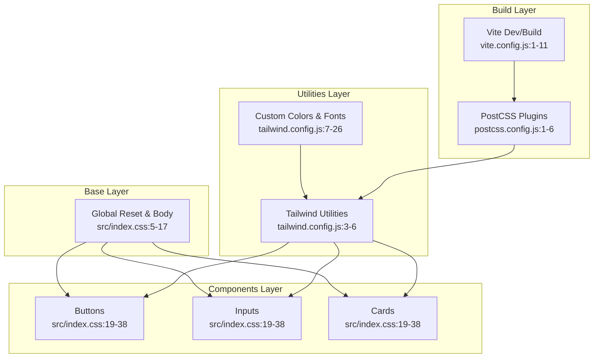
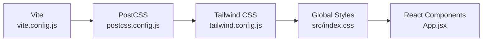

# Styling and Theming

<cite>
**Referenced Files in This Document**
- [tailwind.config.js](file://web/tailwind.config.js)
- [postcss.config.js](file://web/postcss.config.js)
- [index.css](file://web/src/index.css)
- [package.json](file://web/package.json)
- [vite.config.js](file://web/vite.config.js)
- [LandingPage.jsx](file://web/src/pages/LandingPage.jsx)
- [AdminDashboardPage.jsx](file://web/src/pages/AdminDashboardPage.jsx)
- [DashboardLayout.jsx](file://web/src/layouts/DashboardLayout.jsx)
- [App.jsx](file://web/src/App.jsx)
</cite>

## Table of Contents
1. [Introduction](#introduction)
2. [Project Structure](#project-structure)
3. [Core Components](#core-components)
4. [Architecture Overview](#architecture-overview)
5. [Detailed Component Analysis](#detailed-component-analysis)
6. [Dependency Analysis](#dependency-analysis)
7. [Performance Considerations](#performance-considerations)
8. [Troubleshooting Guide](#troubleshooting-guide)
9. [Conclusion](#conclusion)

## Introduction
This document explains the styling and theming system used in the project. It covers Tailwind CSS configuration, custom utility classes, the design system implementation, color palette, typography scale, spacing system, component styling patterns, responsive design utilities, dark mode considerations, theme customization, CSS-in-JS alternatives, and build-time optimizations via PostCSS and PurgeCSS.

## Project Structure
The styling pipeline is organized around Tailwind CSS and PostCSS, integrated with Vite. The build process compiles Tailwind directives into production-ready CSS, while Purging removes unused styles. Custom component classes are defined in a global stylesheet and applied across React components.

**Diagram sources**
- [tailwind.config.js:1-30](file://web/tailwind.config.js#L1-L30)
- [postcss.config.js:1-7](file://web/postcss.config.js#L1-L7)
- [index.css:1-54](file://web/src/index.css#L1-L54)
- [vite.config.js:1-11](file://web/vite.config.js#L1-L11)

**Section sources**
- [tailwind.config.js:1-30](file://web/tailwind.config.js#L1-L30)
- [postcss.config.js:1-7](file://web/postcss.config.js#L1-L7)
- [index.css:1-54](file://web/src/index.css#L1-L54)
- [vite.config.js:1-11](file://web/vite.config.js#L1-L11)

## Core Components
- Tailwind CSS configuration defines the design system and content paths for purging.
- PostCSS configuration enables Tailwind and Autoprefixer.
- Global stylesheet defines base styles, typography, and reusable component classes.
- Vite orchestrates the development and build processes.
- React components apply Tailwind utilities and custom classes.

Key implementation references:
- Tailwind configuration extends colors and fonts: [tailwind.config.js:7-26](file://web/tailwind.config.js#L7-L26)
- PostCSS plugins: [postcss.config.js:1-6](file://web/postcss.config.js#L1-L6)
- Global base and component classes: [index.css:1-54](file://web/src/index.css#L1-L54)
- Vite dev/build setup: [vite.config.js:1-11](file://web/vite.config.js#L1-L11)

**Section sources**
- [tailwind.config.js:1-30](file://web/tailwind.config.js#L1-L30)
- [postcss.config.js:1-7](file://web/postcss.config.js#L1-L7)
- [index.css:1-54](file://web/src/index.css#L1-L54)
- [vite.config.js:1-11](file://web/vite.config.js#L1-L11)

## Architecture Overview
The styling architecture follows a layered approach:
- Base layer: normalize/reset and global typography.
- Components layer: reusable UI primitives (buttons, inputs, cards).
- Utilities layer: Tailwind utilities and custom variants.
- Purging layer: removes unused CSS during build.

**Diagram sources**
- [index.css:1-54](file://web/src/index.css#L1-L54)
- [tailwind.config.js:1-30](file://web/tailwind.config.js#L1-L30)
- [postcss.config.js:1-7](file://web/postcss.config.js#L1-L7)
- [vite.config.js:1-11](file://web/vite.config.js#L1-L11)

## Detailed Component Analysis

### Tailwind Configuration
- Content paths: ensures purge scans HTML and all JSX/TSX files under src.
- Theme extension:
  - Color palette: primary shades mapped to semantic usage.
  - Font family: Inter and Roboto fallback stack.
- Plugins: none configured.

Usage references:
- Content scanning pattern: [tailwind.config.js:3-6](file://web/tailwind.config.js#L3-L6)
- Primary color definition: [tailwind.config.js:9-22](file://web/tailwind.config.js#L9-L22)
- Font family extension: [tailwind.config.js:23-25](file://web/tailwind.config.js#L23-L25)

**Section sources**
- [tailwind.config.js:1-30](file://web/tailwind.config.js#L1-L30)

### PostCSS and Autoprefixer
- Tailwind CSS plugin enabled.
- Autoprefixer enabled for vendor prefixes.
- No custom PostCSS plugins configured.

References:
- Plugin configuration: [postcss.config.js:1-6](file://web/postcss.config.js#L1-L6)

**Section sources**
- [postcss.config.js:1-7](file://web/postcss.config.js#L1-L7)

### Global Styles and Design Tokens
- Base reset and body typography: establishes font stack and text colors.
- Component classes:
  - Buttons: primary, secondary, danger, success with consistent spacing and transitions.
  - Inputs: focus ring with primary color, rounded borders, and transitions.
  - Cards: white background, rounded corners, subtle border, and padding.
- Scrollbar customization for WebKit browsers.

References:
- Base reset and body: [index.css:5-17](file://web/src/index.css#L5-L17)
- Button classes: [index.css:19-38](file://web/src/index.css#L19-L38)
- Input field class: [index.css:32-34](file://web/src/index.css#L32-L34)
- Card class: [index.css:35-37](file://web/src/index.css#L35-L37)
- Scrollbar customization: [index.css:40-53](file://web/src/index.css#L40-L53)

**Section sources**
- [index.css:1-54](file://web/src/index.css#L1-L54)

### Responsive Design Utilities
- Breakpoints are leveraged implicitly through Tailwind’s responsive modifiers (e.g., sm:, md:, lg:).
- Examples in components:
  - Padding and text sizing adapt at small and larger screens.
  - Grid layouts adjust column counts responsively.

References:
- Responsive usage in landing page hero: [LandingPage.jsx:83-103](file://web/src/pages/LandingPage.jsx#L83-L103)
- Feature grid responsiveness: [LandingPage.jsx:106-138](file://web/src/pages/LandingPage.jsx#L106-L138)

**Section sources**
- [LandingPage.jsx:83-138](file://web/src/pages/LandingPage.jsx#L83-L138)

### Dark Mode Implementation
- Current configuration does not enable a dark mode variant in Tailwind.
- No explicit dark mode classes or toggles are present in the codebase.
- To implement dark mode, configure a dark strategy in Tailwind and add a toggle to persist user preference.

References:
- Tailwind config (no plugins): [tailwind.config.js:28-29](file://web/tailwind.config.js#L28-L29)

**Section sources**
- [tailwind.config.js:1-30](file://web/tailwind.config.js#L1-L30)

### Component Styling Patterns
- Buttons:
  - Consistent padding, rounded corners, hover states, transitions, and disabled states.
  - Applied via custom button classes in global stylesheet.
- Inputs:
  - Full-width, consistent padding, border, focus ring with primary color, transitions.
- Cards:
  - Consistent spacing, rounded corners, subtle border, and padding.

References:
- Button usage in landing page: [LandingPage.jsx:72-78](file://web/src/pages/LandingPage.jsx#L72-L78)
- Input usage in landing page: [LandingPage.jsx:162-206](file://web/src/pages/LandingPage.jsx#L162-L206)
- Card usage in landing page: [LandingPage.jsx:162](file://web/src/pages/LandingPage.jsx#L162)

**Section sources**
- [LandingPage.jsx:72-206](file://web/src/pages/LandingPage.jsx#L72-L206)
- [index.css:19-38](file://web/src/index.css#L19-L38)

### Theme Customization
- Primary color tokens are defined centrally and reused across components.
- Typography scale is controlled via the font family extension.
- Spacing tokens are implicit through Tailwind utilities and custom component classes.

References:
- Primary color tokens: [tailwind.config.js:9-22](file://web/tailwind.config.js#L9-L22)
- Font family extension: [tailwind.config.js:23-25](file://web/tailwind.config.js#L23-L25)
- Component spacing via utilities: [index.css:19-38](file://web/src/index.css#L19-L38)

**Section sources**
- [tailwind.config.js:1-30](file://web/tailwind.config.js#L1-L30)
- [index.css:1-54](file://web/src/index.css#L1-L54)

### CSS-in-JS Alternatives and styled-components
- The project uses Tailwind CSS and global CSS; there is no CSS-in-JS library installed.
- styled-components is not present in dependencies.

References:
- Dependencies (no CSS-in-JS): [package.json:11-27](file://web/package.json#L11-L27)

**Section sources**
- [package.json:1-29](file://web/package.json#L1-L29)

### Example: Toggle Switch Styling Pattern
A toggle switch demonstrates consistent theme usage and transitions:
- Background color switches between gray and primary based on state.
- Thumb translates horizontally with transitions.
- Uses primary color tokens and Tailwind utilities.

References:
- Toggle switch implementation: [AdminDashboardPage.jsx:419-435](file://web/src/pages/AdminDashboardPage.jsx#L419-L435)

**Section sources**
- [AdminDashboardPage.jsx:419-435](file://web/src/pages/AdminDashboardPage.jsx#L419-L435)

### Example: Navigation Active State
Navigation highlights active items using primary color tokens for background and text.

References:
- Active nav item styling: [DashboardLayout.jsx:83-102](file://web/src/layouts/DashboardLayout.jsx#L83-L102)

**Section sources**
- [DashboardLayout.jsx:83-102](file://web/src/layouts/DashboardLayout.jsx#L83-L102)

## Dependency Analysis
The styling stack depends on Tailwind CSS and PostCSS. Vite runs the build pipeline. PurgeCSS is configured via Tailwind’s content paths.

**Diagram sources**
- [vite.config.js:1-11](file://web/vite.config.js#L1-L11)
- [postcss.config.js:1-7](file://web/postcss.config.js#L1-L7)
- [tailwind.config.js:1-30](file://web/tailwind.config.js#L1-L30)
- [index.css:1-54](file://web/src/index.css#L1-L54)
- [App.jsx:54-91](file://web/src/App.jsx#L54-L91)

**Section sources**
- [vite.config.js:1-11](file://web/vite.config.js#L1-L11)
- [postcss.config.js:1-7](file://web/postcss.config.js#L1-L7)
- [tailwind.config.js:1-30](file://web/tailwind.config.js#L1-L30)
- [index.css:1-54](file://web/src/index.css#L1-L54)
- [App.jsx:54-91](file://web/src/App.jsx#L54-L91)

## Performance Considerations
- PurgeCSS: Tailwind’s content configuration ensures unused styles are removed in production builds.
- Autoprefixer: Ensures cross-browser compatibility without manual vendor prefixes.
- Minimizing custom CSS: Prefer Tailwind utilities to reduce bespoke CSS.
- Component classes: Centralized in global stylesheet to avoid duplication and improve maintainability.

References:
- Content paths for purging: [tailwind.config.js:3-6](file://web/tailwind.config.js#L3-L6)
- Autoprefixer in PostCSS: [postcss.config.js:4](file://web/postcss.config.js#L4)

**Section sources**
- [tailwind.config.js:1-30](file://web/tailwind.config.js#L1-L30)
- [postcss.config.js:1-7](file://web/postcss.config.js#L1-L7)

## Troubleshooting Guide
- Custom classes not applying:
  - Ensure global stylesheet is imported and Tailwind directives are present.
  - Verify class names match defined component classes.
  - References: [index.css:1-3](file://web/src/index.css#L1-L3), [index.css:19-38](file://web/src/index.css#L19-L38)
- Purged styles missing in production:
  - Confirm content globs include all template and component files.
  - Reference: [tailwind.config.js:3-6](file://web/tailwind.config.js#L3-L6)
- Autoprefixer not adding prefixes:
  - Confirm Autoprefixer is enabled in PostCSS configuration.
  - Reference: [postcss.config.js:4](file://web/postcss.config.js#L4)
- Dark mode visuals not appearing:
  - Tailwind dark mode variant is not configured; implement dark strategy and toggle.
  - Reference: [tailwind.config.js:28-29](file://web/tailwind.config.js#L28-L29)

**Section sources**
- [index.css:1-38](file://web/src/index.css#L1-L38)
- [tailwind.config.js:3-29](file://web/tailwind.config.js#L3-L29)
- [postcss.config.js:1-7](file://web/postcss.config.js#L1-L7)

## Conclusion
The project employs a clean, utility-first styling approach with Tailwind CSS and PostCSS. The design system centers on a primary color palette, consistent typography, and reusable component classes. Purging and autoprefixing optimize bundle size and browser support. Dark mode is not currently implemented but can be added by extending Tailwind’s configuration and adding a user preference toggle.