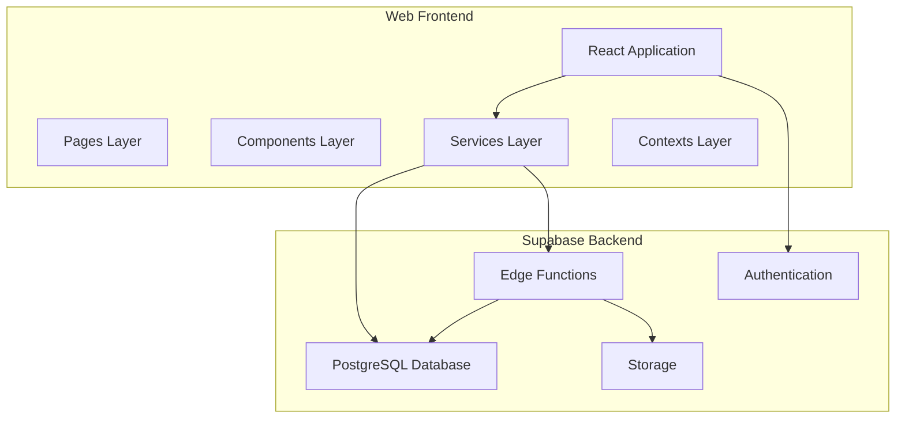
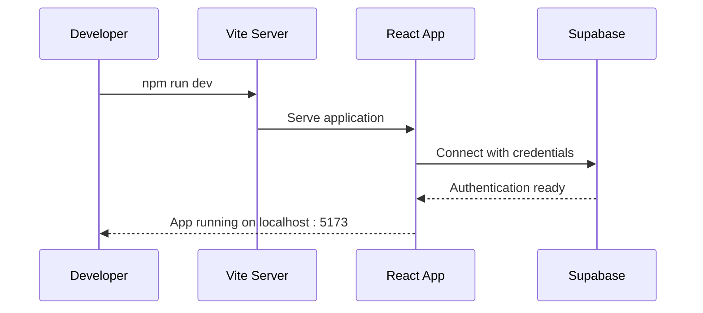

# Getting Started

<cite>
**Referenced Files in This Document**
- [package.json](file://web/package.json)
- [vite.config.js](file://web/vite.config.js)
- [supabase.js](file://web/src/services/supabase.js)
- [AuthContext.jsx](file://web/src/contexts/AuthContext.jsx)
- [main.jsx](file://web/src/main.jsx)
- [App.jsx](file://web/src/App.jsx)
- [DashboardPage.jsx](file://web/src/pages/DashboardPage.jsx)
- [config.toml](file://supabase/config.toml)
- [001_initial_schema.sql](file://supabase/migrations/001_initial_schema.sql)
- [index.ts (upload-file)](file://supabase/functions/upload-file/index.ts)
- [index.ts (download-file)](file://supabase/functions/download-file/index.ts)
- [index.ts (generate-share-link)](file://supabase/functions/generate-share-link/index.ts)
- [index.ts (rename-file)](file://supabase/functions/rename-file/index.ts)
- [index.ts (delete-file)](file://supabase/functions/delete-file/index.ts)
- [index.ts (upload-version)](file://supabase/functions/upload-version/index.ts)
- [index.ts (validate-folder)](file://supabase/functions/validate-folder/index.ts)
</cite>

## Table of Contents
1. [Introduction](#introduction)
2. [Prerequisites](#prerequisites)
3. [Project Structure](#project-structure)
4. [Environment Setup](#environment-setup)
5. [Supabase Project Initialization](#supabase-project-initialization)
6. [Database Configuration](#database-configuration)
7. [Environment Variables](#environment-variables)
8. [Installation](#installation)
9. [First Run and Basic Verification](#first-run-and-basic-verification)
10. [Development Workflow](#development-workflow)
11. [Production Deployment](#production-deployment)
12. [Troubleshooting](#troubleshooting)
13. [Conclusion](#conclusion)

## Introduction
Neo Files Transfer is a modern file sharing application built with React and Supabase. It provides secure file storage, versioning, and sharing capabilities with integrated authentication and administrative controls. The application consists of a React frontend served via Vite and a Supabase backend with PostgreSQL database and Edge Functions.

## Prerequisites
Before installing Neo Files Transfer, ensure you have the following knowledge and tools:

### React Knowledge Requirements
- Understanding of React fundamentals (components, hooks, context)
- Familiarity with React Router for navigation
- Knowledge of state management patterns
- Understanding of component lifecycle and effects

### Node.js and Package Management
- Node.js LTS version installed
- npm or yarn package manager
- Basic understanding of package.json and scripts
- Vite build tool familiarity

### Supabase Knowledge Requirements
- Understanding of Supabase authentication system
- Knowledge of Supabase SQL and database concepts
- Familiarity with Edge Functions (Deno runtime)
- Understanding of Row Level Security (RLS)
- Knowledge of Supabase Storage and database schemas

## Project Structure
The project follows a clear separation of concerns with distinct frontend and backend components:



**Diagram sources**
- [main.jsx:1-41](file://web/src/main.jsx#L1-L41)
- [supabase.js:1-7](file://web/src/services/supabase.js#L1-L7)

**Section sources**
- [main.jsx:1-41](file://web/src/main.jsx#L1-L41)
- [App.jsx:1-92](file://web/src/App.jsx#L1-L92)

## Environment Setup
Configure your development environment with the required tools:

### Required Tools
1. **Node.js**: Install LTS version from nodejs.org
2. **Git**: For version control and project cloning
3. **Supabase CLI**: Install via `npm install -g supabase`
4. **Text Editor**: VS Code recommended with React and Tailwind extensions

### Verify Installation
```bash
node --version
npm --version
supabase --version
```

## Supabase Project Initialization
Create and configure your Supabase project:

### Step 1: Create Supabase Project
1. Visit [app.supabase.com](https://app.supabase.com)
2. Sign up or log in to your account
3. Click "New Project"
4. Fill in project details:
   - Project Name: Choose a memorable name
   - Primary Region: Select closest region
   - Database Password: Generate strong password
5. Wait for deployment completion (takes 2-3 minutes)

### Step 2: Configure Authentication
1. Go to Authentication → Settings
2. Enable Email/Password and Google OAuth providers
3. Configure OAuth redirect URLs:
   - Development: `http://localhost:5173/auth/callback`
   - Production: Your domain `/auth/callback`
4. Set up Google OAuth credentials if needed

### Step 3: Initialize Database
1. Navigate to SQL Editor in Supabase Dashboard
2. Run the initial migration script to create all tables and policies
3. Verify tables are created successfully

**Section sources**
- [001_initial_schema.sql:1-289](file://supabase/migrations/001_initial_schema.sql#L1-L289)

## Database Configuration
The application requires a comprehensive database schema with Row Level Security:

### Database Schema Overview
The migration script creates 9 interconnected tables:
- Pending registrations for user approval
- Approved users with admin hierarchy
- Admin management system
- User profiles with Google Drive integration
- Shared files with version control
- File version history
- Activity logging
- System settings management

### Row Level Security Policies
Each table implements granular access controls:
- User-specific data isolation
- Admin-only privileged operations
- Public read access for shared resources
- Automated audit trails

**Section sources**
- [001_initial_schema.sql:125-267](file://supabase/migrations/001_initial_schema.sql#L125-L267)

## Environment Variables
Configure environment variables for both development and production:

### Frontend Environment Variables (.env)
Create a `.env` file in the web directory:

```env
VITE_SUPABASE_URL=your_supabase_project_url
VITE_SUPABASE_ANON_KEY=your_anon_key
```

### Supabase Function Environment Variables
Configure Edge Functions with required environment variables:

| Variable | Purpose | Example |
|----------|---------|---------|
| SUPABASE_URL | Supabase project URL | https://your-project.supabase.co |
| SUPABASE_ANON_KEY | Anonymous API key | your-anon-key |
| SUPABASE_SERVICE_ROLE_KEY | Service role key | your-service-role-key |
| GOOGLE_API_KEY | Google Drive API key | AIzaSy... |

### Supabase Function Configuration
Enable JWT verification for authentication-critical functions:

**Section sources**
- [supabase.js:1-7](file://web/src/services/supabase.js#L1-L7)
- [config.toml:1-21](file://supabase/config.toml#L1-L21)

## Installation
Follow these steps to install and set up the application:

### Step 1: Clone Repository
```bash
git clone <repository-url>
cd neo-files-transfer
```

### Step 2: Install Dependencies
```bash
# Navigate to web directory
cd web
npm install
```

### Step 3: Configure Supabase
1. Copy Supabase URL and keys from your project dashboard
2. Update `.env` file with your credentials
3. Verify connection works locally

### Step 4: Initialize Supabase CLI
```bash
supabase login
supabase link --project-ref your-project-ref
```

**Section sources**
- [package.json:1-29](file://web/package.json#L1-L29)

## First Run and Basic Verification
Complete the initial setup and verify everything works:

### Step 1: Start Development Server
```bash
# From web directory
npm run dev
```

### Step 2: Verify Authentication
1. Open browser to http://localhost:5173
2. Test Google OAuth login
3. Verify user session persistence

### Step 3: Test Database Connection
1. Check network tab for Supabase API calls
2. Verify authentication state in React DevTools
3. Confirm user profile loads correctly

### Step 4: Test File Operations
1. Navigate to dashboard
2. Attempt file upload simulation
3. Verify database records creation

**Section sources**
- [vite.config.js:1-11](file://web/vite.config.js#L1-L11)
- [AuthContext.jsx:12-38](file://web/src/contexts/AuthContext.jsx#L12-L38)

## Development Workflow
Understand the development process and common tasks:

### Local Development


**Diagram sources**
- [vite.config.js:6-9](file://web/vite.config.js#L6-L9)
- [main.jsx:19-40](file://web/src/main.jsx#L19-L40)

### Development Features
- Hot module replacement for instant feedback
- React Router for navigation testing
- Real-time authentication state updates
- Supabase client integration

**Section sources**
- [main.jsx:1-41](file://web/src/main.jsx#L1-L41)
- [App.jsx:54-91](file://web/src/App.jsx#L54-L91)

## Production Deployment
Deploy the application for production use:

### Build Process
```bash
# From web directory
npm run build
```

### Static Site Hosting
Recommended hosting platforms:
- Netlify (with Supabase integration)
- Vercel (with environment variables)
- GitHub Pages (for static builds)

### Production Environment Variables
Set these in your hosting platform:
- VITE_SUPABASE_URL → Production Supabase URL
- VITE_SUPABASE_ANON_KEY → Production anonymous key

### Supabase Production Setup
1. Create production database backup
2. Configure production authentication domains
3. Set up proper CORS settings
4. Monitor database performance

**Section sources**
- [package.json:6-10](file://web/package.json#L6-L10)

## Troubleshooting
Common issues and their solutions:

### Authentication Issues
**Problem**: Login redirects to callback page
**Solution**: 
1. Verify redirect URI matches configured OAuth settings
2. Check browser console for authentication errors
3. Ensure cookies are enabled for cross-domain requests

**Problem**: Session not persisting
**Solution**:
1. Check browser privacy settings
2. Verify SameSite cookie configuration
3. Ensure HTTPS in production environments

### Database Connection Problems
**Problem**: Cannot connect to Supabase
**Solution**:
1. Verify environment variables are loaded correctly
2. Check network connectivity to Supabase
3. Review Supabase status dashboard

**Problem**: RLS policies blocking access
**Solution**:
1. Verify user has proper roles in database
2. Check Row Level Security policy configurations
3. Test queries directly in SQL Editor

### File Upload Issues
**Problem**: Uploads failing silently
**Solution**:
1. Check Supabase Storage bucket permissions
2. Verify Google Drive API integration
3. Review Edge Function logs in Supabase dashboard

### Development Server Issues
**Problem**: Port conflicts or hot reload not working
**Solution**:
1. Change port in vite.config.js if 5173 is busy
2. Clear npm cache and reinstall dependencies
3. Check firewall settings for localhost connections

**Section sources**
- [AuthContext.jsx:66-82](file://web/src/contexts/AuthContext.jsx#L66-L82)
- [supabase.js:3-6](file://web/src/services/supabase.js#L3-L6)

## Conclusion
Neo Files Transfer provides a robust foundation for building secure file sharing applications. By following this guide, you've learned to set up the development environment, configure Supabase, understand the application architecture, and troubleshoot common issues. The combination of React for the frontend and Supabase for the backend creates a scalable solution with built-in authentication, database management, and real-time capabilities.

Key takeaways:
- React + Supabase creates a powerful full-stack combination
- Row Level Security ensures data isolation and security
- Edge Functions handle serverless logic efficiently
- Comprehensive authentication system supports multiple providers
- Modular architecture enables easy customization and scaling

For further customization, explore the component structure, extend the database schema, and integrate additional third-party services as needed.