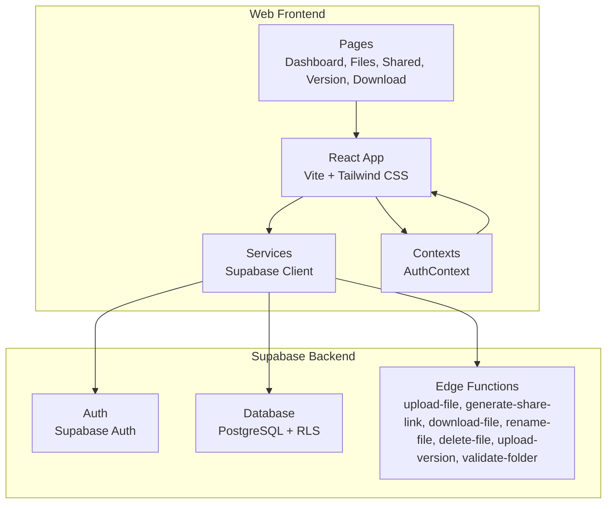
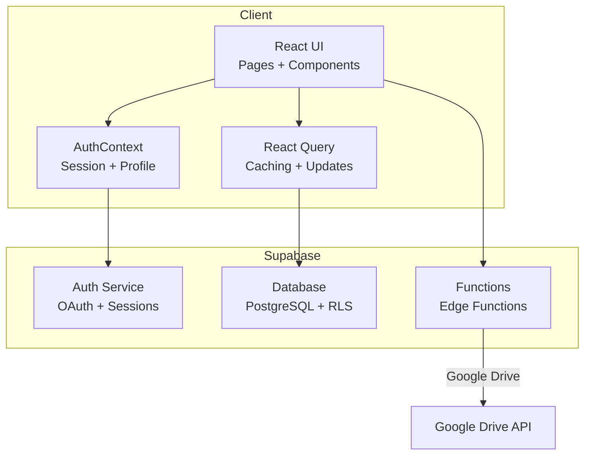
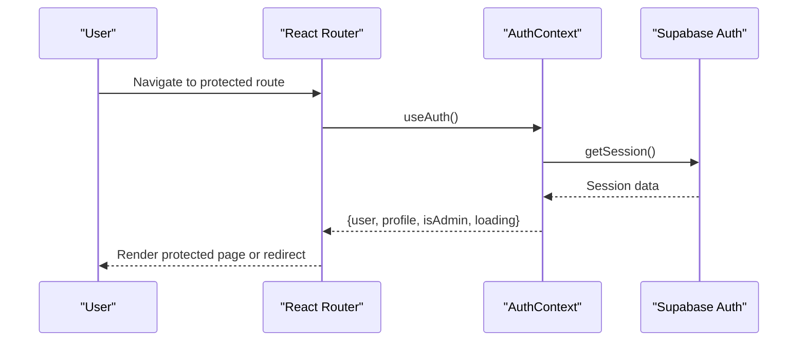
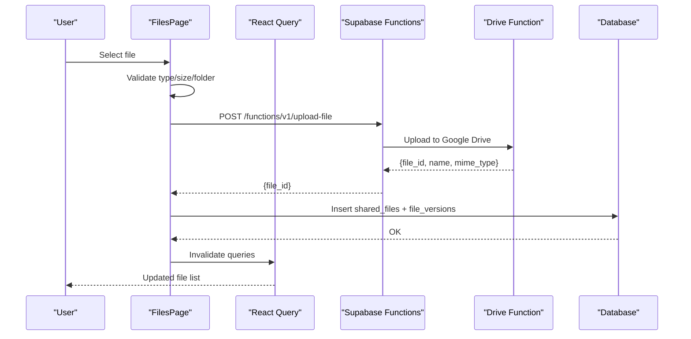
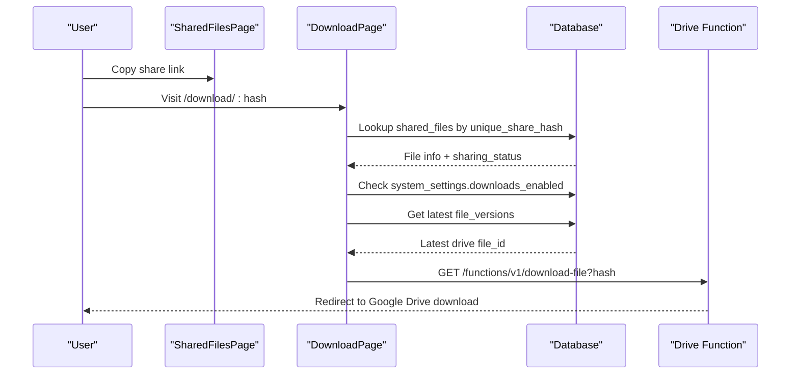
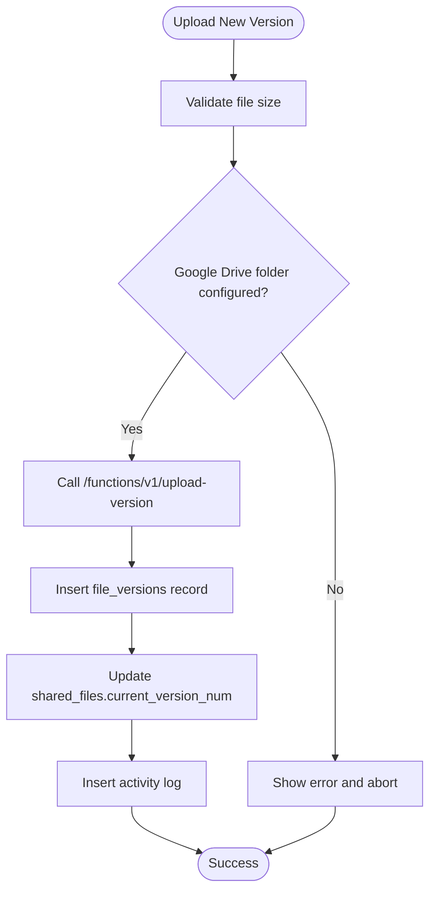
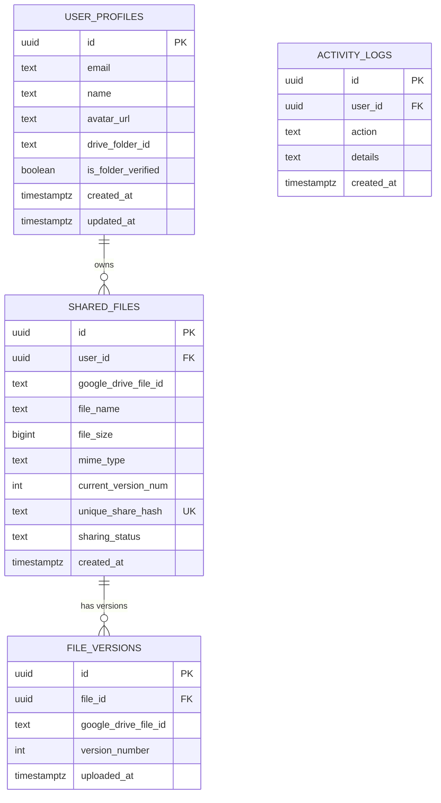
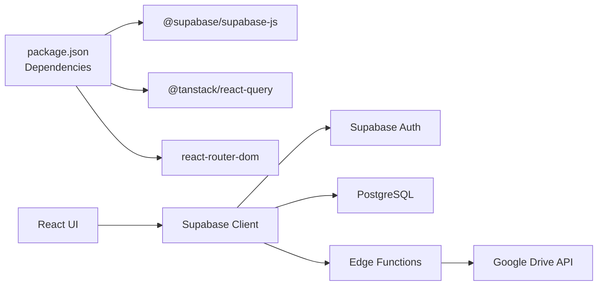

# Project Overview

<cite>
**Referenced Files in This Document**
- [package.json](file://web/package.json)
- [supabase.js](file://web/src/services/supabase.js)
- [main.jsx](file://web/src/main.jsx)
- [App.jsx](file://web/src/App.jsx)
- [AuthContext.jsx](file://web/src/contexts/AuthContext.jsx)
- [DashboardLayout.jsx](file://web/src/layouts/DashboardLayout.jsx)
- [DashboardPage.jsx](file://web/src/pages/DashboardPage.jsx)
- [FilesPage.jsx](file://web/src/pages/FilesPage.jsx)
- [SharedFilesPage.jsx](file://web/src/pages/SharedFilesPage.jsx)
- [VersionPage.jsx](file://web/src/pages/VersionPage.jsx)
- [DownloadPage.jsx](file://web/src/pages/DownloadPage.jsx)
- [LandingPage.jsx](file://web/src/pages/LandingPage.jsx)
- [helpers.js](file://web/src/utils/helpers.js)
- [config.toml](file://supabase/config.toml)
- [001_initial_schema.sql](file://supabase/migrations/001_initial_schema.sql)
- [upload-file/index.ts](file://supabase/functions/upload-file/index.ts)
- [generate-share-link/index.ts](file://supabase/functions/generate-share-link/index.ts)
</cite>

## Table of Contents
1. [Introduction](#introduction)
2. [Project Structure](#project-structure)
3. [Core Components](#core-components)
4. [Architecture Overview](#architecture-overview)
5. [Detailed Component Analysis](#detailed-component-analysis)
6. [Dependency Analysis](#dependency-analysis)
7. [Performance Considerations](#performance-considerations)
8. [Troubleshooting Guide](#troubleshooting-guide)
9. [Conclusion](#conclusion)

## Introduction
Neo Files Transfer is a cloud file management and sharing platform designed to simplify secure file storage, version control, and sharing. It integrates seamlessly with Google Drive to provide enterprise-grade security and reliability while offering a modern, user-friendly interface built with React. The platform supports:
- Secure file uploads and storage via Google Drive
- Version control with immutable file history
- Custom share links with granular access controls
- Admin-managed user approvals and system settings
- Real-time activity logging and audit trails

Target audience includes professionals, teams, and administrators who need a centralized, secure solution for managing and distributing files with fine-grained control over access and updates.

Core value propositions:
- Security-first design with hidden Google Drive URLs and access control
- Transparent versioning so users always receive the latest file
- Clean, branded share links that toggle between public and private access
- Admin oversight for approvals and operational controls

## Project Structure
The project follows a clear separation of concerns:
- Frontend: React application with Vite bundler, Tailwind CSS for styling, and React Router for navigation
- Backend: Supabase for authentication, database, and serverless functions (Edge Functions)
- Database: PostgreSQL schema with row-level security policies and normalized tables

**Diagram sources**
- [main.jsx:19-40](file://web/src/main.jsx#L19-L40)
- [supabase.js:1-7](file://web/src/services/supabase.js#L1-L7)
- [App.jsx:54-91](file://web/src/App.jsx#L54-L91)
- [config.toml:1-21](file://supabase/config.toml#L1-L21)

**Section sources**
- [package.json:1-29](file://web/package.json#L1-L29)
- [main.jsx:19-40](file://web/src/main.jsx#L19-L40)
- [supabase.js:1-7](file://web/src/services/supabase.js#L1-L7)
- [App.jsx:54-91](file://web/src/App.jsx#L54-L91)

## Core Components
- Authentication and routing: Protected routes, admin routes, and OAuth with Google
- File management: Upload, rename, delete, search, sort, and pagination
- Sharing: Generate share links, toggle public/private access, copy share URLs
- Version control: Upload new versions, track revision history, maintain current version
- Download pipeline: Resolve share hash, enforce access controls, proxy downloads
- Admin features: Approve users, manage system settings, monitor activity

Key technologies:
- React 19 with React Router 7 for UI and navigation
- Supabase JS SDK for client-server communication
- @tanstack/react-query for caching and optimistic updates
- Edge Functions for serverless file operations
- PostgreSQL with Row Level Security (RLS) for data governance

**Section sources**
- [AuthContext.jsx:6-103](file://web/src/contexts/AuthContext.jsx#L6-L103)
- [FilesPage.jsx:34-536](file://web/src/pages/FilesPage.jsx#L34-L536)
- [SharedFilesPage.jsx:8-127](file://web/src/pages/SharedFilesPage.jsx#L8-L127)
- [VersionPage.jsx:9-225](file://web/src/pages/VersionPage.jsx#L9-L225)
- [DownloadPage.jsx:6-158](file://web/src/pages/DownloadPage.jsx#L6-L158)
- [config.toml:1-21](file://supabase/config.toml#L1-L21)

## Architecture Overview
Neo Files Transfer uses a React frontend integrated with Supabase backend services. The frontend authenticates users, manages state, and orchestrates requests to Supabase. Supabase handles authentication, database operations, and serverless functions for file operations.

**Diagram sources**
- [main.jsx:19-40](file://web/src/main.jsx#L19-L40)
- [AuthContext.jsx:12-38](file://web/src/contexts/AuthContext.jsx#L12-L38)
- [supabase.js:1-7](file://web/src/services/supabase.js#L1-L7)
- [config.toml:1-21](file://supabase/config.toml#L1-L21)

## Detailed Component Analysis

### Authentication and Routing
The application enforces authentication and admin access through route guards and context providers. AuthContext initializes session monitoring, loads user profiles, and exposes sign-in/sign-out utilities. The router defines protected routes for authenticated users and admin-only routes.

**Diagram sources**
- [AuthContext.jsx:12-38](file://web/src/contexts/AuthContext.jsx#L12-L38)
- [App.jsx:28-41](file://web/src/App.jsx#L28-L41)

**Section sources**
- [AuthContext.jsx:6-103](file://web/src/contexts/AuthContext.jsx#L6-L103)
- [App.jsx:28-41](file://web/src/App.jsx#L28-L41)

### File Upload and Metadata Management
The upload flow validates file types and sizes, uploads to Google Drive via an Edge Function, stores metadata in the database, and records activity logs. The frontend triggers uploads and updates the UI optimistically.

**Diagram sources**
- [FilesPage.jsx:85-182](file://web/src/pages/FilesPage.jsx#L85-L182)
- [upload-file/index.ts:24-152](file://supabase/functions/upload-file/index.ts#L24-L152)
- [001_initial_schema.sql:55-83](file://supabase/migrations/001_initial_schema.sql#L55-L83)

**Section sources**
- [FilesPage.jsx:85-182](file://web/src/pages/FilesPage.jsx#L85-L182)
- [upload-file/index.ts:24-152](file://supabase/functions/upload-file/index.ts#L24-L152)
- [001_initial_schema.sql:55-83](file://supabase/migrations/001_initial_schema.sql#L55-L83)

### Sharing and Download Pipeline
Users can generate share links and toggle visibility. The download pipeline resolves the share hash, checks permissions and system settings, selects the latest version, and proxies the download through an Edge Function.

**Diagram sources**
- [SharedFilesPage.jsx:33-46](file://web/src/pages/SharedFilesPage.jsx#L33-L46)
- [DownloadPage.jsx:11-73](file://web/src/pages/DownloadPage.jsx#L11-L73)
- [generate-share-link/index.ts:9-55](file://supabase/functions/generate-share-link/index.ts#L9-L55)

**Section sources**
- [SharedFilesPage.jsx:8-127](file://web/src/pages/SharedFilesPage.jsx#L8-L127)
- [DownloadPage.jsx:6-158](file://web/src/pages/DownloadPage.jsx#L6-L158)
- [generate-share-link/index.ts:9-55](file://supabase/functions/generate-share-link/index.ts#L9-L55)

### Version Control
Versioning ensures immutability and traceability. Each upload creates a new version record and increments the current version number. Users can upload new versions while preserving the original share link.

**Diagram sources**
- [VersionPage.jsx:50-116](file://web/src/pages/VersionPage.jsx#L50-L116)
- [001_initial_schema.sql:73-83](file://supabase/migrations/001_initial_schema.sql#L73-L83)

**Section sources**
- [VersionPage.jsx:9-225](file://web/src/pages/VersionPage.jsx#L9-L225)
- [001_initial_schema.sql:73-83](file://supabase/migrations/001_initial_schema.sql#L73-L83)

### Database Schema and Policies
The schema defines core entities and enforces access control via Row Level Security (RLS). Policies ensure users can only access their own data, while public reads are allowed for downloads by share hash.

**Diagram sources**
- [001_initial_schema.sql:42-51](file://supabase/migrations/001_initial_schema.sql#L42-L51)
- [001_initial_schema.sql:55-67](file://supabase/migrations/001_initial_schema.sql#L55-L67)
- [001_initial_schema.sql:73-83](file://supabase/migrations/001_initial_schema.sql#L73-L83)
- [001_initial_schema.sql:84-94](file://supabase/migrations/001_initial_schema.sql#L84-L94)

**Section sources**
- [001_initial_schema.sql:126-267](file://supabase/migrations/001_initial_schema.sql#L126-L267)

## Dependency Analysis
The frontend depends on Supabase for authentication, real-time subscriptions, and database access. Edge Functions encapsulate sensitive operations like Google Drive uploads and downloads, enforcing JWT verification and access controls.

**Diagram sources**
- [package.json:11-20](file://web/package.json#L11-L20)
- [supabase.js:1-7](file://web/src/services/supabase.js#L1-L7)
- [config.toml:1-21](file://supabase/config.toml#L1-L21)

**Section sources**
- [package.json:11-20](file://web/package.json#L11-L20)
- [supabase.js:1-7](file://web/src/services/supabase.js#L1-L7)
- [config.toml:1-21](file://supabase/config.toml#L1-L21)

## Performance Considerations
- Client-side caching: React Query caches queries with a 5-minute stale time and retries once to reduce network overhead.
- Optimistic updates: UI reflects immediate feedback during uploads and actions, with subsequent sync against the database.
- Efficient queries: Pagination and filtering minimize payload sizes; sorting is applied on the server side.
- Edge Functions: Offload heavy operations (uploads/downloads) to serverless functions, keeping the client responsive.

[No sources needed since this section provides general guidance]

## Troubleshooting Guide
Common issues and resolutions:
- Authentication failures: Verify OAuth callback URL and session persistence in Supabase Auth.
- Upload errors: Check allowed file types/extensions and size limits enforced by the frontend and Edge Function.
- Download blocked: Confirm the share link is public and system settings allow downloads.
- Version upload problems: Ensure the Google Drive folder is configured and the user has permission to write to the folder.
- Database access denied: Confirm RLS policies are satisfied and the user owns the resource.

**Section sources**
- [FilesPage.jsx:89-104](file://web/src/pages/FilesPage.jsx#L89-L104)
- [VersionPage.jsx:54-62](file://web/src/pages/VersionPage.jsx#L54-L62)
- [DownloadPage.jsx:28-44](file://web/src/pages/DownloadPage.jsx#L28-L44)
- [001_initial_schema.sql:129-138](file://supabase/migrations/001_initial_schema.sql#L129-L138)

## Conclusion
Neo Files Transfer delivers a secure, scalable, and user-centric file management solution. Its architecture leverages Supabase for authentication, data, and serverless functions, while the React frontend provides a responsive and accessible interface. The platform’s emphasis on security, version control, and sharing makes it suitable for individuals and teams seeking reliable cloud file operations.

[No sources needed since this section summarizes without analyzing specific files]