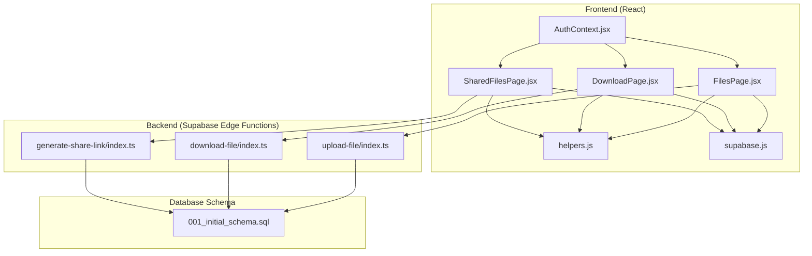
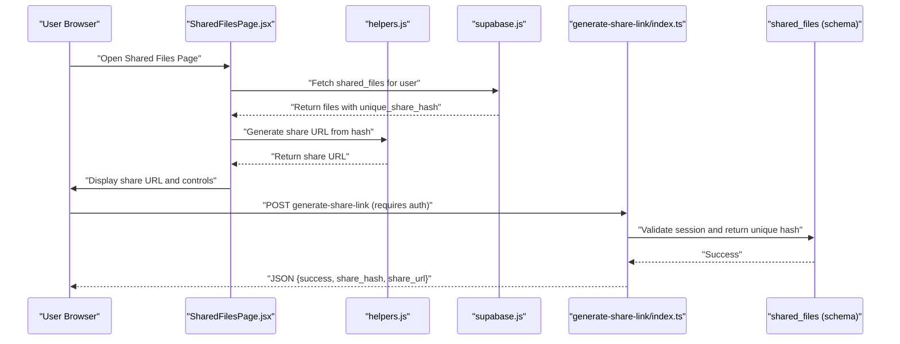
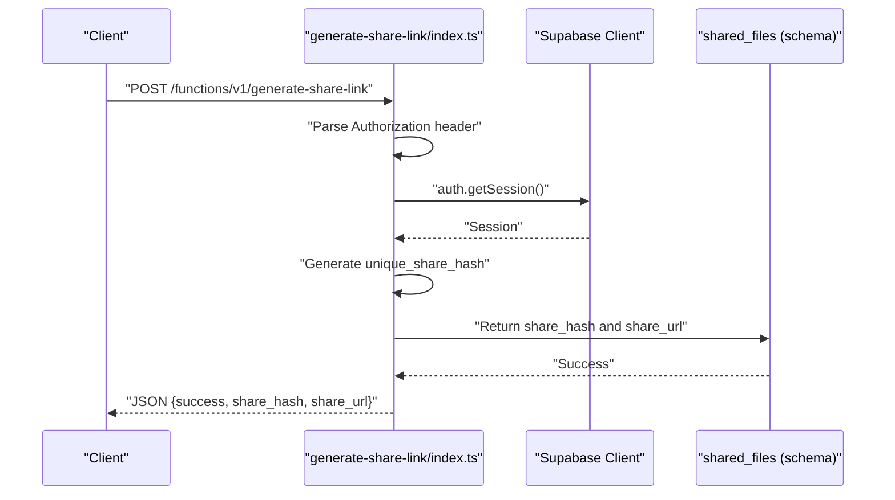
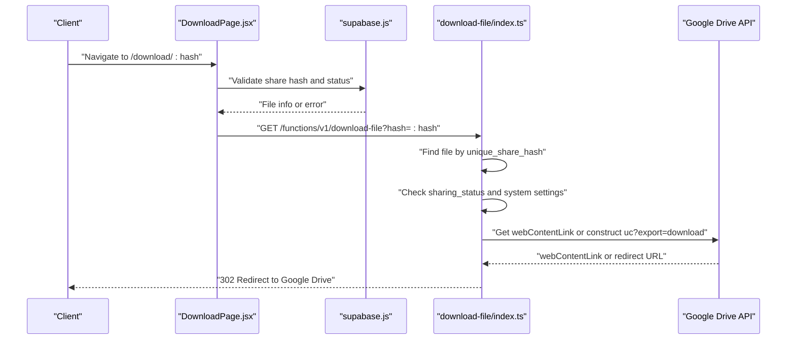
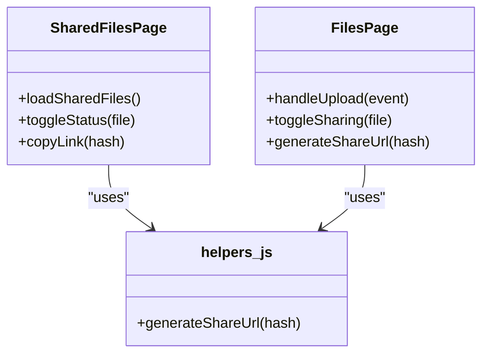
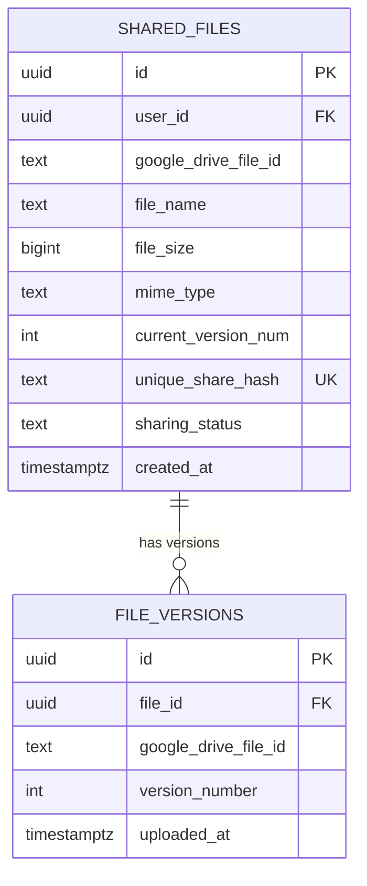
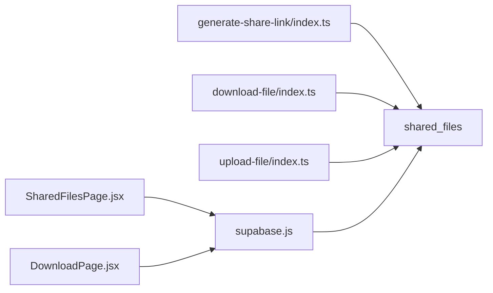

# Sharing System

<cite>
**Referenced Files in This Document**
- [generate-share-link/index.ts](file://supabase/functions/generate-share-link/index.ts)
- [download-file/index.ts](file://supabase/functions/download-file/index.ts)
- [SharedFilesPage.jsx](file://web/src/pages/SharedFilesPage.jsx)
- [DownloadPage.jsx](file://web/src/pages/DownloadPage.jsx)
- [helpers.js](file://web/src/utils/helpers.js)
- [FilesPage.jsx](file://web/src/pages/FilesPage.jsx)
- [001_initial_schema.sql](file://supabase/migrations/001_initial_schema.sql)
- [AuthContext.jsx](file://web/src/contexts/AuthContext.jsx)
- [supabase.js](file://web/src/services/supabase.js)
- [upload-file/index.ts](file://supabase/functions/upload-file/index.ts)
</cite>

## Table of Contents
1. [Introduction](#introduction)
2. [Project Structure](#project-structure)
3. [Core Components](#core-components)
4. [Architecture Overview](#architecture-overview)
5. [Detailed Component Analysis](#detailed-component-analysis)
6. [Dependency Analysis](#dependency-analysis)
7. [Performance Considerations](#performance-considerations)
8. [Security Considerations](#security-considerations)
9. [Abuse Prevention and Monitoring](#abuse-prevention-and-monitoring)
10. [Troubleshooting Guide](#troubleshooting-guide)
11. [Conclusion](#conclusion)

## Introduction
This document provides comprehensive technical documentation for the file sharing system implementation. It explains share link generation, public access control, permission management, security considerations, hash-based URL generation, access logging, and frontend components for managing shared files. It also covers abuse prevention measures, link expiration policies, and monitoring approaches for shared content.

## Project Structure
The sharing system spans both the frontend React application and backend Supabase Edge Functions. The frontend manages user interactions, displays shared files, and handles download initiation. The backend Edge Functions handle secure share link generation and controlled file downloads.

**Diagram sources**
- [SharedFilesPage.jsx:1-127](file://web/src/pages/SharedFilesPage.jsx#L1-L127)
- [DownloadPage.jsx:1-158](file://web/src/pages/DownloadPage.jsx#L1-L158)
- [helpers.js:31-34](file://web/src/utils/helpers.js#L31-L34)
- [AuthContext.jsx:1-112](file://web/src/contexts/AuthContext.jsx#L1-L112)
- [supabase.js:1-7](file://web/src/services/supabase.js#L1-L7)
- [FilesPage.jsx:1-536](file://web/src/pages/FilesPage.jsx#L1-L536)
- [generate-share-link/index.ts:1-55](file://supabase/functions/generate-share-link/index.ts#L1-L55)
- [download-file/index.ts:1-131](file://supabase/functions/download-file/index.ts#L1-L131)
- [upload-file/index.ts:1-152](file://supabase/functions/upload-file/index.ts#L1-L152)
- [001_initial_schema.sql:55-71](file://supabase/migrations/001_initial_schema.sql#L55-L71)

**Section sources**
- [SharedFilesPage.jsx:1-127](file://web/src/pages/SharedFilesPage.jsx#L1-L127)
- [DownloadPage.jsx:1-158](file://web/src/pages/DownloadPage.jsx#L1-L158)
- [helpers.js:31-34](file://web/src/utils/helpers.js#L31-L34)
- [AuthContext.jsx:1-112](file://web/src/contexts/AuthContext.jsx#L1-L112)
- [supabase.js:1-7](file://web/src/services/supabase.js#L1-L7)
- [FilesPage.jsx:1-536](file://web/src/pages/FilesPage.jsx#L1-L536)
- [generate-share-link/index.ts:1-55](file://supabase/functions/generate-share-link/index.ts#L1-L55)
- [download-file/index.ts:1-131](file://supabase/functions/download-file/index.ts#L1-L131)
- [upload-file/index.ts:1-152](file://supabase/functions/upload-file/index.ts#L1-L152)
- [001_initial_schema.sql:55-71](file://supabase/migrations/001_initial_schema.sql#L55-L71)

## Core Components
- Share Link Generation: Creates a unique hash and returns a shareable URL.
- Download Resolution: Validates share hash, checks permissions, and redirects to Google Drive.
- Frontend Management: Lists shared files, toggles sharing status, copies share URLs.
- Database Schema: Defines shared_files table with unique share hash and sharing status.
- Authentication: Ensures user sessions for protected operations.

**Section sources**
- [generate-share-link/index.ts:31-39](file://supabase/functions/generate-share-link/index.ts#L31-L39)
- [download-file/index.ts:15-84](file://supabase/functions/download-file/index.ts#L15-L84)
- [SharedFilesPage.jsx:33-46](file://web/src/pages/SharedFilesPage.jsx#L33-L46)
- [001_initial_schema.sql:55-67](file://supabase/migrations/001_initial_schema.sql#L55-L67)
- [AuthContext.jsx:12-38](file://web/src/contexts/AuthContext.jsx#L12-L38)

## Architecture Overview
The sharing system follows a client-server architecture with Edge Functions acting as intermediaries between the frontend and external services (Google Drive). The frontend authenticates users, manages shared file states, and initiates downloads. Edge Functions enforce authentication, validate permissions, and redirect to Google Drive for actual file delivery.

**Diagram sources**
- [SharedFilesPage.jsx:17-31](file://web/src/pages/SharedFilesPage.jsx#L17-L31)
- [helpers.js:31-34](file://web/src/utils/helpers.js#L31-L34)
- [supabase.js:1-7](file://web/src/services/supabase.js#L1-L7)
- [generate-share-link/index.ts:9-44](file://supabase/functions/generate-share-link/index.ts#L9-L44)
- [001_initial_schema.sql:55-67](file://supabase/migrations/001_initial_schema.sql#L55-L67)

## Detailed Component Analysis

### Share Link Generation Workflow
The share link generation process creates a unique hash and constructs a shareable URL. It validates authentication and returns structured JSON containing the share hash and URL.

**Diagram sources**
- [generate-share-link/index.ts:9-44](file://supabase/functions/generate-share-link/index.ts#L9-L44)
- [001_initial_schema.sql:63-67](file://supabase/migrations/001_initial_schema.sql#L63-L67)

**Section sources**
- [generate-share-link/index.ts:14-44](file://supabase/functions/generate-share-link/index.ts#L14-L44)

### Download Validation and Redirection
The download endpoint validates the share hash, checks sharing status, verifies system settings, resolves the latest file version, and redirects to Google Drive for download.

**Diagram sources**
- [DownloadPage.jsx:11-73](file://web/src/pages/DownloadPage.jsx#L11-L73)
- [download-file/index.ts:9-118](file://supabase/functions/download-file/index.ts#L9-L118)
- [001_initial_schema.sql:55-67](file://supabase/migrations/001_initial_schema.sql#L55-L67)

**Section sources**
- [DownloadPage.jsx:11-73](file://web/src/pages/DownloadPage.jsx#L11-L73)
- [download-file/index.ts:14-118](file://supabase/functions/download-file/index.ts#L14-L118)

### Frontend Components for Managing Shared Files
The frontend provides two key pages for managing shared files:
- SharedFilesPage: Lists user's shared files, toggles sharing status, and copies share URLs.
- FilesPage: Manages file lifecycle, generates unique share hashes during upload, and updates sharing status.

**Diagram sources**
- [SharedFilesPage.jsx:17-51](file://web/src/pages/SharedFilesPage.jsx#L17-L51)
- [FilesPage.jsx:85-182](file://web/src/pages/FilesPage.jsx#L85-L182)
- [helpers.js:31-34](file://web/src/utils/helpers.js#L31-L34)

**Section sources**
- [SharedFilesPage.jsx:17-51](file://web/src/pages/SharedFilesPage.jsx#L17-L51)
- [FilesPage.jsx:85-182](file://web/src/pages/FilesPage.jsx#L85-L182)
- [helpers.js:31-34](file://web/src/utils/helpers.js#L31-L34)

### Database Schema for Shared Files
The database schema defines the shared_files table with a unique share hash and sharing status, along with indexes for efficient lookups.

**Diagram sources**
- [001_initial_schema.sql:55-82](file://supabase/migrations/001_initial_schema.sql#L55-L82)

**Section sources**
- [001_initial_schema.sql:55-82](file://supabase/migrations/001_initial_schema.sql#L55-L82)

## Dependency Analysis
The sharing system exhibits clear separation of concerns:
- Frontend depends on Supabase client for database operations and authentication.
- Edge Functions depend on Supabase client for database access and Google Drive API for file delivery.
- Database schema defines foreign keys and indexes to support efficient queries.

**Diagram sources**
- [SharedFilesPage.jsx:1-127](file://web/src/pages/SharedFilesPage.jsx#L1-L127)
- [DownloadPage.jsx:1-158](file://web/src/pages/DownloadPage.jsx#L1-L158)
- [generate-share-link/index.ts:1-55](file://supabase/functions/generate-share-link/index.ts#L1-L55)
- [download-file/index.ts:1-131](file://supabase/functions/download-file/index.ts#L1-L131)
- [upload-file/index.ts:1-152](file://supabase/functions/upload-file/index.ts#L1-L152)
- [supabase.js:1-7](file://web/src/services/supabase.js#L1-L7)
- [001_initial_schema.sql:55-67](file://supabase/migrations/001_initial_schema.sql#L55-L67)

**Section sources**
- [SharedFilesPage.jsx:1-127](file://web/src/pages/SharedFilesPage.jsx#L1-L127)
- [DownloadPage.jsx:1-158](file://web/src/pages/DownloadPage.jsx#L1-L158)
- [generate-share-link/index.ts:1-55](file://supabase/functions/generate-share-link/index.ts#L1-L55)
- [download-file/index.ts:1-131](file://supabase/functions/download-file/index.ts#L1-L131)
- [upload-file/index.ts:1-152](file://supabase/functions/upload-file/index.ts#L1-L152)
- [supabase.js:1-7](file://web/src/services/supabase.js#L1-L7)
- [001_initial_schema.sql:55-67](file://supabase/migrations/001_initial_schema.sql#L55-L67)

## Performance Considerations
- Hash Generation: Uses a cryptographically random identifier with substring truncation to a fixed length for compact URLs.
- Index Usage: Database indexes on unique_share_hash and user_id optimize lookup performance.
- CDN and Redirects: Redirects to Google Drive minimize server bandwidth usage.
- Caching: Consider caching frequently accessed share URLs at the CDN level for improved latency.

[No sources needed since this section provides general guidance]

## Security Considerations
- Authentication: All protected operations require a valid Authorization header and active session.
- Access Control: Sharing status field determines whether a file is publicly accessible.
- System Settings: Centralized control via system_settings table allows disabling downloads globally.
- CORS Headers: Standard CORS configuration enables cross-origin requests for frontend integration.
- Data Validation: Input validation prevents malformed requests and ensures safe database operations.

**Section sources**
- [generate-share-link/index.ts:14-29](file://supabase/functions/generate-share-link/index.ts#L14-L29)
- [download-file/index.ts:46-72](file://supabase/functions/download-file/index.ts#L46-L72)
- [001_initial_schema.sql:107-122](file://supabase/migrations/001_initial_schema.sql#L107-L122)

## Abuse Prevention and Monitoring
- System-wide Controls: The system_settings table includes a downloads_enabled flag to temporarily disable downloads.
- Sharing Status: Users can toggle sharing status between public and private to control access.
- Activity Logging: The activity_logs table captures user actions for auditability.
- Rate Limiting: Consider implementing rate limiting at the Edge Function level for share link generation and download attempts.
- Expiration Policies: Implement unique_share_hash rotation or TTL-based invalidation to prevent long-term abuse.
- Monitoring: Track download attempts and errors via logs and analytics to detect suspicious patterns.

**Section sources**
- [001_initial_schema.sql:84-94](file://supabase/migrations/001_initial_schema.sql#L84-L94)
- [001_initial_schema.sql:107-122](file://supabase/migrations/001_initial_schema.sql#L107-L122)
- [FilesPage.jsx:266-285](file://web/src/pages/FilesPage.jsx#L266-L285)

## Troubleshooting Guide
Common issues and resolutions:
- Authentication Failures: Ensure Authorization header is present and session is valid when calling share link generation.
- File Not Found: Verify unique_share_hash exists and belongs to the requesting user.
- Access Denied: Confirm sharing_status is not private for public access.
- Downloads Disabled: Check system_settings downloads_enabled flag.
- Google Drive Redirect Issues: Validate webContentLink availability and fallback to uc?export=download URL.

**Section sources**
- [generate-share-link/index.ts:14-29](file://supabase/functions/generate-share-link/index.ts#L14-L29)
- [download-file/index.ts:36-72](file://supabase/functions/download-file/index.ts#L36-L72)
- [DownloadPage.jsx:21-44](file://web/src/pages/DownloadPage.jsx#L21-L44)

## Conclusion
The sharing system provides a secure, scalable mechanism for generating and accessing shared files. It leverages Supabase Edge Functions for authentication enforcement and Google Drive for efficient file delivery. The frontend offers intuitive controls for managing share links, while the database schema and RLS policies ensure data integrity and access control. Additional measures such as rate limiting, expiration policies, and centralized monitoring can further enhance security and reliability.