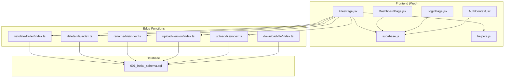
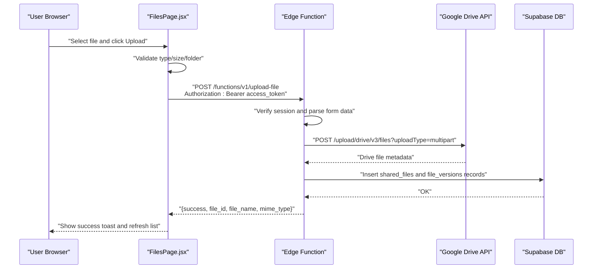
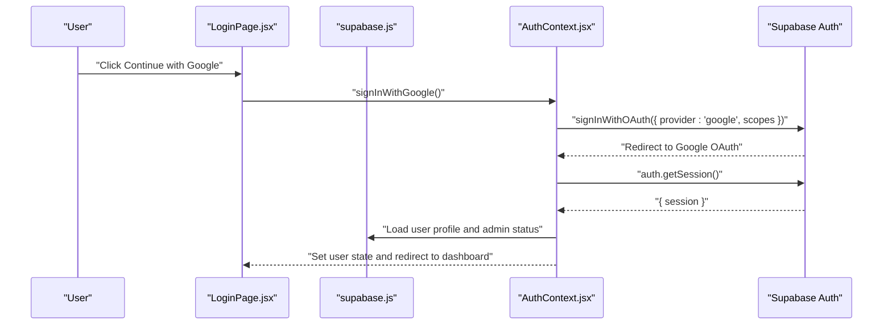
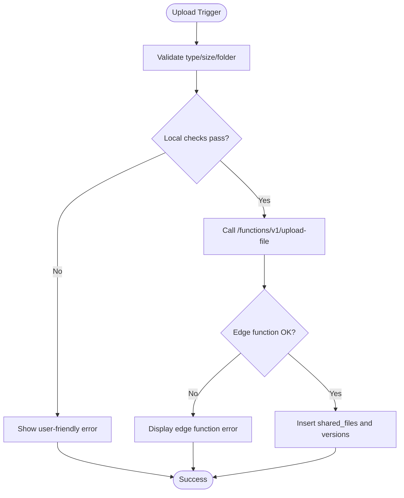
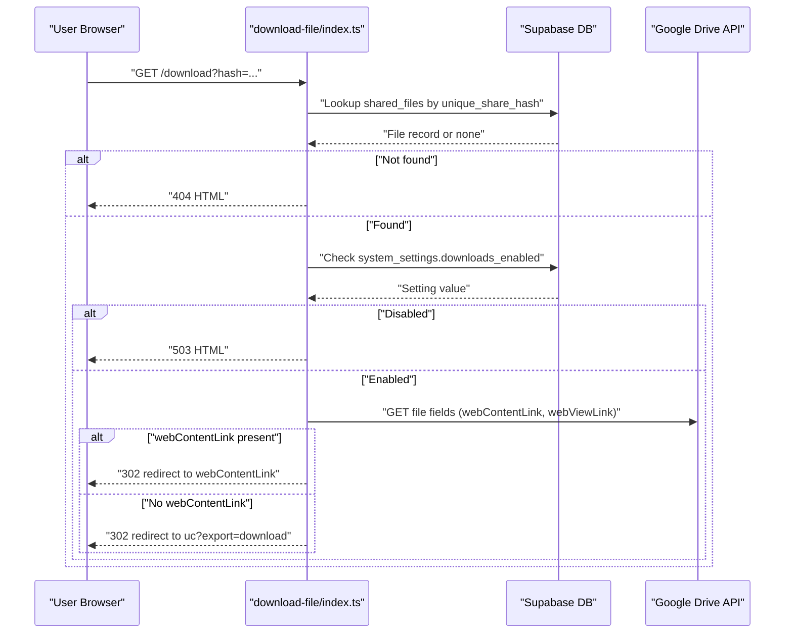
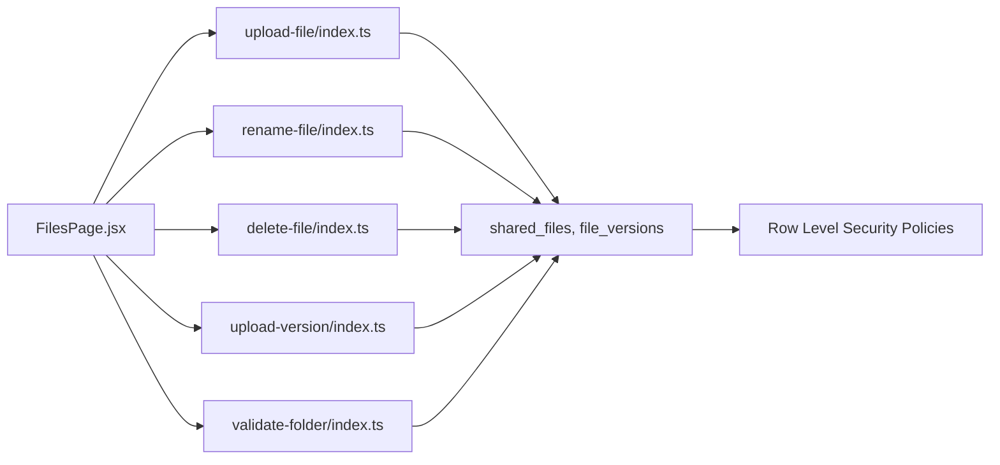

# Troubleshooting & FAQ

<cite>
**Referenced Files in This Document**
- [upload-file/index.ts](file://supabase/functions/upload-file/index.ts)
- [download-file/index.ts](file://supabase/functions/download-file/index.ts)
- [delete-file/index.ts](file://supabase/functions/delete-file/index.ts)
- [rename-file/index.ts](file://supabase/functions/rename-file/index.ts)
- [upload-version/index.ts](file://supabase/functions/upload-version/index.ts)
- [validate-folder/index.ts](file://supabase/functions/validate-folder/index.ts)
- [supabase.js](file://web/src/services/supabase.js)
- [AuthContext.jsx](file://web/src/contexts/AuthContext.jsx)
- [LoginPage.jsx](file://web/src/pages/LoginPage.jsx)
- [DashboardPage.jsx](file://web/src/pages/DashboardPage.jsx)
- [FilesPage.jsx](file://web/src/pages/FilesPage.jsx)
- [helpers.js](file://web/src/utils/helpers.js)
- [001_initial_schema.sql](file://supabase/migrations/001_initial_schema.sql)
</cite>

## Table of Contents
1. [Introduction](#introduction)
2. [Project Structure](#project-structure)
3. [Core Components](#core-components)
4. [Architecture Overview](#architecture-overview)
5. [Detailed Component Analysis](#detailed-component-analysis)
6. [Dependency Analysis](#dependency-analysis)
7. [Performance Considerations](#performance-considerations)
8. [Troubleshooting Guide](#troubleshooting-guide)
9. [FAQ](#faq)
10. [Conclusion](#conclusion)

## Introduction
This document provides a comprehensive troubleshooting guide and FAQ for Neo Files Transfer. It focuses on diagnosing and resolving common issues related to authentication, file uploads, downloads, and edge function failures. It also covers performance, browser compatibility, and mobile considerations, along with debugging techniques for frontend, backend, and database components. The goal is to enable quick self-service resolution of typical problems.

## Project Structure
Neo Files Transfer consists of:
- Frontend (React/Vite): Handles user authentication, file listing, uploads, and share link generation.
- Edge Functions (Supabase Edge Functions in Deno): Implement upload, download, rename, delete, version upload, and folder validation against Google Drive.
- Database (PostgreSQL via Supabase): Stores user profiles, shared files, file versions, activity logs, and system settings.

**Diagram sources**
- [AuthContext.jsx:1-112](file://web/src/contexts/AuthContext.jsx#L1-L112)
- [LoginPage.jsx:1-77](file://web/src/pages/LoginPage.jsx#L1-L77)
- [DashboardPage.jsx:1-177](file://web/src/pages/DashboardPage.jsx#L1-L177)
- [FilesPage.jsx:1-536](file://web/src/pages/FilesPage.jsx#L1-L536)
- [supabase.js:1-7](file://web/src/services/supabase.js#L1-L7)
- [helpers.js:1-52](file://web/src/utils/helpers.js#L1-L52)
- [upload-file/index.ts:1-152](file://supabase/functions/upload-file/index.ts#L1-L152)
- [upload-version/index.ts:1-130](file://supabase/functions/upload-version/index.ts#L1-L130)
- [download-file/index.ts:1-131](file://supabase/functions/download-file/index.ts#L1-L131)
- [rename-file/index.ts:1-74](file://supabase/functions/rename-file/index.ts#L1-L74)
- [delete-file/index.ts:1-72](file://supabase/functions/delete-file/index.ts#L1-L72)
- [validate-folder/index.ts:1-87](file://supabase/functions/validate-folder/index.ts#L1-L87)
- [001_initial_schema.sql:1-289](file://supabase/migrations/001_initial_schema.sql#L1-L289)

**Section sources**
- [AuthContext.jsx:1-112](file://web/src/contexts/AuthContext.jsx#L1-L112)
- [supabase.js:1-7](file://web/src/services/supabase.js#L1-L7)
- [001_initial_schema.sql:1-289](file://supabase/migrations/001_initial_schema.sql#L1-L289)

## Core Components
- Authentication and session management handled by Supabase Auth and exposed via React context.
- Frontend pages orchestrate uploads, downloads, and file actions by calling Supabase Edge Functions and interacting with Supabase tables.
- Edge Functions validate requests, enforce policies, and integrate with Google Drive APIs for file operations.

Key responsibilities:
- AuthContext: Initializes session, exposes sign-in/sign-out, and loads user profile/admin status.
- FilesPage: Validates file types/sizes, triggers uploads via edge functions, stores metadata, and manages lifecycle actions.
- Edge Functions: Enforce authorization, validate inputs, and call Google Drive APIs.

**Section sources**
- [AuthContext.jsx:1-112](file://web/src/contexts/AuthContext.jsx#L1-L112)
- [FilesPage.jsx:1-536](file://web/src/pages/FilesPage.jsx#L1-L536)
- [upload-file/index.ts:1-152](file://supabase/functions/upload-file/index.ts#L1-L152)
- [download-file/index.ts:1-131](file://supabase/functions/download-file/index.ts#L1-L131)
- [rename-file/index.ts:1-74](file://supabase/functions/rename-file/index.ts#L1-L74)
- [delete-file/index.ts:1-72](file://supabase/functions/delete-file/index.ts#L1-L72)
- [upload-version/index.ts:1-130](file://supabase/functions/upload-version/index.ts#L1-L130)
- [validate-folder/index.ts:1-87](file://supabase/functions/validate-folder/index.ts#L1-L87)

## Architecture Overview
The system integrates Supabase Auth and Edge Functions with Google Drive. The frontend authenticates users, validates local constraints, and invokes edge functions. Edge functions validate sessions, enforce policies, and call Google Drive APIs. Database tables store user profiles, shared files, versions, logs, and system settings.

**Diagram sources**
- [FilesPage.jsx:85-182](file://web/src/pages/FilesPage.jsx#L85-L182)
- [upload-file/index.ts:24-151](file://supabase/functions/upload-file/index.ts#L24-L151)
- [001_initial_schema.sql:55-91](file://supabase/migrations/001_initial_schema.sql#L55-L91)

**Section sources**
- [FilesPage.jsx:85-182](file://web/src/pages/FilesPage.jsx#L85-L182)
- [upload-file/index.ts:24-151](file://supabase/functions/upload-file/index.ts#L24-L151)
- [001_initial_schema.sql:55-91](file://supabase/migrations/001_initial_schema.sql#L55-L91)

## Detailed Component Analysis

### Authentication Flow and Diagnostics
Common issues:
- Missing or invalid Authorization header
- Session not present or expired
- Insufficient scopes granted during OAuth

Diagnostic steps:
- Verify that the frontend obtains a session and passes the Authorization header to edge functions.
- Confirm that the Supabase client is initialized with correct environment variables.
- Ensure the OAuth callback route exists and redirects properly.

**Diagram sources**
- [LoginPage.jsx:17-28](file://web/src/pages/LoginPage.jsx#L17-L28)
- [AuthContext.jsx:66-82](file://web/src/contexts/AuthContext.jsx#L66-L82)
- [supabase.js:1-7](file://web/src/services/supabase.js#L1-L7)

**Section sources**
- [LoginPage.jsx:17-28](file://web/src/pages/LoginPage.jsx#L17-L28)
- [AuthContext.jsx:66-82](file://web/src/contexts/AuthContext.jsx#L66-L82)
- [supabase.js:1-7](file://web/src/services/supabase.js#L1-L7)

### Upload Failure Diagnostics
Symptoms:
- Toast indicates “Upload failed” or “File size exceeds limit”
- Edge function returns 400 with error message

Root causes:
- Missing Authorization header
- No file or folder_id provided
- File type blocked or size exceeds 100 MB
- Google Drive API error response

Resolution steps:
- Confirm session exists and access token is attached to Authorization header.
- Ensure the selected file meets allowed types and size limits.
- Verify the user’s Google Drive folder is configured and validated.
- Check edge function logs for detailed error messages.

**Diagram sources**
- [FilesPage.jsx:85-182](file://web/src/pages/FilesPage.jsx#L85-L182)
- [upload-file/index.ts:29-68](file://supabase/functions/upload-file/index.ts#L29-L68)
- [001_initial_schema.sql:55-91](file://supabase/migrations/001_initial_schema.sql#L55-L91)

**Section sources**
- [FilesPage.jsx:85-182](file://web/src/pages/FilesPage.jsx#L85-L182)
- [upload-file/index.ts:29-68](file://supabase/functions/upload-file/index.ts#L29-L68)

### Download Error Diagnostics
Symptoms:
- 404 “File Not Found”
- 403 “Access Denied”
- 503 “Downloads are disabled”
- Redirect loop or blank page

Root causes:
- Invalid or missing share hash
- Private file with no access
- System setting disables downloads
- Google Drive file not accessible

Resolution steps:
- Verify the share URL contains a valid hash and matches the database record.
- Confirm the file’s sharing status is not private.
- Check system setting for downloads_enabled.
- Ensure the Google Drive file has a webContentLink or fallback download URL works.

**Diagram sources**
- [download-file/index.ts:9-129](file://supabase/functions/download-file/index.ts#L9-L129)
- [001_initial_schema.sql:107-122](file://supabase/migrations/001_initial_schema.sql#L107-L122)

**Section sources**
- [download-file/index.ts:9-129](file://supabase/functions/download-file/index.ts#L9-L129)
- [001_initial_schema.sql:107-122](file://supabase/migrations/001_initial_schema.sql#L107-L122)

### Rename/Delete/Version Upload Failures
Symptoms:
- “Failed to rename file” or “Failed to delete file”
- Edge function returns 400 with error message

Root causes:
- Missing Authorization header
- Not authenticated
- Google Drive API returns error (e.g., permission denied, not found)

Resolution steps:
- Ensure session is active and Authorization header is included.
- Confirm the file belongs to the authenticated user.
- Review edge function logs for detailed error messages.

**Section sources**
- [rename-file/index.ts:14-72](file://supabase/functions/rename-file/index.ts#L14-L72)
- [delete-file/index.ts:14-70](file://supabase/functions/delete-file/index.ts#L14-L70)
- [upload-version/index.ts:16-128](file://supabase/functions/upload-version/index.ts#L16-L128)

### Folder Validation Issues
Symptoms:
- “Folder not found or not accessible”
- “The provided ID is not a Google Drive folder”

Resolution steps:
- Validate the folder ID using the validate-folder endpoint.
- Ensure the folder exists and the authenticated user has access.
- Confirm the folder MIME type is a Google Drive folder.

**Section sources**
- [validate-folder/index.ts:14-85](file://supabase/functions/validate-folder/index.ts#L14-L85)

## Dependency Analysis
- Frontend depends on Supabase client initialization and AuthContext for session state.
- Edge functions depend on Supabase Auth session verification and Google Drive access tokens.
- Database tables define row-level security and relationships among shared files, versions, and logs.

**Diagram sources**
- [FilesPage.jsx:1-536](file://web/src/pages/FilesPage.jsx#L1-L536)
- [upload-file/index.ts:1-152](file://supabase/functions/upload-file/index.ts#L1-L152)
- [rename-file/index.ts:1-74](file://supabase/functions/rename-file/index.ts#L1-L74)
- [delete-file/index.ts:1-72](file://supabase/functions/delete-file/index.ts#L1-L72)
- [upload-version/index.ts:1-130](file://supabase/functions/upload-version/index.ts#L1-L130)
- [validate-folder/index.ts:1-87](file://supabase/functions/validate-folder/index.ts#L1-L87)
- [001_initial_schema.sql:126-267](file://supabase/migrations/001_initial_schema.sql#L126-L267)

**Section sources**
- [FilesPage.jsx:1-536](file://web/src/pages/FilesPage.jsx#L1-L536)
- [001_initial_schema.sql:126-267](file://supabase/migrations/001_initial_schema.sql#L126-L267)

## Performance Considerations
- Large file uploads: The 100 MB limit reduces memory pressure and network overhead. Consider chunked uploads for larger files if requirements change.
- Edge function cold starts: Frequent small uploads can trigger cold starts; batching uploads may help.
- Frontend rendering: Sorting and filtering on large lists can be optimized by server-side queries or pagination.
- Network reliability: Implement retry logic for transient Google Drive API errors.
- CORS and headers: Ensure proper caching headers and minimal latency for static assets.

## Troubleshooting Guide

### Authentication Problems
Symptoms:
- Login button does nothing or shows generic error
- After login, still redirected to login page

Checklist:
- Confirm environment variables for Supabase URL and Anon Key are set in the frontend build.
- Verify OAuth scopes include required Google Drive permissions.
- Ensure the OAuth callback route exists and redirects to the dashboard.
- Inspect browser console for Supabase initialization errors.

Resolution:
- Reinitialize the Supabase client with correct environment variables.
- Re-run OAuth with appropriate scopes.
- Clear browser cookies/cache for the domain and retry.

**Section sources**
- [supabase.js:1-7](file://web/src/services/supabase.js#L1-L7)
- [AuthContext.jsx:66-82](file://web/src/contexts/AuthContext.jsx#L66-L82)
- [LoginPage.jsx:17-28](file://web/src/pages/LoginPage.jsx#L17-L28)

### File Upload Failures
Symptoms:
- Immediate “Upload failed” toast
- “File size exceeds 100MB limit” or “File type not allowed”

Checklist:
- Confirm file size ≤ 100 MB and type is allowed.
- Ensure the user has configured a Google Drive folder.
- Verify Authorization header is present in the upload request.

Resolution:
- Reduce file size or compress.
- Change file extension to an allowed type.
- Reconfigure the Google Drive folder and re-validate it.
- Retry after refreshing the page to renew session.

**Section sources**
- [FilesPage.jsx:85-182](file://web/src/pages/FilesPage.jsx#L85-L182)
- [upload-file/index.ts:59-68](file://supabase/functions/upload-file/index.ts#L59-L68)

### Download Errors
Symptoms:
- 404 “File Not Found” or 403 “Access Denied”
- 503 “Downloads are disabled”
- Blank page or infinite redirect

Checklist:
- Validate the share hash in the URL.
- Confirm the file’s sharing status is public.
- Check system setting downloads_enabled.
- Ensure the Google Drive file is accessible.

Resolution:
- Use a valid share URL with the correct hash.
- Change file sharing status to public if needed.
- Contact an administrator to enable downloads if temporarily disabled.
- Try downloading from a browser with cookies enabled.

**Section sources**
- [download-file/index.ts:15-72](file://supabase/functions/download-file/index.ts#L15-L72)

### Edge Function Failures
Symptoms:
- 400 error with JSON error message
- Function returns “Not authenticated” or “Missing authorization header”

Checklist:
- Ensure Authorization header is passed with a valid Bearer token.
- Verify the function is invoked via the correct Supabase Functions URL.
- Check function logs for stack traces.

Resolution:
- Refresh the page to renew session and token.
- Re-authenticate if the session expired.
- Inspect edge function logs for detailed error messages.

**Section sources**
- [upload-file/index.ts:29-44](file://supabase/functions/upload-file/index.ts#L29-L44)
- [rename-file/index.ts:14-35](file://supabase/functions/rename-file/index.ts#L14-L35)
- [delete-file/index.ts:14-35](file://supabase/functions/delete-file/index.ts#L14-L35)

### Database Connectivity and RLS
Symptoms:
- Queries fail with permission errors
- Inserts/updates appear to succeed but are invisible

Checklist:
- Confirm RLS policies are enabled and functioning.
- Verify the user’s role and permissions.
- Check that foreign keys and unique constraints are satisfied.

Resolution:
- Review RLS policies for the affected tables.
- Ensure the user is approved and logged in.
- Fix constraint violations (e.g., unique_share_hash uniqueness).

**Section sources**
- [001_initial_schema.sql:126-267](file://supabase/migrations/001_initial_schema.sql#L126-L267)

### Browser Compatibility and Mobile
Compatibility tips:
- Use modern browsers with JavaScript and cookies enabled.
- Ensure third-party cookies are allowed for Google OAuth.
- On mobile, use the latest Chrome or Safari; test download URLs directly in the browser.

Mobile-specific fixes:
- Rotate device to landscape for large file selection if needed.
- Use airplane mode briefly to force session refresh if stuck on login.

### Debugging Techniques
Frontend:
- Open DevTools and check Network tab for failed requests to edge functions.
- Inspect Console for Supabase initialization and runtime errors.
- Verify Authorization header presence in outgoing requests.

Backend (Edge Functions):
- Check Supabase Edge Functions logs for error stacks.
- Validate environment variables (SUPABASE_URL, SUPABASE_ANON_KEY, GOOGLE_API_KEY).
- Test endpoints individually with curl or Postman.

Database:
- Query shared_files, file_versions, and system_settings to confirm state.
- Check RLS policy effects by testing with different roles.

## FAQ

Q1: Why can’t I log in?
- Ensure your account has been approved and you are redirected to the dashboard after OAuth.
- Check that the OAuth callback route exists and cookies are enabled.

Q2: Why does upload say “File type not allowed”?
- Only specific types are permitted. Compress or convert to an allowed format.

Q3: Why does upload say “File size exceeds 100MB limit”?
- Split large files or compress. The system enforces a 100 MB cap.

Q4: How do I fix “Not authenticated” errors?
- Refresh the page to renew session, or re-authenticate.
- Ensure Authorization header is present in requests.

Q5: Why can’t I download a shared file?
- The file might be private or downloads could be disabled. Check sharing status and system settings.

Q6: How do I reset my Google Drive folder?
- Go to Settings and re-enter the folder ID. Validate it using the validate-folder endpoint.

Q7: Are there quotas or rate limits?
- Edge Functions and Google Drive APIs may throttle requests. Retry after a delay.

Q8: Can I upload files larger than 100 MB?
- Not supported by current configuration. Consider external storage and sharing links.

Q9: Why does renaming fail?
- Ensure the file belongs to you and the session is valid. Check edge function logs.

Q10: Is there a mobile app?
- There is no dedicated mobile app. Use a modern browser on your device.

**Section sources**
- [FilesPage.jsx:85-182](file://web/src/pages/FilesPage.jsx#L85-L182)
- [download-file/index.ts:46-72](file://supabase/functions/download-file/index.ts#L46-L72)
- [001_initial_schema.sql:107-122](file://supabase/migrations/001_initial_schema.sql#L107-L122)

## Conclusion
This guide consolidates actionable diagnostics and resolutions for the most frequent issues in Neo Files Transfer. By following the structured troubleshooting steps, validating environment and configuration, and leveraging the provided debugging techniques, most problems can be resolved quickly. For persistent issues, inspect edge function logs and database state to uncover deeper causes.