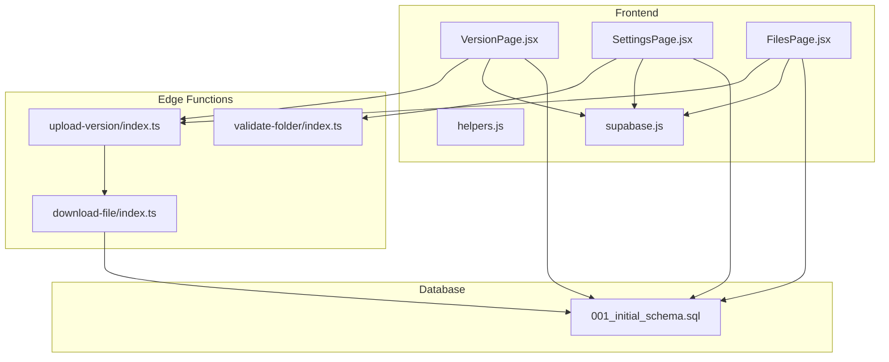
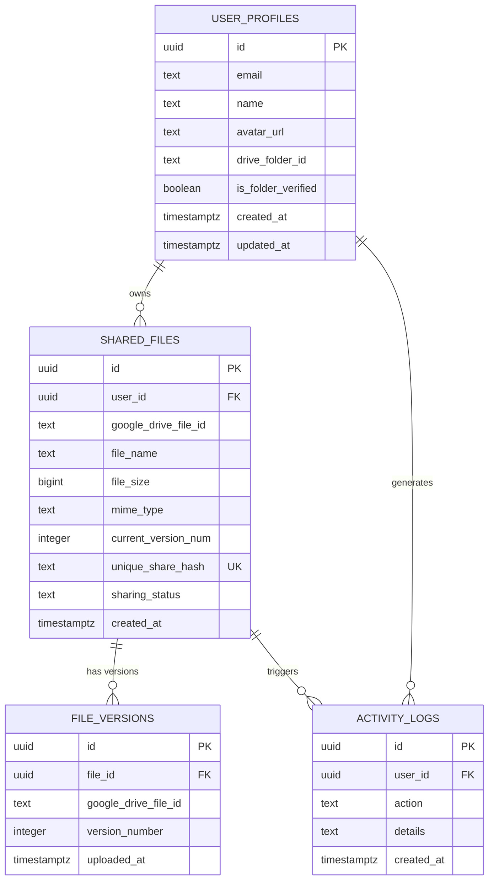
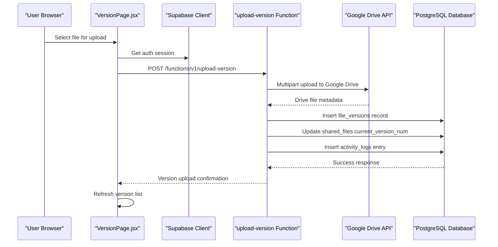
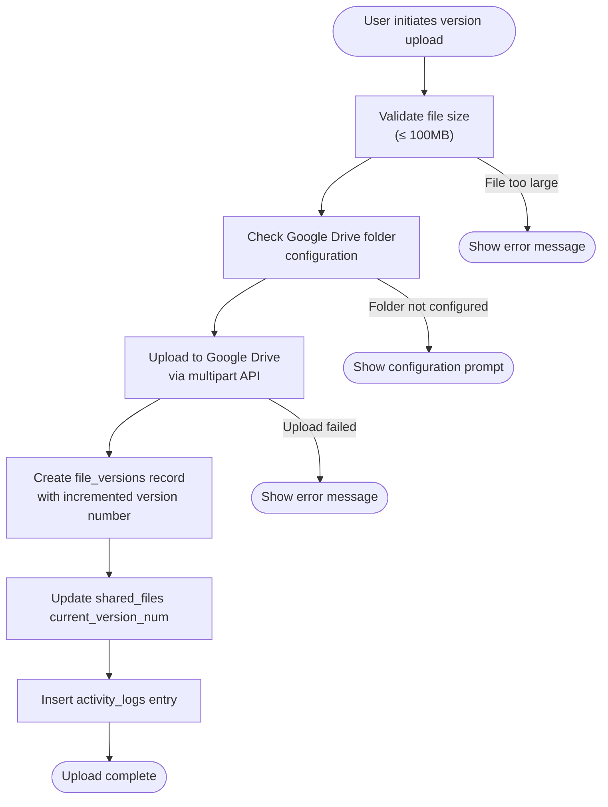
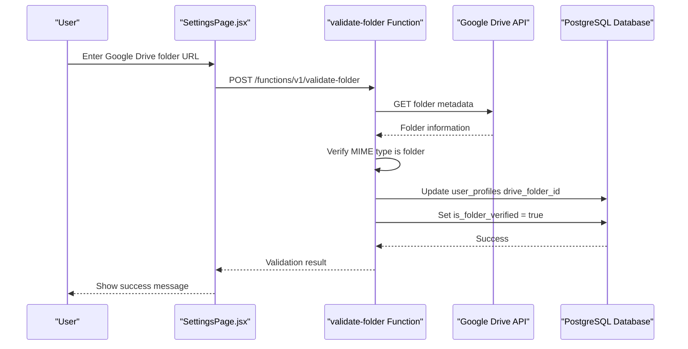
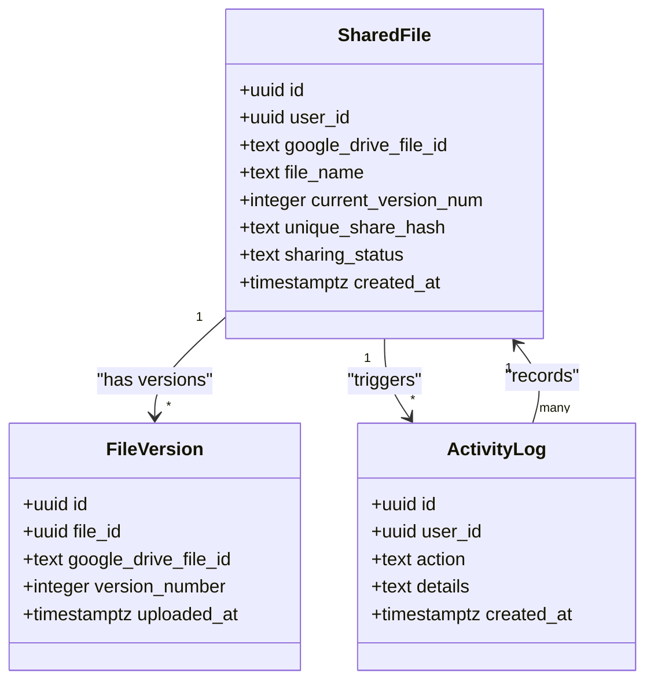
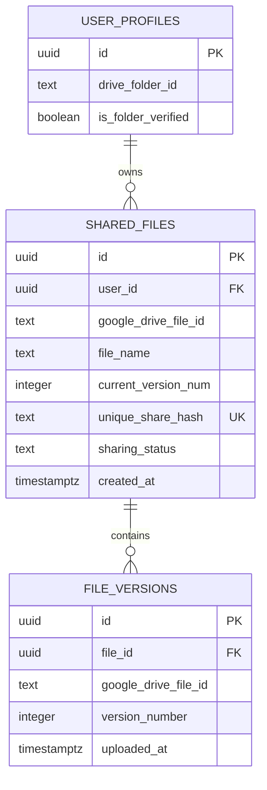
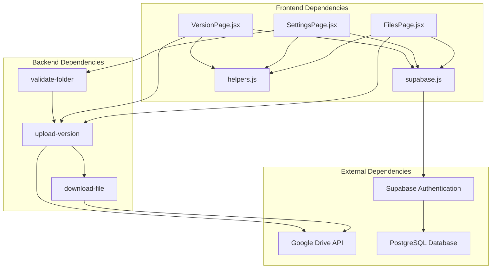

# Version Control System

<cite>
**Referenced Files in This Document**
- [upload-version/index.ts](file://supabase/functions/upload-version/index.ts)
- [validate-folder/index.ts](file://supabase/functions/validate-folder/index.ts)
- [download-file/index.ts](file://supabase/functions/download-file/index.ts)
- [VersionPage.jsx](file://web/src/pages/VersionPage.jsx)
- [SettingsPage.jsx](file://web/src/pages/SettingsPage.jsx)
- [FilesPage.jsx](file://web/src/pages/FilesPage.jsx)
- [helpers.js](file://web/src/utils/helpers.js)
- [supabase.js](file://web/src/services/supabase.js)
- [001_initial_schema.sql](file://supabase/migrations/001_initial_schema.sql)
</cite>

## Table of Contents
1. [Introduction](#introduction)
2. [Project Structure](#project-structure)
3. [Core Components](#core-components)
4. [Architecture Overview](#architecture-overview)
5. [Detailed Component Analysis](#detailed-component-analysis)
6. [Dependency Analysis](#dependency-analysis)
7. [Performance Considerations](#performance-considerations)
8. [Troubleshooting Guide](#troubleshooting-guide)
9. [Conclusion](#conclusion)

## Introduction
This document provides comprehensive documentation for the version control system implemented in the Neo Files Transfer application. The system enables users to manage multiple versions of files stored in Google Drive while maintaining a persistent share link that always delivers the latest version. The implementation consists of frontend components for user interaction, backend edge functions for file operations, and a PostgreSQL database schema for version tracking and metadata storage.

The version control system follows a straightforward approach: each uploaded file starts at version 1, and subsequent uploads create new versions with incrementally higher version numbers. The latest version is automatically served when accessing shared links, ensuring seamless updates without requiring users to manually select versions.

## Project Structure
The version control system spans three main areas of the application:

- **Frontend (React)**: User interfaces for file management, version history, and settings
- **Backend Edge Functions (Deno)**: Serverless functions for file operations and validation
- **Database (PostgreSQL)**: Schema for storing file metadata, version records, and audit logs

**Diagram sources**
- [VersionPage.jsx:1-225](file://web/src/pages/VersionPage.jsx#L1-L225)
- [SettingsPage.jsx:1-251](file://web/src/pages/SettingsPage.jsx#L1-L251)
- [FilesPage.jsx:1-536](file://web/src/pages/FilesPage.jsx#L1-L536)
- [upload-version/index.ts:1-130](file://supabase/functions/upload-version/index.ts#L1-L130)
- [validate-folder/index.ts:1-87](file://supabase/functions/validate-folder/index.ts#L1-L87)
- [download-file/index.ts:1-131](file://supabase/functions/download-file/index.ts#L1-L131)
- [001_initial_schema.sql:1-289](file://supabase/migrations/001_initial_schema.sql#L1-L289)

**Section sources**
- [VersionPage.jsx:1-225](file://web/src/pages/VersionPage.jsx#L1-L225)
- [SettingsPage.jsx:1-251](file://web/src/pages/SettingsPage.jsx#L1-L251)
- [FilesPage.jsx:1-536](file://web/src/pages/FilesPage.jsx#L1-L536)
- [upload-version/index.ts:1-130](file://supabase/functions/upload-version/index.ts#L1-L130)
- [validate-folder/index.ts:1-87](file://supabase/functions/validate-folder/index.ts#L1-L87)
- [download-file/index.ts:1-131](file://supabase/functions/download-file/index.ts#L1-L131)
- [001_initial_schema.sql:1-289](file://supabase/migrations/001_initial_schema.sql#L1-L289)

## Core Components

### Database Schema
The system uses a normalized relational schema with the following key tables:

- **shared_files**: Stores primary file metadata and current version tracking
- **file_versions**: Maintains historical version records linked to shared_files
- **user_profiles**: Contains user preferences including Google Drive folder configuration
- **activity_logs**: Tracks user actions for audit purposes

**Diagram sources**
- [001_initial_schema.sql:42-103](file://supabase/migrations/001_initial_schema.sql#L42-L103)

### Frontend Components
The frontend provides three primary interfaces for version management:

- **VersionPage**: Dedicated interface for viewing and uploading file versions
- **FilesPage**: Main file management interface with version navigation
- **SettingsPage**: Configuration interface for Google Drive folder connection

**Section sources**
- [VersionPage.jsx:1-225](file://web/src/pages/VersionPage.jsx#L1-L225)
- [FilesPage.jsx:1-536](file://web/src/pages/FilesPage.jsx#L1-L536)
- [SettingsPage.jsx:1-251](file://web/src/pages/SettingsPage.jsx#L1-L251)

## Architecture Overview

The version control system follows a distributed architecture pattern with clear separation of concerns:

**Diagram sources**
- [VersionPage.jsx:50-116](file://web/src/pages/VersionPage.jsx#L50-L116)
- [upload-version/index.ts:11-129](file://supabase/functions/upload-version/index.ts#L11-L129)
- [001_initial_schema.sql:56-80](file://supabase/migrations/001_initial_schema.sql#L56-L80)

The architecture ensures that:
- File storage occurs in Google Drive for scalability and cost-effectiveness
- Metadata remains in the PostgreSQL database for fast querying and auditing
- Version history is maintained separately from the primary file reference
- User sessions are handled through Supabase Authentication

## Detailed Component Analysis

### Version Creation Logic

The version creation process follows a deterministic workflow:

**Diagram sources**
- [VersionPage.jsx:50-116](file://web/src/pages/VersionPage.jsx#L50-L116)
- [upload-version/index.ts:46-104](file://supabase/functions/upload-version/index.ts#L46-L104)

Key implementation details:
- Maximum file size: 100MB enforced at both frontend and backend levels
- Version numbering: Auto-incremented based on current_version_num field
- Storage: Google Drive handles actual file storage; database stores metadata references
- Atomic operations: Version creation and metadata updates occur in sequence

**Section sources**
- [VersionPage.jsx:50-116](file://web/src/pages/VersionPage.jsx#L50-L116)
- [upload-version/index.ts:46-104](file://supabase/functions/upload-version/index.ts#L46-L104)
- [001_initial_schema.sql:63-79](file://supabase/migrations/001_initial_schema.sql#L63-L79)

### Folder Validation Processes

The folder validation system ensures proper Google Drive integration:

**Diagram sources**
- [SettingsPage.jsx:42-93](file://web/src/pages/SettingsPage.jsx#L42-L93)
- [validate-folder/index.ts:9-86](file://supabase/functions/validate-folder/index.ts#L9-L86)

Validation criteria:
- Extract folder ID from URL using multiple pattern matching approaches
- Verify folder accessibility through Google Drive API
- Confirm MIME type is application/vnd.google-apps.folder
- Store validated folder ID in user profiles

**Section sources**
- [SettingsPage.jsx:42-93](file://web/src/pages/SettingsPage.jsx#L42-L93)
- [validate-folder/index.ts:14-61](file://supabase/functions/validate-folder/index.ts#L14-L61)

### Version History Management

The version history system provides comprehensive tracking:

**Diagram sources**
- [001_initial_schema.sql:56-91](file://supabase/migrations/001_initial_schema.sql#L56-L91)

Version history features:
- Sorted display with newest versions first
- Current version highlighting with visual indicators
- Timestamp-based ordering for chronological browsing
- Separate version records for audit trail

**Section sources**
- [VersionPage.jsx:23-48](file://web/src/pages/VersionPage.jsx#L23-L48)
- [001_initial_schema.sql:73-83](file://supabase/migrations/001_initial_schema.sql#L73-L83)

### Database Implementation

The database implementation supports efficient version management through strategic indexing and relationships:

**Diagram sources**
- [001_initial_schema.sql:56-51](file://supabase/migrations/001_initial_schema.sql#L56-L51)

Key database design decisions:
- Foreign key relationships ensure referential integrity
- Indexes on frequently queried columns (user_id, share_hash, file_id)
- Separate version table prevents bloating of shared_files table
- Unique constraints prevent duplicate share hashes

**Section sources**
- [001_initial_schema.sql:56-103](file://supabase/migrations/001_initial_schema.sql#L56-L103)

### Frontend Components for Version Management

The frontend components provide intuitive user interfaces:

#### VersionPage Component
The dedicated version management interface offers:
- File selection with size validation
- Real-time upload progress indication
- Version list with current version highlighting
- Activity logging integration

#### FilesPage Integration
The main file management interface includes:
- Version count display in file table
- Direct navigation to version management
- Status indicators for sharing configuration
- Bulk operations support

#### SettingsPage Integration
The settings interface manages:
- Google Drive folder verification
- Folder connectivity status display
- Error handling for invalid configurations

**Section sources**
- [VersionPage.jsx:1-225](file://web/src/pages/VersionPage.jsx#L1-L225)
- [FilesPage.jsx:459-466](file://web/src/pages/FilesPage.jsx#L459-L466)
- [SettingsPage.jsx:168-216](file://web/src/pages/SettingsPage.jsx#L168-L216)

## Dependency Analysis

The version control system exhibits clear dependency relationships:

**Diagram sources**
- [VersionPage.jsx:1-8](file://web/src/pages/VersionPage.jsx#L1-L8)
- [SettingsPage.jsx:1-7](file://web/src/pages/SettingsPage.jsx#L1-L7)
- [FilesPage.jsx:1-11](file://web/src/pages/FilesPage.jsx#L1-L11)
- [upload-version/index.ts:1-2](file://supabase/functions/upload-version/index.ts#L1-L2)
- [validate-folder/index.ts:1-2](file://supabase/functions/validate-folder/index.ts#L1-L2)
- [download-file/index.ts:1-2](file://supabase/functions/download-file/index.ts#L1-L2)

Key dependency characteristics:
- Frontend components depend on shared Supabase client configuration
- Edge functions require environment variables for external service access
- Database schema defines strict relationships between entities
- Google Drive API integration requires proper OAuth configuration

**Section sources**
- [supabase.js:1-7](file://web/src/services/supabase.js#L1-L7)
- [upload-version/index.ts:22-26](file://supabase/functions/upload-version/index.ts#L22-L26)
- [validate-folder/index.ts:26-31](file://supabase/functions/validate-folder/index.ts#L26-L31)
- [download-file/index.ts:24-27](file://supabase/functions/download-file/index.ts#L24-L27)

## Performance Considerations

### Storage Architecture
The system employs a hybrid storage approach optimized for cost and performance:

- **Google Drive Storage**: Cost-effective for large file volumes
- **PostgreSQL Metadata**: Fast querying and indexing capabilities
- **Separate Version Records**: Prevents database bloat from frequent updates

### Query Optimization
Database queries are optimized through strategic indexing:

- Composite indexes on frequently filtered columns
- Proper foreign key relationships for efficient joins
- Limited column selections to reduce network overhead

### Caching Strategies
Recommended caching approaches:
- Frontend component caching for version lists
- CDN integration for shared file downloads
- Database query result caching for frequently accessed metadata

### Scalability Factors
- Horizontal scaling of edge functions
- Database connection pooling
- CDN distribution for file delivery
- Rate limiting for API endpoints

## Troubleshooting Guide

### Common Issues and Solutions

#### Version Upload Failures
**Symptoms**: Upload requests fail with error messages
**Causes**: 
- File size exceeding 100MB limit
- Missing Google Drive folder configuration
- Network connectivity issues
- Authentication failures

**Resolutions**:
- Verify file size compliance before upload
- Ensure Google Drive folder is properly configured
- Check network connectivity and retry
- Re-authenticate user session

#### Version History Not Loading
**Symptoms**: Version list appears empty or shows loading indefinitely
**Causes**:
- Database connection issues
- Missing user permissions
- Network timeouts

**Resolutions**:
- Verify database connectivity
- Check user authentication status
- Increase timeout thresholds if needed

#### Download Issues
**Symptoms**: Shared links fail to deliver files
**Causes**:
- Google Drive sharing configuration problems
- Expired authentication tokens
- File deletion from Google Drive

**Resolutions**:
- Verify Google Drive sharing settings
- Regenerate shared links if tokens expire
- Ensure files remain accessible in Google Drive

**Section sources**
- [VersionPage.jsx:54-62](file://web/src/pages/VersionPage.jsx#L54-L62)
- [FilesPage.jsx:106-109](file://web/src/pages/FilesPage.jsx#L106-L109)
- [download-file/index.ts:46-55](file://supabase/functions/download-file/index.ts#L46-L55)

## Conclusion

The Neo Files Transfer version control system provides a robust, scalable solution for managing file versions while maintaining seamless user experiences. The implementation successfully balances technical requirements with user-friendly interfaces through:

- Clear separation of concerns between storage and metadata
- Efficient database design with proper indexing and relationships
- Intuitive frontend components for version management
- Comprehensive error handling and validation
- Scalable architecture leveraging cloud services

The system's strength lies in its simplicity and reliability, enabling users to focus on file management rather than version control complexities. Future enhancements could include automated cleanup policies, advanced conflict resolution strategies, and expanded sharing capabilities while maintaining the current architectural strengths.