# 🚀 Neo Files Transfer

A premium, secure, and responsive file management, sharing, and transfer ecosystem. Built with **React** (Vite) for the web client, **Flutter** for the cross-platform mobile client, **Supabase** for secure auth & metadata storage, and a dedicated **Render Proxy** for high-volume streaming. The frontend design is inspired by premium Dribbble Moneta aesthetics, coupled with robust security control.

---

## ✨ Features

### 📁 File Management & Storage
- **Drag & Drop Upload:** Securely upload files of any type using a smooth, interactive drag-and-drop wizard.
- **Supabase Storage Integration:** High-performance storage buckets configured with granular permissions.
- **Interactive Directory Structure:** Seamlessly manage folders, rename files, and delete items.

### ⏱️ Version Control & History
- **File Versioning:** Upload new versions of the same file to keep a complete change history.
- **Revert & Download:** Instantly browse and download historical versions or revert to a previous state.

### 🔗 Advanced Sharing System
- **Public & Private Links:** Generate shareable URLs with secure hash parameters.
- **Access Control:** Enable public access toggles and verification requirements for shared folders.

### 🛡️ Administration & Security
- **Multi-Step Access Request:** Landing page access request form featuring secure email OTP verification.
- **Super Admin Roles:** Granular administrative roles allowing only the Super Admin to promote/demote or add other administrators.
- **Postgres Realtime Updates:** Live sync statistics, user statuses, and settings changes across the dashboard using PostgreSQL replication channels (`postgres_changes`).
- **Row-Level Security (RLS):** Strict database schema RLS policies protecting every single query, ensuring users can only read/write their own files.
- **IP-Based Rate Limiting:** Cooldown periods and request limiters implemented inside Supabase Edge Functions to prevent brute-force attacks.

---

## 🛠️ Technology Stack

| Layer | Technologies |
| :--- | :--- |
| **Web Frontend** | React (Vite), Tailwind CSS, Lucide Icons, HTML5 History API |
| **Mobile Client** | Flutter (Dart SDK), Supabase Flutter SDK, Dio Client, Lucide Icons |
| **Database & Auth** | Supabase (Authentication, PostgreSQL Database, Realtime Channels) |
| **Edge Functions** | Deno (SMTP verification email delivery, fallback downloads, user moderation) |
| **Proxy & Zip Compiler** | Render (Express, Node.js, Archiver dynamic streams) |
| **High-Speed CDN Edge Worker** | Cloudflare Workers (Fast single-file downloads & stream pipe) |

---

## 🏗️ Architecture & Workflow

The platform leverages **React** for client-side rendering, **Supabase** for user access control/metadata tracking, and a multi-layered backend split between **Cloudflare Workers** (for high-speed, zero-cold-start single file downloads), **Supabase Edge Functions** (for regional utility APIs), and a **Render Proxy Server** (for folder ZIP compilation on-the-fly).

Below is the flowchart representing the platform's multi-layered tree storage hierarchy, direct uploads, and zipped/streamed download architecture:

```mermaid
graph TD
    %% Styling
    classDef client fill:#312e81,stroke:#6366f1,stroke-width:2px,color:#fff;
    classDef edge fill:#1e1b4b,stroke:#8b5cf6,stroke-width:2px,color:#fff;
    classDef proxy fill:#4c1d95,stroke:#a78bfa,stroke-width:2px,color:#fff;
    classDef db fill:#064e3b,stroke:#10b981,stroke-width:2px,color:#fff;
    classDef ext fill:#7c2d12,stroke:#f97316,stroke-width:2px,color:#fff;
    classDef cf fill:#d97706,stroke:#f59e0b,stroke-width:2px,color:#fff;

    subgraph Client ["Client Apps"]
        A[Web Dashboard / Landing]:::client
        B[Web Download Page]:::client
        M[Flutter Mobile App]:::client
    end

    subgraph Backend ["Supabase Backend Layer"]
        D[Supabase Database PostgreSQL]:::db
        E[Supabase Auth / RLS]:::db
        
        subgraph EdgeFuncs ["Supabase Edge Functions Deno"]
            F[upload-file]:::edge
            G[create-folder]:::edge
            H[download-file]:::edge
        end
    end

    subgraph CloudflareEdge ["Cloudflare Edge Network"]
        W[Cloudflare Worker Proxy]:::cf
    end

    subgraph RenderProxy ["Proxy Server (Render Node.js)"]
        P[Render Proxy Express]:::proxy
    end

    subgraph External ["External Services"]
        I[Google Drive API]:::ext
        J[Google OAuth & Refresh]:::ext
    end

    %% Flows
    A -->|OAuth login| E
    M -->|OAuth login| E
    E -->|Tokens| D
    
    A -->|1. Create Folder| G
    G -->|Create Folder Object| I
    G -->|Save Metadata with parent_folder_id| D
    
    A -->|2. Upload File / Folder Tree - Direct| I
    A -->|3. Register metadata| D
    
    B & M -->|Query metadata| D
    
    %% Downloads Decision routing
    B -->|Download single file| W
    B -->|Download folder| P
    M -->|Direct single file download| W
    
    W -->|Retrieve Owner Google Tokens| D
    W -->|Fetch alt=media stream| I
    W -->|Direct stream response| B
    W -->|Direct stream response| M
    
    P -->|Retrieve Owner Google Tokens| D
    P -->|Fetch alt=media stream| I
    P -->|Stream file / compile dynamic ZIP| P
    P -->|Direct stream to Client| B

    H & F & G & P & W -->|If 401 Unauthorized| J
    J -->|New Access Token| D
```



### Key Workflow Explanations:
1. **Google Auth & Token Storage**: Users sign in via Google OAuth. The retrieved access and refresh tokens are safely stored in the `user_profiles` database table.
2. **Directory & Tree Uploads**: When users upload nested directories or folders, directories are created parent-first, and files are linked to their corresponding database parents (`parent_folder_id` referencing `shared_files(id) ON DELETE CASCADE`).
3. **High-Speed Direct Client Uploads**: Uploading files bypasses backend servers. The React frontend negotiates a resumable session directly with Google Drive using the owner's `accessToken` and uploads raw bytes directly from the client's browser, giving 100% full upload speed.
4. **Hybrid Download Streaming Routing**: Single files are routed through the serverless **Cloudflare Worker** on the edge network for instant, cold-start-free downloads at gigabit speeds. Folders are routed through the **Render Proxy** to prevent execution timeouts and compile ZIP archives on the fly using `archiver`. If the Cloudflare Worker is not configured, the app falls back to regional **Supabase Edge Functions** (`download-file`). All backend servers fetch the authenticated `alt=media` stream from the Google Drive API using the owner's credentials, bypassing Google's public download throttling.
5. **Mobile Downloads with Progress Bar**: The Flutter client fetches direct streaming URLs from the Cloudflare Worker and handles storage downloading natively using `Dio` chunk stream listeners, rendering a smooth progress bar overlay for files.
6. **On-the-fly ZIP Compilation**: When a shared folder is downloaded, the Render Proxy queries all child elements recursively, downloads their binary contents in parallel, packages them into a standard `.zip` archive on the fly using `archiver`, and streams the ZIP file directly to the guest browser.
7. **Token Auto-Refresh Middleware**: Deno Edge Functions, Cloudflare Workers, and the Render Proxy automatically intercept Google API `401 Unauthorized` responses, exchange the owner's refresh token for a fresh access token, save it to the DB, and resume the operation seamlessly.

---


## 🚀 Getting Started

### Prerequisites
- Node.js (v18+)
- Flutter SDK (v3.12+) & Dart SDK (for mobile app)
- Supabase CLI
- Google OAuth Console Credentials (optional, for Google Auth)
- Gmail SMTP credentials (for email OTP service)

### 1. Backend Setup (Supabase)
Initialize Supabase and apply migrations to your local or cloud database:
```bash
# Link project to your Supabase cloud application
supabase link --project-ref your_project_ref

# Push database migrations to apply schemas & security policies
supabase db push
```

#### Set Secrets & Env Variables
Set your Edge Function secrets in the Supabase Cloud Console:
```bash
# Set SMTP credentials for OTP and notification emails
supabase secrets set SMTP_USER="your-email@gmail.com" SMTP_PASS="your-app-password"

# Set Google OAuth Credentials
supabase secrets set GOOGLE_CLIENT_ID="your-google-client-id" GOOGLE_CLIENT_SECRET="your-google-client-secret"
```

#### Deploy Edge Functions
Deploy Deno Edge Functions to handle backend-restricted operations like email delivery and admin tasks:
```bash
supabase functions deploy mail-service
supabase functions deploy download-file
```

### 2. Frontend Setup (React App)
Navigate to the `web` folder and set up environment variables:

Create a `.env` file inside the `web` directory:
```env
VITE_SUPABASE_URL=https://your-project-ref.supabase.co
VITE_SUPABASE_ANON_KEY=your-supabase-anon-key
VITE_APP_URL=http://localhost:5173
VITE_PROXY_URL=http://localhost:3000   # Render Proxy URL (optional, for large file downloads)
```

Install dependencies and start the development server:
```bash
cd web
npm install
npm run dev
```

The web client will be active at `http://localhost:5173`.

### 3. Mobile Setup (Flutter App)
Navigate to the `mobile` folder and install dependencies:
```bash
cd mobile
flutter pub get
```

Set up configurations inside `mobile/lib/config.dart` (or follow the project config guidelines to specify Supabase URLs, client keys, and Proxy API endpoints).
Run the app:
```bash
flutter run
```

---

## 📂 Project Structure

```text
├── supabase/                      # Supabase Database & Edge Functions
│   ├── functions/                 # Deno Edge Functions (e.g. mail-service, download-file)
│   ├── migrations/                # Database schemas & SQL RLS Policies
│   └── config.toml                # Supabase configuration file
├── web/                           # Vite + React Frontend Client
│   ├── src/
│   │   ├── assets/                # Images & icons
│   │   ├── contexts/              # React Contexts (Auth and State)
│   │   ├── layouts/               # Page Layout wrappers (Admin/Dashboard/Main)
│   │   ├── pages/                 # Public, User & Admin View pages
│   │   └── services/              # Supabase Client initializations
│   ├── tailwind.config.js         # Tailwind styling tokens & system configuration
│   └── vite.config.js             # Vite configurations
├── mobile/                        # Flutter Mobile App Client
│   ├── android/                   # Native Android resources
│   ├── ios/                       # Native iOS resources
│   └── lib/                       # Dart codebase (screens, widgets, config)
├── proxy/                         # Node.js Express Proxy Server (Render)
└── README.md                      # Documentation
```

---

## 🔒 Security Practices
- **No Hardcoded Secrets:** All credentials, database secrets, and SMTP passwords are set as environment variables / vault secrets.
- **Strict RLS Policies:** Write, read, and delete operations are restricted using PostgreSQL custom roles and JWT user contexts.
- **Offloaded Admin Operations:** Administrative actions (like account deletion/suspension) are offloaded to signature-verified Supabase Edge Functions.

---

## 📄 License
This project is licensed under the MIT License. See [LICENSE](LICENSE) for details.
