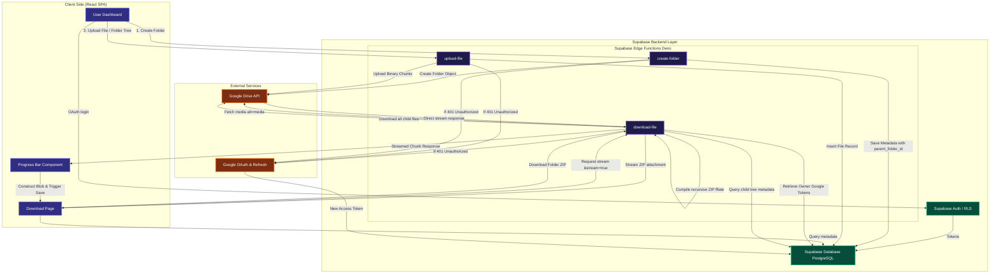

# 🚀 Neo Files Transfer

A premium, secure, and responsive web-based file management and transfer platform. Built with **React**, **Tailwind CSS**, and **Supabase**, this project provides a seamless user experience (inspired by premium Dribbble Moneta designs) coupled with enterprise-grade security features.

---

## ✨ Features

### 📁 File Management & Storage
- **Drag & Drop Upload:** Securely upload files of any type using a smooth, interactive drag-and-drop wizard.
- **Supabase Storage Integration:** High-performance storage buckets configured with granular permissions.
- **Interactive Directory Structure:** Seamlessly manage folders, rename files, and delete items.

### ⏱️ Version Control & History
- **File Versioning:** Upload new versions of the same file to keep a complete change history.
- **Revert & Download:** Instantly browse and download historical versions or revert to a previous state.

### 🔗 Advanced Sharing System
- **Public & Private Links:** Generate shareable URLs with secure hash parameters.
- **Access Control:** Enable public access toggles and verification requirements for shared folders.

### 🛡️ Administration & Security
- **Multi-Step Access Request:** Landing page access request form featuring secure email OTP verification.
- **Super Admin Roles:** Granular administrative roles allowing only the Super Admin to promote/demote or add other administrators.
- **Postgres Realtime Updates:** Live sync statistics, user statuses, and settings changes across the dashboard using PostgreSQL replication channels (`postgres_changes`).
- **Row-Level Security (RLS):** Strict database schema RLS policies protecting every single query, ensuring users can only read/write their own files.
- **IP-Based Rate Limiting:** Cooldown periods and request limiters implemented inside Supabase Edge Functions to prevent brute-force attacks.

---

## 🛠️ Technology Stack

| Layer | Technologies |
| :--- | :--- |
| **Frontend** | React (Vite), Tailwind CSS, Lucide Icons, HTML5 History API |
| **Backend & Database** | Supabase (Authentication, PostgreSQL Database, Storage Buckets, Realtime Channels) |
| **Edge Functions** | Deno, Nodemailer (SMTP Server Integration) |

---

## 🏗️ Architecture & Workflow

The platform leverages **React** for client-side rendering, **Supabase** for user access control/metadata tracking, and Deno-based **Supabase Edge Functions** as a middleware proxy to interact with **Google Drive API** securely.

Below is the flowchart representing the platform's multi-layered tree storage hierarchy, batch uploads, and zipped on-the-fly streaming download architecture:



### Key Workflow Explanations:
1. **Google Auth & Token Storage**: Users sign in via Google OAuth. The retrieved tokens (access & refresh) are safely encrypted and synchronized in the `user_profiles` database table.
2. **Directory & Tree uploads**: When users upload nested directories or folders, directories are created parent-first, and files are linked to their corresponding database parents (`parent_folder_id` referencing `shared_files(id) ON DELETE CASCADE`).
3. **Chunked Stream Downloads**: For single files, the download client reads stream blocks chunk-by-chunk using `ReadableStream` to render the dynamic progress bar (0 to 100%) and then creates a local blob to save to the system.
4. **On-the-fly ZIP Compilation**: When shared folders are requested for download, the Deno Edge Function (`download-file`) queries all child elements recursively, downloads their binary contents in parallel from Google Drive, wraps them into a ZIP archive structure on-the-fly using `fflate`, and streams the ZIP file directly.
5. **Token Auto-Refresh Middleware**: The Edge Functions automatically intercept Google API `401 Unauthorized` responses, exchange the owner's refresh token for a fresh access token, save it to the DB, and resume the operation seamlessly.

---


## 🚀 Getting Started

### Prerequisites
- Node.js (v18+)
- Supabase CLI
- Google OAuth Console Credentials (optional, for Google Auth)
- Gmail SMTP credentials (for email OTP service)

### 1. Backend Setup (Supabase)
Initialize Supabase and apply migrations to your local or cloud database:
```bash
# Link project to your Supabase cloud application
supabase link --project-ref your_project_ref

# Push database migrations to apply schemas & security policies
supabase db push
```

#### Set Secrets & Env Variables
Set your Edge Function secrets in the Supabase Cloud Console:
```bash
# Set SMTP credentials for OTP and notification emails
supabase secrets set SMTP_USER="your-email@gmail.com" SMTP_PASS="your-app-password"

# Set Google OAuth Credentials
supabase secrets set GOOGLE_CLIENT_ID="your-google-client-id" GOOGLE_CLIENT_SECRET="your-google-client-secret"
```

#### Deploy Edge Functions
Deploy Deno Edge Functions to handle backend-restricted operations like email delivery and admin tasks:
```bash
supabase functions deploy mail-service
```

### 2. Frontend Setup (React App)
Navigate to the `web` folder and set up environment variables:

Create a `.env` file inside the `web` directory:
```env
VITE_SUPABASE_URL=https://your-project-ref.supabase.co
VITE_SUPABASE_ANON_KEY=your-supabase-anon-key
VITE_APP_URL=http://localhost:5173
```

Install dependencies and start the development server:
```bash
cd web
npm install
npm run dev
```

The web client will be active at `http://localhost:5173`.

---

## 📂 Project Structure

```text
├── supabase/                      # Supabase Database & Edge Functions
│   ├── functions/                 # Deno Edge Functions (e.g. mail-service, download-file)
│   ├── migrations/                # Database schemas & SQL RLS Policies
│   └── config.toml                # Supabase configuration file
├── web/                           # Vite + React Frontend Client
│   ├── src/
│   │   ├── assets/                # Images & icons
│   │   ├── contexts/              # React Contexts (Auth and State)
│   │   ├── layouts/               # Page Layout wrappers (Admin/Dashboard/Main)
│   │   ├── pages/                 # Public, User & Admin View pages
│   │   └── services/              # Supabase Client initializations
│   ├── tailwind.config.js         # Tailwind styling tokens & system configuration
│   └── vite.config.js             # Vite configurations
└── README.md                      # Documentation
```

---

## 🔒 Security Practices
- **No Hardcoded Secrets:** All credentials, database secrets, and SMTP passwords are set as environment variables / vault secrets.
- **Strict RLS Policies:** Write, read, and delete operations are restricted using PostgreSQL custom roles and JWT user contexts.
- **Offloaded Admin Operations:** Administrative actions (like account deletion/suspension) are offloaded to signature-verified Supabase Edge Functions.

---

## 📄 License
This project is licensed under the MIT License. See [LICENSE](LICENSE) for details.
